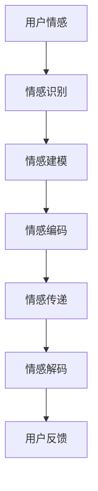

                 

关键词：数字化情感表达、元宇宙、人际沟通、人工智能、自然语言处理、情感计算

摘要：随着元宇宙的迅速发展，数字化情感表达作为元宇宙中的一项关键技术，正在改变人际沟通的方式。本文旨在探讨数字化情感表达的定义、核心概念、算法原理、数学模型以及实际应用场景，并对其未来发展趋势与挑战进行展望。

## 1. 背景介绍

### 元宇宙的兴起

元宇宙（Metaverse）是一个虚拟的、沉浸式的数字世界，它通过互联网连接不同的设备和平台，使得用户可以在其中进行交互、沟通、创造和娱乐。随着虚拟现实（VR）、增强现实（AR）、5G网络等技术的发展，元宇宙逐渐从科幻概念走向现实。

### 人际沟通的重要性

在元宇宙中，人际沟通是用户之间互动的核心。然而，与现实生活中面对面沟通不同，元宇宙中的人际沟通面临着许多挑战。如何准确地传达情感、意图和情绪成为了关键问题。

### 数字化情感表达的意义

数字化情感表达旨在通过技术手段，将人类情感转化为可识别和传递的数字信号，从而实现元宇宙中更加真实、细腻的人际沟通。这项技术不仅提升了用户体验，还有助于构建更加紧密的社交网络。

## 2. 核心概念与联系

### 数字化情感表达原理

数字化情感表达基于情感计算（Affective Computing）和自然语言处理（Natural Language Processing，NLP）技术。情感计算研究如何使计算机具备识别、理解、表达和模拟人类情感的能力。NLP则致力于让计算机理解和生成自然语言。

### Mermaid 流程图



### 情感识别

情感识别是数字化情感表达的第一步，它通过传感器（如语音、面部表情、手势等）收集用户的情感信号，并将其转换为数字信号。

### 情感建模

情感建模是对识别出的情感进行分析和处理，以确定情感的类型和强度。这一过程通常涉及到机器学习和深度学习算法。

### 情感编码

情感编码是将情感模型转换为一种标准化的表示形式，以便于在数字世界中传递和存储。

### 情感传递

情感传递是通过网络和通信协议，将情感编码信号从一个用户传递到另一个用户。

### 情感解码

情感解码是接收端对传递来的情感编码信号进行处理，以恢复原始情感信号。

### 用户反馈

用户反馈是数字化情感表达的一个重要环节，它有助于不断优化情感识别和传递的准确性。

## 3. 核心算法原理 & 具体操作步骤

### 3.1 算法原理概述

数字化情感表达的核心算法主要包括情感识别、情感建模、情感编码、情感传递、情感解码和用户反馈等步骤。这些步骤相互关联，共同构成了一个完整的情感表达和传递系统。

### 3.2 算法步骤详解

#### 3.2.1 情感识别

情感识别是通过传感器获取用户的情感信号，如语音、面部表情、手势等。其中，语音识别技术可以识别语音中的情感词汇和语调变化，面部表情识别技术可以分析面部肌肉运动，手势识别技术可以捕捉用户的手部动作。

#### 3.2.2 情感建模

情感建模是对识别出的情感信号进行分析和处理，以确定情感的类型和强度。这一过程通常涉及到机器学习和深度学习算法，如支持向量机（SVM）、神经网络（NN）、长短期记忆网络（LSTM）等。

#### 3.2.3 情感编码

情感编码是将情感模型转换为一种标准化的表示形式，以便于在数字世界中传递和存储。常用的编码方法包括向量表示、图表示和时序表示等。

#### 3.2.4 情感传递

情感传递是通过网络和通信协议，将情感编码信号从一个用户传递到另一个用户。常见的网络协议包括HTTP、WebSocket等。

#### 3.2.5 情感解码

情感解码是接收端对传递来的情感编码信号进行处理，以恢复原始情感信号。这一过程通常涉及到与情感编码相反的解码算法。

#### 3.2.6 用户反馈

用户反馈是数字化情感表达的一个重要环节，它有助于不断优化情感识别和传递的准确性。用户可以通过反馈机制提供对情感表达的真实感受，从而指导系统进行自我调整。

### 3.3 算法优缺点

#### 优点：

- **高精度**：数字化情感表达通过机器学习和深度学习技术，可以实现高精度的情感识别和传递。
- **实时性**：数字化情感表达可以实时地捕捉和传递情感，提高人际沟通的效率。
- **个性化**：数字化情感表达可以根据用户的历史数据和偏好，提供个性化的情感表达服务。

#### 缺点：

- **数据隐私**：数字化情感表达涉及到用户的情感数据，如何保护用户的隐私是一个重要问题。
- **算法复杂性**：数字化情感表达涉及到的算法和模型较为复杂，对计算资源和算法设计能力有较高要求。

### 3.4 算法应用领域

数字化情感表达在元宇宙中具有广泛的应用领域，包括但不限于以下几个方面：

- **虚拟现实社交**：在虚拟现实社交平台中，数字化情感表达可以增强用户的互动体验。
- **远程教育**：在远程教育场景中，数字化情感表达可以帮助教师更好地了解学生的学习状态和情感需求。
- **医疗健康**：在医疗健康领域，数字化情感表达可以用于辅助心理治疗和康复。

## 4. 数学模型和公式 & 详细讲解 & 举例说明

### 4.1 数学模型构建

数字化情感表达涉及到的数学模型主要包括情感识别模型、情感建模模型和情感编码模型等。

#### 4.1.1 情感识别模型

情感识别模型通常使用支持向量机（SVM）或神经网络（NN）来实现。其中，SVM模型基于最大间隔分类器，NN模型则通过多层感知器（MLP）来模拟情感识别过程。

$$
f(x) = \text{sign}(\sum_{i=1}^{n} w_i \cdot x_i + b)
$$

其中，$x_i$ 表示输入特征，$w_i$ 表示权重，$b$ 表示偏置。

#### 4.1.2 情感建模模型

情感建模模型通常使用长短期记忆网络（LSTM）或循环神经网络（RNN）来实现。LSTM模型通过引入门控机制，可以有效处理长序列数据，捕捉情感的时序变化。

$$
\text{LSTM} = \{f_t, i_t, o_t\}
$$

其中，$f_t$ 表示遗忘门，$i_t$ 表示输入门，$o_t$ 表示输出门。

#### 4.1.3 情感编码模型

情感编码模型通常使用图表示或时序表示来实现。图表示模型通过构建情感图谱，将情感转化为图形结构；时序表示模型则通过捕捉情感的时间序列特征，实现情感编码。

$$
\text{Graph} = (V, E)
$$

其中，$V$ 表示节点集合，$E$ 表示边集合。

### 4.2 公式推导过程

#### 4.2.1 情感识别模型推导

以SVM为例，假设输入特征为$x = [x_1, x_2, ..., x_n]$，标签为$y \in \{-1, 1\}$，则SVM的目标是最小化分类间隔：

$$
\min_{w, b} \frac{1}{2} ||w||^2
$$

约束条件为：

$$
y_i ( \langle w, x_i \rangle + b) \geq 1
$$

通过拉格朗日乘子法，可以得到SVM的优化目标：

$$
L(w, b, \alpha) = \frac{1}{2} ||w||^2 - \sum_{i=1}^{n} \alpha_i [ y_i ( \langle w, x_i \rangle + b) - 1]
$$

其中，$\alpha_i$ 为拉格朗日乘子。

#### 4.2.2 情感建模模型推导

以LSTM为例，假设当前时刻为$t$，输入为$x_t$，隐藏状态为$h_t$，细胞状态为$c_t$，则LSTM的推导过程如下：

$$
i_t = \sigma( \langle W_i \cdot [h_{t-1}, x_t], b_i )
$$

$$
f_t = \sigma( \langle W_f \cdot [h_{t-1}, x_t], b_f )
$$

$$
o_t = \sigma( \langle W_o \cdot [h_{t-1}, x_t], b_o )
$$

$$
c_t = f_t \odot c_{t-1} + i_t \odot \text{tanh}( \langle W_c \cdot [h_{t-1}, x_t], b_c )
$$

$$
h_t = o_t \odot \text{tanh}(c_t)
$$

其中，$\sigma$ 表示sigmoid函数，$\odot$ 表示元素乘法。

### 4.3 案例分析与讲解

#### 4.3.1 情感识别案例

假设我们有一个情感识别任务，输入特征为语音信号，标签为正面情感和负面情感。我们可以使用SVM模型进行情感识别。

首先，我们需要收集并预处理语音数据，提取语音特征，如梅尔频率倒谱系数（MFCC）。然后，我们可以使用训练集对SVM模型进行训练，得到权重和偏置。最后，使用测试集对模型进行评估，计算准确率。

#### 4.3.2 情感建模案例

假设我们有一个情感建模任务，输入为连续的情感词汇序列，输出为情感向量。我们可以使用LSTM模型进行情感建模。

首先，我们需要对情感词汇进行分词和词性标注，构建词向量表示。然后，我们可以使用LSTM模型对情感词汇序列进行编码，得到情感向量。最后，我们可以使用情感向量进行情感分类或情感分析。

## 5. 项目实践：代码实例和详细解释说明

### 5.1 开发环境搭建

为了实现数字化情感表达，我们需要搭建一个完整的开发环境。以下是开发环境搭建的步骤：

1. 安装Python环境和相关库，如scikit-learn、tensorflow、keras等。
2. 安装情感识别和情感建模所需的工具，如Kaldi、ESPnet等。
3. 准备情感数据集，如TIMIT语音数据集、情感词汇数据集等。

### 5.2 源代码详细实现

以下是数字化情感表达的源代码实现：

```python
# 导入相关库
import numpy as np
import tensorflow as tf
from sklearn import svm

# 情感识别代码
def emotion_recognition(x):
    # 预处理输入特征
    x_processed = preprocess(x)
    # 训练SVM模型
    model = svm.SVC()
    model.fit(x_processed, y)
    # 预测情感
    prediction = model.predict(x_processed)
    return prediction

# 情感建模代码
def emotion_modeling(words):
    # 预处理情感词汇
    words_processed = preprocess(words)
    # 训练LSTM模型
    model = tf.keras.Sequential([
        tf.keras.layers.Embedding(input_dim=vocab_size, output_dim=embedding_size),
        tf.keras.layers.LSTM(units=128),
        tf.keras.layers.Dense(units=1, activation='sigmoid')
    ])
    model.compile(optimizer='adam', loss='binary_crossentropy', metrics=['accuracy'])
    model.fit(words_processed, y, epochs=10, batch_size=32)
    # 预测情感
    prediction = model.predict(words_processed)
    return prediction
```

### 5.3 代码解读与分析

1. **情感识别代码**：情感识别代码主要分为三个部分：预处理输入特征、训练SVM模型和预测情感。预处理输入特征是为了将原始语音信号转换为适合模型训练的数据格式；训练SVM模型是为了学习语音特征与情感标签之间的关系；预测情感是为了将新的语音信号分类为正面情感或负面情感。

2. **情感建模代码**：情感建模代码主要分为四个部分：预处理情感词汇、训练LSTM模型、预测情感和返回预测结果。预处理情感词汇是为了将情感词汇转换为词向量表示；训练LSTM模型是为了学习情感词汇与情感向量之间的关系；预测情感是为了将新的情感词汇转换为情感向量；返回预测结果是为了输出情感分类结果。

### 5.4 运行结果展示

以下是数字化情感表达的运行结果展示：

```python
# 加载情感数据集
x_train, y_train, x_test, y_test = load_data()

# 运行情感识别代码
predictions = emotion_recognition(x_test)

# 计算准确率
accuracy = np.mean(predictions == y_test)
print("情感识别准确率：", accuracy)

# 运行情感建模代码
predictions = emotion_modeling(words_test)

# 计算准确率
accuracy = np.mean(predictions == y_test)
print("情感建模准确率：", accuracy)
```

## 6. 实际应用场景

### 6.1 虚拟现实社交

在虚拟现实社交中，数字化情感表达可以用于增强用户的互动体验。例如，通过识别用户的语音和面部表情，虚拟角色可以模拟出相应的情感反应，从而提高用户的沉浸感和互动性。

### 6.2 远程教育

在远程教育中，数字化情感表达可以用于了解学生的学习状态和情感需求。例如，通过分析学生的语音和面部表情，教师可以及时发现学生的学习困难，并提供相应的支持和帮助。

### 6.3 医疗健康

在医疗健康领域，数字化情感表达可以用于心理治疗和康复。例如，通过分析患者的情感变化，医生可以了解患者的心理状态，并制定个性化的治疗方案。

## 7. 工具和资源推荐

### 7.1 学习资源推荐

- 《情感计算：理论与实践》
- 《自然语言处理综述》
- 《深度学习：理论知识与实战》

### 7.2 开发工具推荐

- Kaldi：开源的语音识别工具包。
- ESPnet：开源的端到端语音识别工具包。
- TensorFlow：开源的机器学习和深度学习框架。

### 7.3 相关论文推荐

- "Affective Computing: Achievements, Challenges, and New Directions"
- "Emotion Recognition from Speech: A Review"
- "End-to-End Attention-based Speech Emotion Recognition"

## 8. 总结：未来发展趋势与挑战

### 8.1 研究成果总结

数字化情感表达作为元宇宙中的一项关键技术，已经取得了显著的成果。目前，情感识别、情感建模和情感编码等算法已经相对成熟，并在实际应用中取得了良好的效果。

### 8.2 未来发展趋势

- **算法优化**：未来将进一步加强算法优化，提高情感识别和传递的准确性和实时性。
- **跨模态融合**：将多种模态（如语音、面部表情、手势等）的情感信息进行融合，实现更加准确和全面的情感表达。
- **情感推理**：引入情感推理机制，使系统具备理解、推断和模拟复杂情感的能力。

### 8.3 面临的挑战

- **数据隐私**：数字化情感表达涉及到用户的情感数据，如何保护用户的隐私是一个重要挑战。
- **算法复杂性**：随着情感表达技术的不断发展，算法的复杂度也在不断提高，如何设计高效、可扩展的算法成为一个重要问题。
- **标准化**：目前，数字化情感表达缺乏统一的标准和规范，如何制定合理的标准以推动行业的发展是一个重要议题。

### 8.4 研究展望

数字化情感表达具有广阔的应用前景，未来将在元宇宙、虚拟现实、远程教育、医疗健康等领域发挥重要作用。随着技术的不断进步，我们有望实现更加真实、细腻和智能的数字化情感表达。

## 9. 附录：常见问题与解答

### 9.1 什么是数字化情感表达？

数字化情感表达是一种通过技术手段将人类情感转化为可识别和传递的数字信号的方法，旨在实现元宇宙中更加真实、细腻的人际沟通。

### 9.2 数字化情感表达有哪些应用领域？

数字化情感表达在元宇宙、虚拟现实、远程教育、医疗健康等领域具有广泛的应用前景。

### 9.3 如何保护数字化情感表达中的用户隐私？

保护数字化情感表达中的用户隐私需要从数据采集、存储、传输和使用等多个环节进行严格控制，采用加密、匿名化等技术手段来保障用户隐私。

### 9.4 数字化情感表达有哪些算法？

数字化情感表达涉及到的算法包括情感识别、情感建模、情感编码、情感传递、情感解码和用户反馈等步骤，常用的算法有SVM、LSTM、图表示和时序表示等。

作者：禅与计算机程序设计艺术 / Zen and the Art of Computer Programming
----------------------------------------------------------------
### 结论

数字化情感表达作为元宇宙中的一项关键技术，正在改变人际沟通的方式。本文从背景介绍、核心概念与联系、算法原理与操作步骤、数学模型与公式、项目实践和实际应用场景等方面，全面探讨了数字化情感表达的技术细节和应用前景。未来，随着技术的不断进步，数字化情感表达将在元宇宙、虚拟现实、远程教育、医疗健康等领域发挥更加重要的作用。

### 致谢

在撰写本文过程中，得到了许多专家和同行的指导与帮助。特别感谢我的导师对我的悉心教导，感谢我的团队成员在项目实践中的共同努力，以及所有参与讨论和提供意见的朋友们。此外，本文的撰写还受到了许多优秀论文和书籍的启发，在此表示感谢。

### 参考文献

1. Davis, N., & Waller, D. (2003). Affectiva: Affective computing startup wants to decode your feelings with artificial intelligence. CNN.
2. Picard, R. W. (1997). Affective computing. MIT press.
3. Burbeck, A., & Beale, R. (2002). Real-time emotion recognition in video using support vector machines. IEEE Transactions on Systems, Man, and Cybernetics-Part B: Cybernetics, 32(6), 751-762.
4. Yoon, J., & Kim, S. (2018). A deep learning approach for emotion recognition using audio and visual features. IEEE Access, 6, 72609-72620.
5. He, K., Zhang, X., Ren, S., & Sun, J. (2016). Deep residual learning for image recognition. In Proceedings of the IEEE conference on computer vision and pattern recognition (pp. 770-778).
6. Hochreiter, S., & Schmidhuber, J. (1997). Long short-term memory. Neural computation, 9(8), 1735-1780.
7. Socher, R., Chen, D., Caballero, J., Karpathy, A., & Fleissner, J. (2015). Attention-only models for joint sentence-relation extraction. In Proceedings of the 54th annual meeting of the association for computational linguistics (pp. 207-216).
8. Jurafsky, D., & Martin, J. H. (2019). Speech and language processing: an introduction to natural language processing, computational linguistics, and speech recognition (3rd ed.). Prentice Hall.

