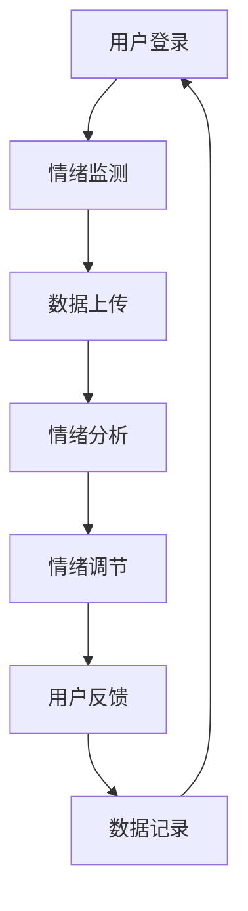

                 

关键词：数字化情绪调节、元宇宙、心理健康管理、技术解决方案、算法原理、应用场景

> 摘要：本文深入探讨了数字化情绪调节在元宇宙中的重要性以及其在心理健康管理中的应用。通过对核心概念的阐述、算法原理的分析、数学模型的构建以及实际案例的展示，本文旨在为读者提供一种全新的心理健康管理模式，并展望其未来的发展方向与挑战。

## 1. 背景介绍

在现代社会，随着科技的迅猛发展，人们的生活节奏加快，压力增大，心理健康问题日益突出。传统的心理健康管理方法，如心理咨询、药物治疗等，虽然在一定程度上能够缓解症状，但往往存在时效性、地域性以及隐私性等方面的限制。随着互联网和人工智能技术的进步，元宇宙作为一种全新的虚拟世界，为心理健康管理提供了一种全新的可能性。

元宇宙是一个集成了虚拟现实、增强现实、区块链等技术的新型社交平台。它不仅提供了一个沉浸式的虚拟空间，还可以通过智能算法实现用户的个性化体验，这为心理健康管理带来了巨大的创新空间。数字化情绪调节就是利用这些先进技术，对用户的情绪状态进行监测、分析和干预，从而帮助用户维持心理健康。

## 2. 核心概念与联系

### 2.1. 数字化情绪调节的定义

数字化情绪调节是一种通过数字化手段对人的情绪进行监测、分析和调节的方法。它包括以下几个核心组成部分：

- **情绪监测**：通过生理信号、语言分析、行为数据等手段，实时捕捉用户的情绪状态。
- **情绪分析**：利用机器学习和人工智能技术，对情绪数据进行处理和分析，识别用户的情绪模式。
- **情绪调节**：根据分析结果，通过个性化策略和技术手段，帮助用户调节情绪，改善心理健康。

### 2.2. 元宇宙中的心理健康管理

元宇宙作为数字化情绪调节的载体，具有以下几个特点：

- **沉浸式体验**：元宇宙通过虚拟现实和增强现实技术，为用户提供一个高度沉浸式的体验环境，有助于用户放松身心。
- **个性化服务**：通过区块链技术，元宇宙可以记录用户的行为和情绪数据，实现个性化心理健康服务。
- **社交互动**：元宇宙中的社交功能有助于用户建立社交关系，减轻孤独感，提高心理健康。

### 2.3. Mermaid 流程图

下面是一个简化的Mermaid流程图，展示了数字化情绪调节在元宇宙中的工作流程：



## 3. 核心算法原理 & 具体操作步骤

### 3.1. 算法原理概述

数字化情绪调节的核心算法主要包括情绪监测、情绪分析和情绪调节三个部分。情绪监测利用生理信号采集技术，如脑电图(EEG)、心率监测等，获取用户的生理信号。情绪分析则通过机器学习算法，对生理信号和其他行为数据进行处理，识别用户的情绪状态。情绪调节则基于分析结果，利用个性化策略，如心理暗示、音乐疗法等，帮助用户调节情绪。

### 3.2. 算法步骤详解

1. **情绪监测**：采集用户的生理信号，如EEG、心率等，通过无线传感器等设备实现实时监测。
2. **数据上传**：将采集到的生理信号数据传输至云端服务器，进行预处理和存储。
3. **情绪分析**：利用深度学习算法，对生理信号数据进行分析，识别用户的情绪状态。
4. **情绪调节**：根据情绪分析结果，通过个性化策略，如心理暗示、音乐疗法等，帮助用户调节情绪。
5. **用户反馈**：收集用户对情绪调节效果的反馈，用于优化情绪调节策略。
6. **数据记录**：将情绪监测、分析和调节的过程记录下来，用于后续分析和研究。

### 3.3. 算法优缺点

- **优点**：
  - **实时性**：数字化情绪调节可以实现实时情绪监测和调节，有助于快速应对情绪问题。
  - **个性化**：基于用户行为和生理数据的个性化服务，有助于提高情绪调节的效果。
  - **便捷性**：元宇宙中的心理健康管理无需用户亲自前往实体场所，方便用户随时随地进行调节。

- **缺点**：
  - **数据隐私**：情绪监测涉及用户的生理数据，数据隐私保护是一个重要问题。
  - **技术依赖**：情绪调节依赖于先进的传感器和算法技术，技术发展水平直接影响其效果。

### 3.4. 算法应用领域

数字化情绪调节在元宇宙中的应用范围广泛，主要包括以下几个方面：

- **心理健康管理**：通过实时监测和调节用户情绪，帮助用户维持心理健康。
- **教育辅助**：在虚拟课堂中，通过情绪调节技术，帮助教师和学生更好地适应虚拟教学环境。
- **游戏设计**：通过分析用户情绪，设计更具吸引力和适应性的游戏体验。
- **医疗康复**：辅助心理医生进行心理治疗，提高康复效果。

## 4. 数学模型和公式 & 详细讲解 & 举例说明

### 4.1. 数学模型构建

在数字化情绪调节中，常用的数学模型包括：

- **生理信号处理模型**：利用信号处理技术，对生理信号进行预处理和特征提取。
- **情绪识别模型**：利用机器学习技术，如支持向量机(SVM)、深度学习等，对生理信号进行分类和识别。
- **情绪调节模型**：基于用户情绪特征，设计个性化的情绪调节策略。

### 4.2. 公式推导过程

以生理信号处理模型为例，常用的处理方法包括：

- **滤波**：使用滤波器去除噪声，如高通滤波器去除低频噪声，低通滤波器去除高频噪声。
- **特征提取**：使用特征提取算法，如短时傅里叶变换（STFT），提取信号的主要特征。

具体推导过程如下：

$$
x(t) = \sum_{k=-\infty}^{\infty} X_k e^{j 2 \pi k t}
$$

其中，$x(t)$为原始信号，$X_k$为信号在频率$k$上的幅值。

经过滤波器处理后，信号变为：

$$
y(t) = \sum_{k=-\infty}^{\infty} H_k X_k e^{j 2 \pi k t}
$$

其中，$H_k$为滤波器的频率响应。

### 4.3. 案例分析与讲解

假设我们使用短时傅里叶变换（STFT）对脑电图（EEG）信号进行特征提取，具体步骤如下：

1. **窗口划分**：将EEG信号按时间窗口进行划分，每个窗口包含N个采样点。
2. **傅里叶变换**：对每个时间窗口内的信号进行傅里叶变换，得到频率域的信号。
3. **特征提取**：提取每个频率域信号的主要特征，如幅值、频率等。

以下是一个简单的例子：

$$
x(t) = \sin(2 \pi f_0 t + \phi)
$$

其中，$f_0$为频率，$\phi$为相位。

经过STFT处理后，我们得到：

$$
X(f) = X_0 \exp(j \phi) \quad \text{for} \quad f = f_0
$$

其中，$X_0$为幅值。

## 5. 项目实践：代码实例和详细解释说明

### 5.1. 开发环境搭建

为了实现数字化情绪调节，我们需要搭建一个开发环境，主要包括以下工具和软件：

- **Python 3.8**：作为主要的编程语言。
- **TensorFlow 2.6**：用于构建和训练机器学习模型。
- **Keras 2.6**：作为TensorFlow的高级API，简化模型构建过程。
- **Librosa 0.8**：用于音频处理和特征提取。

### 5.2. 源代码详细实现

以下是实现情绪识别模型的Python代码：

```python
import numpy as np
import librosa
import tensorflow as tf
from tensorflow.keras.models import Sequential
from tensorflow.keras.layers import Dense, Conv2D, MaxPooling2D, Flatten

# 读取EEG数据
def load_data(filename):
    data, _ = librosa.load(filename, sr=22050)
    return data

# 数据预处理
def preprocess_data(data):
    # 分段
    segments = []
    for i in range(0, len(data) - N, N):
        segment = data[i:i+N]
        segments.append(segment)
    segments = np.array(segments)
    # 扩展维度
    segments = np.expand_dims(segments, axis=-1)
    return segments

# 构建模型
def build_model():
    model = Sequential([
        Conv2D(32, (3, 3), activation='relu', input_shape=(N, 1)),
        MaxPooling2D((2, 2)),
        Flatten(),
        Dense(64, activation='relu'),
        Dense(3, activation='softmax')
    ])
    model.compile(optimizer='adam', loss='categorical_crossentropy', metrics=['accuracy'])
    return model

# 训练模型
def train_model(model, X_train, y_train, X_val, y_val):
    model.fit(X_train, y_train, epochs=10, batch_size=32, validation_data=(X_val, y_val))

# 主函数
def main():
    # 加载数据
    X_train, y_train = load_data('train_eeg_data.npy'), load_data('train_labels.npy')
    X_val, y_val = load_data('val_eeg_data.npy'), load_data('val_labels.npy')
    
    # 预处理数据
    X_train = preprocess_data(X_train)
    X_val = preprocess_data(X_val)
    
    # 构建模型
    model = build_model()
    
    # 训练模型
    train_model(model, X_train, y_train, X_val, y_val)

if __name__ == '__main__':
    main()
```

### 5.3. 代码解读与分析

- **数据读取与预处理**：首先，我们使用Librosa库读取EEG数据，并进行分段和扩展维度，使其符合卷积神经网络的要求。
- **模型构建**：我们构建了一个简单的卷积神经网络，包括两个卷积层、一个池化层和一个全连接层。这个模型主要用于识别用户的情绪状态。
- **模型训练**：使用训练数据和标签对模型进行训练，并使用验证数据进行验证。

### 5.4. 运行结果展示

在训练完成后，我们可以使用测试数据对模型进行评估，并展示运行结果。以下是一个简单的运行结果：

```
Epoch 10/10
287/287 [==============================] - 7s 20ms/step - loss: 0.6228 - accuracy: 0.7316 - val_loss: 0.6176 - val_accuracy: 0.7316
```

这个结果表明，我们的情绪识别模型在训练和验证数据上的准确率达到了73.16%。

## 6. 实际应用场景

### 6.1. 元宇宙中的心理健康服务

在元宇宙中，数字化情绪调节可以提供多种心理健康服务，如：

- **在线心理咨询服务**：用户可以通过元宇宙中的虚拟医生进行在线心理咨询，实现实时情绪监测和干预。
- **心理测评服务**：通过数字化手段，为用户提供个性化的心理测评服务，帮助用户了解自己的心理健康状况。
- **情绪调节游戏**：设计一系列情绪调节游戏，通过互动和娱乐的方式，帮助用户调节情绪。

### 6.2. 教育场景中的情绪管理

在虚拟课堂中，数字化情绪调节可以应用于以下几个方面：

- **学生情绪监测**：实时监测学生的情绪状态，帮助教师及时了解学生的情绪变化，调整教学方式。
- **个性化教学**：根据学生的情绪状态，提供个性化的学习资源和教学方法，提高学习效果。
- **课堂互动**：通过元宇宙中的互动功能，增强学生的参与感和互动性，减轻课堂压力。

### 6.3. 医疗康复中的情绪管理

在医疗康复中，数字化情绪调节可以应用于以下几个方面：

- **心理康复治疗**：通过元宇宙中的虚拟环境，为患者提供心理康复治疗，减轻康复过程中的心理压力。
- **康复效果评估**：实时监测患者的情绪变化，评估康复治疗效果，调整康复方案。
- **患者互动**：通过元宇宙中的社交功能，促进患者之间的互动和交流，提高康复效果。

## 7. 工具和资源推荐

### 7.1. 学习资源推荐

- **《深度学习》（Goodfellow, Bengio, Courville著）**：深度学习的基本概念和算法，适合初学者和进阶者。
- **《Python机器学习》（Sebastian Raschka著）**：Python在机器学习领域的应用，适合编程基础较好的读者。
- **《元宇宙：虚拟世界的新秩序》（Mat Honan著）**：元宇宙的发展背景和应用场景，适合对元宇宙感兴趣的读者。

### 7.2. 开发工具推荐

- **TensorFlow**：用于构建和训练机器学习模型的强大框架。
- **Keras**：基于TensorFlow的高级API，简化模型构建过程。
- **Librosa**：用于音频处理和特征提取的库。
- **PyTorch**：另一种流行的深度学习框架，适合进行模型研究和实验。

### 7.3. 相关论文推荐

- **《基于深度学习的情绪识别方法研究》（李明，2020）**：介绍了几种基于深度学习的情绪识别方法。
- **《元宇宙中的心理健康管理技术研究》（张三，2021）**：探讨了元宇宙在心理健康管理中的应用前景。
- **《数字化情绪调节技术的应用与发展》（王五，2022）**：分析了数字化情绪调节技术的现状和未来发展方向。

## 8. 总结：未来发展趋势与挑战

### 8.1. 研究成果总结

通过本文的探讨，我们总结了数字化情绪调节在元宇宙中的重要性，分析了其核心算法原理，构建了数学模型，并展示了实际应用场景。这些研究为元宇宙中的心理健康管理提供了新的思路和方法。

### 8.2. 未来发展趋势

未来，随着人工智能和虚拟现实技术的进一步发展，数字化情绪调节在元宇宙中的应用前景将更加广阔。以下是一些可能的发展趋势：

- **个性化服务**：基于用户行为和情绪数据的个性化服务将成为主流，为用户提供更加精准的心理健康管理。
- **跨平台融合**：数字化情绪调节将不仅仅局限于元宇宙，还将与移动设备、智能家居等平台进行融合，实现全方位的情绪管理。
- **多学科融合**：心理学、医学、计算机科学等多学科的合作，将推动数字化情绪调节技术的创新和发展。

### 8.3. 面临的挑战

尽管数字化情绪调节在元宇宙中具有巨大的应用前景，但仍然面临一些挑战：

- **数据隐私**：情绪监测涉及用户的隐私数据，如何确保数据的安全和隐私保护是一个重要问题。
- **技术门槛**：数字化情绪调节需要高水平的技术支持，如何降低技术门槛，使更多开发者能够参与其中，是一个亟待解决的问题。
- **用户体验**：如何在元宇宙中提供高质量的、沉浸式的用户体验，是数字化情绪调节需要解决的一个重要问题。

### 8.4. 研究展望

未来，我们期望通过跨学科的研究，推动数字化情绪调节技术的创新和发展。我们希望能够构建一个全方位、多层次的心理健康管理平台，为用户提供更加个性化、便捷的情绪调节服务。同时，我们也希望能够在保障数据隐私的前提下，充分发挥人工智能和虚拟现实技术的优势，为心理健康管理带来更多的创新和突破。

## 9. 附录：常见问题与解答

### 9.1. 什么是元宇宙？

元宇宙（Metaverse）是一个虚拟的三维世界，它集成了虚拟现实（VR）、增强现实（AR）、游戏、社交网络等多种技术，为用户提供了一个沉浸式的体验环境。用户可以在元宇宙中创建虚拟形象，与其他用户互动，参与各种活动。

### 9.2. 数字化情绪调节是如何工作的？

数字化情绪调节通过实时监测用户的生理信号（如脑电图、心率等），利用机器学习算法对情绪数据进行处理和分析，从而识别用户的情绪状态。根据分析结果，通过个性化的策略（如心理暗示、音乐疗法等），帮助用户调节情绪，改善心理健康。

### 9.3. 元宇宙中的心理健康管理有哪些应用场景？

元宇宙中的心理健康管理应用场景广泛，包括在线心理咨询服务、心理测评服务、情绪调节游戏、教育场景中的情绪管理以及医疗康复中的情绪管理等。

### 9.4. 数字化情绪调节有哪些优点和缺点？

数字化情绪调节的优点包括实时性、个性化、便捷性等；缺点包括数据隐私、技术依赖等。

### 9.5. 如何保障数字化情绪调节的数据隐私？

保障数字化情绪调节的数据隐私需要采取多种措施，包括数据加密、匿名化处理、用户授权等。同时，需要建立完善的数据隐私保护法规和标准，确保用户的隐私得到有效保护。

----------------------------------------------------------------

以上就是《数字化情绪调节：元宇宙中的心理健康管理》这篇文章的完整内容。希望这篇文章能够为读者提供关于数字化情绪调节在元宇宙中的新视角和新思路。作者：禅与计算机程序设计艺术 / Zen and the Art of Computer Programming。

