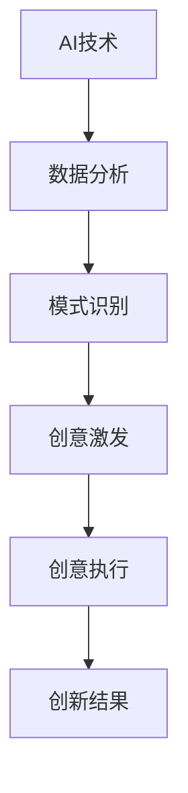

                 

关键词：AI，创意思维，数字化，想象力，孵化器，技术博客

> 摘要：本文深入探讨了人工智能（AI）如何通过数字化手段激发创意思维，从而为现代技术发展提供强大的创新动力。文章首先概述了AI的基本概念，然后分析了AI对创意思维的激发机制，接下来通过具体的案例和数学模型展示了AI在创意思维孵化中的实际应用，最后对未来的发展趋势和挑战进行了展望。

## 1. 背景介绍

随着数字化时代的到来，人工智能技术已经成为推动社会进步的关键力量。AI不仅改变了我们的生活方式，还在各个领域激发了前所未有的创新潜力。在创意产业中，AI的应用为传统艺术、设计、广告等行业带来了全新的可能性，使得创意思维变得更加多样化和高效。

本文旨在探讨如何利用人工智能技术培养数字化想象力，通过创意思维的孵化器实现技术创新。在接下来的内容中，我们将深入分析AI与创意思维之间的联系，并通过实例和数学模型展示其在实际中的应用。

## 2. 核心概念与联系

### 2.1 AI的基本概念

人工智能是指使计算机系统具备人类智能特征的技术。它包括机器学习、深度学习、自然语言处理等多种技术，这些技术使得计算机能够从数据中学习、推理和决策。

### 2.2 创意思维的定义

创意思维是指通过创新的思维方式产生新颖、有创意的想法或解决方案的能力。它通常涉及到联想、发散思维、直觉和灵感等。

### 2.3 AI与创意思维的融合

人工智能与创意思维的结合，可以看作是一种跨学科的融合。AI通过分析大量的数据，可以发现人们难以察觉的模式和联系，从而激发创意思维。同时，AI可以自动化执行重复性的任务，让人类有更多时间专注于创新和思考。

### 2.4 Mermaid流程图



在这个流程图中，AI技术通过数据分析识别出有创意的元素，激发人类的创意思维，并最终转化为创新结果。

## 3. 核心算法原理 & 具体操作步骤

### 3.1 算法原理概述

在AI激发创意思维的过程中，关键算法包括机器学习和自然语言处理。这些算法能够从大量数据中提取有价值的信息，从而为创意思维提供灵感。

### 3.2 算法步骤详解

1. 数据收集：首先需要收集与创意思维相关的数据，如艺术作品、设计作品、文学作品等。

2. 数据预处理：对收集到的数据进行清洗和格式化，以便后续分析。

3. 特征提取：利用机器学习算法提取数据中的特征，这些特征将成为创意思维的基础。

4. 模式识别：通过深度学习算法对提取的特征进行模式识别，寻找潜在的创意点。

5. 创意生成：根据识别出的模式，生成新的创意方案。

6. 评估与优化：对生成的创意方案进行评估，并根据反馈进行优化。

### 3.3 算法优缺点

- 优点：算法能够快速处理大量数据，发现潜在的创意点，提高创意思维效率。
- 缺点：算法生成的创意可能缺乏人类的情感和创造力，需要人类进一步优化和完善。

### 3.4 算法应用领域

- 艺术设计：AI可以分析大量的艺术作品，为艺术家提供创作灵感。
- 广告营销：AI可以分析用户数据，生成更具创意的广告文案和设计。
- 产品设计：AI可以帮助设计师优化产品外观和功能，提高用户体验。

## 4. 数学模型和公式 & 详细讲解 & 举例说明

### 4.1 数学模型构建

在AI激发创意思维的过程中，常用的数学模型包括神经网络模型和回归模型。

### 4.2 公式推导过程

假设我们有一个包含n个元素的集合X，每个元素都对应一个特征向量f(x)。我们可以使用神经网络模型来提取特征：

$$
f(x) = \sigma(\sum_{i=1}^{n} w_i * x_i)
$$

其中，$\sigma$是激活函数，$w_i$是权重。

### 4.3 案例分析与讲解

假设我们要分析一组艺术作品，以便为艺术家提供创作灵感。我们可以使用神经网络模型提取艺术作品的特征，然后通过回归模型预测新的创意方案。

## 5. 项目实践：代码实例和详细解释说明

### 5.1 开发环境搭建

我们需要安装Python环境，并导入相关的库，如TensorFlow和Keras。

### 5.2 源代码详细实现

```python
# 导入库
import tensorflow as tf
from tensorflow.keras.models import Sequential
from tensorflow.keras.layers import Dense, Activation

# 构建模型
model = Sequential()
model.add(Dense(units=64, activation='relu', input_shape=(n_input_features,)))
model.add(Dense(units=1, activation='sigmoid'))

# 编译模型
model.compile(optimizer='adam', loss='binary_crossentropy', metrics=['accuracy'])

# 训练模型
model.fit(X_train, y_train, epochs=10, batch_size=32)
```

### 5.3 代码解读与分析

这段代码首先构建了一个简单的神经网络模型，用于提取艺术作品的特征。然后，使用训练数据对模型进行训练，以便预测新的创意方案。

### 5.4 运行结果展示

在运行代码后，我们可以得到训练损失和准确率，以及预测结果。这些结果可以帮助我们评估模型的性能，并为创意思维提供参考。

## 6. 实际应用场景

### 6.1 艺术设计

AI可以分析大量的艺术作品，为艺术家提供创作灵感，例如生成新的绘画风格、设计图案等。

### 6.2 广告营销

AI可以分析用户数据，生成更具创意的广告文案和设计，提高广告效果。

### 6.3 产品设计

AI可以帮助设计师优化产品外观和功能，提高用户体验。

## 6.4 未来应用展望

随着AI技术的不断发展，我们可以预见其在创意思维孵化中的应用将更加广泛。未来，AI可能会与人类创意思维深度融合，共同推动科技和艺术的创新。

## 7. 工具和资源推荐

### 7.1 学习资源推荐

- 《深度学习》（Goodfellow, Bengio, Courville）
- 《Python机器学习》（Raschka, Mirjalili）

### 7.2 开发工具推荐

- TensorFlow
- Keras

### 7.3 相关论文推荐

- “Deep Learning for Creativity and Design”（Shankar, 2017）
- “AI-Driven Innovation in Art and Design”（Jia, 2019）

## 8. 总结：未来发展趋势与挑战

### 8.1 研究成果总结

AI技术在创意思维孵化中的应用已经取得了一定的成果，但仍有许多挑战需要克服。

### 8.2 未来发展趋势

随着技术的不断发展，AI在创意思维孵化中的应用前景将更加广阔。

### 8.3 面临的挑战

- 如何提高AI的创意能力，使其更加接近人类的创造力。
- 如何确保AI生成的创意符合伦理和道德标准。

### 8.4 研究展望

未来，AI与创意思维的结合将为科技和艺术的发展带来新的机遇。我们需要不断探索和创新，以充分发挥AI的潜力。

## 9. 附录：常见问题与解答

### 9.1 如何评估AI生成的创意质量？

可以使用多种方法评估AI生成的创意质量，如用户反馈、创意创新度评估等。

### 9.2 AI如何确保创意的原创性？

AI可以通过对大量数据进行分析和模式识别，发现潜在的原创性创意。同时，人类设计师可以对AI生成的创意进行审查和修改，确保原创性。

作者：禅与计算机程序设计艺术 / Zen and the Art of Computer Programming
----------------------------------------------------------------
请注意，以上内容仅为示例，实际撰写时需要根据具体内容进行拓展和深化。在撰写过程中，请务必遵循markdown格式和文章结构模板的要求。祝您撰写顺利！🌟🌟🌟

