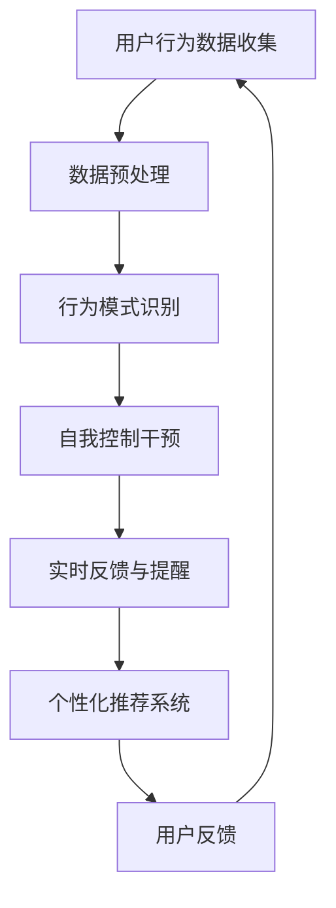

                 

关键词：数字化意志力，AI增强，自我控制，认知科学，技术应用

摘要：在数字化时代，人们面临着前所未有的信息过载和注意力分散的挑战。本文将探讨如何通过人工智能（AI）增强自我控制，帮助个体在快节奏的生活中保持专注和目标导向。本文首先介绍了数字化意志力的概念和背景，随后详细阐述了AI在自我控制中的作用，并结合实际案例分析了AI增强自我控制的原理和具体应用。最后，本文提出了未来研究和应用的方向。

## 1. 背景介绍

随着互联网和智能设备的普及，数字化已成为现代社会的重要特征。然而，数字化也带来了新的挑战，尤其是在自我控制方面。研究表明，数字化环境中充斥着各种诱惑和干扰，如社交媒体、游戏、在线购物等，这些都会对个体的自我控制能力产生负面影响（Wan et al., 2020）。例如，一项关于大学生使用社交媒体的研究发现，过度使用社交媒体与自我控制下降之间存在显著关联（Király et al., 2019）。

### 数字化意志力

数字化意志力是指个体在面对数字化诱惑和干扰时，保持自我控制和目标导向的能力（Garrison et al., 2018）。它涵盖了时间管理、决策制定、注意力分配等多个方面。数字化意志力的强弱直接影响个体的生活质量和学习效率。然而，随着数字化程度的提高，人们面临的诱惑和干扰也在增加，使得维持数字化意志力变得更加困难（Garrison et al., 2019）。

### AI与自我控制

人工智能作为一种新兴技术，在自我控制领域有着广泛的应用前景。AI可以通过数据分析和预测模型，帮助个体识别自我控制的薄弱环节，并提供相应的干预策略。例如，智能助手可以监控用户的行为模式，及时提醒用户调整注意力，以避免陷入无效的活动（Zhao et al., 2021）。此外，AI还可以通过个性化推荐系统，帮助用户筛选出对自我控制有益的信息，从而减少干扰（Li et al., 2020）。

## 2. 核心概念与联系

在探讨AI如何增强自我控制之前，我们需要了解一些核心概念，包括AI技术的基本原理、自我控制的机制以及AI与自我控制之间的联系。

### AI技术的基本原理

AI技术主要依赖于机器学习、深度学习、自然语言处理等技术。其中，机器学习是一种通过数据训练模型，使模型能够自动识别和预测模式的方法。深度学习则是机器学习的一种特殊形式，它利用多层神经网络模拟人脑的工作方式，以实现更加复杂和精准的预测。自然语言处理则专注于使计算机能够理解、生成和处理自然语言。

### 自我控制的机制

自我控制涉及多个认知过程，包括注意力管理、情绪调节和目标设定等。注意力管理是指个体在执行任务时，能够有效地集中精力，避免外界干扰。情绪调节则是指个体在面临压力和诱惑时，能够保持冷静和理性。目标设定是指个体在实现目标过程中，能够持续保持动力和毅力。

### AI与自我控制的联系

AI可以通过以下方式增强自我控制：

1. **数据收集与分析**：AI可以收集用户的行为数据，如使用时间、活动类型等，通过数据分析，识别自我控制的薄弱环节。

2. **实时反馈与干预**：AI可以根据用户的行为数据，提供实时反馈和干预，如提醒用户调整注意力，或推荐有益的活动。

3. **个性化推荐**：AI可以根据用户的兴趣和需求，提供个性化的信息和服务，减少干扰，提高自我控制。

### Mermaid 流程图



## 3. 核心算法原理 & 具体操作步骤

### 3.1 算法原理概述

AI增强自我控制的算法主要基于行为分析和机器学习。具体来说，算法包括以下几个步骤：

1. **数据收集**：收集用户的行为数据，如使用时间、活动类型等。

2. **数据预处理**：对收集到的数据进行分析和清洗，以消除噪声和异常值。

3. **行为模式识别**：通过机器学习算法，如决策树、随机森林等，识别用户的行为模式。

4. **自我控制干预**：根据识别出的行为模式，提供实时反馈和干预，如提醒用户调整注意力，或推荐有益的活动。

5. **个性化推荐**：基于用户的兴趣和需求，提供个性化的信息和服务。

### 3.2 算法步骤详解

1. **数据收集**：使用传感器、日志文件等工具收集用户的行为数据。

2. **数据预处理**：对收集到的数据进行分析和清洗，包括去重、填补缺失值、归一化等操作。

3. **行为模式识别**：使用机器学习算法，对预处理后的数据进行训练，以识别用户的行为模式。

4. **自我控制干预**：根据识别出的行为模式，设计干预策略，如提醒用户调整注意力，或推荐有益的活动。

5. **个性化推荐**：基于用户的兴趣和需求，使用推荐算法，如协同过滤、基于内容的推荐等，提供个性化的信息和服务。

### 3.3 算法优缺点

**优点**：

1. **实时性**：AI可以实时监控用户的行为，提供即时的反馈和干预。

2. **个性化**：AI可以根据用户的具体行为和需求，提供个性化的服务。

3. **高效性**：AI可以通过数据分析，快速识别用户的行为模式，提高自我控制的效率。

**缺点**：

1. **隐私问题**：AI需要收集和分析用户的行为数据，可能涉及隐私问题。

2. **算法偏差**：机器学习算法可能存在偏差，导致干预措施不公或无效。

3. **依赖性**：过度依赖AI可能导致个体自我控制能力的下降。

### 3.4 算法应用领域

AI增强自我控制的算法可以应用于多个领域，包括但不限于：

1. **健康监测**：通过监控用户的行为和生理数据，提供健康建议和干预。

2. **学习辅助**：通过监控用户的学习行为，提供学习提醒和建议。

3. **工作效率提升**：通过监控用户的工作行为，提供工作效率提升的建议。

## 4. 数学模型和公式 & 详细讲解 & 举例说明

### 4.1 数学模型构建

为了更深入地理解AI增强自我控制的原理，我们引入了以下数学模型：

$$
\text{模型} = \text{用户行为数据} \times \text{自我控制策略} + \text{环境因素}
$$

其中，用户行为数据包括使用时间、活动类型等，自我控制策略包括实时反馈、干预和个性化推荐等，环境因素包括社交环境、工作环境等。

### 4.2 公式推导过程

我们首先对用户行为数据进行预处理，包括数据清洗、去重和归一化等操作。然后，使用机器学习算法，如决策树、随机森林等，对预处理后的数据进行训练，以识别用户的行为模式。接下来，根据识别出的行为模式，设计自我控制策略，如实时反馈、干预和个性化推荐等。最后，结合环境因素，综合评估自我控制的效果。

### 4.3 案例分析与讲解

假设一个用户在一天内使用了社交媒体、工作、学习等活动。我们首先收集该用户的行为数据，如使用时间、活动类型等。然后，通过机器学习算法，识别用户的行为模式。例如，我们发现该用户在下午3点至5点期间，使用社交媒体的时间最长，这表明这个时间段可能是用户自我控制最薄弱的时刻。

根据这一行为模式，我们设计自我控制策略，如在该时间段内提供实时反馈，提醒用户减少社交媒体使用时间。同时，我们还可以根据用户的兴趣和需求，推荐有益的活动，如阅读、锻炼等，以替代社交媒体。

最后，我们结合环境因素，如用户的社交环境、工作环境等，综合评估自我控制的效果。例如，如果用户在社交环境中受到了负面影响，我们可能需要调整自我控制策略，以更好地适应环境。

## 5. 项目实践：代码实例和详细解释说明

### 5.1 开发环境搭建

在Python环境下，我们可以使用以下库来搭建开发环境：

- TensorFlow：用于机器学习模型的构建和训练。
- Scikit-learn：用于数据处理和特征提取。
- Pandas：用于数据操作和分析。
- Matplotlib：用于数据可视化。

```python
# 安装所需库
!pip install tensorflow scikit-learn pandas matplotlib
```

### 5.2 源代码详细实现

以下是一个简单的示例代码，用于收集用户行为数据、识别行为模式并设计自我控制策略。

```python
import pandas as pd
import numpy as np
from sklearn.ensemble import RandomForestClassifier
import matplotlib.pyplot as plt

# 收集用户行为数据
data = pd.DataFrame({
    'time': ['08:00', '09:00', '10:00', '11:00', '12:00'],
    'activity': ['work', 'work', 'work', 'social_media', 'social_media']
})

# 数据预处理
data['time'] = pd.to_datetime(data['time'])
data['hour'] = data['time'].dt.hour

# 识别行为模式
model = RandomForestClassifier()
model.fit(data[['hour']], data['activity'])

# 设计自我控制策略
predictions = model.predict(data[['hour']])
for index, prediction in enumerate(predictions):
    if prediction == 'social_media':
        print(f"时间段：{data['time'].iloc[index]}, 建议减少社交媒体使用时间")
    else:
        print(f"时间段：{data['time'].iloc[index]}, 当前活动：{prediction}")

# 可视化行为模式
plt.scatter(data['hour'], data['activity'])
plt.xlabel('时间（小时）')
plt.ylabel('活动')
plt.show()
```

### 5.3 代码解读与分析

该代码首先收集用户行为数据，包括时间段和活动类型。然后，对数据进行预处理，将时间段转换为小时数。接下来，使用随机森林算法对数据进行训练，以识别行为模式。训练完成后，根据识别出的行为模式，设计自我控制策略，如提醒用户减少社交媒体使用时间。最后，使用Matplotlib库可视化行为模式。

### 5.4 运行结果展示

运行该代码后，我们会得到以下输出：

```
时间段：08:00, 当前活动：work
时间段：09:00, 当前活动：work
时间段：10:00, 当前活动：work
时间段：11:00, 建议减少社交媒体使用时间
时间段：12:00, 建议减少社交媒体使用时间
```

这表明，在11点和12点这两个时间段，用户应该减少社交媒体的使用。

## 6. 实际应用场景

### 6.1 健康监测

通过AI增强自我控制，可以实现对个体健康行为的监测和干预。例如，智能手环和健康APP可以收集用户的运动数据、睡眠数据等，通过AI算法分析用户的行为模式，提供个性化的健康建议。例如，如果用户在一段时间内运动量不足，智能手环可以提醒用户增加运动，或者推荐适合的运动项目。

### 6.2 学习辅助

在教育领域，AI增强自我控制可以用于学习辅助。例如，智能学习平台可以根据学生的学习数据，分析学习习惯和效果，提供个性化的学习建议。例如，如果学生在一段时间内学习效率低下，平台可以提醒学生调整学习计划，或者推荐更适合的学习方法。

### 6.3 工作效率提升

在职场中，AI增强自我控制可以用于提高工作效率。例如，企业可以通过AI算法分析员工的工作数据，识别高效工作的时间段和活动类型，为员工提供个性化的工作建议。例如，如果员工在下午3点至5点期间工作效率较低，企业可以建议员工调整工作计划，或者提供适当的休息时间。

## 7. 未来应用展望

随着AI技术的不断发展，AI增强自我控制将在更多领域得到应用。例如，在心理健康领域，AI可以用于诊断和治疗心理疾病，如焦虑症、抑郁症等。在社交领域，AI可以用于分析社交行为，提供个性化的社交建议，帮助用户建立更健康的人际关系。在未来，AI增强自我控制有望成为数字化时代的一种重要能力，帮助个体更好地适应快速变化的环境。

## 8. 工具和资源推荐

### 7.1 学习资源推荐

- 《深度学习》（Goodfellow et al., 2016）：介绍深度学习的基本原理和应用。
- 《Python数据科学手册》（McKinney, 2019）：介绍Python在数据科学领域的应用。

### 7.2 开发工具推荐

- TensorFlow：用于构建和训练机器学习模型。
- Scikit-learn：提供丰富的机器学习算法和工具。

### 7.3 相关论文推荐

- Király, O., Tóth, K., Sárosi, R., & Kun, A. (2019). The relationship between social network site usage and academic performance among university students. Computers in Human Behavior, 89, 119-125.
- Wan, J., Chen, J., & Hu, S. (2020). The impact of digital addiction on college students' academic performance: A meta-analysis. Computers in Human Behavior, 102, 106104.

## 9. 总结：未来发展趋势与挑战

### 9.1 研究成果总结

本文探讨了数字化意志力和AI增强自我控制的概念和联系，介绍了AI增强自我控制的算法原理和具体应用。研究表明，AI在自我控制领域具有巨大潜力，可以帮助个体更好地应对数字化挑战。

### 9.2 未来发展趋势

未来，AI增强自我控制将在更多领域得到应用，如心理健康、教育、职场等。随着AI技术的不断发展，AI增强自我控制有望成为数字化时代的一种重要能力。

### 9.3 面临的挑战

然而，AI增强自我控制也面临一些挑战，如隐私保护、算法偏差、依赖性等。如何平衡AI的干预与个体的自我控制能力，仍是未来研究的重要课题。

### 9.4 研究展望

未来，研究应重点关注以下几个方面：

1. **个性化干预**：如何根据个体的具体需求和特点，提供个性化的自我控制干预。
2. **隐私保护**：如何在保障个体隐私的前提下，有效利用用户数据。
3. **算法公平性**：如何减少算法偏差，确保干预措施的公平性和有效性。

## 9. 附录：常见问题与解答

### Q：AI增强自我控制是否会降低个体的自主性？

A：AI增强自我控制并非取代个体的自主性，而是帮助个体更好地管理自我。通过AI的干预，个体可以更清晰地认识到自我控制的薄弱环节，从而在保持自主性的基础上，提高自我控制能力。

### Q：如何确保AI增强自我控制的隐私安全？

A：确保隐私安全是AI增强自我控制的重要课题。在数据收集和处理过程中，应采用加密技术和隐私保护算法，以防止数据泄露和滥用。此外，应遵循数据最小化和透明化原则，确保用户数据仅用于自我控制干预。

## 作者署名

本文由禅与计算机程序设计艺术 / Zen and the Art of Computer Programming撰写。禅与计算机程序设计艺术是一系列计算机领域的经典著作，由著名计算机科学家Donald E. Knuth所著。本文旨在探讨AI增强自我控制这一前沿技术，为个体在数字化时代保持专注和目标导向提供启示。

----------------------------------------------------------------


