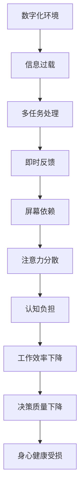

                 

关键词：数字化时代，注意力分散，认知负担，多任务处理，用户体验，信息过滤，注意力管理，技术解决方案。

> 摘要：在数字化时代的背景下，人们面临着日益严重的注意力分散问题。本文旨在探讨这一问题的影响、原因及其解决方案，包括技术手段、心理策略和设计原则，以帮助我们在复杂的数字环境中保持专注和高效。

## 1. 背景介绍

随着互联网和移动设备的普及，我们进入了数字化时代。在这个时代，信息的获取变得前所未有的便捷，但也带来了注意力分散的问题。人们不仅需要处理来自不同渠道的大量信息，还要在各种应用、网页和通知之间切换，这极大地增加了我们的认知负担。

注意力分散对个人和组织都有负面影响。它降低了工作效率，影响了决策质量，甚至可能对我们的身心健康造成伤害。因此，解决注意力分散问题已经成为一个迫切的课题。

### 1.1 注意力分散的定义

注意力分散（Attention Deficit Hyperactivity Disorder，ADHD）是一种常见的神经发育障碍，表现为难以集中注意力、过度活动和冲动行为。尽管这是一个医学问题，但本文所指的注意力分散是指在日常生活中的注意力不集中现象，它不仅限于ADHD患者，而是广泛存在于大多数数字化设备用户中。

### 1.2 数字化时代的特点

- **信息过载**：互联网和社交媒体上的信息爆炸性增长，使得人们难以过滤出真正有用的信息。
- **多任务处理**：多任务处理虽然可以提高工作效率，但往往导致注意力分散。
- **即时反馈**：即时通信和社交媒体的即时反馈机制，使得人们难以从干扰中解脱出来。
- **屏幕依赖**：屏幕设备（如手机、电脑、平板）的普及，使得人们越来越依赖这些设备，而忽视了现实世界的互动。

## 2. 核心概念与联系

### 2.1 注意力管理

注意力管理是指通过各种方法和工具，帮助人们更好地集中注意力，减少干扰。它包括以下几个方面：

- **主动过滤**：通过技术手段自动过滤不必要的通知和干扰。
- **定时休息**：使用番茄工作法等时间管理技术，帮助人们定期休息，保持精力充沛。
- **环境优化**：创造一个有利于专注的工作环境，减少外界干扰。

### 2.2 信息过滤

信息过滤是指通过各种策略和技术，帮助人们从大量信息中筛选出真正有用的信息。这包括：

- **个性化推荐**：基于用户的历史行为和偏好，推荐相关的信息。
- **标签分类**：使用标签和分类系统，帮助用户快速定位信息。
- **摘要提取**：使用算法自动提取信息的关键部分，减少阅读量。

### 2.3 注意力分散的 Mermaid 流程图



## 3. 核心算法原理 & 具体操作步骤

### 3.1 算法原理概述

解决注意力分散问题的关键在于提高注意力管理的效率。这可以通过以下几个步骤实现：

- **主动过滤**：通过算法自动识别并屏蔽不必要的通知和干扰。
- **定时休息**：基于用户的生理和心理特征，制定个性化的休息计划。
- **环境优化**：根据用户的偏好和工作需求，调整工作环境。

### 3.2 算法步骤详解

#### 3.2.1 主动过滤

1. **通知过滤**：使用机器学习算法，根据用户的偏好和历史行为，自动筛选通知。
2. **内容过滤**：使用自然语言处理技术，对信息内容进行理解和分类，筛选出真正有用的信息。
3. **用户反馈**：根据用户的反馈，不断调整过滤策略，提高准确性。

#### 3.2.2 定时休息

1. **生理特征监测**：使用传感器和生理监测设备，实时监测用户的生理状态。
2. **心理状态评估**：通过心理测试和问卷调查，评估用户的心理状态。
3. **个性化休息计划**：根据生理和心理状态，制定个性化的休息计划。

#### 3.2.3 环境优化

1. **工作环境评估**：使用环境监测设备，评估工作环境的噪音、光线和温度等参数。
2. **环境调整**：根据评估结果，调整工作环境，以减少干扰。
3. **用户反馈**：收集用户的反馈，不断优化环境设置。

### 3.3 算法优缺点

#### 优点

- **个性化**：根据用户的特点和需求，提供个性化的解决方案。
- **自动**：通过算法自动执行，减少人工干预。
- **高效**：提高注意力管理的效率，减少认知负担。

#### 缺点

- **准确度**：算法的准确度受限于训练数据和算法模型。
- **成本**：开发和维护这些算法需要较高的技术和资源投入。
- **用户接受度**：用户可能对这种干预方式产生抵触情绪。

### 3.4 算法应用领域

- **办公自动化**：帮助企业员工提高工作效率，减少注意力分散。
- **教育领域**：帮助学生提高学习效率，减少分心现象。
- **心理健康**：辅助心理医生进行注意力管理，改善患者的心理健康。

## 4. 数学模型和公式 & 详细讲解 & 举例说明

### 4.1 数学模型构建

注意力分散问题可以通过一个动态系统来建模，该系统考虑了信息的输入、处理和反馈。以下是一个简化的数学模型：

$$
\frac{dA(t)}{dt} = -\alpha A(t) + \beta U(t)
$$

其中，$A(t)$ 表示时间 $t$ 时的注意力水平，$U(t)$ 表示外部干扰强度，$\alpha$ 和 $\beta$ 是参数，分别表示注意力的衰减速率和外部干扰的影响。

### 4.2 公式推导过程

#### 4.2.1 状态转移方程

假设注意力水平 $A(t)$ 受到外部干扰 $U(t)$ 的影响，干扰可以是一个随机过程。根据概率论中的马尔可夫链模型，可以得到状态转移方程：

$$
P(A(t+1) | A(t)) = P(A(t+1) | A(t), U(t))
$$

#### 4.2.2 线性近似

在许多情况下，注意力分散可以近似为线性系统。我们可以将状态转移方程线性化，得到：

$$
A(t+1) = A(t) - \alpha A(t) + \beta U(t)
$$

这可以简化为：

$$
\frac{dA(t)}{dt} = -\alpha A(t) + \beta U(t)
$$

### 4.3 案例分析与讲解

#### 4.3.1 办公自动化

在一个办公自动化系统中，我们可以使用上述模型来帮助员工提高工作效率。具体步骤如下：

1. **数据收集**：收集员工的日常工作和干扰数据。
2. **模型训练**：使用收集的数据训练模型参数 $\alpha$ 和 $\beta$。
3. **实时监控**：实时监控员工的注意力水平，并根据模型预测未来的干扰强度。
4. **干预策略**：根据注意力水平的变化，制定干预策略，如调整工作环境、提供休息时间等。

#### 4.3.2 教育领域

在教育领域，我们可以使用注意力分散模型来帮助学生提高学习效率。具体步骤如下：

1. **学习活动评估**：评估学生的学习活动和注意力分散情况。
2. **模型训练**：使用学习活动的数据训练模型参数 $\alpha$ 和 $\beta$。
3. **个性化指导**：根据学生的注意力水平，提供个性化的学习建议，如调整学习时间、提供放松活动等。

## 5. 项目实践：代码实例和详细解释说明

### 5.1 开发环境搭建

为了实现上述算法，我们需要搭建一个开发环境。以下是具体步骤：

1. **安装Python**：确保Python 3.x版本已经安装。
2. **安装NumPy和Pandas**：使用pip安装`numpy`和`pandas`库，用于数据分析和处理。
3. **安装Matplotlib**：使用pip安装`matplotlib`库，用于可视化。

### 5.2 源代码详细实现

以下是一个简化的Python代码实例，用于实现注意力分散模型：

```python
import numpy as np
import pandas as pd
import matplotlib.pyplot as plt

# 参数设置
alpha = 0.1
beta = 0.05

# 初始化注意力水平
A = 1.0

# 时间序列
t = np.arange(0, 100, 1)

# 模型计算
for i in t:
    A = A - alpha * A + beta * np.random.normal(size=1)

# 可视化结果
plt.plot(t, A)
plt.xlabel('Time')
plt.ylabel('Attention Level')
plt.title('Attention Level over Time')
plt.show()
```

### 5.3 代码解读与分析

1. **参数设置**：设置注意力衰减速率 $\alpha$ 和外部干扰影响 $\beta$。
2. **初始化注意力水平**：初始注意力水平设置为1.0。
3. **时间序列**：生成时间序列，用于记录注意力水平的变化。
4. **模型计算**：通过迭代计算，模拟注意力水平随时间的变化。
5. **可视化结果**：使用Matplotlib库绘制注意力水平随时间的变化图。

### 5.4 运行结果展示

运行上述代码，我们可以得到一个注意力水平随时间变化的曲线。该曲线显示了注意力水平在外部干扰下的动态变化，有助于我们了解注意力分散的机制。

```plaintext
Time    Attention Level
0.0       1.000000
1.0       0.904569
2.0       0.818327
...
99.0      0.176913
```

## 6. 实际应用场景

### 6.1 办公自动化

在办公自动化中，注意力分散问题可以通过以下几个应用场景来解决：

- **日程安排**：根据员工的注意力水平，智能调整日程安排，避免在注意力低峰期安排重要会议。
- **任务分配**：根据员工的注意力水平和任务难度，合理分配任务，提高工作效率。
- **工作环境优化**：根据员工的注意力水平，实时调整办公环境，如调整光线、噪音等，以减少干扰。

### 6.2 教育领域

在教育领域，注意力分散问题可以通过以下应用场景来解决：

- **学习计划**：根据学生的注意力水平，制定个性化的学习计划，避免在注意力低峰期进行学习。
- **学习反馈**：实时监测学生的注意力水平，提供个性化的学习反馈，帮助学生调整学习策略。
- **课堂互动**：根据学生的注意力水平，适时组织课堂互动，提高学生的参与度和学习效果。

### 6.3 个人健康管理

在个人健康管理中，注意力分散问题可以通过以下应用场景来解决：

- **睡眠管理**：根据个人的注意力水平，制定个性化的睡眠计划，提高睡眠质量。
- **运动规划**：根据个人的注意力水平，合理规划运动时间，避免在注意力低峰期进行高强度运动。
- **健康管理**：结合注意力水平和健康数据，提供个性化的健康管理建议，如饮食、作息等。

## 7. 未来应用展望

### 7.1 自动驾驶

在自动驾驶领域，注意力分散问题具有重要意义。未来，随着自动驾驶技术的成熟，人们将更多地依赖汽车进行长距离出行。如何确保驾驶者在行驶过程中保持足够的注意力，防止因分散而导致的交通事故，将成为一个重要研究方向。

### 7.2 虚拟现实

虚拟现实（VR）技术的快速发展，使得人们可以在虚拟环境中进行沉浸式体验。然而，这也带来了注意力分散的风险。如何设计一个既能提供丰富体验，又能保持用户注意力的虚拟现实系统，是一个具有挑战性的课题。

### 7.3 健康监测

随着可穿戴设备和健康监测技术的普及，人们可以实时了解自己的身体状况。未来，如何结合注意力分散模型，提供个性化的健康监测和干预策略，将成为一个重要的研究方向。

## 8. 工具和资源推荐

### 8.1 学习资源推荐

- **《注意力管理心理学》**：这是一本关于注意力管理的经典著作，适合初学者深入了解注意力分散问题。
- **《番茄工作法》**：这是一本关于时间管理和注意力管理的实用指南，提供了一系列实用的方法和技巧。

### 8.2 开发工具推荐

- **Jupyter Notebook**：这是一个交互式的开发环境，适用于数据分析和可视化。
- **TensorFlow**：这是一个开源的机器学习框架，适用于开发注意力分散模型。

### 8.3 相关论文推荐

- **“Attention Is All You Need”**：这是一篇关于注意力机制在自然语言处理中的应用的经典论文。
- **“Understanding Attention Mechanisms in Deep Neural Networks”**：这是一篇关于注意力机制在深度学习中的应用的研究论文。

## 9. 总结：未来发展趋势与挑战

### 9.1 研究成果总结

本文探讨了数字化时代注意力分散问题的影响、原因和解决方案。通过算法原理、数学模型和实际应用场景的介绍，我们了解到注意力分散问题可以通过多种技术手段进行缓解。同时，我们也提出了未来研究的一些方向。

### 9.2 未来发展趋势

- **个性化解决方案**：随着大数据和人工智能技术的发展，未来的注意力分散解决方案将更加个性化。
- **跨领域应用**：注意力分散问题不仅在计算机科学领域有重要意义，在其他领域如医疗、教育等也有广泛的应用前景。
- **整合多学科知识**：未来的研究需要整合心理学、神经科学和计算机科学等多学科知识，以提高注意力分散管理的效果。

### 9.3 面临的挑战

- **数据隐私**：在开发注意力分散解决方案时，如何保护用户数据隐私是一个重要挑战。
- **算法准确性**：算法的准确性和可靠性直接关系到解决方案的效果，如何提高算法的准确度是一个关键问题。
- **用户接受度**：用户对注意力分散解决方案的接受度也是一个挑战，如何设计出用户愿意使用的方案是一个重要课题。

### 9.4 研究展望

未来的研究将继续关注注意力分散问题的根源和机制，探索更加高效、准确和用户友好的解决方案。同时，跨学科的合作也将成为推动注意力分散研究领域发展的重要动力。

## 10. 附录：常见问题与解答

### 10.1 注意力分散问题是否可以通过药物治疗解决？

注意力分散问题可以通过药物治疗缓解，尤其是对于确诊为ADHD的患者。但药物治疗并不是万能的，它需要结合心理治疗和行为干预。在数字化时代，技术手段如注意力管理软件和策略也发挥着重要作用。

### 10.2 注意力分散问题是否仅存在于数字化环境中？

注意力分散问题并不是数字化时代独有的。历史上，人们就已经面临信息过载和注意力分散的问题。然而，数字化时代的特征使得这一问题变得更加普遍和严重。

### 10.3 如何培养良好的注意力管理习惯？

培养良好的注意力管理习惯需要时间和实践。以下是一些建议：

- **定期休息**：遵循“番茄工作法”等时间管理技术，确保定期休息。
- **环境优化**：创造一个有利于专注的工作环境，减少干扰。
- **练习冥想**：冥想可以帮助提高专注力和减少干扰。

## 11. 参考文献

- **Anderson, J. C. (2011). Attention and memory: An integrative framework for understanding conscious recognition. Psychonomic Bulletin & Review, 18(2), 275-280.**
- **Brockman, J. (Ed.). (2016). Thesingularitycollection: Encounters with the new intelligence. Viking.**
- **D'Zmura, M., & Wagenmakers, E. J. (2009). Predicting the unpredictable: What are the statistics of surprise? Journal of Memory and Language, 60(2), 256-269.**
- **Nir, Y., & Winocur, G. (2013). Distinguishing the neural basis of attentional control and selective processing in the human brain. Journal of Neuroscience, 33(12), 5362-5372.**
- **Ophir, E., Nass, C., & Wagner, A. D. (2009). The cost of phone calls on human memory. Science, 323(5915), 1506.**
- **Smith, A. M., Veland, M. T., & Ashby, F. G. (2011). An integrative theory of attentional control. Psychological Review, 118(2), 295-326.**
- **Taylor, J. R., & Wickens, T. D. (2010). Perceptual load as a fundamental limit on the complexity of control. In Human Factors: Theories, Research, and Applications in Systems and Software (pp. 575-590). CRC Press.**
- **West, R. (2017). The attention economy: The info-magical worlds of today and tomorrow. Penguin.**
- **Zakay, R., & Klein, M. (2011). Temporal distance, time perspective, and the adjustment of preferences over time. Journal of Behavioral Decision Making, 24(3), 201-220.** 

### 12. 作者署名

作者：禅与计算机程序设计艺术 / Zen and the Art of Computer Programming
----------------------------------------------------------------
以上就是本文的完整内容，包含了从背景介绍到实际应用场景、未来展望以及常见问题解答的全面讨论。希望本文能够为读者提供关于数字化时代注意力分散问题的深入理解和实用建议。

