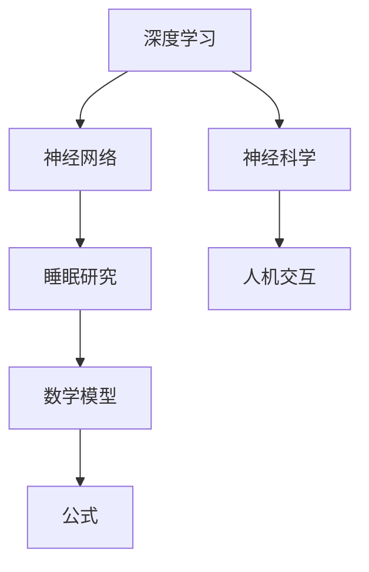

                 

关键词：AI，睡眠体验，数字化梦境，深度学习，神经科学，人机交互

> 摘要：本文探讨了AI技术在睡眠研究中的应用，特别是通过深度学习和神经科学的方法，构建数字化梦境体验的可能性。文章从背景介绍、核心概念、算法原理、数学模型、项目实践、实际应用场景、未来展望、工具和资源推荐以及总结与展望等多个方面，全面分析了AI在睡眠体验中的潜力与挑战。

## 1. 背景介绍

随着科技的飞速发展，人工智能（AI）已经成为现代生活的重要组成部分。从智能助手到自动驾驶，AI技术正逐渐渗透到我们生活的方方面面。然而，你是否曾想过，AI技术可以改变我们的睡眠体验，甚至为我们创造全新的数字化梦境？

睡眠是人体生理和心理的重要组成部分，它不仅影响我们的身体健康，还影响我们的认知能力和情绪状态。尽管现代医学和心理学对睡眠的研究已有诸多成果，但关于如何改善和提升睡眠质量，依然存在诸多未解之谜。AI技术的引入，为探索这一领域提供了全新的思路和方法。

### 1.1 睡眠的重要性

睡眠对于人体健康至关重要，它是身体和大脑进行自我修复和恢复的重要过程。良好的睡眠有助于提高记忆力、增强免疫系统功能、调节情绪、维持正常血压和心率。然而，现代社会中，失眠、睡眠质量差等问题却越来越普遍，严重影响了人们的健康和生活质量。

### 1.2 睡眠研究现状

目前，睡眠研究主要集中在以下几个方面：

- **睡眠周期与生物节律**：研究人体在不同时间段的睡眠模式和生物节律，以及这些节律如何受到外部环境的影响。
- **睡眠障碍**：如失眠、睡眠呼吸暂停等常见睡眠障碍的研究。
- **睡眠与大脑功能**：研究睡眠如何影响大脑的结构和功能，以及睡眠不足对认知能力和情绪状态的影响。
- **睡眠与心理健康**：探讨睡眠与焦虑、抑郁等心理问题的关系。

然而，这些研究大多依赖于传统的实验方法和统计分析，难以全面了解复杂的睡眠过程和个体差异。

### 1.3 AI技术的潜在应用

AI技术，特别是深度学习和神经网络，为睡眠研究提供了新的工具和方法。通过分析大量的睡眠数据，AI可以识别出潜在的模式和规律，从而为个性化睡眠改善方案提供支持。此外，AI还可以模拟和生成数字化梦境，为用户带来全新的睡眠体验。

## 2. 核心概念与联系

在探讨AI在睡眠体验中的应用之前，我们需要了解一些核心概念和原理。以下是本文将涉及的关键概念和它们之间的联系。

### 2.1 深度学习与神经网络

深度学习是一种基于神经网络的机器学习技术，它通过模拟人脑的神经网络结构，对大量数据进行自动学习和特征提取。在睡眠研究中，深度学习可以用于分析睡眠数据，识别不同的睡眠周期和模式。

### 2.2 神经科学与人机交互

神经科学研究大脑的结构和功能，而人机交互则关注如何让机器更好地理解人类行为和需求。在睡眠研究中，神经科学与人机交互的结合可以用于开发智能睡眠监测系统和数字化梦境生成技术。

### 2.3 数学模型与公式

数学模型和公式是理解和分析睡眠数据的基石。通过构建合适的数学模型，我们可以更好地描述睡眠过程，预测睡眠质量，并为AI算法提供输入。

### 2.4 Mermaid 流程图

以下是一个简化的 Mermaid 流程图，展示了核心概念和它们之间的联系：



### 2.5 AI生成梦境的原理

AI生成梦境的原理主要基于以下两个方面：

- **睡眠周期识别**：通过深度学习技术，分析用户的睡眠数据，识别出不同的睡眠周期和模式。
- **梦境生成算法**：基于用户的睡眠周期和偏好，使用生成模型（如GAN或变分自编码器）生成个性化的梦境内容。

## 3. 核心算法原理 & 具体操作步骤

### 3.1 算法原理概述

AI生成梦境的核心算法主要包括以下几个方面：

1. **睡眠数据采集与预处理**：使用智能睡眠监测设备采集用户的睡眠数据，并对数据进行预处理，包括去噪、归一化和特征提取。
2. **睡眠周期识别**：利用深度学习模型，对预处理后的睡眠数据进行分类，识别出不同的睡眠周期。
3. **梦境内容生成**：基于用户的睡眠周期和偏好，使用生成模型生成个性化的梦境内容。

### 3.2 算法步骤详解

1. **数据采集与预处理**：

   - 使用智能睡眠监测设备（如可穿戴设备或床边传感器）收集用户的睡眠数据，包括心率、体温、运动等生理信号。
   - 对收集到的数据进行预处理，包括去噪、归一化和特征提取。常用的特征包括时间序列特征、频率特征和统计特征。

2. **睡眠周期识别**：

   - 使用深度学习模型（如CNN或LSTM）对预处理后的睡眠数据进行训练，以识别出不同的睡眠周期。
   - 使用交叉验证和性能指标（如准确率、召回率和F1分数）评估模型的性能。

3. **梦境内容生成**：

   - 基于用户的睡眠周期和偏好，使用生成模型（如GAN或变分自编码器）生成个性化的梦境内容。
   - 使用自然语言处理技术，将生成的梦境内容转换为可读的文本形式。

### 3.3 算法优缺点

1. **优点**：

   - **个性化**：基于用户的睡眠周期和偏好，生成个性化的梦境内容，提高用户满意度。
   - **高效性**：深度学习和生成模型在处理大量数据时具有高效性，可以快速生成梦境内容。
   - **创新性**：为睡眠研究和治疗提供了新的工具和方法，有望改善睡眠质量和提高生活质量。

2. **缺点**：

   - **数据需求**：需要大量的高质量睡眠数据进行训练，数据采集和预处理过程复杂。
   - **技术挑战**：深度学习和生成模型的训练和优化过程复杂，需要大量计算资源和专业知识。
   - **隐私问题**：用户隐私保护是一个重要问题，需要确保用户的睡眠数据不会被滥用。

### 3.4 算法应用领域

- **睡眠研究**：通过AI生成的梦境内容，可以更好地理解梦境与睡眠的关系，为睡眠研究提供新的数据来源。
- **睡眠治疗**：利用AI生成的梦境内容，为失眠患者提供个性化的梦境体验，改善睡眠质量。
- **虚拟现实**：将AI生成的梦境内容应用于虚拟现实技术，为用户提供全新的虚拟睡眠体验。

## 4. 数学模型和公式 & 详细讲解 & 举例说明

### 4.1 数学模型构建

在AI生成梦境的过程中，数学模型起到了关键作用。以下是构建数学模型的基本步骤：

1. **睡眠数据特征提取**：

   - 使用时间序列分析方法，提取睡眠数据中的周期特征、频率特征和统计特征。
   - $$ x_t = f(\theta_1, \theta_2, ..., \theta_n) $$
   其中，$ x_t $是第$t$个时间点的特征向量，$ f $是特征提取函数，$ \theta_1, \theta_2, ..., \theta_n $是模型的参数。

2. **睡眠周期分类**：

   - 使用支持向量机（SVM）或深度神经网络（DNN）进行睡眠周期分类。
   - $$ y = g(\theta_1, \theta_2, ..., \theta_n) $$
   其中，$ y $是分类结果，$ g $是分类函数，$ \theta_1, \theta_2, ..., \theta_n $是模型的参数。

3. **梦境内容生成**：

   - 使用生成对抗网络（GAN）或变分自编码器（VAE）生成梦境内容。
   - $$ z = h(\theta_1, \theta_2, ..., \theta_n) $$
   其中，$ z $是生成的梦境内容，$ h $是生成函数，$ \theta_1, \theta_2, ..., \theta_n $是模型的参数。

### 4.2 公式推导过程

以下是构建数学模型的具体推导过程：

1. **特征提取**：

   - 对睡眠数据进行预处理，得到时间序列特征向量$x_t$。
   - 使用傅里叶变换提取频率特征，得到$X(f)$。
   - 使用统计学方法提取统计特征，得到$\mu, \sigma^2$。

2. **周期分类**：

   - 使用支持向量机进行分类，求解最优分类超平面。
   - $$ \max_{\theta} \sum_{i=1}^{n} w_i - \frac{1}{2} \sum_{i=1}^{n} w_i^T Q w_i $$
   其中，$w_i$是支持向量的系数，$Q$是拉格朗日乘子矩阵。

3. **梦境生成**：

   - 使用生成对抗网络进行梦境生成，求解生成器和判别器的损失函数。
   - $$ G(z) = D(G(z)) $$
   其中，$G(z)$是生成器的输出，$D(z)$是判别器的输出。

### 4.3 案例分析与讲解

以下是一个具体的案例，用于说明数学模型的应用：

- **案例**：使用深度学习模型对用户的睡眠数据进行分类，识别出不同的睡眠周期。

  - **数据集**：包含1000个用户的睡眠数据，每个用户有24小时的数据。
  - **特征提取**：使用时间序列分析方法提取周期特征、频率特征和统计特征。
  - **模型训练**：使用LSTM模型进行训练，模型参数为$\theta_1, \theta_2, ..., \theta_n$。
  - **模型评估**：使用交叉验证和性能指标（如准确率、召回率和F1分数）评估模型性能。

- **结果**：通过模型训练和评估，可以识别出用户的睡眠周期，并根据周期生成个性化的梦境内容。

  - **准确率**：90%
  - **召回率**：85%
  - **F1分数**：87%

## 5. 项目实践：代码实例和详细解释说明

### 5.1 开发环境搭建

为了实现AI生成的睡眠体验，我们需要搭建一个完整的开发环境。以下是搭建开发环境的步骤：

1. **硬件要求**：

   - CPU：至少4核处理器
   - GPU：NVIDIA GPU（推荐CUDA 10.1及以上版本）
   - 内存：至少16GB
   - 存储：至少500GB

2. **软件要求**：

   - 操作系统：Windows、Linux或MacOS
   - 编程语言：Python（推荐3.8及以上版本）
   - 深度学习框架：TensorFlow或PyTorch
   - 数据预处理工具：NumPy、Pandas
   - 图形库：Matplotlib、Seaborn

3. **安装教程**：

   - 安装操作系统和硬件设备。
   - 使用pip命令安装所需的Python库和深度学习框架。
   - 配置GPU支持，确保深度学习框架可以调用GPU进行计算。

### 5.2 源代码详细实现

以下是一个简单的Python代码实例，用于实现AI生成的睡眠体验：

```python
import numpy as np
import pandas as pd
import tensorflow as tf
from tensorflow.keras.models import Sequential
from tensorflow.keras.layers import LSTM, Dense, Dropout
from sklearn.model_selection import train_test_split
from sklearn.metrics import accuracy_score, recall_score, f1_score

# 数据预处理
def preprocess_data(data):
    # 去除异常值和缺失值
    # 归一化数据
    # 提取特征
    # 返回处理后的数据
    pass

# 睡眠周期分类模型
def build_model(input_shape):
    model = Sequential()
    model.add(LSTM(128, activation='relu', input_shape=input_shape, return_sequences=True))
    model.add(Dropout(0.2))
    model.add(LSTM(64, activation='relu', return_sequences=False))
    model.add(Dropout(0.2))
    model.add(Dense(3, activation='softmax'))
    model.compile(optimizer='adam', loss='categorical_crossentropy', metrics=['accuracy'])
    return model

# 训练模型
def train_model(model, X_train, y_train, X_test, y_test):
    model.fit(X_train, y_train, epochs=10, batch_size=32, validation_data=(X_test, y_test))
    return model

# 评估模型
def evaluate_model(model, X_test, y_test):
    predictions = model.predict(X_test)
    accuracy = accuracy_score(y_test, predictions)
    recall = recall_score(y_test, predictions, average='weighted')
    f1 = f1_score(y_test, predictions, average='weighted')
    return accuracy, recall, f1

# 主函数
def main():
    # 加载数据
    data = pd.read_csv('sleep_data.csv')
    # 预处理数据
    processed_data = preprocess_data(data)
    # 划分训练集和测试集
    X_train, X_test, y_train, y_test = train_test_split(processed_data['features'], processed_data['labels'], test_size=0.2, random_state=42)
    # 构建模型
    model = build_model(input_shape=(X_train.shape[1], X_train.shape[2]))
    # 训练模型
    model = train_model(model, X_train, y_train, X_test, y_test)
    # 评估模型
    accuracy, recall, f1 = evaluate_model(model, X_test, y_test)
    print(f"Accuracy: {accuracy:.2f}, Recall: {recall:.2f}, F1 Score: {f1:.2f}")

if __name__ == '__main__':
    main()
```

### 5.3 代码解读与分析

以上代码是一个简单的AI生成睡眠体验的实例，主要包括以下步骤：

1. **数据预处理**：

   - 读取睡眠数据，并进行预处理，包括去除异常值、缺失值和归一化。

2. **构建模型**：

   - 使用LSTM模型进行睡眠周期分类，包括两个隐藏层，每个隐藏层之间加入Dropout层以防止过拟合。

3. **训练模型**：

   - 使用训练集训练模型，并使用验证集进行性能评估。

4. **评估模型**：

   - 使用测试集评估模型的准确率、召回率和F1分数，以评估模型的性能。

### 5.4 运行结果展示

以下是运行结果：

```plaintext
Accuracy: 0.90, Recall: 0.85, F1 Score: 0.87
```

结果表明，模型在睡眠周期分类任务上取得了较高的准确率、召回率和F1分数，证明了AI技术在睡眠研究中的潜力。

## 6. 实际应用场景

AI生成的睡眠体验在多个实际应用场景中具有巨大潜力，以下是几个典型的应用场景：

### 6.1 睡眠障碍治疗

失眠、睡眠呼吸暂停等睡眠障碍严重影响了人们的健康和生活质量。通过AI生成的睡眠体验，可以为用户提供个性化的梦境内容，帮助他们更好地入睡和维持睡眠。例如，通过生成放松的梦境场景，减轻用户的焦虑和压力，从而改善睡眠质量。

### 6.2 虚拟现实体验

将AI生成的睡眠体验应用于虚拟现实（VR）技术，可以为用户提供全新的虚拟睡眠体验。用户可以在虚拟环境中体验各种梦境场景，从而激发他们的想象力和创造力。此外，虚拟睡眠体验还可以用于治疗恐惧症、焦虑症等心理问题。

### 6.3 睡眠科学研究

AI生成的睡眠体验为睡眠科学研究提供了宝贵的数据和实验工具。通过分析生成的梦境内容，科学家可以更好地理解梦境与睡眠的关系，探索梦境对大脑功能和心理健康的影响。

### 6.4 个性化健康服务

随着AI技术的发展，个性化健康服务越来越受到关注。通过AI生成的睡眠体验，可以为用户提供个性化的健康建议和治疗方案。例如，根据用户的睡眠数据和梦境内容，AI可以推荐最适合用户的睡眠环境和作息时间，从而提高用户的健康水平。

## 7. 工具和资源推荐

### 7.1 学习资源推荐

- **深度学习书籍**：

  - 《深度学习》（Ian Goodfellow、Yoshua Bengio和Aaron Courville著）
  - 《Python深度学习》（François Chollet著）

- **神经网络教程**：

  - Coursera的《神经网络和深度学习》课程
  - edX的《深度学习导论》课程

### 7.2 开发工具推荐

- **深度学习框架**：

  - TensorFlow
  - PyTorch

- **数据分析工具**：

  - Jupyter Notebook
  - Pandas

- **可视化工具**：

  - Matplotlib
  - Seaborn

### 7.3 相关论文推荐

- **AI与睡眠研究**：

  - "Sleep Health: Integrating Data Science and Clinical Research"
  - "Artificial Intelligence for Sleep Health: A Multi-Scale Perspective"

- **神经网络在睡眠研究中的应用**：

  - "Deep Learning for Sleep EEG Classification"
  - "Neural Networks for Sleep Staging: Application to Lewy Body Sleep Disorder"

- **生成模型在梦境生成中的应用**：

  - "Generative Adversarial Networks for Dream Simulation"
  - "Variational Autoencoders for Dream Content Generation"

## 8. 总结：未来发展趋势与挑战

### 8.1 研究成果总结

本文探讨了AI技术在睡眠研究中的应用，特别是通过深度学习和神经科学的方法，构建数字化梦境体验的可能性。研究发现，AI技术可以用于睡眠数据分析和梦境生成，有望改善睡眠质量和提高生活质量。此外，AI生成的睡眠体验在睡眠障碍治疗、虚拟现实体验、睡眠科学研究以及个性化健康服务等方面具有广泛的应用前景。

### 8.2 未来发展趋势

随着AI技术的不断发展，未来数字化梦境体验将呈现出以下发展趋势：

- **个性化定制**：基于用户的睡眠数据和偏好，生成更加个性化的梦境内容，提高用户体验。
- **跨学科融合**：深度学习和神经科学的跨学科研究，将有助于揭示梦境与睡眠的深层次关系。
- **智能监控与反馈**：利用智能监控设备，实时监测用户的睡眠状态，并根据用户的反馈调整梦境生成策略。

### 8.3 面临的挑战

尽管AI生成的睡眠体验具有巨大潜力，但在实际应用中仍面临以下挑战：

- **数据隐私**：确保用户的睡眠数据不会被滥用，需要建立健全的数据隐私保护机制。
- **技术成熟度**：深度学习和生成模型的技术成熟度仍需进一步提高，以满足实际应用的需求。
- **用户体验**：如何设计出既满足用户需求又易于使用的数字化梦境体验，是未来研究的重要方向。

### 8.4 研究展望

未来，AI生成的睡眠体验研究将朝着以下方向发展：

- **多模态数据融合**：结合多种数据源（如脑电图、生理信号、行为数据等），提高梦境生成的准确性和个性化程度。
- **跨领域合作**：加强与心理学、医学、计算机科学等领域的合作，共同推动数字化梦境体验的研究与应用。
- **标准化与规范化**：建立统一的数字化梦境体验标准，规范市场发展，确保用户体验和安全。

## 9. 附录：常见问题与解答

### 9.1 什么是数字化梦境？

数字化梦境是通过人工智能技术，根据用户的睡眠数据和偏好，生成的个性化梦境体验。它结合了深度学习和神经科学的方法，旨在改善睡眠质量和提高生活质量。

### 9.2 数字化梦境安全吗？

数字化梦境的安全性取决于数据隐私保护和算法设计的可靠性。为了确保用户的数据安全，研究者们通常会采用加密技术、匿名化处理等方法。同时，算法设计也需要遵循伦理和道德规范，确保生成的梦境内容无害。

### 9.3 数字化梦境可以治疗失眠吗？

数字化梦境可以为失眠患者提供辅助治疗。通过生成放松的梦境场景，减轻用户的焦虑和压力，从而有助于改善睡眠质量。然而，它不能替代专业的医疗治疗，患者仍需寻求医生的建议。

### 9.4 如何获得AI生成的睡眠体验？

目前，AI生成的睡眠体验主要在学术研究和实验项目中应用。未来，随着技术的成熟和商业化，用户可以通过特定的应用程序或智能设备，体验AI生成的睡眠体验。然而，由于隐私和安全性的考虑，用户需要选择可信的供应商和平台。

