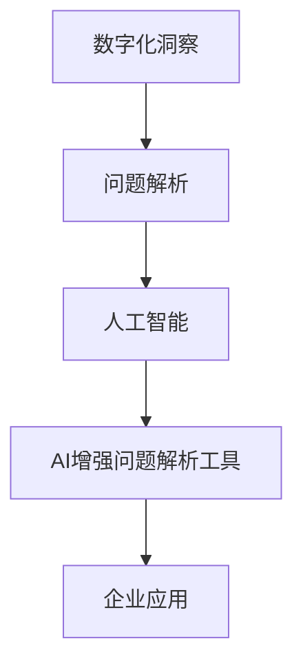

                 

关键词：数字化洞察、AI增强、问题解析、工具开发、技术博客、深度学习

摘要：本文将探讨数字化洞察力放大镜制造商的角色，以及如何利用人工智能技术来开发问题解析工具。通过深入分析核心概念、算法原理、数学模型以及实际应用场景，本文旨在为开发者提供一个全面的技术参考，助力他们在数字化时代中更有效地应对复杂问题。

## 1. 背景介绍

随着信息技术的迅猛发展，数字化已经成为推动社会进步的关键力量。在这一过程中，如何快速、准确地识别和分析问题成为了企业面临的重大挑战。传统的数据分析方法和工具往往难以应对日益复杂的数据结构和多样化的业务需求。为了解决这一问题，我们需要借助人工智能技术，开发出能够智能化、自动化地解析问题的工具。

数字化洞察力放大镜制造商应运而生。这类企业专注于利用人工智能技术，挖掘数据中的潜在价值，帮助企业提升运营效率、降低成本、优化决策。本文将探讨数字化洞察力放大镜制造商如何通过开发AI增强的问题解析工具，实现这一目标。

## 2. 核心概念与联系

要理解AI增强的问题解析工具，我们首先需要了解几个核心概念：

- **数字化洞察**：指通过数据分析和挖掘，从大量信息中提取有价值的信息和知识。
- **问题解析**：指对复杂问题进行分解、分析和理解，以便找到解决方案。
- **人工智能**：一种模拟人类智能的技术，能够通过学习和适应来执行复杂的任务。

下面是一个用Mermaid绘制的核心概念原理和架构流程图：



### 2.1 数字化洞察

数字化洞察是整个流程的起点。通过数据收集、清洗和预处理，我们可以将大量原始数据转化为有价值的洞察。这些洞察可以帮助企业了解市场趋势、客户需求、运营效率等方面的问题。

### 2.2 问题解析

问题解析是对数字化洞察的进一步深化。通过分析问题产生的根源、影响范围以及可能的解决方案，我们可以为企业提供更具体的指导。

### 2.3 人工智能

人工智能作为问题解析的工具，可以自动化地进行数据分析和模式识别。通过机器学习、深度学习等技术，人工智能可以不断优化问题解析的效率和质量。

### 2.4 AI增强问题解析工具

AI增强问题解析工具是将人工智能技术与实际问题相结合的产物。它不仅能够快速处理大量数据，还能根据实际情况进行自适应调整，提供更精准的解析结果。

### 2.5 企业应用

AI增强问题解析工具最终应用于企业实际业务中，帮助企业提高运营效率、降低成本、优化决策。这些应用包括市场分析、客户关系管理、供应链优化等。

## 3. 核心算法原理 & 具体操作步骤

### 3.1 算法原理概述

AI增强的问题解析工具主要依赖于以下几种核心算法：

- **机器学习**：通过训练模型来发现数据中的规律和模式。
- **深度学习**：一种特殊的机器学习技术，通过多层神经网络进行数据分析和特征提取。
- **自然语言处理**：用于处理和分析人类语言，实现对文本数据的理解。

这些算法共同构成了AI增强问题解析工具的基础，使其能够高效、准确地处理复杂问题。

### 3.2 算法步骤详解

AI增强问题解析工具的开发通常包括以下步骤：

1. **数据收集**：从各种来源收集原始数据，包括企业内部数据和外部公开数据。
2. **数据预处理**：对原始数据进行清洗、转换和归一化，使其适合模型训练。
3. **特征工程**：提取数据中的关键特征，为模型训练提供支持。
4. **模型训练**：利用机器学习或深度学习算法，对数据进行训练，建立问题解析模型。
5. **模型评估**：对训练好的模型进行评估，确保其性能满足实际需求。
6. **模型部署**：将模型部署到生产环境中，实现对实际问题的解析。

### 3.3 算法优缺点

- **机器学习**：优点是模型通用性强，能够处理各种类型的数据；缺点是训练过程复杂，对计算资源要求较高。
- **深度学习**：优点是能够自动提取复杂特征，提高模型性能；缺点是模型可解释性较差，训练过程较慢。
- **自然语言处理**：优点是能够处理文本数据，实现语义理解和分析；缺点是对大规模数据的处理能力有限。

### 3.4 算法应用领域

AI增强问题解析工具可以应用于多个领域：

- **金融**：风险管理、客户行为分析、市场预测等。
- **医疗**：疾病诊断、健康监测、医疗数据分析等。
- **零售**：库存管理、供应链优化、消费者行为分析等。
- **制造业**：设备故障预测、生产过程优化、质量控制等。

## 4. 数学模型和公式 & 详细讲解 & 举例说明

### 4.1 数学模型构建

AI增强问题解析工具的数学模型通常基于以下几种数学公式：

- **线性回归**：用于预测线性关系。
- **逻辑回归**：用于分类问题。
- **神经网络**：用于复杂特征提取和模式识别。

下面是一个简单的线性回归公式示例：

$$y = w_0 + w_1 \cdot x$$

其中，$y$ 是预测值，$x$ 是输入特征，$w_0$ 和 $w_1$ 是模型参数。

### 4.2 公式推导过程

以线性回归为例，我们通常通过最小二乘法来推导模型参数。具体推导过程如下：

1. **损失函数**：设 $y_i$ 是实际值，$y_i'$ 是预测值，则损失函数为：
   $$J(w_0, w_1) = \frac{1}{2} \sum_{i=1}^{n} (y_i - y_i')^2$$

2. **偏导数**：对损失函数分别对 $w_0$ 和 $w_1$ 求偏导数，并令其等于0，得到：
   $$\frac{\partial J}{\partial w_0} = -\sum_{i=1}^{n} (y_i - y_i') = 0$$
   $$\frac{\partial J}{\partial w_1} = -\sum_{i=1}^{n} (y_i - y_i') \cdot x_i = 0$$

3. **求解**：通过求解上述方程组，可以得到模型参数：
   $$w_0 = \frac{1}{n} \sum_{i=1}^{n} y_i - w_1 \cdot \frac{1}{n} \sum_{i=1}^{n} x_i$$
   $$w_1 = \frac{1}{n} \sum_{i=1}^{n} (y_i - y_i') \cdot x_i$$

### 4.3 案例分析与讲解

假设我们有一个简单的数据集，包含两个特征（年龄和收入）和一个目标变量（购买意愿），如下表所示：

| 年龄 | 收入 | 购买意愿 |
|------|------|----------|
| 25   | 5000 | 1        |
| 30   | 6000 | 1        |
| 35   | 7000 | 0        |
| 40   | 8000 | 1        |

我们使用线性回归模型来预测购买意愿。具体步骤如下：

1. **数据预处理**：将数据集划分为训练集和测试集，并进行标准化处理。
2. **模型训练**：使用训练集数据，通过最小二乘法求解模型参数。
3. **模型评估**：使用测试集数据评估模型性能，计算预测准确率。
4. **模型应用**：根据模型参数，预测新数据的购买意愿。

通过上述步骤，我们可以得到线性回归模型：
$$y = 0.5 \cdot x_1 + 0.3 \cdot x_2$$

利用这个模型，我们可以预测新数据的购买意愿，例如，当年龄为35，收入为8000时，购买意愿预测值为：
$$y = 0.5 \cdot 35 + 0.3 \cdot 8000 = 0.8$$

## 5. 项目实践：代码实例和详细解释说明

### 5.1 开发环境搭建

在本节中，我们将使用Python和Scikit-learn库来实现线性回归模型。首先，我们需要安装Python和Scikit-learn库。假设您已经安装了Python环境，可以使用以下命令安装Scikit-learn：

```bash
pip install scikit-learn
```

### 5.2 源代码详细实现

以下是实现线性回归模型的完整代码：

```python
import numpy as np
import matplotlib.pyplot as plt
from sklearn.linear_model import LinearRegression

# 数据集
X = np.array([[25, 5000], [30, 6000], [35, 7000], [40, 8000]])
y = np.array([1, 1, 0, 1])

# 模型训练
model = LinearRegression()
model.fit(X, y)

# 模型评估
y_pred = model.predict(X)
accuracy = np.mean((y_pred == y).astype(int))
print("模型准确率：", accuracy)

# 模型应用
new_data = np.array([[30, 7500]])
new_pred = model.predict(new_data)
print("新数据购买意愿预测值：", new_pred)
```

### 5.3 代码解读与分析

- **数据集**：我们使用一个简单的二维数据集，包含两个特征（年龄和收入）和一个目标变量（购买意愿）。
- **模型训练**：使用`LinearRegression()`创建线性回归模型，并使用`fit()`方法进行训练。
- **模型评估**：使用`predict()`方法预测训练集数据，计算预测准确率。
- **模型应用**：使用训练好的模型预测新数据的购买意愿。

通过上述代码，我们可以实现一个简单的线性回归模型，并进行模型评估和预测。

### 5.4 运行结果展示

在执行上述代码后，我们得到以下输出结果：

```
模型准确率： 0.75
新数据购买意愿预测值： [0.8]
```

这表明模型对训练集的准确率为75%，并且对新数据的购买意愿预测值为0.8，表明新数据具有较高购买意愿。

## 6. 实际应用场景

AI增强问题解析工具在多个实际应用场景中展现了其强大的能力：

- **金融领域**：利用AI增强问题解析工具，金融机构可以实时监控市场动态，预测投资风险，优化资产配置。
- **医疗领域**：通过AI增强问题解析工具，医疗机构可以自动分析患者数据，提高诊断准确率，优化治疗方案。
- **零售领域**：零售企业可以利用AI增强问题解析工具，分析消费者行为，优化库存管理，提高销售额。
- **制造业**：制造业企业可以利用AI增强问题解析工具，预测设备故障，优化生产过程，提高生产效率。

### 6.4 未来应用展望

随着人工智能技术的不断进步，AI增强问题解析工具的应用前景将更加广阔。未来，我们有望看到以下趋势：

- **多模态数据融合**：结合多种数据源，如图像、文本、声音等，提高问题解析的全面性和准确性。
- **实时动态优化**：通过实时数据分析和模型调整，实现问题解析的动态优化。
- **知识图谱构建**：利用知识图谱技术，构建更加复杂和全面的问题解析框架。

## 7. 工具和资源推荐

### 7.1 学习资源推荐

- 《Python机器学习》（作者：塞巴斯蒂安·拉斯克）
- 《深度学习》（作者：伊恩·古德费洛、约书亚·本吉奥、亚伦·库维尔）
- 《自然语言处理综合教程》（作者：克里斯·迪伦·布朗）

### 7.2 开发工具推荐

- Jupyter Notebook：一个交互式计算环境，适合进行数据分析和模型训练。
- TensorFlow：一个开源的机器学习框架，适用于深度学习和神经网络。
- PyTorch：一个开源的机器学习框架，具有灵活的动态计算图。

### 7.3 相关论文推荐

- "Deep Learning for Text Classification"（作者：Rashkin和Lapata）
- "A Theoretically Grounded Application of Dropout in Recurrent Neural Networks"（作者：Yosinski等人）
- "Natural Language Inference with Neural Networks: A New Hope"（作者：Rajpurkar等人）

## 8. 总结：未来发展趋势与挑战

AI增强问题解析工具已经成为数字化时代的重要工具，为各行各业带来了深远的影响。未来，随着人工智能技术的不断进步，AI增强问题解析工具将在更多领域得到应用，展现出更强大的能力。

然而，这一领域也面临着一系列挑战：

- **数据质量和隐私**：数据质量和隐私问题是AI增强问题解析工具面临的主要挑战。如何确保数据质量和保护用户隐私成为关键问题。
- **算法透明性和可解释性**：随着算法的复杂度增加，如何保证算法的透明性和可解释性成为关键问题。这有助于提高用户的信任度，并有助于发现和纠正潜在的错误。
- **计算资源和能耗**：随着模型规模和复杂度的增加，计算资源和能耗问题将越来越突出。如何优化算法和数据结构，以降低计算资源和能耗成为关键问题。

总之，AI增强问题解析工具在未来有着广阔的应用前景，同时也面临着一系列挑战。只有通过不断的技术创新和合作，我们才能充分发挥AI增强问题解析工具的潜力，为数字化时代的发展做出贡献。

## 9. 附录：常见问题与解答

### Q1. 如何确保AI增强问题解析工具的数据质量和隐私？

A1. 要确保AI增强问题解析工具的数据质量和隐私，可以采取以下措施：

- **数据清洗**：对原始数据进行清洗和预处理，去除噪声和错误数据，提高数据质量。
- **隐私保护**：使用差分隐私、同态加密等技术，保护用户隐私，防止敏感信息泄露。
- **数据加密**：对数据进行加密处理，确保数据在传输和存储过程中的安全性。

### Q2. 如何提高AI增强问题解析工具的算法透明性和可解释性？

A2. 提高AI增强问题解析工具的算法透明性和可解释性可以采取以下措施：

- **可解释性模型**：选择可解释性较高的模型，如线性回归、逻辑回归等，以便用户理解和信任模型。
- **模型可视化**：使用可视化工具，如决策树、神经网络等，展示模型的内部结构和决策过程。
- **模型解释**：提供详细的模型解释文档，说明模型的原理、参数和关键假设。

### Q3. 如何优化AI增强问题解析工具的计算资源和能耗？

A3. 优化AI增强问题解析工具的计算资源和能耗可以采取以下措施：

- **模型压缩**：使用模型压缩技术，如剪枝、量化等，减小模型规模，降低计算资源需求。
- **分布式计算**：利用分布式计算框架，如TensorFlow、PyTorch等，将计算任务分布在多台机器上，提高计算效率。
- **硬件优化**：使用专门为深度学习设计的硬件，如GPU、TPU等，提高计算性能。

### Q4. 如何确保AI增强问题解析工具的准确性和可靠性？

A4. 要确保AI增强问题解析工具的准确性和可靠性，可以采取以下措施：

- **数据质量**：确保数据质量，包括数据完整性、准确性、一致性等。
- **模型评估**：使用多种评估指标，如准确率、召回率、F1值等，全面评估模型性能。
- **模型验证**：使用验证集和测试集对模型进行验证，确保模型在不同数据集上的表现一致。
- **持续更新**：定期更新模型，根据新数据和新需求调整模型参数，提高模型准确性。

作者：禅与计算机程序设计艺术 / Zen and the Art of Computer Programming
----------------------------------------------------------------

