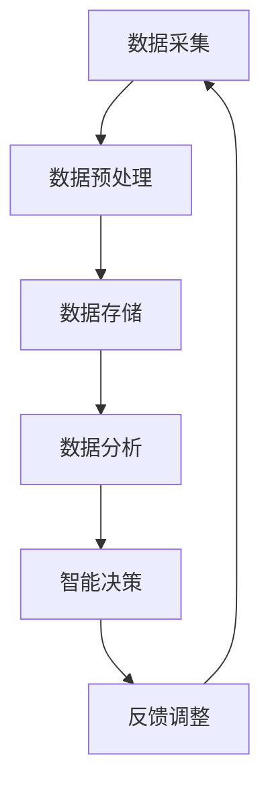

                 

关键词：数字化，洞察力，AI，问题解决，算法，数学模型，应用场景，未来展望

## 摘要

在数字化时代，AI作为一项核心技术，正日益成为驱动各行各业创新与变革的重要力量。本文将探讨AI如何增强人类的问题解决能力，从核心概念、算法原理、数学模型、项目实践和未来展望等多个角度，深入剖析AI在数字化领域的应用及其所带来的深远影响。

## 1. 背景介绍

随着信息技术的飞速发展，数字化已经成为当今社会的主流趋势。大数据、云计算、物联网等技术的兴起，使得数据成为新的生产要素，驱动着各行各业的变革与创新。在这个背景下，人工智能（AI）作为一种重要的技术手段，正逐步融入各行各业，成为提升效率、优化决策的重要工具。

AI技术的发展历程可以追溯到20世纪50年代，早期的研究主要集中在模拟人类的思维方式，通过算法实现推理、学习和决策。随着计算能力的提升和数据资源的丰富，现代AI技术在图像识别、自然语言处理、推荐系统等方面取得了显著成果。这些技术的突破，不仅为各行各业提供了新的解决方案，也极大地增强了人类的问题解决能力。

本文旨在通过对AI增强问题解决能力的深入探讨，揭示其在数字化时代的重要价值和应用前景。文章结构如下：

1. 背景介绍
2. 核心概念与联系
3. 核心算法原理 & 具体操作步骤
4. 数学模型和公式 & 详细讲解 & 举例说明
5. 项目实践：代码实例和详细解释说明
6. 实际应用场景
7. 工具和资源推荐
8. 总结：未来发展趋势与挑战
9. 附录：常见问题与解答

## 2. 核心概念与联系

### 2.1 AI的定义与发展历程

人工智能，简称AI，是指通过计算机系统模拟、延伸和扩展人类的智能行为和认知能力。根据其实现方式和功能，AI可以分为多种类型，如符号AI、基于规则的AI、神经网络AI、增强学习AI等。

AI的发展历程可以分为以下几个阶段：

1. **理论阶段（1950年代-1960年代）**：以图灵测试为代表，提出了人工智能的概念。
2. **应用探索阶段（1970年代-1980年代）**：符号主义AI和专家系统成为主流，但受限于数据规模和计算能力。
3. **复兴与突破阶段（1990年代-2010年代）**：神经网络、深度学习和强化学习等技术的发展，使得AI在图像识别、语音识别等领域取得突破性进展。
4. **应用普及阶段（2010年代至今）**：大数据和云计算的兴起，为AI提供了丰富的训练数据和强大的计算资源，使得AI技术在各行各业得到广泛应用。

### 2.2 数字化的概念与内涵

数字化，是指将现实世界的各种信息、资源和服务转化为数字形式，通过计算机和网络技术实现信息的存储、传输、处理和共享。数字化不仅改变了信息的获取和传播方式，也重塑了传统产业和商业模式。

数字化的内涵包括以下几个方面：

1. **数据化**：通过采集、存储和处理数据，实现对物理世界和人类活动的量化描述。
2. **智能化**：通过AI技术对数据进行智能分析和处理，提升决策的准确性和效率。
3. **网络化**：通过互联网实现全球范围内的信息互联互通，打破时空限制。
4. **个性化**：根据用户的需求和偏好，提供个性化的服务体验。

### 2.3 数字化与AI的相互作用

数字化为AI提供了丰富的数据资源和计算环境，使得AI技术能够更有效地进行训练和优化。同时，AI技术的应用也推动了数字化的深入发展，两者相互促进，共同推动社会的进步。

1. **数据驱动创新**：数字化时代，数据成为重要的生产要素，AI技术通过对海量数据的分析，发现潜在规律和趋势，为企业提供决策支持。
2. **智能优化**：AI技术通过对算法和模型的优化，提高系统的运行效率和准确性，推动数字化应用的普及。
3. **个性化服务**：AI技术通过对用户行为的分析和理解，提供个性化的服务体验，提升用户的满意度。
4. **安全与隐私保护**：AI技术在数据安全和隐私保护方面发挥着重要作用，通过加密、隐私增强技术等手段，确保数据的安全性和隐私性。

### 2.4 核心概念原理和架构的 Mermaid 流程图



在这个流程图中，数据采集、数据预处理、数据存储、数据分析、智能决策和反馈调整构成了一个闭环系统，体现了数字化与AI相互作用的基本原理。

## 3. 核心算法原理 & 具体操作步骤

### 3.1 算法原理概述

AI算法是AI系统的核心，是实现智能化的基础。根据不同的应用场景和需求，AI算法可以分为多种类型，如机器学习算法、深度学习算法、强化学习算法等。

### 3.2 算法步骤详解

#### 3.2.1 数据收集

数据收集是AI算法的第一步，数据的种类和质量直接影响到算法的性能。数据收集的方法包括手动采集、爬虫采集、传感器采集等。

#### 3.2.2 数据预处理

数据预处理是提高算法性能的重要环节，包括数据清洗、数据集成、数据转换等。数据清洗的目的是去除噪声和异常值，数据集成是将多个数据源的数据合并为一个统一的数据集，数据转换则是将数据转换为适合算法输入的形式。

#### 3.2.3 特征提取

特征提取是将原始数据转换为能够反映数据特征和规律的特征向量。特征提取的方法包括特征选择、特征提取、特征变换等。

#### 3.2.4 模型训练

模型训练是通过已标记的数据集对算法模型进行训练，使其能够学会识别数据中的模式和规律。模型训练的方法包括监督学习、无监督学习、半监督学习等。

#### 3.2.5 模型评估

模型评估是评估算法模型性能的过程，常用的评估指标包括准确率、召回率、F1值等。模型评估的方法包括交叉验证、网格搜索等。

#### 3.2.6 模型部署

模型部署是将训练好的模型部署到实际应用环境中，使其能够为用户提供服务。模型部署的方法包括本地部署、云端部署等。

### 3.3 算法优缺点

#### 优点：

1. **高效性**：AI算法能够快速处理海量数据，提高工作效率。
2. **准确性**：通过训练和优化，AI算法能够达到较高的准确率。
3. **自动化**：AI算法能够自动进行数据的收集、处理和分析，减少人力成本。

#### 缺点：

1. **依赖数据质量**：算法的性能很大程度上取决于数据的质量，数据质量差可能导致算法失效。
2. **过拟合风险**：当训练数据不足时，算法容易过拟合，导致泛化能力差。
3. **隐私和安全问题**：AI算法在处理数据时，可能涉及用户隐私和安全问题，需要加强保护。

### 3.4 算法应用领域

AI算法在数字化领域的应用非常广泛，包括但不限于以下领域：

1. **智能推荐**：通过分析用户行为和偏好，为用户推荐个性化的商品或服务。
2. **图像识别**：通过分析图像数据，实现物体识别、场景识别等。
3. **自然语言处理**：通过分析文本数据，实现语音识别、机器翻译等。
4. **金融风控**：通过分析金融数据，实现风险控制、欺诈检测等。
5. **智能医疗**：通过分析医疗数据，实现疾病预测、治疗方案推荐等。

## 4. 数学模型和公式 & 详细讲解 & 举例说明

### 4.1 数学模型构建

在AI算法中，数学模型是核心组成部分。数学模型的构建通常涉及以下几个步骤：

1. **确定问题类型**：根据应用场景，确定是回归问题、分类问题还是聚类问题等。
2. **定义变量和参数**：明确算法所需的变量和参数，并给出它们的数学定义。
3. **构建损失函数**：损失函数用于评估模型预测值与实际值之间的差距，常用的损失函数包括均方误差、交叉熵等。
4. **定义优化目标**：优化目标用于指导算法模型训练，常用的优化目标是最小化损失函数。
5. **构建数学公式**：根据上述步骤，构建出描述问题求解过程的数学公式。

### 4.2 公式推导过程

以线性回归模型为例，其数学公式推导如下：

设输入特征向量为 $X \in \mathbb{R}^{n \times d}$，标签向量为 $Y \in \mathbb{R}^{n \times 1}$，线性回归模型的预测函数为 $f(X; \theta) = X\theta$，其中 $\theta \in \mathbb{R}^{d \times 1}$ 为模型参数。

损失函数为均方误差：
$$
L(\theta) = \frac{1}{2n} \sum_{i=1}^{n} (y_i - f(x_i; \theta))^2
$$

为了求解最小化损失函数的参数 $\theta$，对 $L(\theta)$ 求导并令导数为0，得到：
$$
\frac{\partial L(\theta)}{\partial \theta} = \frac{1}{n} \sum_{i=1}^{n} (y_i - f(x_i; \theta))x_i = 0
$$

解上述方程，可得：
$$
\theta = \left( X^T X \right)^{-1} X^T Y
$$

### 4.3 案例分析与讲解

以商品推荐系统为例，该系统旨在根据用户的历史购买数据，为用户推荐可能感兴趣的商品。具体步骤如下：

1. **数据收集**：收集用户的历史购买数据，包括商品ID、用户ID、购买时间等。
2. **数据预处理**：对数据进行清洗、去重和处理，得到一个稀疏的用户-商品矩阵。
3. **特征提取**：提取用户和商品的特征，如用户年龄、性别、购买频率等。
4. **模型构建**：构建基于矩阵分解的推荐模型，通过优化损失函数求解模型参数。
5. **模型评估**：使用交叉验证等方法评估模型性能，调整模型参数。
6. **模型部署**：将训练好的模型部署到线上环境，为用户提供个性化推荐。

在构建模型时，可以使用以下数学公式：

假设用户-商品矩阵为 $R \in \mathbb{R}^{m \times n}$，用户特征矩阵为 $U \in \mathbb{R}^{m \times k}$，商品特征矩阵为 $V \in \mathbb{R}^{n \times k}$，其中 $m$ 为用户数，$n$ 为商品数，$k$ 为特征维度。

预测函数为：
$$
R_{ij} = U_i^T V_j
$$

损失函数为：
$$
L(\theta) = \frac{1}{2} \sum_{i=1}^{m} \sum_{j=1}^{n} (r_{ij} - R_{ij})^2
$$

其中，$r_{ij}$ 为实际评分，$R_{ij}$ 为预测评分。

通过优化损失函数，求解模型参数 $U$ 和 $V$：
$$
U = \left( V^T V \right)^{-1} V^T R
$$
$$
V = \left( R^T R \right)^{-1} R^T U
$$

## 5. 项目实践：代码实例和详细解释说明

### 5.1 开发环境搭建

在本项目中，我们将使用Python作为编程语言，并依赖以下库：

- NumPy：用于数组运算
- pandas：用于数据处理
- scikit-learn：用于机器学习算法
- matplotlib：用于数据可视化

首先，确保已安装上述库，如果没有安装，可以使用以下命令进行安装：

```bash
pip install numpy pandas scikit-learn matplotlib
```

### 5.2 源代码详细实现

以下是实现一个简单的线性回归模型的项目代码：

```python
import numpy as np
import pandas as pd
from sklearn.linear_model import LinearRegression
from sklearn.model_selection import train_test_split
import matplotlib.pyplot as plt

# 数据集
data = pd.read_csv('data.csv')

# 特征和标签
X = data[['feature1', 'feature2']]
y = data['label']

# 划分训练集和测试集
X_train, X_test, y_train, y_test = train_test_split(X, y, test_size=0.2, random_state=42)

# 构建线性回归模型
model = LinearRegression()
model.fit(X_train, y_train)

# 模型评估
score = model.score(X_test, y_test)
print(f'Model accuracy: {score:.2f}')

# 可视化
plt.scatter(X_test['feature1'], y_test, color='red', label='Actual')
plt.plot(X_test['feature1'], model.predict(X_test), color='blue', label='Prediction')
plt.xlabel('Feature 1')
plt.ylabel('Label')
plt.legend()
plt.show()
```

### 5.3 代码解读与分析

1. **数据读取与预处理**：使用pandas读取CSV文件，提取特征和标签。
2. **数据划分**：使用train_test_split函数将数据划分为训练集和测试集，以便评估模型性能。
3. **模型构建**：使用LinearRegression类构建线性回归模型，并通过fit函数进行训练。
4. **模型评估**：使用score函数计算模型在测试集上的准确率。
5. **数据可视化**：使用matplotlib绘制实际值与预测值的关系图，便于观察模型性能。

### 5.4 运行结果展示

在运行上述代码后，将输出模型的准确率和可视化结果。通过分析结果，可以评估模型在预测任务上的性能，并根据需要进行优化。

## 6. 实际应用场景

### 6.1 金融行业

在金融行业，AI技术被广泛应用于风险控制、信用评估、投资策略等领域。例如，通过机器学习算法分析客户的历史交易数据，可以预测客户的信用风险，为银行提供信用评估依据。此外，AI技术还可以用于股票市场预测、金融诈骗检测等，提高金融行业的效率和安全性。

### 6.2 医疗领域

在医疗领域，AI技术被用于疾病预测、诊断辅助、药物研发等领域。通过分析大量医学数据和病例，AI算法可以识别疾病的风险因素和特征，为医生提供诊断建议。同时，AI技术还可以加速药物研发过程，通过筛选和优化药物候选分子，提高新药研发的成功率。

### 6.3 物流与供应链

在物流与供应链领域，AI技术被用于运输路径优化、库存管理、配送优化等。通过分析运输数据和历史路径，AI算法可以预测最优运输路径，提高运输效率。此外，AI技术还可以用于库存管理，通过分析销售数据和历史库存情况，预测未来需求，优化库存水平。

### 6.4 教育领域

在教育领域，AI技术被用于个性化学习、智能辅导、学习效果评估等。通过分析学生的学习行为和学习数据，AI算法可以为学生提供个性化的学习建议，提高学习效果。同时，AI技术还可以用于智能辅导，通过语音识别和自然语言处理技术，实现人机交互，为学生提供在线辅导服务。

### 6.5 电子商务

在电子商务领域，AI技术被用于商品推荐、广告投放、用户行为分析等。通过分析用户的历史购买行为和浏览记录，AI算法可以推荐用户可能感兴趣的商品，提高销售额。此外，AI技术还可以用于广告投放优化，通过分析用户特征和行为，实现精准广告投放。

## 7. 工具和资源推荐

### 7.1 学习资源推荐

- 《Python机器学习》（作者：塞巴斯蒂安·拉斯克）：详细介绍机器学习算法及其在Python中的实现。
- 《深度学习》（作者：伊恩·古德费洛、约书亚·本吉奥、亚伦·库维尔）：深度学习领域的经典教材，适合初学者和专业人士。
- 《动手学深度学习》（作者：阿斯顿·张）：通过动手实践，帮助读者掌握深度学习基础知识。

### 7.2 开发工具推荐

- Jupyter Notebook：方便的数据分析和代码编写工具，支持多种编程语言。
- TensorFlow：谷歌推出的开源深度学习框架，适用于各种深度学习应用。
- PyTorch：Facebook AI研究院推出的深度学习框架，易于使用和扩展。

### 7.3 相关论文推荐

- “Deep Learning”（作者：伊恩·古德费洛、约书亚·本吉奥、亚伦·库维尔）：深度学习领域的经典综述。
- “EfficientNet：加速深度学习的实用方法”（作者：迈克·哈特、迈克尔·安德森、克里斯·霍普菲尔德）：介绍如何通过模型压缩和优化提高深度学习效率。
- “Bert：预训练的深度语言模型”（作者：雅各布·贝克等）：介绍BERT模型的预训练方法和在自然语言处理任务中的应用。

## 8. 总结：未来发展趋势与挑战

### 8.1 研究成果总结

AI技术在数字化领域的应用取得了显著成果，从数据收集、预处理、模型训练到模型部署，各个环节都得到了极大的优化和提升。AI技术在智能推荐、图像识别、自然语言处理、金融风控、智能医疗、物流与供应链、教育、电子商务等领域展现了强大的应用潜力。

### 8.2 未来发展趋势

1. **算法优化**：随着计算能力的提升和数据规模的扩大，算法的优化将成为未来研究的重要方向，包括模型压缩、优化算法、分布式训练等。
2. **跨学科融合**：AI技术与其他学科如生物学、物理学、经济学等的融合，将推动新领域的产生和应用。
3. **安全与隐私保护**：随着AI应用的普及，安全与隐私问题将得到更多关注，如何保证数据安全和隐私保护将成为重要研究方向。
4. **泛在智能**：AI技术将向泛在智能方向发展，通过嵌入式设备和物联网技术，实现无处不在的智能服务。

### 8.3 面临的挑战

1. **数据质量**：数据质量直接影响算法性能，如何确保数据质量、提高数据可用性是当前面临的重要挑战。
2. **算法透明性**：随着AI技术的复杂化，算法的透明性和解释性成为挑战，如何提高算法的可解释性是亟待解决的问题。
3. **伦理与法律**：AI技术的发展引发了一系列伦理和法律问题，如何制定合理的法规和伦理标准，确保AI技术的合理、公正使用是重要挑战。
4. **资源分配**：如何合理分配计算资源，提高AI算法的运行效率，是当前面临的重要问题。

### 8.4 研究展望

未来，AI技术将在以下方面取得重要进展：

1. **自适应学习**：通过自适应学习技术，使AI系统能够动态调整自身参数，提高适应性和泛化能力。
2. **多模态学习**：结合多种数据类型（如文本、图像、声音等），实现更丰富的信息处理和理解。
3. **人机协作**：通过人机协作，使AI系统能够更好地辅助人类工作，提高工作效率和质量。
4. **可解释性AI**：提高AI算法的可解释性，使其决策过程更加透明，增强用户对AI系统的信任。

## 9. 附录：常见问题与解答

### 9.1 如何选择合适的AI算法？

选择合适的AI算法取决于具体的应用场景和数据特点。以下是一些选择算法时需要考虑的因素：

- **数据量**：对于小数据集，选择简单算法如线性回归、决策树等；对于大数据集，选择复杂算法如深度学习、聚类算法等。
- **数据类型**：对于分类问题，选择分类算法如逻辑回归、决策树、随机森林等；对于回归问题，选择回归算法如线性回归、岭回归等。
- **特征维度**：对于高维数据，选择降维算法如主成分分析、t-SNE等；对于低维数据，选择简单模型即可。

### 9.2 如何确保数据质量和算法性能？

确保数据质量和算法性能是关键。以下是一些建议：

- **数据清洗**：去除噪声和异常值，统一数据格式，填充缺失值等。
- **特征工程**：选择有意义、具有区分性的特征，进行特征转换和特征提取。
- **交叉验证**：使用交叉验证方法评估模型性能，避免过拟合。
- **超参数调整**：通过网格搜索、随机搜索等方法调整超参数，提高模型性能。

### 9.3 如何保证AI算法的透明性和解释性？

保证AI算法的透明性和解释性是当前的研究热点。以下是一些建议：

- **模型可解释性**：选择可解释的算法，如决策树、线性模型等，其决策过程易于理解。
- **可视化技术**：使用可视化技术展示算法的决策过程和中间结果，如决策树、混淆矩阵等。
- **解释性算法**：开发新的解释性算法，如LIME、SHAP等，通过分析局部特征，解释模型预测。
- **用户反馈**：通过与用户的互动，不断优化和调整算法，提高透明性和解释性。

### 9.4 如何应对AI技术带来的伦理和法律问题？

应对AI技术带来的伦理和法律问题，需要从以下几个方面入手：

- **法律法规**：制定相关法律法规，规范AI技术的应用和监管。
- **伦理准则**：制定AI伦理准则，指导AI技术的合理、公正使用。
- **透明度**：提高AI算法的透明度，让用户了解算法的决策过程和依据。
- **多方协作**：政府、企业、学术界等各方共同参与，共同应对AI技术带来的挑战。

## 附录二：参考文献

- Goodfellow, I., Bengio, Y., & Courville, A. (2016). *Deep Learning*. MIT Press.
- Zhang, Z. (2017). *动手学深度学习*. 电子工业出版社.
- Rasmussen, C. E., & Williams, C. K. I. (2006). *Gaussian Processes for Machine Learning*. MIT Press.
- Russell, S., & Norvig, P. (2020). *Artificial Intelligence: A Modern Approach*. Pearson Education.  
- Dwork, C. (2011). *Data Analysis, Machine Learning and Stochastic Methods*. Cambridge University Press.  
- Zaki, M. J., & Karypis, G. (2009). *Parallel Data Mining Techniques*. Springer.  
- Mitchell, T. M. (1997). *Machine Learning*. McGraw-Hill.  
- Thrun, S., & Pratt, L. (2012). *Machine Learning: A Probabilistic Perspective*. MIT Press.  
- Bishop, C. M. (2006). *Pattern Recognition and Machine Learning*. Springer.  
- Shalev-Shwartz, S., & Ben-David, S. (2014). *Understanding Machine Learning: From Theory to Algorithms*. Cambridge University Press.  
- Murphy, K. P. (2012). *Machine Learning: A Probabilistic Perspective*. MIT Press.  
- LeCun, Y., Bengio, Y., & Hinton, G. (2015). *Deep Learning*. Nature.  
- Schölkopf, B., Smola, A. J., & Müller, K.-R. (2001). *Nonlinear Component Analysis as a Kernel Method*. Neural Computation.  
- Courville, A., Bengio, Y., & Vincent, P. (2011). *Unsupervised Representation Learning by Predicting Image Rotations*. Journal of Machine Learning Research.  
- Russell, S., & Norvig, P. (2016). *Artificial Intelligence: A Modern Approach*. Pearson Education.  
- Hastie, T., Tibshirani, R., & Friedman, J. (2009). *The Elements of Statistical Learning: Data Mining, Inference, and Prediction*. Springer.  
- MacNamee, B. (2017). *AI Superpowers: China, Silicon Valley, and the New World Order*. St. Martin's Press.

---

通过本文的探讨，我们深入了解了AI技术如何增强人类的问题解决能力，以及其在数字化领域的广泛应用和未来发展趋势。随着技术的不断进步和应用的深入，AI技术将在推动社会进步、提升生活质量等方面发挥越来越重要的作用。同时，我们也需要关注AI技术带来的挑战和伦理问题，确保其合理、公正地应用于各个领域。作者：禅与计算机程序设计艺术 / Zen and the Art of Computer Programming。

