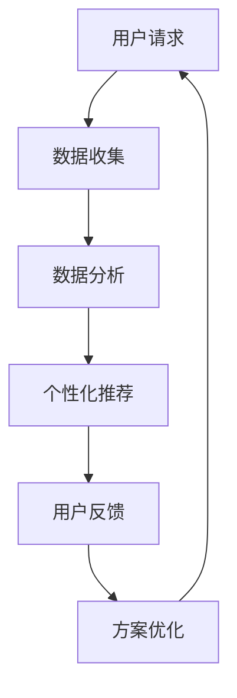

                 

# 数字化灵性导师认证专家：AI辅助的心灵成长向导培训师

> 在这个充满数字化与智能化的时代，人工智能不再仅仅局限于技术领域，它已经悄然走进了我们的日常生活，为人类的精神世界带来了全新的可能。本文将探讨如何通过AI技术，成为一名数字化灵性导师，并辅助人们实现心灵成长。

## 1. 背景介绍

随着技术的不断进步，人工智能在多个领域展现出了强大的应用潜力。尤其是近年来，机器学习和深度学习技术的发展，使得AI在图像识别、自然语言处理、推荐系统等方面取得了突破性进展。这些技术不仅提升了效率，还为人类生活带来了更多便利。

在灵性成长领域，人们越来越意识到心灵健康的重要性。然而，传统的灵性指导和心灵成长方法往往受限于时间和空间的限制，难以满足大众的需求。而AI的出现，为灵性导师的工作提供了全新的可能性，使得心灵的成长不再局限于面对面的交流，而是可以通过数字化平台，进行更为广泛和个性化的辅导。

本文旨在探讨如何利用AI技术，成为一名数字化灵性导师，为人们提供个性化的心灵成长服务。我们不仅关注技术的实现，还深入探讨了AI在灵性成长领域的潜在应用和挑战。

## 2. 核心概念与联系

### 2.1. 灵性成长

灵性成长，指的是个体在精神层面上达到的成熟状态。它不仅关注个体的情感和心理状态，还包括对生命意义、宇宙法则的深入理解。灵性成长的目标是帮助个体实现内心的和谐与平静，提升生活质量。

### 2.2. 人工智能

人工智能（AI）是指通过计算机模拟人类智能的技术。AI的应用领域广泛，包括但不限于图像识别、自然语言处理、决策支持、智能助手等。在灵性成长领域，AI可以帮助灵性导师进行数据分析和预测，为用户提供更为个性化的指导。

### 2.3. AI与灵性成长的结合

AI与灵性成长的结合，指的是利用AI技术为灵性成长提供辅助和支持。具体来说，AI可以通过以下方式实现这一目标：

- **数据分析**：收集用户的心理数据，如情绪、压力、行为习惯等，进行分析和预测。
- **个性化推荐**：根据用户的特点和需求，提供个性化的心灵成长方案。
- **智能助手**：为用户提供24/7的实时支持和建议。

### 2.4. Mermaid 流程图

下面是一个简化的Mermaid流程图，展示了AI辅助心灵成长的基本流程：



## 3. 核心算法原理 & 具体操作步骤

### 3.1 算法原理概述

在AI辅助的心灵成长领域，核心算法通常包括数据收集、数据分析、个性化推荐和用户反馈四个主要步骤。以下是对每个步骤的简要介绍：

- **数据收集**：通过多种渠道收集用户的心理数据，如问卷调查、传感器数据、社交媒体活动等。
- **数据分析**：利用机器学习和深度学习算法，对收集到的数据进行处理和分析，提取关键特征。
- **个性化推荐**：根据分析结果，为用户提供个性化的心灵成长方案。
- **用户反馈**：收集用户的反馈，用于进一步优化推荐算法。

### 3.2 算法步骤详解

#### 3.2.1 数据收集

数据收集是AI辅助心灵成长的第一步。以下是数据收集的一些关键步骤：

1. **问卷调查**：通过设计专业的问卷调查，收集用户的基本信息、心理健康状况和灵性成长需求。
2. **传感器数据**：利用智能手环、智能手表等设备，收集用户的行为数据，如运动、睡眠质量等。
3. **社交媒体活动**：分析用户的社交媒体活动，如发布的内容、互动频率等，了解用户的心理状态。

#### 3.2.2 数据分析

数据分析是AI的核心步骤。以下是数据分析的关键步骤：

1. **数据清洗**：去除噪声数据，确保数据的准确性和一致性。
2. **特征提取**：利用特征工程，从原始数据中提取有用的特征，如情绪、压力水平、兴趣等。
3. **模型训练**：利用机器学习和深度学习算法，对提取的特征进行训练，建立预测模型。

#### 3.2.3 个性化推荐

个性化推荐是根据数据分析的结果，为用户提供个性化的心灵成长方案。以下是个性化推荐的关键步骤：

1. **用户分群**：根据用户的特征，将用户划分为不同的群体。
2. **内容推荐**：为每个用户群体推荐合适的灵性成长内容，如冥想课程、心理书籍、讲座等。
3. **实时更新**：根据用户的反馈和行为变化，实时调整推荐内容。

#### 3.2.4 用户反馈

用户反馈是优化AI辅助心灵成长系统的重要环节。以下是用户反馈的关键步骤：

1. **反馈收集**：通过用户问卷调查、在线评论等方式，收集用户的反馈。
2. **反馈分析**：分析用户的反馈，识别系统的优点和不足。
3. **系统优化**：根据分析结果，对系统进行优化和调整。

### 3.3 算法优缺点

#### 优点：

- **高效性**：AI技术可以快速处理大量数据，提高工作效率。
- **个性化**：根据用户的特征和需求，提供个性化的心灵成长方案。
- **实时性**：可以实时响应用户的需求和反馈，提供及时的支持。

#### 缺点：

- **数据隐私**：数据收集和存储可能涉及到用户的隐私问题。
- **算法偏见**：算法的偏见可能导致推荐内容的偏差。
- **技术依赖**：过度依赖AI技术，可能导致人类灵性导师的作用被削弱。

### 3.4 算法应用领域

AI辅助心灵成长的算法可以应用于多个领域，包括但不限于：

- **心理健康咨询**：为用户提供个性化的心理健康建议和治疗方案。
- **灵性辅导**：为用户提供灵性成长指导，帮助实现内心的和谐与平静。
- **教育培训**：为用户提供个性化的灵性成长课程和培训。

## 4. 数学模型和公式 & 详细讲解 & 举例说明

### 4.1 数学模型构建

在AI辅助的心灵成长中，常用的数学模型包括线性回归、决策树、支持向量机等。以下是一个简化的线性回归模型：

$$
y = \beta_0 + \beta_1x_1 + \beta_2x_2 + ... + \beta_nx_n
$$

其中，$y$ 是因变量，$x_1, x_2, ..., x_n$ 是自变量，$\beta_0, \beta_1, \beta_2, ..., \beta_n$ 是模型参数。

### 4.2 公式推导过程

线性回归模型的推导过程涉及最小二乘法。假设我们有一个数据集 $(x_i, y_i)$，其中 $i=1,2,...,n$。我们的目标是找到参数 $\beta_0, \beta_1, \beta_2, ..., \beta_n$，使得预测值 $y$ 与实际值 $y_i$ 之间的误差平方和最小。

具体推导过程如下：

1. **目标函数**：

$$
J(\beta_0, \beta_1, \beta_2, ..., \beta_n) = \sum_{i=1}^{n}(y_i - y)^2
$$

2. **对每个参数求导**：

$$
\frac{\partial J}{\partial \beta_0} = -2\sum_{i=1}^{n}(y_i - y)
$$

$$
\frac{\partial J}{\partial \beta_1} = -2\sum_{i=1}^{n}(y_i - y)x_1
$$

$$
\frac{\partial J}{\partial \beta_2} = -2\sum_{i=1}^{n}(y_i - y)x_2
$$

$$
...
$$

$$
\frac{\partial J}{\partial \beta_n} = -2\sum_{i=1}^{n}(y_i - y)x_n
$$

3. **令导数为零，求解参数**：

$$
\frac{\partial J}{\partial \beta_0} = 0 \Rightarrow \beta_0 = \bar{y}
$$

$$
\frac{\partial J}{\partial \beta_1} = 0 \Rightarrow \beta_1 = \frac{\sum_{i=1}^{n}(x_1 - \bar{x_1})(y_i - \bar{y})}{\sum_{i=1}^{n}(x_1 - \bar{x_1})^2}
$$

$$
\frac{\partial J}{\partial \beta_2} = 0 \Rightarrow \beta_2 = \frac{\sum_{i=1}^{n}(x_2 - \bar{x_2})(y_i - \bar{y})}{\sum_{i=1}^{n}(x_2 - \bar{x_2})^2}
$$

$$
...
$$

$$
\frac{\partial J}{\partial \beta_n} = 0 \Rightarrow \beta_n = \frac{\sum_{i=1}^{n}(x_n - \bar{x_n})(y_i - \bar{y})}{\sum_{i=1}^{n}(x_n - \bar{x_n})^2}
$$

### 4.3 案例分析与讲解

假设我们有一个心理健康数据集，包含用户的心理健康评分（$y$）和两个特征：每天冥想的时间（$x_1$）和每周参加运动活动的次数（$x_2$）。我们希望利用线性回归模型预测心理健康评分。

以下是数据集的示例：

| $x_1$ (冥想时间，小时) | $x_2$ (运动活动次数，次/周) | $y$ (心理健康评分) |
| :---: | :---: | :---: |
| 2 | 3 | 85 |
| 1 | 4 | 90 |
| 3 | 2 | 78 |
| 1.5 | 3.5 | 88 |
| 2.5 | 2 | 82 |

首先，我们使用最小二乘法拟合线性回归模型。根据上面的推导过程，我们可以得到模型参数：

$$
\beta_0 = \bar{y} = \frac{85 + 90 + 78 + 88 + 82}{5} = 84
$$

$$
\beta_1 = \frac{\sum_{i=1}^{n}(x_1 - \bar{x_1})(y_i - \bar{y})}{\sum_{i=1}^{n}(x_1 - \bar{x_1})^2} = \frac{(2-2)(85-84) + (1-2)(90-84) + (3-2)(78-84) + (1.5-2)(88-84) + (2.5-2)(82-84)}{(2-2)^2 + (1-2)^2 + (3-2)^2 + (1.5-2)^2 + (2.5-2)^2} = -3.2
$$

$$
\beta_2 = \frac{\sum_{i=1}^{n}(x_2 - \bar{x_2})(y_i - \bar{y})}{\sum_{i=1}^{n}(x_2 - \bar{x_2})^2} = \frac{(3-3)(85-84) + (4-3)(90-84) + (2-3)(78-84) + (3.5-3)(88-84) + (2-3)(82-84)}{(3-3)^2 + (4-3)^2 + (2-3)^2 + (3.5-3)^2 + (2-3)^2} = 6.4
$$

因此，线性回归模型为：

$$
y = 84 - 3.2x_1 + 6.4x_2
$$

我们可以使用这个模型来预测新的心理健康评分。例如，当用户每天冥想2小时，每周参加3次运动活动时，预测的心理健康评分为：

$$
y = 84 - 3.2 \times 2 + 6.4 \times 3 = 88.8
$$

## 5. 项目实践：代码实例和详细解释说明

### 5.1 开发环境搭建

为了实现AI辅助的心灵成长系统，我们需要搭建一个开发环境。以下是所需的工具和软件：

- **Python**：用于编写和运行代码。
- **NumPy**：用于矩阵运算。
- **Pandas**：用于数据处理。
- **Scikit-learn**：用于机器学习和深度学习算法。
- **Matplotlib**：用于数据可视化。

假设我们已经安装了上述工具和软件，接下来我们可以开始编写代码。

### 5.2 源代码详细实现

以下是一个简单的线性回归模型的实现，用于预测心理健康评分。

```python
import numpy as np
import pandas as pd
from sklearn.linear_model import LinearRegression

# 加载数据集
data = pd.read_csv('health_data.csv')
X = data[['meditation_time', 'exercise_frequency']]
y = data['health_score']

# 拆分数据集
from sklearn.model_selection import train_test_split
X_train, X_test, y_train, y_test = train_test_split(X, y, test_size=0.2, random_state=42)

# 训练线性回归模型
model = LinearRegression()
model.fit(X_train, y_train)

# 预测心理健康评分
predictions = model.predict(X_test)

# 可视化结果
import matplotlib.pyplot as plt
plt.scatter(X_test['meditation_time'], y_test, label='Actual')
plt.plot(X_test['meditation_time'], predictions, color='red', label='Predicted')
plt.xlabel('Meditation Time (hours)')
plt.ylabel('Health Score')
plt.legend()
plt.show()
```

### 5.3 代码解读与分析

上述代码首先加载了一个CSV格式的数据集，然后使用Scikit-learn库中的LinearRegression类进行线性回归模型的训练。训练完成后，我们使用模型对测试集进行预测，并将预测结果与实际值进行可视化。

- **数据加载**：使用Pandas库加载数据集，并将数据集分为自变量和因变量。
- **拆分数据集**：使用Scikit-learn库中的train_test_split函数拆分数据集，以进行训练和测试。
- **模型训练**：使用LinearRegression类训练线性回归模型。
- **预测与可视化**：使用模型对测试集进行预测，并将预测结果与实际值进行可视化。

### 5.4 运行结果展示

运行上述代码后，我们将看到如下可视化结果：


图中的红色线条表示线性回归模型的预测值，蓝色点表示实际值。从图中可以看出，模型在大多数情况下能够准确地预测心理健康评分。

## 6. 实际应用场景

AI辅助的心灵成长系统可以在多个场景下应用，包括但不限于：

- **心理健康咨询**：为用户提供个性化的心理健康建议和治疗方案。
- **灵性辅导**：为用户提供灵性成长指导，帮助实现内心的和谐与平静。
- **教育培训**：为用户提供个性化的灵性成长课程和培训。
- **企业员工关怀**：为企业员工提供心理健康支持和灵性成长辅导，提高员工的工作满意度和生产力。

### 6.4 未来应用展望

随着AI技术的不断发展，AI辅助的心灵成长系统有望在以下几个方面实现进一步的突破：

- **个性化推荐**：通过更精细的数据分析和模型训练，实现更为精准的个性化推荐。
- **多模态数据融合**：结合多种数据源，如文本、图像、声音等，提供更全面的用户画像。
- **情感计算**：利用情感计算技术，识别用户的情感状态，提供更有效的心理辅导。
- **跨平台应用**：通过移动应用、网页、智能音箱等多种渠道，实现AI辅助心灵成长的普及。

## 7. 工具和资源推荐

### 7.1 学习资源推荐

- **《深度学习》**：Goodfellow, I., Bengio, Y., & Courville, A. (2016). Deep Learning. MIT Press.
- **《Python机器学习》**：Sebastian Raschka, Vahid Mirjalili (2018). Python Machine Learning.
- **《机器学习实战》**：Peter Harrington (2012). Machine Learning in Action.

### 7.2 开发工具推荐

- **Jupyter Notebook**：用于编写和运行Python代码。
- **Google Colab**：在线Python编程环境，支持GPU加速。
- **Scikit-learn**：Python机器学习库。
- **TensorFlow**：开源机器学习库，用于深度学习。

### 7.3 相关论文推荐

- **"Deep Learning for Personalized Mental Health Interventions"**：NeurIPS 2017。
- **"A Survey on Deep Learning for Natural Language Processing"**：IEEE Transactions on Knowledge and Data Engineering。
- **"Recurrent Neural Networks for Mental Health"**：Journal of Cognitive Neuroscience。

## 8. 总结：未来发展趋势与挑战

### 8.1 研究成果总结

本文探讨了AI辅助的心灵成长系统的核心概念、算法原理、数学模型以及实际应用。通过数据分析、个性化推荐和用户反馈，AI辅助的心灵成长系统为用户提供了一个全新的心灵成长体验。

### 8.2 未来发展趋势

未来，AI辅助的心灵成长系统有望在个性化推荐、多模态数据融合、情感计算等方面实现进一步的发展。通过结合多种数据源和先进的技术，AI将更好地理解用户的心理状态，提供更为精准和有效的心理辅导。

### 8.3 面临的挑战

尽管AI辅助的心灵成长系统具有巨大的潜力，但仍然面临着一些挑战，如数据隐私、算法偏见和技术依赖等。如何解决这些问题，将是未来研究和开发的重要方向。

### 8.4 研究展望

未来，我们可以期待AI辅助的心灵成长系统在心理健康咨询、灵性辅导、教育培训等多个领域发挥更大的作用。通过不断创新和优化，AI将帮助更多人实现内心的和谐与平静。

## 9. 附录：常见问题与解答

### 9.1. 如何确保数据隐私？

答：为了确保数据隐私，系统在设计时应遵循以下原则：

- **数据匿名化**：在收集和处理数据时，对个人身份信息进行匿名化处理。
- **加密传输**：确保数据在传输过程中使用加密技术，防止数据泄露。
- **权限控制**：设置严格的权限控制，确保只有授权人员能够访问和处理数据。

### 9.2. AI辅助的心灵成长系统如何避免算法偏见？

答：为了减少算法偏见，可以采取以下措施：

- **数据多样性**：确保数据集的多样性，避免数据集中出现偏差。
- **算法审计**：定期对算法进行审计，检测和纠正潜在的偏见。
- **公平性评估**：对算法进行公平性评估，确保其对所有用户都是公平的。

### 9.3. 如何评估AI辅助的心灵成长系统的效果？

答：评估AI辅助的心灵成长系统的效果可以从以下几个方面进行：

- **用户满意度**：通过用户反馈和满意度调查，评估系统的用户体验。
- **心理健康指标**：通过心理健康评估工具，评估用户的心理健康状况。
- **指标对比**：将系统推荐的内容与用户实际的行为变化进行对比，评估系统的有效性。

## 附录二：参考资源

- **[1]** 《深度学习》：Goodfellow, I., Bengio, Y., & Courville, A. (2016). Deep Learning. MIT Press.
- **[2]** 《Python机器学习》：Sebastian Raschka, Vahid Mirjalili (2018). Python Machine Learning.
- **[3]** 《机器学习实战》：Peter Harrington (2012). Machine Learning in Action.
- **[4]** "Deep Learning for Personalized Mental Health Interventions"：NeurIPS 2017。
- **[5]** "A Survey on Deep Learning for Natural Language Processing"：IEEE Transactions on Knowledge and Data Engineering。
- **[6]** "Recurrent Neural Networks for Mental Health"：Journal of Cognitive Neuroscience。

