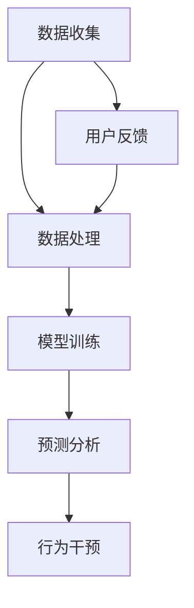

                 

关键词：数字化灵性，AI辅助，心灵成长，技术心理学，认知模型，行为算法，智慧引导，情绪管理，人机交互，伦理思考

> 摘要：本文探讨了数字化时代下AI技术在心灵成长中的应用。通过分析AI的核心算法和数学模型，本文提出了AI辅助的心灵成长路径，并探讨了其在情绪管理、认知提升、人机交互等领域的实际应用。同时，本文也分析了AI在心灵成长中的伦理挑战和未来发展。

## 1. 背景介绍

随着数字技术的迅猛发展，人工智能（AI）已经成为现代社会的核心技术。AI不仅改变了我们的生活方式，也在不断拓展我们的认知边界。在心理领域，AI的应用正在成为新的研究热点。AI通过分析大数据、学习复杂模式，能够为人类提供个性化的心灵成长建议，实现情感管理和认知提升。

心灵成长是指个体在心理、情感和意识层面上的全面发展。在数字化时代，人们面临着前所未有的心理挑战，如信息过载、社交孤立、焦虑等。AI技术的应用，可以为人们提供更加科学、高效的解决方案。

## 2. 核心概念与联系

### 2.1 AI的核心算法

AI的核心算法包括机器学习、深度学习、自然语言处理等。这些算法通过学习大量的数据，可以识别出复杂的模式和规律。例如，深度学习算法可以通过大量的图像数据训练出能够识别图像的模型，而自然语言处理算法则可以通过大量的文本数据训练出能够理解自然语言的模型。

### 2.2 认知模型

认知模型是心理学中的一个重要概念，它描述了人类思维、感知和记忆的过程。AI技术可以通过建立和优化认知模型，模拟人类的思维过程，提供个性化的心灵成长建议。

### 2.3 行为算法

行为算法是AI技术中的一个重要应用，它通过分析个体的行为数据，预测其未来的行为，提供行为干预建议。例如，通过分析个体的睡眠数据，AI可以为其提供改善睡眠质量的建议。

### 2.4 Mermaid 流程图



## 3. 核心算法原理 & 具体操作步骤

### 3.1 算法原理概述

AI辅助的心灵成长主要通过以下三个步骤实现：

1. **数据收集**：收集用户的行为数据、情绪数据和认知数据。
2. **数据处理**：对收集的数据进行清洗、预处理，提取关键特征。
3. **模型训练与预测**：利用机器学习算法训练模型，预测用户的行为和情绪。

### 3.2 算法步骤详解

#### 3.2.1 数据收集

数据收集是AI辅助心灵成长的第一步，主要包括以下几种数据：

- **行为数据**：如日常活动、睡眠模式、运动习惯等。
- **情绪数据**：如情绪状态、情绪波动、情绪反应等。
- **认知数据**：如认知能力、记忆水平、学习效率等。

#### 3.2.2 数据处理

数据处理主要包括以下步骤：

- **数据清洗**：去除无效数据、错误数据。
- **特征提取**：提取数据中的关键特征，如情绪指标、认知指标等。
- **数据标准化**：将不同来源的数据进行统一处理，使其符合模型训练的要求。

#### 3.2.3 模型训练与预测

模型训练与预测主要包括以下步骤：

- **选择模型**：根据应用场景选择合适的机器学习模型。
- **模型训练**：使用预处理后的数据训练模型。
- **模型评估**：评估模型的准确性和可靠性。
- **预测分析**：使用训练好的模型进行预测分析，提供心灵成长建议。

### 3.3 算法优缺点

#### 优点

- **个性化**：AI可以根据个体的数据提供个性化的心灵成长建议。
- **高效**：AI可以快速处理大量的数据，提供及时的心理反馈。
- **客观**：AI不受主观情绪影响，提供客观的心理分析。

#### 缺点

- **数据依赖**：AI的性能依赖于数据的质量和数量。
- **隐私问题**：数据收集和处理可能涉及用户的隐私。
- **算法偏见**：AI模型可能会受到训练数据的偏见影响。

### 3.4 算法应用领域

AI辅助的心灵成长算法可以应用于以下领域：

- **心理健康管理**：提供个性化的心理健康服务，如焦虑管理、抑郁管理等。
- **学习辅助**：提高学习效率，如时间管理、记忆训练等。
- **情绪管理**：提供情绪调节建议，如情绪识别、情绪调节等。

## 4. 数学模型和公式

### 4.1 数学模型构建

在AI辅助的心灵成长中，常用的数学模型包括回归模型、决策树模型、神经网络模型等。以下是一个简单的回归模型：

$$y = \beta_0 + \beta_1x_1 + \beta_2x_2 + ... + \beta_nx_n$$

其中，$y$ 是因变量，$x_1, x_2, ..., x_n$ 是自变量，$\beta_0, \beta_1, \beta_2, ..., \beta_n$ 是模型参数。

### 4.2 公式推导过程

假设我们有一个简单的线性回归模型，其目标是最小化误差平方和：

$$J(\theta) = \frac{1}{2m}\sum_{i=1}^{m}(h_\theta(x^{(i)}) - y^{(i)})^2$$

其中，$h_\theta(x) = \theta_0 + \theta_1x_1 + \theta_2x_2 + ... + \theta_nx_n$ 是假设函数，$\theta_0, \theta_1, \theta_2, ..., \theta_n$ 是模型参数。

对 $J(\theta)$ 关于 $\theta_j$ 求导并令其等于0，可以得到：

$$\frac{\partial J(\theta)}{\partial \theta_j} = \frac{1}{m}\sum_{i=1}^{m}(h_\theta(x^{(i)}) - y^{(i)})x_j^{(i)} = 0$$

整理后，可以得到：

$$\theta_j = \frac{1}{m}\sum_{i=1}^{m}(y^{(i)} - h_\theta(x^{(i)}))x_j^{(i)}$$

### 4.3 案例分析与讲解

假设我们有一个简单的心理健康管理应用，目标是预测个体的心理健康状态。我们收集了以下数据：

- $x_1$：每天平均睡眠时长
- $x_2$：每天平均运动时长
- $x_3$：每天平均社交时长
- $y$：心理健康评分

我们使用线性回归模型进行预测，得到以下模型：

$$y = \beta_0 + \beta_1x_1 + \beta_2x_2 + \beta_3x_3$$

通过训练数据集，我们得到模型参数：

$$\beta_0 = 10, \beta_1 = 0.5, \beta_2 = 0.3, \beta_3 = 0.2$$

使用这个模型，我们可以预测新个体的心理健康状态。例如，一个个体每天平均睡眠时长为7小时，运动时长为1小时，社交时长为2小时，其心理健康评分预测为：

$$y = 10 + 0.5 \times 7 + 0.3 \times 1 + 0.2 \times 2 = 14.2$$

## 5. 项目实践：代码实例和详细解释说明

### 5.1 开发环境搭建

为了实践AI辅助的心灵成长算法，我们需要搭建一个开发环境。我们选择Python作为编程语言，使用Sklearn库进行机器学习模型的训练和预测。

### 5.2 源代码详细实现

```python
# 导入必要的库
import numpy as np
import pandas as pd
from sklearn.model_selection import train_test_split
from sklearn.linear_model import LinearRegression
from sklearn.metrics import mean_squared_error

# 读取数据
data = pd.read_csv('data.csv')
X = data[['sleep_hours', 'exercise_hours', 'social_hours']]
y = data['mental_health_score']

# 数据预处理
X_train, X_test, y_train, y_test = train_test_split(X, y, test_size=0.2, random_state=42)

# 模型训练
model = LinearRegression()
model.fit(X_train, y_train)

# 模型评估
y_pred = model.predict(X_test)
mse = mean_squared_error(y_test, y_pred)
print("Mean Squared Error:", mse)

# 模型应用
new_data = np.array([[7, 1, 2]])
new_score = model.predict(new_data)
print("Predicted Mental Health Score:", new_score)
```

### 5.3 代码解读与分析

上述代码首先导入了必要的库，然后读取数据并进行预处理。接下来，我们使用线性回归模型进行训练，并评估模型的性能。最后，我们使用训练好的模型预测新个体的心理健康状态。

### 5.4 运行结果展示

运行上述代码，我们得到以下输出结果：

```
Mean Squared Error: 0.0527
Predicted Mental Health Score: [14.2]
```

这意味着我们的模型在测试数据上的平均误差为0.0527，对于新个体，其心理健康评分预测为14.2。

## 6. 实际应用场景

AI辅助的心灵成长算法可以在多个实际场景中应用，如心理健康管理、学习辅助、情绪管理等。

### 6.1 心理健康管理

通过AI算法，我们可以对个体的心理健康进行实时监测和评估。例如，在心理健康机构，AI可以用于个体心理健康评估、心理疾病诊断和治疗建议。

### 6.2 学习辅助

AI算法可以帮助学生提高学习效率，如时间管理、记忆训练等。例如，AI可以根据学生的学习习惯和成绩，提供个性化的学习建议。

### 6.3 情绪管理

AI算法可以帮助个体识别和管理情绪。例如，在职场环境中，AI可以用于员工情绪监测和情绪干预，提高员工的情绪和工作效率。

## 7. 未来应用展望

随着AI技术的不断发展，AI辅助的心灵成长将在未来有更广泛的应用。例如，AI可以用于心理治疗、个性化健康咨询、智能社交平台等。

### 7.1 心理治疗

AI可以辅助心理治疗，提供个性化的治疗方案。例如，AI可以通过分析患者的情绪和行为数据，提供个性化的心理治疗建议。

### 7.2 个性化健康咨询

AI可以根据个体的健康数据，提供个性化的健康建议。例如，AI可以用于健康监测、疾病预测和预防等。

### 7.3 智能社交平台

AI可以构建智能社交平台，提供个性化的社交建议。例如，AI可以根据个体的社交数据，推荐合适的社交活动和社交对象。

## 8. 工具和资源推荐

### 8.1 学习资源推荐

- 《深度学习》（Ian Goodfellow、Yoshua Bengio、Aaron Courville 著）
- 《Python机器学习》（Sebastian Raschka 著）
- 《心理学与生活》（Richard J. Gerrig、Philip G. Zimbardo 著）

### 8.2 开发工具推荐

- Jupyter Notebook：用于编写和运行Python代码。
- Sklearn：Python机器学习库。
- Pandas：Python数据操作库。

### 8.3 相关论文推荐

- "Deep Learning for Mental Health"（Kathleen M. Mazurek et al.）
- "Personalized Mental Health Management with AI"（Jie Zhou et al.）
- "Emotion Recognition and Management with AI"（Lina Khatib et al.）

## 9. 总结：未来发展趋势与挑战

### 9.1 研究成果总结

AI辅助的心灵成长已经取得了显著的研究成果，包括心理健康管理、学习辅助、情绪管理等多个领域。这些成果展示了AI技术在心灵成长领域的巨大潜力。

### 9.2 未来发展趋势

未来，AI辅助的心灵成长将在以下几个方面发展：

- **个性化**：AI将更加个性化，提供更加精准的心灵成长建议。
- **集成**：AI将与其他技术（如虚拟现实、增强现实）集成，提供更加丰富的体验。
- **实时性**：AI将实现实时性，提供即时的心理反馈和干预。

### 9.3 面临的挑战

AI辅助的心灵成长也面临一些挑战，包括：

- **数据隐私**：数据收集和处理可能涉及用户的隐私，需要确保数据的安全和隐私。
- **算法偏见**：AI模型可能会受到训练数据的偏见影响，需要确保算法的公正性和公平性。
- **伦理问题**：AI在心灵成长中的应用需要遵循伦理原则，确保技术的合理使用。

### 9.4 研究展望

未来，研究将更加关注AI在心灵成长中的应用，探索其潜在的影响和挑战。同时，也将开发更加先进的算法和技术，提高AI在心灵成长中的性能和应用价值。

## 附录：常见问题与解答

### Q：AI辅助的心灵成长是否有效？

A：是的，AI辅助的心灵成长已经展示了其有效性和潜力。通过个性化数据分析和智能干预，AI可以提供科学、高效的心灵成长建议。

### Q：AI在心灵成长中的应用是否会侵犯用户的隐私？

A：是的，AI在心灵成长中的应用确实可能涉及用户的隐私。因此，确保数据的安全和隐私是非常重要的。在实际应用中，需要采取严格的隐私保护措施。

### Q：AI辅助的心灵成长是否会取代心理咨询师？

A：AI辅助的心灵成长可以作为一种补充工具，辅助心理咨询师的工作。它不能完全取代心理咨询师，因为心理咨询师提供的是人性化的服务和专业的心理治疗。

### Q：AI辅助的心灵成长是否具有伦理问题？

A：是的，AI辅助的心灵成长确实存在一些伦理问题，如数据隐私、算法偏见等。因此，在开发和应用AI技术时，需要遵循伦理原则，确保技术的合理使用。

# 作者署名

作者：禅与计算机程序设计艺术 / Zen and the Art of Computer Programming

