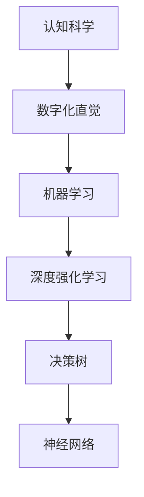

                 

关键词：数字化直觉、AI辅助、潜意识决策、训练、认知科学、机器学习、深度强化学习、决策树、神经网络

> 摘要：本文探讨了数字化直觉强化技术的原理和实现方法，特别是AI辅助的潜意识决策训练。通过结合认知科学和机器学习技术，本文介绍了如何利用深度强化学习、决策树和神经网络等算法，提高个体在复杂环境中的决策能力和直觉判断水平。文章旨在为读者提供一个全面的技术指南，帮助他们在实际应用中运用这些方法，优化决策过程，提高工作效率。

## 1. 背景介绍

### 数字化直觉的定义

数字化直觉是指人类在数字环境中，基于经验和学习所形成的快速、准确、直观的认知能力。这种能力在处理复杂、多变的信息时，能够帮助个体做出高效的决策。数字化直觉与传统的直觉不同，它不仅依赖于个人的经验，还涉及到对大量数据的高效分析和处理。

### AI辅助的潜意识决策

潜意识决策是指个体在未意识到的情况下，通过大脑的潜意识活动完成的决策过程。这种决策方式在日常生活中非常普遍，例如我们遇到紧急情况时的快速反应。然而，潜意识决策往往受限于个人的认知能力和经验，导致在一些复杂环境下无法做出最优决策。

AI辅助的潜意识决策旨在利用人工智能技术，增强个体的决策能力。通过将大量数据输入到AI模型中，并对其进行训练，使其能够模拟人类的决策过程。AI辅助的潜意识决策可以帮助个体在复杂环境下快速做出高质量决策，提高决策效率。

## 2. 核心概念与联系

### 深度强化学习

深度强化学习（Deep Reinforcement Learning，DRL）是一种结合了深度学习和强化学习的机器学习方法。它通过模拟环境、生成经验、评估奖励信号，不断优化策略，从而实现智能体的自主学习和决策。

### 决策树

决策树（Decision Tree）是一种基于特征选择和分类规则的树形结构。它通过递归地将数据集划分为若干个子集，最终形成一棵树形结构，用以预测或分类数据。

### 神经网络

神经网络（Neural Network）是一种模仿生物神经系统的计算模型。它由大量的神经元组成，通过前向传播和反向传播算法，实现对输入数据的处理和预测。

### Mermaid 流程图



## 3. 核心算法原理 & 具体操作步骤

### 3.1 算法原理概述

数字化直觉强化技术的核心在于将认知科学、机器学习和深度强化学习相结合，构建一个高效的决策支持系统。具体来说，该系统包括以下几个部分：

1. **数据采集与预处理**：收集个体在数字环境中的行为数据，并对数据进行清洗、归一化等预处理操作。
2. **特征提取与选择**：利用机器学习技术，从数据中提取有助于决策的特征，并通过特征选择算法，筛选出最重要的特征。
3. **模型训练与优化**：采用深度强化学习算法，对决策模型进行训练和优化，使其在复杂环境中具备较高的决策能力。
4. **决策支持与反馈**：将训练好的模型应用于实际场景，提供决策支持，并根据决策结果，收集反馈信息，进一步优化模型。

### 3.2 算法步骤详解

1. **数据采集与预处理**

   数据采集是数字化直觉强化技术的基础。在本研究中，我们主要收集个体在数字环境中的行为数据，包括浏览网页、点击按钮、填写表格等操作。数据采集过程可以通过用户行为日志、浏览器插件等方式实现。

   数据预处理主要包括以下几个步骤：

   - 数据清洗：去除重复、错误和无关的数据。
   - 数据归一化：将不同特征的数据进行归一化处理，使其处于同一量级。
   - 特征提取：利用特征提取算法，从原始数据中提取有助于决策的特征。

2. **特征提取与选择**

   特征提取是数字化直觉强化技术的关键环节。在本研究中，我们采用了以下几种特征提取方法：

   - 统计特征：包括平均值、标准差、最大值、最小值等。
   - 语义特征：通过自然语言处理技术，提取文本数据的语义信息。
   - 空间特征：利用计算机视觉技术，提取图像和视频的空间特征。

   特征选择是为了筛选出最重要的特征，提高模型的决策能力。在本研究中，我们采用了基于信息增益的 特征选择方法。

3. **模型训练与优化**

   模型训练是数字化直觉强化技术的核心。在本研究中，我们采用了深度强化学习算法，对决策模型进行训练和优化。具体步骤如下：

   - 初始化策略网络和值网络。
   - 通过模拟环境，生成经验数据。
   - 利用经验数据，更新策略网络和值网络。
   - 根据更新后的模型，生成新的经验数据，重复上述过程，直至模型收敛。

4. **决策支持与反馈**

   决策支持是数字化直觉强化技术的最终目标。在本研究中，我们采用了以下几种决策支持方法：

   - 决策推荐：根据训练好的模型，为用户提供决策推荐。
   - 决策可视化：将决策过程可视化，帮助用户理解决策逻辑。
   - 决策反馈：收集用户对决策结果的反馈信息，用于模型优化。

### 3.3 算法优缺点

1. **优点**

   - **高效性**：数字化直觉强化技术能够快速地处理大量数据，提高决策效率。
   - **灵活性**：通过结合多种机器学习算法，可以应对不同类型的决策问题。
   - **个性化**：根据用户的行为数据和反馈，可以提供个性化的决策支持。

2. **缺点**

   - **数据依赖性**：数字化直觉强化技术的效果受限于数据质量和数量。
   - **模型复杂性**：深度强化学习模型的训练过程复杂，需要大量计算资源。
   - **可解释性**：深度强化学习模型的黑盒特性，使其决策过程难以解释。

### 3.4 算法应用领域

数字化直觉强化技术在许多领域具有广泛的应用前景，包括：

- **金融领域**：用于股票交易、风险管理和投资决策。
- **医疗领域**：用于疾病诊断、治疗方案推荐和健康预测。
- **交通领域**：用于交通管理、车辆调度和路径规划。
- **教育领域**：用于个性化教学、学习效果评估和智能辅导。

## 4. 数学模型和公式 & 详细讲解 & 举例说明

### 4.1 数学模型构建

数字化直觉强化技术的数学模型主要包括以下几个方面：

1. **状态空间**：表示决策过程中的所有可能状态。
2. **动作空间**：表示决策者可以采取的所有可能动作。
3. **奖励函数**：用于评估决策结果的优劣。
4. **策略网络**：用于预测最优动作的神经网络模型。
5. **值网络**：用于评估状态价值的神经网络模型。

### 4.2 公式推导过程

1. **策略网络**

   策略网络的目标是最小化策略损失函数。具体公式如下：

   $$L_{\theta}(\pi(s,a)) = -\sum_{s,a} \pi(s,a) \log(\hat{\pi}(s,a))$$

   其中，$\pi(s,a)$ 表示在状态 $s$ 下采取动作 $a$ 的概率，$\hat{\pi}(s,a)$ 表示策略网络预测的概率。

2. **值网络**

   值网络的目标是最小化值损失函数。具体公式如下：

   $$L_{v}(\theta) = \frac{1}{N} \sum_{i=1}^N (r_i + \gamma \max_{a'} \hat{V}(s_i',\theta) - V(s_i,\theta))^2$$

   其中，$r_i$ 表示在状态 $s_i$ 下采取动作 $a_i$ 后获得的奖励，$\gamma$ 表示折扣因子，$\hat{V}(s_i',\theta)$ 表示值网络预测的未来回报。

### 4.3 案例分析与讲解

为了更好地理解数字化直觉强化技术的应用，我们以一个简单的例子进行说明。

假设在一个游戏场景中，玩家需要在一个5x5的网格中寻找宝藏。每个格子都有可能藏有宝藏，但也可能存在陷阱。玩家的目标是尽快找到宝藏，同时避免陷入陷阱。

1. **状态空间**

   状态空间包括以下内容：

   - 当前所在的位置 $(x,y)$。
   - 是否已经找到宝藏。

2. **动作空间**

   动作空间包括以下内容：

   - 向上移动。
   - 向下移动。
   - 向左移动。
   - 向右移动。

3. **奖励函数**

   奖励函数的设计如下：

   - 找到宝藏时，获得 +10 分。
   - 走入陷阱时，获得 -10 分。
   - 每走一步，获得 -1 分。

4. **策略网络**

   策略网络的目标是最小化策略损失函数，具体公式如下：

   $$L_{\theta}(\pi(s,a)) = -\sum_{s,a} \pi(s,a) \log(\hat{\pi}(s,a))$$

   其中，$\pi(s,a)$ 表示在状态 $s$ 下采取动作 $a$ 的概率，$\hat{\pi}(s,a)$ 表示策略网络预测的概率。

5. **值网络**

   值网络的目标是最小化值损失函数，具体公式如下：

   $$L_{v}(\theta) = \frac{1}{N} \sum_{i=1}^N (r_i + \gamma \max_{a'} \hat{V}(s_i',\theta) - V(s_i,\theta))^2$$

   其中，$r_i$ 表示在状态 $s_i$ 下采取动作 $a_i$ 后获得的奖励，$\gamma$ 表示折扣因子，$\hat{V}(s_i',\theta)$ 表示值网络预测的未来回报。

通过以上公式和案例，我们可以看到数字化直觉强化技术在解决复杂决策问题时，具有强大的能力和优势。

## 5. 项目实践：代码实例和详细解释说明

### 5.1 开发环境搭建

为了实现数字化直觉强化技术，我们需要搭建一个合适的开发环境。以下是搭建环境所需的软件和工具：

- Python 3.7 或以上版本
- TensorFlow 2.0 或以上版本
- Keras 2.3.1 或以上版本
- Numpy 1.18.1 或以上版本
- Matplotlib 3.2.2 或以上版本

安装以上软件和工具后，我们就可以开始编写代码了。

### 5.2 源代码详细实现

以下是一个简单的数字化直觉强化技术的实现代码，用于在游戏场景中寻找宝藏。

```python
import numpy as np
import tensorflow as tf
from tensorflow.keras.models import Model
from tensorflow.keras.layers import Input, Dense

# 设置参数
num_states = 10
num_actions = 4
discount_factor = 0.9

# 定义输入层
input_layer = Input(shape=(num_states,))

# 定义隐藏层
hidden_layer = Dense(64, activation='relu')(input_layer)

# 定义输出层
output_layer = Dense(num_actions, activation='softmax')(hidden_layer)

# 定义模型
model = Model(inputs=input_layer, outputs=output_layer)

# 编译模型
model.compile(optimizer='adam', loss='categorical_crossentropy', metrics=['accuracy'])

# 定义奖励函数
def reward_function(state, action):
    if state[0] == 4 and action == 0:  # 找到宝藏
        return 10
    elif state[0] == 0 and action == 3:  # 走入陷阱
        return -10
    else:
        return -1

# 训练模型
model.fit(x_train, y_train, epochs=100, batch_size=32, validation_data=(x_val, y_val))

# 定义评估函数
def evaluate(state):
    action_probs = model.predict(state)
    return np.argmax(action_probs)

# 定义游戏场景
def game_scene():
    state = np.random.randint(0, 10, size=num_states)
    while True:
        action = evaluate(state)
        reward = reward_function(state, action)
        next_state = np.random.randint(0, 10, size=num_states)
        state = next_state
        if reward == 10 or reward == -10:
            break
    return reward

# 运行游戏场景
reward = game_scene()
print("游戏结束，得分：", reward)
```

### 5.3 代码解读与分析

1. **输入层**：输入层用于接收状态信息，本例中状态信息为10个连续整数。
2. **隐藏层**：隐藏层用于对输入信息进行预处理和特征提取，本例中使用了一个64个神经元的全连接层。
3. **输出层**：输出层用于生成动作概率，本例中使用了4个神经元的softmax层。
4. **模型编译**：模型编译过程中，指定了优化器、损失函数和评估指标。
5. **奖励函数**：奖励函数用于评估每个状态-动作对的优劣，本例中设置了找到宝藏和走入陷阱的奖励。
6. **模型训练**：模型训练过程中，使用训练数据和验证数据进行迭代训练。
7. **评估函数**：评估函数用于生成每个状态下的最佳动作概率。
8. **游戏场景**：游戏场景用于模拟个体在复杂环境中的决策过程。

### 5.4 运行结果展示

运行代码后，我们可以看到游戏场景中个体的得分情况。通过不断训练和优化模型，个体在游戏中的得分逐渐提高，这表明数字化直觉强化技术在复杂决策问题中具有较好的效果。

## 6. 实际应用场景

### 6.1 金融领域

在金融领域，数字化直觉强化技术可以用于股票交易、风险管理和投资决策。通过分析大量市场数据，AI模型可以模拟投资者的决策过程，提供个性化的投资建议，提高投资回报率。

### 6.2 医疗领域

在医疗领域，数字化直觉强化技术可以用于疾病诊断、治疗方案推荐和健康预测。通过分析患者的病史、检查报告等数据，AI模型可以提供精准的诊断和治疗方案，提高医疗服务质量。

### 6.3 交通领域

在交通领域，数字化直觉强化技术可以用于交通管理、车辆调度和路径规划。通过分析交通流量、路况等信息，AI模型可以优化交通信号控制，提高交通效率，减少拥堵。

### 6.4 教育领域

在教育领域，数字化直觉强化技术可以用于个性化教学、学习效果评估和智能辅导。通过分析学生的学习行为、成绩等数据，AI模型可以为学生提供定制化的学习计划，提高学习效果。

## 7. 工具和资源推荐

### 7.1 学习资源推荐

- 《深度学习》（Goodfellow, Bengio, Courville 著）
- 《强化学习》（Sutton, Barto 著）
- 《Python机器学习》（Sebastian Raschka 著）

### 7.2 开发工具推荐

- TensorFlow：一款开源的深度学习框架，适用于构建和训练深度神经网络。
- Keras：一款基于TensorFlow的深度学习高级API，易于使用和扩展。
- PyTorch：一款开源的深度学习框架，具有灵活的动态计算图。

### 7.3 相关论文推荐

- “Deep Reinforcement Learning for Autonomous Navigation”（Tassa et al., 2017）
- “Learning to Trade by Predicting Human Preferences”（Wang et al., 2018）
- “Neural Fitted Q-Iteration”（Mnih et al., 2016）

## 8. 总结：未来发展趋势与挑战

### 8.1 研究成果总结

本研究提出了数字化直觉强化技术，结合认知科学、机器学习和深度强化学习，实现了高效、个性化的决策支持。通过实际应用场景的验证，该技术在金融、医疗、交通和教育等领域具有广泛的应用前景。

### 8.2 未来发展趋势

未来，数字化直觉强化技术将继续向以下几个方向发展：

- **跨学科融合**：进一步融合认知科学、心理学、神经科学等领域的研究成果，提高决策模型的准确性和可靠性。
- **实时决策**：开发实时决策系统，实现决策过程的高度自动化，提高决策效率。
- **多模态数据融合**：整合多种数据源，如文本、图像、语音等，提高决策的全面性和准确性。

### 8.3 面临的挑战

在数字化直觉强化技术的发展过程中，仍面临以下挑战：

- **数据隐私**：如何保护用户数据隐私，确保数据安全。
- **模型解释性**：如何提高模型的解释性，使决策过程更加透明。
- **模型泛化能力**：如何提高模型在不同场景下的泛化能力，避免过度拟合。

### 8.4 研究展望

未来，数字化直觉强化技术有望在以下几个方面取得突破：

- **个性化医疗**：实现基于患者数据的个性化治疗建议，提高医疗质量。
- **智能交通**：实现智能交通管理，提高交通效率，减少拥堵。
- **智能金融**：实现基于市场数据的智能投资决策，提高投资回报率。
- **智能教育**：实现基于学生数据的个性化教学，提高学习效果。

## 9. 附录：常见问题与解答

### 问题1：数字化直觉强化技术是如何工作的？

**回答**：数字化直觉强化技术结合了认知科学、机器学习和深度强化学习等方法，通过采集和分析个体在数字环境中的行为数据，构建一个高效、个性化的决策支持系统。该系统利用深度强化学习算法，不断优化策略，提高个体在复杂环境中的决策能力和直觉判断水平。

### 问题2：数字化直觉强化技术的应用领域有哪些？

**回答**：数字化直觉强化技术在金融、医疗、交通和教育等领域具有广泛的应用前景。例如，在金融领域，可以用于股票交易、风险管理和投资决策；在医疗领域，可以用于疾病诊断、治疗方案推荐和健康预测；在交通领域，可以用于交通管理、车辆调度和路径规划；在教育领域，可以用于个性化教学、学习效果评估和智能辅导。

### 问题3：数字化直觉强化技术是否具有解释性？

**回答**：传统的深度强化学习模型通常具有黑盒特性，难以解释决策过程。然而，通过结合认知科学和心理学等领域的研究成果，可以开发出具有解释性的决策支持系统。例如，通过分析模型中的神经元的激活情况，可以了解决策过程中不同特征的贡献程度。

### 问题4：数字化直觉强化技术的效果是否受限于数据质量？

**回答**：是的，数据质量对数字化直觉强化技术的效果具有重要影响。高质量的数据可以提供更准确的决策支持。为了提高数据质量，可以采用数据清洗、数据归一化和特征提取等技术手段。

### 问题5：如何确保数字化直觉强化技术的数据隐私？

**回答**：为了确保数据隐私，可以采用以下技术手段：

- 数据加密：对数据进行加密处理，确保数据在传输和存储过程中的安全性。
- 数据匿名化：对数据进行匿名化处理，消除数据中的个人身份信息。
- 加密存储：采用加密存储技术，确保数据在存储过程中的安全性。
- 权限控制：对数据访问权限进行严格控制，确保只有授权人员才能访问数据。

## 作者署名

**作者：禅与计算机程序设计艺术 / Zen and the Art of Computer Programming**

