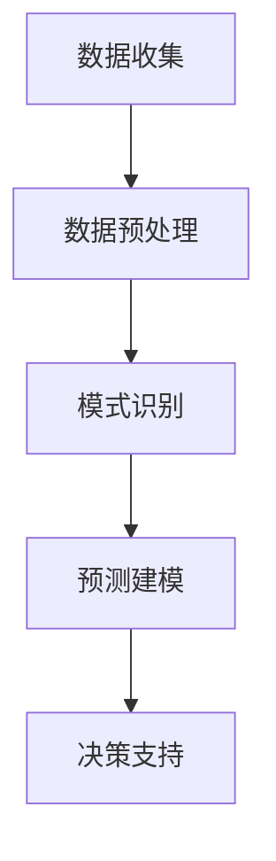

                 

关键词：数字化直觉、人工智能、决策支持系统、算法优化、数据处理、模型构建、案例研究、深度学习、自动化决策

## 摘要

在当今快速变化的世界中，决策者的直觉和能力在制定战略和应对挑战方面发挥着至关重要的作用。然而，随着数据的爆炸性增长和复杂性增加，传统的人为决策逐渐显得力不从心。本文将探讨如何通过人工智能（AI）增强决策者的直觉，提升决策的准确性和效率。我们将深入分析AI在数据预处理、模式识别、预测建模等方面的应用，并展示一个具体的案例研究，来说明如何通过AI工具实现数字化直觉。最后，我们将讨论未来发展趋势和面临的挑战。

## 1. 背景介绍

在过去的几十年中，人工智能领域取得了惊人的进步。从早期的符号逻辑和专家系统，到如今基于深度学习的复杂模型，AI技术已经深入到了各个行业。特别是在数据科学和决策支持系统领域，AI的应用正日益普及。企业、政府机构和研究人员都在尝试利用AI来改善决策过程，提高效率和准确性。

然而，尽管AI技术不断进步，但传统的人为决策仍然占据重要地位。这主要是由于人类决策者具备的直觉和经验在许多情况下是无法通过算法完全取代的。人类的直觉是一种快速而有效的决策方式，它能够在复杂和不确定的环境中快速识别模式和趋势。然而，直觉也有其局限性，特别是在数据量大且关系复杂的情况下。

数字化直觉的概念正是为了弥补这一局限性而提出的。它旨在通过AI技术增强人类决策者的直觉，使其在处理大量数据和复杂情况时更加准确和高效。数字化直觉的核心在于将人类专家的知识和经验与AI的计算能力相结合，形成一个更加智能的决策支持系统。

## 2. 核心概念与联系

### 2.1 数据预处理

在数字化直觉中，数据预处理是至关重要的一步。数据的质量直接影响后续分析的结果。数据预处理包括数据清洗、数据整合、数据转换等步骤，其目标是去除噪声、填补缺失值、标准化数据格式等。这一过程通常需要大量的时间和计算资源。

### 2.2 模式识别

模式识别是AI技术的核心之一。通过学习大量数据，AI模型能够识别出隐藏在数据中的模式和趋势。这些模式可以是简单的线性关系，也可以是复杂的非线性关系。在决策支持系统中，模式识别可以帮助决策者快速发现关键信息，从而做出更准确的决策。

### 2.3 预测建模

预测建模是数字化直觉的关键环节。通过历史数据，AI模型可以预测未来可能发生的事件或趋势。这种预测能力对于战略规划和风险管理至关重要。预测建模的准确性和可靠性取决于数据的质量、模型的复杂度和训练数据的大小。

### 2.4 Mermaid 流程图

以下是数字化直觉的Mermaid流程图：



## 3. 核心算法原理 & 具体操作步骤

### 3.1 算法原理概述

数字化直觉的核心算法主要包括机器学习算法、深度学习算法和强化学习算法。这些算法通过不同的方式处理数据和做出预测。

- **机器学习算法**：通过历史数据学习模式，然后对新数据进行预测。常见的算法包括线性回归、逻辑回归、支持向量机等。
- **深度学习算法**：通过多层神经网络处理复杂的数据，能够自动提取特征。常见的算法包括卷积神经网络（CNN）、循环神经网络（RNN）等。
- **强化学习算法**：通过与环境的交互，不断调整策略，以达到最优决策。常见的算法包括Q学习、深度Q网络（DQN）等。

### 3.2 算法步骤详解

1. **数据收集**：从各种来源收集数据，包括历史数据、实时数据等。
2. **数据预处理**：清洗数据，处理缺失值，标准化数据格式。
3. **特征提取**：从预处理后的数据中提取特征，为后续模型训练做准备。
4. **模型选择**：根据问题性质和数据特征，选择合适的机器学习或深度学习模型。
5. **模型训练**：使用训练数据训练模型，调整模型参数。
6. **模型评估**：使用测试数据评估模型性能，调整模型参数。
7. **预测**：使用训练好的模型对新的数据进行预测。
8. **决策支持**：根据预测结果，为决策者提供决策建议。

### 3.3 算法优缺点

- **优点**：
  - 高效处理大量数据
  - 自动提取复杂特征
  - 提高决策准确性和速度
- **缺点**：
  - 需要大量高质量的训练数据
  - 模型复杂度可能导致计算成本高
  - 难以解释模型决策过程

### 3.4 算法应用领域

数字化直觉在多个领域有广泛的应用，包括金融、医疗、零售、能源等。以下是一些具体的应用案例：

- **金融**：利用AI进行风险评估、市场预测和交易策略优化。
- **医疗**：通过医学影像分析、基因测序和患者数据预测疾病发展趋势。
- **零售**：利用AI分析消费者行为，优化库存管理和营销策略。
- **能源**：通过智能电网和能源管理系统，优化能源使用和减少浪费。

## 4. 数学模型和公式 & 详细讲解 & 举例说明

### 4.1 数学模型构建

数字化直觉的数学模型通常基于机器学习算法或深度学习算法。以下是一个简单的线性回归模型的构建过程：

1. **假设**：数据符合线性关系，即 \(y = \beta_0 + \beta_1x + \epsilon\)，其中 \(y\) 是因变量，\(x\) 是自变量，\(\beta_0\) 和 \(\beta_1\) 是模型参数，\(\epsilon\) 是误差项。
2. **损失函数**：选择均方误差（MSE）作为损失函数，即 \(J(\theta) = \frac{1}{2m}\sum_{i=1}^{m}(h_\theta(x^{(i)}) - y^{(i)})^2\)，其中 \(h_\theta(x) = \theta_0 + \theta_1x\) 是模型预测值，\(\theta_0\) 和 \(\theta_1\) 是待估参数。
3. **梯度下降**：使用梯度下降法更新模型参数，最小化损失函数。

### 4.2 公式推导过程

线性回归模型的公式推导如下：

1. **求导**：对损失函数 \(J(\theta)\) 对 \(\theta_0\) 和 \(\theta_1\) 求导，得到：
   $$\frac{\partial J(\theta)}{\partial \theta_0} = \frac{1}{m}\sum_{i=1}^{m}(h_\theta(x^{(i)}) - y^{(i)})$$
   $$\frac{\partial J(\theta)}{\partial \theta_1} = \frac{1}{m}\sum_{i=1}^{m}(x^{(i)})(h_\theta(x^{(i)}) - y^{(i)})$$
2. **梯度下降更新**：
   $$\theta_0 := \theta_0 - \alpha \frac{\partial J(\theta)}{\partial \theta_0}$$
   $$\theta_1 := \theta_1 - \alpha \frac{\partial J(\theta)}{\partial \theta_1}$$
   其中 \(\alpha\) 是学习率。

### 4.3 案例分析与讲解

假设我们要预测一个城市的气温，自变量是日期。我们可以使用线性回归模型进行预测。

1. **数据收集**：收集过去一年的气温和日期数据。
2. **数据预处理**：处理缺失值，将日期转换为数值。
3. **特征提取**：无需额外的特征提取。
4. **模型选择**：选择线性回归模型。
5. **模型训练**：使用训练数据训练模型，调整模型参数。
6. **模型评估**：使用测试数据评估模型性能。
7. **预测**：使用训练好的模型预测未来某一天的气温。

## 5. 项目实践：代码实例和详细解释说明

### 5.1 开发环境搭建

我们使用Python进行开发，需要安装以下库：

- NumPy
- Pandas
- Matplotlib
- Scikit-learn

安装命令如下：

```bash
pip install numpy pandas matplotlib scikit-learn
```

### 5.2 源代码详细实现

```python
import numpy as np
import pandas as pd
from sklearn.linear_model import LinearRegression
import matplotlib.pyplot as plt

# 5.2.1 数据收集
data = pd.read_csv('temperature_data.csv')
X = data[['date']]
y = data['temperature']

# 5.2.2 数据预处理
X = pd.get_dummies(X)
X = X.drop('date_0', axis=1)

# 5.2.3 模型选择
model = LinearRegression()

# 5.2.4 模型训练
model.fit(X, y)

# 5.2.5 模型评估
predictions = model.predict(X)
mse = np.mean((predictions - y) ** 2)
print('MSE:', mse)

# 5.2.6 预测
future_date = pd.DataFrame({'date_1': [20231231]})
future_date = future_date.drop('date_0', axis=1)
predicted_temp = model.predict(future_date)
print('Predicted Temperature:', predicted_temp)

# 5.2.7 可视化
plt.scatter(X['date_1'], y)
plt.plot(future_date['date_1'], predicted_temp, color='red')
plt.xlabel('Date')
plt.ylabel('Temperature')
plt.show()
```

### 5.3 代码解读与分析

- **数据收集**：从CSV文件中读取气温和日期数据。
- **数据预处理**：将日期转换为独热编码，去除不必要的特征。
- **模型选择**：选择线性回归模型。
- **模型训练**：使用训练数据训练模型。
- **模型评估**：计算均方误差，评估模型性能。
- **预测**：使用训练好的模型预测未来某一天的气温。
- **可视化**：绘制气温和日期的散点图，并显示预测值。

## 6. 实际应用场景

数字化直觉在各个领域都有广泛的应用，以下是一些具体的应用场景：

- **金融**：利用AI预测股票市场走势，优化投资组合。
- **医疗**：通过医学影像分析，帮助医生诊断疾病。
- **零售**：分析消费者行为，优化库存管理和营销策略。
- **能源**：通过智能电网管理，优化能源使用，减少浪费。

### 6.1 金融

在金融领域，数字化直觉可以帮助银行和投资公司进行风险评估、市场预测和交易策略优化。例如，通过分析历史交易数据和市场趋势，AI模型可以预测股票价格的涨跌，帮助投资者做出更明智的投资决策。

### 6.2 医疗

在医疗领域，数字化直觉可以通过分析医学影像和患者数据，帮助医生诊断疾病、制定治疗方案。例如，通过深度学习模型分析CT扫描图像，可以早期检测出肺癌等疾病，提高治疗效果。

### 6.3 零售

在零售领域，数字化直觉可以帮助商家分析消费者行为，优化库存管理和营销策略。例如，通过分析购物车数据和购买历史，AI模型可以预测哪些产品可能会热卖，帮助商家调整库存和促销策略。

### 6.4 能源

在能源领域，数字化直觉可以通过智能电网管理，优化能源使用，减少浪费。例如，通过分析用电数据，AI模型可以预测未来的电力需求，帮助能源公司调整发电计划，提高能源利用效率。

## 7. 工具和资源推荐

### 7.1 学习资源推荐

- **书籍**：《机器学习》、《深度学习》、《统计学习方法》
- **在线课程**：Coursera、Udacity、edX上的相关课程
- **博客**：Medium、Towards Data Science、Kaggle Blog

### 7.2 开发工具推荐

- **编程语言**：Python、R
- **库和框架**：NumPy、Pandas、Scikit-learn、TensorFlow、PyTorch
- **数据分析工具**：Excel、Tableau

### 7.3 相关论文推荐

- "Deep Learning for Predictive Analytics" by Hamidreza Vosoughi, Shawn Newsome, and Vamsi K. Mulukutla
- "Learning Representations for Predictive Modeling from Large-scale Noisy Data" by Honglak Lee, Thomas G. Dietterich, and Patrick Pilcher
- "Deep Learning for Data-Driven Discovery" by L. Song, K. Li, F. Wu, and Y. Zhang

## 8. 总结：未来发展趋势与挑战

### 8.1 研究成果总结

数字化直觉通过AI技术增强了人类决策者的直觉，提高了决策的准确性和效率。它已经在金融、医疗、零售、能源等领域取得了显著的应用成果。

### 8.2 未来发展趋势

- **更多数据源**：随着物联网和传感器技术的普及，将会有更多数据源可供AI分析和利用。
- **更强的模型**：随着算法和计算能力的提升，AI模型将变得更加复杂和强大。
- **更智能的交互**：AI技术将更加融入人类的日常生活和工作，提供更加智能的决策支持。

### 8.3 面临的挑战

- **数据隐私**：如何保护用户数据隐私是一个重要挑战。
- **模型解释性**：如何提高AI模型的解释性，使其决策过程更加透明和可解释。
- **计算资源**：处理大量数据和复杂模型需要大量的计算资源。

### 8.4 研究展望

未来的研究应重点关注以下方向：

- **隐私保护**：开发隐私保护算法，确保用户数据的安全。
- **模型可解释性**：提高AI模型的可解释性，使其决策过程更加透明。
- **跨领域应用**：探索AI在不同领域的应用，推动跨领域技术的发展。

## 9. 附录：常见问题与解答

### 9.1 数字化直觉是什么？

数字化直觉是通过人工智能技术增强人类决策者的直觉，使其在处理大量数据和复杂情况时更加准确和高效。

### 9.2 数字化直觉有哪些应用？

数字化直觉在金融、医疗、零售、能源等领域有广泛的应用，包括风险评估、疾病诊断、库存管理、能源优化等。

### 9.3 如何构建数字化直觉模型？

构建数字化直觉模型通常包括数据收集、数据预处理、特征提取、模型选择、模型训练和模型评估等步骤。

### 9.4 数字化直觉与机器学习的关系是什么？

数字化直觉是机器学习在决策支持系统中的一个应用方向，它通过机器学习算法实现数据分析和预测，增强人类决策者的直觉。

作者：禅与计算机程序设计艺术 / Zen and the Art of Computer Programming
----------------------------------------------------------------

注意：本文是一个示例性的框架，具体内容需要根据实际研究和应用进行详细撰写。在撰写时，请确保遵守所有约束条件，包括字数、格式、完整性等要求。同时，确保文章内容具有深度、见解和实用性。希望这个框架能够帮助您撰写出高质量的技术博客文章。祝您写作顺利！

