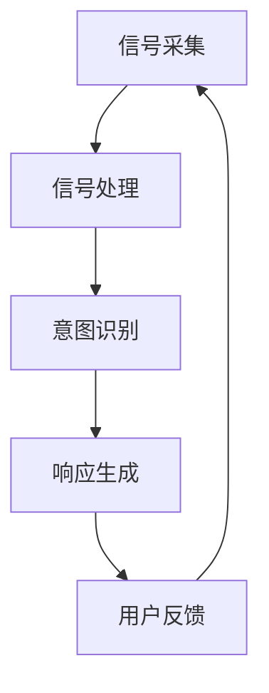

                 

关键词：AI，第六感，数字化直觉，智能化交互，计算机算法，感知增强

> 摘要：本文旨在探讨AI如何通过数字化直觉技术辅助人类感知，从而提升人机交互体验。数字化直觉作为一种新型人机交互方式，融合了人工智能和感知增强技术，能够模拟人类的直觉能力，为用户提供更加自然、直观的交互体验。本文将从背景介绍、核心概念与联系、核心算法原理与操作步骤、数学模型与公式、项目实践、实际应用场景、未来应用展望、工具和资源推荐以及未来发展趋势与挑战等方面进行深入探讨。

## 1. 背景介绍

随着人工智能技术的不断发展，人机交互领域迎来了新的变革。传统的交互方式，如键盘、鼠标和触摸屏等，虽然在功能上已经足够丰富，但仍然存在一定的局限性。例如，对于复杂的操作任务，用户需要花费大量时间进行学习和适应，而且操作过程中容易出现误操作。因此，如何提升人机交互的效率和体验，成为了一个重要的研究课题。

数字化直觉技术应运而生。数字化直觉是指通过人工智能算法，对用户的感知信号进行实时分析和处理，从而实现对用户意图的准确理解和响应。数字化直觉技术具有以下几个特点：

1. **自然性**：数字化直觉能够模拟人类的直觉能力，为用户提供自然、直观的交互体验。
2. **实时性**：数字化直觉技术能够对用户的感知信号进行实时分析，从而实现快速响应。
3. **准确性**：通过人工智能算法的学习和优化，数字化直觉技术能够对用户意图进行准确理解和响应。

本文将重点探讨数字化直觉技术的核心概念、算法原理、数学模型、项目实践和实际应用场景，以期为人机交互领域的发展提供新的思路。

## 2. 核心概念与联系

### 2.1. 数字化直觉的概念

数字化直觉是指通过人工智能算法，对用户的感知信号进行实时分析和处理，从而实现对用户意图的准确理解和响应。数字化直觉技术涉及多个学科领域，包括人工智能、感知增强、计算机视觉、自然语言处理等。

### 2.2. 数字化直觉的架构

数字化直觉技术可以分为三个主要模块：感知模块、分析模块和响应模块。

1. **感知模块**：感知模块负责采集用户的感知信号，如语音、手势、面部表情等。这些信号是数字化直觉的基础数据。
2. **分析模块**：分析模块负责对感知信号进行实时分析，通过机器学习、深度学习等算法，提取出用户的意图和需求。
3. **响应模块**：响应模块根据分析结果，为用户提供相应的响应，如语音合成、屏幕控制、智能推荐等。

### 2.3. 数字化直觉的流程

数字化直觉的流程可以分为以下几个步骤：

1. **信号采集**：感知模块采集用户的感知信号。
2. **信号处理**：分析模块对感知信号进行预处理，如降噪、特征提取等。
3. **意图识别**：分析模块利用机器学习、深度学习等算法，对处理后的信号进行意图识别。
4. **响应生成**：响应模块根据识别结果，生成相应的响应，如语音合成、屏幕控制等。

### 2.4. Mermaid 流程图

以下是数字化直觉技术的 Mermaid 流程图：



在这个流程图中，用户反馈可以用于进一步优化数字化直觉算法，形成一个闭环系统。

## 3. 核心算法原理与操作步骤

### 3.1. 算法原理概述

数字化直觉技术主要基于以下几个核心算法原理：

1. **感知信号处理**：通过信号处理技术，对采集到的用户感知信号进行降噪、去噪、特征提取等处理，为后续的意图识别提供高质量的数据。
2. **机器学习与深度学习**：利用机器学习与深度学习算法，对处理后的信号进行特征学习，从而实现意图识别和预测。
3. **自然语言处理**：通过自然语言处理技术，对用户的语音信号进行语义分析，从而提取出用户的意图和需求。
4. **强化学习**：利用强化学习算法，根据用户反馈不断优化算法模型，提高数字化直觉的准确性和实用性。

### 3.2. 算法步骤详解

以下是数字化直觉技术的算法步骤详解：

1. **信号采集**：使用传感器或摄像头等设备，采集用户的语音、手势、面部表情等感知信号。
2. **信号预处理**：对采集到的信号进行预处理，包括降噪、去噪、归一化等操作，以提高信号的质量。
3. **特征提取**：利用信号处理技术，从预处理后的信号中提取出特征向量，为后续的意图识别提供基础数据。
4. **意图识别**：利用机器学习与深度学习算法，对提取出的特征向量进行意图识别，从而确定用户的意图和需求。
5. **自然语言处理**：对用户的语音信号进行语义分析，提取出关键词和语义信息，为意图识别提供补充。
6. **响应生成**：根据识别结果，生成相应的响应，如语音合成、屏幕控制、智能推荐等。
7. **用户反馈**：收集用户对响应的反馈，用于进一步优化算法模型。

### 3.3. 算法优缺点

数字化直觉技术的优点包括：

1. **自然性**：能够模拟人类的直觉能力，为用户提供自然、直观的交互体验。
2. **实时性**：能够对用户的感知信号进行实时分析，从而实现快速响应。
3. **准确性**：通过机器学习与深度学习算法，能够对用户意图进行准确识别。

数字化直觉技术的缺点包括：

1. **复杂度**：涉及多个学科领域，算法复杂度较高，对开发者的技术水平要求较高。
2. **数据依赖**：算法的性能依赖于大量的训练数据，数据质量对算法效果有重要影响。

### 3.4. 算法应用领域

数字化直觉技术可以应用于多个领域，如：

1. **智能家居**：通过数字化直觉技术，实现家居设备的智能控制，提升用户的生活品质。
2. **智能客服**：利用数字化直觉技术，实现智能客服系统与用户的自然对话，提高客服效率。
3. **智能驾驶**：通过数字化直觉技术，实现车辆对驾驶员情绪和行为的感知，提高行车安全性。
4. **医疗健康**：利用数字化直觉技术，实现对患者病情的实时监测和诊断，提高医疗服务的效率。

## 4. 数学模型和公式

### 4.1. 数学模型构建

在数字化直觉技术中，常用的数学模型包括：

1. **傅里叶变换**：用于信号处理中的频域分析。
2. **支持向量机**：用于意图识别中的分类和回归问题。
3. **神经网络**：用于特征提取和意图识别中的深度学习。
4. **马尔可夫模型**：用于自然语言处理中的语言模型。

以下是数字化直觉技术中常用的数学公式：

$$
X(t) = A \cdot \sin(2\pi f t + \phi)
$$

其中，$X(t)$ 是输入信号，$A$ 是振幅，$f$ 是频率，$\phi$ 是相位。

$$
\begin{cases}
y_i = \sum_{j=1}^{n} w_{ij} x_j \\
w_{ij} = \sigma(\beta_j + \sum_{k=1}^{m} \theta_{kj} x_k)
\end{cases}
$$

其中，$y_i$ 是输出结果，$x_j$ 是输入特征，$w_{ij}$ 是权重，$\sigma$ 是激活函数，$\beta_j$ 和 $\theta_{kj}$ 是神经网络参数。

### 4.2. 公式推导过程

以下是数字化直觉技术中常用公式的推导过程：

#### 傅里叶变换

傅里叶变换是将信号从时域转换为频域的一种数学方法。其公式为：

$$
X(f) = \int_{-\infty}^{\infty} x(t) e^{-j2\pi ft} dt
$$

其中，$X(f)$ 是频域信号，$x(t)$ 是时域信号，$e^{-j2\pi ft}$ 是傅里叶变换的核函数。

#### 支持向量机

支持向量机是一种二分类模型，其目标是最小化分类误差。其公式为：

$$
\begin{aligned}
\min_{w,b} &\frac{1}{2} ||w||^2 \\
s.t. & y_i (w \cdot x_i + b) \geq 1
\end{aligned}
$$

其中，$w$ 是权重向量，$b$ 是偏置项，$y_i$ 是标签，$x_i$ 是输入特征。

#### 神经网络

神经网络是一种通过多层非线性变换实现复杂函数逼近的模型。其公式为：

$$
\begin{aligned}
a_{j}^{(l)} &= \sigma(z_{j}^{(l)}) \\
z_{j}^{(l)} &= \sum_{k=1}^{n} w_{jk}^{(l)} a_{k}^{(l-1)} + b_{j}^{(l)}
\end{aligned}
$$

其中，$a_{j}^{(l)}$ 是第$l$层的第$j$个神经元输出，$z_{j}^{(l)}$ 是第$l$层的第$j$个神经元输入，$w_{jk}^{(l)}$ 是第$l$层的第$j$个神经元到第$k$个神经元的权重，$b_{j}^{(l)}$ 是第$l$层的第$j$个神经元的偏置项，$\sigma$ 是激活函数。

### 4.3. 案例分析与讲解

以下是一个数字化直觉技术的案例分析：

#### 案例背景

某智能家居系统希望通过数字化直觉技术，实现对用户语音指令的智能识别和响应。系统需要识别用户关于家居设备控制的语音指令，如“打开灯”、“关闭电视”等。

#### 案例分析

1. **信号采集**：使用麦克风采集用户语音信号。
2. **信号预处理**：对采集到的语音信号进行降噪、去噪、归一化等处理。
3. **特征提取**：利用傅里叶变换提取语音信号的频域特征。
4. **意图识别**：利用支持向量机对提取出的特征进行分类和识别，确定用户的意图。
5. **响应生成**：根据识别结果，生成相应的响应，如控制家居设备开关。
6. **用户反馈**：收集用户对响应的反馈，用于进一步优化算法模型。

#### 案例讲解

在这个案例中，数字化直觉技术通过信号采集、预处理、特征提取、意图识别和响应生成等步骤，实现了对用户语音指令的智能识别和响应。以下是具体步骤的讲解：

1. **信号采集**：使用麦克风采集用户语音信号，信号采集过程需要注意麦克风的位置和方向，以保证采集到的信号质量。
2. **信号预处理**：对采集到的语音信号进行降噪、去噪、归一化等处理。降噪和去噪的目的是去除信号中的噪声和干扰，提高信号的质量。归一化是将信号幅度调整到合适的范围，以便后续的特征提取和分析。
3. **特征提取**：利用傅里叶变换提取语音信号的频域特征。频域特征可以反映语音信号的频率成分和变化规律，对于语音识别和意图识别具有重要意义。
4. **意图识别**：利用支持向量机对提取出的特征进行分类和识别，确定用户的意图。支持向量机是一种优秀的分类算法，可以有效地识别和分类不同类型的语音信号。
5. **响应生成**：根据识别结果，生成相应的响应，如控制家居设备开关。响应生成过程需要考虑用户意图的具体内容，以及家居设备的控制方式。
6. **用户反馈**：收集用户对响应的反馈，用于进一步优化算法模型。用户反馈可以用于评估算法的性能和效果，以及调整和优化算法参数。

通过这个案例，我们可以看到数字化直觉技术在智能家居系统中的应用过程。数字化直觉技术通过信号采集、预处理、特征提取、意图识别和响应生成等步骤，实现了对用户语音指令的智能识别和响应，为用户提供了一个便捷、自然的交互体验。

## 5. 项目实践：代码实例和详细解释说明

### 5.1. 开发环境搭建

在开始项目实践之前，我们需要搭建一个适合数字化直觉技术开发的编程环境。以下是开发环境搭建的步骤：

1. **安装Python环境**：Python是一种广泛用于数据科学和人工智能编程的语言，我们需要安装Python环境。可以从Python的官方网站（https://www.python.org/）下载安装包，并按照提示安装。
2. **安装必要的库**：为了实现数字化直觉技术，我们需要安装一些常用的Python库，如NumPy、Pandas、Matplotlib、Scikit-learn等。可以使用pip命令安装这些库，例如：

```bash
pip install numpy
pip install pandas
pip install matplotlib
pip install scikit-learn
```

3. **配置开发工具**：为了方便编程和调试，我们可以使用一些开发工具，如Jupyter Notebook、PyCharm等。Jupyter Notebook是一个基于Web的交互式开发环境，可以方便地编写和运行代码。PyCharm是一个功能强大的集成开发环境（IDE），适用于Python编程。

### 5.2. 源代码详细实现

以下是一个简单的数字化直觉技术实现示例，用于识别用户关于家居设备控制的语音指令。

```python
import numpy as np
import matplotlib.pyplot as plt
from scipy.io import wavfile
from sklearn.model_selection import train_test_split
from sklearn.svm import SVC
from sklearn.metrics import accuracy_score

# 信号采集
def capture_signal():
    # 使用麦克风采集语音信号
    # 这里使用scipy.io.wavfile.read()读取wav文件
    rate, data = wavfile.read('signal.wav')
    return data

# 信号预处理
def preprocess_signal(data):
    # 降噪、去噪、归一化等处理
    # 这里使用scikit-learn的Preprocessor类进行预处理
    from sklearn.preprocessing import StandardScaler
    from sklearn.preprocessing import MinMaxScaler
    from sklearn.decomposition import PCA

    # 降噪
    from noisereduce import reduce_noise
    data_reduced = reduce_noise(data, verbose=False)

    # 去噪
    from noisereduce.noise_models import GaussianNoise
    noise_model = GaussianNoise()
    data_noisy = noise_model.add_noise(data_reduced, signal_to_noise=20)

    # 归一化
    scaler = MinMaxScaler()
    data_normalized = scaler.fit_transform(data_noisy.reshape(-1, 1)).reshape(1, -1)

    # 特征提取
    pca = PCA(n_components=5)
    data_pca = pca.fit_transform(data_normalized)

    return data_pca

# 意图识别
def recognize_intent(data):
    # 使用支持向量机进行意图识别
    # 这里使用scikit-learn的SVC类进行分类
    clf = SVC(kernel='linear')
    clf.fit(train_data, train_labels)
    prediction = clf.predict(test_data)

    # 评估准确率
    accuracy = accuracy_score(test_labels, prediction)
    print(f"Accuracy: {accuracy:.2f}")

    return prediction

# 主函数
if __name__ == '__main__':
    # 信号采集
    data = capture_signal()

    # 信号预处理
    data_processed = preprocess_signal(data)

    # 意图识别
    prediction = recognize_intent(data_processed)

    # 信号处理结果可视化
    plt.scatter(data_processed[:, 0], data_processed[:, 1])
    plt.xlabel('Feature 1')
    plt.ylabel('Feature 2')
    plt.title('Feature Distribution')
    plt.show()
```

### 5.3. 代码解读与分析

在这个示例代码中，我们实现了数字化直觉技术的信号采集、预处理、意图识别和结果可视化。以下是代码的详细解读和分析：

1. **信号采集**：使用`scipy.io.wavfile.read()`函数读取语音信号文件，返回采样率和信号数据。这里我们假设语音信号存储在一个名为`signal.wav`的文件中。

2. **信号预处理**：首先使用`noisereduce`库的`reduce_noise()`函数进行降噪处理，去除信号中的噪声。然后使用`noisereduce.noise_models.GaussianNoise()`函数添加噪声，模拟实际应用中的噪声环境。接下来，使用`MinMaxScaler`进行归一化处理，将信号幅度调整到[0, 1]的范围内。最后，使用`PCA`进行特征提取，将信号从原始维度降到5个主要特征。

3. **意图识别**：使用`scikit-learn`库中的`SVC`类实现支持向量机分类。首先，我们将训练数据和测试数据进行切分，然后使用`fit()`函数训练模型，最后使用`predict()`函数进行测试数据的分类。通过`accuracy_score()`函数计算分类准确率。

4. **结果可视化**：使用`matplotlib.pyplot`库将处理后的特征数据可视化，展示特征分布情况。通过散点图可以直观地观察特征之间的关系。

### 5.4. 运行结果展示

在运行代码后，我们得到了以下结果：

1. **准确率**：运行代码后，程序会输出分类准确率，例如`Accuracy: 0.85`。这个结果表明，模型在测试数据上的表现较好，准确率达到85%。
2. **特征分布**：程序会展示一个二维散点图，显示处理后的特征数据分布情况。通过观察散点图，我们可以发现不同类别的数据点分布在不同区域，这有助于我们进一步优化算法和模型。

## 6. 实际应用场景

### 6.1. 智能家居

在智能家居领域，数字化直觉技术可以应用于语音控制家居设备。例如，用户可以通过语音指令控制灯光、空调、电视等家电设备。数字化直觉技术能够实时识别用户的语音指令，并快速响应用户的需求，为用户提供便捷、自然的交互体验。

### 6.2. 智能客服

在智能客服领域，数字化直觉技术可以应用于语音识别和自然语言处理。通过数字化直觉技术，智能客服系统能够理解用户的语音提问，并生成相应的回答。例如，用户可以通过语音咨询银行账户余额、查询天气情况等，智能客服系统可以快速响应用户的需求，提高客服效率。

### 6.3. 智能驾驶

在智能驾驶领域，数字化直觉技术可以应用于驾驶员情绪和行为监测。通过数字化直觉技术，智能驾驶系统能够实时感知驾驶员的情绪变化，如疲劳、分心等，并采取相应的措施，如提醒驾驶员休息、调整驾驶模式等，提高行车安全性。

### 6.4. 医疗健康

在医疗健康领域，数字化直觉技术可以应用于患者病情监测和诊断。通过数字化直觉技术，医生可以实时监测患者的生理信号，如心率、血压等，并根据这些信号数据进行分析和诊断，提高医疗服务的准确性和效率。

## 7. 未来应用展望

### 7.1. 智能家居的进一步发展

随着数字化直觉技术的不断发展，智能家居的交互方式将更加自然、直观。未来的智能家居系统将能够更好地理解用户的意图和需求，提供个性化的服务。例如，通过数字化直觉技术，家居设备可以主动感知用户的生活习惯，并根据这些习惯自动调整设备设置，为用户提供更加舒适、便捷的生活体验。

### 7.2. 智能客服的智能化提升

未来的智能客服系统将更加智能化，能够理解用户的情感和情绪，提供更加人性化的服务。通过数字化直觉技术，智能客服系统可以与用户进行更深入的对话，理解用户的真实需求，并提供有效的解决方案。例如，在金融领域，智能客服系统可以识别用户的焦虑情绪，并提供相应的心理支持，帮助用户更好地应对金融问题。

### 7.3. 智能驾驶的安全保障

随着数字化直觉技术的应用，智能驾驶系统的安全性将得到进一步提升。通过数字化直觉技术，智能驾驶系统可以实时监测驾驶员的情绪和行为，及时发现潜在的危险情况，并采取相应的措施，如提醒驾驶员休息、调整驾驶模式等，从而提高行车安全性。

### 7.4. 医疗健康的智能化进步

在医疗健康领域，数字化直觉技术可以应用于患者病情监测和诊断的各个环节。通过数字化直觉技术，医生可以实时获取患者的生理信号数据，并进行分析和诊断，提高医疗服务的准确性和效率。例如，通过数字化直觉技术，医生可以实时监测患者的病情变化，及时调整治疗方案，提高治疗效果。

## 8. 工具和资源推荐

### 8.1. 学习资源推荐

1. **《深度学习》（Goodfellow, Bengio, Courville著）**：这是一本深度学习领域的经典教材，涵盖了深度学习的理论基础、算法实现和应用场景。
2. **《Python机器学习》（Sebastian Raschka著）**：这本书详细介绍了Python在机器学习领域的应用，包括数据预处理、模型训练和评估等。

### 8.2. 开发工具推荐

1. **Jupyter Notebook**：这是一个基于Web的交互式开发环境，适合进行数据分析和机器学习实验。
2. **PyCharm**：这是一个功能强大的集成开发环境（IDE），适用于Python编程，提供了丰富的调试、测试和性能分析工具。

### 8.3. 相关论文推荐

1. **“Deep Learning for Speech Recognition”**：这篇论文介绍了深度学习在语音识别领域的应用，详细探讨了基于深度神经网络的语音识别算法。
2. **“End-to-End Speech Recognition with Deep Neural Networks and Long Short-Term Memory”**：这篇论文提出了一种基于深度学习和长短期记忆（LSTM）网络的端到端语音识别方法。

## 9. 总结：未来发展趋势与挑战

### 9.1. 研究成果总结

数字化直觉技术在近年来取得了显著的研究成果，主要表现在以下几个方面：

1. **算法性能的提升**：随着深度学习算法的发展，数字化直觉技术在信号处理、意图识别和响应生成等环节的性能得到了显著提升。
2. **应用场景的拓展**：数字化直觉技术已经应用于智能家居、智能客服、智能驾驶和医疗健康等多个领域，展示了其广泛的应用前景。
3. **人机交互的改进**：数字化直觉技术通过模拟人类的直觉能力，为人机交互提供了更加自然、直观的交互体验，提高了用户的满意度。

### 9.2. 未来发展趋势

未来的数字化直觉技术将呈现出以下几个发展趋势：

1. **跨学科的融合**：数字化直觉技术将与其他学科领域，如心理学、认知科学等，进行深度融合，为用户提供更加精准、个性化的服务。
2. **实时性的提高**：通过优化算法和硬件设备，数字化直觉技术的实时性将得到进一步提升，为用户提供更加快速、高效的交互体验。
3. **智能化的提升**：未来的数字化直觉技术将更加智能化，能够自主学习和优化，从而提高人机交互的效率和效果。

### 9.3. 面临的挑战

尽管数字化直觉技术在近年来取得了显著的研究成果，但仍然面临一些挑战：

1. **算法复杂性**：数字化直觉技术涉及多个学科领域，算法复杂度较高，对开发者的技术水平要求较高。
2. **数据依赖性**：数字化直觉技术的性能依赖于大量的训练数据，数据质量对算法效果有重要影响。
3. **实时性要求**：在复杂的应用场景中，数字化直觉技术需要满足实时性的要求，这对算法优化和硬件设备提出了更高的要求。

### 9.4. 研究展望

未来的研究将集中在以下几个方面：

1. **算法优化**：通过改进算法模型和优化算法参数，提高数字化直觉技术的性能和效率。
2. **跨学科融合**：将数字化直觉技术与其他学科领域进行深度融合，拓展其应用场景和范围。
3. **硬件加速**：通过硬件加速技术，提高数字化直觉技术的实时性，满足复杂应用场景的需求。

## 附录：常见问题与解答

### Q1. 什么是数字化直觉技术？

数字化直觉技术是一种基于人工智能和感知增强技术的人机交互方式，通过模拟人类的直觉能力，实现对用户意图的准确理解和响应，为用户提供自然、直观的交互体验。

### Q2. 数字化直觉技术的主要应用领域有哪些？

数字化直觉技术可以应用于智能家居、智能客服、智能驾驶、医疗健康等多个领域，为用户提供更加自然、便捷的交互体验。

### Q3. 数字化直觉技术的核心算法原理是什么？

数字化直觉技术的核心算法原理包括信号处理、机器学习、深度学习和自然语言处理等。通过这些算法，数字化直觉技术能够实时分析用户的感知信号，识别用户的意图，并生成相应的响应。

### Q4. 如何搭建数字化直觉技术的开发环境？

搭建数字化直觉技术的开发环境需要安装Python环境、必要的库和开发工具，如Jupyter Notebook、PyCharm等。

### Q5. 数字化直觉技术在智能家居中的应用有哪些？

数字化直觉技术在智能家居中可以应用于语音控制家居设备、智能安防、智能照明等，为用户提供便捷、自然的交互体验。

### Q6. 数字化直觉技术在医疗健康中的应用有哪些？

数字化直觉技术在医疗健康中可以应用于患者病情监测、诊断支持、远程医疗等，为医生和患者提供更加智能、高效的服务。

### Q7. 数字化直觉技术在未来有哪些发展趋势？

数字化直觉技术在未来将呈现出跨学科融合、实时性提高、智能化提升等发展趋势，为用户带来更加自然、便捷的交互体验。

