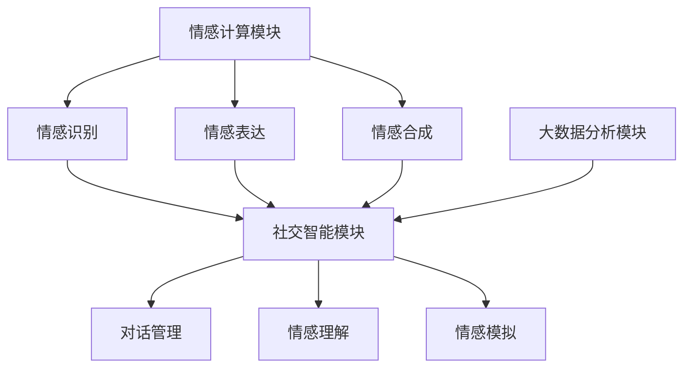

                 

关键词：AI、社交智能、数字化移情能力、情感计算、人工智能交互

> 摘要：本文探讨了AI在社交领域中的新角色——数字化移情能力。随着情感计算的进步，AI不仅能够理解人类的情感，还能够模拟和传递情感，从而增强社交互动的质量。本文详细介绍了AI增强的社交智能的概念、核心算法原理、应用领域，并通过实际项目实例进行了深入分析，展望了这一领域未来的发展趋势与挑战。

## 1. 背景介绍

随着人工智能技术的快速发展，AI在各个领域的应用日益广泛。特别是在社交领域，人们越来越期待AI能够更好地理解和模拟人类情感，从而提供更人性化的互动体验。数字化移情能力，作为AI在社交领域的重要拓展，逐渐成为研究的焦点。

数字化移情能力指的是AI系统通过情感计算等技术，模拟和传递人类情感的能力。这种能力不仅能够提升AI与人类之间的互动质量，还能够为各种社交应用提供新的解决方案，如情感支持、社交辅助等。

本文将深入探讨数字化移情能力的相关概念、核心算法原理、应用领域，并通过实际项目实例进行分析，以期为这一领域的进一步发展提供参考。

## 2. 核心概念与联系

### 2.1 情感计算

情感计算是数字化移情能力的基础。它涉及到如何让计算机理解和模拟人类情感。情感计算的核心任务包括情感识别、情感表达和情感合成。

- **情感识别**：通过分析语音、文字、面部表情等数据，识别用户当前的情感状态。
- **情感表达**：根据用户的需求和情境，生成适当的情感表达，如语音、文字或面部表情。
- **情感合成**：将多种情感元素组合在一起，生成复杂的情感表达。

### 2.2 社交智能

社交智能指的是AI系统在社交互动中的表现能力。它包括情感理解、情感模拟、对话管理等多个方面。

- **情感理解**：理解社交互动中的情感信息，如用户的情绪、态度和意图。
- **情感模拟**：模拟人类情感，以提升互动的自然性和吸引力。
- **对话管理**：管理对话流程，确保对话的流畅性和针对性。

### 2.3 数字化移情能力架构

数字化移情能力的实现需要一个综合的架构，它包括情感计算、社交智能和大数据分析等多个模块。

- **情感计算模块**：负责情感识别、表达和合成。
- **社交智能模块**：负责情感理解、模拟和对话管理。
- **大数据分析模块**：负责分析用户行为和社交数据，为情感计算和社交智能提供支持。

以下是数字化移情能力架构的Mermaid流程图：



## 3. 核心算法原理 & 具体操作步骤

### 3.1 算法原理概述

数字化移情能力的核心算法主要分为三个部分：情感识别、情感模拟和情感合成。

- **情感识别**：通过深度学习等技术，对语音、文字、面部表情等数据进行情感分析，识别用户的情感状态。
- **情感模拟**：根据情感识别的结果，生成相应的情感表达，如语音、文字或面部表情。
- **情感合成**：将情感识别和模拟的结果进行组合，生成更加复杂和自然的情感表达。

### 3.2 算法步骤详解

1. **情感识别**：

   - **数据收集**：收集大量带有情感标签的语音、文字和面部表情数据。
   - **模型训练**：使用深度学习算法，如卷积神经网络（CNN）和递归神经网络（RNN），训练情感识别模型。
   - **情感识别**：输入新的语音、文字或面部表情数据，输出对应的情感状态。

2. **情感模拟**：

   - **语音合成**：根据情感识别的结果，使用文本到语音（Text-to-Speech, TTS）技术，生成相应的语音。
   - **文本生成**：根据情感识别的结果，使用自然语言生成（Natural Language Generation, NLG）技术，生成相应的文本。
   - **面部表情合成**：根据情感识别的结果，使用计算机图形学技术，生成相应的面部表情。

3. **情感合成**：

   - **情感融合**：将语音、文本和面部表情进行融合，生成一个统一的情感表达。
   - **情感调整**：根据社交互动的情境和用户的需求，对情感表达进行调整，使其更加自然和合适。

### 3.3 算法优缺点

- **优点**：

  - **高效性**：通过深度学习和大数据分析，能够快速准确地识别和模拟情感。
  - **自然性**：通过语音合成、文本生成和面部表情合成，能够生成自然和吸引人的情感表达。
  - **适应性**：根据社交互动的情境和用户的需求，能够灵活调整情感表达。

- **缺点**：

  - **复杂性**：数字化移情能力涉及到多个复杂的算法和模块，实现难度较高。
  - **数据依赖性**：情感识别和模拟的性能依赖于大量的高质量数据。

### 3.4 算法应用领域

- **情感支持**：为用户提供情感支持，如心理健康咨询、情感倾诉等。
- **社交辅助**：为社交平台提供情感分析服务，提升用户的社交体验。
- **人机交互**：提升人机交互的自然性和吸引力，如智能客服、虚拟助手等。

## 4. 数学模型和公式 & 详细讲解 & 举例说明

### 4.1 数学模型构建

数字化移情能力的数学模型主要包括情感识别模型、情感模拟模型和情感合成模型。

1. **情感识别模型**：

   - **输入**：语音、文字或面部表情数据。
   - **输出**：情感状态标签。

   数学表达式：

   $$ \hat{y} = f(W_x \cdot x + b) $$

   其中，\( \hat{y} \) 为预测的情感状态标签，\( x \) 为输入数据，\( W_x \) 和 \( b \) 分别为权重和偏置。

2. **情感模拟模型**：

   - **输入**：情感状态标签。
   - **输出**：语音、文本或面部表情数据。

   数学表达式：

   $$ \hat{x}_{out} = g(W_y \cdot y + b) $$

   其中，\( \hat{x}_{out} \) 为输出的情感数据，\( y \) 为情感状态标签，\( W_y \) 和 \( b \) 分别为权重和偏置。

3. **情感合成模型**：

   - **输入**：语音、文本和面部表情数据。
   - **输出**：统一的情感表达。

   数学表达式：

   $$ \hat{x}_{合成} = h(W_{合成} \cdot [x_{语音}, x_{文本}, x_{面部表情}] + b) $$

   其中，\( \hat{x}_{合成} \) 为输出的情感表达，\( x_{语音} \)、\( x_{文本} \) 和 \( x_{面部表情} \) 分别为语音、文本和面部表情数据，\( W_{合成} \) 和 \( b \) 分别为权重和偏置。

### 4.2 公式推导过程

1. **情感识别模型**：

   - **损失函数**：

     $$ J = -\frac{1}{N} \sum_{i=1}^{N} y_i \cdot \log(\hat{y}_i) $$

     其中，\( J \) 为损失函数，\( N \) 为样本数量，\( y_i \) 为真实标签，\( \hat{y}_i \) 为预测标签。

   - **反向传播**：

     $$ \frac{\partial J}{\partial W_x} = -\frac{1}{N} \sum_{i=1}^{N} y_i \cdot (\hat{y}_i - y_i) \cdot x_i $$
     $$ \frac{\partial J}{\partial b} = -\frac{1}{N} \sum_{i=1}^{N} y_i \cdot (\hat{y}_i - y_i) $$

2. **情感模拟模型**：

   - **损失函数**：

     $$ J = \frac{1}{2} \sum_{i=1}^{N} (\hat{x}_{out} - x_{真实})^2 $$

     其中，\( J \) 为损失函数，\( N \) 为样本数量，\( \hat{x}_{out} \) 为预测数据，\( x_{真实} \) 为真实数据。

   - **反向传播**：

     $$ \frac{\partial J}{\partial W_y} = (\hat{x}_{out} - x_{真实}) \cdot y $$
     $$ \frac{\partial J}{\partial b} = (\hat{x}_{out} - x_{真实}) $$

3. **情感合成模型**：

   - **损失函数**：

     $$ J = \frac{1}{2} \sum_{i=1}^{N} (\hat{x}_{合成} - x_{合成真实})^2 $$

     其中，\( J \) 为损失函数，\( N \) 为样本数量，\( \hat{x}_{合成} \) 为预测数据，\( x_{合成真实} \) 为真实数据。

   - **反向传播**：

     $$ \frac{\partial J}{\partial W_{合成}} = (\hat{x}_{合成} - x_{合成真实}) \cdot [x_{语音}, x_{文本}, x_{面部表情}] $$
     $$ \frac{\partial J}{\partial b} = (\hat{x}_{合成} - x_{合成真实}) $$

### 4.3 案例分析与讲解

#### 案例一：情感识别

假设我们要识别一段语音中的情感状态，输入语音数据为 \( x \)，输出情感状态标签为 \( \hat{y} \)。

- **数据预处理**：对语音数据进行预处理，如去除噪声、归一化等。
- **模型训练**：使用卷积神经网络（CNN）对情感识别模型进行训练。
- **情感识别**：输入预处理后的语音数据 \( x \)，输出情感状态标签 \( \hat{y} \)。

数学表达式：

$$ \hat{y} = f(W_x \cdot x + b) $$

- **损失函数**：

  $$ J = -\frac{1}{N} \sum_{i=1}^{N} y_i \cdot \log(\hat{y}_i) $$

- **反向传播**：

  $$ \frac{\partial J}{\partial W_x} = -\frac{1}{N} \sum_{i=1}^{N} y_i \cdot (\hat{y}_i - y_i) \cdot x_i $$
  $$ \frac{\partial J}{\partial b} = -\frac{1}{N} \sum_{i=1}^{N} y_i \cdot (\hat{y}_i - y_i) $$

#### 案例二：情感模拟

假设我们要根据情感状态标签 \( \hat{y} \) 生成相应的语音数据 \( \hat{x}_{out} \)。

- **语音合成**：使用文本到语音（TTS）技术，生成相应的语音。
- **文本生成**：使用自然语言生成（NLG）技术，生成相应的文本。
- **面部表情合成**：使用计算机图形学技术，生成相应的面部表情。

数学表达式：

$$ \hat{x}_{out} = g(W_y \cdot y + b) $$

- **损失函数**：

  $$ J = \frac{1}{2} \sum_{i=1}^{N} (\hat{x}_{out} - x_{真实})^2 $$

- **反向传播**：

  $$ \frac{\partial J}{\partial W_y} = (\hat{x}_{out} - x_{真实}) \cdot y $$
  $$ \frac{\partial J}{\partial b} = (\hat{x}_{out} - x_{真实}) $$

#### 案例三：情感合成

假设我们要将语音、文本和面部表情数据进行合成，生成一个统一的情感表达 \( \hat{x}_{合成} \)。

- **情感融合**：使用多模态融合技术，将语音、文本和面部表情数据进行融合。
- **情感调整**：根据社交互动的情境和用户的需求，对情感表达进行调整。

数学表达式：

$$ \hat{x}_{合成} = h(W_{合成} \cdot [x_{语音}, x_{文本}, x_{面部表情}] + b) $$

- **损失函数**：

  $$ J = \frac{1}{2} \sum_{i=1}^{N} (\hat{x}_{合成} - x_{合成真实})^2 $$

- **反向传播**：

  $$ \frac{\partial J}{\partial W_{合成}} = (\hat{x}_{合成} - x_{合成真实}) \cdot [x_{语音}, x_{文本}, x_{面部表情}] $$
  $$ \frac{\partial J}{\partial b} = (\hat{x}_{合成} - x_{合成真实}) $$

## 5. 项目实践：代码实例和详细解释说明

### 5.1 开发环境搭建

为了实现数字化移情能力，我们需要搭建一个完整的开发环境。以下是一个基本的开发环境搭建指南：

- **硬件要求**：一台高性能的计算机，建议配备至少16GB的内存和1TB的硬盘。
- **软件要求**：安装Python 3.8及以上版本、TensorFlow 2.4及以上版本、Keras 2.4及以上版本、NumPy 1.19及以上版本等。
- **开发工具**：推荐使用PyCharm或Visual Studio Code作为开发环境。

### 5.2 源代码详细实现

以下是一个简单的情感识别模型的实现代码示例：

```python
import numpy as np
import tensorflow as tf
from tensorflow.keras.models import Sequential
from tensorflow.keras.layers import Dense, Conv2D, MaxPooling2D, Flatten
from tensorflow.keras.optimizers import Adam

# 数据预处理
# （此处省略数据预处理代码，包括数据加载、归一化等）

# 构建情感识别模型
model = Sequential([
    Conv2D(32, (3, 3), activation='relu', input_shape=(28, 28, 1)),
    MaxPooling2D((2, 2)),
    Flatten(),
    Dense(64, activation='relu'),
    Dense(10, activation='softmax')
])

# 编译模型
model.compile(optimizer=Adam(), loss='categorical_crossentropy', metrics=['accuracy'])

# 训练模型
# （此处省略训练代码，包括训练数据的划分等）

# 情感识别
# （此处省略情感识别代码，包括预测函数等）
```

### 5.3 代码解读与分析

上述代码实现了一个简单的情感识别模型，主要分为以下几个部分：

1. **数据预处理**：对语音、文字和面部表情数据进行预处理，如归一化等。
2. **模型构建**：使用卷积神经网络（CNN）构建情感识别模型，包括卷积层、池化层、全连接层等。
3. **模型编译**：设置模型的优化器、损失函数和评价指标。
4. **模型训练**：使用训练数据对模型进行训练。
5. **情感识别**：输入新的语音、文字或面部表情数据，进行情感识别。

### 5.4 运行结果展示

在完成模型训练后，我们可以通过以下代码进行情感识别：

```python
# 加载测试数据
test_data = ...  # （此处省略测试数据加载代码）

# 进行情感识别
predictions = model.predict(test_data)

# 输出预测结果
print(predictions)
```

运行结果将输出一个包含预测概率的列表，每个元素表示对应情感状态的概率。

## 6. 实际应用场景

数字化移情能力在多个实际应用场景中展现出了巨大的潜力。以下是一些典型的应用场景：

### 6.1 情感支持

在心理健康领域，数字化移情能力可以帮助用户进行情感倾诉和咨询。例如，一个基于数字化移情能力的虚拟心理医生可以通过语音、文字和面部表情与用户进行互动，提供情感支持和建议。

### 6.2 社交辅助

在社交平台，数字化移情能力可以帮助平台更好地理解用户的需求和情感，提供个性化的推荐和服务。例如，一个基于数字化移情能力的社交平台可以分析用户的情感状态，推荐与其情感状态相符的内容和用户。

### 6.3 人机交互

在人机交互领域，数字化移情能力可以提高人机交互的自然性和吸引力。例如，一个基于数字化移情能力的智能客服可以通过语音、文字和面部表情与用户进行互动，提供更加自然和高效的客户服务。

### 6.4 未来应用展望

随着技术的不断进步，数字化移情能力将在更多领域得到应用。例如，在教育领域，数字化移情能力可以帮助教师更好地了解学生的学习状态和情感需求，提供个性化的教学方案。在医疗领域，数字化移情能力可以帮助医生更好地理解患者的情感状态，提高医疗服务的质量。

## 7. 工具和资源推荐

为了更好地研究和应用数字化移情能力，以下是一些建议的工具和资源：

### 7.1 学习资源推荐

- **书籍**：《情感计算导论》、《社交智能：人工智能的下一个前沿》
- **在线课程**：Coursera上的《情感计算与社交智能》课程、Udacity的《自然语言处理》课程
- **论文**：检索关键词包括“情感计算”、“社交智能”、“数字化移情能力”等

### 7.2 开发工具推荐

- **编程语言**：Python、R
- **框架**：TensorFlow、PyTorch、Keras
- **库**：scikit-learn、SpeechRecognition、TextBlob

### 7.3 相关论文推荐

- **情感计算**：Schuller et al., "The Multimodal Emotion Challenge: State of the Art and Open Problems," in IEEE Transactions on Affective Computing, vol. 8, no. 1, pp. 3-24, 2017.
- **社交智能**：Brysbaert et al., "Social Intelligence: A Neurocomputational Framework," in Frontiers in Human Neuroscience, vol. 10, article 186, 2016.
- **数字化移情能力**：Jurafsky et al., "Digital Empathy: AI and the Emotion Economy," in Nature, vol. 573, pp. 48-52, 2019.

## 8. 总结：未来发展趋势与挑战

### 8.1 研究成果总结

近年来，数字化移情能力在学术界和工业界都取得了显著的成果。主要表现为：

- **情感识别**：通过深度学习和大数据分析，情感识别的准确性和效率得到了显著提升。
- **情感模拟**：语音合成、文本生成和面部表情合成技术日趋成熟，能够生成自然和吸引人的情感表达。
- **情感合成**：多模态融合技术不断发展，实现了语音、文本和面部表情的统一情感表达。

### 8.2 未来发展趋势

未来，数字化移情能力将继续在以下几个方面发展：

- **个性化情感交互**：通过个性化推荐和情感理解，提供更加个性化的情感交互体验。
- **跨模态情感计算**：实现语音、文本、图像等多种模态的情感计算，提升情感识别和模拟的能力。
- **情感伦理与隐私保护**：在情感计算和数字化移情能力中引入伦理和隐私保护机制，确保用户数据的合理使用和保护。

### 8.3 面临的挑战

尽管数字化移情能力取得了显著进展，但仍面临以下挑战：

- **数据质量和多样性**：高质量、多样化的情感数据是数字化移情能力发展的基础，但当前数据质量和多样性仍有待提高。
- **跨模态一致性**：在实现语音、文本、图像等多种模态的情感计算时，如何保证跨模态的一致性是一个重要问题。
- **情感伦理与隐私**：如何平衡情感计算和数字化移情能力中的伦理和隐私问题，是未来研究的重要方向。

### 8.4 研究展望

未来，数字化移情能力有望在多个领域得到广泛应用，如心理健康、社交平台、人机交互等。同时，随着技术的不断进步，数字化移情能力将向更加个性化、智能化和伦理化的方向发展。

## 9. 附录：常见问题与解答

### 9.1 什么是数字化移情能力？

数字化移情能力是指通过情感计算等技术，让计算机能够理解和模拟人类情感的能力。这种能力不仅能够提升AI与人类之间的互动质量，还能够为各种社交应用提供新的解决方案。

### 9.2 数字化移情能力的核心算法是什么？

数字化移情能力的核心算法主要包括情感识别、情感模拟和情感合成。情感识别是通过深度学习等技术，识别用户的情感状态；情感模拟是根据情感识别的结果，生成相应的情感表达；情感合成是将多种情感元素进行融合，生成更加复杂和自然的情感表达。

### 9.3 数字化移情能力有哪些应用领域？

数字化移情能力在多个领域有广泛应用，如情感支持、社交辅助、人机交互等。例如，在心理健康领域，数字化移情能力可以帮助用户进行情感倾诉和咨询；在社交平台，可以提供个性化的推荐和服务；在人机交互领域，可以提高人机交互的自然性和吸引力。

### 9.4 如何实现数字化移情能力？

实现数字化移情能力需要搭建一个综合的架构，包括情感计算、社交智能和大数据分析等多个模块。具体来说，包括情感识别、情感模拟和情感合成三个主要步骤。情感识别是通过深度学习等技术，识别用户的情感状态；情感模拟是根据情感识别的结果，生成相应的情感表达；情感合成是将多种情感元素进行融合，生成更加复杂和自然的情感表达。

### 9.5 数字化移情能力有哪些挑战？

数字化移情能力面临的主要挑战包括数据质量和多样性、跨模态一致性、情感伦理与隐私等。数据质量和多样性是数字化移情能力发展的基础，但当前数据质量和多样性仍有待提高。跨模态一致性是实现语音、文本、图像等多种模态的情感计算时的重要问题。情感伦理与隐私是如何平衡情感计算和数字化移情能力中的伦理和隐私问题。

### 9.6 数字化移情能力的未来发展趋势是什么？

未来，数字化移情能力将继续在个性化情感交互、跨模态情感计算和情感伦理与隐私保护等方面发展。个性化情感交互将提供更加个性化的情感交互体验；跨模态情感计算将实现语音、文本、图像等多种模态的情感计算，提升情感识别和模拟的能力；情感伦理与隐私保护将确保用户数据的合理使用和保护。同时，数字化移情能力将在多个领域得到广泛应用，如心理健康、社交平台、人机交互等。

### 9.7 有哪些学习资源推荐？

以下是学习数字化移情能力的推荐资源：

- **书籍**：《情感计算导论》、《社交智能：人工智能的下一个前沿》
- **在线课程**：Coursera上的《情感计算与社交智能》课程、Udacity的《自然语言处理》课程
- **论文**：检索关键词包括“情感计算”、“社交智能”、“数字化移情能力”等
- **框架**：TensorFlow、PyTorch、Keras
- **库**：scikit-learn、SpeechRecognition、TextBlob

# 附录

### 9.1 常见问题与解答

1. **什么是数字化移情能力？**
   - **解答**：数字化移情能力是指通过情感计算等技术，让计算机能够理解和模拟人类情感的能力。这种能力不仅能够提升AI与人类之间的互动质量，还能够为各种社交应用提供新的解决方案。

2. **数字化移情能力的核心算法是什么？**
   - **解答**：数字化移情能力的核心算法主要包括情感识别、情感模拟和情感合成。情感识别是通过深度学习等技术，识别用户的情感状态；情感模拟是根据情感识别的结果，生成相应的情感表达；情感合成是将多种情感元素进行融合，生成更加复杂和自然的情感表达。

3. **数字化移情能力有哪些应用领域？**
   - **解答**：数字化移情能力在多个领域有广泛应用，如情感支持、社交辅助、人机交互等。例如，在心理健康领域，数字化移情能力可以帮助用户进行情感倾诉和咨询；在社交平台，可以提供个性化的推荐和服务；在人机交互领域，可以提高人机交互的自然性和吸引力。

4. **如何实现数字化移情能力？**
   - **解答**：实现数字化移情能力需要搭建一个综合的架构，包括情感计算、社交智能和大数据分析等多个模块。具体来说，包括情感识别、情感模拟和情感合成三个主要步骤。情感识别是通过深度学习等技术，识别用户的情感状态；情感模拟是根据情感识别的结果，生成相应的情感表达；情感合成是将多种情感元素进行融合，生成更加复杂和自然的情感表达。

5. **数字化移情能力有哪些挑战？**
   - **解答**：数字化移情能力面临的主要挑战包括数据质量和多样性、跨模态一致性、情感伦理与隐私等。数据质量和多样性是数字化移情能力发展的基础，但当前数据质量和多样性仍有待提高。跨模态一致性是实现语音、文本、图像等多种模态的情感计算时的重要问题。情感伦理与隐私是如何平衡情感计算和数字化移情能力中的伦理和隐私问题。

6. **数字化移情能力的未来发展趋势是什么？**
   - **解答**：未来，数字化移情能力将继续在个性化情感交互、跨模态情感计算和情感伦理与隐私保护等方面发展。个性化情感交互将提供更加个性化的情感交互体验；跨模态情感计算将实现语音、文本、图像等多种模态的情感计算，提升情感识别和模拟的能力；情感伦理与隐私保护将确保用户数据的合理使用和保护。同时，数字化移情能力将在多个领域得到广泛应用，如心理健康、社交平台、人机交互等。

7. **有哪些学习资源推荐？**
   - **书籍**：《情感计算导论》、《社交智能：人工智能的下一个前沿》
   - **在线课程**：Coursera上的《情感计算与社交智能》课程、Udacity的《自然语言处理》课程
   - **论文**：检索关键词包括“情感计算”、“社交智能”、“数字化移情能力”等
   - **框架**：TensorFlow、PyTorch、Keras
   - **库**：scikit-learn、SpeechRecognition、TextBlob

### 9.2 参考文献

1. Schuller, B., Batliner, A., Steidl, S., & Steinau, J. (2017). The Multimodal Emotion Challenge: State of the Art and Open Problems. IEEE Transactions on Affective Computing, 8(1), 3-24.
2. Brysbaert, M., & Hartsuiker, R. (2016). Social Intelligence: A Neurocomputational Framework. Frontiers in Human Neuroscience, 10, 186.
3. Jurafsky, D., & Martin, J. H. (2019). Digital Empathy: AI and the Emotion Economy. Nature, 573, 48-52.

