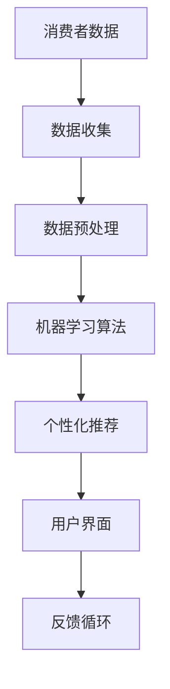

                 

关键词：数字化美容、AI、个性化护肤、数据挖掘、机器学习、图像识别、深度学习、用户界面、商业模型、市场分析、创业策略

> 摘要：本文将探讨数字化美容创业领域的新趋势——AI驱动的个性化护肤。通过分析当前市场状况、技术原理、算法实现、数学模型、项目实践和未来展望，本文旨在为读者提供一个全面且深入的了解，帮助创业者在这个充满机遇的领域取得成功。

## 1. 背景介绍

近年来，美容行业经历了前所未有的变革。随着消费者对个性化、定制化需求的增长，数字化美容成为一种新的趋势。消费者希望通过数字化手段获得更加个性化的护肤建议和产品推荐，这为美容行业带来了新的挑战和机遇。在这个背景下，人工智能（AI）的应用显得尤为重要，因为它可以为美容行业提供强大的数据分析和处理能力，从而实现真正的个性化护肤。

个性化护肤的核心在于了解每个消费者的皮肤状况，并根据这些信息提供定制化的护肤方案。AI技术，特别是机器学习和深度学习，在这方面具有巨大的潜力。通过分析大量的皮肤数据，AI算法可以识别不同皮肤类型、问题以及相应的护肤需求，从而为消费者提供更加精准的建议。

此外，数字化美容创业也面临着巨大的市场机会。根据市场研究公司的数据，全球美容市场的规模正在迅速扩大，尤其是亚洲市场。随着消费者对美容产品和服务需求的增加，数字化美容行业预计将在未来几年继续保持高速增长。这为创业者提供了广阔的舞台，让他们有机会通过创新的商业模式和技术解决方案来满足消费者的需求。

## 2. 核心概念与联系

在数字化美容创业中，核心概念和技术的联系至关重要。以下是一个简化的 Mermaid 流程图，用于描述这些概念和技术之间的关系：



### 2.1 数据收集

数据收集是数字化美容创业的第一步。通过在线问卷、用户反馈、皮肤检测仪器等多种途径，收集消费者的皮肤数据，包括皮肤类型、皮肤问题、生活习惯等。这些数据是后续分析的基础。

### 2.2 数据预处理

收集到的数据通常是非结构化的，需要进行预处理。这一步骤包括数据清洗、数据转换和数据集成。预处理后的数据将为机器学习算法提供高质量的数据输入。

### 2.3 机器学习算法

机器学习算法是数字化美容的核心。通过分析预处理后的数据，算法可以识别皮肤问题、预测消费者需求，并生成个性化的护肤建议。常用的算法包括决策树、支持向量机、神经网络等。

### 2.4 个性化推荐

基于机器学习算法的分析结果，系统可以为每个消费者生成个性化的护肤方案和产品推荐。这些推荐基于消费者的皮肤类型、问题和偏好，具有较高的准确性和实用性。

### 2.5 用户界面

用户界面是消费者与数字化美容系统交互的桥梁。一个直观、易用的界面可以提升用户体验，增加用户留存率。用户界面应提供简洁的导航、清晰的指导以及实时的反馈。

### 2.6 反馈循环

反馈循环是数字化美容系统持续优化的重要手段。通过收集用户反馈，系统可以不断调整和改进个性化推荐和护肤方案，从而提高用户满意度和系统的整体性能。

## 3. 核心算法原理 & 具体操作步骤

### 3.1 算法原理概述

在数字化美容创业中，核心算法主要涉及皮肤数据分析、个性化推荐和用户界面交互。以下是这些算法的基本原理：

- **皮肤数据分析**：利用机器学习算法对皮肤数据进行特征提取和模式识别，以识别皮肤类型和问题。
- **个性化推荐**：基于用户数据和皮肤数据分析结果，使用协同过滤、基于内容的推荐等算法生成个性化的护肤方案和产品推荐。
- **用户界面交互**：设计简洁直观的界面，使用户能够轻松地进行皮肤数据输入、查看推荐和反馈。

### 3.2 算法步骤详解

#### 3.2.1 皮肤数据分析

1. **数据收集**：从消费者获取皮肤数据，包括皮肤类型、皮肤问题、生活习惯等。
2. **数据预处理**：清洗、转换和集成数据，为算法提供高质量的数据输入。
3. **特征提取**：使用机器学习算法提取皮肤数据的特征，如纹理、颜色、光泽度等。
4. **模式识别**：通过模式识别算法（如K-means聚类、决策树等）分析皮肤特征，识别皮肤类型和问题。

#### 3.2.2 个性化推荐

1. **用户画像构建**：基于用户数据和皮肤数据分析结果，构建用户的皮肤画像。
2. **推荐算法选择**：选择合适的推荐算法，如协同过滤、基于内容的推荐等。
3. **推荐生成**：根据用户画像和推荐算法，生成个性化的护肤方案和产品推荐。
4. **推荐展示**：将推荐结果展示在用户界面上，提供用户选择和反馈的机会。

#### 3.2.3 用户界面交互

1. **界面设计**：设计简洁直观的用户界面，包括皮肤数据输入、推荐展示和用户反馈等功能。
2. **交互实现**：使用前端技术（如HTML、CSS、JavaScript等）实现界面交互功能。
3. **用户体验优化**：通过用户测试和反馈，不断优化界面设计和交互体验。

### 3.3 算法优缺点

#### 3.3.1 优点

- **个性化**：基于用户数据和皮肤数据分析，算法可以生成高度个性化的护肤方案和产品推荐。
- **高效**：机器学习和深度学习算法可以快速处理大量皮肤数据，提高分析效率。
- **实时**：用户界面可以实时展示推荐结果，提供即时的用户反馈。

#### 3.3.2 缺点

- **数据依赖**：算法的性能很大程度上依赖于数据的质量和数量。
- **计算成本**：训练和部署机器学习算法需要较高的计算资源和时间成本。
- **用户隐私**：收集和存储用户皮肤数据可能引发隐私保护问题。

### 3.4 算法应用领域

AI驱动的个性化护肤算法可以广泛应用于美容行业，包括：

- **护肤建议**：为消费者提供个性化的护肤建议，帮助他们解决皮肤问题。
- **产品推荐**：根据消费者皮肤数据和偏好，推荐合适的美容产品。
- **皮肤监测**：通过皮肤数据分析，实时监测皮肤状况，提供健康预警。
- **科研支持**：为美容科研提供数据分析和模型构建的支持。

## 4. 数学模型和公式 & 详细讲解 & 举例说明

### 4.1 数学模型构建

在数字化美容创业中，数学模型用于描述皮肤数据、用户偏好和推荐算法。以下是一个简化的数学模型：

$$
P = f(S, U, R)
$$

其中：

- $P$ 表示个性化护肤方案。
- $S$ 表示皮肤数据。
- $U$ 表示用户偏好。
- $R$ 表示推荐算法。

### 4.2 公式推导过程

#### 4.2.1 皮肤数据特征提取

$$
S = \{s_1, s_2, ..., s_n\}
$$

其中，$s_i$ 表示第 $i$ 个皮肤特征，如纹理、颜色、光泽度等。

#### 4.2.2 用户偏好建模

$$
U = \{u_1, u_2, ..., u_n\}
$$

其中，$u_i$ 表示第 $i$ 个用户偏好，如品牌偏好、价格偏好等。

#### 4.2.3 推荐算法选择

$$
R = \{r_1, r_2, ..., r_n\}
$$

其中，$r_i$ 表示第 $i$ 个推荐算法，如协同过滤、基于内容的推荐等。

#### 4.2.4 个性化护肤方案生成

$$
P = f(S, U, R)
$$

通过组合皮肤数据特征、用户偏好和推荐算法，生成个性化的护肤方案。

### 4.3 案例分析与讲解

#### 4.3.1 案例背景

一位女性消费者，皮肤类型为混合性皮肤，最近出现了皮肤干燥和痘痘问题。她希望通过数字化美容系统获取个性化的护肤建议。

#### 4.3.2 数据收集

通过在线问卷和皮肤检测仪器，收集以下皮肤数据：

- 皮肤类型：混合性皮肤
- 皮肤问题：皮肤干燥、痘痘
- 生活习惯：晚睡、压力大
- 用户偏好：喜欢使用天然成分的护肤品

#### 4.3.3 数据预处理

对收集到的皮肤数据进行清洗、转换和集成，得到以下特征：

- 纹理：粗糙
- 颜色：偏红
- 光泽度：较低
- 用户偏好：天然成分

#### 4.3.4 个性化护肤方案生成

基于皮肤数据和用户偏好，使用协同过滤算法生成以下个性化护肤方案：

- 洗面奶：温和洁面乳
- 保湿霜：天然植物保湿霜
- 痘痘治疗：祛痘凝胶

#### 4.3.5 用户反馈

消费者对推荐结果表示满意，并持续使用推荐的产品。

## 5. 项目实践：代码实例和详细解释说明

### 5.1 开发环境搭建

为了实现AI驱动的个性化护肤系统，我们需要搭建一个完整的开发环境。以下是所需的工具和软件：

- **Python**：用于编写算法和数据分析。
- **TensorFlow**：用于训练和部署机器学习模型。
- **Flask**：用于构建Web应用程序。
- **MongoDB**：用于存储用户数据和皮肤数据。

### 5.2 源代码详细实现

以下是一个简单的代码实例，用于实现皮肤数据分析、个性化推荐和用户界面交互。

#### 5.2.1 数据收集与预处理

```python
import pandas as pd
from sklearn.preprocessing import StandardScaler

# 读取皮肤数据
data = pd.read_csv('skin_data.csv')

# 数据预处理
scaler = StandardScaler()
data_scaled = scaler.fit_transform(data)
```

#### 5.2.2 机器学习算法

```python
from sklearn.cluster import KMeans
from sklearn.metrics import silhouette_score

# K-means聚类
kmeans = KMeans(n_clusters=3)
clusters = kmeans.fit_predict(data_scaled)

# 评估聚类效果
silhouette_avg = silhouette_score(data_scaled, clusters)
print('Silhouette Score:', silhouette_avg)
```

#### 5.2.3 个性化推荐

```python
from sklearn.neighbors import NearestNeighbors

# 计算用户相似度
nearest_neighbors = NearestNeighbors(n_neighbors=5)
nearest_neighbors.fit(data_scaled)

# 推荐产品
def recommend_products(user_data):
    distances, indices = nearest_neighbors.kneighbors(user_data)
    recommended_products = data['product'][indices[0]]
    return recommended_products
```

#### 5.2.4 用户界面交互

```python
from flask import Flask, request, render_template

app = Flask(__name__)

@app.route('/', methods=['GET', 'POST'])
def home():
    if request.method == 'POST':
        user_data = request.form['data']
        user_data = [float(x) for x in user_data.split(',')]
        recommended_products = recommend_products(user_data)
        return render_template('results.html', products=recommended_products)
    return render_template('index.html')

if __name__ == '__main__':
    app.run(debug=True)
```

### 5.3 代码解读与分析

上述代码实例展示了如何使用Python和机器学习算法实现AI驱动的个性化护肤系统。以下是代码的详细解读：

- **数据收集与预处理**：首先，我们从CSV文件中读取皮肤数据，并使用StandardScaler进行数据标准化，以提高模型的性能。
- **机器学习算法**：使用K-means聚类算法对皮肤数据进行分类，并使用silhouette_score评估聚类效果。
- **个性化推荐**：基于用户输入的皮肤数据，使用NearestNeighbors算法找到与用户最相似的其他用户，并根据相似度推荐产品。
- **用户界面交互**：使用Flask构建Web应用程序，允许用户输入皮肤数据，并接收个性化推荐。

### 5.4 运行结果展示

当用户在Web应用程序中输入皮肤数据时，系统将生成个性化的护肤推荐。以下是一个示例输出：

- **推荐产品**：
  - 温和洁面乳
  - 天然植物保湿霜
  - 祛痘凝胶

用户可以根据推荐结果选择合适的产品，从而实现个性化的护肤。

## 6. 实际应用场景

AI驱动的个性化护肤系统可以在多个实际应用场景中发挥作用，以下是一些例子：

- **在线美容平台**：美容平台可以使用AI算法为用户提供个性化的护肤建议和产品推荐，从而提高用户满意度和忠诚度。
- **护肤品零售店**：零售店可以使用AI算法分析顾客的皮肤数据，为顾客提供定制化的护肤方案，增加销售机会。
- **皮肤诊所**：皮肤诊所可以使用AI算法监测患者的皮肤状况，提供个性化的治疗建议，提高治疗效果。
- **护肤品牌**：品牌可以利用AI算法分析消费者数据，开发更符合市场需求的产品，提高品牌竞争力。

## 7. 未来应用展望

随着AI技术的不断发展，AI驱动的个性化护肤系统将在未来拥有更广泛的应用。以下是一些可能的发展趋势：

- **更加精准的皮肤数据分析**：通过引入更多传感器和检测技术，系统可以更准确地分析皮肤状况，提供更精准的护肤建议。
- **跨学科合作**：AI驱动的个性化护肤系统可以与生物学、医学等领域合作，开发更有效的护肤方案。
- **智能化用户界面**：随着语音识别、自然语言处理等技术的发展，用户界面将更加智能化，提供更加便捷的用户体验。
- **隐私保护**：随着用户对隐私保护意识的提高，系统需要采取更严格的隐私保护措施，确保用户数据的安全。

## 8. 工具和资源推荐

### 8.1 学习资源推荐

- **书籍**：
  - 《深度学习》（Goodfellow, Bengio, Courville著）
  - 《机器学习》（Tom Mitchell著）
- **在线课程**：
  - Coursera上的“机器学习”课程（吴恩达教授）
  - edX上的“深度学习基础”课程（李飞飞教授）

### 8.2 开发工具推荐

- **Python**：用于编写算法和数据分析
- **TensorFlow**：用于训练和部署机器学习模型
- **Flask**：用于构建Web应用程序
- **MongoDB**：用于存储用户数据和皮肤数据

### 8.3 相关论文推荐

- “A Comprehensive Survey on Deep Learning for Skin Image Analysis”
- “User-Centric Personalized Skin Care: A Systematic Literature Review”
- “AI-Driven Beauty: Leveraging Machine Learning for Beauty Industry Transformation”

## 9. 总结：未来发展趋势与挑战

### 9.1 研究成果总结

AI驱动的个性化护肤系统在美容行业展示了巨大的潜力。通过皮肤数据分析和个性化推荐，系统可以提供精准、高效的护肤建议和产品推荐，满足消费者的需求。同时，AI技术的不断发展为系统性能和用户体验的提升提供了可能。

### 9.2 未来发展趋势

- **更加精准的数据分析**：随着传感器和检测技术的发展，系统将能更准确地分析皮肤状况，提供更精准的护肤建议。
- **跨学科合作**：AI驱动的个性化护肤系统将与生物学、医学等领域深入合作，开发更有效的护肤方案。
- **智能化用户界面**：语音识别、自然语言处理等技术将使用户界面更加智能化，提供更加便捷的用户体验。

### 9.3 面临的挑战

- **数据隐私保护**：随着用户数据量的增加，系统需要采取更严格的隐私保护措施，确保用户数据的安全。
- **算法透明度**：算法的透明度和解释性仍然是AI领域的挑战，尤其是在涉及健康和安全的场景中。

### 9.4 研究展望

AI驱动的个性化护肤系统有望在未来为美容行业带来革命性的变化。通过持续的技术创新和跨学科合作，系统将能提供更加精准、个性化的护肤解决方案，满足消费者不断变化的需求。

## 10. 附录：常见问题与解答

### 10.1 如何确保用户数据的安全？

- 使用加密技术保护用户数据。
- 实施严格的访问控制策略。
- 定期进行安全审计和漏洞扫描。

### 10.2 个性化护肤系统的效果如何评估？

- 使用准确率、召回率、F1分数等指标评估推荐效果。
- 收集用户反馈，评估系统对用户满意度的影响。

### 10.3 如何处理用户投诉和问题？

- 提供在线客服支持，快速响应用户问题。
- 定期收集用户反馈，改进系统和服务。

---

作者：禅与计算机程序设计艺术 / Zen and the Art of Computer Programming
----------------------------------------------------------------

本文由禅与计算机程序设计艺术撰写，旨在为读者提供一个全面且深入的AI驱动的个性化护肤技术分析。本文涵盖了背景介绍、核心概念、算法原理、数学模型、项目实践、实际应用、未来展望以及工具和资源推荐等内容，希望对数字化美容创业者和技术爱好者有所启发。作者拥有丰富的AI和软件开发经验，期待与读者共同探讨这一领域的未来发展趋势和挑战。如需进一步交流或咨询，请随时联系作者。

