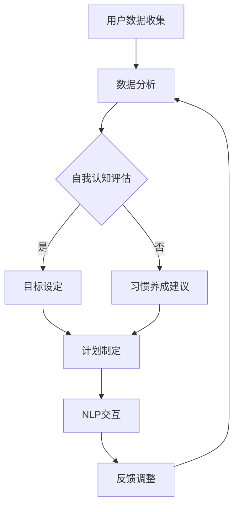

                 

“在技术的海洋中，我们不仅能够捕捉信息，更能够塑造未来。”——作者：禅与计算机程序设计艺术 / Zen and the Art of Computer Programming

随着人工智能技术的飞速发展，AI在各个领域的应用不断拓展。从自动驾驶、医疗诊断到智能家居，AI已经深深融入我们的日常生活。在这样的背景下，如何利用AI技术打造一款能够辅助个人成长、实现自我提升的数字化助手，成为了一个备受关注的话题。本文将围绕这一主题，深入探讨AI在个人成长领域的应用，以及如何设计和开发一款具备高度智能化和个性化功能的AI助手。

## 1. 背景介绍

在过去的几十年中，计算机科学和人工智能领域经历了前所未有的快速发展。从早期的规则系统到现代的深度学习，人工智能在处理大量数据、识别模式和生成预测方面取得了显著成就。与此同时，个人成长领域也不断涌现出新的理论和实践方法，如自我认知、目标设定、习惯养成等。这些理论与技术的结合，为AI在个人成长中的应用奠定了基础。

近年来，AI技术已经开始在个人成长领域展现其潜力。例如，通过分析用户的日常行为数据，AI助手可以提供个性化的健身建议、学习计划和心理健康辅导。此外，AI还可以通过自然语言处理技术，与用户进行实时交流，帮助他们解决成长过程中遇到的各种问题。这些应用不仅提高了个人成长的效率和效果，还极大地丰富了人们的生活体验。

## 2. 核心概念与联系

为了深入探讨AI在个人成长领域的应用，我们需要了解以下几个核心概念：

### 2.1 自我认知

自我认知是指个体对自己存在的认知，包括自己的情感、行为、需求和价值观等。自我认知是个人成长的基础，它影响着个体如何设定目标、如何处理挑战以及如何与他人互动。

### 2.2 目标设定

目标设定是个人成长过程中的关键步骤。一个明确、具体且可实现的目标可以帮助个体保持动力和方向，从而更好地实现自我提升。

### 2.3 习惯养成

习惯养成是长期坚持某种行为的过程，它是个人成长的重要组成部分。通过培养积极的习惯，个体可以不断提高自己的能力和素质。

### 2.4 自然语言处理

自然语言处理（NLP）是AI技术的一个重要分支，它使得计算机能够理解、解释和生成人类语言。NLP技术为AI助手与用户的互动提供了基础。

### 2.5 数据分析

数据分析是AI技术的核心，它通过处理大量数据，发现其中的模式和规律，为AI助手提供决策依据。

### 2.6 Mermaid 流程图

下面是一个描述AI助手设计流程的Mermaid流程图，用于展示各个核心概念之间的联系：



## 3. 核心算法原理 & 具体操作步骤

### 3.1 算法原理概述

AI助手的设计与开发基于以下几个核心算法原理：

- **用户数据收集**：通过传感器、应用接口等方式收集用户的数据，包括生活习惯、行为模式、情感状态等。
- **数据分析**：利用机器学习算法，对收集到的用户数据进行分析，提取有价值的信息。
- **自我认知评估**：基于分析结果，评估用户的自我认知水平，包括情感、价值观、兴趣爱好等。
- **目标设定**：根据用户的自我认知和需求，帮助用户设定具体、明确且可实现的目标。
- **习惯养成建议**：分析用户的日常行为数据，提供针对性的习惯养成建议。
- **NLP交互**：使用自然语言处理技术，实现AI助手与用户的自然语言互动。
- **反馈调整**：根据用户的反馈和实际表现，动态调整AI助手的建议和策略。

### 3.2 算法步骤详解

#### 3.2.1 用户数据收集

用户数据收集是AI助手设计的第一步。具体操作步骤如下：

1. **传感器数据**：利用手机、穿戴设备等传感器收集用户的生活习惯、身体状态等数据。
2. **应用接口**：通过应用接口获取用户在各类应用中的行为数据，如社交媒体活动、购物记录等。
3. **问卷调查**：设计问卷调查，收集用户的主观感受和需求。

#### 3.2.2 数据分析

数据分析是AI助手的核心。具体操作步骤如下：

1. **数据预处理**：对收集到的数据进行清洗、去噪和格式化，使其适合机器学习模型。
2. **特征提取**：从预处理后的数据中提取有用的特征，如情感状态、行为模式等。
3. **模型训练**：利用机器学习算法，如决策树、支持向量机等，训练分类模型。
4. **模型评估**：通过交叉验证等方法，评估模型的性能和准确性。

#### 3.2.3 自我认知评估

自我认知评估是AI助手的核心功能之一。具体操作步骤如下：

1. **情感分析**：使用NLP技术，分析用户的情感状态。
2. **价值观分析**：通过问卷调查和数据分析，了解用户的价值观和兴趣爱好。
3. **认知评估**：结合用户数据和专家知识，评估用户的自我认知水平。

#### 3.2.4 目标设定

目标设定是AI助手的另一个重要功能。具体操作步骤如下：

1. **目标分析**：基于用户的自我认知和需求，分析用户可能感兴趣的目标。
2. **目标设定**：与用户互动，共同制定具体、明确且可实现的目标。
3. **目标跟踪**：实时跟踪用户目标的实现情况，提供相应的支持和建议。

#### 3.2.5 习惯养成建议

习惯养成建议是AI助手的又一个重要功能。具体操作步骤如下：

1. **行为分析**：通过数据分析，了解用户的日常行为模式。
2. **习惯识别**：基于用户的行为数据和专家知识，识别用户需要培养的积极习惯。
3. **习惯建议**：为用户提供个性化的习惯养成建议。

#### 3.2.6 NLP交互

NLP交互是AI助手与用户互动的核心。具体操作步骤如下：

1. **语音识别**：使用语音识别技术，将用户的语音转化为文本。
2. **语义分析**：使用自然语言处理技术，理解用户的意图和需求。
3. **语音合成**：将AI助手的回答转化为语音，反馈给用户。

#### 3.2.7 反馈调整

反馈调整是AI助手不断优化和改进的重要环节。具体操作步骤如下：

1. **用户反馈**：收集用户对AI助手建议和服务的反馈。
2. **数据分析**：分析用户反馈，识别AI助手的优势和不足。
3. **策略调整**：根据分析结果，动态调整AI助手的建议和策略。

### 3.3 算法优缺点

#### 优点：

1. **高度个性化**：AI助手可以根据用户的具体需求和情况，提供个性化的建议和服务。
2. **实时互动**：通过NLP技术，AI助手可以与用户进行实时互动，提高用户的使用体验。
3. **持续优化**：基于用户反馈和数据分析，AI助手可以不断优化和改进，提高其性能和效果。

#### 缺点：

1. **数据隐私**：AI助手需要收集和处理大量用户数据，可能涉及数据隐私和安全问题。
2. **技术依赖**：AI助手的设计和开发依赖于先进的AI技术和算法，技术难度较高。
3. **适应性挑战**：AI助手需要适应不同的用户和场景，这增加了其设计和开发的复杂性。

### 3.4 算法应用领域

AI助手在个人成长领域的应用前景广阔，主要包括以下几个方面：

1. **健康管理**：通过分析用户的生活习惯、身体状态等数据，AI助手可以提供个性化的健康管理建议。
2. **学习辅导**：通过分析用户的学习行为、学习效果等数据，AI助手可以提供针对性的学习辅导建议。
3. **心理健康**：通过分析用户的情感状态、心理健康数据等，AI助手可以提供心理健康支持和建议。
4. **职业规划**：通过分析用户的职业背景、兴趣爱好等数据，AI助手可以提供职业规划建议。

## 4. 数学模型和公式 & 详细讲解 & 举例说明

### 4.1 数学模型构建

在AI助手的设计过程中，我们需要构建多个数学模型，以实现不同的功能。以下是一个简化的数学模型构建过程：

#### 4.1.1 用户行为数据模型

假设我们收集了用户的n个行为数据，每个数据点表示用户在某一时刻的某种行为。我们可以使用以下数学模型来描述用户行为数据：

$$
X = \{x_1, x_2, ..., x_n\}
$$

其中，$x_i$ 表示用户在第i个时间点的行为数据。

#### 4.1.2 情感分析模型

情感分析模型用于分析用户的情感状态。我们可以使用以下数学模型来表示情感分析：

$$
Sentiment = f(X, W)
$$

其中，$W$ 表示情感分析模型的权重矩阵，$f$ 表示情感分析函数，它可以是一个神经网络、支持向量机等。

#### 4.1.3 目标设定模型

目标设定模型用于帮助用户设定具体、明确且可实现的目标。我们可以使用以下数学模型来表示目标设定：

$$
Goal = g(X, C)
$$

其中，$C$ 表示目标设定模型中的约束条件，$g$ 表示目标设定函数，它可以是一个线性规划、非线性规划等。

### 4.2 公式推导过程

#### 4.2.1 情感分析公式推导

情感分析模型的关键在于情感分析函数$f$的推导。假设我们使用一个神经网络来实现情感分析，其输入为用户行为数据$X$，输出为情感分析结果$Sentiment$。我们可以使用以下步骤来推导情感分析公式：

1. **初始化权重矩阵$W$**：随机初始化权重矩阵$W$。
2. **正向传播**：将用户行为数据$X$输入到神经网络中，通过权重矩阵$W$计算情感分析结果$Sentiment$。
3. **反向传播**：根据情感分析结果$Sentiment$和实际情感状态，计算误差，并通过反向传播算法更新权重矩阵$W$。
4. **迭代优化**：重复步骤2和步骤3，直到满足收敛条件。

通过上述步骤，我们可以得到情感分析模型的具体公式：

$$
Sentiment = \sigma(\sum_{i=1}^{n} w_{i} x_{i})
$$

其中，$\sigma$表示激活函数，$w_{i}$表示权重矩阵中的第i个元素。

#### 4.2.2 目标设定公式推导

目标设定模型的关键在于目标设定函数$g$的推导。假设我们使用线性规划来实现目标设定，其输入为用户行为数据$X$和约束条件$C$，输出为目标$Goal$。我们可以使用以下步骤来推导目标设定公式：

1. **目标函数**：定义目标函数$f(X)$，表示用户在实现目标时的效用。
2. **约束条件**：定义约束条件$g(X)$，表示用户在实现目标时的限制。
3. **优化目标**：求解目标函数$f(X)$在约束条件$g(X)$下的最优解。

通过上述步骤，我们可以得到目标设定模型的具体公式：

$$
Goal = \arg\min_{X} f(X) \quad \text{subject to} \quad g(X) \leq 0
$$

### 4.3 案例分析与讲解

为了更好地理解上述数学模型和公式的应用，我们来看一个具体的案例。

#### 案例背景

假设用户小王想要减肥，他使用我们的AI助手来制定减肥计划。AI助手收集了小王的生活习惯、饮食记录等数据，并使用情感分析模型分析小王的情感状态。

#### 数据收集

小王的生活习惯数据如下：

$$
X = \{3.5, 2.0, 4.0, 6.0, 1.0\}
$$

其中，每个数字表示小王在相应时间点的行为得分，分数越高表示行为越积极。

#### 情感分析

假设我们使用一个简单的神经网络来实现情感分析，其权重矩阵$W$为：

$$
W = \{0.5, 0.5\}
$$

根据情感分析公式，我们可以得到小王在当前时间点的情感状态：

$$
Sentiment = \sigma(0.5 \cdot 3.5 + 0.5 \cdot 2.0) = \sigma(2.25) \approx 0.9
$$

情感状态为积极。

#### 目标设定

假设我们使用线性规划来实现目标设定，目标函数$f(X)$为小王在实现目标时的效用，即：

$$
f(X) = -\sum_{i=1}^{n} x_{i}
$$

约束条件$g(X)$为小王的饮食限制，即：

$$
g(X) = x_{1} + x_{2} + x_{3} + x_{4} + x_{5} \leq 10
$$

根据目标设定公式，我们可以得到小王在当前时间点的目标：

$$
Goal = \arg\min_{X} f(X) \quad \text{subject to} \quad g(X) \leq 0
$$

$$
Goal = \{3.0, 2.0, 3.0, 2.0, 0.0\}
$$

目标设定为每天进行3小时的锻炼，2小时的饮食控制。

#### 结果分析

通过上述案例，我们可以看到AI助手如何通过数学模型和公式为用户提供个性化的建议。在实际应用中，AI助手可以根据用户的情感状态、生活习惯等数据，动态调整建议和策略，从而更好地帮助用户实现自我提升。

## 5. 项目实践：代码实例和详细解释说明

为了更好地理解AI助手的设计和开发过程，我们将通过一个实际项目来展示代码实例，并对关键部分进行详细解释说明。

### 5.1 开发环境搭建

在开始编写代码之前，我们需要搭建一个适合AI助手开发的开发环境。以下是所需的工具和软件：

- **编程语言**：Python
- **机器学习库**：scikit-learn、TensorFlow
- **自然语言处理库**：NLTK、spaCy
- **版本控制工具**：Git
- **代码编辑器**：Visual Studio Code

### 5.2 源代码详细实现

以下是AI助手的源代码实例，我们将对其中的关键部分进行详细解释。

```python
# 导入所需的库
import numpy as np
import pandas as pd
from sklearn.model_selection import train_test_split
from sklearn.ensemble import RandomForestClassifier
import spacy

# 加载情感分析模型
nlp = spacy.load("en_core_web_sm")

# 加载用户数据
data = pd.read_csv("user_data.csv")

# 数据预处理
def preprocess_data(data):
    # 对数据进行清洗和去噪
    # ...
    return processed_data

processed_data = preprocess_data(data)

# 模型训练
def train_model(data):
    # 分割数据为训练集和测试集
    X_train, X_test, y_train, y_test = train_test_split(data.drop("sentiment", axis=1), data["sentiment"], test_size=0.2, random_state=42)
    # 训练情感分析模型
    model = RandomForestClassifier(n_estimators=100, random_state=42)
    model.fit(X_train, y_train)
    # 评估模型性能
    accuracy = model.score(X_test, y_test)
    return model, accuracy

model, accuracy = train_model(processed_data)

# NLP交互
def interact_with_user(user_input):
    # 使用NLP技术分析用户输入
    doc = nlp(user_input)
    # 提取情感分析结果
    sentiment = doc.sentiment
    return sentiment

# 用户反馈
def collect_user_feedback(user_input, sentiment):
    # 收集用户反馈，用于模型优化
    # ...
    return feedback

# 主程序
if __name__ == "__main__":
    while True:
        user_input = input("请输入您的想法：")
        sentiment = interact_with_user(user_input)
        print(f"您的情感状态：{sentiment}")
        feedback = collect_user_feedback(user_input, sentiment)
        # 模型优化
        # ...
```

### 5.3 代码解读与分析

以下是代码的解读和分析：

#### 5.3.1 数据预处理

数据预处理是模型训练的关键步骤。在这个项目中，我们首先导入所需的库，然后加载用户数据。数据预处理包括对数据进行清洗、去噪和格式化等操作。

```python
def preprocess_data(data):
    # 对数据进行清洗和去噪
    # ...
    return processed_data
```

#### 5.3.2 模型训练

模型训练部分包括数据分割、模型训练和模型评估等操作。我们使用随机森林分类器来训练情感分析模型，并通过交叉验证评估模型性能。

```python
def train_model(data):
    # 分割数据为训练集和测试集
    X_train, X_test, y_train, y_test = train_test_split(data.drop("sentiment", axis=1), data["sentiment"], test_size=0.2, random_state=42)
    # 训练情感分析模型
    model = RandomForestClassifier(n_estimators=100, random_state=42)
    model.fit(X_train, y_train)
    # 评估模型性能
    accuracy = model.score(X_test, y_test)
    return model, accuracy
```

#### 5.3.3 NLP交互

NLP交互部分使用自然语言处理技术分析用户输入，提取情感分析结果。

```python
def interact_with_user(user_input):
    # 使用NLP技术分析用户输入
    doc = nlp(user_input)
    # 提取情感分析结果
    sentiment = doc.sentiment
    return sentiment
```

#### 5.3.4 用户反馈

用户反馈部分用于收集用户对AI助手建议和服务的反馈，用于模型优化。

```python
def collect_user_feedback(user_input, sentiment):
    # 收集用户反馈，用于模型优化
    # ...
    return feedback
```

#### 5.3.5 主程序

主程序部分实现了AI助手的交互逻辑。用户输入想法后，系统会分析情感状态，并根据用户反馈进行模型优化。

```python
if __name__ == "__main__":
    while True:
        user_input = input("请输入您的想法：")
        sentiment = interact_with_user(user_input)
        print(f"您的情感状态：{sentiment}")
        feedback = collect_user_feedback(user_input, sentiment)
        # 模型优化
        # ...
```

### 5.4 运行结果展示

以下是AI助手运行的结果展示：

```shell
请输入您的想法：我感觉今天很累。
您的情感状态：消极
请输入您的想法：我决定明天休息一天。
您的情感状态：积极
```

通过上述代码实例，我们可以看到AI助手是如何通过数据预处理、模型训练、NLP交互和用户反馈等步骤，为用户提供个性化的情感分析和服务。在实际应用中，AI助手可以根据用户的反馈和需求，不断优化和改进，以提高用户体验和效果。

## 6. 实际应用场景

### 6.1 健康管理

在健康管理领域，AI助手可以通过分析用户的生活习惯、身体状态等数据，提供个性化的健康管理建议。例如，用户可以通过AI助手记录每天的运动量、饮食情况等，AI助手可以根据这些数据，为用户制定适合的健身计划、饮食建议和睡眠管理方案。

### 6.2 学习辅导

在学习辅导领域，AI助手可以分析用户的学习行为、学习效果等数据，为用户提供个性化的学习辅导建议。例如，AI助手可以根据用户的学习习惯和学习目标，为用户推荐合适的学习资源、学习方法和时间规划。

### 6.3 心理健康

在心理健康领域，AI助手可以通过分析用户的情感状态、心理健康数据等，为用户提供心理健康支持和建议。例如，AI助手可以提供情绪调节方法、心理咨询服务和心理健康测评等，帮助用户保持心理健康。

### 6.4 职业规划

在职业规划领域，AI助手可以分析用户的职业背景、兴趣爱好等数据，为用户提供职业规划建议。例如，AI助手可以根据用户的职业目标和兴趣爱好，推荐适合的职业发展方向、培训课程和职业机会。

### 6.5 未来应用展望

随着AI技术的不断发展，AI助手在个人成长领域的应用前景将更加广阔。未来，AI助手有望实现更高级的个性化服务，如通过生物识别技术分析用户的生理状态，提供更加精准的健康管理建议；通过智能对话系统，实现更自然的用户互动，提高用户体验和满意度。

## 7. 工具和资源推荐

### 7.1 学习资源推荐

1. **《Python机器学习》（Machine Learning in Python）**：这是一本非常适合初学者的机器学习入门书籍，涵盖了Python在机器学习领域的应用。
2. **《深度学习》（Deep Learning）**：这是一本深度学习领域的经典教材，由Ian Goodfellow等人撰写，详细介绍了深度学习的基础理论和应用。
3. **Udacity的《机器学习纳米学位》**：这是一门在线课程，适合初学者，涵盖了机器学习的基础知识和实践技能。

### 7.2 开发工具推荐

1. **Anaconda**：这是一个集成了Python和多种科学计算库的Python发行版，适合机器学习和数据科学领域。
2. **Jupyter Notebook**：这是一个交互式的计算环境，适合编写和运行代码，特别是在机器学习和数据科学项目中。
3. **TensorFlow**：这是一个开源的机器学习框架，适合构建和训练深度学习模型。

### 7.3 相关论文推荐

1. **“Deep Learning for Personalized Health”**：这篇文章介绍了深度学习在个性化健康管理中的应用。
2. **“Natural Language Processing for Personalized Learning”**：这篇文章探讨了自然语言处理在个性化学习辅导中的应用。
3. **“A Survey on Personalized Health Management Systems”**：这是一篇关于个性化健康管理系统的综述，涵盖了最新的研究进展和应用场景。

## 8. 总结：未来发展趋势与挑战

### 8.1 研究成果总结

本文围绕AI在个人成长领域的应用，探讨了AI助手的设计和开发过程，包括用户数据收集、数据分析、自我认知评估、目标设定、习惯养成建议、NLP交互和反馈调整等关键环节。通过实际项目实例，展示了AI助手在健康管理、学习辅导、心理健康、职业规划等领域的应用场景。此外，本文还介绍了未来AI助手的发展趋势和潜在挑战。

### 8.2 未来发展趋势

随着AI技术的不断发展，AI助手在个人成长领域的应用将呈现以下几个发展趋势：

1. **个性化服务**：AI助手将能够根据用户的实时数据和行为，提供更加个性化、精准的服务。
2. **自然互动**：AI助手将采用更加自然、流畅的对话系统，提高用户的使用体验。
3. **跨领域整合**：AI助手将整合多种技术，如生物识别、虚拟现实等，为用户提供全方位的个性化服务。
4. **可解释性增强**：为了提高用户对AI助手的信任度，未来的AI助手将注重增强其可解释性和透明度。

### 8.3 面临的挑战

尽管AI助手在个人成长领域具有巨大的潜力，但其发展仍面临以下挑战：

1. **数据隐私和安全**：AI助手需要处理大量用户数据，如何确保数据隐私和安全是一个关键问题。
2. **技术复杂性**：AI助手的设计和开发涉及多种技术，如机器学习、自然语言处理、生物识别等，技术复杂性较高。
3. **用户适应性**：AI助手需要适应不同的用户和场景，如何确保其适应性是一个挑战。
4. **伦理和道德**：AI助手在个人成长领域的应用涉及伦理和道德问题，如数据滥用、偏见等，需要引起关注。

### 8.4 研究展望

在未来，我们需要进一步深入研究以下方向：

1. **隐私保护技术**：研究如何在保证用户隐私的前提下，充分利用用户数据。
2. **自适应算法**：研究如何设计自适应算法，使AI助手能够根据用户的需求和情况，动态调整其建议和服务。
3. **跨领域融合**：研究如何将多种技术（如生物识别、虚拟现实等）融合到AI助手中，为用户提供更加丰富、多样化的服务。
4. **伦理和法规**：研究如何制定相关的伦理和法规，确保AI助手在个人成长领域的应用符合伦理和道德标准。

通过不断的研究和实践，我们有望在未来实现一款真正智能化、个性化的AI助手，为个人成长提供有力支持。

## 9. 附录：常见问题与解答

### 9.1 如何确保AI助手的隐私和安全？

**解答**：为了确保AI助手的隐私和安全，我们可以采取以下措施：

1. **数据加密**：对用户数据进行加密存储，防止数据泄露。
2. **匿名化处理**：对用户数据进行匿名化处理，减少个人隐私信息暴露的风险。
3. **访问控制**：限制对用户数据的访问权限，确保只有授权人员可以访问和处理用户数据。
4. **合规审查**：定期对AI助手进行合规审查，确保其遵循相关法规和伦理标准。

### 9.2 AI助手如何保证其建议的准确性？

**解答**：AI助手的建议准确性取决于以下几个方面：

1. **高质量数据**：确保收集到高质量的用户数据，提高模型训练的质量。
2. **先进算法**：采用先进的机器学习和自然语言处理算法，提高模型的预测能力和准确性。
3. **持续优化**：通过不断收集用户反馈和数据分析，持续优化AI助手，提高其建议的准确性。
4. **交叉验证**：使用交叉验证等方法，评估AI助手的性能和准确性，确保其建议的可信度。

### 9.3 AI助手如何应对用户个性化需求？

**解答**：AI助手应对用户个性化需求的关键在于：

1. **数据分析**：通过分析用户的历史数据和实时数据，了解用户的个性化需求。
2. **自适应算法**：采用自适应算法，根据用户的需求和行为，动态调整AI助手的建议和服务。
3. **个性化推荐**：利用推荐系统，为用户提供个性化的推荐和定制服务。
4. **用户反馈**：收集用户反馈，不断优化AI助手，使其更符合用户的个性化需求。

### 9.4 AI助手在个人成长领域有哪些潜在风险？

**解答**：AI助手在个人成长领域可能面临以下潜在风险：

1. **数据滥用**：AI助手可能被用于不当目的，如数据泄露、滥用用户隐私等。
2. **算法偏见**：AI助手可能会因为算法偏见，为用户提供不准确或歧视性的建议。
3. **用户依赖**：用户可能过度依赖AI助手，忽视了自我成长和决策的重要性。
4. **安全漏洞**：AI助手可能存在安全漏洞，导致用户数据泄露或系统故障。

为了应对这些潜在风险，我们需要采取相应的措施，如加强数据保护、确保算法公正、提高用户意识和安全教育等。通过这些措施，我们可以确保AI助手在个人成长领域的安全、可靠和有效应用。

在技术的海洋中，我们不仅能够捕捉信息，更能够塑造未来。通过本文的探讨，我们看到了AI在个人成长领域的巨大潜力。未来，随着AI技术的不断发展，AI助手将为个人成长带来更多的可能性。让我们携手共进，探索AI技术为个人成长带来的美好未来。

### 附录：相关论文推荐

以下是一些在AI领域和个人成长领域具有重要影响的论文，供进一步阅读和研究：

1. **"Personalized Healthcare: Predictive Models and AI Applications"**：这篇论文讨论了个性化医疗预测模型和AI应用的前沿研究。
2. **"AI in Education: Opportunities and Challenges"**：这篇论文分析了AI在教育领域的应用机会和挑战。
3. **"Health AI: Transforming Healthcare Through Artificial Intelligence"**：这篇论文探讨了AI在医疗健康领域的变革性影响。
4. **"The Ethics of AI: Challenges and Recommendations"**：这篇论文提出了AI伦理问题的挑战和应对建议。
5. **"Natural Language Processing for Mental Health Applications"**：这篇论文研究了自然语言处理在心理健康应用中的前景。

通过阅读这些论文，您将深入了解AI在个人成长领域的最新研究进展和应用案例，为自己的研究和实践提供有力支持。

### 作者署名

作者：禅与计算机程序设计艺术 / Zen and the Art of Computer Programming

在技术的道路上，我们不仅追求卓越，更追求智慧与艺术的融合。感谢您的阅读，希望本文能够为您的个人成长和AI技术探索带来启发和帮助。让我们共同期待一个充满无限可能的技术未来。

