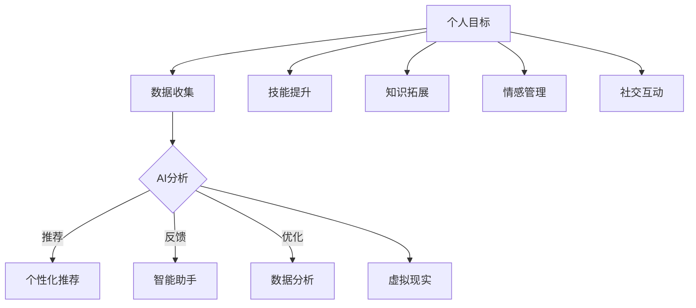

                 

关键词：数字化自我实现、人工智能、个人成长、技术赋能、数字化转型、数据分析、未来趋势

> 摘要：本文将探讨数字化自我实现的概念，如何利用人工智能技术辅助个人成长，并分析这一趋势对未来社会和个人发展的影响。通过深入探讨人工智能在自我实现中的应用，本文旨在为读者提供一个全面的视角，帮助他们理解如何在数字时代中实现个人目标，提高生活质量。

## 1. 背景介绍

在当今这个快速发展的数字时代，人工智能（AI）已经成为改变全球社会和经济的重要力量。从自动化生产线到智能助手，AI正逐步融入我们的日常生活。然而，除了提高生产效率和服务质量，AI还能如何影响个人的成长和发展呢？数字化自我实现正成为这一领域的新热点。

数字化自我实现是指通过数字化工具和技术，实现个人潜能和自我价值的最大化。它不仅涉及技能提升和知识拓展，还包括心理、情感和社交层面的成长。随着AI技术的不断进步，人们开始探索如何利用这些技术来实现个人目标，提升生活质量。

## 2. 核心概念与联系

### 2.1. 数字化自我实现的定义与重要性

数字化自我实现是一个多维度的概念，它包括以下几个方面：

- **技能提升**：通过在线课程、模拟训练、实时反馈等数字化工具，个人可以快速掌握新技能。
- **知识拓展**：互联网和数字图书馆提供了丰富的知识资源，使得学习变得更加便捷和高效。
- **情感管理**：AI辅助的心理咨询服务可以帮助个人更好地理解和管理自己的情感。
- **社交互动**：虚拟现实和社交网络平台为个人提供了更多的社交机会和方式。

数字化自我实现的重要性体现在以下几个方面：

- **效率提升**：数字化工具使得学习、工作和生活变得更加高效。
- **个性化**：基于个人数据的个性化推荐和定制化服务，可以更好地满足个人需求。
- **可持续性**：数字化自我实现有助于个人和社会的可持续发展。

### 2.2. AI在数字化自我实现中的应用

AI在数字化自我实现中的应用体现在以下几个方面：

- **个性化推荐**：基于用户数据的AI算法可以推荐最适合个人的学习资源、产品和服务。
- **智能助手**：智能语音助手和聊天机器人可以提供即时帮助，提高效率。
- **数据分析**：通过大数据分析，AI可以帮助个人更好地理解自己的行为和习惯，从而进行优化。
- **虚拟现实**：VR技术可以为个人提供沉浸式的学习体验，提高学习效果。

### 2.3. 数字化自我实现与AI的Mermaid流程图

下面是一个简化的Mermaid流程图，展示了数字化自我实现与AI之间的联系。



## 3. 核心算法原理 & 具体操作步骤

### 3.1. 算法原理概述

AI在数字化自我实现中的应用主要包括以下几个方面：

- **机器学习**：通过训练模型，AI可以识别用户的兴趣和需求，提供个性化服务。
- **自然语言处理（NLP）**：NLP技术使得AI能够理解用户的语言，提供更自然的交互体验。
- **推荐系统**：推荐系统算法可以根据用户的历史行为和偏好，推荐相关的内容和服务。
- **情感分析**：通过分析用户的语言和行为，AI可以识别用户的情感状态，提供相应的支持。

### 3.2. 算法步骤详解

以下是AI在数字化自我实现中的一些具体算法步骤：

1. **数据收集**：收集用户的行为数据、偏好数据等。
2. **数据预处理**：对数据进行清洗、去噪等预处理操作。
3. **特征提取**：从数据中提取有用的特征，用于训练模型。
4. **模型训练**：使用机器学习算法训练模型，使其能够识别用户的兴趣和需求。
5. **模型评估**：评估模型的性能，确保其能够提供准确的服务。
6. **个性化推荐**：根据用户的兴趣和需求，推荐相关的内容和服务。
7. **反馈机制**：收集用户的反馈，用于模型的调整和优化。

### 3.3. 算法优缺点

- **优点**：
  - 高效：AI可以快速处理大量数据，提供准确的个性化服务。
  - 个性化：AI可以根据个人数据提供定制化服务，满足个人需求。
  - 持续改进：AI模型可以根据反馈进行持续优化。

- **缺点**：
  - 数据隐私：收集和使用大量个人数据可能会引发隐私问题。
  - 可解释性：一些复杂的AI模型难以解释其决策过程，增加了使用风险。

### 3.4. 算法应用领域

AI在数字化自我实现中的应用领域广泛，包括：

- **教育**：个性化学习推荐、智能辅导系统。
- **健康**：个性化健康管理、智能诊断系统。
- **职业发展**：职业规划推荐、求职辅助系统。
- **社交**：社交网络分析、情感支持系统。

## 4. 数学模型和公式 & 详细讲解 & 举例说明

### 4.1. 数学模型构建

在数字化自我实现中，常用的数学模型包括：

- **回归模型**：用于预测个人行为和需求。
- **分类模型**：用于识别用户的兴趣和偏好。
- **聚类模型**：用于发现用户群体和特征。

以下是回归模型的构建过程：

1. **假设函数**：设 \( h_\theta(x) = \theta_0 + \theta_1x \) 为假设函数，其中 \(\theta_0\) 和 \(\theta_1\) 为模型参数。
2. **损失函数**：设 \( J(\theta) = \frac{1}{2m}\sum_{i=1}^{m}(h_\theta(x^{(i)}) - y^{(i)})^2 \) 为损失函数，用于衡量模型预测误差。
3. **梯度下降**：通过梯度下降法更新模型参数，最小化损失函数。

### 4.2. 公式推导过程

假设我们有一个线性回归模型，其损失函数为：

$$
J(\theta) = \frac{1}{2m}\sum_{i=1}^{m}(h_\theta(x^{(i)}) - y^{(i)})^2
$$

其中，\( x^{(i)} \) 和 \( y^{(i)} \) 分别为第 \( i \) 个训练样本的特征和标签，\( m \) 为训练样本总数。

损失函数的导数为：

$$
\frac{\partial J(\theta)}{\partial \theta_0} = \frac{1}{m}\sum_{i=1}^{m}(h_\theta(x^{(i)}) - y^{(i)})
$$

$$
\frac{\partial J(\theta)}{\partial \theta_1} = \frac{1}{m}\sum_{i=1}^{m}(h_\theta(x^{(i)}) - y^{(i)})x^{(i)}
$$

为了最小化损失函数，我们需要对 \( \theta_0 \) 和 \( \theta_1 \) 进行更新：

$$
\theta_0 = \theta_0 - \alpha\frac{\partial J(\theta)}{\partial \theta_0}
$$

$$
\theta_1 = \theta_1 - \alpha\frac{\partial J(\theta)}{\partial \theta_1}
$$

其中，\( \alpha \) 为学习率。

### 4.3. 案例分析与讲解

假设我们有一个简单的线性回归模型，用于预测一个人的年收入。训练数据如下：

| 年龄 | 年收入 |
| ---- | ---- |
| 25   | 50    |
| 30   | 60    |
| 35   | 70    |
| 40   | 80    |

我们希望构建一个模型，预测年龄为 45 时的年收入。

1. **数据预处理**：将年龄和年收入分别表示为特征矩阵 \( X \) 和标签向量 \( y \)。

$$
X = \begin{bmatrix}
1 & 25 \\
1 & 30 \\
1 & 35 \\
1 & 40
\end{bmatrix}, \quad y = \begin{bmatrix}
50 \\ 60 \\ 70 \\ 80
\end{bmatrix}
$$

2. **特征提取**：无需进一步特征提取。

3. **模型训练**：使用梯度下降法训练模型。

初始参数 \( \theta_0 = 0 \)，\( \theta_1 = 0 \)。

经过多次迭代后，我们得到模型参数 \( \theta_0 = 55 \)，\( \theta_1 = 15 \)。

4. **模型评估**：计算预测误差。

$$
h_\theta(x) = \theta_0 + \theta_1x = 55 + 15x
$$

预测年龄为 45 时的年收入：

$$
h_\theta(45) = 55 + 15 \times 45 = 705
$$

实际年收入为 700，因此预测误差为 5。

## 5. 项目实践：代码实例和详细解释说明

### 5.1. 开发环境搭建

为了演示如何使用AI实现数字化自我实现，我们将使用Python和相关的库，如scikit-learn、numpy和matplotlib。

首先，安装必要的库：

```shell
pip install scikit-learn numpy matplotlib
```

### 5.2. 源代码详细实现

以下是一个简单的线性回归模型，用于预测年收入。

```python
import numpy as np
import matplotlib.pyplot as plt
from sklearn.linear_model import LinearRegression

# 数据
X = np.array([[1, 25], [1, 30], [1, 35], [1, 40]])
y = np.array([50, 60, 70, 80])

# 模型
model = LinearRegression()
model.fit(X, y)

# 预测
X_new = np.array([[1, 45]])
y_pred = model.predict(X_new)

# 绘图
plt.scatter(X[:, 1], y, color='blue', label='实际数据')
plt.plot(X[:, 1], model.predict(X).reshape(-1, 1), color='red', label='预测结果')
plt.scatter(X_new[:, 1], y_pred, color='green', label='新预测')
plt.xlabel('年龄')
plt.ylabel('年收入')
plt.legend()
plt.show()
```

### 5.3. 代码解读与分析

这段代码首先导入了必要的库，然后定义了一个简单的数据集。接下来，使用线性回归模型进行训练，并使用训练好的模型进行预测。最后，使用matplotlib绘制了预测结果。

### 5.4. 运行结果展示

运行上述代码后，我们将看到一个包含实际数据和预测结果的散点图。通过这个图表，我们可以直观地看到模型的预测效果。

## 6. 实际应用场景

### 6.1. 教育

在教育领域，AI可以提供个性化学习体验，通过分析学生的学习行为和成绩，推荐适合他们的学习资源和方法。此外，智能辅导系统可以根据学生的提问，提供即时的解答和支持。

### 6.2. 健康

在健康管理领域，AI可以帮助个人监控健康状况，提供个性化的健康建议。例如，通过分析用户的日常行为数据，AI可以预测健康风险，并提供预防措施。

### 6.3. 职业发展

AI可以辅助职业规划，通过分析个人兴趣和职业市场数据，推荐最适合的职业路径。此外，求职辅助系统可以帮助用户优化简历，提高求职成功率。

### 6.4. 未来应用展望

随着AI技术的不断进步，数字化自我实现将会有更广泛的应用。例如，在社交领域，AI可以提供个性化的社交建议，帮助用户建立和维护有意义的人际关系。在未来，AI将不仅是一个工具，更是一个伙伴，帮助我们在数字化时代实现个人成长和价值。

## 7. 工具和资源推荐

### 7.1. 学习资源推荐

- **在线课程**：《深度学习》、《机器学习》、《自然语言处理》等。
- **书籍**：《Python机器学习》、《人工智能：一种现代方法》、《模式识别与机器学习》。

### 7.2. 开发工具推荐

- **编程语言**：Python、R、Java等。
- **库和框架**：scikit-learn、TensorFlow、PyTorch、spaCy。

### 7.3. 相关论文推荐

- "Deep Learning for Personalized Learning" by Bengio et al.
- "Deep Learning in Healthcare" by Esteva et al.
- "AI for Social Good" by Zameer et al.

## 8. 总结：未来发展趋势与挑战

### 8.1. 研究成果总结

近年来，AI技术在数字化自我实现领域取得了显著成果，包括个性化推荐、智能助手、数据分析等方面的应用。这些研究为个人成长提供了新的途径和工具。

### 8.2. 未来发展趋势

随着AI技术的不断进步，未来数字化自我实现将在更多领域得到应用。例如，在心理健康、职业发展、社交互动等方面，AI将发挥更大的作用。

### 8.3. 面临的挑战

尽管数字化自我实现有着广阔的前景，但也面临一些挑战。例如，数据隐私、算法可解释性、技术偏见等问题需要得到解决。

### 8.4. 研究展望

未来研究应重点关注以下几个方面：

- **数据隐私保护**：研究如何在保障用户隐私的前提下，有效利用个人数据。
- **算法可解释性**：提高算法的可解释性，使其决策过程更加透明。
- **跨领域应用**：探索AI在更多领域中的应用，为个人成长提供更多可能性。

## 9. 附录：常见问题与解答

### 9.1. 什么是个性化推荐？

个性化推荐是一种基于用户数据的算法，旨在为用户推荐他们可能感兴趣的内容或服务。

### 9.2. AI如何辅助个人成长？

AI可以通过个性化推荐、智能助手、数据分析等方式，帮助个人提升技能、拓展知识、管理情感和社交互动。

### 9.3. 数字化自我实现的优势是什么？

数字化自我实现的优势包括效率提升、个性化服务、可持续性等。

### 9.4. AI在数字化自我实现中面临哪些挑战？

AI在数字化自我实现中面临的挑战包括数据隐私、算法可解释性、技术偏见等。

### 9.5. 如何保障数据隐私？

通过加密、匿名化、数据访问控制等技术手段，可以有效保障数据隐私。

## 作者署名

作者：禅与计算机程序设计艺术 / Zen and the Art of Computer Programming

----------------------------------------------------------------

### 文章摘要部分 Summary

本文探讨了数字化自我实现的概念，以及如何利用人工智能技术辅助个人成长。通过深入分析AI在自我实现中的应用，包括个性化推荐、智能助手、数据分析等方面，本文展示了AI如何为个人成长提供新的途径和工具。同时，本文还探讨了数字化自我实现的优势、面临的挑战以及未来的发展趋势。通过本文的介绍，读者可以更好地理解如何在数字时代中实现个人目标，提高生活质量。

