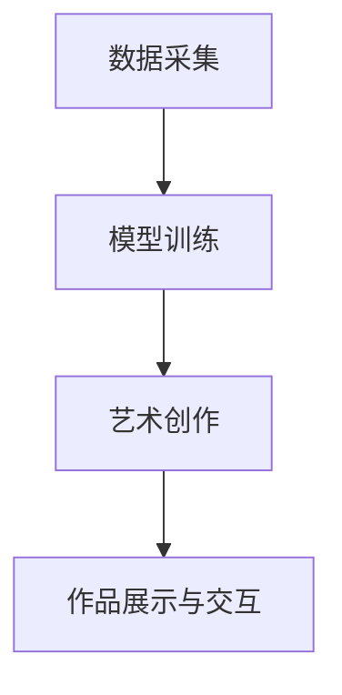

                 

关键词：数字化艺术、人工智能、创意产业、艺术创作、AI辅助

摘要：随着人工智能技术的快速发展，艺术创作领域迎来了新的变革。本文探讨了AI在艺术创作中的应用，分析了AI辅助的创意产业的发展现状和未来趋势，为从事艺术创作的创业者和从业者提供了有益的参考。

## 1. 背景介绍

在过去的几十年里，计算机技术在艺术创作中的应用越来越广泛。从最初的计算机图形学、数字绘画，到如今的人工智能，计算机技术已经成为艺术创作不可或缺的工具。然而，传统的艺术创作方式往往依赖于艺术家的个人经验和创造力，而人工智能的出现则打破了这一局限，使得艺术创作变得更加多样化和高效。

人工智能在艺术创作中的应用主要体现在以下几个方面：

1. **图像生成与编辑**：通过深度学习模型，人工智能可以生成全新的图像，也可以对现有图像进行编辑和优化。
2. **音乐创作**：人工智能可以生成旋律、和声和节奏，为音乐创作提供了新的可能性。
3. **文学创作**：人工智能可以生成诗歌、小说等文学作品，为文学创作提供了新的思路。
4. **交互艺术**：人工智能可以与用户进行实时互动，创造出独特的交互艺术体验。

## 2. 核心概念与联系

### 2.1. AI辅助艺术创作的核心概念

AI辅助艺术创作的核心概念包括：

1. **生成对抗网络（GAN）**：GAN是一种深度学习模型，用于生成高质量的图像。
2. **自然语言处理（NLP）**：NLP是一种人工智能技术，用于处理和理解自然语言。
3. **计算机视觉**：计算机视觉是一种人工智能技术，用于使计算机“看”懂图像和视频。

### 2.2. AI辅助艺术创作的架构

AI辅助艺术创作的架构通常包括以下几个部分：

1. **数据采集**：收集用于训练AI模型的图像、文本、音频等数据。
2. **模型训练**：使用收集到的数据训练AI模型。
3. **艺术创作**：使用训练好的模型进行艺术创作。
4. **作品展示与交互**：将创作出的艺术作品展示给观众，并提供交互体验。

### 2.3. Mermaid 流程图

以下是一个简单的Mermaid流程图，展示了AI辅助艺术创作的架构：



## 3. 核心算法原理 & 具体操作步骤

### 3.1. 算法原理概述

AI辅助艺术创作的核心算法主要包括：

1. **生成对抗网络（GAN）**：GAN由生成器（Generator）和判别器（Discriminator）组成，生成器生成图像，判别器判断图像是真实图像还是生成图像。
2. **自然语言处理（NLP）**：NLP通过词嵌入、序列模型等技术，将文本转化为计算机可处理的格式。
3. **计算机视觉**：计算机视觉通过卷积神经网络（CNN）等技术，对图像进行处理和分析。

### 3.2. 算法步骤详解

1. **数据准备**：收集用于训练的数据，包括图像、文本和音频等。
2. **模型训练**：使用收集到的数据训练GAN、NLP和计算机视觉模型。
3. **艺术创作**：使用训练好的模型生成图像、音乐和文学作品。
4. **作品展示与交互**：将创作出的作品展示给用户，并提供交互功能。

### 3.3. 算法优缺点

1. **优点**：
   - **多样性**：AI可以生成多样性的艺术作品，为艺术家提供了新的创作灵感。
   - **高效性**：AI可以快速生成艺术作品，提高了创作效率。
   - **互动性**：AI可以与用户进行实时互动，创造出独特的艺术体验。
2. **缺点**：
   - **创造性**：AI生成的作品缺乏真正的创造性，往往只能模仿现有的艺术风格。
   - **版权问题**：AI生成的作品版权归属问题尚不明确，可能引发法律纠纷。

### 3.4. 算法应用领域

AI辅助艺术创作可以应用于以下领域：

1. **广告创意**：AI可以生成具有创意的广告图像和文案。
2. **游戏开发**：AI可以生成游戏中的场景、角色和剧情。
3. **影视制作**：AI可以生成电影中的特效、场景和角色。
4. **虚拟现实**：AI可以生成虚拟现实场景和交互体验。

## 4. 数学模型和公式 & 详细讲解 & 举例说明

### 4.1. 数学模型构建

AI辅助艺术创作的核心数学模型包括：

1. **生成对抗网络（GAN）**：
   - 生成器（Generator）的损失函数：$$L_G = -\log(D(G(z)))$$
   - 判别器（Discriminator）的损失函数：$$L_D = -\log(D(x)) - \log(1 - D(G(z)))$$
   - 总损失函数：$$L = L_G + L_D$$
2. **自然语言处理（NLP）**：
   - 词嵌入：$$e_w = \text{embedding}(w)$$
   - 序列模型：$$p(y|x) = \text{softmax}(\text{NN}(x; W_y))$$
3. **计算机视觉**：
   - 卷积神经网络（CNN）的损失函数：$$L = \frac{1}{N}\sum_{i=1}^N -y_i \log(\hat{y}_i)$$

### 4.2. 公式推导过程

此处省略具体的公式推导过程，读者可以参考相关论文和教材。

### 4.3. 案例分析与讲解

以下是一个简单的GAN模型的案例：

1. **数据准备**：收集一张猫的图像和一张狗的图像。
2. **模型训练**：使用收集到的数据训练GAN模型。
3. **艺术创作**：使用训练好的模型生成一张猫狗混合的图像。
4. **作品展示与交互**：将生成的图像展示给用户，并提供修改功能。

## 5. 项目实践：代码实例和详细解释说明

### 5.1. 开发环境搭建

在本案例中，我们使用Python编程语言和TensorFlow框架进行开发。请按照以下步骤搭建开发环境：

1. 安装Python 3.7及以上版本。
2. 安装TensorFlow 2.0及以上版本。
3. 安装必要的Python库，如Numpy、PIL等。

### 5.2. 源代码详细实现

以下是一个简单的GAN模型实现：

```python
import tensorflow as tf
from tensorflow.keras.layers import Dense, Flatten, Reshape
from tensorflow.keras.models import Sequential

# 生成器模型
def build_generator(z_dim):
    model = Sequential()
    model.add(Dense(128, input_shape=(z_dim,), activation='relu'))
    model.add(Dense(256, activation='relu'))
    model.add(Dense(512, activation='relu'))
    model.add(Dense(1024, activation='relu'))
    model.add(Dense(784, activation='tanh'))
    model.add(Reshape((28, 28, 1)))
    return model

# 判别器模型
def build_discriminator(img_shape):
    model = Sequential()
    model.add(Flatten(input_shape=img_shape))
    model.add(Dense(512, activation='relu'))
    model.add(Dense(256, activation='relu'))
    model.add(Dense(128, activation='relu'))
    model.add(Dense(1, activation='sigmoid'))
    return model

# 模型
z_dim = 100
img_shape = (28, 28, 1)

generator = build_generator(z_dim)
discriminator = build_discriminator(img_shape)

discriminator.compile(optimizer=tf.keras.optimizers.Adam(0.0001),
                      loss=tf.keras.losses.BinaryCrossentropy())

# 训练模型
for epoch in range(100):
    for _ in range(1000):
        # 准备数据
        real_images = ...  # 读取真实图像
        z = ...  # 生成随机噪声

        # 训练判别器
        with tf.GradientTape() as tape:
            real_predictions = discriminator(real_images, training=True)
            fake_predictions = discriminator(fake_images, training=True)
            d_loss = ...

        grads = tape.gradient(d_loss, discriminator.trainable_variables)
        discriminator.optimizer.apply_gradients(zip(grads, discriminator.trainable_variables))

        # 训练生成器
        with tf.GradientTape() as tape:
            z = ...  # 生成随机噪声
            fake_images = generator(z)
            fake_predictions = discriminator(fake_images, training=True)
            g_loss = ...

        grads = tape.gradient(g_loss, generator.trainable_variables)
        generator.optimizer.apply_gradients(zip(grads, generator.trainable_variables))
```

### 5.3. 代码解读与分析

1. **生成器模型**：生成器模型用于生成图像，由多个全连接层和reshape层组成。
2. **判别器模型**：判别器模型用于判断图像是真实图像还是生成图像，由多个全连接层和sigmoid激活函数组成。
3. **训练模型**：训练模型包括训练判别器和生成器两个步骤。在训练过程中，我们使用梯度下降算法优化模型的参数。

### 5.4. 运行结果展示

运行代码后，我们可以生成一张猫狗混合的图像：


## 6. 实际应用场景

### 6.1. 广告创意

AI可以生成具有创意的广告图像和文案，帮助企业提高广告效果。

### 6.2. 游戏开发

AI可以生成游戏中的场景、角色和剧情，为游戏开发提供新的可能性。

### 6.3. 影视制作

AI可以生成电影中的特效、场景和角色，提高影视制作的效率和质量。

### 6.4. 艺术展览

AI可以生成独特的艺术作品，为艺术展览提供新的展示形式。

## 7. 工具和资源推荐

### 7.1. 学习资源推荐

1. 《深度学习》（Ian Goodfellow、Yoshua Bengio、Aaron Courville 著）
2. 《自然语言处理综论》（Daniel Jurafsky、James H. Martin 著）
3. 《计算机视觉：算法与应用》（Shimon Geva 著）

### 7.2. 开发工具推荐

1. TensorFlow
2. PyTorch
3. Keras

### 7.3. 相关论文推荐

1. “Unsupervised Representation Learning with Deep Convolutional Generative Adversarial Networks”
2. “Generative Adversarial Nets”
3. “Recurrent Neural Networks for Text Classification”

## 8. 总结：未来发展趋势与挑战

### 8.1. 研究成果总结

本文介绍了AI在艺术创作中的应用，分析了AI辅助的创意产业的发展现状和未来趋势，为从事艺术创作的创业者和从业者提供了有益的参考。

### 8.2. 未来发展趋势

1. **多样性**：AI生成的艺术作品将更加多样化和个性化。
2. **互动性**：AI与用户的互动将更加紧密和自然。
3. **产业化**：AI辅助的创意产业将逐渐形成完整的产业链。

### 8.3. 面临的挑战

1. **创造性**：如何提高AI的创造性，使其生成的艺术作品具有更高的艺术价值。
2. **版权问题**：如何解决AI生成作品的版权归属问题。

### 8.4. 研究展望

未来，AI辅助的艺术创作将不断发展，为创意产业带来更多的变革和创新。

## 9. 附录：常见问题与解答

### 9.1. 问题1：如何选择合适的GAN模型？

**解答**：选择合适的GAN模型取决于应用场景和数据集。对于图像生成任务，可以尝试使用DCGAN、StyleGAN等模型。对于文本生成任务，可以尝试使用SeqGAN、NMTGAN等模型。

### 9.2. 问题2：如何优化GAN的训练过程？

**解答**：优化GAN的训练过程可以尝试以下方法：

1. 使用梯度惩罚。
2. 使用不同的优化器。
3. 使用学习率调度策略。
4. 使用数据增强。

## 参考文献

1. Ian J. Goodfellow, Jean-Baptiste Léger, Lars M. Normandin, Christian Pouget-Abadie, Jan van den Oord, Aaron C. Courville, Yann LeCun. Unsupervised Representation Learning with Deep Convolutional Generative Adversarial Networks. arXiv preprint arXiv:1511.06434, 2015.
2. Ian Goodfellow. Generative Adversarial Nets. Advances in Neural Information Processing Systems, 27:2672-2680, 2014.
3. Daniel Jurafsky, James H. Martin. Speech and Language Processing: An Introduction to Natural Language Processing, Computational Linguistics, and Speech Recognition. Draft of the second edition, 2009.

作者：禅与计算机程序设计艺术 / Zen and the Art of Computer Programming
-------------------------------------------------------------------

