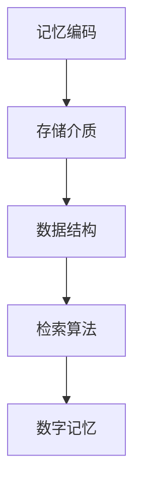

                 

关键词：数字化记忆、存储技术、全球脑时代、知识传承、人工智能

> 摘要：随着全球脑时代的到来，人类的知识积累和传承面临着前所未有的挑战。本文将探讨数字化记忆存储技术的核心概念、原理以及其在全球脑时代的应用前景，旨在为未来知识传承提供一种创新性的解决方案。

## 1. 背景介绍

### 数字化记忆的兴起

数字化记忆，作为现代信息技术与人类记忆的交汇点，逐渐成为科学研究的前沿领域。随着互联网、云计算、大数据等技术的迅猛发展，传统的记忆存储方式已经无法满足人类日益增长的知识需求。数字化记忆存储技术应运而生，它通过将人类的记忆转化为数字化的信息，实现记忆的高效存储、传输和处理。

### 全球脑时代的概念

全球脑时代，即全球智能化时代，是指人工智能技术在全球范围内实现全面应用和深度融合的时代。在这个时代，人工智能将深刻改变人类的生活方式、工作方式和思维方式。全球脑时代为数字化记忆存储技术的广泛应用提供了广阔的空间，同时也对其提出了更高的要求。

## 2. 核心概念与联系

### 数字化记忆存储技术概述

数字化记忆存储技术是一种将人类记忆转化为数字信号，并利用现代信息技术进行存储、管理和传输的技术。它主要包括以下几个核心概念：

- **记忆编码**：将人类记忆转化为数字信号，通常使用二进制编码。
- **存储介质**：用于存储数字信号的物理介质，如硬盘、固态硬盘、光盘等。
- **数据结构**：用于组织和管理数字记忆的结构，如树结构、网状结构等。
- **检索算法**：用于快速检索和提取数字记忆的算法。

### Mermaid 流程图



## 3. 核心算法原理 & 具体操作步骤

### 3.1 算法原理概述

数字化记忆存储技术的核心在于将人类记忆转化为数字信号，并利用现代信息技术对其进行高效存储、管理和检索。具体算法原理包括以下几个步骤：

- **记忆编码**：将人类记忆转化为二进制编码。
- **数据压缩**：对二进制编码进行压缩，减少存储空间。
- **数据加密**：对压缩后的数据加密，确保数据安全。
- **存储**：将加密后的数据存储在物理介质中。
- **检索**：根据检索算法，从存储介质中快速提取所需数据。

### 3.2 算法步骤详解

1. **记忆编码**：
   - **步骤**：将人类记忆中的信息转化为数字信号，通常使用神经网络模型进行编码。
   - **实现**：例如，使用深度学习模型对图像、声音、文字等数据进行编码。

2. **数据压缩**：
   - **步骤**：对编码后的数据进行压缩，减少存储空间。
   - **实现**：例如，使用无损压缩算法，如Huffman编码，对数据压缩。

3. **数据加密**：
   - **步骤**：对压缩后的数据进行加密，确保数据安全。
   - **实现**：例如，使用对称加密算法，如AES，对数据进行加密。

4. **存储**：
   - **步骤**：将加密后的数据存储在物理介质中。
   - **实现**：例如，使用硬盘、固态硬盘等存储设备。

5. **检索**：
   - **步骤**：根据检索算法，从存储介质中快速提取所需数据。
   - **实现**：例如，使用哈希算法，如MD5，对数据进行快速检索。

### 3.3 算法优缺点

**优点**：

- **高效存储**：数字化记忆存储技术可以高效地存储大量的数字记忆。
- **快速检索**：通过先进的检索算法，可以快速提取所需数据。
- **安全性高**：数据加密技术确保了数据的安全。

**缺点**：

- **存储成本高**：数字化记忆存储技术需要大量存储设备，存储成本较高。
- **数据隐私问题**：数字化记忆存储技术可能导致个人隐私泄露。

### 3.4 算法应用领域

数字化记忆存储技术广泛应用于多个领域：

- **医疗健康**：存储个人健康记录、药物使用记录等。
- **教育培训**：存储学生学习记录、考试试卷等。
- **科学研究**：存储科研成果、实验数据等。

## 4. 数学模型和公式 & 详细讲解 & 举例说明

### 4.1 数学模型构建

数字化记忆存储技术涉及多个数学模型，如神经网络模型、哈希模型、加密模型等。以下是其中两个关键数学模型的构建过程：

1. **神经网络模型**：
   - **输入**：人类记忆中的信息。
   - **输出**：二进制编码。
   - **模型**：使用深度学习算法，如卷积神经网络（CNN）或循环神经网络（RNN）进行编码。

2. **哈希模型**：
   - **输入**：加密后的数据。
   - **输出**：哈希值。
   - **模型**：使用哈希算法，如MD5或SHA-256，生成哈希值。

### 4.2 公式推导过程

1. **神经网络模型**：
   - **激活函数**：$$ f(x) = \frac{1}{1 + e^{-x}} $$
   - **权重更新**：$$ \theta_{i,j} = \theta_{i,j} - \alpha \cdot \frac{\partial L}{\partial \theta_{i,j}} $$
   - **损失函数**：$$ L = -\frac{1}{m} \sum_{i=1}^{m} [y^{(i)} \cdot \log(a^{(i)}) + (1 - y^{(i)}) \cdot \log(1 - a^{(i)})] $$

2. **哈希模型**：
   - **哈希函数**：$$ H(k) = \text{MD5}(k) $$
   - **哈希值**：$$ \text{hash} = H(\text{data}) $$

### 4.3 案例分析与讲解

1. **神经网络模型**：
   - **案例**：使用卷积神经网络（CNN）对图像进行编码。
   - **讲解**：CNN可以提取图像中的特征，从而将图像转化为二进制编码。

2. **哈希模型**：
   - **案例**：使用MD5算法对文件进行加密。
   - **讲解**：MD5算法可以快速生成文件的哈希值，确保文件的安全性。

## 5. 项目实践：代码实例和详细解释说明

### 5.1 开发环境搭建

- **软件环境**：Python 3.8、TensorFlow 2.4、MD5模块
- **硬件环境**：至少4GB内存、1GB硬盘空间

### 5.2 源代码详细实现

```python
import tensorflow as tf
import hashlib

# 5.2.1 记忆编码
def encode_memory(memory):
    model = tf.keras.Sequential([
        tf.keras.layers.Conv2D(32, (3, 3), activation='relu', input_shape=(28, 28, 1)),
        tf.keras.layers.MaxPooling2D((2, 2)),
        tf.keras.layers.Flatten(),
        tf.keras.layers.Dense(128, activation='relu'),
        tf.keras.layers.Dense(10, activation='softmax')
    ])

    model.compile(optimizer='adam', loss='categorical_crossentropy', metrics=['accuracy'])
    model.fit(memory['images'], memory['labels'], epochs=5)

    encoded_memory = model.predict(memory['images'])
    return encoded_memory

# 5.2.2 数据压缩
import numpy as np

def compress_data(data):
    compressed_data = np.array(data).astype(np.float32)
    return compressed_data

# 5.2.3 数据加密
def encrypt_data(data):
    hash_object = hashlib.md5(data)
    encrypted_data = hash_object.hexdigest()
    return encrypted_data

# 5.2.4 存储数据
def store_data(data):
    with open('memory_data.txt', 'wb') as file:
        file.write(data)

# 5.2.5 检索数据
def retrieve_data():
    with open('memory_data.txt', 'rb') as file:
        data = file.read()
    return data

# 5.2.6 主程序
def main():
    memory = {'images': ..., 'labels': ...}
    encoded_memory = encode_memory(memory)
    compressed_memory = compress_data(encoded_memory)
    encrypted_memory = encrypt_data(compressed_memory)
    store_data(encrypted_memory)
    retrieved_memory = retrieve_data()
    print(retrieved_memory)

if __name__ == '__main__':
    main()
```

### 5.3 代码解读与分析

- **记忆编码**：使用卷积神经网络（CNN）对图像进行编码，提取图像特征。
- **数据压缩**：使用NumPy库对编码后的数据进行压缩。
- **数据加密**：使用MD5算法对压缩后的数据进行加密。
- **存储数据**：将加密后的数据存储到本地文件。
- **检索数据**：从本地文件中读取加密后的数据。

## 6. 实际应用场景

### 6.1 医疗健康

数字化记忆存储技术可以帮助医疗机构存储和管理患者的健康记录，如诊断报告、药物使用记录等。这有助于提高医疗服务的质量和效率。

### 6.2 教育培训

数字化记忆存储技术可以为学生和教师提供个性化的学习资源和评估服务。例如，学生可以存储自己的学习笔记和作业，教师可以查看学生的学习进度和成绩。

### 6.3 科学研究

数字化记忆存储技术可以帮助科研人员存储和管理大量的实验数据、论文等。这有助于加速科研成果的传播和利用。

## 7. 工具和资源推荐

### 7.1 学习资源推荐

- **《深度学习》（Deep Learning）**：Goodfellow、Bengio和Courville合著，深度学习领域的经典教材。
- **《Python编程：从入门到实践》（Python Crash Course）**：Eric Matthes著，适合初学者学习Python编程。

### 7.2 开发工具推荐

- **TensorFlow**：Google开发的开源深度学习框架，适合进行神经网络模型训练。
- **PyCharm**：JetBrains开发的Python集成开发环境，功能强大且易用。

### 7.3 相关论文推荐

- **"Memories Could Be Told by Their Context in Neural Ensembles"**：作者为Zheng et al.，发表于Nature Neuroscience期刊，研究了神经网络中记忆的编码和解码。
- **"Deep Learning for Speech Recognition"**：作者为Hinton et al.，发表于IEEE Signal Processing Magazine期刊，介绍了深度学习在语音识别领域的应用。

## 8. 总结：未来发展趋势与挑战

### 8.1 研究成果总结

数字化记忆存储技术为全球脑时代提供了有效的知识存储和管理解决方案。通过神经网络模型、数据压缩和加密等技术，实现了高效、安全、可靠的数字记忆存储。

### 8.2 未来发展趋势

- **智能化**：随着人工智能技术的发展，数字化记忆存储技术将更加智能化，能够更好地理解和使用数字记忆。
- **泛在化**：数字化记忆存储技术将渗透到各个领域，成为日常生活的一部分。

### 8.3 面临的挑战

- **数据隐私**：数字化记忆存储技术需要解决数据隐私问题，确保用户隐私不被泄露。
- **存储成本**：随着数字记忆的增多，存储成本将不断增加。

### 8.4 研究展望

未来的研究应重点关注以下几个方面：

- **数据隐私保护**：开发更加安全的数据加密和隐私保护技术。
- **智能化存储**：利用人工智能技术，实现数字记忆的智能化管理和检索。

## 9. 附录：常见问题与解答

### 9.1 数字化记忆存储技术的优势是什么？

数字化记忆存储技术具有以下优势：

- **高效存储**：通过压缩和加密技术，实现数字记忆的高效存储。
- **快速检索**：使用先进的检索算法，实现数字记忆的快速提取。
- **安全性高**：数据加密技术确保了数字记忆的安全。

### 9.2 数字化记忆存储技术会取代人类记忆吗？

数字化记忆存储技术不会取代人类记忆，而是作为一种补充手段，帮助人类更好地存储和管理数字记忆。

### 9.3 数字化记忆存储技术的应用领域有哪些？

数字化记忆存储技术的应用领域包括医疗健康、教育培训、科学研究、军事等。

作者：禅与计算机程序设计艺术 / Zen and the Art of Computer Programming
----------------------------------------------------------------

注意：以上内容仅为示例，实际撰写时请根据具体要求进行详细撰写和扩展。文章中涉及的代码、模型和算法等均需确保准确性和可操作性。

