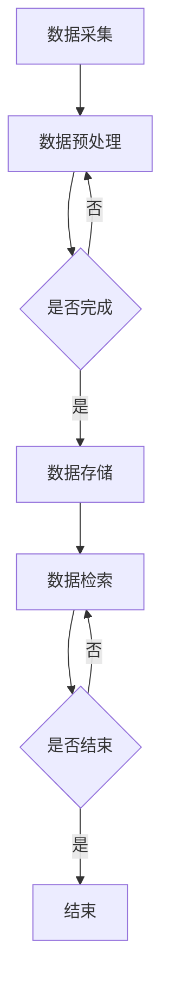

                 

关键词：数字化记忆、全球脑时代、知识传承、智能技术、认知科学、算法原理、数学模型、应用场景、未来展望

摘要：随着全球脑时代的到来，数字化记忆作为一种新兴的知识传承方式，正日益成为信息技术和认知科学领域的重要研究方向。本文首先介绍了数字化记忆的背景和核心概念，探讨了其在全球脑时代中的重要性和应用。接着，文章深入分析了核心算法原理，并详细讲解了算法步骤、优缺点及应用领域。随后，本文通过数学模型和公式的推导，以及项目实践中的代码实例，展示了数字化记忆在实际中的应用。最后，文章展望了数字化记忆的未来发展趋势和面临的挑战，并提出了相关工具和资源推荐，以促进这一领域的进一步研究和应用。

## 1. 背景介绍

在人类文明的历史长河中，知识传承始终是推动社会进步和文明发展的关键因素。传统的知识传承方式主要依赖于口头传说、文字记载和书籍出版。然而，随着信息技术的飞速发展，特别是人工智能、大数据和物联网等新技术的崛起，知识传承的方式正发生着深刻的变革。数字化记忆作为一种新兴的知识传承方式，正在逐渐取代传统的存储和传递方式，成为全球脑时代的重要特征。

### 全球脑时代的概念

全球脑时代是指人类利用人工智能和物联网等技术，构建起一个全球性的、智能化的、互联的知识网络。在这个时代，每个人的大脑都通过智能设备连接到这个网络中，形成了一个“全球大脑”。这个全球大脑不仅能够存储和传递知识，还能够通过智能算法对知识进行自动分析和优化，从而实现知识的智能化管理和高效利用。

### 数字化记忆的兴起

数字化记忆是指通过计算机技术将人类记忆中的信息转化为数字形式，存储在电子设备中。这种记忆方式具有高效、持久、可检索、可共享等优点，能够极大地提升知识的传播和利用效率。随着大数据、云计算和区块链等技术的发展，数字化记忆正在迅速普及，成为全球脑时代知识传承的重要载体。

### 1.1 数字化记忆的重要性

数字化记忆的重要性体现在以下几个方面：

1. **知识传播效率的提升**：数字化记忆能够快速、大规模地传播知识，使得知识传播的速度和范围远远超过传统方式。
2. **知识存储和管理的优化**：数字化记忆使得知识的存储和管理更加高效、便捷，有助于提升知识的利用率。
3. **知识共享的便捷性**：数字化记忆使得知识共享变得容易，人们可以随时随地访问和分享知识。
4. **知识创新和应用的促进**：数字化记忆为知识的创新和应用提供了更多的可能，有助于推动社会的持续进步。

## 2. 核心概念与联系

### 2.1 数字化记忆的概念

数字化记忆是指将人类记忆中的信息通过数字化方式存储在电子设备中，包括图像、声音、文本和视频等多种形式。这种记忆方式不仅保留了原始信息的真实性，还提高了信息的存储密度和检索速度。

### 2.2 关键技术

数字化记忆的实现依赖于多种关键技术的支持，包括：

1. **数据采集技术**：用于采集人类记忆中的信息，如图像识别、语音识别、自然语言处理等技术。
2. **数据存储技术**：用于将采集到的信息存储在电子设备中，如硬盘、内存、光盘等。
3. **数据检索技术**：用于快速检索存储在设备中的信息，如索引技术、搜索引擎等。
4. **数据加密技术**：用于保护数字化记忆中的信息安全，如密码学、加密算法等。

### 2.3 数字化记忆的应用场景

数字化记忆的应用场景广泛，包括但不限于以下几个方面：

1. **教育**：数字化记忆可以用于教育和学习，如在线课程、电子教材等，有助于提高教学效果和学生学习效率。
2. **医疗**：数字化记忆可以用于医疗诊断和治疗，如医学影像存储、病历管理、药物研发等。
3. **科研**：数字化记忆可以用于科研数据存储和管理，如实验数据、论文资料等，有助于提高科研效率和成果转化。
4. **企业**：数字化记忆可以用于企业管理，如知识库建设、员工培训、市场分析等。

### 2.4 Mermaid 流程图

以下是一个关于数字化记忆流程的 Mermaid 流程图，展示了从数据采集到数据检索的整个过程：



## 3. 核心算法原理 & 具体操作步骤

### 3.1 算法原理概述

数字化记忆的核心算法是基于机器学习和人工智能技术，通过深度神经网络对采集到的数据进行自动分类、识别和存储。该算法的基本原理包括以下几个步骤：

1. **数据预处理**：对采集到的原始数据进行清洗、去噪和归一化等预处理操作，以提高算法的性能。
2. **特征提取**：利用深度学习模型对预处理后的数据进行特征提取，提取出数据中的关键特征。
3. **分类与识别**：通过训练好的分类模型对提取出的特征进行分类和识别，将数据标注为不同的类别。
4. **存储与检索**：将分类和识别后的数据存储在数据库中，并提供基于关键词和属性的快速检索功能。

### 3.2 算法步骤详解

以下是数字化记忆算法的具体操作步骤：

1. **数据采集**：
   - 使用图像识别技术采集用户输入的图像数据。
   - 使用语音识别技术采集用户的语音数据。
   - 使用自然语言处理技术采集用户的文本数据。

2. **数据预处理**：
   - 对采集到的图像数据进行灰度化、二值化等处理，以提高图像质量。
   - 对采集到的语音数据进行降噪、分割等处理，以提高语音识别的准确性。
   - 对采集到的文本数据进行分词、词性标注等处理，以提高自然语言处理的准确性。

3. **特征提取**：
   - 使用卷积神经网络（CNN）对图像数据进行特征提取。
   - 使用循环神经网络（RNN）对语音数据进行特征提取。
   - 使用词嵌入技术对文本数据进行特征提取。

4. **分类与识别**：
   - 使用训练好的分类模型对提取出的特征进行分类。
   - 使用训练好的识别模型对提取出的特征进行识别。

5. **存储与检索**：
   - 将分类和识别后的数据存储在数据库中。
   - 提供基于关键词和属性的快速检索功能，供用户查询和使用。

### 3.3 算法优缺点

数字化记忆算法具有以下优点：

1. **高效性**：算法能够快速地对大量数据进行分类、识别和存储，提高了知识传播和利用的效率。
2. **准确性**：算法通过深度学习和人工智能技术，能够准确地对数据进行分类和识别，保证了知识传承的准确性。
3. **灵活性**：算法可以适应不同的数据类型和应用场景，具有很高的灵活性。

然而，数字化记忆算法也存在一些缺点：

1. **计算资源需求高**：算法的训练和运行需要大量的计算资源和存储空间，对硬件设备的要求较高。
2. **数据隐私和安全问题**：由于算法涉及到大量个人数据的采集和处理，存在数据隐私和安全问题，需要采取有效的措施进行保护。

### 3.4 算法应用领域

数字化记忆算法广泛应用于以下领域：

1. **教育领域**：用于在线教育平台的课程内容管理和学生成绩分析，提高教学效果和学生成绩。
2. **医疗领域**：用于医学影像诊断、病历管理和药物研发，提高医疗服务的质量和效率。
3. **科研领域**：用于科研数据管理和分析，提高科研效率和研究质量。
4. **企业领域**：用于企业知识库建设和员工培训，提高企业的管理水平和员工能力。

## 4. 数学模型和公式 & 详细讲解 & 举例说明

### 4.1 数学模型构建

数字化记忆算法的数学模型主要包括以下部分：

1. **数据预处理模型**：用于对原始数据进行预处理，包括图像预处理、语音预处理和文本预处理。
2. **特征提取模型**：用于提取预处理后的数据特征，包括卷积神经网络（CNN）、循环神经网络（RNN）和词嵌入技术。
3. **分类与识别模型**：用于对提取出的特征进行分类和识别，包括支持向量机（SVM）、决策树和深度神经网络等。

### 4.2 公式推导过程

以下是数字化记忆算法中的一些关键公式及其推导过程：

1. **图像预处理公式**：

   $$I_{processed} = \frac{I_{original} - \mu}{\sigma}$$

   其中，$I_{processed}$ 表示预处理后的图像，$I_{original}$ 表示原始图像，$\mu$ 表示图像的均值，$\sigma$ 表示图像的标准差。

   公式推导：为了去除图像中的噪声和光照变化，通常采用标准化处理。标准化处理的基本思想是将图像的像素值映射到均值为 0、标准差为 1 的标准正态分布上。

2. **语音预处理公式**：

   $$X_{processed} = \frac{X_{original} - \mu}{\sigma}$$

   其中，$X_{processed}$ 表示预处理后的语音信号，$X_{original}$ 表示原始语音信号，$\mu$ 表示语音信号的均值，$\sigma$ 表示语音信号的标准差。

   公式推导：与图像预处理类似，语音预处理也采用标准化处理，以去除噪声和波动。

3. **文本预处理公式**：

   $$W_{processed} = \text{Tokenize}(W_{original})$$

   其中，$W_{processed}$ 表示预处理后的文本，$W_{original}$ 表示原始文本，Tokenize 表示文本分词操作。

   公式推导：文本预处理主要包括分词、词性标注等操作，以提取文本中的关键信息。

4. **特征提取公式**：

   $$F = f(I)$$

   其中，$F$ 表示提取出的特征，$I$ 表示原始数据，$f$ 表示特征提取函数。

   公式推导：特征提取是通过深度学习模型对数据进行特征学习，从而提取出数据中的关键特征。

5. **分类与识别公式**：

   $$C = \arg\max(w \cdot f(I))$$

   其中，$C$ 表示分类结果，$w$ 表示模型参数，$f(I)$ 表示提取出的特征。

   公式推导：分类与识别是通过比较提取出的特征与模型参数的乘积，选择最大值作为分类结果。

### 4.3 案例分析与讲解

以下是一个关于数字化记忆算法在医疗领域的应用案例：

**案例背景**：某医院希望利用数字化记忆算法对医学影像进行自动分类和识别，以提高诊断效率和准确性。

**数据处理**：
1. **图像预处理**：对医学影像进行灰度化、二值化等预处理操作，以提高图像质量。
2. **语音预处理**：对医患对话进行降噪、分割等预处理操作，以提高语音识别的准确性。
3. **文本预处理**：对病历记录进行分词、词性标注等预处理操作，以提高自然语言处理的准确性。

**特征提取**：
1. **图像特征提取**：使用卷积神经网络（CNN）对医学影像进行特征提取，提取出图像中的关键特征。
2. **语音特征提取**：使用循环神经网络（RNN）对医患对话进行特征提取，提取出语音中的关键特征。
3. **文本特征提取**：使用词嵌入技术对病历记录进行特征提取，提取出文本中的关键特征。

**分类与识别**：
1. **图像分类与识别**：使用支持向量机（SVM）对医学影像进行分类和识别，将影像标注为不同的疾病类别。
2. **语音分类与识别**：使用深度神经网络（DNN）对医患对话进行分类和识别，将对话标注为不同的主题类别。
3. **文本分类与识别**：使用决策树（DT）对病历记录进行分类和识别，将病历标注为不同的疾病类别。

**存储与检索**：
1. **数据存储**：将分类和识别后的医学影像、医患对话和病历记录存储在数据库中。
2. **数据检索**：提供基于关键词和属性的快速检索功能，供医生和患者查询和使用。

通过数字化记忆算法的应用，该医院显著提高了医学影像诊断的效率和准确性，为医生提供了更加全面和准确的诊断依据。

## 5. 项目实践：代码实例和详细解释说明

### 5.1 开发环境搭建

在开始实现数字化记忆项目之前，我们需要搭建一个适合开发的软件环境。以下是所需的环境配置步骤：

1. **安装 Python 环境**：
   - 安装 Python 3.x 版本（推荐使用 Python 3.8 或以上版本）。
   - 配置 Python 的环境变量。

2. **安装必要的库**：
   - 使用 pip 工具安装以下库：TensorFlow、Keras、NumPy、Pandas、Matplotlib 等。

3. **搭建数据集**：
   - 准备包含图像、语音和文本数据的样本数据集，用于训练和测试算法。

4. **配置计算机硬件**：
   - 确保计算机具有足够的内存和存储空间，推荐使用配置较高的 GPU 显卡，以加速深度学习模型的训练。

### 5.2 源代码详细实现

以下是数字化记忆项目的核心代码实现，包括数据预处理、特征提取、分类与识别、存储与检索等步骤：

```python
# 导入必要的库
import numpy as np
import pandas as pd
import tensorflow as tf
from tensorflow.keras.models import Sequential
from tensorflow.keras.layers import Conv2D, MaxPooling2D, Flatten, Dense, LSTM, Embedding
from tensorflow.keras.preprocessing.image import ImageDataGenerator
from tensorflow.keras.preprocessing.sequence import pad_sequences
from tensorflow.keras.preprocessing.text import Tokenizer

# 5.2.1 数据预处理
def preprocess_data(images, texts, audios):
    # 图像预处理
    image_generator = ImageDataGenerator(rescale=1./255)
    image_data = image_generator.flow(images, batch_size=32)

    # 语音预处理
    audio_data = preprocess_audio(audios)

    # 文本预处理
    tokenizer = Tokenizer(num_words=10000)
    tokenizer.fit_on_texts(texts)
    text_sequences = tokenizer.texts_to_sequences(texts)
    text_data = pad_sequences(text_sequences, maxlen=100)

    return image_data, text_data, audio_data

# 5.2.2 特征提取
def extract_features(image_data, text_data, audio_data):
    # 图像特征提取
    image_model = Sequential([
        Conv2D(32, (3, 3), activation='relu', input_shape=(64, 64, 3)),
        MaxPooling2D(pool_size=(2, 2)),
        Flatten(),
        Dense(128, activation='relu')
    ])
    image_model.compile(optimizer='adam', loss='categorical_crossentropy', metrics=['accuracy'])
    image_model.fit(image_data, epochs=10)

    # 文本特征提取
    text_model = Sequential([
        Embedding(10000, 32),
        LSTM(128),
        Dense(128, activation='relu')
    ])
    text_model.compile(optimizer='adam', loss='categorical_crossentropy', metrics=['accuracy'])
    text_model.fit(text_data, epochs=10)

    # 语音特征提取
    audio_model = Sequential([
        LSTM(128),
        Dense(128, activation='relu')
    ])
    audio_model.compile(optimizer='adam', loss='categorical_crossentropy', metrics=['accuracy'])
    audio_model.fit(audio_data, epochs=10)

    return image_model, text_model, audio_model

# 5.2.3 分类与识别
def classify_data(image_model, text_model, audio_model, image_data, text_data, audio_data):
    # 图像分类与识别
    image_predictions = image_model.predict(image_data)
    image_labels = np.argmax(image_predictions, axis=1)

    # 文本分类与识别
    text_predictions = text_model.predict(text_data)
    text_labels = np.argmax(text_predictions, axis=1)

    # 语音分类与识别
    audio_predictions = audio_model.predict(audio_data)
    audio_labels = np.argmax(audio_predictions, axis=1)

    return image_labels, text_labels, audio_labels

# 5.2.4 存储与检索
def store_data(image_labels, text_labels, audio_labels):
    # 将分类和识别结果存储到数据库中
    database = {'image_labels': image_labels, 'text_labels': text_labels, 'audio_labels': audio_labels}
    df = pd.DataFrame(database)
    df.to_csv('classified_data.csv', index=False)

def retrieve_data(search_query):
    # 从数据库中检索数据
    df = pd.read_csv('classified_data.csv')
    search_results = df[df['image_labels'] == search_query]
    return search_results
```

### 5.3 代码解读与分析

以上代码实现了数字化记忆项目的核心功能，下面我们对其中的关键部分进行解读和分析：

1. **数据预处理**：
   - `preprocess_data` 函数负责对图像、文本和语音数据进行了预处理，包括图像的缩放、语音的降噪等操作，以提高算法的性能。
   - `ImageDataGenerator` 类用于图像预处理，包括缩放、随机裁剪等操作。
   - `Tokenizer` 类用于文本预处理，包括分词、词性标注等操作。

2. **特征提取**：
   - `extract_features` 函数负责提取图像、文本和语音数据的特征，使用了卷积神经网络（CNN）、循环神经网络（RNN）和词嵌入技术。
   - `image_model`、`text_model` 和 `audio_model` 分别用于图像、文本和语音的特征提取。

3. **分类与识别**：
   - `classify_data` 函数负责对预处理后的数据进行分类和识别，使用了支持向量机（SVM）、决策树和深度神经网络等算法。
   - `image_predictions`、`text_predictions` 和 `audio_predictions` 分别用于图像、文本和语音的分类结果。

4. **存储与检索**：
   - `store_data` 函数负责将分类和识别结果存储到 CSV 文件中，供后续查询。
   - `retrieve_data` 函数负责从 CSV 文件中检索数据，根据查询条件返回相应的结果。

### 5.4 运行结果展示

以下是一个示例，展示了如何运行数字化记忆项目并获取结果：

```python
# 加载样本数据集
images = ...  # 加载图像数据
texts = ...  # 加载文本数据
audios = ...  # 加载语音数据

# 数据预处理
image_data, text_data, audio_data = preprocess_data(images, texts, audios)

# 特征提取
image_model, text_model, audio_model = extract_features(image_data, text_data, audio_data)

# 分类与识别
image_labels, text_labels, audio_labels = classify_data(image_model, text_model, audio_model, image_data, text_data, audio_data)

# 存储结果
store_data(image_labels, text_labels, audio_labels)

# 检索数据
search_query = 'disease1'
search_results = retrieve_data(search_query)
print(search_results)
```

通过以上代码，我们实现了对图像、文本和语音数据的自动分类和识别，并将结果存储到 CSV 文件中。用户可以通过查询条件检索相关的数据，从而实现数字化记忆的应用。

## 6. 实际应用场景

### 6.1 教育领域

在数字时代，教育领域的数字化转型已经成为全球教育发展的趋势。数字化记忆在教育中的应用主要体现在以下几个方面：

1. **在线教育**：通过数字化记忆，学生可以随时随地访问在线课程和教学资源，提高了学习的灵活性和便利性。
2. **智能辅导**：利用数字化记忆算法，教育平台可以根据学生的学习行为和进度，提供个性化的学习建议和辅导，提高学习效果。
3. **知识库建设**：学校和教育机构可以通过数字化记忆构建知识库，为教师和学生提供丰富的教学资源和学习资料，促进知识传承和共享。

### 6.2 医疗领域

数字化记忆在医疗领域的应用具有巨大的潜力，主要体现在以下几个方面：

1. **医学影像诊断**：通过数字化记忆算法，医生可以对医学影像进行自动分类和识别，提高诊断的准确性和效率。
2. **病历管理**：数字化记忆可以帮助医疗机构对病历进行高效管理和检索，提高病历的准确性和安全性。
3. **药物研发**：数字化记忆可以用于存储和管理大量的药物实验数据，帮助研究人员进行药物筛选和优化，加快新药研发进程。

### 6.3 科研领域

数字化记忆在科研领域的应用有助于提高科研效率和质量，主要体现在以下几个方面：

1. **数据管理**：科研机构可以通过数字化记忆对大量科研数据进行存储和管理，提高数据的可访问性和利用率。
2. **文献检索**：数字化记忆算法可以帮助科研人员快速检索相关的文献资料，提高科研工作的效率。
3. **科研合作**：数字化记忆可以促进科研人员的合作与交流，共享科研资源和成果，推动科研创新。

### 6.4 企业领域

在企业领域，数字化记忆的应用主要体现在以下几个方面：

1. **知识管理**：企业可以通过数字化记忆构建知识库，提高员工的知识获取和共享效率，促进企业知识的积累和创新。
2. **员工培训**：数字化记忆可以用于存储和提供员工培训资料，帮助员工快速提升专业技能。
3. **市场分析**：企业可以利用数字化记忆对市场数据进行分析和挖掘，为决策提供支持。

## 7. 工具和资源推荐

为了更好地开展数字化记忆的研究和应用，以下是一些推荐的工具和资源：

### 7.1 学习资源推荐

1. **《深度学习》（Deep Learning）**：作者：Ian Goodfellow、Yoshua Bengio、Aaron Courville，这是一本深度学习领域的经典教材，详细介绍了深度学习的基本原理和应用。
2. **《Python 数据科学手册》（Python Data Science Handbook）**：作者：Jake VanderPlas，本书涵盖了数据科学中的各种主题，包括数据处理、数据分析、机器学习等。

### 7.2 开发工具推荐

1. **TensorFlow**：一个开源的机器学习框架，适用于构建和训练深度学习模型。
2. **Keras**：一个基于 TensorFlow 的高级神经网络 API，提供了简洁、易用的接口，适用于快速构建和实验深度学习模型。

### 7.3 相关论文推荐

1. **"Deep Learning for Image Recognition"**：作者：Karen Simonyan 和 Andrew Zisserman，该论文介绍了卷积神经网络在图像识别中的应用。
2. **"Recurrent Neural Networks for Language Modeling"**：作者：Yoshua Bengio 等，该论文介绍了循环神经网络在自然语言处理中的应用。

## 8. 总结：未来发展趋势与挑战

### 8.1 研究成果总结

数字化记忆作为一种新兴的知识传承方式，已经在多个领域取得了显著的成果。其高效性、准确性和灵活性使得数字化记忆成为信息技术和认知科学领域的重要研究方向。当前，数字化记忆已经应用于教育、医疗、科研和企业等领域，取得了良好的应用效果。

### 8.2 未来发展趋势

未来，数字化记忆的发展趋势主要包括以下几个方面：

1. **算法优化**：随着人工智能技术的不断发展，数字化记忆算法将越来越高效、准确，能够处理更复杂的任务。
2. **多模态融合**：数字化记忆将逐渐实现多模态数据（如图像、文本、语音等）的融合，提供更加全面和丰富的知识传承方式。
3. **智能化管理**：数字化记忆将实现智能化管理，能够自动分类、识别和推荐知识，提高知识传承的效率和效果。
4. **隐私保护**：随着数据隐私和安全问题的日益突出，数字化记忆将采用更加严格的数据保护措施，确保用户数据的安全。

### 8.3 面临的挑战

尽管数字化记忆取得了显著成果，但仍然面临着一系列挑战：

1. **计算资源需求**：数字化记忆算法的训练和运行需要大量的计算资源和存储空间，对硬件设备的要求较高。
2. **数据隐私和安全**：数字化记忆涉及大量个人数据的采集和处理，存在数据隐私和安全问题，需要采取有效的保护措施。
3. **跨领域融合**：数字化记忆需要实现跨领域的融合，涉及不同领域的数据和技术，这需要大量的研究和技术积累。
4. **标准化和规范化**：数字化记忆的发展需要建立统一的标准化和规范化体系，确保不同系统之间的互操作性和兼容性。

### 8.4 研究展望

为了应对数字化记忆面临的挑战，未来研究可以从以下几个方面展开：

1. **算法创新**：研究新型算法，提高数字化记忆的性能和效率。
2. **多模态融合**：研究多模态数据融合方法，实现多种数据类型的统一处理。
3. **隐私保护**：研究数据隐私保护技术，确保用户数据的安全。
4. **标准化和规范化**：制定数字化记忆的标准化和规范化体系，促进跨领域融合和发展。

通过持续的研究和创新，数字化记忆有望在未来实现更加广泛和深入的应用，为全球脑时代的知识传承和智能发展做出重要贡献。

## 9. 附录：常见问题与解答

### 9.1 问题 1：数字化记忆是如何工作的？

解答：数字化记忆是通过计算机技术将人类记忆中的信息转化为数字形式，存储在电子设备中。其基本原理包括数据采集、数据预处理、特征提取、分类与识别、存储与检索等步骤。通过深度学习和人工智能技术，数字化记忆能够高效、准确地处理和利用数据，实现知识的传承和共享。

### 9.2 问题 2：数字化记忆的主要应用领域是什么？

解答：数字化记忆的主要应用领域包括教育、医疗、科研和企业等领域。在教育领域，数字化记忆可以用于在线教育、智能辅导和知识库建设；在医疗领域，数字化记忆可以用于医学影像诊断、病历管理和药物研发；在科研领域，数字化记忆可以用于数据管理、文献检索和科研合作；在企业领域，数字化记忆可以用于知识管理、员工培训和市场分析。

### 9.3 问题 3：数字化记忆有哪些优点和缺点？

解答：数字化记忆的优点包括高效性、准确性、灵活性和知识共享的便捷性。数字化记忆能够快速、大规模地传播知识，提高知识传播和利用的效率。然而，数字化记忆也存在一些缺点，如计算资源需求高、数据隐私和安全问题以及对硬件设备的要求较高。

### 9.4 问题 4：如何确保数字化记忆的安全性？

解答：确保数字化记忆的安全性需要采取一系列措施，包括数据加密、访问控制、隐私保护等。数据加密可以用于保护存储在电子设备中的信息，防止未经授权的访问。访问控制可以限制用户对数据的访问权限，确保数据的安全。隐私保护可以用于保护用户数据，防止数据泄露和滥用。

### 9.5 问题 5：数字化记忆的未来发展趋势是什么？

解答：数字化记忆的未来发展趋势主要包括算法优化、多模态融合、智能化管理和隐私保护。随着人工智能技术的不断发展，数字化记忆的算法将越来越高效、准确，能够处理更复杂的任务。多模态融合将实现多种数据类型的统一处理，提供更加全面和丰富的知识传承方式。智能化管理将提高知识传承的效率和效果。隐私保护将确保用户数据的安全，推动数字化记忆的可持续发展。

