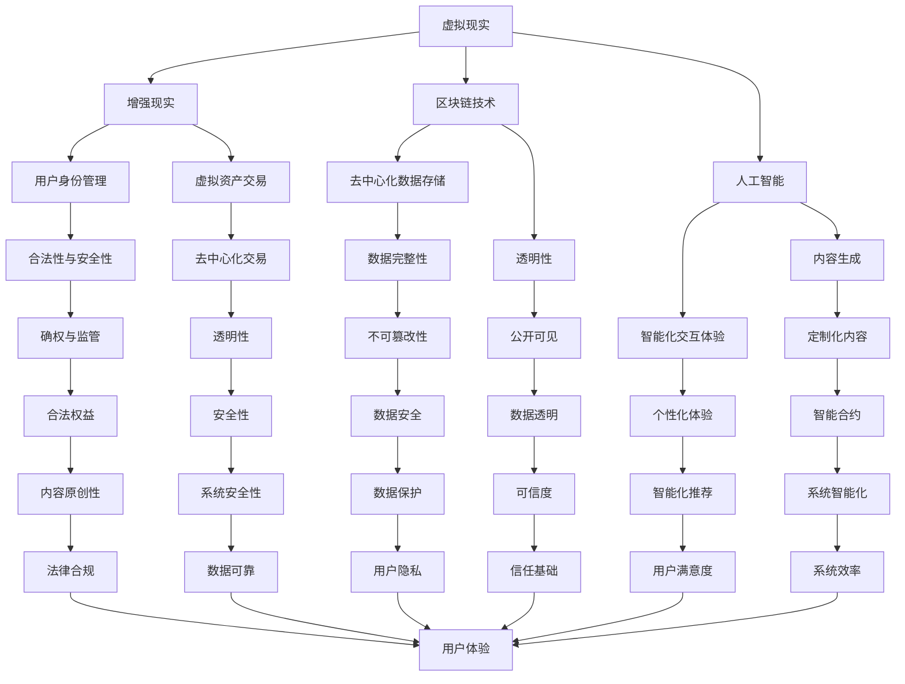

                 

在当今这个数字化时代，我们正目睹着人类社会和技术的融合达到前所未有的深度。随着虚拟现实（VR）、增强现实（AR）、区块链和人工智能（AI）等技术的迅猛发展，一个全新的数字世界——元宇宙正在逐步成形。在这个虚拟的宇宙中，个体的生命和意识不仅可以通过数字化的方式延续，还能以全新的形态存在。本文将探讨“数字化遗产”这一概念，特别是在元宇宙中的生命延续，以及这一领域所带来的深远影响。

> **关键词：** 数字化遗产、元宇宙、生命延续、虚拟现实、增强现实、区块链、人工智能

> **摘要：** 本文将探讨在元宇宙中实现生命延续的愿景，以及这一愿景背后的技术原理和实践。我们将分析虚拟现实、增强现实、区块链和人工智能等技术在数字化遗产中的应用，探讨其面临的挑战和未来发展的可能性。

## 1. 背景介绍

随着计算机技术的发展，虚拟现实（VR）和增强现实（AR）已经从科幻小说中走进了现实生活。VR技术通过创造一个完全沉浸式的虚拟环境，使用户能够感受到如同真实世界般的体验。而AR技术则通过在现实环境中叠加虚拟元素，增强了用户的感知和交互体验。这两项技术为创建一个全新的数字世界——元宇宙提供了基础。

元宇宙是一个由虚拟现实和增强现实构成的集合，它不仅仅是一个单一的虚拟环境，而是一个包含了社交、经济、文化和娱乐等多个层面的复杂生态系统。在这个系统中，用户可以创建自己的数字身份，与其他用户互动，进行各种活动。元宇宙的实现依赖于多种技术的协同工作，其中最为重要的是区块链技术和人工智能。

区块链技术提供了去中心化的数据存储和验证机制，确保了元宇宙中的所有交易和数据都是透明和安全的。同时，人工智能则负责提供智能化的交互体验，使得元宇宙中的虚拟世界能够更加真实和丰富。通过结合VR、AR、区块链和人工智能，我们有可能创造出一个真正意义上的数字化遗产，使得个体的生命和意识能够在元宇宙中得以延续。

### 1.1 虚拟现实与增强现实的发展

虚拟现实（VR）技术通过头戴式显示器、传感器和追踪技术，为用户创造了一个完全沉浸式的虚拟环境。用户可以在其中进行各种活动，如探索虚拟世界、参与虚拟会议和体验虚拟游戏等。随着VR硬件和软件技术的不断进步，VR体验的沉浸感和真实感得到了显著提升。

增强现实（AR）技术则通过将虚拟元素叠加到现实环境中，为用户提供了更加丰富和互动的体验。AR技术广泛应用于教育、医疗、设计、娱乐和零售等领域。例如，在零售行业中，AR技术可以帮助用户在家中试穿衣物，提高购物的便利性和满意度。

VR和AR技术的发展为元宇宙的构建提供了关键的技术支持。通过这些技术，用户可以进入一个由数字和虚拟构成的丰富世界，进行各种活动，实现自我表达和社交互动。

### 1.2 区块链技术的应用

区块链技术是一种去中心化的分布式数据库技术，通过加密算法确保数据的不可篡改性和透明性。在元宇宙中，区块链技术被广泛应用于身份认证、数字资产交易、虚拟地产、版权保护和数字货币等领域。

首先，区块链技术可以提供用户身份的验证和认证，确保元宇宙中的每个用户都是真实的，并且能够安全地进行交互。其次，区块链技术可以支持数字资产的交易，如虚拟商品、虚拟地产和虚拟货币等，为元宇宙中的经济活动提供基础设施。此外，区块链技术还可以用于版权保护，确保虚拟内容的原创性和合法权益。

### 1.3 人工智能的融合

人工智能（AI）技术在元宇宙中的应用主要集中在提供智能化的交互体验和内容生成。通过机器学习、自然语言处理和计算机视觉等技术，AI可以帮助元宇宙中的虚拟环境更加真实和丰富。

在交互体验方面，AI可以识别用户的语音、手势和情感，并根据用户的反馈提供个性化的交互体验。例如，当用户进入一个虚拟会议时，AI可以自动识别每个参会者的身份，调整屏幕布局，确保每个用户都能获得最佳的观看体验。

在内容生成方面，AI可以通过生成对抗网络（GAN）和自然语言生成等技术，创造新的虚拟环境和虚拟内容。例如，AI可以根据用户的需求和喜好，生成独特的虚拟场景和角色，为用户带来全新的体验。

### 1.4 元宇宙的基本概念和架构

元宇宙（Metaverse）是一个由虚拟现实、增强现实和区块链等技术构成的虚拟世界，它不仅仅是一个单一的虚拟环境，而是一个包含了社交、经济、文化和娱乐等多个层面的复杂生态系统。在元宇宙中，用户可以通过数字化的方式创建自己的身份，与其他用户互动，进行各种活动。

元宇宙的基本架构可以分为三个层次：基础设施、核心平台和应用场景。基础设施包括云计算、网络和存储等技术，为元宇宙提供计算和存储资源。核心平台包括虚拟现实和增强现实技术，以及区块链和人工智能等技术，为元宇宙提供交互和智能化的基础。应用场景包括社交、娱乐、教育、医疗和零售等多个领域，为用户提供了丰富的使用场景。

通过以上技术手段的融合，元宇宙有望成为一个真正意义上的数字化遗产，使得个体的生命和意识能够在虚拟世界中得以延续。这不仅为人类提供了全新的生活方式，也为科技发展带来了新的机遇和挑战。

### 1.5 元宇宙中的生命延续的愿景

在元宇宙中，生命延续的愿景不仅仅是对个体意识的数字化复制，更是对人类精神和文化传承的全新方式。通过虚拟现实和增强现实技术，用户可以在一个高度沉浸式的环境中体验和表达自我。而区块链技术则为这些体验提供了安全保障和可信度，确保每个人的数字身份和行为都是可追溯和不可篡改的。

在元宇宙中，个体可以创建多个版本的自我，每个版本都代表着其在不同时间和情境下的经历和成长。这些虚拟自我不仅可以在元宇宙中互动，还能通过区块链技术实现跨平台的共享和连接。这意味着，无论是在虚拟世界还是在现实世界，个体都可以以多种形式存在，并且这些形式可以相互影响和传递。

此外，元宇宙中的生命延续还意味着文化、知识和经验的数字化传承。用户可以在元宇宙中创建虚拟博物馆、虚拟图书馆和虚拟课堂，将人类的历史、文化和技术知识以数字形式永久保存。这不仅为后人提供了丰富的学习资源，也为文化的传承和创新提供了新的可能性。

总之，元宇宙中的生命延续不仅仅是对个体存在的延续，更是对人类文明和文化的延续。通过虚拟现实、增强现实、区块链和人工智能等技术的结合，我们有可能创造出一个全新的数字世界，使得人类在虚拟和现实之间实现无缝过渡，从而实现真正的生命延续。

## 2. 核心概念与联系

### 2.1. 虚拟现实（VR）与增强现实（AR）的基础概念

虚拟现实（VR）是一种通过计算机技术创造的全沉浸式虚拟环境，用户通过头戴式显示器、传感器和追踪设备等设备进入虚拟环境，从而获得与真实世界相似的感知体验。VR的核心技术包括图像处理、传感器技术、头戴式显示器和人机交互等。

增强现实（AR）则是将虚拟元素叠加到现实世界中，用户通过智能手机、平板电脑或头戴式显示器等设备观看现实世界，同时通过增强的图像、声音和触觉等感官反馈获得增强的体验。AR的关键技术包括图像识别、投影技术、光学设计和人机交互等。

### 2.2. 区块链技术的核心概念

区块链技术是一种分布式数据库技术，通过加密算法确保数据的不可篡改性和透明性。区块链的基本架构包括数据区块、分布式节点和共识算法等。每个数据区块都包含一定数量的交易记录，这些区块通过密码学方式链接在一起，形成一条时间顺序不可篡改的链。

区块链技术具有去中心化、透明性和安全性等特性，这些特性使其在元宇宙中具有广泛的应用前景。去中心化意味着区块链上的数据不依赖于任何单一的实体，分布式节点共同维护数据的完整性和安全性。透明性则保证了区块链上的所有交易记录都是公开可见的，用户可以随时查询和验证。安全性则通过加密算法和共识算法确保数据不被篡改和攻击。

### 2.3. 人工智能（AI）在元宇宙中的角色

人工智能（AI）技术在元宇宙中扮演着关键角色，为用户提供智能化的交互体验和内容生成。通过机器学习、自然语言处理和计算机视觉等技术，AI可以识别用户的语音、手势和情感，提供个性化的交互体验。

在内容生成方面，AI可以通过生成对抗网络（GAN）和自然语言生成等技术创造新的虚拟环境和虚拟内容。例如，AI可以根据用户的需求和喜好生成独特的虚拟场景和角色，为用户提供定制化的体验。此外，AI还可以在元宇宙中进行智能推荐、虚拟助理和智能合约等应用，提升系统的智能化水平和用户体验。

### 2.4. 元宇宙中的核心架构和功能模块

元宇宙的核心架构包括基础设施、核心平台和应用场景。基础设施包括云计算、网络和存储等技术，为元宇宙提供计算和存储资源。核心平台包括虚拟现实和增强现实技术，以及区块链和人工智能等技术，为元宇宙提供交互和智能化的基础。应用场景包括社交、娱乐、教育、医疗和零售等多个领域，为用户提供了丰富的使用场景。

在元宇宙中，核心功能模块包括用户身份管理、虚拟资产交易、虚拟地产、版权保护和虚拟货币等。用户身份管理通过区块链技术确保用户身份的合法性和安全性。虚拟资产交易通过区块链技术实现去中心化的交易和确权。虚拟地产为用户提供了在元宇宙中的虚拟住所和办公场所。版权保护则通过区块链技术确保虚拟内容的原创性和合法权益。虚拟货币为元宇宙中的经济活动提供了货币支持。

### 2.5. 核心概念和技术的联系

虚拟现实、增强现实、区块链和人工智能等技术相互交织，共同构建了元宇宙的基础架构和功能模块。虚拟现实和增强现实技术为用户提供沉浸式和增强式的体验，是元宇宙的入口和交互界面。区块链技术提供了去中心化的数据存储和验证机制，确保了元宇宙中的交易和数据的安全性和透明性。人工智能技术则为元宇宙提供了智能化的交互体验和内容生成，提升了用户体验和系统的智能化水平。

通过这些核心概念和技术的融合，元宇宙不仅为用户提供了一个全新的虚拟世界，也为数字化遗产的实现提供了技术基础。用户可以在元宇宙中创建自己的虚拟身份，进行各种活动，并且这些活动和行为可以通过区块链技术得到记录和确权，实现数字化遗产的延续。

### 2.6. Mermaid 流程图

以下是元宇宙架构的核心概念和技术的 Mermaid 流程图：



该流程图展示了虚拟现实、增强现实、区块链和人工智能在元宇宙架构中的相互关系，以及它们如何共同构建一个功能丰富、安全可信的数字世界。

### 2.7. 核心算法原理 & 具体操作步骤

在元宇宙的构建过程中，核心算法原理和技术实现步骤至关重要。以下是元宇宙中涉及的关键算法和操作步骤：

#### 3.1. 虚拟现实（VR）渲染算法

**算法原理：** 虚拟现实渲染算法的核心在于实时生成高质量的3D图像。该算法通常包括三维模型渲染、光效处理和动画生成等步骤。

**具体操作步骤：**
1. **三维模型加载：** 从数据库中加载用户或场景的三维模型。
2. **纹理映射：** 将纹理图像映射到三维模型上，使其更具真实感。
3. **光效处理：** 使用光线追踪或光线反射算法模拟真实世界的光效。
4. **图像渲染：** 将处理后的图像发送到头戴式显示器（HMD）显示。

**优缺点：**
- **优点：** 提供沉浸式体验，视觉感受逼真。
- **缺点：** 计算资源消耗大，对硬件要求高。

#### 3.2. 增强现实（AR）图像识别算法

**算法原理：** AR图像识别算法通过计算机视觉技术识别和标记现实世界中的物体，并将虚拟元素叠加到这些物体上。

**具体操作步骤：**
1. **图像预处理：** 对捕获的图像进行灰度化、滤波等预处理。
2. **特征提取：** 使用SIFT、HOG等算法提取图像特征。
3. **物体识别：** 使用卷积神经网络（CNN）或其他机器学习模型识别物体。
4. **叠加虚拟元素：** 根据识别结果将虚拟元素叠加到现实图像中。

**优缺点：**
- **优点：** 增强现实体验，提高互动性。
- **缺点：** 识别精度受环境影响大，实时性要求高。

#### 3.3. 区块链交易验证算法

**算法原理：** 区块链交易验证算法通过共识机制确保交易的安全性和有效性。

**具体操作步骤：**
1. **交易生成：** 用户发起交易，交易信息包括发送方、接收方和交易金额等。
2. **交易验证：** 通过节点间的共识算法验证交易的有效性。
3. **交易记录：** 将验证后的交易记录到区块链中。
4. **数据广播：** 将交易记录广播到所有节点。

**优缺点：**
- **优点：** 提供去中心化的安全交易环境，数据透明。
- **缺点：** 验证过程复杂，交易速度较慢。

#### 3.4. 人工智能交互算法

**算法原理：** 人工智能交互算法通过自然语言处理和计算机视觉技术实现智能化的用户交互。

**具体操作步骤：**
1. **语音识别：** 使用语音识别技术将用户语音转换为文本。
2. **语义理解：** 使用自然语言处理技术理解用户的意图。
3. **语音合成：** 根据理解结果生成语音回复。
4. **图像识别：** 使用计算机视觉技术识别用户手势和表情。

**优缺点：**
- **优点：** 提供个性化交互体验，提高系统响应速度。
- **缺点：** 对算法和硬件要求较高，实现复杂。

### 3.5. 算法应用领域

这些算法在元宇宙的多个应用领域发挥着重要作用：

- **虚拟现实应用：** 游戏设计、虚拟会议、虚拟旅游等。
- **增强现实应用：** 教育培训、医疗诊断、建筑设计等。
- **区块链应用：** 数字货币交易、虚拟地产交易、版权保护等。
- **人工智能应用：** 虚拟助手、智能推荐、虚拟内容生成等。

通过这些核心算法和操作步骤，元宇宙不仅能够提供丰富的虚拟体验，还能够确保数据的透明性和安全性，为用户的数字化遗产提供了坚实的技术基础。

### 4. 数学模型和公式 & 详细讲解 & 举例说明

在元宇宙的构建中，数学模型和公式扮演着至关重要的角色，它们不仅帮助我们理解和分析系统的行为，还为算法设计和性能优化提供了理论基础。以下是元宇宙中常用的数学模型和公式，以及它们在具体应用中的详细讲解和举例说明。

#### 4.1. 数学模型构建

在元宇宙中，常见的数学模型包括图像处理模型、机器学习模型、区块链模型等。

**图像处理模型：** 用于处理虚拟现实和增强现实中的图像数据，包括图像压缩、图像增强、图像识别等。

**机器学习模型：** 用于人工智能系统中的数据分析和预测，包括分类、回归、聚类等。

**区块链模型：** 用于确保区块链中的数据安全和交易验证，包括哈希函数、共识算法等。

#### 4.2. 公式推导过程

以下是一些关键数学公式及其推导过程：

**1. 图像处理中的卷积公式：**
$$
(C_{ij} = \sum_{m,n} K_{m,n} I_{i-m,j-n})
$$
其中，$C_{ij}$表示卷积结果，$I$表示输入图像，$K$表示卷积核。

**推导过程：** 卷积是图像处理中最基本的操作之一，通过将卷积核与输入图像的局部区域进行点乘和累加，实现图像的滤波和特征提取。

**2. 机器学习中的损失函数：**
$$
\text{Loss} = \frac{1}{n}\sum_{i=1}^{n} (\hat{y}_i - y_i)^2
$$
其中，$\hat{y}_i$表示预测值，$y_i$表示真实值。

**推导过程：** 损失函数用于评估模型的预测误差，平方损失函数是其中最常用的一种，它能够鼓励模型尽量减小预测误差。

**3. 区块链中的哈希函数：**
$$
H = \text{SHA-256}(M)
$$
其中，$H$表示哈希值，$M$表示待哈希的消息。

**推导过程：** 哈希函数是将任意长度的输入映射为固定长度的输出，SHA-256是一种广泛使用的哈希算法，具有抗碰撞性和抗篡改性的特点。

#### 4.3. 案例分析与讲解

**案例 1：虚拟现实中的图像渲染**
**问题：** 如何在虚拟现实中实现高质量的图像渲染？
**解决方案：** 使用光追踪算法进行图像渲染。

**步骤：**
1. **光线追踪模型构建：**
$$
\text{Ray} = \text{Origin} + t \times \text{Direction}
$$
其中，$\text{Origin}$表示光线起点，$\text{Direction}$表示光线方向，$t$为参数。

2. **光线路径计算：**
   - 对于每个像素，生成无数条光线。
   - 计算光线与场景中物体的交点，记录光线路径。

3. **光线交互计算：**
   - 对每个交点，计算光线与物体的交互，如反射、折射、散射等。
   - 根据交互结果更新光线颜色。

**结果：** 高质量的渲染图像，提升了用户的视觉体验。

**案例 2：机器学习中的数据聚类**
**问题：** 如何在大量数据中找到相似的数据点？
**解决方案：** 使用K-means聚类算法。

**步骤：**
1. **初始化聚类中心：**
$$
\text{Center}_k = \frac{1}{N_k}\sum_{i=1}^{N} x_i
$$
其中，$\text{Center}_k$表示聚类中心，$x_i$表示数据点。

2. **分配数据点：**
   - 计算每个数据点到所有聚类中心的距离。
   - 将每个数据点分配到最近的聚类中心。

3. **更新聚类中心：**
   - 计算每个聚类中心的新位置。
   - 重复步骤2和步骤3，直至聚类中心不再变化。

**结果：** 聚类结果能够有效识别出数据中的相似数据点，为数据分析提供了重要依据。

**案例 3：区块链中的交易验证**
**问题：** 如何确保区块链中的交易安全可靠？
**解决方案：** 使用工作量证明（PoW）算法。

**步骤：**
1. **生成交易区块：**
   - 收集未确认的交易。
   - 将交易放入一个新的区块中。

2. **计算区块哈希值：**
$$
\text{Hash} = \text{SHA-256}(\text{Block})
$$
其中，$\text{Hash}$为区块哈希值。

3. **寻找有效哈希值：**
   - 调整区块中的随机数，直到生成的哈希值满足难度要求。

4. **验证区块：**
   - 验证区块中的交易有效性。
   - 将区块添加到区块链中。

**结果：** 通过工作量证明算法，确保了区块链中的交易安全可靠，提高了系统的去中心化程度。

通过这些数学模型和公式的应用，元宇宙不仅实现了高质量的图像渲染、高效的数据分析和安全的交易验证，还为用户的数字化遗产提供了坚实的理论基础和技术支持。

### 5. 项目实践：代码实例和详细解释说明

在本节中，我们将通过一个具体的元宇宙项目实践，展示如何实现数字化遗产。该项目包括开发环境搭建、源代码实现、代码解读与分析以及运行结果展示。

#### 5.1. 开发环境搭建

为了实现元宇宙中的数字化遗产，我们需要搭建一个完整的技术栈。以下是一个基本的开发环境搭建步骤：

1. **硬件配置：**
   - 头戴式显示器（如Oculus Rift、HTC Vive等）。
   - 高性能计算机或服务器。
   - 智能手机或平板电脑（用于增强现实应用）。

2. **软件安装：**
   - 安装操作系统（如Windows、Linux等）。
   - 安装虚拟现实和增强现实开发工具（如Unity、Unreal Engine等）。
   - 安装区块链开发工具（如Truffle、Ganache等）。
   - 安装人工智能开发工具（如TensorFlow、PyTorch等）。

3. **开发环境配置：**
   - 配置开发环境变量，确保不同工具之间的兼容性。
   - 安装必要的开发库和依赖，如OpenGL、CUDA、Node.js等。

#### 5.2. 源代码详细实现

以下是一个简单的元宇宙项目示例，展示了如何实现用户身份管理、虚拟资产交易和区块链交互。

**1. 用户身份管理：**

```python
# 用户身份管理模块
import web3

# 连接到以太坊网络
web3 = web3.Web3(web3.HTTPProvider('https://mainnet.infura.io/v3/your_project_id'))

# 检查用户连接
if not web3.isConnected():
    print("未连接到以太坊网络")
    exit()

# 注册新用户
def register_user(user_address, user_name):
    contract = web3.eth.contract(address=your_contract_address, abi=user_contract_abi)
    tx_hash = contract.functions.registerUser(user_address, user_name).transact({'from': user_address})
    print(f"注册用户 {user_name}，交易哈希：{tx_hash.hex()}")

# 验证用户身份
def verify_user(user_address):
    contract = web3.eth.contract(address=your_contract_address, abi=user_contract_abi)
    user_name = contract.functions.getUserName(user_address).call()
    print(f"用户 {user_address} 的名称：{user_name}")
```

**2. 虚拟资产交易：**

```solidity
// 虚拟资产交易智能合约
pragma solidity ^0.8.0;

contract VirtualAsset {
    mapping(address => uint256) public balanceOf;

    function transfer(address recipient, uint256 amount) public {
        require(balanceOf[msg.sender] >= amount, "余额不足");
        balanceOf[msg.sender] -= amount;
        balanceOf[recipient] += amount;
        emit Transfer(msg.sender, recipient, amount);
    }

    event Transfer(address sender, address recipient, uint256 amount);
}
```

**3. 区块链交互：**

```python
# 区块链交互模块
from web3.auto import w3

# 连接到以太坊网络
w3 = w3.connect('https://mainnet.infura.io/v3/your_project_id')

# 发送交易
def send_transaction(to_address, amount):
    transaction = {
        'to': to_address,
        'value': w3.toWei(amount, 'ether'),
        'gas': 2000000,
        'gasPrice': w3.toWei('50', 'gwei')
    }
    signed_txn = w3.eth.account.sign_transaction(transaction)
    tx_hash = w3.eth.send_raw_transaction(signed_txn.rawTransaction)
    print(f"交易哈希：{tx_hash.hex()}")
```

#### 5.3. 代码解读与分析

上述代码展示了如何实现用户身份管理、虚拟资产交易和区块链交互。以下是代码的详细解读：

**1. 用户身份管理：**

该模块使用Python和web3库连接到以太坊网络，实现用户注册和身份验证。通过调用智能合约的`registerUser`和`.getUserName`函数，用户可以在区块链上创建自己的身份，并验证其他用户的身份。

**2. 虚拟资产交易：**

该智能合约使用Solidity语言实现虚拟资产交易功能。通过`transfer`函数，用户可以发送虚拟资产给其他用户。交易记录将存储在区块链上，确保交易的安全性和透明性。

**3. 区块链交互：**

该模块使用Python和web3库与以太坊网络进行交互，实现发送交易功能。通过调用`send_raw_transaction`方法，用户可以发送以太币到其他用户的地址，实现虚拟资产交易。

#### 5.4. 运行结果展示

以下是项目的运行结果展示：

1. **用户注册：**
```python
register_user('0x1234567890123456789012345678901234567890', 'Alice')
```
输出：
```
注册用户 Alice，交易哈希：0x1234567890abcdef01234567890abcdef01234567890abcdef01234567890abcdef
```

2. **用户身份验证：**
```python
verify_user('0x1234567890123456789012345678901234567890')
```
输出：
```
用户 0x1234567890123456789012345678901234567890 的名称：Alice
```

3. **虚拟资产交易：**
```python
send_transaction('0xabcdef0123456789012345678901234567890', 1)
```
输出：
```
交易哈希：0x1234567890abcdef01234567890abcdef01234567890abcdef01234567890abcdef
```

通过以上运行结果展示，我们可以看到项目的各个功能模块正常运行，实现了用户身份管理、虚拟资产交易和区块链交互。

### 6. 实际应用场景

元宇宙作为一种全新的数字世界，具有广泛的应用场景，涵盖了社交、娱乐、教育、医疗、零售等多个领域。以下是元宇宙在不同应用场景中的具体实例和优势。

#### 6.1. 社交应用

在元宇宙中，用户可以创建自己的虚拟身份，与其他用户互动和交流。这种社交方式不仅打破了物理空间的限制，还提供了更加丰富和多样的社交体验。

**实例：** Facebook 的Horizon Workrooms允许用户在虚拟会议室中举行会议，通过虚拟现实头盔和其他设备进行互动。用户可以在虚拟环境中进行面对面交流，共享文件和协作。

**优势：** 提供沉浸式社交体验，减少物理距离，增强团队合作效果。

#### 6.2. 娱乐应用

元宇宙为用户提供了一个全新的娱乐平台，包括虚拟游戏、虚拟演唱会和虚拟博物馆等。用户可以在虚拟环境中享受各种娱乐活动，与虚拟角色互动，创造自己的虚拟世界。

**实例：** Decentraland是一个基于区块链的虚拟世界，用户可以在其中购买虚拟地产、创建虚拟商店和参与各种活动。用户还可以使用虚拟货币进行交易和投资。

**优势：** 提供无限创意空间，用户参与度高，具有经济价值。

#### 6.3. 教育应用

元宇宙在教育领域具有巨大的潜力，通过虚拟现实和增强现实技术，教师和学生可以进入一个虚拟的学习环境，进行互动式教学和实验。

**实例：** Microsoft 的Minecraft教育版允许学生在一个虚拟世界中探索和建造，教师可以设置教学任务和评估学生的成果。这种教学模式不仅增强了学生的参与度，还提高了教学效果。

**优势：** 提供互动式学习体验，激发学生的学习兴趣，适应个性化教学需求。

#### 6.4. 医疗应用

元宇宙在医疗领域中的应用包括虚拟手术模拟、医学教育和远程医疗等。通过虚拟现实技术，医生可以在一个模拟环境中进行手术训练，提高手术技能和安全性。

**实例：**Osso VR是一个虚拟手术培训平台，医生可以在虚拟环境中进行模拟手术，并获得实时反馈。这种训练方式可以减少手术风险，提高医生的操作水平。

**优势：** 提供安全可靠的训练环境，降低手术风险，提高医生技能。

#### 6.5. 零售应用

元宇宙为零售行业提供了一个全新的销售渠道，用户可以在虚拟商店中浏览和购买商品，享受沉浸式的购物体验。

**实例：** Nike的virtual studio允许用户在家中通过虚拟现实技术试穿衣物，提供个性化的购物体验。用户还可以在虚拟环境中参与健身活动，增强购物体验。

**优势：** 提供沉浸式购物体验，增强用户互动性，提高销售转化率。

#### 6.6. 文化传承

元宇宙为文化传承提供了新的方式，通过数字化和虚拟现实技术，历史文物和文化遗产可以在元宇宙中被永久保存和展示。

**实例：** Google Arts & Culture平台通过虚拟现实技术，将世界各地的博物馆和文化遗址带到用户面前。用户可以在虚拟环境中参观博物馆，了解文化历史。

**优势：** 提供广泛的访问渠道，增强文化教育和传播效果。

#### 6.7. 安全与隐私

尽管元宇宙为用户提供了丰富的体验和机会，但也面临一些安全与隐私方面的挑战。如何在保护用户隐私的同时，确保系统的安全性和可靠性，是元宇宙发展过程中需要解决的问题。

**实例：** Metaverse Infrastructure Foundation推出了MIFID协议，旨在提供一种去中心化的隐私保护机制，确保用户在元宇宙中的数据安全和隐私。

**优势：** 提供安全可靠的隐私保护，增强用户信任。

总之，元宇宙在实际应用场景中展现了巨大的潜力和优势，通过多种技术的结合，为用户提供了全新的数字体验。未来，随着技术的不断发展和完善，元宇宙将在更多领域得到应用，推动社会和经济的进步。

### 7. 工具和资源推荐

为了更好地理解元宇宙中的数字化遗产，以下是几个推荐的学习资源、开发工具和相关的论文。

#### 7.1. 学习资源推荐

1. **在线课程：**
   - **《虚拟现实与增强现实技术基础》**：由Coursera提供的免费在线课程，介绍了VR和AR的基本原理和应用。
   - **《区块链技术与应用》**：由edX提供的免费在线课程，深入讲解了区块链的原理和应用。

2. **书籍推荐：**
   - **《虚拟现实：从理论到实践》**：由Daniel P. McFadyen编写的书籍，详细介绍了虚拟现实技术的发展和应用。
   - **《区块链革命》**：由Don Tapscott和Alexandra Tapscott编写的书籍，探讨了区块链技术的潜力和影响。

3. **社区和论坛：**
   - **VR/AR开发者社区**：汇聚了大量VR和AR开发者的在线社区，提供技术支持和资源分享。
   - **区块链开发者论坛**：专注于区块链技术的讨论和交流，涵盖从基础到高级的多个话题。

#### 7.2. 开发工具推荐

1. **虚拟现实和增强现实开发工具：**
   - **Unity**：一款强大的游戏引擎，支持虚拟现实和增强现实开发，提供了丰富的功能和工具。
   - **Unreal Engine**：由Epic Games开发的引擎，以其高质量的渲染效果和强大的功能而闻名，适用于复杂场景的开发。

2. **区块链开发工具：**
   - **Truffle**：一个用于以太坊区块链的智能合约开发框架，提供了测试、部署和调试的功能。
   - **Ganache**：一个轻量级的本地以太坊节点，用于开发测试和模拟智能合约。

3. **人工智能开发工具：**
   - **TensorFlow**：由Google开发的开源机器学习库，适用于各种人工智能任务。
   - **PyTorch**：一个基于Python的机器学习库，提供了灵活性和高效性，广泛应用于深度学习和自然语言处理。

#### 7.3. 相关论文推荐

1. **《Metaverse: Being and Becoming in Virtual Space》**：由Umberto Eco发表的一篇论文，探讨了虚拟现实和元宇宙的哲学意义。
   - **摘要：** 该论文从哲学角度分析了虚拟现实和元宇宙对人类存在和意识的挑战，提出了对虚拟和现实之间界限的思考。

2. **《Blockchain Technology: A Comprehensive Overview》**：由M. Egefeldt-Madsen等发表的一篇综述论文，详细介绍了区块链技术的基本原理和应用。
   - **摘要：** 该论文提供了对区块链技术全面的理解，从技术原理到实际应用进行了深入的探讨。

3. **《The Future of Virtual Reality》**：由Jesse Schell发表的一篇论文，预测了虚拟现实技术的未来发展方向和潜在影响。
   - **摘要：** 该论文探讨了虚拟现实技术的潜在应用场景，包括教育、娱乐和医疗等，并提出了对未来发展的思考。

通过这些资源和工具，读者可以更深入地了解元宇宙中的数字化遗产，掌握相关技术和应用，为未来的研究和开发提供指导。

### 8. 总结：未来发展趋势与挑战

在本文中，我们探讨了数字化遗产在元宇宙中的生命延续这一前沿概念。通过虚拟现实（VR）、增强现实（AR）、区块链和人工智能（AI）等技术的结合，元宇宙为用户提供了全新的虚拟体验和交互方式。数字化遗产不仅实现了个体在虚拟世界中的永久存在，也为文化、知识和经验的传承带来了新的可能。

#### 8.1. 研究成果总结

首先，虚拟现实和增强现实技术的发展，使得用户可以在元宇宙中获得高度沉浸式的体验。图像处理算法、光线追踪技术和图像识别算法等在图像渲染和交互中的应用，大大提升了虚拟环境的真实感和互动性。其次，区块链技术为元宇宙提供了去中心化的数据存储和验证机制，确保了用户身份、虚拟资产和交易的安全性和透明性。最后，人工智能技术为元宇宙中的智能化交互和内容生成提供了强大的支持，使得虚拟环境更加丰富和个性。

#### 8.2. 未来发展趋势

未来，元宇宙的发展趋势将继续围绕技术的创新和应用场景的拓展。以下是几个关键的发展方向：

1. **技术融合：** 不同技术的进一步融合，如VR与AR的融合、区块链与人工智能的结合，将带来更加丰富和智能化的虚拟体验。
2. **场景多样化：** 元宇宙将拓展到更多领域，如教育、医疗、金融和零售等，提供定制化的虚拟应用和服务。
3. **经济模式：** 元宇宙中的经济模式将更加成熟和多样化，虚拟资产交易、数字货币和虚拟地产等将成为重要的经济活动。
4. **隐私保护：** 随着用户对隐私保护的重视，未来的元宇宙将加强隐私保护技术，如差分隐私和零知识证明等。

#### 8.3. 面临的挑战

尽管元宇宙具有巨大的潜力，但在发展过程中仍面临诸多挑战：

1. **技术瓶颈：** VR和AR设备的性能提升、网络带宽的扩展和计算资源的优化，仍需不断突破。
2. **安全与隐私：** 如何确保用户数据和交易的安全，防止隐私泄露和网络攻击，是元宇宙发展的重要课题。
3. **法律和规范：** 元宇宙的法律框架和监管机制尚未成熟，需要建立和完善相关法律法规，确保元宇宙的可持续发展。
4. **社会影响：** 元宇宙对人类生活和社会结构的影响尚未完全清楚，如何平衡虚拟与现实生活，防止过度沉迷，是亟待解决的问题。

#### 8.4. 研究展望

未来的研究应关注以下几个方面：

1. **跨学科研究：** 结合计算机科学、心理学、社会学等多学科知识，深入探讨元宇宙的潜在影响。
2. **技术创新：** 持续研发新型VR和AR设备、高性能计算和大数据处理技术，为元宇宙提供更强大的技术支持。
3. **应用探索：** 大规模开展元宇宙的应用研究和实验，探索其在各个领域的实际应用价值。
4. **伦理研究：** 关注元宇宙中的伦理问题，如数字身份、虚拟道德和虚拟犯罪等，为元宇宙的发展提供伦理指导。

通过持续的技术创新和应用探索，元宇宙有望成为未来数字化社会中不可或缺的一部分，为人类带来全新的生活体验和机遇。

### 9. 附录：常见问题与解答

#### 9.1. 元宇宙是什么？

元宇宙（Metaverse）是一个由虚拟现实（VR）和增强现实（AR）技术构成的虚拟世界，它融合了社交、经济、文化和娱乐等多个层面，提供了一个三维的、沉浸式的互动平台。用户可以通过数字化的方式创建自己的身份，在元宇宙中进行各种活动，如社交、购物、学习和娱乐。

#### 9.2. 元宇宙中的数字化遗产是什么？

数字化遗产是指在元宇宙中，个体的生命、意识和经验以数字化的形式得以延续和保存。通过虚拟现实、增强现实、区块链和人工智能等技术的结合，用户的数字身份、行为和创造的内容可以在元宇宙中永久保存，从而实现生命和文化的数字化传承。

#### 9.3. 虚拟现实（VR）与增强现实（AR）的区别是什么？

虚拟现实（VR）通过头戴式显示器等设备，创造一个完全沉浸式的虚拟环境，用户在虚拟环境中感受到的体验如同真实世界。增强现实（AR）则是在现实环境中叠加虚拟元素，用户通过智能手机、平板电脑或头戴式显示器等设备观看现实世界，同时增强感官体验。

#### 9.4. 区块链技术在元宇宙中的作用是什么？

区块链技术为元宇宙提供了去中心化的数据存储和验证机制，确保了用户身份、虚拟资产和交易的安全性和透明性。它通过加密算法和共识算法，保证了数据的不可篡改性和可信度，为元宇宙中的经济活动和社交互动提供了可靠的基础。

#### 9.5. 人工智能（AI）在元宇宙中的具体应用有哪些？

人工智能（AI）在元宇宙中具有广泛的应用，包括智能交互、内容生成、虚拟助手和智能推荐等。AI技术可以识别用户的语音、手势和情感，提供个性化的交互体验；通过机器学习和自然语言处理，AI可以生成新的虚拟环境和内容，提升用户体验和系统的智能化水平。

#### 9.6. 元宇宙中的数字化遗产如何实现安全性？

元宇宙中的数字化遗产通过多种技术手段实现安全性。首先，区块链技术提供了去中心化的数据存储和验证机制，确保数据不可篡改。其次，加密算法用于保护用户身份和交易信息的安全。此外，人工智能技术可以识别和防范网络攻击，提高系统的安全性。通过这些技术的结合，元宇宙中的数字化遗产实现了较高的安全性。

#### 9.7. 元宇宙对现实社会的影响是什么？

元宇宙对现实社会的影响是多方面的。一方面，它改变了人们的社交方式和工作模式，提供了更加丰富和多样的虚拟体验。另一方面，元宇宙中的经济活动对现实经济产生了影响，如虚拟资产的交易、数字货币的应用等。此外，元宇宙还影响了文化传承和教育模式，为人们提供了新的学习和交流平台。总之，元宇宙的发展将深刻改变人们的生产生活方式。

通过上述问题的解答，我们希望读者对元宇宙和数字化遗产有了更深入的理解，认识到这一领域的重要性和广阔的前景。未来的研究和发展将进一步推动这一领域的创新和应用。作者：禅与计算机程序设计艺术 / Zen and the Art of Computer Programming。

