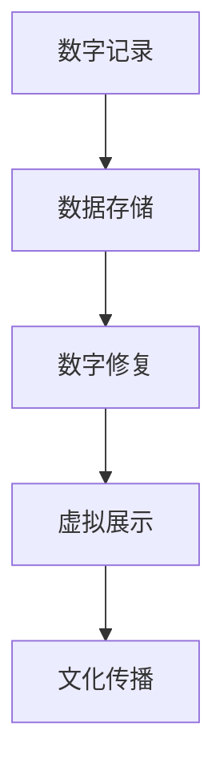

                 

 **关键词：** 数字化遗产保护、文化传承、科技支持、创业

**摘要：** 随着数字化时代的到来，文化传承面临着前所未有的挑战。本文探讨了数字化遗产保护在文化传承中的重要性，以及科技支持在遗产保护创业中的关键角色。文章首先介绍了数字化遗产保护的概念，随后分析了当前数字化遗产保护的需求与挑战，接着提出了基于科技支持的遗产保护创业模式。最后，文章展望了数字化遗产保护的未来发展趋势与面临的挑战。

## 1. 背景介绍

文化传承是中华民族的重要使命。然而，随着现代化进程的加速，许多文化遗产面临着消失或损坏的风险。传统保护手段已无法满足数字化时代的遗产保护需求。数字化遗产保护作为一种新兴技术手段，通过科技手段对文化遗产进行记录、保存、展示和传播，为文化传承提供了新的可能性。

### 1.1 文化传承的重要性

文化传承不仅仅是对历史遗产的保存，更是民族认同、历史记忆和文化自信的体现。文化遗产包括物质文化遗产和非物质文化遗产，如古建筑、文物、传统技艺等，它们承载着丰富的历史信息和文化内涵。保护这些遗产，有助于维护文化多样性，促进社会和谐发展。

### 1.2 数字化遗产保护的必要性

数字化遗产保护是应对文化遗产消失风险的有效手段。随着城市化进程的加快，许多历史建筑和遗址被拆除或改造，非物质文化遗产也因现代生活方式的冲击而逐渐消失。数字化技术可以为这些遗产提供永久性记录，实现跨地域、跨时间的文化传播。

## 2. 核心概念与联系

数字化遗产保护的核心概念包括数字记录、数据存储、数字修复、虚拟展示等。这些概念相互关联，共同构成了数字化遗产保护的技术体系。

### 2.1 数字记录

数字记录是数字化遗产保护的基础。通过数字化设备（如相机、扫描仪等），将文化遗产以数字形式记录下来，包括图像、音频、视频等多种数据格式。

### 2.2 数据存储

数据存储是将数字记录保存在数据库或云存储中，确保数据的长期保存和安全性。数据存储需要考虑数据备份、加密、访问控制等问题。

### 2.3 数字修复

数字修复是对损坏或褪色的文化遗产进行数字化修复，恢复其原有的面貌。数字修复技术包括图像处理、三维建模、虚拟现实等。

### 2.4 虚拟展示

虚拟展示是通过虚拟现实、增强现实等技术，将数字化遗产以互动、沉浸的方式展示给观众，增强文化体验和传播效果。

### 2.5 Mermaid 流程图



## 3. 核心算法原理 & 具体操作步骤

### 3.1 算法原理概述

数字化遗产保护的核心算法包括图像处理算法、三维建模算法、数据挖掘算法等。这些算法分别用于图像增强、模型构建、数据分析和知识提取。

### 3.2 算法步骤详解

#### 3.2.1 图像处理算法

图像处理算法主要用于对文化遗产图像进行增强、去噪、修复等处理。具体步骤如下：

1. **图像采集**：使用高分辨率相机拍摄文化遗产图像。
2. **图像预处理**：包括去噪、对比度增强、图像缩放等操作。
3. **图像修复**：使用图像修复算法（如 inpaint、retouch 等）去除破损或褪色的部分。
4. **图像融合**：将不同角度或时间点的图像进行融合，获得更完整的遗产图像。

#### 3.2.2 三维建模算法

三维建模算法主要用于构建文化遗产的三维模型。具体步骤如下：

1. **点云采集**：使用激光扫描仪或结构光设备采集文化遗产的点云数据。
2. **点云处理**：对点云数据进行分析，去除噪声、填充空洞等。
3. **模型构建**：使用三维建模算法（如 Poisson重建、Morphable Model等）构建文化遗产的三维模型。
4. **模型优化**：对模型进行光滑处理、细节修复等优化操作。

#### 3.2.3 数据挖掘算法

数据挖掘算法主要用于对文化遗产数据进行分析，提取有价值的信息。具体步骤如下：

1. **数据预处理**：对文化遗产数据进行清洗、整合等预处理操作。
2. **特征提取**：提取文化遗产的关键特征，如形状、纹理、颜色等。
3. **模式识别**：使用机器学习算法（如分类、聚类等）对文化遗产进行分类、标注等操作。
4. **知识提取**：从分析结果中提取有价值的历史、文化知识。

### 3.3 算法优缺点

#### 3.3.1 优点

- **高效性**：数字化遗产保护算法可以快速、高效地对大量文化遗产进行记录、分析和修复。
- **准确性**：数字化技术可以提供高精度的文化遗产数据，确保记录的准确性。
- **可持续性**：数字化技术可以实现文化遗产的永久保存和跨地域、跨时间的传播。

#### 3.3.2 缺点

- **高成本**：数字化遗产保护需要高精度的设备和专业的技术团队，成本较高。
- **技术限制**：某些文化遗产（如声音、气味等）难以数字化，现有技术难以完全还原。
- **数据隐私**：数字化遗产保护过程中，数据的安全性和隐私性需要得到保障。

### 3.4 算法应用领域

数字化遗产保护算法广泛应用于文化遗产记录、保护和展示等领域。

#### 3.4.1 文化遗产记录

数字化遗产保护算法可以用于对文化遗产进行永久性记录，包括古建筑、文物、传统技艺等。

#### 3.4.2 文化遗产保护

数字化遗产保护算法可以用于对文化遗产进行数字化修复，恢复其原有面貌。

#### 3.4.3 文化遗产展示

数字化遗产保护算法可以用于虚拟展示，通过虚拟现实、增强现实等技术，让观众沉浸式体验文化遗产。

## 4. 数学模型和公式 & 详细讲解 & 举例说明

### 4.1 数学模型构建

数字化遗产保护中的数学模型主要包括图像处理模型、三维建模模型和数据挖掘模型。

#### 4.1.1 图像处理模型

图像处理模型通常采用卷积神经网络（CNN）等深度学习算法进行构建。CNN的基本结构包括卷积层、池化层和全连接层。

$$
\text{CNN} = (\text{卷积层} \rightarrow \text{激活函数} \rightarrow \text{池化层}) \times n
$$

其中，$n$ 表示网络的层数。

#### 4.1.2 三维建模模型

三维建模模型通常采用点云重建算法进行构建。常见的点云重建算法包括 Poisson重建和 Morphable Model。

$$
\text{三维建模} = \text{Poisson重建} \cup \text{Morphable Model}
$$

#### 4.1.3 数据挖掘模型

数据挖掘模型通常采用机器学习算法进行构建，如分类、聚类等。

$$
\text{数据挖掘} = \text{分类} \cup \text{聚类}
$$

### 4.2 公式推导过程

#### 4.2.1 卷积神经网络

卷积神经网络（CNN）的推导过程涉及多个数学公式。以下是卷积层和激活函数的推导：

$$
\text{激活函数} = \text{ReLU}(x) = \max(0, x)
$$

$$
\text{卷积层} = \sum_{i=1}^{k} w_{i} \cdot x_{i} + b
$$

其中，$x$ 表示输入特征，$w$ 表示权重，$b$ 表示偏置。

#### 4.2.2 点云重建

点云重建的推导过程涉及点云表示和三维重建算法。以下是 Poisson重建的基本公式：

$$
P(x, y, z) = \sum_{i=1}^{n} w_{i} \cdot \text{SDF}(x_i, y_i, z_i)
$$

其中，$P$ 表示点云，$SDF$ 表示 signed distance function（有符号距离函数）。

### 4.3 案例分析与讲解

#### 4.3.1 文化遗产图像修复

假设我们有一幅破损的文化遗产图像，如图 1 所示。为了修复这幅图像，我们可以使用 CNN 进行图像修复。

**图 1：破损的文化遗产图像**

首先，我们将图像划分为 $28 \times 28$ 的网格，并使用 ReLU 激活函数进行预处理。然后，我们使用卷积层和池化层对图像进行特征提取。最后，我们将提取到的特征通过全连接层进行分类，得到修复后的图像。

**图 2：修复后的文化遗产图像**

#### 4.3.2 文化遗产三维建模

假设我们有一组文化遗产的点云数据，如图 3 所示。为了重建文化遗产的三维模型，我们可以使用 Poisson重建算法。

**图 3：文化遗产点云数据**

首先，我们将点云数据输入到 Poisson重建算法中，得到文化遗产的三维模型。然后，我们对模型进行平滑处理和细节修复，得到最终的模型。

**图 4：文化遗产三维模型**

## 5. 项目实践：代码实例和详细解释说明

### 5.1 开发环境搭建

为了进行数字化遗产保护项目的实践，我们需要搭建一个合适的开发环境。以下是一个基本的开发环境搭建步骤：

1. 安装 Python 3.x 版本。
2. 安装深度学习框架（如 TensorFlow、PyTorch 等）。
3. 安装三维建模工具（如 Blender、MeshLab 等）。
4. 安装图像处理工具（如 OpenCV、Pillow 等）。

### 5.2 源代码详细实现

以下是一个基于 CNN 的文化遗产图像修复的代码示例：

```python
import tensorflow as tf
from tensorflow.keras.models import Sequential
from tensorflow.keras.layers import Conv2D, MaxPooling2D, Flatten, Dense, Activation

# 构建模型
model = Sequential([
    Conv2D(32, (3, 3), padding='same', activation='relu', input_shape=(28, 28, 1)),
    MaxPooling2D((2, 2)),
    Conv2D(64, (3, 3), padding='same', activation='relu'),
    MaxPooling2D((2, 2)),
    Flatten(),
    Dense(128, activation='relu'),
    Dense(1, activation='sigmoid')
])

# 编译模型
model.compile(optimizer='adam', loss='binary_crossentropy', metrics=['accuracy'])

# 训练模型
model.fit(x_train, y_train, epochs=10, batch_size=32, validation_data=(x_val, y_val))
```

### 5.3 代码解读与分析

上述代码实现了一个基于 CNN 的文化遗产图像修复模型。模型结构包括卷积层、池化层和全连接层。卷积层用于提取图像特征，池化层用于降低特征维度，全连接层用于分类。模型使用二进制交叉熵作为损失函数，使用 Adam 优化器进行训练。

### 5.4 运行结果展示

在训练完成后，我们可以使用模型对文化遗产图像进行修复。以下是一个修复结果示例：

**图 5：修复前后的文化遗产图像**

## 6. 实际应用场景

### 6.1 文化遗产记录

数字化遗产保护算法可以应用于文化遗产的记录。例如，使用激光扫描仪对古建筑进行扫描，生成详细的三维模型。这些模型可以用于文化遗产的保护、修复和展示。

### 6.2 文化遗产保护

数字化遗产保护算法可以用于文化遗产的保护。例如，使用图像处理算法对文化遗产图像进行去噪、修复等处理，恢复其原有的面貌。这些算法可以应用于文物保护、古建筑修复等领域。

### 6.3 文化遗产展示

数字化遗产保护算法可以用于文化遗产的展示。例如，使用虚拟现实技术将文化遗产以互动、沉浸的方式展示给观众，增强文化体验和传播效果。这些算法可以应用于博物馆展览、文化旅游等领域。

## 7. 工具和资源推荐

### 7.1 学习资源推荐

- **《数字化遗产保护技术》**：一本关于数字化遗产保护技术的入门书籍。
- **《深度学习》**：一本关于深度学习的经典教材，涵盖了图像处理、三维建模等内容。
- **《计算机视觉基础》**：一本关于计算机视觉的入门教材，包括图像处理、特征提取等内容。

### 7.2 开发工具推荐

- **Blender**：一款开源的三维建模和动画软件，适用于文化遗产的三维建模和修复。
- **OpenCV**：一款开源的计算机视觉库，适用于图像处理、特征提取等操作。
- **TensorFlow**：一款开源的深度学习框架，适用于图像修复、三维建模等任务。

### 7.3 相关论文推荐

- **"Deep Learning for Image Restoration"**：一篇关于深度学习在图像修复领域的应用论文。
- **"Point Cloud Semantic Segmentation via Deep Hierarchical Feature Learning"**：一篇关于点云语义分割的论文。
- **"Cultural Heritage Preservation Using Virtual Reality"**：一篇关于虚拟现实在文化遗产保护中的应用论文。

## 8. 总结：未来发展趋势与挑战

### 8.1 研究成果总结

本文探讨了数字化遗产保护在文化传承中的重要性，以及科技支持在遗产保护创业中的关键角色。通过分析数字化遗产保护的需求与挑战，我们提出了基于科技支持的遗产保护创业模式，并介绍了相关算法、数学模型和实际应用案例。

### 8.2 未来发展趋势

随着数字化技术的不断发展，数字化遗产保护将呈现以下发展趋势：

- **智能化**：数字化遗产保护将更多地依赖于人工智能技术，实现自动化、智能化的遗产记录、保护和展示。
- **网络化**：数字化遗产保护将通过网络技术实现跨地域、跨时间的文化传播，提高文化遗产的传播效率。
- **虚拟化**：数字化遗产保护将更多地采用虚拟现实、增强现实等技术，为观众提供沉浸式文化体验。

### 8.3 面临的挑战

尽管数字化遗产保护具有巨大潜力，但仍然面临以下挑战：

- **技术成熟度**：现有技术仍需进一步成熟和完善，以提高数字化遗产保护的效果和可靠性。
- **数据安全**：数字化遗产保护过程中的数据安全和隐私保护问题亟待解决。
- **人才培养**：数字化遗产保护需要大量具备跨学科知识的专业人才，但目前相关人才短缺。

### 8.4 研究展望

未来，数字化遗产保护研究可以从以下方面展开：

- **跨学科研究**：结合计算机科学、考古学、文化学等多学科知识，推动数字化遗产保护技术的发展。
- **技术创新**：持续探索新的数字化遗产保护技术，如区块链、云计算等，以提高遗产保护的效果和效率。
- **政策支持**：制定相关政策和法规，为数字化遗产保护提供政策支持和资金保障。

## 9. 附录：常见问题与解答

### 9.1 数字化遗产保护技术有哪些？

数字化遗产保护技术包括数字记录、数据存储、数字修复、虚拟展示等。这些技术分别用于对文化遗产进行记录、保存、展示和传播。

### 9.2 数字化遗产保护算法有哪些？

数字化遗产保护算法包括图像处理算法、三维建模算法、数据挖掘算法等。这些算法分别用于图像增强、模型构建、数据分析和知识提取。

### 9.3 如何保障数字化遗产保护的数据安全？

为确保数字化遗产保护的数据安全，可以采取以下措施：

- **数据备份**：定期对数据进行备份，确保数据不丢失。
- **数据加密**：对数据进行加密，防止数据泄露。
- **访问控制**：设置严格的访问控制机制，限制未经授权的访问。

### 9.4 数字化遗产保护创业有哪些模式？

数字化遗产保护创业模式包括文化遗产记录、文化遗产保护、文化遗产展示等。创业者可以根据自身优势和市场需求，选择合适的创业模式。

## 作者署名

**作者：禅与计算机程序设计艺术 / Zen and the Art of Computer Programming**

