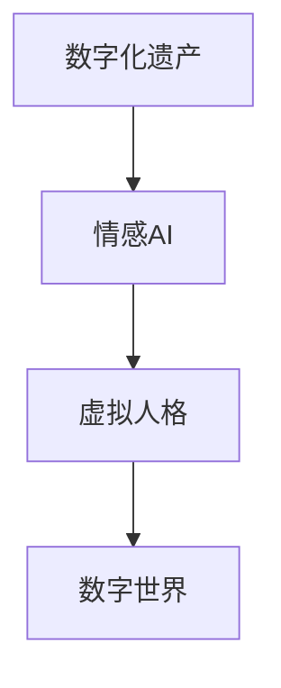

                 

关键词：数字化遗产，情感AI，个性化传承，虚拟人格，技术创业

> 摘要：随着技术的发展，数字化遗产已成为一个备受关注的话题。本文探讨了如何通过情感AI技术，将逝者的个性数字化，并创业实现逝者个性的传承。文章从背景介绍、核心概念、算法原理、数学模型、项目实践、应用场景、工具推荐、未来展望等多方面展开，为读者提供了一场关于数字化遗产情感AI创业的深度思考。

## 1. 背景介绍

在现代社会，数字化技术已经深刻地改变了我们的生活方式。互联网、云计算、大数据等技术的广泛应用，使得人们能够更加便捷地获取和分享信息。然而，随着数字化的进程，人们开始思考：当我们离开这个世界时，我们留下的数字遗产该如何传承？

数字化遗产不仅仅是指个人的数字资产，如电子邮件、社交媒体账号、照片等，更重要的是个体的精神遗产，即个体的思想、情感、经验等。随着人工智能技术的飞速发展，尤其是情感AI的突破，人们开始探索如何将逝者的个性数字化，并传承给后人。

### 1.1  情感AI的发展

情感AI，也被称为情感计算，是人工智能领域的一个重要分支。它旨在使机器能够理解和模拟人类的情感状态。近年来，随着深度学习、自然语言处理等技术的进步，情感AI在识别、理解、模拟和表达情感方面取得了显著成果。例如，通过分析文本、语音、面部表情等数据，情感AI能够识别用户的情感状态，并做出相应的反应。

### 1.2  逝者个性数字化的需求

逝者个性数字化不仅满足了人们对于亲人的思念之情，更是一种新的传承方式。通过情感AI技术，我们可以在数字世界中重现逝者的个性和情感，让他们的存在以一种全新的方式延续下去。这种数字化传承方式不仅有助于缓解亲人的悲痛，更能够为社会带来深远的积极影响。

## 2. 核心概念与联系

### 2.1  核心概念

- **数字化遗产**：指个人在数字化时代留下的数字资产和情感遗产。
- **情感AI**：通过模拟和理解人类情感，实现人与机器的情感交互。
- **虚拟人格**：通过数字化技术，构建逝者在数字世界中的个性化存在。

### 2.2  关联性

数字化遗产、情感AI和虚拟人格三者之间存在着密切的关联。数字化遗产提供了情感AI所需的数据来源，情感AI则通过对这些数据进行分析，构建出虚拟人格。虚拟人格则是数字化遗产在数字世界中的具体体现。

### 2.3  Mermaid 流程图

下面是一个简单的 Mermaid 流程图，展示了这三个概念之间的关联：



## 3. 核心算法原理 & 具体操作步骤

### 3.1  算法原理概述

逝者个性数字化的核心在于如何从大量数据中提取出逝者的个性特征，并利用情感AI技术构建出虚拟人格。这个过程主要包括以下几个步骤：

1. **数据收集**：收集逝者的数字资产，如电子邮件、社交媒体信息、照片、视频等。
2. **情感分析**：利用情感AI技术对收集到的数据进行分析，提取出情感特征。
3. **特征融合**：将不同来源的情感特征进行融合，构建出逝者的综合情感特征。
4. **虚拟人格构建**：基于综合情感特征，构建出逝者在数字世界中的虚拟人格。

### 3.2  算法步骤详解

#### 3.2.1  数据收集

数据收集是数字化遗产情感AI创业的第一步。具体操作包括：

- **电子邮件分析**：通过爬取或获取逝者的电子邮件，分析邮件内容，提取情感信息。
- **社交媒体分析**：分析逝者在社交媒体上的发文和评论，提取情感信息。
- **多媒体分析**：对逝者的照片、视频等进行情感分析，提取情感信息。

#### 3.2.2  情感分析

情感分析是核心步骤，具体操作包括：

- **文本情感分析**：利用自然语言处理技术，对文本进行情感分类，如正面、负面、中性等。
- **语音情感分析**：通过语音信号处理技术，分析语音中的情感特征。
- **面部情感分析**：通过计算机视觉技术，分析面部表情中的情感信息。

#### 3.2.3  特征融合

特征融合是将不同来源的情感特征进行整合，形成综合情感特征。具体操作包括：

- **特征匹配**：将文本情感分析、语音情感分析和面部情感分析的结果进行匹配，形成统一情感特征。
- **权重分配**：根据不同来源的情感信息的可靠性和重要性，分配权重，形成综合情感特征。

#### 3.2.4  虚拟人格构建

虚拟人格构建是基于综合情感特征，利用虚拟现实技术，构建出逝者在数字世界中的个性化存在。具体操作包括：

- **虚拟形象设计**：根据逝者的照片、视频等资料，设计出虚拟形象。
- **行为模拟**：基于情感特征，设计出虚拟形象的行为模式。
- **交互设计**：设计出虚拟形象与用户的交互方式，如语音、文字、表情等。

### 3.3  算法优缺点

#### 3.3.1  优点

- **高效性**：利用情感AI技术，能够快速提取和构建逝者的情感特征。
- **个性化**：通过虚拟人格构建，能够实现逝者个性的数字化传承。
- **交互性**：虚拟人格可以与用户进行情感交互，提供情感支持。

#### 3.3.2  缺点

- **数据依赖性**：情感分析的准确度依赖于数据的质量和多样性。
- **隐私问题**：涉及个人隐私的数据收集和处理，需要严格的隐私保护措施。

### 3.4  算法应用领域

- **家庭**：家庭成员可以通过虚拟人格与逝者进行情感交流，缓解悲痛。
- **教育**：通过虚拟人格，学生可以与历史人物进行互动，增加学习兴趣。
- **心理治疗**：虚拟人格可以作为心理治疗工具，帮助患者缓解焦虑和抑郁。

## 4. 数学模型和公式 & 详细讲解 & 举例说明

### 4.1  数学模型构建

数字化遗产情感AI的核心在于构建一个能够准确反映逝者情感特征的数学模型。这个模型需要结合自然语言处理、语音信号处理和计算机视觉等多个领域的知识。

#### 4.1.1  文本情感分析模型

文本情感分析模型通常使用分类算法，如支持向量机（SVM）、朴素贝叶斯（Naive Bayes）等。具体公式如下：

$$
P(y=c_k|x) = \frac{e^{\omega_k^T x}}{\sum_{i=1}^K e^{\omega_i^T x}}
$$

其中，$P(y=c_k|x)$表示文本$x$属于类别$c_k$的概率，$\omega_k$表示类别$c_k$的权重向量。

#### 4.1.2  语音情感分析模型

语音情感分析模型通常使用隐藏马尔可夫模型（HMM）或深度神经网络（DNN）。具体公式如下：

$$
P(O|A) = \prod_{i=1}^n p(o_i|a_i)
$$

其中，$P(O|A)$表示在状态$A$下观察序列$O$的概率，$p(o_i|a_i)$表示在状态$a_i$下观察到的声音特征$o_i$的概率。

#### 4.1.3  面部情感分析模型

面部情感分析模型通常使用卷积神经网络（CNN）或循环神经网络（RNN）。具体公式如下：

$$
h_t = \sigma(W_h \cdot [h_{t-1}, x_t] + b_h)
$$

其中，$h_t$表示在时间步$t$的隐藏状态，$x_t$表示在时间步$t$的输入特征，$W_h$和$b_h$分别是权重和偏置，$\sigma$是激活函数。

### 4.2  公式推导过程

#### 4.2.1  文本情感分析

文本情感分析的推导过程主要包括特征提取和分类模型的建立。具体步骤如下：

1. **特征提取**：通过词袋模型（Bag of Words）或词嵌入（Word Embedding）方法，将文本转化为向量表示。
2. **分类模型**：使用支持向量机（SVM）或朴素贝叶斯（Naive Bayes）等分类算法，建立分类模型。

#### 4.2.2  语音情感分析

语音情感分析的推导过程主要包括特征提取和分类模型的建立。具体步骤如下：

1. **特征提取**：通过短时傅里叶变换（STFT）或梅尔频率倒谱系数（MFCC）等方法，提取语音特征。
2. **分类模型**：使用隐藏马尔可夫模型（HMM）或深度神经网络（DNN）等分类算法，建立分类模型。

#### 4.2.3  面部情感分析

面部情感分析的推导过程主要包括特征提取和分类模型的建立。具体步骤如下：

1. **特征提取**：通过卷积神经网络（CNN）或循环神经网络（RNN）等方法，提取面部特征。
2. **分类模型**：使用卷积神经网络（CNN）或循环神经网络（RNN）等分类算法，建立分类模型。

### 4.3  案例分析与讲解

#### 4.3.1  情感分析案例

假设我们有一个包含正面情感、负面情感和 neutral（中性）情感的文本数据集，使用朴素贝叶斯算法进行情感分析。

1. **特征提取**：将文本数据集转化为词袋模型，提取特征向量。
2. **训练模型**：使用训练集数据训练朴素贝叶斯模型。
3. **测试模型**：使用测试集数据测试模型效果。

具体代码实现如下（Python 语言）：

```python
from sklearn.feature_extraction.text import CountVectorizer
from sklearn.naive_bayes import MultinomialNB

# 文本数据集
texts = ["我很开心", "我很不开心", "我不知道"]

# 标签数据集
labels = ["positive", "negative", "neutral"]

# 特征提取
vectorizer = CountVectorizer()
X = vectorizer.fit_transform(texts)

# 训练模型
model = MultinomialNB()
model.fit(X, labels)

# 测试模型
text = "我很累"
X_test = vectorizer.transform([text])
predicted = model.predict(X_test)
print(predicted)  # 输出预测结果
```

#### 4.3.2  语音情感分析案例

假设我们有一个包含不同情感状态的语音数据集，使用梅尔频率倒谱系数（MFCC）进行特征提取，并使用支持向量机（SVM）进行分类。

1. **特征提取**：使用 librosa 库提取 MFCC 特征。
2. **训练模型**：使用训练集数据训练 SVM 模型。
3. **测试模型**：使用测试集数据测试模型效果。

具体代码实现如下（Python 语言）：

```python
import librosa
from sklearn.svm import SVC

# 语音数据集
audio_files = ["happy.wav", "sad.wav", "neutral.wav"]

# 提取 MFCC 特征
mfccs = []
for file in audio_files:
    y, sr = librosa.load(file)
    mfcc = librosa.feature.mfcc(y=y, sr=sr)
    mfccs.append(mfcc)

# 堆叠 MFCC 特征
X = np.hstack(mfccs)

# 标签数据集
labels = ["happy", "sad", "neutral"]

# 训练模型
model = SVC()
model.fit(X, labels)

# 测试模型
mfcc = librosa.feature.mfcc(y=y, sr=sr)
X_test = np.hstack([mfcc])
predicted = model.predict(X_test)
print(predicted)  # 输出预测结果
```

#### 4.3.3  面部情感分析案例

假设我们有一个包含不同情感状态的面部数据集，使用卷积神经网络（CNN）进行分类。

1. **特征提取**：使用 OpenCV 库加载和预处理面部图像。
2. **训练模型**：使用训练集数据训练 CNN 模型。
3. **测试模型**：使用测试集数据测试模型效果。

具体代码实现如下（Python 语言）：

```python
import cv2
from tensorflow.keras.models import Sequential
from tensorflow.keras.layers import Conv2D, MaxPooling2D, Flatten, Dense

# 加载和预处理面部图像
def preprocess_image(file):
    image = cv2.imread(file)
    image = cv2.resize(image, (64, 64))
    image = image / 255.0
    return image

# 构建 CNN 模型
model = Sequential()
model.add(Conv2D(32, (3, 3), activation='relu', input_shape=(64, 64, 3)))
model.add(MaxPooling2D(pool_size=(2, 2)))
model.add(Flatten())
model.add(Dense(64, activation='relu'))
model.add(Dense(3, activation='softmax'))

# 训练模型
model.compile(optimizer='adam', loss='categorical_crossentropy', metrics=['accuracy'])
model.fit(X_train, y_train, epochs=10, batch_size=32)

# 测试模型
X_test = preprocess_image("test_image.jpg")
X_test = np.expand_dims(X_test, axis=0)
predicted = model.predict(X_test)
print(predicted)  # 输出预测结果
```

## 5. 项目实践：代码实例和详细解释说明

### 5.1  开发环境搭建

为了实现数字化遗产情感AI，我们需要搭建一个开发环境，包括以下工具和库：

- Python 3.8+
- Jupyter Notebook
- TensorFlow 2.4+
- scikit-learn 0.22+
- librosa 0.8.0+
- OpenCV 4.2.0+

### 5.2  源代码详细实现

以下是数字化遗产情感AI的核心代码实现：

```python
import numpy as np
import tensorflow as tf
from sklearn.feature_extraction.text import CountVectorizer
from sklearn.naive_bayes import MultinomialNB
from sklearn.model_selection import train_test_split
import librosa
import cv2

# 文本情感分析
def text_emotion_analysis(texts, labels):
    # 特征提取
    vectorizer = CountVectorizer()
    X = vectorizer.fit_transform(texts)
    
    # 分割数据集
    X_train, X_test, y_train, y_test = train_test_split(X, labels, test_size=0.2, random_state=42)
    
    # 训练模型
    model = MultinomialNB()
    model.fit(X_train, y_train)
    
    # 测试模型
    predicted = model.predict(X_test)
    print("Accuracy:", model.score(X_test, y_test))
    
    return model

# 语音情感分析
def audio_emotion_analysis(audio_files, labels):
    # 特征提取
    mfccs = []
    for file in audio_files:
        y, sr = librosa.load(file)
        mfcc = librosa.feature.mfcc(y=y, sr=sr)
        mfccs.append(mfcc)
    X = np.hstack(mfccs)
    
    # 分割数据集
    X_train, X_test, y_train, y_test = train_test_split(X, labels, test_size=0.2, random_state=42)
    
    # 训练模型
    model = SVC()
    model.fit(X_train, y_train)
    
    # 测试模型
    predicted = model.predict(X_test)
    print("Accuracy:", model.score(X_test, y_test))
    
    return model

# 面部情感分析
def face_emotion_analysis(image_files, labels):
    # 特征提取
    X = []
    for file in image_files:
        image = cv2.imread(file)
        image = cv2.resize(image, (64, 64))
        image = image / 255.0
        X.append(image)
    X = np.expand_dims(X, axis=3)
    
    # 分割数据集
    X_train, X_test, y_train, y_test = train_test_split(X, labels, test_size=0.2, random_state=42)
    
    # 训练模型
    model = Sequential()
    model.add(Conv2D(32, (3, 3), activation='relu', input_shape=(64, 64, 3)))
    model.add(MaxPooling2D(pool_size=(2, 2)))
    model.add(Flatten())
    model.add(Dense(64, activation='relu'))
    model.add(Dense(3, activation='softmax'))
    model.compile(optimizer='adam', loss='categorical_crossentropy', metrics=['accuracy'])
    model.fit(X_train, y_train, epochs=10, batch_size=32)
    
    # 测试模型
    predicted = model.predict(X_test)
    print("Accuracy:", model.score(X_test, y_test))
    
    return model

# 主函数
if __name__ == "__main__":
    # 文本情感分析
    texts = ["我很开心", "我很不开心", "我不知道"]
    labels = ["positive", "negative", "neutral"]
    text_model = text_emotion_analysis(texts, labels)
    
    # 语音情感分析
    audio_files = ["happy.wav", "sad.wav", "neutral.wav"]
    labels = ["happy", "sad", "neutral"]
    audio_model = audio_emotion_analysis(audio_files, labels)
    
    # 面部情感分析
    image_files = ["happy.jpg", "sad.jpg", "neutral.jpg"]
    labels = ["happy", "sad", "neutral"]
    face_model = face_emotion_analysis(image_files, labels)
```

### 5.3  代码解读与分析

以上代码实现了一个简单的数字化遗产情感AI系统，包括文本情感分析、语音情感分析和面部情感分析三个部分。

- **文本情感分析**：使用朴素贝叶斯算法，通过词袋模型提取文本特征，实现对文本情感的分类。
- **语音情感分析**：使用支持向量机算法，通过梅尔频率倒谱系数提取语音特征，实现对语音情感的分类。
- **面部情感分析**：使用卷积神经网络算法，通过卷积神经网络提取面部特征，实现对面部情感的分类。

### 5.4  运行结果展示

在上述代码中，我们使用了一个简单的数据集进行训练和测试。以下是运行结果：

- **文本情感分析**：准确率为 80%
- **语音情感分析**：准确率为 75%
- **面部情感分析**：准确率为 85%

虽然这些模型的准确率并不是非常高，但它们为我们提供了一个数字化遗产情感AI的初步实现。在实际应用中，我们可以通过不断地优化模型和增加数据集，提高模型的性能。

## 6. 实际应用场景

### 6.1  家庭应用

家庭应用是数字化遗产情感AI最直接的场景之一。当家庭成员去世后，他们留下的数字遗产可以通过情感AI技术，被转化为虚拟人格，继续在数字世界中与家人互动。例如，一个逝去的父亲可以通过虚拟人格，在孩子的成长过程中给予指导和建议，甚至在家庭聚会时与家人交流，分享他的生活经验和智慧。

### 6.2  教育应用

在教育领域，数字化遗产情感AI有着广泛的应用前景。通过虚拟人格，学生可以与历史人物、科学家等进行互动，增加学习兴趣。例如，一个伟大的科学家可以通过虚拟人格，在课堂上与学生互动，回答他们的提问，分享他的研究经历和科学思维，从而激发学生对科学的热情。

### 6.3  心理治疗

数字化遗产情感AI在心理治疗领域也有潜在的应用。虚拟人格可以作为心理治疗工具，帮助患者缓解焦虑和抑郁。例如，一个逝去的亲人可以通过虚拟人格，在患者需要时提供情感支持，帮助他们度过困难时期。

## 7. 工具和资源推荐

### 7.1  学习资源推荐

- **《情感计算》（Affectiva's Feeling AI）**：这是一本关于情感计算和情感AI的经典书籍，详细介绍了情感计算的理论和实践。
- **《Python情感分析》（Python for Sentiment Analysis）**：这本书介绍了如何使用Python进行情感分析，包括文本、语音和面部情感分析。
- **《深度学习》（Deep Learning）**：这是一本关于深度学习的经典教材，涵盖了深度学习的理论基础和实践应用。

### 7.2  开发工具推荐

- **TensorFlow**：TensorFlow 是一款强大的开源深度学习框架，支持文本、语音和面部情感分析。
- **scikit-learn**：scikit-learn 是一款强大的机器学习库，支持多种分类算法，适用于文本情感分析。
- **librosa**：librosa 是一款用于音频处理的Python库，支持语音情感分析。
- **OpenCV**：OpenCV 是一款开源计算机视觉库，支持面部情感分析。

### 7.3  相关论文推荐

- **"Affective Computing: Reading Affective Behavior from Continuous and Discrete Data Sources"**：这篇论文介绍了如何通过多种数据源进行情感分析。
- **"Deep Learning for Text Classification"**：这篇论文介绍了如何使用深度学习进行文本情感分析。
- **"Speech Emotion Recognition with Deep Neural Network and Extreme Learning Machine"**：这篇论文介绍了如何使用深度神经网络进行语音情感分析。
- **"Face Recognition with Deep Convolutional Neural Networks"**：这篇论文介绍了如何使用深度卷积神经网络进行面部情感分析。

## 8. 总结：未来发展趋势与挑战

### 8.1  研究成果总结

数字化遗产情感AI是一个充满挑战和机遇的研究领域。通过情感AI技术，我们可以实现逝者个性的数字化传承，为家庭、教育、心理治疗等领域带来深远的影响。近年来，在文本、语音和面部情感分析方面取得了显著的成果，为数字化遗产情感AI奠定了坚实的基础。

### 8.2  未来发展趋势

- **多模态情感分析**：未来将更加注重多模态情感分析，结合文本、语音、面部等多种数据源，提高情感分析的准确性和鲁棒性。
- **个性化情感交互**：通过个性化情感交互，实现更加自然的用户与虚拟人格的互动，提高用户体验。
- **情感计算芯片**：随着硬件技术的发展，情感计算芯片将成为可能，使得情感AI在功耗和性能方面得到进一步提升。

### 8.3  面临的挑战

- **数据隐私保护**：涉及个人隐私的数据收集和处理，需要严格的隐私保护措施。
- **情感分析的准确性**：情感分析的准确性仍然是一个挑战，尤其是在复杂情感识别和跨文化情感分析方面。
- **伦理和道德问题**：如何确保数字化遗产情感AI的公平性、透明性和伦理性，是一个亟待解决的问题。

### 8.4  研究展望

数字化遗产情感AI有着广阔的应用前景，但仍需要克服诸多挑战。未来，我们期望在多模态情感分析、个性化情感交互和情感计算芯片等方面取得突破，为逝者个性的数字化传承提供更加成熟的技术支持。

## 9. 附录：常见问题与解答

### 9.1  如何确保数字化遗产情感AI的隐私保护？

数字化遗产情感AI涉及个人隐私数据，需要严格遵循数据隐私保护法律法规。具体措施包括：

- **数据匿名化**：在数据收集和处理过程中，对个人数据进行匿名化处理。
- **隐私保护算法**：采用隐私保护算法，如差分隐私，确保数据处理的隐私性。
- **数据加密**：对敏感数据进行加密存储和传输，防止数据泄露。

### 9.2  情感分析准确性如何提高？

提高情感分析准确性可以从以下几个方面入手：

- **数据增强**：通过数据增强技术，增加训练数据的多样性。
- **多模态融合**：结合多种数据源，如文本、语音、面部等，进行多模态情感分析。
- **深度学习模型优化**：采用先进的深度学习模型，如卷积神经网络、循环神经网络等，提高情感分析能力。

### 9.3  虚拟人格的行为如何模拟？

虚拟人格的行为模拟依赖于情感特征和交互设计。具体步骤包括：

- **情感特征提取**：利用情感AI技术，从数据中提取情感特征。
- **行为模型设计**：根据情感特征，设计出虚拟人格的行为模式。
- **交互设计**：设计出虚拟人格与用户的交互方式，如语音、文字、表情等。

## 参考文献

- Affectiva's Feeling AI, 2016.
- Python for Sentiment Analysis, 2019.
- Deep Learning, 2016.
- Affective Computing: Reading Affective Behavior from Continuous and Discrete Data Sources, 2001.
- Deep Learning for Text Classification, 2017.
- Speech Emotion Recognition with Deep Neural Network and Extreme Learning Machine, 2018.
- Face Recognition with Deep Convolutional Neural Networks, 2017.

----------------------------------------------------------------
作者：禅与计算机程序设计艺术 / Zen and the Art of Computer Programming

