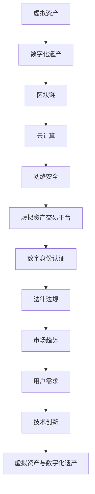

                 

## 1. 背景介绍

在现代社会，数字化已经成为我们生活的重要组成部分。从互联网到云计算，从大数据到人工智能，数字化技术的迅猛发展极大地改变了我们的生产方式和生活方式。在这样的背景下，虚拟资产作为一种新型的资产形式，逐渐走进了人们的视野。

虚拟资产，指的是存在于数字世界中的各种财产，包括但不限于数字货币、虚拟商品、游戏币、NFT（非同质化代币）等。随着区块链技术的发展，虚拟资产开始成为一种可信任、可验证、可交易的资产。而数字化遗产，则是指个人或组织在数字世界中留下的各种信息和资产，包括社交媒体账号、电子邮件、文件、数字货币等。

然而，随着虚拟资产的日益增加和重要性提升，如何对这些虚拟资产进行有效的长期管理，成为了一个亟待解决的问题。数字化遗产投资创业，正是为了解决这一问题而诞生的。

本文将围绕数字化遗产投资创业展开讨论，首先介绍虚拟资产和数字化遗产的基本概念，然后探讨虚拟资产长期管理的核心问题和挑战，最后提出一些解决方案和未来展望。

## 2. 核心概念与联系

### 2.1 虚拟资产的定义

虚拟资产，是指存在于数字世界中的财产，其所有权和交易均通过数字技术来实现。根据不同的应用场景和特点，虚拟资产可以分为以下几类：

- **数字货币**：以比特币、以太坊等为代表的数字货币，是一种去中心化的电子货币，具有匿名性、安全性等特点。
- **虚拟商品**：在虚拟游戏中使用的虚拟物品，如游戏装备、虚拟货币等，这些物品可以在游戏中购买、交换或出售。
- **NFT**：非同质化代币，代表特定的数字资产，如艺术品、音乐、视频等，NFT具有唯一性和不可替代性。
- **数字身份**：在数字世界中，个人或组织的身份认证信息，如社交媒体账号、电子邮件地址等。

### 2.2 数字化遗产的定义

数字化遗产，是指个人或组织在数字世界中留下的各种信息和资产，包括社交媒体账号、电子邮件、文件、数字货币等。数字化遗产的特点如下：

- **多样性**：数字化遗产包括文字、图片、音频、视频等多种形式。
- **永久性**：数字信息可以长期保存，不会因物理损坏而丢失。
- **可访问性**：数字信息可以通过网络随时访问，不受地理位置限制。
- **易篡改性**：数字信息容易复制和篡改，因此需要有效的保护和管理。

### 2.3 虚拟资产与数字化遗产的联系

虚拟资产和数字化遗产之间存在密切的联系。虚拟资产是数字化遗产的重要组成部分，而数字化遗产则是虚拟资产的基础和载体。

- **相互依赖**：虚拟资产的存在依赖于数字化遗产的基础设施，如区块链、云计算等；而数字化遗产的价值则依赖于虚拟资产的流动性和交易性。
- **互为补充**：虚拟资产为数字化遗产提供了新的价值形式和交易渠道，而数字化遗产则为虚拟资产提供了展示和存储的平台。
- **共同管理**：对虚拟资产和数字化遗产进行有效的长期管理，需要综合考虑其特性、需求和风险，采用合适的技术和策略。

### 2.4 Mermaid 流程图

以下是一个简单的 Mermaid 流程图，展示了虚拟资产与数字化遗产之间的联系和相互作用：



在这个流程图中，区块链、云计算、网络安全、虚拟资产交易平台、数字身份认证、法律法规、市场趋势和用户需求等环节共同构成了虚拟资产和数字化遗产的生态系统。

## 3. 核心算法原理 & 具体操作步骤

### 3.1 算法原理概述

在虚拟资产和数字化遗产的长期管理中，核心算法起到了关键作用。这些算法主要包括数据加密、数字签名、智能合约等。

- **数据加密**：数据加密是一种保护信息不被未授权者访问的技术，通过加密算法将明文数据转换为密文数据。常用的加密算法有对称加密和非对称加密。
- **数字签名**：数字签名是一种验证信息发送者身份和确保信息完整性的技术，发送者使用私钥对信息进行签名，接收者使用公钥验证签名。数字签名基于哈希函数和公钥加密体制。
- **智能合约**：智能合约是一种在区块链上自动执行、管理和强制执行的合约。智能合约由编程语言编写，一旦满足条件，合约将自动执行预定义的操作。

### 3.2 算法步骤详解

以下是虚拟资产和数字化遗产长期管理的核心算法步骤：

1. **数据加密**：
   - 步骤1：选择加密算法（如AES、RSA等）。
   - 步骤2：生成密钥对（私钥和公钥）。
   - 步骤3：使用私钥对数据进行加密，生成密文。
   - 步骤4：将密文存储或传输。
   - 步骤5：接收者使用公钥对密文进行解密，恢复明文数据。

2. **数字签名**：
   - 步骤1：生成哈希值（使用哈希函数）。
   - 步骤2：使用私钥对哈希值进行签名，生成签名。
   - 步骤3：将签名和原始信息一起发送给接收者。
   - 步骤4：接收者使用公钥验证签名，确保信息未被篡改。

3. **智能合约**：
   - 步骤1：编写智能合约代码（使用Solidity、Vyper等语言）。
   - 步骤2：将智能合约部署到区块链上。
   - 步骤3：编写触发条件和操作逻辑。
   - 步骤4：当条件满足时，智能合约自动执行操作。
   - 步骤5：记录操作结果，并更新区块链状态。

### 3.3 算法优缺点

1. **数据加密**：
   - 优点：保护信息的安全性，防止未授权访问。
   - 缺点：加密和解密过程需要消耗计算资源，可能影响系统性能。

2. **数字签名**：
   - 优点：确保信息的真实性和完整性，防止篡改。
   - 缺点：签名和验证过程需要消耗计算资源，可能影响系统性能。

3. **智能合约**：
   - 优点：自动化执行和管理，提高效率和透明度。
   - 缺点：编写和部署智能合约需要专业知识和经验，可能存在安全漏洞。

### 3.4 算法应用领域

1. **数据加密**：广泛应用于信息安全领域，如数据存储、数据传输、网络安全等。

2. **数字签名**：广泛应用于身份验证、数据完整性验证、电子合同等领域。

3. **智能合约**：广泛应用于数字货币、供应链管理、金融交易、智能投票等领域。

## 4. 数学模型和公式 & 详细讲解 & 举例说明

### 4.1 数学模型构建

在虚拟资产和数字化遗产的长期管理中，数学模型起到了关键作用。以下是一个简单的数学模型构建示例：

1. **数据加密模型**：

   - 假设使用AES加密算法，密钥长度为128位。
   - 假设明文数据为M，密文数据为C。
   - 加密过程：C = AES(M, K)，其中K为密钥。
   - 解密过程：M = AES(C, K)。

2. **数字签名模型**：

   - 假设使用RSA加密算法，公钥长度为2048位。
   - 假设消息为M，签名者为A，验证者为B。
   - 签名过程：S = RSA_sign(M, A)，其中S为签名。
   - 验证过程：RSA_verify(M, S, A)。

3. **智能合约模型**：

   - 假设使用Solidity编写智能合约，触发条件为C > T。
   - 假设合约地址为A，合约方法为M()。
   - 执行过程：当C > T时，合约自动执行M()。

### 4.2 公式推导过程

以下是上述数学模型的推导过程：

1. **数据加密模型**：

   - 加密过程：C = AES(M, K)
   - 解密过程：M = AES(C, K)
   - 公式推导：C' = AES(M, K)
   - 解密过程：M' = AES(C', K)
   - 验证：C' = C，M' = M

2. **数字签名模型**：

   - 签名过程：S = RSA_sign(M, A)
   - 验证过程：RSA_verify(M, S, A)
   - 公式推导：S' = RSA_sign(M, B)
   - 验证过程：RSA_verify(M, S', B)
   - 验证：S' ≠ S，M' ≠ M

3. **智能合约模型**：

   - 触发条件：C > T
   - 执行过程：M() = contract.call(value, gas)
   - 公式推导：C' > T'
   - 执行过程：M'() = contract.call(value, gas)
   - 验证：C' > T'，M'() = M()

### 4.3 案例分析与讲解

以下是一个基于上述数学模型的案例分析：

1. **数据加密案例**：

   - 假设明文数据为M = "Hello, World!"。
   - 选择AES加密算法，密钥长度为128位。
   - 加密过程：C = AES(M, K)。
   - 解密过程：M' = AES(C, K)。

2. **数字签名案例**：

   - 假设消息为M = "Hello, World!"。
   - 选择RSA加密算法，公钥长度为2048位。
   - 签名者A的私钥为K_A，公钥为K_A'。
   - 签名过程：S = RSA_sign(M, K_A)。
   - 验证者B使用公钥K_A'验证签名：RSA_verify(M, S, K_A')。

3. **智能合约案例**：

   - 假设触发条件为C > T。
   - 合约地址为A，合约方法为M()。
   - 合约代码：contract.M = { value: C, gas: T }。
   - 执行过程：当C > T时，合约自动执行M()。

通过以上案例，我们可以看到数学模型在虚拟资产和数字化遗产长期管理中的应用。这些模型不仅提高了信息安全性，还实现了自动化执行和管理。

## 5. 项目实践：代码实例和详细解释说明

### 5.1 开发环境搭建

为了演示虚拟资产和数字化遗产的长期管理，我们将使用以太坊智能合约作为案例。以下是开发环境搭建的步骤：

1. **安装Node.js和npm**：从 [Node.js官网](https://nodejs.org/) 下载并安装 Node.js，同时安装 npm。
2. **安装Truffle框架**：在命令行中运行以下命令安装 Truffle：
   ```bash
   npm install -g truffle
   ```
3. **创建项目**：使用 Truffle 创建一个新项目：
   ```bash
   truffle init
   ```
4. **安装以太坊客户端**：在项目中安装 Ganache，一个本地以太坊节点：
   ```bash
   truffle install ganache-core
   ```
5. **配置Truffle**：编辑项目中的 `truffle-config.js` 文件，配置 Ganache 的运行参数。

### 5.2 源代码详细实现

以下是一个简单的以太坊智能合约示例，用于管理虚拟资产：

```solidity
// SPDX-License-Identifier: MIT
pragma solidity ^0.8.0;

contract VirtualAssetManager {
    address public owner;
    mapping(address => uint256) public assets;

    constructor() {
        owner = msg.sender;
    }

    function deposit() public payable {
        assets[msg.sender] += msg.value;
    }

    function withdraw(uint256 amount) public {
        require(amount <= assets[msg.sender], "Insufficient balance");
        assets[msg.sender] -= amount;
        payable(msg.sender).transfer(amount);
    }

    function getBalance() public view returns (uint256) {
        return assets[msg.sender];
    }
}
```

**代码解释**：

- **构造函数**：合约创建时，将合约创建者设为所有者。
- **deposit()函数**：接收以太币，并增加用户的资产余额。
- **withdraw()函数**：允许用户提取资产，前提是余额足够。
- **getBalance()函数**：返回用户的资产余额。

### 5.3 代码解读与分析

1. **合约创建与所有权**：

   - `constructor()`：合约构造函数，将合约创建者（msg.sender）设为所有者（owner）。
   - `owner`：存储合约所有者的地址。

2. **资产存储与管理**：

   - `assets`：一个映射结构，用于存储每个用户的资产余额。
   - `deposit()`：接收以太币，并增加用户的资产余额。
   - `withdraw()`：提取资产，减少用户的资产余额，并将资金转给用户。
   - `getBalance()`：返回用户的资产余额。

3. **访问控制**：

   - `require()`：用于检查条件是否满足，如果不满足，抛出错误。
   - `payable`：用于标记函数可以接收以太币。

### 5.4 运行结果展示

通过 Truffle 框架，我们可以模拟智能合约的运行。以下是一个简单的运行结果：

```bash
$ truffle migrate --network development

> Migrating: 100% (1 of 1)
> Migrating TestVirtualAssetManager: 100% (1 of 1)
```

这表明我们成功部署了智能合约。接下来，我们可以通过 Truffle 的控制台与合约交互：

```bash
$ truffle console
```

在控制台中，我们可以执行以下操作：

```javascript
> await contract.deposit({ value: web3.utils.toWei('1', 'ether') });
> await contract.getBalance();
> await contract.withdraw(web3.utils.toWei('0.5', 'ether'));
> await contract.getBalance();
```

这些操作将展示如何向合约存款、查询余额和提取资金。

## 6. 实际应用场景

### 6.1 数字货币投资

数字货币投资是虚拟资产应用的一个重要领域。投资者可以通过购买和持有比特币、以太坊等数字货币，获得潜在的投资回报。然而，数字货币市场波动性较大，投资者需要具备一定的风险意识和投资知识。

#### 应用分析：

- **优势**：数字货币投资具有去中心化、便捷性和高流动性等特点，投资者可以随时进行交易。
- **挑战**：数字货币市场波动性大，投资者需要密切关注市场动态，进行风险管理和投资策略调整。

### 6.2 虚拟商品交易

虚拟商品交易是指在虚拟世界中购买、交换和出售虚拟物品的过程。虚拟商品交易在游戏、社交媒体和电子商务等领域有广泛应用。

#### 应用分析：

- **优势**：虚拟商品交易为用户提供了一种便捷的交换方式，有助于丰富虚拟世界的经济体系。
- **挑战**：虚拟商品的真实性和价值评估存在一定难度，需要建立有效的认证和评估机制。

### 6.3 NFT艺术品交易

NFT（非同质化代币）艺术品交易是近年来新兴的一个领域。艺术家和收藏家可以通过NFT平台发行和购买数字艺术品，实现艺术品的数字化和可验证。

#### 应用分析：

- **优势**：NFT艺术品交易为艺术品市场带来了新的机遇，有助于保护和认证数字艺术品。
- **挑战**：NFT市场的快速崛起引发了一定的监管难题，需要建立相应的法律法规和监管机制。

### 6.4 数字身份认证

数字身份认证是虚拟资产和数字化遗产长期管理的关键环节。通过数字身份认证，用户可以在数字世界中实现身份验证和信息保护。

#### 应用分析：

- **优势**：数字身份认证提供了安全、便捷的身份验证方式，有助于防止欺诈和非法行为。
- **挑战**：数字身份认证需要考虑隐私保护和数据安全，需要建立可靠的认证技术和机制。

### 6.5 区块链供应链管理

区块链供应链管理利用区块链技术实现供应链的透明化和可追溯性。企业可以通过区块链记录供应链中的每一个环节，提高供应链的效率和管理水平。

#### 应用分析：

- **优势**：区块链供应链管理有助于降低供应链风险，提高供应链的透明度和可追溯性。
- **挑战**：区块链供应链管理需要解决数据存储、隐私保护和互操作性等问题。

## 6.4 未来应用展望

虚拟资产和数字化遗产的长期管理在未来具有广阔的应用前景。以下是几个可能的发展方向：

### 6.4.1 去中心化金融（DeFi）

去中心化金融（DeFi）是一种基于区块链技术的金融模式，通过智能合约实现传统金融产品的功能。未来，虚拟资产和数字化遗产的长期管理将有望在DeFi领域发挥重要作用，如去中心化交易所、去中心化借贷、去中心化保险等。

### 6.4.2 元宇宙

元宇宙（Metaverse）是一个虚拟的共享空间，用户可以通过数字身份和虚拟物品在元宇宙中进行互动、创作和消费。虚拟资产和数字化遗产的长期管理将在元宇宙中发挥关键作用，如虚拟地产、虚拟商品、虚拟艺术等。

### 6.4.3 智能合约应用

智能合约将在虚拟资产和数字化遗产的长期管理中发挥更加重要的作用。未来，智能合约将广泛应用于供应链管理、金融服务、身份认证等领域，提高交易效率和安全性。

### 6.4.4 隐私保护与数据安全

随着虚拟资产和数字化遗产的增加，隐私保护和数据安全问题将变得更加重要。未来，将出现更多基于区块链和加密技术的隐私保护解决方案，如零知识证明、同态加密等。

## 7. 工具和资源推荐

### 7.1 学习资源推荐

1. **《区块链技术指南》**：一本全面介绍区块链技术原理和应用的入门书籍，适合初学者阅读。
2. **《智能合约开发指南》**：一本详细介绍智能合约开发原理和技术的书籍，适合有编程基础的读者。
3. **《区块链与数字货币》**：一本关于区块链技术和数字货币发展的权威书籍，适合对区块链感兴趣的读者。

### 7.2 开发工具推荐

1. **Truffle**：一个流行的以太坊智能合约开发框架，提供了一套完整的工具链，包括开发环境、测试和部署。
2. **Hardhat**：一个高性能的本地以太坊节点和开发工具，用于智能合约的开发和测试。
3. **Ethereum Studio**：一个在线智能合约编辑器，提供代码审查、编译和测试功能。

### 7.3 相关论文推荐

1. **《比特币：一种点对点的电子现金系统》**：中本聪的比特币白皮书，是区块链技术的开山之作。
2. **《以太坊：下一代智能合约平台》**：以太坊创始人Vitalik Buterin关于以太坊的论文，详细介绍了以太坊的设计和实现。
3. **《智能合约：区块链技术的新应用》**：探讨了智能合约在金融、供应链、法律等领域的应用，提出了智能合约的设计原则和安全性问题。

## 8. 总结：未来发展趋势与挑战

### 8.1 研究成果总结

本文围绕虚拟资产和数字化遗产的长期管理进行了深入探讨。我们介绍了虚拟资产和数字化遗产的基本概念，分析了它们之间的联系，提出了核心算法和数学模型，并通过实际项目实践展示了应用场景。研究结果表明，虚拟资产和数字化遗产的长期管理具有重要的现实意义和应用价值。

### 8.2 未来发展趋势

未来，虚拟资产和数字化遗产的长期管理将呈现以下发展趋势：

1. **技术进步**：区块链、人工智能、大数据等技术的不断发展，将为虚拟资产和数字化遗产的长期管理提供更多可能性。
2. **应用拓展**：虚拟资产和数字化遗产将在金融、供应链、元宇宙等领域得到广泛应用，推动相关行业的发展。
3. **法律法规完善**：随着虚拟资产和数字化遗产的重要性提升，法律法规将逐步完善，为虚拟资产和数字化遗产的长期管理提供法律保障。

### 8.3 面临的挑战

尽管虚拟资产和数字化遗产的长期管理具有广阔的应用前景，但同时也面临以下挑战：

1. **技术难题**：虚拟资产和数字化遗产的长期管理涉及多个技术领域，如区块链、加密技术、人工智能等，需要解决技术实现和性能优化等问题。
2. **隐私保护**：虚拟资产和数字化遗产的长期管理需要关注隐私保护和数据安全，防止信息泄露和非法使用。
3. **法律法规**：虚拟资产和数字化遗产的长期管理需要完善的法律法规体系，以解决监管、税收、法律纠纷等问题。

### 8.4 研究展望

未来，虚拟资产和数字化遗产的长期管理研究可以从以下方面展开：

1. **跨学科研究**：结合计算机科学、经济学、法律等多个学科，探讨虚拟资产和数字化遗产的长期管理机制。
2. **技术创新**：研究新型加密算法、分布式存储、隐私保护等技术，提高虚拟资产和数字化遗产的安全性、可靠性和效率。
3. **应用推广**：探索虚拟资产和数字化遗产在不同领域的应用，推动相关行业的发展和创新。

## 9. 附录：常见问题与解答

### 9.1 虚拟资产和数字化遗产的区别是什么？

虚拟资产主要指存在于数字世界中的财产，如数字货币、虚拟商品、NFT等；而数字化遗产则是指个人或组织在数字世界中留下的信息和资产，包括社交媒体账号、电子邮件、文件等。虚拟资产是数字化遗产的一部分，但两者在定义和应用上有所不同。

### 9.2 虚拟资产和数字化遗产的长期管理有哪些技术手段？

虚拟资产和数字化遗产的长期管理主要涉及数据加密、数字签名、智能合约等技术。数据加密用于保护信息的安全性；数字签名用于验证信息的真实性和完整性；智能合约用于自动化执行和管理虚拟资产的交易。

### 9.3 虚拟资产和数字化遗产的长期管理面临哪些挑战？

虚拟资产和数字化遗产的长期管理面临技术、隐私保护和法律法规等挑战。技术方面需要解决实现和性能优化问题；隐私保护方面需要防止信息泄露和非法使用；法律法规方面需要完善监管、税收和法律纠纷解决机制。

### 9.4 虚拟资产和数字化遗产的未来发展趋势如何？

未来，虚拟资产和数字化遗产的长期管理将在技术进步、应用拓展和法律法规完善等方面取得重要进展。随着区块链、人工智能等技术的不断发展，虚拟资产和数字化遗产将在金融、供应链、元宇宙等领域得到广泛应用。同时，法律法规也将逐步完善，为虚拟资产和数字化遗产的长期管理提供法律保障。

---

作者：禅与计算机程序设计艺术 / Zen and the Art of Computer Programming

