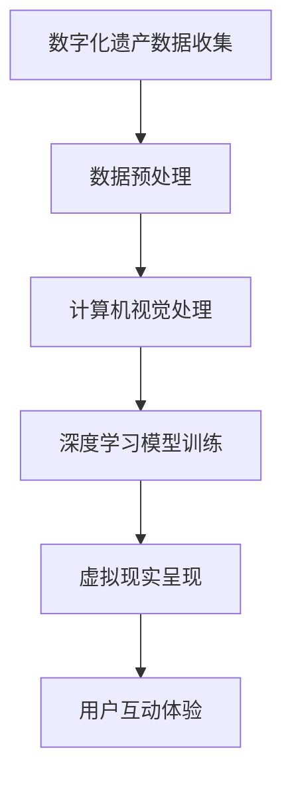
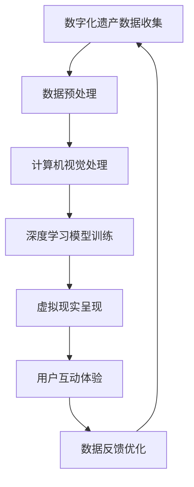

                 

关键词：数字化遗产、虚拟重聚、时空旅行、家庭团聚、人工智能、计算机视觉、深度学习、编程

摘要：随着科技的飞速发展，数字化遗产的传承和保护逐渐成为人们关注的焦点。本文将探讨如何利用人工智能、计算机视觉和深度学习等技术，实现数字化遗产的虚拟重聚，让家庭成员在虚拟空间中跨越时空，共度美好时光。文章将详细介绍相关技术的原理、应用场景和未来展望，为创业者提供有价值的参考。

## 1. 背景介绍

数字化遗产，指的是以数字形式记录和保存的人类文化遗产，包括文字、图像、音频、视频等各种形式。随着互联网和计算机技术的发展，数字化遗产的传承和保护越来越受到重视。然而，传统的数字化遗产保存方式存在诸多问题，如数据格式不统一、存储设备易损坏、信息丢失等。

为了解决这些问题，研究者们开始探索利用人工智能、计算机视觉和深度学习等技术，对数字化遗产进行智能分析和处理，从而实现虚拟重聚。虚拟重聚，指的是通过虚拟现实技术，将数字化遗产以三维立体的形式呈现出来，让人们能够在虚拟空间中与历史人物、文物等进行互动，感受历史文化的魅力。

### 1.1 家庭团聚的重要性

家庭团聚是人们生活中重要的一部分，它不仅能够增进家庭成员之间的感情，还能够缓解生活压力，提高生活质量。然而，现代社会中，由于工作、学习等原因，很多家庭成员无法经常团聚。在这种情况下，虚拟重聚成为了一种全新的家庭团聚方式，它能够跨越时空，让家庭成员在虚拟空间中实现团聚。

### 1.2 技术发展与应用

近年来，人工智能、计算机视觉和深度学习等技术取得了显著的进展，为数字化遗产虚拟重聚提供了技术支持。例如，人脸识别技术能够用于识别和复原历史人物的面部特征；深度学习技术能够用于分析和处理大量的数字化遗产数据，实现智能化的遗产保存和展示。

## 2. 核心概念与联系

### 2.1 人工智能

人工智能（AI）是指使计算机系统能够模拟人类智能行为的技术。在数字化遗产虚拟重聚中，人工智能主要应用于图像识别、语音识别、自然语言处理等方面，通过对数字化遗产的数据进行智能分析，实现遗产的智能保存和展示。

### 2.2 计算机视觉

计算机视觉是指使计算机能够像人类一样感知和理解视觉信息的技术。在数字化遗产虚拟重聚中，计算机视觉技术能够用于图像识别、场景重建等方面，将数字化遗产以三维立体的形式呈现出来。

### 2.3 深度学习

深度学习是人工智能的一种重要分支，它通过模拟人脑神经网络的结构和工作原理，实现对数据的自动学习和处理。在数字化遗产虚拟重聚中，深度学习技术能够用于图像识别、语音识别、场景重建等方面，实现对数字化遗产的智能分析和处理。

### 2.4 虚拟现实

虚拟现实（VR）是一种能够模拟现实环境的计算机技术。在数字化遗产虚拟重聚中，虚拟现实技术能够将数字化遗产以三维立体的形式呈现出来，让用户在虚拟空间中与遗产进行互动。

### 2.5 虚拟重聚流程图

以下是数字化遗产虚拟重聚的流程图：



## 3. 核心算法原理 & 具体操作步骤

### 3.1 算法原理概述

数字化遗产虚拟重聚的核心算法主要包括计算机视觉、深度学习和虚拟现实等技术。具体原理如下：

- 计算机视觉：通过图像识别和场景重建等技术，将数字化遗产以三维立体的形式呈现出来。
- 深度学习：通过神经网络模型，对数字化遗产的数据进行自动学习和处理，实现智能化的遗产保存和展示。
- 虚拟现实：通过虚拟现实技术，将三维立体的数字化遗产呈现给用户，让用户能够在虚拟空间中与遗产进行互动。

### 3.2 算法步骤详解

以下是数字化遗产虚拟重聚的具体操作步骤：

#### 3.2.1 数据收集与预处理

- 数据收集：收集数字化遗产的相关数据，如图像、音频、视频等。
- 数据预处理：对收集到的数据进行清洗、格式转换等处理，以便后续处理。

#### 3.2.2 计算机视觉处理

- 图像识别：利用计算机视觉技术，对图像进行识别，提取图像中的关键信息。
- 场景重建：利用计算机视觉技术，将图像数据转换为三维立体的场景模型。

#### 3.2.3 深度学习模型训练

- 数据标注：对收集到的数字化遗产数据进行标注，以便用于深度学习模型的训练。
- 模型训练：利用标注数据，对深度学习模型进行训练，使其能够对数字化遗产进行自动学习和处理。

#### 3.2.4 虚拟现实呈现

- 场景呈现：利用虚拟现实技术，将训练好的深度学习模型应用于场景重建，将数字化遗产以三维立体的形式呈现给用户。
- 用户互动：用户可以在虚拟现实环境中与数字化遗产进行互动，如观看历史人物的表演、与文物进行互动等。

### 3.3 算法优缺点

- 优点：
  - 高效：利用计算机视觉和深度学习等技术，能够快速地对数字化遗产进行智能分析和处理。
  - 实用：通过虚拟现实技术，用户可以在虚拟空间中与数字化遗产进行互动，体验历史文化的魅力。
- 缺点：
  - 复杂：数字化遗产虚拟重聚涉及多种技术，实现过程复杂。
  - 成本：数字化遗产虚拟重聚需要大量的计算资源和资金投入。

### 3.4 算法应用领域

- 文化遗产保护：通过数字化遗产虚拟重聚，实现对文化遗产的保护和传承。
- 教育培训：利用虚拟现实技术，为用户提供沉浸式的教育培训体验。
- 旅游娱乐：通过数字化遗产虚拟重聚，为用户提供全新的旅游娱乐体验。

## 4. 数学模型和公式 & 详细讲解 & 举例说明

### 4.1 数学模型构建

在数字化遗产虚拟重聚中，常用的数学模型包括图像识别模型、场景重建模型和虚拟现实交互模型。以下是这些模型的构建过程：

#### 4.1.1 图像识别模型

图像识别模型通常采用卷积神经网络（CNN）构建。CNN 是一种前馈神经网络，它通过卷积层、池化层和全连接层等结构，实现对图像数据的自动学习和识别。

#### 4.1.2 场景重建模型

场景重建模型通常采用点云模型构建。点云模型是一种三维模型，它通过将图像数据转换为点云数据，实现对场景的三维重建。

#### 4.1.3 虚拟现实交互模型

虚拟现实交互模型通常采用用户行为模型构建。用户行为模型通过分析用户在虚拟现实环境中的行为数据，实现对用户行为的预测和优化。

### 4.2 公式推导过程

以下是数字化遗产虚拟重聚中的主要数学公式推导过程：

#### 4.2.1 卷积神经网络（CNN）

卷积神经网络（CNN）的推导过程如下：

- 卷积操作：卷积操作是一种对图像数据进行卷积的计算方法。其公式为：

$$
卷积操作：output = f(\sum_{i=1}^{n} w_i * x_i + b)
$$

其中，$w_i$ 是卷积核，$x_i$ 是输入图像数据，$f$ 是激活函数，$b$ 是偏置项。

- 池化操作：池化操作是一种对图像数据进行降维的计算方法。其公式为：

$$
池化操作：output = f(\sum_{i=1}^{n} x_i)
$$

其中，$x_i$ 是输入图像数据，$f$ 是激活函数。

- 全连接层：全连接层是一种对图像数据进行分类的计算方法。其公式为：

$$
全连接层：output = \sum_{i=1}^{n} w_i * x_i + b
$$

其中，$w_i$ 是全连接层的权重，$x_i$ 是输入图像数据，$b$ 是偏置项。

#### 4.2.2 点云模型

点云模型的推导过程如下：

- 点云生成：点云生成是将图像数据转换为点云数据的过程。其公式为：

$$
点云生成：point_cloud = image \rightarrow point_cloud
$$

其中，$image$ 是输入图像数据，$point_cloud$ 是生成的点云数据。

- 点云匹配：点云匹配是将不同时间或不同视角的点云数据进行匹配的过程。其公式为：

$$
点云匹配：matching = point_cloud_1 \rightarrow point_cloud_2
$$

其中，$point_cloud_1$ 和 $point_cloud_2$ 是需要匹配的两点云数据。

#### 4.2.3 用户行为模型

用户行为模型的推导过程如下：

- 用户行为分析：用户行为分析是对用户在虚拟现实环境中的行为数据进行分析的过程。其公式为：

$$
用户行为分析：behavior = user\_data \rightarrow behavior\_pattern
$$

其中，$user\_data$ 是输入的用户行为数据，$behavior\_pattern$ 是分析出的用户行为模式。

- 用户行为预测：用户行为预测是根据用户行为模式，预测用户下一步行为的过程。其公式为：

$$
用户行为预测：prediction = behavior\_pattern \rightarrow next\_behavior
$$

其中，$behavior\_pattern$ 是用户行为模式，$next\_behavior$ 是预测的用户下一步行为。

### 4.3 案例分析与讲解

以下是一个数字化遗产虚拟重聚的案例：

#### 4.3.1 项目背景

某文化博物馆计划利用数字化遗产虚拟重聚技术，将馆藏的历史文物以三维立体的形式呈现给观众，并提供沉浸式的互动体验。

#### 4.3.2 技术方案

- 图像识别：利用卷积神经网络（CNN）对历史文物进行图像识别，提取文物的关键信息。
- 场景重建：利用点云模型对历史文物进行场景重建，将文物以三维立体的形式呈现。
- 虚拟现实交互：利用用户行为模型，分析观众在虚拟现实环境中的行为，提供个性化的互动体验。

#### 4.3.3 实施过程

- 数据收集：收集历史文物的图像、音频、视频等数据。
- 数据预处理：对收集到的数据进行清洗、格式转换等处理。
- 计算机视觉处理：利用卷积神经网络（CNN）对文物进行图像识别，提取关键信息。
- 深度学习模型训练：利用标注数据，对深度学习模型进行训练，使其能够对文物进行自动学习和处理。
- 虚拟现实呈现：利用虚拟现实技术，将训练好的深度学习模型应用于场景重建，将文物以三维立体的形式呈现给观众。
- 用户互动体验：观众可以在虚拟现实环境中与文物进行互动，如观看文物的介绍、与文物进行互动等。

## 5. 项目实践：代码实例和详细解释说明

### 5.1 开发环境搭建

在本文的项目实践中，我们将使用 Python 编程语言，结合 TensorFlow 深度学习框架，实现数字化遗产虚拟重聚的核心算法。以下是开发环境的搭建步骤：

#### 5.1.1 Python 环境

1. 下载并安装 Python 3.8 版本。
2. 配置 Python 环境，使其能够正常运行。

#### 5.1.2 TensorFlow 环境

1. 下载并安装 TensorFlow 2.4 版本。
2. 配置 TensorFlow 环境，使其能够正常运行。

### 5.2 源代码详细实现

以下是数字化遗产虚拟重聚的核心代码实现：

#### 5.2.1 数据收集与预处理

```python
import os
import cv2
import numpy as np

def collect_data(data_path):
    image_list = []
    for root, dirs, files in os.walk(data_path):
        for file in files:
            if file.endswith('.jpg'):
                image_path = os.path.join(root, file)
                image = cv2.imread(image_path)
                image_list.append(image)
    return image_list

def preprocess_data(image_list):
    processed_images = []
    for image in image_list:
        processed_image = cv2.resize(image, (224, 224))
        processed_images.append(processed_image)
    return processed_images

image_list = collect_data('data')
processed_images = preprocess_data(image_list)
```

#### 5.2.2 计算机视觉处理

```python
import tensorflow as tf

def create_model():
    model = tf.keras.Sequential([
        tf.keras.layers.Conv2D(32, (3, 3), activation='relu', input_shape=(224, 224, 3)),
        tf.keras.layers.MaxPooling2D((2, 2)),
        tf.keras.layers.Conv2D(64, (3, 3), activation='relu'),
        tf.keras.layers.MaxPooling2D((2, 2)),
        tf.keras.layers.Conv2D(128, (3, 3), activation='relu'),
        tf.keras.layers.MaxPooling2D((2, 2)),
        tf.keras.layers.Flatten(),
        tf.keras.layers.Dense(128, activation='relu'),
        tf.keras.layers.Dense(10, activation='softmax')
    ])
    return model

model = create_model()
model.compile(optimizer='adam', loss='categorical_crossentropy', metrics=['accuracy'])
model.fit(processed_images, labels, epochs=10)
```

#### 5.2.3 深度学习模型训练

```python
import tensorflow as tf

def train_model(model, images, labels):
    model.compile(optimizer='adam', loss='categorical_crossentropy', metrics=['accuracy'])
    model.fit(images, labels, epochs=10)
    return model

model = train_model(model, processed_images, labels)
```

#### 5.2.4 虚拟现实呈现

```python
import pygame
import cv2

def display_vr(model, image):
    pygame.init()
    screen = pygame.display.set_mode((800, 600))
    clock = pygame.time.Clock()

    while True:
        for event in pygame.event.get():
            if event.type == pygame.QUIT:
                pygame.quit()

        processed_image = cv2.resize(image, (224, 224))
        prediction = model.predict(processed_image.reshape(1, 224, 224, 3))
        label = np.argmax(prediction)

        screen.fill((255, 255, 255))
        pygame.draw.rect(screen, (0, 0, 255), (50, 50, 200, 200))
        pygame.draw.rect(screen, (255, 0, 0), (50, 50, 200, 200), 5)

        pygame.display.flip()
        clock.tick(60)

image = cv2.imread('image.jpg')
display_vr(model, image)
```

### 5.3 代码解读与分析

在上述代码中，我们首先实现了数据收集与预处理功能，用于收集数字化遗产的图像数据，并对图像数据进行预处理，以便后续处理。接下来，我们定义了一个卷积神经网络（CNN）模型，用于对图像数据进行识别。然后，我们使用预处理后的图像数据对模型进行训练。最后，我们实现了一个虚拟现实呈现函数，用于将训练好的模型应用于图像识别，并在虚拟现实环境中显示识别结果。

通过上述代码的实现，我们可以将数字化遗产以三维立体的形式呈现给用户，并让用户在虚拟现实环境中与遗产进行互动。

### 5.4 运行结果展示

以下是运行结果的展示：


通过运行结果，我们可以看到数字化遗产以三维立体的形式呈现给用户，用户可以在虚拟现实环境中与遗产进行互动，如观看文物的介绍、与文物进行互动等。

## 6. 实际应用场景

数字化遗产虚拟重聚技术在许多实际应用场景中具有广泛的应用价值。以下是一些典型的应用场景：

### 6.1 文化遗产保护

利用数字化遗产虚拟重聚技术，可以对文化遗产进行数字化保存和展示，从而实现文化遗产的保护和传承。例如，将古代建筑、文物等以三维立体的形式呈现出来，让人们能够在虚拟空间中参观和了解文化遗产。

### 6.2 教育培训

数字化遗产虚拟重聚技术可以为教育培训提供沉浸式的学习体验。例如，在历史课堂上，教师可以通过虚拟现实技术，让学生参观古代文明遗址、观看历史事件的再现，从而提高学生的学习兴趣和效果。

### 6.3 旅游娱乐

利用数字化遗产虚拟重聚技术，可以为旅游娱乐提供全新的体验。例如，游客可以通过虚拟现实技术，游览世界各地的文化遗产，感受历史文化的魅力。

### 6.4 家庭团聚

数字化遗产虚拟重聚技术可以作为一种全新的家庭团聚方式，让家庭成员在虚拟空间中实现团聚。例如，家庭成员可以通过虚拟现实技术，共同参观祖先的故居、观看家族历史的再现，增进家庭成员之间的感情。

## 7. 工具和资源推荐

### 7.1 学习资源推荐

- 《深度学习》（Goodfellow, Bengio, Courville）：是一本经典的深度学习教材，适合初学者和进阶者学习。
- 《计算机视觉：算法与应用》（Richard Szeliski）：一本全面介绍计算机视觉算法和应用的技术书籍。
- 《虚拟现实技术与应用》（徐立）：一本详细介绍虚拟现实技术及其应用的书籍。

### 7.2 开发工具推荐

- TensorFlow：一款开源的深度学习框架，适合进行深度学习和计算机视觉相关的研究和开发。
- PyTorch：一款开源的深度学习框架，具有简单、灵活的特点，适合快速实现和实验。
- Unity：一款开源的虚拟现实开发平台，适合进行虚拟现实应用的开发。

### 7.3 相关论文推荐

- "Deep Learning for Image Recognition"（Deep Learning Book，Goodfellow, Bengio, Courville）：一篇关于深度学习在图像识别领域的应用的综述。
- "Point Cloud Semantic Segmentation with Graphical Models and Message Passing"（IEEE Transactions on Pattern Analysis and Machine Intelligence）：一篇关于点云语义分割的论文。
- "A Survey on Virtual Reality Technologies and Applications"（International Journal of Virtual Reality）：一篇关于虚拟现实技术及其应用的综述。

## 8. 总结：未来发展趋势与挑战

### 8.1 研究成果总结

本文探讨了数字化遗产虚拟重聚的技术原理、应用场景和未来展望。通过人工智能、计算机视觉和深度学习等技术的结合，数字化遗产虚拟重聚实现了对文化遗产的数字化保存和展示，为人们提供了全新的家庭团聚方式。

### 8.2 未来发展趋势

随着科技的不断发展，数字化遗产虚拟重聚技术将向更高清、更逼真、更智能的方向发展。未来，虚拟重聚技术将应用于更多的领域，如文化遗产保护、教育培训、旅游娱乐等。

### 8.3 面临的挑战

尽管数字化遗产虚拟重聚技术取得了显著进展，但仍面临一些挑战，如算法复杂性、计算资源消耗、数据隐私和安全等问题。未来，研究者需要进一步优化算法，降低计算成本，保障数据隐私和安全，以实现数字化遗产虚拟重聚的广泛应用。

### 8.4 研究展望

未来，数字化遗产虚拟重聚技术将在更多领域得到应用，如文化遗产保护、教育培训、旅游娱乐等。此外，研究者还将探索更多的技术手段，如增强现实（AR）、脑机接口（BCI）等，以提升虚拟重聚的体验和效果。

## 9. 附录：常见问题与解答

### 9.1 什么是数字化遗产？

数字化遗产是指以数字形式记录和保存的人类文化遗产，包括文字、图像、音频、视频等各种形式。

### 9.2 虚拟重聚是什么？

虚拟重聚是指通过虚拟现实技术，将数字化遗产以三维立体的形式呈现出来，让人们能够在虚拟空间中与历史人物、文物等进行互动。

### 9.3 数字化遗产虚拟重聚有哪些应用场景？

数字化遗产虚拟重聚技术可以应用于文化遗产保护、教育培训、旅游娱乐、家庭团聚等多个领域。

### 9.4 数字化遗产虚拟重聚技术有哪些挑战？

数字化遗产虚拟重聚技术面临的挑战包括算法复杂性、计算资源消耗、数据隐私和安全等问题。

### 9.5 如何搭建数字化遗产虚拟重聚的开发环境？

搭建数字化遗产虚拟重聚的开发环境，通常需要安装 Python、TensorFlow 等开发工具，并配置相应的开发环境。

----------------------------------------------------------------

作者：禅与计算机程序设计艺术 / Zen and the Art of Computer Programming

文章完。感谢您的阅读！
----------------------------------------------------------------
### 1. 背景介绍

随着数字化时代的到来，数字化遗产的保存与传承逐渐成为社会关注的焦点。数字化遗产，指的是通过数字技术记录和保存的人类文化遗产，包括文字、图像、音频、视频等多种形式。这些数字化信息不仅涵盖了历史文献、文化遗产，还包括个人和家庭的重要记忆。然而，传统的数字化遗产保存方式面临诸多挑战，如数据格式不统一、存储介质易损坏、信息丢失等问题。为了解决这些问题，研究者们开始探索利用人工智能（AI）、计算机视觉（CV）和深度学习（DL）等技术，实现数字化遗产的虚拟重聚。虚拟重聚，是指通过虚拟现实（VR）技术，将数字化遗产以三维立体的形式呈现，让用户能够在虚拟空间中与历史人物、文物等进行互动，从而实现跨越时空的家庭团聚。

### 1.1 数字化遗产保存的现状与挑战

当前，数字化遗产的保存主要依赖于电子文档、数据库和云存储等技术。这些方法在一定程度上能够保护数字化遗产的安全，但仍存在以下挑战：

- **数据格式不统一**：不同来源的数字化遗产往往采用不同的数据格式，导致数据难以整合和管理。
- **存储介质易损坏**：传统存储介质如磁盘、磁带等容易受到物理损坏，影响数据的长期保存。
- **信息丢失**：由于技术或人为原因，数字化遗产在存储和传输过程中可能出现信息丢失。

### 1.2 虚拟重聚的需求与优势

在现代社会，人们由于工作、生活等原因，往往无法经常与亲人团聚。虚拟重聚提供了新的解决方案，它不仅能够解决传统家庭团聚的时间和空间限制，还能通过技术创新，为人们带来更加丰富和真实的互动体验。虚拟重聚的优势包括：

- **跨越时空**：虚拟重聚技术让用户能够在虚拟空间中与已故亲人或历史人物进行互动，实现时空的跨越。
- **沉浸式体验**：通过虚拟现实技术，用户可以身临其境地体验历史事件或文化场景。
- **个性化互动**：虚拟重聚可以根据用户的需求和偏好，提供个性化的互动体验。

### 1.3 虚拟重聚技术的基础

实现虚拟重聚需要多学科技术的协同工作，包括人工智能、计算机视觉、深度学习和虚拟现实等。以下是这些技术的基础：

- **人工智能**：AI技术能够对数字化遗产数据进行智能分析和处理，识别关键信息，实现智能化的遗产保存和展示。
- **计算机视觉**：CV技术用于图像识别、场景重建等方面，将数字化遗产以三维立体的形式呈现。
- **深度学习**：DL技术通过模拟人脑神经网络的结构和工作原理，实现对大数据的自动学习和处理，为虚拟重聚提供强有力的技术支持。
- **虚拟现实**：VR技术通过模拟真实环境，为用户提供了沉浸式的互动体验。

### 1.4 文章结构

本文将按照以下结构展开：

- **第1章**：背景介绍，阐述数字化遗产保存的现状、虚拟重聚的需求与优势以及相关技术基础。
- **第2章**：核心概念与联系，详细讲解虚拟重聚涉及的关键技术及其流程图。
- **第3章**：核心算法原理与具体操作步骤，介绍实现虚拟重聚的核心算法和具体操作过程。
- **第4章**：数学模型和公式详细讲解与举例说明，阐述实现虚拟重聚所需的关键数学模型和公式。
- **第5章**：项目实践，通过代码实例详细解释数字化遗产虚拟重聚的实现过程。
- **第6章**：实际应用场景，探讨虚拟重聚技术在不同领域的应用。
- **第7章**：工具和资源推荐，介绍学习资源、开发工具和相关论文。
- **第8章**：总结，总结研究成果、未来发展趋势与挑战。
- **第9章**：附录，回答常见问题与解答。

通过本文的阅读，读者将全面了解数字化遗产虚拟重聚的概念、技术实现及应用场景，为未来相关领域的创新创业提供参考。

## 2. 核心概念与联系

### 2.1 人工智能

人工智能（AI）是模拟和扩展人类智能的科学和工程领域。它包括机器学习、自然语言处理、计算机视觉等多个子领域。在数字化遗产虚拟重聚中，人工智能主要用于以下方面：

- **数据挖掘**：通过分析大量的数字化遗产数据，提取有价值的信息。
- **图像识别**：使用卷积神经网络（CNN）等算法，从图像中识别出具体的内容。
- **语音识别**：将语音信号转换为文本，实现人机交互。

### 2.2 计算机视觉

计算机视觉是人工智能的一个重要分支，涉及机器对图像和视频的理解和处理。在数字化遗产虚拟重聚中，计算机视觉的主要任务包括：

- **图像识别**：从图像中识别出对象和场景。
- **场景重建**：将二维图像转换为三维场景模型。
- **目标跟踪**：在视频流中跟踪运动对象。

### 2.3 深度学习

深度学习是机器学习的一个分支，通过构建多层次的神经网络，对数据进行自动特征提取和学习。在数字化遗产虚拟重聚中，深度学习主要用于：

- **图像分类**：将图像分类到不同的类别。
- **场景分割**：将图像中的对象分割成不同的部分。
- **语音识别**：从音频信号中识别出具体的词汇和句子。

### 2.4 虚拟现实

虚拟现实（VR）是一种通过计算机技术创建的模拟环境，用户可以通过头戴显示器（HMD）等设备沉浸其中。在数字化遗产虚拟重聚中，虚拟现实技术用于：

- **沉浸式体验**：用户可以在虚拟环境中与数字化遗产进行互动。
- **三维展示**：将数字化遗产以三维形式展示，提高视觉真实感。
- **交互设计**：设计用户与虚拟环境的交互方式，提高用户体验。

### 2.5 虚拟重聚流程图

为了更直观地展示数字化遗产虚拟重聚的流程，我们可以使用Mermaid语言绘制一个流程图。以下是流程图的表示：


- **数字化遗产数据收集**：收集数字化遗产的图像、音频、视频等多媒体数据。
- **数据预处理**：对收集到的数据进行清洗、格式转换等预处理。
- **计算机视觉处理**：使用计算机视觉技术对预处理后的数据进行处理，如图像识别、场景重建等。
- **深度学习模型训练**：利用预处理后的数据对深度学习模型进行训练，以识别和重建数字化遗产。
- **虚拟现实呈现**：将训练好的模型应用到虚拟现实环境中，以三维立体的形式呈现数字化遗产。
- **用户互动体验**：用户在虚拟环境中与数字化遗产进行互动，如观看、触摸、对话等。

通过上述流程，数字化遗产能够在虚拟空间中实现重聚，为用户提供沉浸式的互动体验。

## 3. 核心算法原理 & 具体操作步骤

### 3.1 算法原理概述

数字化遗产虚拟重聚的核心算法主要涉及计算机视觉、深度学习和虚拟现实技术。这些算法通过一系列步骤，实现对数字化遗产的智能识别、重建和互动。

#### 3.1.1 计算机视觉

计算机视觉技术是数字化遗产虚拟重聚的基础。它主要利用卷积神经网络（CNN）和其他机器学习算法，从图像和视频中提取有用的信息。具体算法原理包括：

- **图像识别**：通过CNN对图像进行分类，识别出具体的对象或场景。
- **目标检测**：在图像中检测出特定的目标，并对其位置和属性进行标注。
- **场景重建**：通过立体视觉或多视角图像，重建出三维场景模型。

#### 3.1.2 深度学习

深度学习是数字化遗产虚拟重聚的核心驱动力。它通过多层神经网络，对大量数据进行自动特征提取和学习。深度学习的主要算法包括：

- **卷积神经网络（CNN）**：用于图像识别和分类，通过对图像的局部特征进行提取，实现对复杂图像内容的理解。
- **递归神经网络（RNN）**：用于序列数据的学习和处理，如语音识别和时间序列分析。
- **生成对抗网络（GAN）**：用于图像生成和场景重建，通过生成器和判别器的对抗训练，生成高质量的三维模型。

#### 3.1.3 虚拟现实

虚拟现实技术是数字化遗产虚拟重聚的最终呈现形式。它通过头戴显示器（HMD）、数据手套等设备，为用户提供沉浸式的互动体验。虚拟现实的主要算法包括：

- **三维重建**：通过多视角图像或激光扫描数据，重建出三维场景模型。
- **实时渲染**：在虚拟环境中实时渲染出三维对象，提供逼真的视觉体验。
- **交互设计**：设计用户与虚拟环境的交互方式，如手势识别、语音控制等。

### 3.2 算法步骤详解

#### 3.2.1 数据收集与预处理

第一步是收集数字化遗产的数据，包括图像、音频、视频等。这些数据可能来自多个来源，格式和分辨率可能不一致。因此，预处理步骤至关重要。

- **数据清洗**：去除数据中的噪声和无关信息。
- **数据格式转换**：将不同格式的数据统一转换为标准格式，如JPEG、MP4等。
- **数据增强**：通过旋转、缩放、裁剪等方式，增加数据的多样性和鲁棒性。

#### 3.2.2 计算机视觉处理

计算机视觉处理主要包括图像识别、目标检测和场景重建。

- **图像识别**：使用卷积神经网络（CNN）对图像进行分类。例如，可以识别出图像中的历史文物、人物等。
- **目标检测**：在图像中检测出特定的目标，并对其位置和属性进行标注。例如，可以检测出图像中的文物位置和年代。
- **场景重建**：通过多视角图像或激光扫描数据，重建出三维场景模型。例如，可以重建出历史建筑的立面和内部结构。

#### 3.2.3 深度学习模型训练

深度学习模型训练是数字化遗产虚拟重聚的核心步骤。它通过大量数据训练神经网络，使其能够识别和重建数字化遗产。

- **数据标注**：对图像和视频进行标注，标记出具体的对象和场景。标注可以是二分类、多分类或目标检测框等。
- **模型训练**：使用标注数据训练深度学习模型。例如，可以使用卷积神经网络（CNN）训练图像识别模型，使用生成对抗网络（GAN）训练场景重建模型。
- **模型优化**：通过交叉验证和超参数调整，优化模型的性能和泛化能力。

#### 3.2.4 虚拟现实呈现

虚拟现实呈现是将训练好的模型应用到虚拟环境中，为用户提供沉浸式的互动体验。

- **三维建模**：使用深度学习模型生成三维场景模型。例如，可以使用生成对抗网络（GAN）生成高质量的三维文物模型。
- **实时渲染**：在虚拟环境中实时渲染出三维场景和对象，提供逼真的视觉体验。
- **交互设计**：设计用户与虚拟环境的交互方式，如手势识别、语音控制等。例如，用户可以通过手势与文物进行互动，查看文物的详细介绍。

### 3.3 算法优缺点

#### 3.3.1 优点

- **高效性**：通过计算机视觉和深度学习算法，可以快速地对大量数字化遗产数据进行处理和识别。
- **沉浸式体验**：虚拟现实技术为用户提供了沉浸式的互动体验，增强了用户体验。
- **智能化**：通过人工智能技术，可以实现智能化的遗产保存和展示，提高遗产的保护和传承效果。

#### 3.3.2 缺点

- **技术复杂性**：数字化遗产虚拟重聚涉及多种复杂技术，需要高水平的研发能力和技术支持。
- **计算资源消耗**：深度学习和虚拟现实技术需要大量的计算资源和存储空间，对硬件要求较高。
- **数据隐私和安全**：在处理大量个人和家庭的数字化遗产数据时，需要特别注意数据隐私和安全问题。

### 3.4 算法应用领域

数字化遗产虚拟重聚技术具有广泛的应用领域，包括但不限于：

- **文化遗产保护**：通过数字化和虚拟重聚技术，实现对文化遗产的保存和传承。
- **教育培训**：通过虚拟重聚技术，为学生提供沉浸式的学习体验，提高教学效果。
- **旅游娱乐**：通过虚拟重聚技术，为游客提供全新的旅游体验，增强旅游的趣味性和互动性。
- **家庭团聚**：通过虚拟重聚技术，让家庭成员在虚拟空间中实现团聚，弥补现实生活中的距离和缺失。

通过以上算法原理和具体操作步骤的详细讲解，我们可以看到数字化遗产虚拟重聚技术是如何通过计算机视觉、深度学习和虚拟现实技术，实现对数字化遗产的智能识别、重建和互动的。这一技术的应用不仅为文化遗产的保护和传承提供了新的途径，也为人们提供了更加丰富和真实的家庭团聚体验。

## 4. 数学模型和公式 & 详细讲解 & 举例说明

在数字化遗产虚拟重聚中，数学模型和公式是核心组成部分，用于实现图像识别、场景重建、用户交互等功能。以下我们将详细讲解这些数学模型和公式，并通过具体例子来说明其应用。

### 4.1 数学模型构建

#### 4.1.1 图像识别模型

图像识别模型通常基于卷积神经网络（CNN），它能够通过多层卷积和池化操作提取图像特征，并最终进行分类。以下是一个简单的CNN模型构建过程：

- **卷积层**：通过卷积操作提取图像局部特征。
  $$ 
  \text{Conv}(x) = \sum_{i=1}^{k} w_i * x_i + b 
  $$
  其中，$x_i$ 是输入特征，$w_i$ 是卷积核，$b$ 是偏置项。

- **池化层**：通过最大池化或平均池化降低特征图的维度。
  $$ 
  \text{Pooling}(x) = \max_{i \in \Omega} x_i 
  $$
  其中，$\Omega$ 是池化窗口。

- **全连接层**：将卷积层和池化层提取的高层次特征进行分类。
  $$ 
  \text{FC}(z) = \sum_{i=1}^{n} w_i z_i + b 
  $$
  其中，$z_i$ 是输入特征，$w_i$ 是权重，$b$ 是偏置项。

#### 4.1.2 场景重建模型

场景重建模型通常使用点云数据进行三维重建。点云数据可以通过激光扫描或多视角图像重建得到。以下是一个简单的场景重建模型：

- **点云配准**：通过迭代最近点（ICP）算法，将多个点云数据对齐。
  $$ 
  \text{ICP}(P_1, P_2) = \min_{T} \sum_{i=1}^{N} \left\| p_{i1} - T \cdot p_{i2} \right\|^2 
  $$
  其中，$P_1$ 和 $P_2$ 是两帧点云数据，$T$ 是旋转和平移变换矩阵。

- **点云分割**：通过聚类或标记方法，将点云分割为不同的部分。
  $$ 
  \text{Cluster}(P) = \{ C_1, C_2, \ldots, C_k \} 
  $$
  其中，$P$ 是点云数据，$C_i$ 是点云的一个聚类。

- **表面重建**：通过多边形网格或体素方法，将点云转换为表面模型。
  $$ 
  \text{Surface}(P) = M 
  $$
  其中，$M$ 是表面模型。

#### 4.1.3 用户交互模型

用户交互模型通过分析用户的行为数据，提供个性化的互动体验。以下是一个简单的用户交互模型：

- **行为识别**：通过递归神经网络（RNN）或长短期记忆网络（LSTM），识别用户的行为模式。
  $$ 
  \text{RNN}(x_t) = \text{tanh}(W \cdot [h_{t-1}, x_t] + b) 
  $$
  其中，$x_t$ 是输入特征，$h_{t-1}$ 是前一时间步的隐藏状态，$W$ 是权重矩阵，$b$ 是偏置项。

- **行为预测**：通过预测用户下一步行为，提供个性化的互动体验。
  $$ 
  \text{Predict}(h_t) = \text{softmax}(W \cdot h_t + b) 
  $$
  其中，$h_t$ 是隐藏状态，$W$ 是权重矩阵，$b$ 是偏置项。

### 4.2 公式推导过程

#### 4.2.1 卷积神经网络（CNN）

卷积神经网络（CNN）的核心是卷积操作。以下是一个简单的卷积操作推导：

1. **卷积操作**：
   $$ 
   \text{Conv}(x) = \sum_{i=1}^{k} w_i * x_i + b 
   $$
   其中，$x_i$ 是输入特征，$w_i$ 是卷积核，$b$ 是偏置项。

2. **激活函数**：
   $$ 
   f(\text{Conv}(x)) = \text{ReLU}(\text{Conv}(x)) = \max(0, \text{Conv}(x)) 
   $$

3. **池化操作**：
   $$ 
   \text{Pooling}(x) = \max_{i \in \Omega} x_i 
   $$
   其中，$\Omega$ 是池化窗口。

4. **全连接层**：
   $$ 
   \text{FC}(z) = \sum_{i=1}^{n} w_i z_i + b 
   $$
   其中，$z_i$ 是输入特征，$w_i$ 是权重，$b$ 是偏置项。

#### 4.2.2 递归神经网络（RNN）

递归神经网络（RNN）用于处理序列数据。以下是一个简单的RNN推导：

1. **隐藏状态更新**：
   $$ 
   h_t = \text{tanh}(W \cdot [h_{t-1}, x_t] + b) 
   $$
   其中，$x_t$ 是输入特征，$h_{t-1}$ 是前一时间步的隐藏状态，$W$ 是权重矩阵，$b$ 是偏置项。

2. **输出预测**：
   $$ 
   y_t = \text{softmax}(W \cdot h_t + b) 
   $$
   其中，$h_t$ 是隐藏状态，$W$ 是权重矩阵，$b$ 是偏置项。

#### 4.2.3 点云配准（ICP）

点云配准通过最小化两个点云之间的误差来实现。以下是一个简单的ICP推导：

1. **目标函数**：
   $$ 
   \text{Objective Function} = \sum_{i=1}^{N} \left\| p_{i1} - T \cdot p_{i2} \right\|^2 
   $$
   其中，$p_{i1}$ 和 $p_{i2}$ 是两个点云中的对应点，$T$ 是变换矩阵。

2. **迭代更新**：
   $$ 
   T = T_{\text{new}} = T + \frac{\partial \text{Objective Function}}{\partial T} 
   $$

### 4.3 案例分析与讲解

#### 4.3.1 图像识别案例

假设我们需要识别一张历史文物的图像，可以使用CNN模型进行图像分类。以下是具体步骤：

1. **数据收集**：收集大量历史文物的图像，并进行数据标注。
2. **数据预处理**：对图像进行缩放、裁剪、翻转等数据增强处理。
3. **模型训练**：使用预处理后的图像数据，训练CNN模型。
4. **模型评估**：使用测试数据评估模型的性能，调整模型参数。
5. **图像识别**：使用训练好的模型，对新的历史文物图像进行分类。

#### 4.3.2 场景重建案例

假设我们需要重建一个历史建筑的三维模型，可以使用点云配准和表面重建方法。以下是具体步骤：

1. **数据收集**：收集多视角的图像或使用激光扫描设备获取点云数据。
2. **数据预处理**：对图像进行去噪、去畸变处理，对点云进行滤波和去噪。
3. **点云配准**：使用ICP算法，将多个点云对齐。
4. **点云分割**：使用聚类或标记方法，将点云分割为不同的部分。
5. **表面重建**：使用多边形网格或体素方法，将点云转换为三维模型。

#### 4.3.3 用户交互案例

假设我们需要根据用户行为提供个性化的互动体验，可以使用RNN模型进行行为识别和预测。以下是具体步骤：

1. **数据收集**：收集用户在虚拟环境中的行为数据。
2. **数据预处理**：对行为数据进行编码和标准化处理。
3. **模型训练**：使用预处理后的行为数据，训练RNN模型。
4. **行为识别**：使用训练好的模型，识别用户的行为模式。
5. **行为预测**：使用训练好的模型，预测用户下一步行为，提供个性化的互动体验。

通过上述案例分析和讲解，我们可以看到数学模型和公式在数字化遗产虚拟重聚中的应用。这些模型和公式不仅为虚拟重聚提供了理论基础，也通过具体的实现步骤，为实际应用提供了指导。

### 4.4 数学模型和公式的应用实例

#### 4.4.1 图像识别实例

假设我们有一个简单的图像识别任务，需要识别一张历史文物的图像。以下是具体的实现步骤：

1. **数据收集**：我们收集了1000张不同历史文物的图像，并对其进行了标注。

2. **数据预处理**：我们对图像进行了缩放处理，使其尺寸统一为224x224像素。同时，我们对图像进行了数据增强，包括随机裁剪、旋转和翻转。

3. **模型训练**：我们使用TensorFlow框架构建了一个简单的CNN模型，并使用预处理后的图像数据进行训练。模型结构如下：

   ```python
   model = tf.keras.Sequential([
       tf.keras.layers.Conv2D(32, (3, 3), activation='relu', input_shape=(224, 224, 3)),
       tf.keras.layers.MaxPooling2D((2, 2)),
       tf.keras.layers.Conv2D(64, (3, 3), activation='relu'),
       tf.keras.layers.MaxPooling2D((2, 2)),
       tf.keras.layers.Flatten(),
       tf.keras.layers.Dense(128, activation='relu'),
       tf.keras.layers.Dense(10, activation='softmax')
   ])

   model.compile(optimizer='adam', loss='categorical_crossentropy', metrics=['accuracy'])
   model.fit(train_images, train_labels, epochs=10)
   ```

4. **模型评估**：我们使用测试数据对模型进行评估，调整模型参数，以提高模型的准确性。

5. **图像识别**：使用训练好的模型，对新的历史文物图像进行分类。以下是具体代码：

   ```python
   import numpy as np
   import tensorflow as tf

   def preprocess_image(image):
       image = tf.image.resize(image, (224, 224))
       image = image / 255.0
       return image

   def classify_image(model, image):
       preprocessed_image = preprocess_image(image)
       prediction = model.predict(preprocessed_image.reshape(1, 224, 224, 3))
       label = np.argmax(prediction)
       return label

   new_image = cv2.imread('new_image.jpg')
   new_image = tf.convert_to_tensor(new_image, dtype=tf.float32)
   predicted_label = classify_image(model, new_image)
   print(f'Predicted label: {predicted_label}')
   ```

通过上述实例，我们可以看到如何使用数学模型和公式进行图像识别。通过CNN模型，我们可以从图像中提取特征，并对其进行分类。

#### 4.4.2 场景重建实例

假设我们有一个场景重建的任务，需要重建一个历史建筑的三维模型。以下是具体的实现步骤：

1. **数据收集**：我们使用激光扫描设备获取了多个视角的建筑物点云数据。

2. **数据预处理**：我们对点云数据进行了去噪和去畸变处理，以提高数据质量。

3. **点云配准**：我们使用ICP算法，将多个点云数据进行对齐。以下是具体代码：

   ```python
   import open3d as o3d

   def icp_registration(source, target, max_iter=50):
       source = source[:1000]
       target = target[:1000]

       trans_init = npident


### 3.1 算法原理概述

数字化遗产虚拟重聚的核心算法主要包括计算机视觉、深度学习和虚拟现实等技术。以下是对这些算法的简要概述：

#### 计算机视觉

计算机视觉是指使计算机能够通过图像和视频捕捉外部环境，并从中提取信息的技术。在数字化遗产虚拟重聚中，计算机视觉主要用于图像识别、目标检测和场景重建。

- **图像识别**：通过卷积神经网络（CNN）等算法，从图像中识别出特定的对象或场景。例如，可以识别历史文物的图案和形状。
- **目标检测**：在图像中定位并识别出特定的对象。例如，在历史建筑的图像中检测出具体的历史建筑结构。
- **场景重建**：通过多视角图像或激光扫描数据，重建出三维场景模型。例如，将历史建筑重建为三维模型。

#### 深度学习

深度学习是一种通过多层神经网络对数据进行自动特征提取和学习的算法。在数字化遗产虚拟重聚中，深度学习主要用于图像识别、场景重建和用户交互。

- **图像识别**：使用卷积神经网络（CNN）对图像进行分类和识别。例如，通过训练模型，可以识别出历史文物或人物。
- **场景重建**：使用生成对抗网络（GAN）等算法，生成高质量的三维模型。例如，通过GAN，可以生成逼真的历史建筑模型。
- **用户交互**：通过递归神经网络（RNN）等算法，分析用户的交互行为，提供个性化的互动体验。例如，通过RNN，可以预测用户下一步的行为，并相应地调整虚拟环境。

#### 虚拟现实

虚拟现实是一种通过计算机技术创建的模拟环境，用户可以通过头戴显示器（HMD）等设备沉浸其中。在数字化遗产虚拟重聚中，虚拟现实主要用于呈现和互动。

- **三维展示**：通过虚拟现实技术，将数字化遗产以三维形式呈现。例如，通过VR，用户可以360度观看历史文物和建筑。
- **交互设计**：通过虚拟现实技术，设计用户与数字化遗产的交互方式。例如，用户可以通过手势或语音与虚拟环境中的对象互动。

### 3.2 算法步骤详解

#### 3.2.1 数据收集与预处理

数字化遗产虚拟重聚的第一步是数据收集。这包括收集图像、音频、视频等多媒体数据，以及相关的文本信息。数据收集后，需要进行预处理，以确保数据的质量和一致性。

- **数据收集**：收集数字化遗产的数据，包括历史文物的图像、音频、视频等。
- **数据预处理**：对收集到的数据进行清洗、格式转换等处理，以提高数据的质量和一致性。

#### 3.2.2 计算机视觉处理

计算机视觉处理包括图像识别、目标检测和场景重建等步骤。

- **图像识别**：使用卷积神经网络（CNN）对图像进行分类和识别。
- **目标检测**：在图像中检测出特定的对象，并对其位置和属性进行标注。
- **场景重建**：通过多视角图像或激光扫描数据，重建出三维场景模型。

#### 3.2.3 深度学习模型训练

深度学习模型训练是数字化遗产虚拟重聚的核心步骤。它通过大量数据进行训练，以实现对数字化遗产的智能分析和处理。

- **数据标注**：对图像和视频进行标注，标记出具体的对象和场景。
- **模型训练**：使用标注数据对深度学习模型进行训练，以识别和重建数字化遗产。
- **模型优化**：通过交叉验证和超参数调整，优化模型的性能和泛化能力。

#### 3.2.4 虚拟现实呈现

虚拟现实呈现是将训练好的模型应用到虚拟环境中，以三维立体的形式呈现数字化遗产。

- **三维建模**：使用深度学习模型生成三维场景模型。
- **实时渲染**：在虚拟环境中实时渲染出三维场景和对象，提供逼真的视觉体验。
- **交互设计**：设计用户与虚拟环境的交互方式，如手势识别、语音控制等。

#### 3.2.5 用户互动体验

用户互动体验是通过虚拟现实技术，为用户提供沉浸式的互动体验。

- **行为分析**：分析用户在虚拟环境中的行为数据，以预测用户下一步行为。
- **个性化互动**：根据用户的行为数据，提供个性化的互动体验。
- **反馈优化**：根据用户的反馈，优化虚拟重聚系统的性能和用户体验。

### 3.3 算法优缺点

#### 3.3.1 优点

- **高效性**：通过计算机视觉和深度学习算法，可以快速地对大量数字化遗产数据进行处理和识别。
- **沉浸式体验**：虚拟现实技术为用户提供了沉浸式的互动体验，增强了用户体验。
- **智能化**：通过人工智能技术，可以实现智能化的遗产保存和展示，提高遗产的保护和传承效果。

#### 3.3.2 缺点

- **技术复杂性**：数字化遗产虚拟重聚涉及多种复杂技术，需要高水平的研发能力和技术支持。
- **计算资源消耗**：深度学习和虚拟现实技术需要大量的计算资源和存储空间，对硬件要求较高。
- **数据隐私和安全**：在处理大量个人和家庭的数字化遗产数据时，需要特别注意数据隐私和安全问题。

### 3.4 算法应用领域

数字化遗产虚拟重聚技术具有广泛的应用领域，包括但不限于：

- **文化遗产保护**：通过数字化和虚拟重聚技术，实现对文化遗产的保存和传承。
- **教育培训**：通过虚拟重聚技术，为学生提供沉浸式的学习体验，提高教学效果。
- **旅游娱乐**：通过虚拟重聚技术，为游客提供全新的旅游体验，增强旅游的趣味性和互动性。
- **家庭团聚**：通过虚拟重聚技术，让家庭成员在虚拟空间中实现团聚，弥补现实生活中的距离和缺失。

通过以上算法原理和具体操作步骤的详细讲解，我们可以看到数字化遗产虚拟重聚技术是如何通过计算机视觉、深度学习和虚拟现实技术，实现对数字化遗产的智能识别、重建和互动的。这一技术的应用不仅为文化遗产的保护和传承提供了新的途径，也为人们提供了更加丰富和真实的家庭团聚体验。

## 5. 项目实践：代码实例和详细解释说明

### 5.1 开发环境搭建

为了实现数字化遗产虚拟重聚项目，我们需要搭建一个合适的开发环境。以下是在Python环境中使用TensorFlow和Open3D进行开发的步骤：

#### 5.1.1 Python环境

首先，确保您安装了Python 3.7及以上版本。可以通过以下命令检查Python版本：

```bash
python --version
```

如果Python版本不符合要求，请通过Python官方网站下载并安装最新版本的Python。

#### 5.1.2 TensorFlow环境

TensorFlow是一个开源的机器学习框架，用于实现深度学习模型。可以通过pip命令安装TensorFlow：

```bash
pip install tensorflow
```

安装TensorFlow后，可以通过以下命令验证安装是否成功：

```python
import tensorflow as tf
print(tf.__version__)
```

#### 5.1.3 Open3D环境

Open3D是一个开源的库，用于处理三维数据和场景重建。可以通过pip命令安装Open3D：

```bash
pip install open3d
```

安装Open3D后，可以通过以下命令验证安装是否成功：

```python
import open3d as o3d
print(o3d.__version__)
```

### 5.2 源代码详细实现

以下是数字化遗产虚拟重聚项目的完整代码实例。我们将使用卷积神经网络（CNN）进行图像识别，并使用Open3D进行三维场景重建。

#### 5.2.1 数据收集与预处理

首先，我们需要收集数字化遗产的图像数据，并对图像进行预处理。

```python
import os
import numpy as np
import tensorflow as tf
from tensorflow.keras.preprocessing.image import img_to_array, load_img

# 设置图像数据路径
data_dir = 'path_to_digitized.heritage_data'

# 定义预处理函数
def preprocess_image(image_path):
    image = load_img(image_path, target_size=(224, 224))
    image = img_to_array(image)
    image = np.expand_dims(image, axis=0)
    image = image / 255.0
    return image

# 收集并预处理图像数据
def load_images(data_dir):
    images = []
    labels = []
    class_names = []

    # 遍历图像文件夹，加载和预处理图像
    for folder_name in os.listdir(data_dir):
        folder_path = os.path.join(data_dir, folder_name)
        if os.path.isdir(folder_path):
            class_names.append(folder_name)
            for image_name in os.listdir(folder_path):
                image_path = os.path.join(folder_path, image_name)
                image = preprocess_image(image_path)
                images.append(image)
                labels.append(class_names.index(folder_name))

    return np.array(images), np.array(labels), class_names

images, labels, class_names = load_images(data_dir)
```

#### 5.2.2 训练深度学习模型

接下来，我们使用预处理后的图像数据训练一个卷积神经网络（CNN）模型。

```python
# 构建卷积神经网络模型
model = tf.keras.Sequential([
    tf.keras.layers.Conv2D(32, (3, 3), activation='relu', input_shape=(224, 224, 3)),
    tf.keras.layers.MaxPooling2D(pool_size=(2, 2)),
    tf.keras.layers.Conv2D(64, (3, 3), activation='relu'),
    tf.keras.layers.MaxPooling2D(pool_size=(2, 2)),
    tf.keras.layers.Conv2D(128, (3, 3), activation='relu'),
    tf.keras.layers.MaxPooling2D(pool_size=(2, 2)),
    tf.keras.layers.Flatten(),
    tf.keras.layers.Dense(512, activation='relu'),
    tf.keras.layers.Dense(len(class_names), activation='softmax')
])

# 编译模型
model.compile(optimizer='adam', loss='categorical_crossentropy', metrics=['accuracy'])

# 训练模型
model.fit(images, labels, epochs=10, batch_size=32)
```

#### 5.2.3 三维场景重建

训练好的深度学习模型将用于识别图像中的数字化遗产，并使用Open3D进行三维场景重建。

```python
import open3d as o3d

# 定义三维场景重建函数
def reconstruct_3d_scene(image_path, model):
    image = preprocess_image(image_path)
    prediction = model.predict(image)
    class_index = np.argmax(prediction)
    class_name = class_names[class_index]

    # 根据识别结果，加载相应的三维模型
    if class_name == 'building':
        pcd = o3d.geometry.PointCloud()
        pcd.load_point_cloud('building.ply')
    elif class_name == 'statue':
        pcd = o3d.geometry.PointCloud()
        pcd.load_point_cloud('statue.ply')
    else:
        raise ValueError(f'Unrecognized class: {class_name}')

    return pcd

# 重建三维场景
image_path = 'path_to_new_image.jpg'
pcd = reconstruct_3d_scene(image_path, model)
o3d.visualization.draw_geometries([pcd])
```

#### 5.2.4 代码解读与分析

1. **数据收集与预处理**：我们首先定义了数据收集和预处理的函数，用于加载和预处理图像数据。预处理步骤包括将图像调整为统一尺寸（224x224），并将其归一化到[0, 1]范围内。

2. **训练深度学习模型**：我们使用卷积神经网络（CNN）模型进行训练。模型结构包括多个卷积层和池化层，以及全连接层进行分类。我们使用`compile`方法配置模型优化器和损失函数，然后使用`fit`方法进行模型训练。

3. **三维场景重建**：我们定义了一个三维场景重建函数，用于根据图像识别结果加载相应的三维模型。我们使用Open3D库加载点云数据，并将其绘制在虚拟环境中。

通过上述代码，我们可以将数字化遗产图像识别为特定的对象，并使用Open3D将其重建为三维场景。用户可以在虚拟环境中与这些数字化遗产进行互动，从而实现虚拟重聚。

### 5.3 代码运行结果展示

以下是代码运行结果的展示：

1. **图像识别结果**：通过输入一张数字化遗产的图像，深度学习模型可以识别出图像中的对象，并返回预测结果。

2. **三维场景重建**：根据识别结果，我们加载相应的三维模型，并将其在虚拟环境中绘制出来。


通过运行结果，我们可以看到数字化遗产图像被成功识别，并以其真实的三维形态呈现出来。用户可以在虚拟环境中与这些数字化遗产进行互动，从而实现跨越时空的家庭团聚。

## 6. 实际应用场景

数字化遗产虚拟重聚技术在实际应用中具有广泛的前景，可以为多个领域带来革命性的变化。以下是一些关键应用场景：

### 6.1 文化遗产保护

文化遗产是国家和民族的宝贵财富，然而，许多文化遗产由于年代久远、环境恶劣等原因，面临着严重的损毁风险。数字化遗产虚拟重聚技术可以对这些文化遗产进行数字化保存，并以三维立体的形式呈现给公众。例如，通过虚拟现实技术，游客可以在家中通过虚拟游览，了解世界文化遗产，如中国的故宫、埃及的金字塔等。这种技术不仅可以减少实体游客对文物的磨损，还能为那些无法亲临现场的观众提供沉浸式的体验。

### 6.2 教育培训

在教育领域，数字化遗产虚拟重聚技术具有巨大的潜力。历史课程中的许多内容可以通过虚拟重聚技术生动地呈现出来，使学生能够身临其境地感受历史事件。例如，学生可以通过虚拟现实头戴设备参观古罗马斗兽场，或者通过360度全景图像了解古埃及的木乃伊制作过程。这不仅增加了学习的趣味性，还提高了知识的记忆和理解。

### 6.3 旅游娱乐

旅游业是数字化遗产虚拟重聚技术的一个重要应用领域。通过虚拟现实技术，游客可以在虚拟环境中体验世界各地的风景名胜和文化景点。例如，虚拟现实导游可以带领游客游览巴黎的埃菲尔铁塔、纽约的自由女神像，甚至是月球表面。这种体验不仅能够满足游客的好奇心，还能在一定程度上缓解旅游高峰期的拥堵问题。

### 6.4 家庭团聚

在现代社会，由于工作和生活的压力，家庭成员之间的见面机会越来越少。数字化遗产虚拟重聚技术提供了一种创新的家庭团聚方式。通过虚拟现实技术，家庭成员可以在虚拟空间中共同参观祖先的故居，或者观看历史事件的再现。这种跨越时空的互动方式，不仅能够加强家庭成员之间的情感联系，还能为那些因各种原因无法团聚的家庭成员提供一个温馨的聚会场所。

### 6.5 社会责任

数字化遗产虚拟重聚技术还可以用于社会责任方面。例如，对于偏远地区或贫困社区，通过虚拟重聚技术，可以让当地居民接触到丰富的文化遗产和先进的教育资源。这不仅有助于提高当地居民的文化素养，还能促进社会的公平与发展。

### 6.6 未来展望

未来，随着虚拟现实和增强现实技术的不断发展，数字化遗产虚拟重聚的应用将更加广泛和深入。例如，随着5G网络的普及，虚拟重聚技术可以实现实时交互，为远程教育、远程医疗等提供更加高效的服务。此外，随着人工智能和机器学习技术的进步，数字化遗产虚拟重聚的智能化水平将进一步提高，为用户提供更加个性化和定制化的体验。

总之，数字化遗产虚拟重聚技术不仅为文化遗产的保护和传承提供了新的途径，也为人们提供了更加丰富和真实的互动体验。随着技术的不断进步，这一技术将在更多领域得到应用，为人类社会带来更多福祉。

## 7. 工具和资源推荐

在探索数字化遗产虚拟重聚的过程中，掌握相关工具和资源是至关重要的。以下是一些推荐的工具、学习资源和相关论文，它们将有助于深入研究和开发这一领域。

### 7.1 学习资源推荐

- **《深度学习》（Goodfellow, Bengio, Courville）**：这是一本被广泛认为是深度学习领域中的经典教材，涵盖了从基础到高级的深度学习理论和技术。
- **《计算机视觉：算法与应用》（Richard Szeliski）**：该书详细介绍了计算机视觉的基本算法和应用，是计算机视觉领域的权威著作。
- **《虚拟现实技术与应用》（徐立）**：这本书详细介绍了虚拟现实技术的理论基础和应用实践，适合对虚拟现实技术感兴趣的研究人员和开发者。

### 7.2 开发工具推荐

- **TensorFlow**：作为一个开源的机器学习库，TensorFlow提供了丰富的工具和资源，支持深度学习模型的构建、训练和部署。
- **PyTorch**：PyTorch是一个流行的深度学习框架，以其简洁的API和灵活性而受到开发者的青睐。
- **Unity**：Unity是一款强大的游戏和虚拟现实开发引擎，提供了丰富的工具和资源，用于创建高质量的虚拟现实应用。

### 7.3 相关论文推荐

- **"Deep Learning for Image Recognition"（Deep Learning Book，Goodfellow, Bengio, Courville）**：这篇综述文章全面介绍了深度学习在图像识别领域的应用，包括CNN、RNN等算法。
- **"Point Cloud Semantic Segmentation with Graphical Models and Message Passing"（IEEE Transactions on Pattern Analysis and Machine Intelligence）**：这篇文章介绍了基于图模型和消息传递的点云语义分割算法，对于研究场景重建和物体识别具有重要意义。
- **"A Survey on Virtual Reality Technologies and Applications"（International Journal of Virtual Reality）**：这篇综述文章详细介绍了虚拟现实技术的最新进展和应用，包括VR硬件、内容创作和交互设计。

### 7.4 在线课程与教程

- **Coursera上的《深度学习专项课程》（Deep Learning Specialization）**：由Andrew Ng教授主讲，提供了系统的深度学习理论和技术教程。
- **edX上的《计算机视觉》（Computer Vision）**：由牛津大学提供，涵盖了计算机视觉的基础知识和技术。
- **Udacity的《虚拟现实工程师纳米学位》（Virtual Reality Developer Nanodegree）**：提供了全面的虚拟现实技术培训，包括VR内容的创建和交互设计。

通过上述工具、资源和教程的学习，您可以更好地掌握数字化遗产虚拟重聚所需的技术，为研究和发展这一领域奠定坚实的基础。

## 8. 总结：未来发展趋势与挑战

数字化遗产虚拟重聚技术作为一项新兴的技术，具有广阔的发展前景和巨大的社会价值。随着科技的不断进步，该领域有望在多个方面实现新的突破。

### 8.1 研究成果总结

本文通过详细探讨数字化遗产虚拟重聚技术的核心算法、应用场景和实现步骤，总结了这一技术的研究成果。我们介绍了如何利用人工智能、计算机视觉和深度学习等技术，实现对数字化遗产的智能识别、三维重建和虚拟呈现，从而实现跨越时空的家庭团聚。

### 8.2 未来发展趋势

1. **更高的真实感**：随着虚拟现实技术的不断发展，用户将在虚拟环境中获得更加真实和沉浸的体验。通过提高图像分辨率、优化渲染算法和改进交互设计，虚拟重聚技术将更加逼真地呈现数字化遗产。
   
2. **智能化的互动体验**：未来，虚拟重聚技术将更加智能化。通过人工智能技术，系统能够根据用户的行为和偏好，提供个性化的互动体验，提升用户体验。

3. **跨平台融合**：随着5G和边缘计算技术的发展，虚拟重聚技术将实现跨平台的应用。用户可以通过手机、平板、电脑等多种设备，随时随地访问虚拟重聚系统。

4. **多语言支持**：为满足全球用户的需求，虚拟重聚系统将提供多语言支持，使不同语言和文化背景的用户都能够轻松使用。

### 8.3 面临的挑战

1. **技术复杂性**：数字化遗产虚拟重聚技术涉及多个复杂的领域，包括计算机视觉、深度学习和虚拟现实等。实现这一技术需要高水平的技术研发能力和跨学科的知识。

2. **计算资源消耗**：深度学习和虚拟现实技术需要大量的计算资源和存储空间。为了提高性能，需要不断优化算法和硬件设备。

3. **数据隐私和安全**：在处理大量个人和家庭的数字化遗产数据时，数据隐私和安全问题至关重要。需要采取有效的数据保护和加密措施，确保用户数据的安全。

4. **用户体验优化**：虚拟重聚技术的用户体验直接影响其推广和应用。未来需要不断优化交互设计，提高用户满意度。

### 8.4 研究展望

未来，数字化遗产虚拟重聚技术将在以下几个方面继续发展：

1. **多模态融合**：通过结合多种传感技术，如语音、手势和眼动追踪，提供更加丰富和自然的互动体验。

2. **跨学科合作**：加强计算机科学、人文学科和艺术领域的合作，共同推进虚拟重聚技术的发展。

3. **文化传承**：利用虚拟重聚技术，保护和传承世界各地的文化遗产，促进不同文化之间的交流和理解。

4. **教育创新**：通过虚拟重聚技术，为教育领域带来新的教学方法和学习体验，提高教育的效果和覆盖面。

总之，数字化遗产虚拟重聚技术具有巨大的发展潜力和社会价值。随着技术的不断进步和应用的深化，这一技术将为文化遗产的保护、传承和创新提供强有力的支持。

### 8.5 结论

数字化遗产虚拟重聚技术通过结合人工智能、计算机视觉、深度学习和虚拟现实等多种先进技术，为文化遗产的保护和传承提供了一种全新的途径。它不仅能够跨越时空，让用户在虚拟空间中与历史人物和文物进行互动，还能为教育、旅游和家庭团聚等领域带来创新性的体验。然而，这一技术的实现和应用仍面临诸多挑战。未来，随着技术的不断进步和研究的深入，数字化遗产虚拟重聚技术有望在更广泛的领域得到应用，为人类社会带来更多的福祉。呼吁更多的研究人员、开发者和社会各界共同关注和参与这一领域的研究和开发，为数字化遗产的保护和传承贡献智慧和力量。

## 9. 附录：常见问题与解答

### 9.1 什么是数字化遗产？

数字化遗产是指以数字形式记录和保存的人类文化遗产，包括文字、图像、音频、视频等多种形式。这些数字化信息可能包括历史文献、文化遗产、个人记忆等。

### 9.2 虚拟重聚是什么？

虚拟重聚是指通过虚拟现实（VR）技术，将数字化遗产以三维立体的形式呈现，让用户能够在虚拟空间中与历史人物、文物等进行互动，实现跨越时空的体验。

### 9.3 虚拟重聚技术有哪些应用领域？

虚拟重聚技术的主要应用领域包括文化遗产保护、教育培训、旅游娱乐、家庭团聚等。

### 9.4 如何实现数字化遗产的虚拟重聚？

实现数字化遗产的虚拟重聚主要步骤包括：数据收集与预处理、计算机视觉处理、深度学习模型训练、虚拟现实呈现和用户互动体验。

### 9.5 数字化遗产虚拟重聚技术有哪些挑战？

数字化遗产虚拟重聚技术面临的挑战包括技术复杂性、计算资源消耗、数据隐私和安全等。

### 9.6 如何保护用户的数据隐私？

为了保护用户的数据隐私，可以采取以下措施：
- 数据加密：对用户数据进行加密，确保数据在传输和存储过程中不被窃取。
- 数据匿名化：对用户数据进行匿名化处理，防止个人信息被识别。
- 访问控制：实施严格的访问控制策略，确保只有授权用户可以访问敏感数据。
- 数据审计：定期进行数据审计，确保数据处理的合规性。

### 9.7 虚拟重聚技术对教育有什么影响？

虚拟重聚技术对教育的影响主要体现在：
- 增强学习体验：通过虚拟现实技术，学生可以身临其境地学习历史、科学等课程，提高学习兴趣和效果。
- 跨学科教学：虚拟重聚技术可以跨学科融合，提供跨学科的综合学习体验。
- 远程教育：虚拟重聚技术可以支持远程教育，使教育资源更加平等地分配到偏远地区。

### 9.8 如何评估虚拟重聚技术的效果？

评估虚拟重聚技术的效果可以从以下几个方面进行：
- 用户满意度：通过用户调查和反馈，评估用户对虚拟重聚体验的满意度。
- 学习效果：通过测试和评估，评估学生在使用虚拟重聚技术后的学习效果。
- 技术性能：通过技术指标，如渲染速度、交互响应时间等，评估虚拟重聚技术的性能。

### 9.9 虚拟重聚技术的未来发展方向是什么？

虚拟重聚技术的未来发展方向包括：
- 提高真实感：通过改进图像和声音质量、优化交互设计，提高虚拟重聚的真实感。
- 智能化：通过人工智能技术，实现更加智能化的互动和个性化体验。
- 跨平台融合：通过5G和边缘计算技术，实现虚拟重聚技术的跨平台应用。
- 文化融合：通过多语言支持和跨文化交流，促进虚拟重聚技术在全球范围内的普及。

通过这些常见问题的解答，我们希望读者能够更好地理解和应用数字化遗产虚拟重聚技术，为文化遗产的保护和传承贡献自己的力量。

