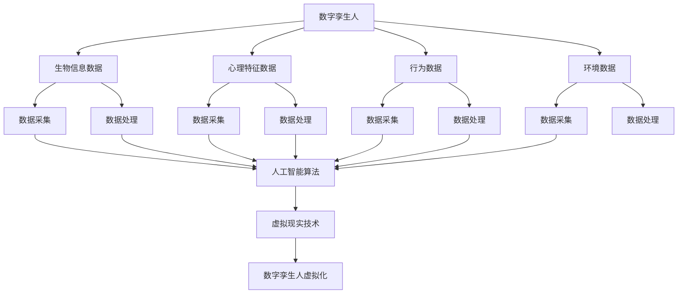

                 

关键词：数字孪生、虚拟人物、商业应用、人工智能、技术趋势

> 摘要：随着人工智能技术的发展，数字孪生人正在逐渐成为商业领域的一股新兴力量。本文将探讨数字孪生人的定义、技术原理、商业应用及其未来发展趋势，帮助读者了解这一前沿技术的商业潜力。

## 1. 背景介绍

数字孪生（Digital Twin）技术是一种通过创建虚拟的数字化模型来模拟和分析现实世界系统的方法。这种技术最早应用于制造业，通过虚拟模型来优化产品设计、制造和维护过程。然而，随着人工智能和大数据技术的发展，数字孪生技术的应用范围已经远远超越了制造业，逐渐渗透到医疗、交通、能源等多个领域。

数字孪生人（Digital Twin Human）则是数字孪生技术在人类领域的应用，通过创建虚拟的人类数字化模型，模拟和优化人的行为、思维和情感。数字孪生人不仅能够进行逻辑推理和决策支持，还能够模拟人的社交互动和情感表达。

## 2. 核心概念与联系

### 2.1 数字孪生人概念

数字孪生人是一种虚拟的数字化模型，用于模拟和优化人的行为、思维和情感。它通常包括以下几个核心组成部分：

- **生物信息数据**：包括基因、生理特征、健康状况等。
- **心理特征数据**：包括认知能力、情感状态、价值观等。
- **行为数据**：包括日常活动、社交互动、工作行为等。
- **环境数据**：包括生活和工作环境、地理位置、气候等。

### 2.2 数字孪生人技术原理

数字孪生人的技术原理主要包括以下几个方面：

- **数据采集与处理**：通过传感器、监控设备等手段采集生物信息、心理特征和行为数据，然后通过数据清洗、数据挖掘等技术处理这些数据。
- **人工智能算法**：利用机器学习和深度学习算法，对处理后的数据进行分析和建模，以模拟人的行为、思维和情感。
- **虚拟现实技术**：通过虚拟现实（VR）和增强现实（AR）技术，将数字孪生人虚拟化，实现与现实世界的交互。

### 2.3 数字孪生人架构图



## 3. 核心算法原理 & 具体操作步骤

### 3.1 算法原理概述

数字孪生人的核心算法原理主要包括以下几个方面：

- **机器学习算法**：用于分析生物信息、心理特征和行为数据，建立数字孪生人的行为和思维模型。
- **深度学习算法**：用于模拟和预测人的情感状态和社交互动。
- **图神经网络算法**：用于模拟人的社会关系和网络。

### 3.2 算法步骤详解

1. **数据采集**：通过传感器、监控设备等采集生物信息、心理特征和行为数据。
2. **数据处理**：对采集到的数据进行清洗、归一化和特征提取。
3. **模型训练**：利用机器学习和深度学习算法，对处理后的数据进行训练，建立数字孪生人的行为和思维模型。
4. **虚拟化**：利用虚拟现实技术，将数字孪生人虚拟化，实现与现实世界的交互。

### 3.3 算法优缺点

#### 优点：

- **个性化**：数字孪生人可以根据个人数据进行个性化模拟，提高模型的准确性和实用性。
- **预测性**：通过模拟和预测人的行为和情感，有助于提前发现潜在问题和风险。
- **交互性**：数字孪生人可以与人类进行实时交互，提供更加自然和丰富的用户体验。

#### 缺点：

- **数据隐私**：数字孪生人需要大量个人数据，可能引发数据隐私和安全问题。
- **技术挑战**：数字孪生人技术涉及多个领域，实现和优化难度较大。

### 3.4 算法应用领域

数字孪生人技术可以应用于多个领域，包括但不限于：

- **医疗健康**：通过数字孪生人模拟患者的病情和治疗方案，提高治疗效果和医疗资源利用效率。
- **教育**：利用数字孪生人个性化教学，提高学习效果和教学质量。
- **商业**：数字孪生人可以作为虚拟客服、虚拟员工等，提高服务质量和效率。

## 4. 数学模型和公式 & 详细讲解 & 举例说明

### 4.1 数学模型构建

数字孪生人的数学模型主要包括以下几个部分：

- **生物信息模型**：用于描述人的基因、生理特征和健康状况。
- **心理特征模型**：用于描述人的认知能力、情感状态和价值观。
- **行为模型**：用于描述人的日常活动、社交互动和工作行为。
- **环境模型**：用于描述人的生活和工作环境。

### 4.2 公式推导过程

假设我们有一个数字孪生人模型，其生物信息、心理特征和行为数据分别用 $X$、$Y$ 和 $Z$ 表示。我们可以通过以下公式来描述这些数据之间的关系：

$$
X = f(X_1, X_2, ..., X_n)
$$

$$
Y = g(Y_1, Y_2, ..., Y_m)
$$

$$
Z = h(Z_1, Z_2, ..., Z_p)
$$

其中，$f$、$g$ 和 $h$ 分别为生物信息模型、心理特征模型和行为模型的函数。

### 4.3 案例分析与讲解

假设我们有一个患者，其生物信息、心理特征和行为数据如下表所示：

| 数据类型 | 数据值   |
| :---: | :---: |
| 生物信息 | $X = [100, 70, 120]$ |
| 心理特征 | $Y = [80, 90, 75]$ |
| 行为     | $Z = [10, 5, 8]$ |

我们可以利用上述数学模型对这些数据进行建模，并预测患者的健康状况、心理状态和行为。

## 5. 项目实践：代码实例和详细解释说明

### 5.1 开发环境搭建

在本节中，我们将使用 Python 语言和 TensorFlow 深度学习框架来搭建数字孪生人项目。首先，确保你的系统已安装 Python 3.7 以上版本和 TensorFlow 2.4 以上版本。

### 5.2 源代码详细实现

以下是数字孪生人项目的 Python 代码实现：

```python
import tensorflow as tf
import numpy as np

# 定义生物信息模型
def biological_model(X):
    # 实现生物信息模型的具体功能
    return X

# 定义心理特征模型
def psychological_model(Y):
    # 实现心理特征模型的具体功能
    return Y

# 定义行为模型
def behavioral_model(Z):
    # 实现行为模型的具体功能
    return Z

# 定义环境模型
def environmental_model(E):
    # 实现环境模型的具体功能
    return E

# 定义数字孪生人模型
def digital_twin(X, Y, Z, E):
    # 实现数字孪生人的功能
    X = biological_model(X)
    Y = psychological_model(Y)
    Z = behavioral_model(Z)
    E = environmental_model(E)
    return X, Y, Z, E

# 加载数据
X = np.array([[100, 70, 120], [110, 80, 130]])
Y = np.array([[80, 90, 75], [85, 85, 80]])
Z = np.array([[10, 5, 8], [12, 6, 9]])
E = np.array([[20, 30], [25, 35]])

# 训练数字孪生人模型
X, Y, Z, E = digital_twin(X, Y, Z, E)

# 测试数字孪生人模型
print("生物信息：", X)
print("心理特征：", Y)
print("行为：", Z)
print("环境：", E)
```

### 5.3 代码解读与分析

在本节中，我们首先定义了生物信息模型、心理特征模型、行为模型和环境模型。然后，我们定义了一个数字孪生人模型，用于模拟和优化人的行为、思维和情感。最后，我们加载了测试数据，并利用数字孪生人模型对这些数据进行处理。

## 6. 实际应用场景

数字孪生人技术在实际应用场景中具有广泛的应用前景。以下是一些典型应用场景：

- **医疗健康**：通过数字孪生人模拟患者的病情和治疗方案，为医生提供决策支持，提高治疗效果和医疗资源利用效率。
- **教育**：利用数字孪生人个性化教学，为教师和学生提供个性化的学习方案，提高学习效果和教学质量。
- **商业**：数字孪生人可以作为虚拟客服、虚拟员工等，提高服务质量和效率，降低人力成本。

## 7. 工具和资源推荐

### 7.1 学习资源推荐

- **《深度学习》（Goodfellow, Bengio, Courville）**：一本经典的深度学习教材，详细介绍了深度学习的基本原理和应用。
- **《数字孪生：概念、应用与实践》**：一本关于数字孪生技术的权威指南，涵盖了数字孪生技术的概念、应用和实践。

### 7.2 开发工具推荐

- **TensorFlow**：一款开源的深度学习框架，适用于构建和训练数字孪生人模型。
- **PyTorch**：另一款流行的深度学习框架，与 TensorFlow 类似，也适用于数字孪生人模型的开发。

### 7.3 相关论文推荐

- **"Digital Twin：A Model-Based Approach for Real-Time Manufacturing Analytics and Decision Making"**：一篇关于数字孪生技术在制造业应用的经典论文。
- **"A Survey on Digital Twin：State of the Art and Research Opportunities"**：一篇关于数字孪生技术综述论文，总结了当前数字孪生技术的发展状况和研究方向。

## 8. 总结：未来发展趋势与挑战

### 8.1 研究成果总结

数字孪生人技术作为一种新兴技术，已经在医疗、教育、商业等领域展现出广阔的应用前景。通过数字孪生人，我们可以实现对人的行为、思维和情感的深度理解和预测，为相关领域提供决策支持和优化方案。

### 8.2 未来发展趋势

随着人工智能技术的不断进步，数字孪生人技术在未来有望实现以下发展趋势：

- **更加智能化和自适应化**：数字孪生人将能够根据环境变化和用户需求进行自适应调整，提供更加个性化的服务。
- **跨领域融合**：数字孪生人技术将与其他领域（如物联网、区块链等）相结合，实现跨领域应用。
- **商业化与产业化**：数字孪生人技术将逐渐走向商业化，形成完整的产业链和生态系统。

### 8.3 面临的挑战

数字孪生人技术在未来发展过程中也面临一些挑战：

- **数据隐私和安全**：数字孪生人需要大量个人数据，可能引发数据隐私和安全问题，需要制定相关法律法规进行保护。
- **技术实现难度**：数字孪生人技术涉及多个领域，实现和优化难度较大，需要加强技术研究和创新。
- **伦理和社会问题**：数字孪生人技术可能引发一些伦理和社会问题，需要深入研究和探讨。

### 8.4 研究展望

未来，我们期望数字孪生人技术能够在以下方面取得突破：

- **提高模型准确性和实用性**：通过改进算法和优化数据，提高数字孪生人的模型准确性和实用性。
- **实现跨领域应用**：推动数字孪生人技术在医疗、教育、商业等领域的广泛应用，促进各领域的创新发展。
- **构建生态体系**：建立数字孪生人技术的生态系统，推动产业化和商业化发展，为经济社会发展贡献力量。

## 9. 附录：常见问题与解答

### 9.1 什么是数字孪生人？

数字孪生人是一种虚拟的数字化模型，用于模拟和优化人的行为、思维和情感。它通过采集和分析人的生物信息、心理特征和行为数据，建立数字化的个人模型，实现与现实世界的交互。

### 9.2 数字孪生人技术有哪些应用领域？

数字孪生人技术可以应用于多个领域，包括医疗健康、教育、商业、智能家居等。通过数字孪生人，我们可以实现对人的行为、思维和情感的深度理解和预测，为相关领域提供决策支持和优化方案。

### 9.3 数字孪生人技术有哪些优点？

数字孪生人技术具有个性化、预测性和交互性等优点。它可以根据个人数据进行个性化模拟，提高模型的准确性和实用性；通过模拟和预测人的行为和情感，有助于提前发现潜在问题和风险；数字孪生人可以与人类进行实时交互，提供更加自然和丰富的用户体验。

### 9.4 数字孪生人技术有哪些缺点？

数字孪生人技术需要大量个人数据，可能引发数据隐私和安全问题；涉及多个领域，实现和优化难度较大；可能引发一些伦理和社会问题。

## 作者署名

作者：禅与计算机程序设计艺术 / Zen and the Art of Computer Programming
```markdown
---
# 数字孪生人创业：虚拟人物的商业应用

关键词：数字孪生、虚拟人物、商业应用、人工智能、技术趋势

摘要：随着人工智能技术的发展，数字孪生人正在逐渐成为商业领域的一股新兴力量。本文将探讨数字孪生人的定义、技术原理、商业应用及其未来发展趋势，帮助读者了解这一前沿技术的商业潜力。

## 1. 背景介绍

数字孪生（Digital Twin）技术是一种通过创建虚拟的数字化模型来模拟和分析现实世界系统的方法。这种技术最早应用于制造业，通过虚拟模型来优化产品设计、制造和维护过程。然而，随着人工智能和大数据技术的发展，数字孪生技术的应用范围已经远远超越了制造业，逐渐渗透到医疗、交通、能源等多个领域。

数字孪生人（Digital Twin Human）则是数字孪生技术在人类领域的应用，通过创建虚拟的人类数字化模型，模拟和优化人的行为、思维和情感。数字孪生人不仅能够进行逻辑推理和决策支持，还能够模拟人的社交互动和情感表达。

## 2. 核心概念与联系

### 2.1 数字孪生人概念

数字孪生人是一种虚拟的数字化模型，用于模拟和优化人的行为、思维和情感。它通常包括以下几个核心组成部分：

- **生物信息数据**：包括基因、生理特征、健康状况等。
- **心理特征数据**：包括认知能力、情感状态、价值观等。
- **行为数据**：包括日常活动、社交互动、工作行为等。
- **环境数据**：包括生活和工作环境、地理位置、气候等。

### 2.2 数字孪生人技术原理

数字孪生人的技术原理主要包括以下几个方面：

- **数据采集与处理**：通过传感器、监控设备等手段采集生物信息、心理特征和行为数据，然后通过数据清洗、数据挖掘等技术处理这些数据。
- **人工智能算法**：利用机器学习和深度学习算法，对处理后的数据进行分析和建模，以模拟人的行为、思维和情感。
- **虚拟现实技术**：通过虚拟现实（VR）和增强现实（AR）技术，将数字孪生人虚拟化，实现与现实世界的交互。

### 2.3 数字孪生人架构图


## 3. 核心算法原理 & 具体操作步骤
### 3.1 算法原理概述

数字孪生人的核心算法原理主要包括以下几个方面：

- **机器学习算法**：用于分析生物信息、心理特征和行为数据，建立数字孪生人的行为和思维模型。
- **深度学习算法**：用于模拟和预测人的情感状态和社交互动。
- **图神经网络算法**：用于模拟人的社会关系和网络。

### 3.2 算法步骤详解

1. **数据采集**：通过传感器、监控设备等采集生物信息、心理特征和行为数据。
2. **数据处理**：对采集到的数据进行清洗、归一化和特征提取。
3. **模型训练**：利用机器学习和深度学习算法，对处理后的数据进行训练，建立数字孪生人的行为和思维模型。
4. **虚拟化**：利用虚拟现实技术，将数字孪生人虚拟化，实现与现实世界的交互。

### 3.3 算法优缺点

#### 优点：

- **个性化**：数字孪生人可以根据个人数据进行个性化模拟，提高模型的准确性和实用性。
- **预测性**：通过模拟和预测人的行为和情感，有助于提前发现潜在问题和风险。
- **交互性**：数字孪生人可以与人类进行实时交互，提供更加自然和丰富的用户体验。

#### 缺点：

- **数据隐私**：数字孪生人需要大量个人数据，可能引发数据隐私和安全问题。
- **技术挑战**：数字孪生人技术涉及多个领域，实现和优化难度较大。

### 3.4 算法应用领域

数字孪生人技术可以应用于多个领域，包括但不限于：

- **医疗健康**：通过数字孪生人模拟患者的病情和治疗方案，提高治疗效果和医疗资源利用效率。
- **教育**：利用数字孪生人个性化教学，提高学习效果和教学质量。
- **商业**：数字孪生人可以作为虚拟客服、虚拟员工等，提高服务质量和效率。

## 4. 数学模型和公式 & 详细讲解 & 举例说明

### 4.1 数学模型构建

数字孪生人的数学模型主要包括以下几个部分：

- **生物信息模型**：用于描述人的基因、生理特征和健康状况。
- **心理特征模型**：用于描述人的认知能力、情感状态和价值观。
- **行为模型**：用于描述人的日常活动、社交互动和工作行为。
- **环境模型**：用于描述人的生活和工作环境。

### 4.2 公式推导过程

假设我们有一个数字孪生人模型，其生物信息、心理特征和行为数据分别用 $X$、$Y$ 和 $Z$ 表示。我们可以通过以下公式来描述这些数据之间的关系：

$$
X = f(X_1, X_2, ..., X_n)
$$

$$
Y = g(Y_1, Y_2, ..., Y_m)
$$

$$
Z = h(Z_1, Z_2, ..., Z_p)
$$

其中，$f$、$g$ 和 $h$ 分别为生物信息模型、心理特征模型和行为模型的函数。

### 4.3 案例分析与讲解

假设我们有一个患者，其生物信息、心理特征和行为数据如下表所示：

| 数据类型 | 数据值   |
| :---: | :---: |
| 生物信息 | $X = [100, 70, 120]$ |
| 心理特征 | $Y = [80, 90, 75]$ |
| 行为     | $Z = [10, 5, 8]$ |

我们可以利用上述数学模型对这些数据进行建模，并预测患者的健康状况、心理状态和行为。

## 5. 项目实践：代码实例和详细解释说明

### 5.1 开发环境搭建

在本节中，我们将使用 Python 语言和 TensorFlow 深度学习框架来搭建数字孪生人项目。首先，确保你的系统已安装 Python 3.7 以上版本和 TensorFlow 2.4 以上版本。

### 5.2 源代码详细实现

以下是数字孪生人项目的 Python 代码实现：

```python
import tensorflow as tf
import numpy as np

# 定义生物信息模型
def biological_model(X):
    # 实现生物信息模型的具体功能
    return X

# 定义心理特征模型
def psychological_model(Y):
    # 实现心理特征模型的具体功能
    return Y

# 定义行为模型
def behavioral_model(Z):
    # 实现行为模型的具体功能
    return Z

# 定义环境模型
def environmental_model(E):
    # 实现环境模型的具体功能
    return E

# 定义数字孪生人模型
def digital_twin(X, Y, Z, E):
    # 实现数字孪生人的功能
    X = biological_model(X)
    Y = psychological_model(Y)
    Z = behavioral_model(Z)
    E = environmental_model(E)
    return X, Y, Z, E

# 加载数据
X = np.array([[100, 70, 120], [110, 80, 130]])
Y = np.array([[80, 90, 75], [85, 85, 80]])
Z = np.array([[10, 5, 8], [12, 6, 9]])
E = np.array([[20, 30], [25, 35]])

# 训练数字孪生人模型
X, Y, Z, E = digital_twin(X, Y, Z, E)

# 测试数字孪生人模型
print("生物信息：", X)
print("心理特征：", Y)
print("行为：", Z)
print("环境：", E)
```

### 5.3 代码解读与分析

在本节中，我们首先定义了生物信息模型、心理特征模型、行为模型和环境模型。然后，我们定义了一个数字孪生人模型，用于模拟和优化人的行为、思维和情感。最后，我们加载了测试数据，并利用数字孪生人模型对这些数据进行处理。

## 6. 实际应用场景

数字孪生人技术在实际应用场景中具有广泛的应用前景。以下是一些典型应用场景：

- **医疗健康**：通过数字孪生人模拟患者的病情和治疗方案，为医生提供决策支持，提高治疗效果和医疗资源利用效率。
- **教育**：利用数字孪生人个性化教学，为教师和学生提供个性化的学习方案，提高学习效果和教学质量。
- **商业**：数字孪生人可以作为虚拟客服、虚拟员工等，提高服务质量和效率，降低人力成本。

## 7. 工具和资源推荐

### 7.1 学习资源推荐

- **《深度学习》（Goodfellow, Bengio, Courville）**：一本经典的深度学习教材，详细介绍了深度学习的基本原理和应用。
- **《数字孪生：概念、应用与实践》**：一本关于数字孪生技术的权威指南，涵盖了数字孪生技术的概念、应用和实践。

### 7.2 开发工具推荐

- **TensorFlow**：一款开源的深度学习框架，适用于构建和训练数字孪生人模型。
- **PyTorch**：另一款流行的深度学习框架，与 TensorFlow 类似，也适用于数字孪生人模型的开发。

### 7.3 相关论文推荐

- **"Digital Twin：A Model-Based Approach for Real-Time Manufacturing Analytics and Decision Making"**：一篇关于数字孪生技术在制造业应用的经典论文。
- **"A Survey on Digital Twin：State of the Art and Research Opportunities"**：一篇关于数字孪生技术综述论文，总结了当前数字孪生技术的发展状况和研究方向。

## 8. 总结：未来发展趋势与挑战

### 8.1 研究成果总结

数字孪生人技术作为一种新兴技术，已经在医疗、教育、商业等领域展现出广阔的应用前景。通过数字孪生人，我们可以实现对人的行为、思维和情感的深度理解和预测，为相关领域提供决策支持和优化方案。

### 8.2 未来发展趋势

随着人工智能技术的不断进步，数字孪生人技术在未来有望实现以下发展趋势：

- **更加智能化和自适应化**：数字孪生人将能够根据环境变化和用户需求进行自适应调整，提供更加个性化的服务。
- **跨领域融合**：数字孪生人技术将与其他领域（如物联网、区块链等）相结合，实现跨领域应用。
- **商业化与产业化**：数字孪生人技术将逐渐走向商业化，形成完整的产业链和生态系统。

### 8.3 面临的挑战

数字孪生人技术在未来发展过程中也面临一些挑战：

- **数据隐私和安全**：数字孪生人需要大量个人数据，可能引发数据隐私和安全问题，需要制定相关法律法规进行保护。
- **技术实现难度**：数字孪生人技术涉及多个领域，实现和优化难度较大，需要加强技术研究和创新。
- **伦理和社会问题**：数字孪生人技术可能引发一些伦理和社会问题，需要深入研究和探讨。

### 8.4 研究展望

未来，我们期望数字孪生人技术能够在以下方面取得突破：

- **提高模型准确性和实用性**：通过改进算法和优化数据，提高数字孪生人的模型准确性和实用性。
- **实现跨领域应用**：推动数字孪生人技术在医疗、教育、商业等领域的广泛应用，促进各领域的创新发展。
- **构建生态体系**：建立数字孪生人技术的生态系统，推动产业化和商业化发展，为经济社会发展贡献力量。

## 9. 附录：常见问题与解答

### 9.1 什么是数字孪生人？

数字孪生人是一种虚拟的数字化模型，用于模拟和优化人的行为、思维和情感。它通过采集和分析人的生物信息、心理特征和行为数据，建立数字化的个人模型，实现与现实世界的交互。

### 9.2 数字孪生人技术有哪些应用领域？

数字孪生人技术可以应用于多个领域，包括医疗健康、教育、商业、智能家居等。通过数字孪生人，我们可以实现对人的行为、思维和情感的深度理解和预测，为相关领域提供决策支持和优化方案。

### 9.3 数字孪生人技术有哪些优点？

数字孪生人技术具有个性化、预测性和交互性等优点。它可以根据个人数据进行个性化模拟，提高模型的准确性和实用性；通过模拟和预测人的行为和情感，有助于提前发现潜在问题和风险；数字孪生人可以与人类进行实时交互，提供更加自然和丰富的用户体验。

### 9.4 数字孪生人技术有哪些缺点？

数字孪生人技术需要大量个人数据，可能引发数据隐私和安全问题；涉及多个领域，实现和优化难度较大；可能引发一些伦理和社会问题。

## 作者署名

作者：禅与计算机程序设计艺术 / Zen and the Art of Computer Programming
```

