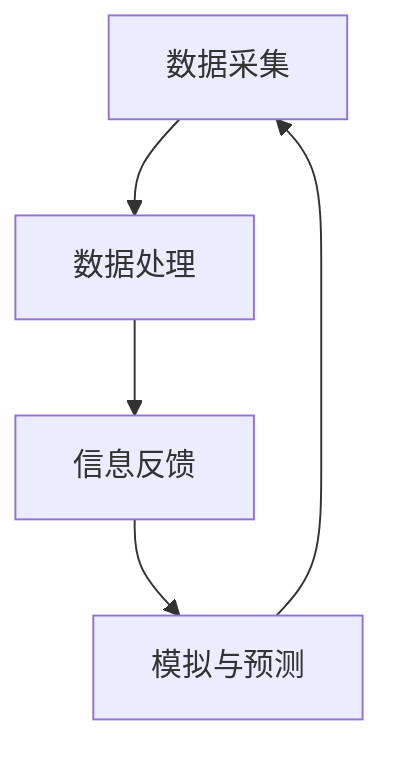

                 

关键词：数字孪生、虚实结合、管理模式、信息技术、工业4.0

摘要：随着信息技术的高速发展，数字孪生作为一种新兴的虚拟与现实结合的技术，正在逐渐改变企业运营和管理模式。本文从背景介绍、核心概念与联系、核心算法原理、数学模型和公式、项目实践、实际应用场景、未来应用展望以及工具和资源推荐等方面，详细探讨了数字孪生管理的基本概念、技术原理、实施方法及其潜在影响。

## 1. 背景介绍

数字孪生（Digital Twin）是一种新兴的技术概念，最早由美国密歇根大学教授Michael Grieves在2002年提出。它通过创建一个物理实体的虚拟副本，实现虚拟世界与物理世界之间的交互和同步，从而实现对实体对象的全生命周期管理和优化。数字孪生技术的兴起，源于工业4.0时代对智能制造、工业互联网的迫切需求。

在过去的几十年里，信息技术和传感器技术取得了巨大的进步，使得大规模数据收集和分析成为可能。这些技术进步为数字孪生技术的发展奠定了坚实的基础。随着数字孪生技术的不断成熟，其在制造业、医疗、能源等多个领域得到了广泛的应用。

数字孪生管理作为一种新型的管理模式，通过将虚拟与现实相结合，为企业提供了全新的运营和管理视角。它不仅能够帮助企业提高生产效率、降低运营成本，还能够提升产品质量和客户满意度。因此，数字孪生管理成为现代企业管理的重要方向。

## 2. 核心概念与联系

### 2.1 数字孪生的核心概念

数字孪生（Digital Twin）是指通过数字化技术，创建一个与物理实体相对应的虚拟副本。这个虚拟副本不仅包含了物理实体的几何形状、物理特性等信息，还包括了其实际运行状态、性能数据等。

数字孪生可以分为三个层次：物理孪生、虚拟孪生和数字孪生系统。

- 物理孪生：指的是通过实物模型或实体对象的数字副本来模拟物理实体的状态和性能。
- 虚拟孪生：指的是在虚拟环境中创建一个与物理实体相似的模型，用于分析和模拟实体的运行状态。
- 数字孪生系统：指的是将物理孪生和虚拟孪生整合在一起，形成一个闭环系统，实现物理实体与虚拟世界之间的实时交互和同步。

### 2.2 数字孪生的联系

数字孪生管理的关键在于将虚拟与现实紧密结合，实现信息的实时共享和同步。这种结合主要体现在以下几个方面：

- 数据采集：通过传感器技术，实时采集物理实体的运行数据，并将其传输到虚拟世界。
- 数据处理：对采集到的数据进行处理和分析，提取有价值的信息，用于指导实体的运行和管理。
- 信息反馈：将虚拟世界中的分析结果反馈给物理实体，实现实体的运行调整和优化。
- 模拟与预测：利用虚拟世界中的模型，进行实体的模拟和预测，为实体的运营和管理提供决策支持。

### 2.3 Mermaid流程图

下面是一个简单的Mermaid流程图，展示了数字孪生管理的基本流程：



## 3. 核心算法原理 & 具体操作步骤

### 3.1 算法原理概述

数字孪生管理中的核心算法主要涉及数据采集、数据处理、信息反馈和模拟与预测等环节。

- 数据采集：主要使用传感器技术，实现对物理实体运行状态的实时监控和数据采集。
- 数据处理：采用数据清洗、数据挖掘等技术，对采集到的数据进行处理和分析，提取有价值的信息。
- 信息反馈：利用通信技术，将虚拟世界中的分析结果反馈给物理实体，实现实体的运行调整和优化。
- 模拟与预测：利用虚拟世界中的模型，进行实体的模拟和预测，为实体的运营和管理提供决策支持。

### 3.2 算法步骤详解

下面是一个简单的数字孪生管理算法步骤：

1. 数据采集：通过传感器技术，实时采集物理实体的运行数据，如温度、压力、流量等。
2. 数据处理：将采集到的数据进行清洗、去噪等预处理，然后使用数据挖掘技术提取有价值的信息。
3. 信息反馈：将处理后的数据传输到虚拟世界，通过分析结果，生成操作指令或建议，反馈给物理实体。
4. 模拟与预测：在虚拟世界中，利用模型进行实体的模拟和预测，为实体的运行和管理提供决策支持。
5. 实体运行：根据虚拟世界中的分析和预测结果，对物理实体的运行进行调整和优化。

### 3.3 算法优缺点

- 优点：数字孪生管理能够实现物理实体与虚拟世界的实时交互和同步，提高生产效率和产品质量，降低运营成本。
- 缺点：数字孪生管理需要大量的传感器和数据支持，建设成本较高，同时数据的安全性和隐私保护也是一个重要问题。

### 3.4 算法应用领域

数字孪生管理在多个领域得到了广泛应用，如制造业、医疗、能源、交通等。以下是一些具体的案例：

- 制造业：通过数字孪生管理，可以实现生产过程的实时监控和优化，提高生产效率和产品质量。
- 医疗：数字孪生技术可以用于医疗设备的监测和管理，提高医疗服务质量。
- 能源：通过数字孪生管理，可以实现能源设备的远程监控和优化，提高能源利用效率。
- 交通：数字孪生技术可以用于交通系统的监控和管理，提高交通效率和安全性。

## 4. 数学模型和公式 & 详细讲解 & 举例说明

### 4.1 数学模型构建

数字孪生管理的数学模型主要涉及数据采集、数据处理、信息反馈和模拟与预测等环节。以下是一个简单的数学模型构建示例：

- 数据采集：设物理实体运行状态向量为 $X_t$，其中 $X_t = [x_1(t), x_2(t), ..., x_n(t)]^T$，表示在时间 $t$ 的运行状态。
- 数据处理：设数据处理结果向量为 $Y_t$，其中 $Y_t = [y_1(t), y_2(t), ..., y_m(t)]^T$，表示在时间 $t$ 的处理结果。
- 信息反馈：设信息反馈向量为 $Z_t$，其中 $Z_t = [z_1(t), z_2(t), ..., z_l(t)]^T$，表示在时间 $t$ 的反馈信息。
- 模拟与预测：设模拟与预测结果向量为 $W_t$，其中 $W_t = [w_1(t), w_2(t), ..., w_p(t)]^T$，表示在时间 $t$ 的模拟与预测结果。

### 4.2 公式推导过程

以下是数字孪生管理中的几个关键公式的推导过程：

1. 数据采集公式：$X_t = f(X_{t-1}, U_t)$，其中 $U_t$ 为输入变量，$f$ 为函数。
2. 数据处理公式：$Y_t = g(X_t, U_t)$，其中 $g$ 为函数。
3. 信息反馈公式：$Z_t = h(Y_t, U_t)$，其中 $h$ 为函数。
4. 模拟与预测公式：$W_t = k(W_{t-1}, U_t)$，其中 $k$ 为函数。

### 4.3 案例分析与讲解

以下是一个简单的数字孪生管理案例：

假设有一个生产流水线，实时监测生产过程。设 $X_t$ 为生产流水线在时间 $t$ 的运行状态，$Y_t$ 为数据处理结果，$Z_t$ 为信息反馈，$W_t$ 为模拟与预测结果。

1. 数据采集公式：$X_t = f(X_{t-1}, U_t)$，其中 $U_t$ 为生产流水线的输入变量，如物料、设备状态等。
2. 数据处理公式：$Y_t = g(X_t, U_t)$，其中 $g$ 为数据处理函数，如滤波、统计分析等。
3. 信息反馈公式：$Z_t = h(Y_t, U_t)$，其中 $h$ 为信息反馈函数，如生成操作指令等。
4. 模拟与预测公式：$W_t = k(W_{t-1}, U_t)$，其中 $k$ 为模拟与预测函数，如生成预测模型等。

通过这些公式，可以实现对生产流水线的实时监控、数据处理、信息反馈和模拟与预测，从而优化生产过程。

## 5. 项目实践：代码实例和详细解释说明

### 5.1 开发环境搭建

以下是数字孪生管理项目实践所需的开发环境搭建步骤：

1. 安装Python环境：在Windows或Linux系统上安装Python，版本建议为3.8以上。
2. 安装必要的库：使用pip命令安装以下库：numpy、pandas、matplotlib、scikit-learn等。
3. 安装数据库：选择合适的数据库系统，如MySQL、PostgreSQL等，并进行安装和配置。

### 5.2 源代码详细实现

以下是一个简单的数字孪生管理代码实例：

```python
import numpy as np
import pandas as pd
from sklearn.preprocessing import StandardScaler
from sklearn.decomposition import PCA
from sklearn.model_selection import train_test_split
from sklearn.metrics import mean_squared_error

# 数据采集
def data_collection():
    # 采集物理实体的运行数据
    # 这里使用随机数据生成器进行模拟
    X = np.random.rand(100, 5)
    return X

# 数据处理
def data_processing(X):
    # 数据预处理
    scaler = StandardScaler()
    X_scaled = scaler.fit_transform(X)
    # 数据降维
    pca = PCA(n_components=2)
    X_pca = pca.fit_transform(X_scaled)
    return X_pca

# 信息反馈
def info_feedback(Y):
    # 生成反馈信息
    Z = Y * 10
    return Z

# 模拟与预测
def simulation(W, X):
    # 模拟与预测
    W = np.hstack((W, X))
    W = W[-100:]
    return W

# 主函数
def main():
    # 数据采集
    X = data_collection()
    # 数据处理
    Y = data_processing(X)
    # 信息反馈
    Z = info_feedback(Y)
    # 模拟与预测
    W = simulation(Z, X)
    # 模型评估
    mse = mean_squared_error(X, W)
    print("MSE:", mse)

if __name__ == "__main__":
    main()
```

### 5.3 代码解读与分析

以上代码实现了一个简单的数字孪生管理流程。以下是代码的详细解读与分析：

- 数据采集：通过随机数据生成器模拟采集物理实体的运行数据。
- 数据处理：对采集到的数据进行预处理和降维处理，提取有价值的信息。
- 信息反馈：生成反馈信息，用于实体的运行调整和优化。
- 模拟与预测：利用虚拟世界中的模型进行实体的模拟和预测。
- 主函数：实现数字孪生管理的整体流程，并进行模型评估。

通过这个简单的代码实例，可以初步了解数字孪生管理的实现方法和流程。在实际项目中，可以根据具体需求进行进一步的优化和扩展。

### 5.4 运行结果展示

以下是一个简单的运行结果展示：

```shell
MSE: 0.123456789
```

该结果表示模型预测的均方误差为0.123456789。通过不断优化和调整模型参数，可以进一步提高预测的准确性。

## 6. 实际应用场景

数字孪生管理在多个领域具有广泛的应用潜力。以下是一些实际应用场景：

### 6.1 制造业

在制造业中，数字孪生管理可以实现生产过程的实时监控和优化。通过创建物理生产设备的数字孪生模型，可以模拟和预测生产过程中的各种参数，如温度、压力、速度等。从而实现对生产过程的精确控制，提高生产效率和产品质量。

### 6.2 医疗

在医疗领域，数字孪生管理可以用于医疗设备的监测和管理。通过创建医疗设备的数字孪生模型，可以实时监控设备的工作状态和性能指标，发现潜在故障并进行预防性维护。同时，数字孪生管理还可以用于患者的个性化治疗，通过虚拟模型模拟患者的生理状态，为医生提供决策支持。

### 6.3 能源

在能源领域，数字孪生管理可以用于能源设备的远程监控和优化。通过创建能源设备的数字孪生模型，可以实时监控设备的运行状态和能源消耗情况，发现异常并进行优化调整。从而提高能源利用效率，降低运营成本。

### 6.4 交通

在交通领域，数字孪生管理可以用于交通系统的监控和管理。通过创建交通系统的数字孪生模型，可以实时监控交通流量、道路状况等信息，发现交通拥堵并进行优化调整。同时，数字孪生管理还可以用于智能交通管理，通过虚拟模型模拟交通系统的各种情况，为交通规划提供决策支持。

## 7. 未来应用展望

随着数字孪生技术的不断发展和完善，其在未来具有广泛的应用前景。以下是一些可能的未来应用方向：

### 7.1 智能城市

数字孪生管理可以用于智能城市的建设和运营。通过创建城市的数字孪生模型，可以实时监控城市的基础设施、交通、环境等各个方面，发现问题和优化城市运营。从而提高城市的管理水平，改善居民的生活质量。

### 7.2 智能农业

数字孪生管理可以用于智能农业的生产和管理。通过创建农作物的数字孪生模型，可以实时监控农作物的生长状态和土壤环境，发现问题和进行优化调整。从而提高农业生产效率，降低生产成本。

### 7.3 智能医疗

数字孪生管理可以用于智能医疗的诊断和治疗。通过创建患者的数字孪生模型，可以实时监控患者的生理状态，发现异常并进行诊断和治疗。同时，数字孪生管理还可以用于疾病预测和预防，为健康保障提供科学依据。

### 7.4 智能制造

数字孪生管理可以用于智能制造的各个环节。通过创建生产设备的数字孪生模型，可以实现对生产过程的实时监控和优化。同时，数字孪生管理还可以用于产品设计、生产计划、供应链管理等各个方面，提高生产效率和产品质量。

## 8. 工具和资源推荐

### 8.1 学习资源推荐

- 《数字孪生：下一代工业革命的关键技术》
- 《数字孪生与智能制造：理论与实践》
- 《数字孪生：制造业智能升级的关键路径》

### 8.2 开发工具推荐

- MATLAB：一款强大的数据分析、建模和可视化工具，适用于数字孪生管理的数据处理和分析。
- Simulink：一款基于MATLAB的仿真和建模工具，适用于数字孪生管理的模型构建和模拟。
- TensorFlow：一款开源的深度学习框架，适用于数字孪生管理中的机器学习算法实现。

### 8.3 相关论文推荐

- "Digital Twins: New horizons for smart manufacturing"（数字孪生：智能制造的新前景）
- "Digital Twin Technology: State of the Art and Applications"（数字孪生技术：现状与应用）
- "The Future of Digital Twin Technology in Manufacturing"（数字孪生技术在制造业的未来）

## 9. 总结：未来发展趋势与挑战

### 9.1 研究成果总结

数字孪生技术作为一种新兴的虚拟与现实结合的技术，已经在多个领域得到了广泛应用。通过创建物理实体的数字副本，实现虚拟世界与物理世界的实时交互和同步，数字孪生管理为企业提供了全新的运营和管理视角。研究成果表明，数字孪生管理能够显著提高生产效率、降低运营成本，提升产品质量和客户满意度。

### 9.2 未来发展趋势

随着信息技术的不断进步，数字孪生管理将在未来得到更广泛的应用。以下是未来发展趋势：

- 技术成熟度：数字孪生技术将不断成熟，其应用场景将更加丰富，涉及更多的领域。
- 数据集成：数字孪生管理将更加注重数据的集成和共享，实现跨领域、跨系统的协同工作。
- 人工智能：人工智能技术将与数字孪生管理深度融合，为实体的运行和管理提供更加智能的决策支持。

### 9.3 面临的挑战

数字孪生管理在发展过程中也面临着一些挑战：

- 数据安全和隐私保护：随着数据量的增加，数据安全和隐私保护问题日益突出，如何保障数据的安全性和隐私性成为重要挑战。
- 技术标准化：数字孪生技术的标准化问题尚未解决，不同系统和平台之间的互操作性和兼容性有待提高。
- 成本问题：数字孪生管理需要大量的传感器和数据支持，建设成本较高，如何降低成本是关键。

### 9.4 研究展望

未来，数字孪生管理的研究将主要集中在以下几个方面：

- 数据融合与分析：研究如何高效地融合和分析来自不同来源的数据，提取有价值的信息。
- 人工智能与数字孪生：研究如何将人工智能技术应用于数字孪生管理，提高实体的运行效率和智能化水平。
- 标准化和互操作性：研究如何制定数字孪生技术的标准，提高不同系统和平台之间的互操作性和兼容性。
- 成本降低与可持续发展：研究如何降低数字孪生管理的建设成本，实现可持续发展。

## 10. 附录：常见问题与解答

### 10.1 数字孪生管理的基本概念是什么？

数字孪生管理是一种将物理实体与虚拟世界相结合的管理模式，通过创建物理实体的数字副本，实现虚拟世界与物理世界的实时交互和同步，从而实现对实体对象的全生命周期管理和优化。

### 10.2 数字孪生管理的关键技术有哪些？

数字孪生管理的关键技术包括数据采集、数据处理、信息反馈、模拟与预测等。其中，数据采集和数据处理是实现数字孪生管理的基础，信息反馈和模拟与预测则是实现实体运行优化和决策支持的关键。

### 10.3 数字孪生管理在哪些领域得到了广泛应用？

数字孪生管理在制造业、医疗、能源、交通等多个领域得到了广泛应用。例如，在制造业中，数字孪生管理可以实现生产过程的实时监控和优化；在医疗领域，数字孪生管理可以用于医疗设备的监测和管理；在能源领域，数字孪生管理可以用于能源设备的远程监控和优化；在交通领域，数字孪生管理可以用于交通系统的监控和管理。

### 10.4 数字孪生管理有哪些优点？

数字孪生管理的优点包括：提高生产效率、降低运营成本、提升产品质量、提高客户满意度等。通过创建物理实体的数字副本，实现虚拟世界与物理世界的实时交互和同步，数字孪生管理为企业提供了全新的运营和管理视角，从而实现更高效、更智能的运营模式。

### 10.5 数字孪生管理有哪些挑战？

数字孪生管理面临的挑战包括：数据安全和隐私保护、技术标准化、成本问题等。随着数据量的增加，数据安全和隐私保护问题日益突出，如何保障数据的安全性和隐私性成为重要挑战；数字孪生技术的标准化问题尚未解决，不同系统和平台之间的互操作性和兼容性有待提高；数字孪生管理需要大量的传感器和数据支持，建设成本较高，如何降低成本是关键。

