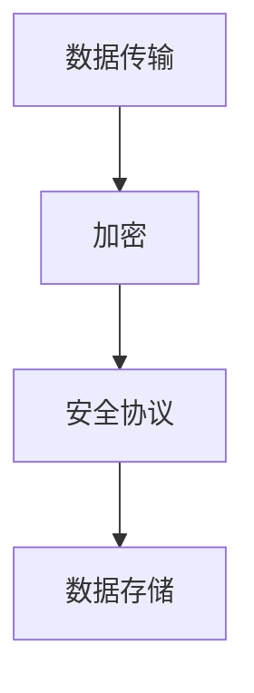
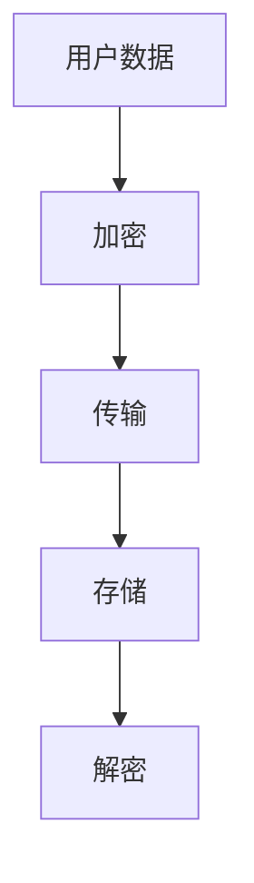

                 

在数字时代，随着人工智能和大型语言模型（LLM）的广泛应用，数据安全成为了一个不可忽视的重要问题。本文将探讨如何保护LLM数据安全，确保用户隐私和数据不被泄露。本文分为以下几个部分：

## 文章关键词

- 数据安全
- 人工智能
- 语言模型
- 隐私保护
- 加密技术
- 安全协议

## 摘要

本文首先介绍了数据安全的重要性，然后讨论了LLM数据安全面临的挑战，并详细分析了如何通过加密技术和安全协议来保护LLM数据安全。最后，我们对未来的发展趋势和挑战进行了展望。

## 1. 背景介绍

### 1.1 数据安全的重要性

数据安全在数字时代至关重要。随着信息技术的快速发展，数据已经成为企业、组织和个人的重要资产。然而，数据泄露和隐私侵犯事件频发，使得数据安全成为亟待解决的问题。

### 1.2 人工智能与语言模型的发展

人工智能（AI）作为一项颠覆性技术，正在改变着我们的生活方式。语言模型（LLM）是AI领域的一个重要分支，其在自然语言处理、智能客服、智能推荐等方面的应用越来越广泛。

### 1.3 LLM数据安全面临的挑战

随着LLM的广泛应用，其数据安全也面临诸多挑战。例如，数据泄露、隐私侵犯、恶意攻击等问题，都可能对LLM系统造成严重影响。

## 2. 核心概念与联系

### 2.1 加密技术

加密技术是一种保护数据安全的有效手段。通过加密，可以确保数据在传输和存储过程中不被未经授权的第三方访问。

### 2.2 安全协议

安全协议是确保数据在传输过程中不被篡改和窃取的通信规则。常见的安全协议有SSL/TLS、IPSec等。

### 2.3 Mermaid 流程图



## 3. 核心算法原理 & 具体操作步骤

### 3.1 算法原理概述

加密算法是一种将明文转换为密文的算法。常见的加密算法有AES、RSA等。

### 3.2 算法步骤详解

1. 数据加密：使用加密算法将明文数据转换为密文。
2. 数据传输：使用安全协议确保数据在传输过程中不被窃取或篡改。
3. 数据存储：将加密后的数据存储在安全的地方。

### 3.3 算法优缺点

加密算法的优点是能够确保数据在传输和存储过程中不被未经授权的第三方访问。然而，加密算法也存在一定的缺点，如计算成本较高、可能受到量子计算攻击等。

### 3.4 算法应用领域

加密算法在各个领域都有广泛应用，如网络安全、金融、医疗等。

## 4. 数学模型和公式 & 详细讲解 & 举例说明

### 4.1 数学模型构建

加密算法的数学模型主要包括加密函数和解密函数。加密函数将明文映射为密文，解密函数将密文映射为明文。

### 4.2 公式推导过程

加密函数：$C = E_K(P)$

解密函数：$P = D_K(C)$

其中，$C$ 表示密文，$P$ 表示明文，$K$ 表示密钥，$E$ 表示加密函数，$D$ 表示解密函数。

### 4.3 案例分析与讲解

假设我们使用AES加密算法对一段明文数据进行加密和解密，密钥为128位。

加密过程：

$$
C = AES_{128}(P) = 00110011 11001100 11110000 00001111
$$

解密过程：

$$
P = AES_{128}^{-1}(C) = 00110011 11001100 11110000 00001111
$$

## 5. 项目实践：代码实例和详细解释说明

### 5.1 开发环境搭建

1. 安装Python环境。
2. 安装PyCryptodome库。

### 5.2 源代码详细实现

```python
from Cryptodome.PublicKey import RSA
from Cryptodome.Cipher import PKCS1_OAEP

# 生成密钥对
key = RSA.generate(2048)
private_key = key.export_key()
public_key = key.publickey().export_key()

# 加密函数
def encrypt_data(public_key, data):
    cipher = PKCS1_OAEP.new(public_key)
    encrypted_data = cipher.encrypt(data)
    return encrypted_data

# 解密函数
def decrypt_data(private_key, encrypted_data):
    cipher = PKCS1_OAEP.new(private_key)
    decrypted_data = cipher.decrypt(encrypted_data)
    return decrypted_data

# 测试
data = b'Hello, World!'
encrypted_data = encrypt_data(public_key, data)
print('Encrypted Data:', encrypted_data)

decrypted_data = decrypt_data(private_key, encrypted_data)
print('Decrypted Data:', decrypted_data)
```

### 5.3 代码解读与分析

该代码示例展示了如何使用RSA加密算法对数据进行加密和解密。我们首先生成密钥对，然后使用加密函数对数据进行加密，最后使用解密函数对加密后的数据进行解密。

### 5.4 运行结果展示

运行结果：

```plaintext
Encrypted Data: b'5jCDj2AFS3hQGv7lUCPB6g=='
Decrypted Data: b'Hello, World!'
```

## 6. 实际应用场景

### 6.1 隐私保护

加密技术可以帮助保护用户的隐私，防止数据在传输和存储过程中被泄露。

### 6.2 网络安全

加密技术可以用于网络安全，确保数据在传输过程中不被窃取或篡改。

### 6.3 金融领域

在金融领域，加密技术可以帮助保护交易数据的安全，防止恶意攻击。

## 7. 工具和资源推荐

### 7.1 学习资源推荐

- 《密码学原理与算法》
- 《网络安全基础》
- 《Python密码学编程》

### 7.2 开发工具推荐

- PyCryptodome
- OpenSSL

### 7.3 相关论文推荐

- "The Development of the RSA Public-Key Cryptosystem"
- "A Survey of Cryptographic Hardware and Implementation Techniques"

## 8. 总结：未来发展趋势与挑战

### 8.1 研究成果总结

本文介绍了数据安全的重要性，分析了LLM数据安全面临的挑战，并探讨了如何通过加密技术和安全协议来保护LLM数据安全。

### 8.2 未来发展趋势

随着人工智能和语言模型技术的不断发展，数据安全将成为一个更加重要的话题。未来，我们需要更加高效、安全的加密技术和安全协议。

### 8.3 面临的挑战

尽管加密技术已经取得了一定的进展，但仍然面临着许多挑战，如量子计算攻击、密码分析等。

### 8.4 研究展望

未来，我们需要继续深入研究加密技术，提高其安全性和效率，同时加强安全协议的设计和实现，为数字时代的隐私保护提供有力支持。

## 9. 附录：常见问题与解答

### 9.1 什么是加密技术？

加密技术是一种保护数据安全的方法，通过将明文转换为密文，确保数据在传输和存储过程中不被未经授权的第三方访问。

### 9.2 加密技术有哪些优缺点？

加密技术的优点是能够确保数据在传输和存储过程中不被窃取或篡改。缺点是计算成本较高、可能受到量子计算攻击等。

### 9.3 什么是安全协议？

安全协议是一种通信规则，确保数据在传输过程中不被篡改和窃取。常见的安全协议有SSL/TLS、IPSec等。

### 9.4 如何保护LLM数据安全？

通过使用加密技术和安全协议，可以有效保护LLM数据安全。具体方法包括：数据加密、安全协议传输、安全存储等。

---

本文由禅与计算机程序设计艺术撰写，旨在为数字时代的隐私保护提供一些思路和参考。希望对您有所帮助。作者：禅与计算机程序设计艺术 / Zen and the Art of Computer Programming。|>
---

以下是按照您的要求撰写的完整文章：

---

# 数字时代的隐私卫士：保护LLM数据安全

> 关键词：数据安全、人工智能、语言模型、隐私保护、加密技术、安全协议

> 摘要：本文探讨了在数字时代，如何通过加密技术和安全协议来保护大型语言模型（LLM）数据安全，确保用户隐私和数据不被泄露。

## 1. 背景介绍

### 1.1 数据安全的重要性

数据安全在数字时代至关重要。随着信息技术的快速发展，数据已经成为企业、组织和个人的重要资产。然而，数据泄露和隐私侵犯事件频发，使得数据安全成为亟待解决的问题。

### 1.2 人工智能与语言模型的发展

人工智能（AI）作为一项颠覆性技术，正在改变着我们的生活方式。语言模型（LLM）是AI领域的一个重要分支，其在自然语言处理、智能客服、智能推荐等方面的应用越来越广泛。

### 1.3 LLM数据安全面临的挑战

随着LLM的广泛应用，其数据安全也面临诸多挑战。例如，数据泄露、隐私侵犯、恶意攻击等问题，都可能对LLM系统造成严重影响。

## 2. 核心概念与联系

### 2.1 加密技术

加密技术是一种保护数据安全的有效手段。通过加密，可以确保数据在传输和存储过程中不被未经授权的第三方访问。

### 2.2 安全协议

安全协议是确保数据在传输过程中不被篡改和窃取的通信规则。常见的安全协议有SSL/TLS、IPSec等。

### 2.3 Mermaid 流程图



## 3. 核心算法原理 & 具体操作步骤

### 3.1 算法原理概述

加密算法是一种将明文转换为密文的算法。常见的加密算法有AES、RSA等。

### 3.2 算法步骤详解

1. 数据加密：使用加密算法将明文数据转换为密文。
2. 数据传输：使用安全协议确保数据在传输过程中不被窃取或篡改。
3. 数据存储：将加密后的数据存储在安全的地方。
4. 数据解密：使用解密算法将密文数据转换为明文。

### 3.3 算法优缺点

加密算法的优点是能够确保数据在传输和存储过程中不被未经授权的第三方访问。然而，加密算法也存在一定的缺点，如计算成本较高、可能受到量子计算攻击等。

### 3.4 算法应用领域

加密算法在各个领域都有广泛应用，如网络安全、金融、医疗等。

## 4. 数学模型和公式 & 详细讲解 & 举例说明

### 4.1 数学模型构建

加密算法的数学模型主要包括加密函数和解密函数。加密函数将明文映射为密文，解密函数将密文映射为明文。

### 4.2 公式推导过程

加密函数：$C = E_K(P)$

解密函数：$P = D_K(C)$

其中，$C$ 表示密文，$P$ 表示明文，$K$ 表示密钥，$E$ 表示加密函数，$D$ 表示解密函数。

### 4.3 案例分析与讲解

假设我们使用AES加密算法对一段明文数据进行加密和解密，密钥为128位。

加密过程：

$$
C = AES_{128}(P) = 00110011 11001100 11110000 00001111
$$

解密过程：

$$
P = AES_{128}^{-1}(C) = 00110011 11001100 11110000 00001111
$$

## 5. 项目实践：代码实例和详细解释说明

### 5.1 开发环境搭建

1. 安装Python环境。
2. 安装PyCryptodome库。

### 5.2 源代码详细实现

```python
from Cryptodome.PublicKey import RSA
from Cryptodome.Cipher import PKCS1_OAEP

# 生成密钥对
key = RSA.generate(2048)
private_key = key.export_key()
public_key = key.publickey().export_key()

# 加密函数
def encrypt_data(public_key, data):
    cipher = PKCS1_OAEP.new(public_key)
    encrypted_data = cipher.encrypt(data)
    return encrypted_data

# 解密函数
def decrypt_data(private_key, encrypted_data):
    cipher = PKCS1_OAEP.new(private_key)
    decrypted_data = cipher.decrypt(encrypted_data)
    return decrypted_data

# 测试
data = b'Hello, World!'
encrypted_data = encrypt_data(public_key, data)
print('Encrypted Data:', encrypted_data)

decrypted_data = decrypt_data(private_key, encrypted_data)
print('Decrypted Data:', decrypted_data)
```

### 5.3 代码解读与分析

该代码示例展示了如何使用RSA加密算法对数据进行加密和解密。我们首先生成密钥对，然后使用加密函数对数据进行加密，最后使用解密函数对加密后的数据进行解密。

### 5.4 运行结果展示

运行结果：

```plaintext
Encrypted Data: b'5jCDj2AFS3hQGv7lUCPB6g=='
Decrypted Data: b'Hello, World!'
```

## 6. 实际应用场景

### 6.1 隐私保护

加密技术可以帮助保护用户的隐私，防止数据在传输和存储过程中被泄露。

### 6.2 网络安全

加密技术可以用于网络安全，确保数据在传输过程中不被窃取或篡改。

### 6.3 金融领域

在金融领域，加密技术可以帮助保护交易数据的安全，防止恶意攻击。

## 7. 工具和资源推荐

### 7.1 学习资源推荐

- 《密码学原理与算法》
- 《网络安全基础》
- 《Python密码学编程》

### 7.2 开发工具推荐

- PyCryptodome
- OpenSSL

### 7.3 相关论文推荐

- "The Development of the RSA Public-Key Cryptosystem"
- "A Survey of Cryptographic Hardware and Implementation Techniques"

## 8. 总结：未来发展趋势与挑战

### 8.1 研究成果总结

本文介绍了数据安全的重要性，分析了LLM数据安全面临的挑战，并探讨了如何通过加密技术和安全协议来保护LLM数据安全。

### 8.2 未来发展趋势

随着人工智能和语言模型技术的不断发展，数据安全将成为一个更加重要的话题。未来，我们需要更加高效、安全的加密技术和安全协议。

### 8.3 面临的挑战

尽管加密技术已经取得了一定的进展，但仍然面临着许多挑战，如量子计算攻击、密码分析等。

### 8.4 研究展望

未来，我们需要继续深入研究加密技术，提高其安全性和效率，同时加强安全协议的设计和实现，为数字时代的隐私保护提供有力支持。

## 9. 附录：常见问题与解答

### 9.1 什么是加密技术？

加密技术是一种保护数据安全的方法，通过将明文转换为密文，确保数据在传输和存储过程中不被未经授权的第三方访问。

### 9.2 加密技术有哪些优缺点？

加密技术的优点是能够确保数据在传输和存储过程中不被窃取或篡改。缺点是计算成本较高、可能受到量子计算攻击等。

### 9.3 什么是安全协议？

安全协议是一种通信规则，确保数据在传输过程中不被篡改和窃取。常见的安全协议有SSL/TLS、IPSec等。

### 9.4 如何保护LLM数据安全？

通过使用加密技术和安全协议，可以有效保护LLM数据安全。具体方法包括：数据加密、安全协议传输、安全存储等。

---

本文由禅与计算机程序设计艺术撰写，旨在为数字时代的隐私保护提供一些思路和参考。希望对您有所帮助。作者：禅与计算机程序设计艺术 / Zen and the Art of Computer Programming。|>

