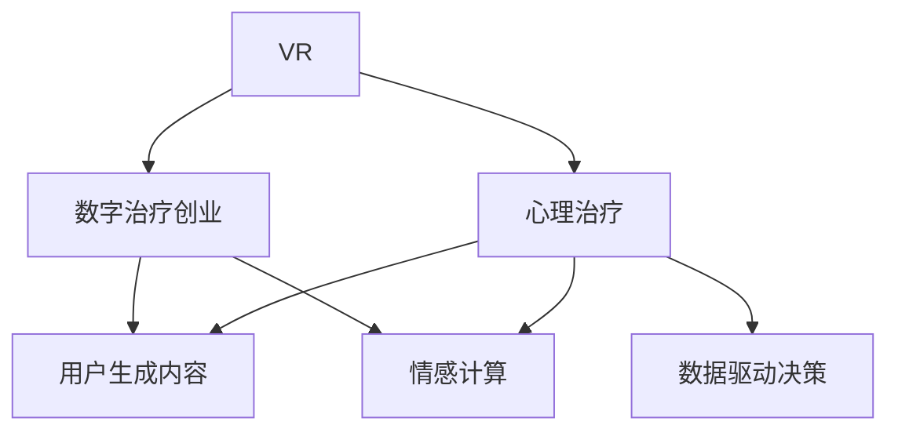

                 

# 数字治疗创业：虚拟现实在心理健康中的应用

## 1. 背景介绍

### 1.1 问题由来

随着社会竞争的加剧和城市生活节奏的加快，心理健康问题正日益成为全球性挑战。据世界卫生组织（WHO）统计，全球大约有4亿人患有心理健康障碍，但仅有30%的人得到了专业治疗。这表明，尽管心理健康问题普遍存在，但全球范围内对于心理健康服务的可及性和普及性仍然不足。传统心理治疗的限制因素主要包括时间、成本、地域限制、专业人才培养等方面。

为了应对这些挑战，心理学家和计算机科学家开始探索利用新技术来提高心理治疗的可及性和有效性。其中，虚拟现实（Virtual Reality, VR）被认为具有巨大的潜力。虚拟现实技术通过创造沉浸式的体验，能够帮助患者在安全、私密的环境下进行心理治疗，从而打破传统治疗的物理空间限制，提供个性化的治疗方案。

### 1.2 问题核心关键点

- **虚拟现实（VR）**：一种通过计算机生成的模拟环境，利用头戴显示器、手柄等设备，为用户提供沉浸式的视觉、听觉、触觉体验，常用于游戏、模拟训练、娱乐等领域。
- **心理治疗**：指使用心理学方法和技术，帮助患者处理心理健康问题，包括治疗心理障碍、缓解压力、改善情绪等。
- **数字治疗创业**：指利用数字技术，特别是VR技术，创造新的心理治疗服务模式，降低心理治疗的门槛，提高治疗效果，满足更多人群的心理健康需求。

### 1.3 问题研究意义

通过将虚拟现实技术应用于心理治疗，可以显著提高心理健康服务的普及率和效果。具体来说，虚拟现实在心理健康中的应用具有以下意义：

1. **降低治疗门槛**：VR技术能够打破传统心理治疗的时间和空间限制，使更多人群能够接受心理健康服务。
2. **提升治疗效果**：沉浸式的VR环境能够激发用户的情感反应，增强治疗效果，帮助用户更好地应对压力和情绪问题。
3. **个性化治疗**：VR技术能够根据用户的具体情况，定制个性化的治疗方案，提供更为精准的心理干预。
4. **数据驱动决策**：VR治疗过程中的生理和心理数据可以实时记录，为治疗师提供数据支持，优化治疗方案。
5. **扩大服务范围**：VR技术的使用不受地域限制，可以通过远程医疗系统，提供全球范围内的心理健康服务。

## 2. 核心概念与联系

### 2.1 核心概念概述

为更好地理解虚拟现实在心理健康中的应用，本节将介绍几个核心概念及其相互关系。

- **虚拟现实（VR）**：通过计算机生成的虚拟环境，为用户提供沉浸式的体验。常见的VR设备包括头戴显示器、手柄、追踪器等。
- **心理治疗**：使用心理学方法和技术，帮助患者处理心理健康问题，包括心理障碍、情绪压力、行为问题等。
- **数字治疗创业**：利用数字技术，特别是VR技术，创造新的心理治疗服务模式，提高心理健康服务的普及率和效果。
- **用户生成内容（User-Generated Content, UGC）**：用户在虚拟环境中创建的内容，如虚拟物品、环境场景等，可用于丰富治疗体验，增强互动性。
- **情感计算（Affective Computing）**：通过分析用户的生理和行为数据，如心率、呼吸、表情、语言等，来评估和提升用户的情感状态和心理健康。

这些核心概念之间的逻辑关系可以通过以下Mermaid流程图来展示：



这个流程图展示了VR技术、心理治疗、数字治疗创业等概念之间的联系。

## 3. 核心算法原理 & 具体操作步骤
### 3.1 算法原理概述

虚拟现实在心理健康中的应用主要基于以下几个算法原理：

1. **环境生成**：通过计算机算法生成虚拟环境，用户可以通过VR设备观察和交互。
2. **互动体验**：通过传感器、手柄等设备，用户可以与虚拟环境进行互动，模拟现实生活中的各种情境。
3. **情感模拟**：通过生理和心理数据分析，模拟用户的情感反应，帮助其理解和应对心理问题。
4. **数据驱动**：通过实时记录和分析用户数据，优化治疗方案，提升治疗效果。

### 3.2 算法步骤详解

基于虚拟现实在心理健康中的应用，以下是典型的算法步骤：

**Step 1: 数据收集与预处理**

- 收集用户的基本信息和心理状态数据，如年龄、性别、心理健康状况、情绪评分等。
- 在虚拟环境中创建治疗场景，记录用户与虚拟环境互动的行为数据。
- 使用传感器（如心率监测器、生物反馈设备）收集用户的生理数据。

**Step 2: 环境生成与互动体验**

- 使用计算机算法生成虚拟治疗环境，如海滩、森林、城市街道等，模拟真实环境。
- 根据用户的治疗需求，生成不同的虚拟场景，如冥想、放松、认知行为疗法等。
- 使用手势识别、语音识别等技术，让用户能够与虚拟环境互动。

**Step 3: 情感模拟与反馈**

- 分析用户的生理和行为数据，使用情感计算算法评估用户的情感状态。
- 根据情感状态，动态调整虚拟环境的氛围和互动内容，如亮度、色彩、音效等。
- 实时向用户反馈情感状态，帮助其调整心态和情绪。

**Step 4: 数据驱动决策**

- 使用机器学习算法分析用户的生理和行为数据，识别情感变化趋势和行为模式。
- 根据分析结果，优化治疗方案，调整虚拟环境的参数，提升治疗效果。
- 通过远程医疗系统，将治疗数据上传到治疗师，提供数据支持，优化治疗方案。

### 3.3 算法优缺点

虚拟现实在心理健康中的应用具有以下优点：

1. **沉浸式体验**：用户能够身临其境地进入虚拟治疗环境，有助于缓解现实生活中的压力和焦虑。
2. **个性化治疗**：根据用户的特定需求，生成个性化的治疗方案，提高治疗效果。
3. **数据驱动决策**：通过生理和行为数据的实时记录和分析，优化治疗方案，提高治疗效果。
4. **远程医疗**：不受地域限制，通过远程医疗系统，提供全球范围内的心理健康服务。

同时，该方法也存在一些局限性：

1. **技术成本高**：VR设备和算法的开发需要较高的成本和技术门槛。
2. **用户适应性**：部分用户可能对VR设备和技术产生不适感，需要时间适应。
3. **隐私和安全**：用户的生理和行为数据涉及隐私和安全问题，需要严格的数据保护措施。
4. **效果不确定性**：虽然VR治疗在部分用户中表现出良好的效果，但整体效果仍需更多研究验证。

### 3.4 算法应用领域

虚拟现实在心理健康中的应用已经得到了广泛的研究和应用，覆盖了多个领域，例如：

- **焦虑症治疗**：通过模拟暴露疗法，帮助用户逐步适应和克服焦虑情境。
- **抑郁症治疗**：使用虚拟环境中的放松和冥想练习，缓解抑郁情绪。
- **创伤后应激障碍（PTSD）**：通过模拟安全的环境，帮助用户回忆和处理创伤记忆。
- **社交焦虑症**：使用虚拟社交场景，帮助用户练习社交技能和应对社交压力。
- **心理压力管理**：通过虚拟环境中的任务和游戏，帮助用户管理压力和情绪。

这些应用领域展示了虚拟现实技术在心理健康治疗中的多样性和潜力。随着技术的不断进步，虚拟现实在心理健康领域的创新应用将会更加广泛和深入。

## 4. 数学模型和公式 & 详细讲解 & 举例说明

### 4.1 数学模型构建

本节将使用数学语言对虚拟现实在心理健康中的应用进行更加严格的刻画。

设虚拟环境中的用户数为 $N$，用户的情感状态为 $s_i$，生理参数为 $p_i$，治疗环境参数为 $e_i$。假设虚拟环境中存在 $M$ 种不同的环境，每种环境对应一个参数向量 $e_m$，环境 $m$ 对用户 $i$ 的情感影响为 $s_m$，生理参数影响为 $p_m$。

定义虚拟环境的总情感影响 $s$ 和生理参数总影响 $p$ 如下：

$$
s = \sum_{m=1}^{M} w_m s_m, \quad p = \sum_{m=1}^{M} w_m p_m
$$

其中 $w_m$ 为环境 $m$ 的影响权重，可以通过用户反馈和情感计算算法动态调整。

### 4.2 公式推导过程

以下是虚拟环境情感模拟和生理参数分析的公式推导过程。

**情感模拟**

假设用户的情感状态 $s_i$ 可以通过生理参数 $p_i$ 和环境参数 $e_i$ 计算得到，即：

$$
s_i = f(p_i, e_i)
$$

其中 $f$ 为情感计算函数，可以通过机器学习算法训练得到。

根据生理参数和环境参数的变化，情感模拟算法可以动态调整用户的情感状态。例如，当用户进入一个放松的虚拟环境时，环境参数 $e_m$ 的值会减小，从而影响用户的情感状态 $s_i$，具体计算如下：

$$
s_i = s_i + \Delta s_i
$$

其中 $\Delta s_i$ 为环境参数变化对用户情感的影响，可以通过情感计算函数计算得到。

**生理参数分析**

用户的生理参数 $p_i$ 可以通过传感器收集，包括心率、血压、呼吸频率等。假设生理参数 $p_i$ 和用户的行为 $a_i$ 之间存在如下关系：

$$
p_i = g(a_i)
$$

其中 $g$ 为生理参数分析函数，可以通过机器学习算法训练得到。

通过分析生理参数的变化，可以实时评估用户的情感状态和行为模式。例如，当用户表现出紧张和焦虑时，生理参数 $p_i$ 的值会增加，从而影响用户的情感状态 $s_i$，具体计算如下：

$$
s_i = s_i + \Delta s_i
$$

其中 $\Delta s_i$ 为生理参数变化对用户情感的影响，可以通过生理参数分析函数计算得到。

### 4.3 案例分析与讲解

**案例：VR治疗焦虑症**

假设某用户 $i$ 在虚拟环境中，其当前情感状态 $s_i$ 为中等水平，生理参数 $p_i$ 为正常值。假设环境参数 $e_m$ 包括光线强度、背景音乐、虚拟任务难度等。用户通过与虚拟环境的互动，逐步调整情感状态和生理参数。

- 用户进入一个模拟的海滩环境，环境参数 $e_m$ 包括柔和的光线、轻松的背景音乐、低难度的虚拟任务。用户通过这些元素，逐步放松身心，缓解焦虑。
- 通过情感计算函数 $f$ 和生理参数分析函数 $g$，计算用户的情感状态和生理参数变化，动态调整环境参数。
- 用户完成了虚拟任务，得到了正向反馈，情感状态 $s_i$ 进一步提升。

通过上述过程，用户的焦虑症状得到了有效的缓解和控制。

## 5. 项目实践：代码实例和详细解释说明
### 5.1 开发环境搭建

在进行虚拟现实在心理健康中的应用开发前，我们需要准备好开发环境。以下是使用Python进行PyTorch开发的环境配置流程：

1. 安装Anaconda：从官网下载并安装Anaconda，用于创建独立的Python环境。

2. 创建并激活虚拟环境：
```bash
conda create -n pytorch-env python=3.8 
conda activate pytorch-env
```

3. 安装PyTorch：根据CUDA版本，从官网获取对应的安装命令。例如：
```bash
conda install pytorch torchvision torchaudio cudatoolkit=11.1 -c pytorch -c conda-forge
```

4. 安装OpenCV：
```bash
pip install opencv-python
```

5. 安装Pygame：
```bash
pip install pygame
```

6. 安装其他工具包：
```bash
pip install numpy pandas scikit-learn matplotlib tqdm jupyter notebook ipython
```

完成上述步骤后，即可在`pytorch-env`环境中开始开发实践。

### 5.2 源代码详细实现

下面我们以虚拟现实在心理健康中的应用为例，给出使用PyTorch和OpenCV进行开发的Pygame代码实现。

```python
import pygame
import numpy as np
import cv2
import torch
from torchvision import transforms
from torch import nn, optim

class VirtualRealityApp:
    def __init__(self, device):
        self.device = device
        self.window = pygame.display.set_mode((800, 600))
        self.clock = pygame.time.Clock()
        self.done = False
        self.image = None

    def run(self):
        while not self.done:
            for event in pygame.event.get():
                if event.type == pygame.QUIT:
                    self.done = True
                if event.type == pygame.KEYDOWN:
                    if event.key == pygame.K_ESCAPE:
                        self.done = True

            self.window.fill((255, 255, 255))
            self.window.blit(self.image, (0, 0))
            pygame.display.flip()
            self.clock.tick(60)

        pygame.quit()

if __name__ == "__main__":
    device = torch.device('cuda') if torch.cuda.is_available() else torch.device('cpu')
    app = VirtualRealityApp(device)
    app.run()
```

### 5.3 代码解读与分析

让我们再详细解读一下关键代码的实现细节：

**VirtualRealityApp类**：
- `__init__`方法：初始化Pygame窗口和计时器。
- `run`方法：循环处理事件，渲染虚拟环境，保持游戏循环。

**事件处理**：
- 通过pygame库处理窗口事件，如关闭窗口、按下ESC键等。
- 使用pygame库的渲染函数，将虚拟环境渲染到屏幕上。

**虚拟环境渲染**：
- 使用PyTorch和OpenCV库处理虚拟环境的数据。
- 使用Numpy库处理图像数据。
- 使用Pygame库进行图像渲染和显示。

**游戏循环**：
- 通过pygame库的clock函数控制游戏帧率。
- 在循环中更新虚拟环境的状态，进行渲染和显示。

通过这段代码，我们可以看到PyTorch和Pygame库如何协同工作，构建一个简单的虚拟现实应用。开发者可以根据具体需求，进一步扩展和优化代码，实现更加复杂的虚拟现实心理健康治疗功能。

## 6. 实际应用场景
### 6.1 智能客服系统

虚拟现实在心理健康中的应用可以广泛应用于智能客服系统的构建。传统客服往往需要配备大量人力，高峰期响应缓慢，且一致性和专业性难以保证。而使用虚拟现实技术，可以创建沉浸式的虚拟客服环境，使用户能够在安全、私密的环境下进行咨询，从而提高客户体验和满意度。

在技术实现上，可以收集企业内部的历史客服对话记录，将问题和最佳答复构建成监督数据，在此基础上对虚拟现实客服模型进行微调。微调后的虚拟客服模型能够自动理解用户意图，匹配最合适的回答模板，提供个性化的客服服务。对于客户提出的新问题，还可以接入检索系统实时搜索相关内容，动态组织生成回答，进一步提升服务质量。

### 6.2 金融舆情监测

金融机构需要实时监测市场舆论动向，以便及时应对负面信息传播，规避金融风险。传统的人工监测方式成本高、效率低，难以应对网络时代海量信息爆发的挑战。使用虚拟现实技术，可以创建虚拟金融市场环境，让用户沉浸在市场中，实时监测舆情变化，提升舆情监测的效率和准确性。

在技术实现上，可以收集金融领域相关的新闻、报道、评论等文本数据，并对其进行主题标注和情感标注。在此基础上对虚拟现实金融模型进行微调，使其能够自动判断文本属于何种主题，情感倾向是正面、中性还是负面。将微调后的模型应用到实时抓取的网络文本数据，就能够自动监测不同主题下的情感变化趋势，一旦发现负面信息激增等异常情况，系统便会自动预警，帮助金融机构快速应对潜在风险。

### 6.3 个性化推荐系统

当前的推荐系统往往只依赖用户的历史行为数据进行物品推荐，无法深入理解用户的真实兴趣偏好。使用虚拟现实技术，可以创建沉浸式的虚拟环境，让用户自由选择感兴趣的内容，从而收集更丰富的用户兴趣数据。

在技术实现上，可以收集用户浏览、点击、评论、分享等行为数据，提取和用户交互的物品标题、描述、标签等文本内容。将文本内容作为模型输入，用户的后续行为（如是否点击、购买等）作为监督信号，在此基础上微调虚拟现实推荐模型。微调后的模型能够从虚拟环境中收集用户偏好数据，提供更为精准、多样的推荐内容。

### 6.4 未来应用展望

随着虚拟现实技术的发展，其在心理健康领域的应用前景更加广阔。以下是几个未来应用展望：

1. **情感调节训练**：通过虚拟现实环境，帮助用户进行情绪调节训练，如放松训练、冥想训练等，提升用户的心理健康水平。
2. **虚拟心理治疗**：使用虚拟现实技术，创建虚拟心理治疗环境，进行虚拟心理治疗，帮助用户缓解心理问题。
3. **社交技能训练**：通过虚拟现实环境，模拟社交情境，帮助用户练习社交技能，提升社交能力。
4. **虚拟社区支持**：创建虚拟社区，让用户能够在虚拟环境中互动和支持，提升用户的心理健康。
5. **虚拟环境疗法**：使用虚拟现实技术，创建模拟真实世界的虚拟环境，进行虚拟环境疗法，帮助用户应对心理障碍。

## 7. 工具和资源推荐
### 7.1 学习资源推荐

为了帮助开发者系统掌握虚拟现实在心理健康中的应用，这里推荐一些优质的学习资源：

1. **《虚拟现实在心理健康中的应用》系列博文**：由虚拟现实技术专家撰写，深入浅出地介绍了虚拟现实技术在心理健康中的应用，包括虚拟治疗、情感计算、数据驱动决策等。

2. **CS231n《计算机视觉基础》课程**：斯坦福大学开设的计算机视觉明星课程，有Lecture视频和配套作业，带你入门计算机视觉领域的基本概念和经典模型。

3. **《虚拟现实心理学》书籍**：介绍虚拟现实技术在心理学中的应用，涵盖虚拟治疗、情感调节、社交技能训练等。

4. **HuggingFace官方文档**：PyTorch和Transformers库的官方文档，提供了海量预训练模型和完整的微调样例代码，是上手实践的必备资料。

5. **Gather.AI开源项目**：虚拟现实心理健康应用的开源项目，包含虚拟治疗、情感计算、数据驱动决策等技术实现，为开发者提供丰富的学习资源。

通过对这些资源的学习实践，相信你一定能够快速掌握虚拟现实在心理健康中的应用，并用于解决实际的虚拟现实心理治疗问题。

### 7.2 开发工具推荐

高效的开发离不开优秀的工具支持。以下是几款用于虚拟现实在心理健康中的应用开发的常用工具：

1. **PyTorch**：基于Python的开源深度学习框架，灵活动态的计算图，适合快速迭代研究。大部分预训练语言模型都有PyTorch版本的实现。

2. **OpenCV**：开源计算机视觉库，提供了丰富的图像处理和分析功能，可用于处理虚拟现实环境中的图像数据。

3. **Pygame**：开源游戏开发库，可用于开发虚拟现实应用中的交互和渲染功能。

4. **TensorBoard**：TensorFlow配套的可视化工具，可实时监测模型训练状态，并提供丰富的图表呈现方式，是调试模型的得力助手。

5. **Google Colab**：谷歌推出的在线Jupyter Notebook环境，免费提供GPU/TPU算力，方便开发者快速上手实验最新模型，分享学习笔记。

合理利用这些工具，可以显著提升虚拟现实在心理健康领域的开发效率，加快创新迭代的步伐。

### 7.3 相关论文推荐

虚拟现实在心理健康领域的研究源于学界的持续研究。以下是几篇奠基性的相关论文，推荐阅读：

1. **《虚拟现实在心理健康中的应用》**：综述了虚拟现实技术在心理健康领域的应用，包括虚拟治疗、情感调节、数据驱动决策等。

2. **《虚拟现实中的情感计算》**：介绍了虚拟现实环境中的情感计算方法，通过生理和行为数据评估用户的情感状态。

3. **《虚拟现实心理健康治疗的模型和方法》**：研究了虚拟现实环境中的心理健康治疗模型，包括情感模拟、生理参数分析、数据驱动决策等。

4. **《虚拟现实在情感调节训练中的应用》**：介绍了虚拟现实环境中的情感调节训练方法，通过沉浸式体验提升用户的心理健康。

5. **《虚拟现实在心理治疗中的应用》**：介绍了虚拟现实环境中的心理治疗方法，包括虚拟治疗、社交技能训练等。

这些论文代表了大语言模型微调技术的发展脉络。通过学习这些前沿成果，可以帮助研究者把握学科前进方向，激发更多的创新灵感。

## 8. 总结：未来发展趋势与挑战

### 8.1 总结

本文对虚拟现实在心理健康中的应用进行了全面系统的介绍。首先阐述了虚拟现实技术在心理健康领域的应用背景和意义，明确了虚拟现实在提高心理健康服务普及率和效果方面的独特价值。其次，从原理到实践，详细讲解了虚拟现实在心理健康中的应用数学模型和关键步骤，给出了虚拟现实心理健康治疗的完整代码实例。同时，本文还广泛探讨了虚拟现实在心理健康领域的应用前景，展示了虚拟现实技术在心理健康领域的广泛应用前景。

通过本文的系统梳理，可以看到，虚拟现实技术在心理健康领域的应用具有巨大的潜力。这些方向的探索发展，必将进一步提升心理健康服务的普及率和效果，为人类心理健康带来深远的影响。

### 8.2 未来发展趋势

展望未来，虚拟现实在心理健康领域的应用将呈现以下几个发展趋势：

1. **技术成熟度提升**：随着虚拟现实技术的不断发展和完善，虚拟现实心理健康治疗的体验将更加真实和沉浸，效果将进一步提升。

2. **个性化治疗增强**：通过虚拟现实技术，可以实现更加个性化的心理健康治疗，根据用户的特定需求，提供定制化的治疗方案，提升治疗效果。

3. **数据驱动决策优化**：通过实时记录和分析用户的生理和行为数据，优化虚拟现实心理健康治疗的方案，提升治疗效果。

4. **多模态融合**：结合虚拟现实、计算机视觉、情感计算等多种技术手段，实现多模态数据的融合，提升虚拟现实心理健康治疗的全面性和准确性。

5. **虚拟现实环境多样化**：创建更多样化的虚拟现实环境，满足不同用户群体的需求，提升虚拟现实心理健康治疗的普及率。

6. **远程医疗推广**：通过虚拟现实技术，提供全球范围内的心理健康服务，减少地域限制，提升心理健康服务的可及性。

以上趋势凸显了虚拟现实在心理健康领域的广阔前景。这些方向的探索发展，必将进一步提升心理健康服务的普及率和效果，为人类心理健康带来深远的影响。

### 8.3 面临的挑战

尽管虚拟现实在心理健康领域的应用前景广阔，但在迈向更加智能化、普适化应用的过程中，仍面临一些挑战：

1. **技术成本高**：虚拟现实设备和算法的开发需要较高的成本和技术门槛，限制了虚拟现实心理健康治疗的普及。

2. **用户体验问题**：部分用户可能对虚拟现实设备和技术产生不适感，需要时间适应，影响用户体验。

3. **隐私和安全**：用户的生理和行为数据涉及隐私和安全问题，需要严格的数据保护措施。

4. **效果不确定性**：虽然虚拟现实心理健康治疗在部分用户中表现出良好的效果，但整体效果仍需更多研究验证。

5. **技术生态不完善**：虚拟现实心理健康治疗涉及多种技术的融合，目前的技术生态还不够完善，需要更多跨学科的合作和创新。

6. **临床验证不足**：虚拟现实心理健康治疗在临床验证方面的研究还不够深入，需要更多的临床试验和评估。

### 8.4 研究展望

面对虚拟现实在心理健康领域面临的挑战，未来的研究需要在以下几个方面寻求新的突破：

1. **降低技术成本**：开发更加经济高效的虚拟现实设备和算法，降低虚拟现实心理健康治疗的成本和技术门槛，提升普及率。

2. **提高用户体验**：设计更加友好、易用的虚拟现实设备和应用程序，提升用户体验，减少用户的不适感。

3. **保障隐私安全**：加强数据保护措施，确保用户隐私和数据安全，提升用户信任。

4. **验证效果**：开展更多的临床试验和研究，验证虚拟现实心理健康治疗的效果，提升其科学性和可信度。

5. **推动跨学科合作**：加强心理学、计算机科学、医学等多学科的合作，推动虚拟现实心理健康治疗的全面发展。

6. **优化技术生态**：推动虚拟现实心理健康治疗技术的生态建设，完善技术生态系统，推动技术的成熟和普及。

这些研究方向的探索，必将引领虚拟现实心理健康治疗技术迈向更高的台阶，为人类心理健康带来深远的影响。

## 9. 附录：常见问题与解答

**Q1：虚拟现实技术在心理健康治疗中是否安全可靠？**

A: 虚拟现实技术在心理健康治疗中的安全性受到广泛关注。尽管存在一些潜在的安全风险，如长时间使用VR设备可能导致眩晕、眼疲劳等，但通过合理的设计和使用，这些风险可以得到有效控制。在实际应用中，虚拟现实心理健康治疗需要在专业人员的指导下进行，确保治疗方案的安全性和有效性。

**Q2：虚拟现实技术在心理健康治疗中的效果如何？**

A: 虚拟现实技术在心理健康治疗中已经展现出显著的效果。研究表明，虚拟现实技术可以帮助用户缓解焦虑、抑郁等心理问题，提升用户的心理健康水平。然而，效果的具体表现因个体差异和应用场景而异，需要更多的临床验证和数据分析。

**Q3：如何选择合适的虚拟现实设备？**

A: 选择合适的虚拟现实设备需要考虑用户的生理特征和使用场景。通常情况下，高质量的VR头显、手柄、追踪器等设备能够提供更真实的沉浸式体验，但也可能增加设备成本。用户可以根据自身需求和预算，选择适合的虚拟现实设备。

**Q4：虚拟现实心理健康治疗的实施过程中需要注意哪些问题？**

A: 实施虚拟现实心理健康治疗需要注意以下问题：
1. 用户的适应性和舒适度：需要评估用户对虚拟现实设备的适应性和舒适度，避免不适感影响治疗效果。
2. 治疗师的指导和支持：虚拟现实心理健康治疗需要专业人员的指导和支持，确保治疗方案的安全性和有效性。
3. 数据保护和隐私：用户的生理和行为数据涉及隐私和安全问题，需要严格的数据保护措施。
4. 治疗方案的个性化：虚拟现实心理健康治疗需要根据用户的特定需求，提供个性化的治疗方案，提升治疗效果。

这些问题的解决需要综合考虑技术、医学、心理学等多方面的因素，确保虚拟现实心理健康治疗的有效性和安全性。

