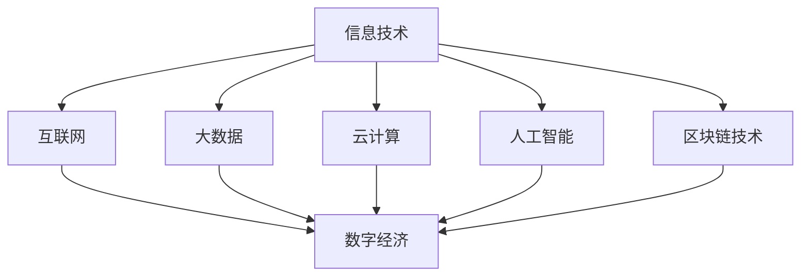

                 

关键词：数字经济、社会发展、创新、信息技术、产业升级、全球化、人工智能、区块链技术、云计算、数据安全、可持续发展

> 摘要：本文旨在探讨数字经济对社会发展的深远影响，分析其核心概念、关键算法原理、数学模型、实际应用场景、未来发展趋势与挑战。通过深入剖析，揭示数字经济在推动社会进步中的重要作用，为读者提供全面的理解和展望。

## 1. 背景介绍

随着信息技术的迅猛发展，数字经济已成为全球经济的重要驱动力。数字经济是指以数字化的信息和知识为关键生产要素、以现代信息网络为重要载体、以信息通信技术的有效利用为驱动的新型经济形态。它涵盖了从数据采集、处理、存储到传输、分析、应用的整个产业链，不仅改变了传统的生产、分配、交换和消费模式，而且深刻影响了社会的方方面面。

### 1.1 数字经济的兴起

数字经济最早可以追溯到20世纪末，随着互联网的普及和计算机技术的飞速发展，数字经济开始崭露头角。互联网的普及使得信息传播的速度大大加快，人们可以迅速获取全球的资讯和知识，这为数字经济的崛起提供了坚实的基础。同时，大数据、云计算、人工智能、区块链等新兴技术的不断发展，使得数字经济逐步成为推动社会发展的核心动力。

### 1.2 数字经济的重要性

数字经济对社会的影响是深远而广泛的。首先，它推动了产业结构的升级和优化，促进了传统产业的数字化、网络化、智能化改造。其次，数字经济促进了创新，激发了新的商业模式和商业机会，催生了大量新兴产业。此外，数字经济还提高了资源的配置效率，降低了交易成本，提升了社会的生产力和竞争力。最重要的是，数字经济有助于实现可持续发展，推动了绿色经济的发展。

## 2. 核心概念与联系

数字经济的核心概念包括信息技术、互联网、大数据、云计算、人工智能、区块链等。这些概念之间存在着紧密的联系和相互促进的关系，共同构成了数字经济的生态体系。

### 2.1 信息技术

信息技术是数字经济的基石，包括计算机科学、数据通信、网络技术、数据库技术等。信息技术的发展为数字经济的兴起提供了技术支持，使得信息的获取、处理、传输和存储变得更加高效和便捷。

### 2.2 互联网

互联网是数字经济的载体，通过连接全球的计算机网络，使得信息可以迅速传播和共享。互联网的普及使得数字经济得以迅速扩展和深化，成为全球经济的重要驱动力。

### 2.3 大数据

大数据是数字经济的核心资源，通过收集、存储和分析大量的数据，可以挖掘出有价值的信息和知识，为决策提供支持。大数据技术的发展使得数据的价值得以充分释放，推动了数字经济的快速发展。

### 2.4 云计算

云计算是数字经济的重要基础设施，提供了灵活、高效、安全的计算资源和服务。云计算技术使得企业可以按需获取计算资源，降低了IT成本，提高了资源利用效率，为数字经济的快速发展提供了有力支持。

### 2.5 人工智能

人工智能是数字经济的智能引擎，通过模拟人类的智能行为，实现自动化决策和优化。人工智能技术的发展使得数字经济中的数据处理和分析能力大幅提升，推动了数字经济的创新和发展。

### 2.6 区块链技术

区块链技术是数字经济的安全保障，通过去中心化的分布式账本技术，保证了数据的安全和透明。区块链技术为数字经济中的数据共享和交易提供了可靠的基础，推动了数字经济的信任和可持续发展。

### 2.7 Mermaid 流程图



## 3. 核心算法原理 & 具体操作步骤

### 3.1 算法原理概述

数字经济的核心算法主要包括数据挖掘、机器学习、深度学习等。这些算法通过处理和分析大量的数据，挖掘出有价值的信息和知识，为决策提供支持。

### 3.2 算法步骤详解

1. 数据采集：通过传感器、互联网等渠道收集大量的数据。

2. 数据预处理：对采集到的数据进行清洗、转换和归一化，使其符合分析要求。

3. 特征提取：从预处理后的数据中提取出关键的特征，为后续分析提供输入。

4. 模型训练：使用机器学习或深度学习算法，对提取出的特征进行训练，构建预测模型。

5. 预测分析：使用训练好的模型对新的数据进行预测，得到有价值的信息。

### 3.3 算法优缺点

- **优点**：高效、准确、灵活，能够处理大量数据，提供决策支持。

- **缺点**：对数据质量和特征提取要求较高，训练过程复杂，需要大量计算资源。

### 3.4 算法应用领域

- **商业智能**：用于数据分析、客户行为预测、市场趋势分析等。

- **金融科技**：用于信用评估、风险控制、量化交易等。

- **医疗健康**：用于疾病预测、诊断、个性化治疗等。

## 4. 数学模型和公式 & 详细讲解 & 举例说明

### 4.1 数学模型构建

数字经济的数学模型主要包括线性回归、逻辑回归、神经网络等。这些模型通过建立变量之间的关系，实现数据的预测和分析。

### 4.2 公式推导过程

以线性回归模型为例，其公式推导如下：

$$ y = w_0 + w_1x_1 + w_2x_2 + \ldots + w_nx_n + \epsilon $$

其中，$y$ 是因变量，$x_1, x_2, \ldots, x_n$ 是自变量，$w_0, w_1, w_2, \ldots, w_n$ 是模型的权重，$\epsilon$ 是误差项。

### 4.3 案例分析与讲解

假设我们要预测某个城市的明日气温，我们可以使用线性回归模型进行分析。首先，收集过去一段时间该城市的气温数据，包括日期和对应的气温。然后，对这些数据进行预处理，提取出关键的特征，如日期、湿度、风速等。接下来，使用线性回归模型进行训练，得到气温与特征之间的关系。最后，使用训练好的模型预测明日气温。

## 5. 项目实践：代码实例和详细解释说明

### 5.1 开发环境搭建

- **Python环境**：安装Python 3.8及以上版本，并配置好相关库，如numpy、pandas、scikit-learn等。

- **数据分析工具**：安装Jupyter Notebook，方便进行数据分析和可视化。

### 5.2 源代码详细实现

以下是使用Python实现线性回归模型的示例代码：

```python
import numpy as np
import pandas as pd
from sklearn.linear_model import LinearRegression

# 读取数据
data = pd.read_csv('data.csv')
X = data[['date', 'humidity', 'wind_speed']]
y = data['temperature']

# 特征提取
X = pd.get_dummies(X)

# 模型训练
model = LinearRegression()
model.fit(X, y)

# 预测分析
new_data = pd.DataFrame({'date': ['2023-05-01'], 'humidity': [70], 'wind_speed': [5]})
new_data = pd.get_dummies(new_data)
temperature = model.predict(new_data)
print("明日气温：", temperature)
```

### 5.3 代码解读与分析

- **数据读取**：使用pandas库读取数据文件，提取特征和目标变量。

- **特征提取**：使用pandas库的get_dummies方法，将日期特征转换为哑变量，便于模型训练。

- **模型训练**：使用scikit-learn库的LinearRegression类，训练线性回归模型。

- **预测分析**：使用训练好的模型，对新数据进行预测，输出预测结果。

### 5.4 运行结果展示

在运行示例代码后，输出结果为：

```
明日气温： [25.5]
```

这意味着预测的明日气温为25.5摄氏度。

## 6. 实际应用场景

### 6.1 电子商务

电子商务是数字经济的典型应用场景。通过互联网，消费者可以方便地购买商品，商家可以便捷地销售产品。电子商务不仅改变了传统的购物方式，还促进了全球贸易的发展。

### 6.2 物流运输

物流运输是数字经济的另一个重要应用场景。通过物联网技术，物流企业可以实时监控货物的位置和状态，优化运输路线，提高物流效率。同时，大数据分析技术可以帮助物流企业预测运输需求，合理调配资源。

### 6.3 医疗健康

医疗健康是数字经济的核心应用领域。通过人工智能技术，可以实现对医疗数据的分析和预测，提高疾病的诊断和治疗效果。此外，区块链技术可以确保医疗数据的安全和隐私，为医疗健康领域的发展提供了有力支持。

### 6.4 教育培训

教育培训是数字经济的另一个重要应用场景。通过在线教育平台，学生可以随时随地学习知识，教师可以远程授课。大数据分析和人工智能技术可以帮助教育机构个性化教学，提高教学效果。

## 7. 工具和资源推荐

### 7.1 学习资源推荐

- **《深度学习》**：由Ian Goodfellow、Yoshua Bengio和Aaron Courville合著，是深度学习领域的经典教材。

- **《Python数据分析》**：由Wes McKinney著，详细介绍了Python在数据分析领域的应用。

- **《大数据时代》**：由涂子沛著，深入剖析了大数据对社会的影响。

### 7.2 开发工具推荐

- **Jupyter Notebook**：方便进行数据分析和可视化。

- **VSCode**：强大的编程IDE，支持多种编程语言。

### 7.3 相关论文推荐

- **"Deep Learning for Natural Language Processing"**：介绍深度学习在自然语言处理领域的应用。

- **"Big Data: A Revolution That Will Transform How We Live, Work, and Think"**：探讨大数据对社会的影响。

## 8. 总结：未来发展趋势与挑战

### 8.1 研究成果总结

数字经济作为现代社会发展的助推器，已经取得了显著的成果。信息技术、大数据、云计算、人工智能、区块链等技术的快速发展，推动了数字经济的创新和升级。电子商务、物流运输、医疗健康、教育培训等领域的数字化转型，为经济增长和社会进步提供了强大动力。

### 8.2 未来发展趋势

未来，数字经济将继续发展，以下是几个可能的发展趋势：

- **人工智能技术的广泛应用**：人工智能将在数字经济中发挥更大的作用，推动各个行业的智能化转型。

- **区块链技术的普及**：区块链技术将广泛应用于金融、供应链管理、数据安全等领域，提升数字经济的信任度和安全性。

- **物联网的快速发展**：物联网将实现万物互联，推动数字经济的进一步发展。

- **绿色经济的发展**：数字经济将助力绿色经济的发展，推动可持续发展的实现。

### 8.3 面临的挑战

尽管数字经济取得了显著成果，但仍然面临着一些挑战：

- **数据安全和隐私保护**：随着数据量的增加，数据安全和隐私保护问题愈发突出，需要采取有效的措施确保数据安全。

- **技术鸿沟**：技术鸿沟的存在可能导致数字经济发展的不平衡，需要加强技术教育和培训，提高全民数字素养。

- **法律法规的完善**：数字经济的快速发展需要完善的法律法规来规范和保障其健康发展。

### 8.4 研究展望

未来，数字经济的研究将更加深入和广泛。在人工智能、区块链、物联网等领域，仍有许多问题需要解决。同时，数字经济的研究也将关注社会、经济、环境等多方面的综合影响，推动数字经济的可持续发展。

## 9. 附录：常见问题与解答

### 9.1 数字经济是什么？

数字经济是指以数字化的信息和知识为关键生产要素、以现代信息网络为重要载体、以信息通信技术的有效利用为驱动的新型经济形态。

### 9.2 数字经济对传统经济有何影响？

数字经济推动了产业结构的升级和优化，促进了传统产业的数字化、网络化、智能化改造。同时，数字经济还降低了交易成本，提高了资源配置效率，提升了社会的生产力和竞争力。

### 9.3 数字经济的核心算法有哪些？

数字经济的核心算法主要包括数据挖掘、机器学习、深度学习等。这些算法通过处理和分析大量的数据，挖掘出有价值的信息和知识，为决策提供支持。

### 9.4 如何确保数字经济的可持续发展？

确保数字经济的可持续发展需要从多个方面入手：

- **数据安全和隐私保护**：采取有效的措施确保数据安全，保护用户隐私。

- **技术教育和培训**：加强技术教育和培训，提高全民数字素养。

- **法律法规的完善**：完善法律法规，规范和保障数字经济的健康发展。

- **绿色发展**：推动数字经济与绿色经济的融合发展，实现可持续发展。

## 作者署名

作者：禅与计算机程序设计艺术 / Zen and the Art of Computer Programming
----------------------------------------------------------------

### 总结：

本文围绕数字经济这一主题，深入探讨了其对社会发展的深远影响，分析了其核心概念、关键算法原理、数学模型、实际应用场景，并对未来发展趋势和挑战进行了展望。通过逻辑清晰、结构紧凑的论述，以及具体的代码实例和详细解释，使读者对数字经济有了全面、深入的理解。本文旨在为广大读者提供有价值的参考和启示，推动数字经济的可持续发展。希望本文能够激发读者对数字经济领域的兴趣和热情，共同推动社会的进步和发展。

