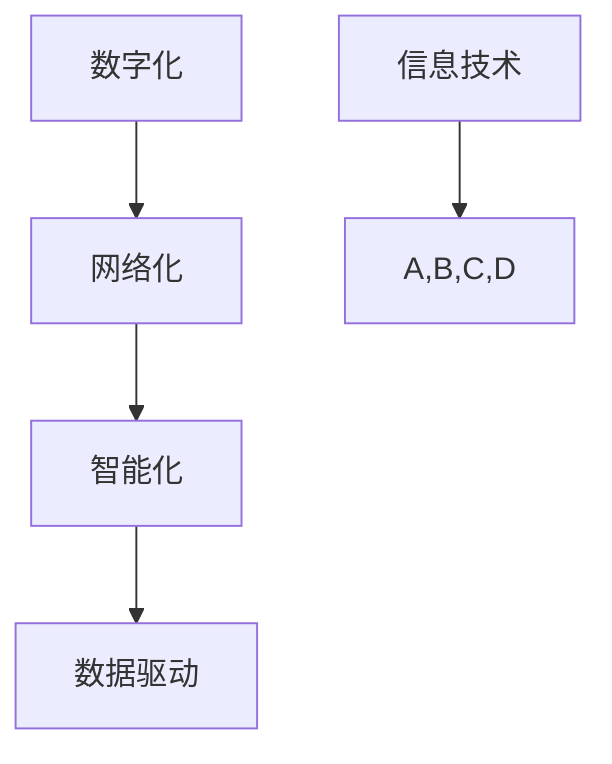

                 

 **关键词**：数字经济、社会发展、创新、技术进步、产业链升级

**摘要**：本文旨在探讨数字经济对社会发展的深远影响。随着信息技术的飞速发展，数字经济已经成为推动社会进步的重要力量。本文将详细阐述数字经济的概念、核心特征，分析其在全球范围内的应用与趋势，并探讨其对传统产业的影响、新型商业模式的出现以及未来发展的挑战与机遇。

## 1. 背景介绍

在过去的几十年里，全球范围内的信息技术经历了飞速的发展，互联网的普及、大数据的兴起、云计算的广泛应用，使得数据成为了新时代的“新石油”。数字经济的概念也随之而生，它不仅改变了人们的生活方式，更推动了社会的全面发展。数字经济是信息化时代的一种经济形态，它以数据为关键生产要素，以信息技术为主要驱动力，通过互联网等通信技术实现经济活动的数字化、网络化、智能化。

### 1.1 数字经济的重要性

数字经济的重要性体现在以下几个方面：

1. **经济增长**：数字经济为传统产业注入了新的活力，推动了产业链的升级和优化，成为经济增长的新引擎。
2. **社会进步**：数字经济促进了信息的快速传播和共享，提升了社会整体的科技创新能力和管理水平。
3. **就业模式**：数字经济催生了大量新兴职业，改变了人们的就业模式，提供了更多灵活的工作机会。
4. **产业变革**：数字经济促进了产业结构的调整，传统产业通过数字化升级，实现了高质量发展。

### 1.2 数字经济的核心特征

数字经济的核心特征包括：

1. **数字化**：经济活动的各个环节都通过数字技术实现，包括生产、交易、服务等。
2. **网络化**：通过互联网实现全球范围内的信息互联互通，打破了地域限制。
3. **智能化**：利用人工智能、大数据等技术实现自动化决策和优化，提升了生产效率和服务质量。
4. **数据驱动**：以数据为决策基础，通过数据分析实现精准营销和个性化服务。

## 2. 核心概念与联系

为了更清晰地理解数字经济，我们需要从核心概念和联系的角度进行分析。以下是一个简化的Mermaid流程图，展示了数字经济的核心概念及其相互联系。



### 2.1 数字化

数字化是指将传统经济活动中的物理、书面等信息转化为数字形式。这包括生产流程的数字化、交易数据的数字化、管理信息的数字化等。数字化是数字经济的基石，为后续的网络化、智能化提供了数据基础。

### 2.2 网络化

网络化是指通过互联网实现信息的全球互通和共享。网络化使得信息传播速度大幅提升，商业活动突破了地域限制，形成了全球化的市场格局。网络化是数字经济的重要组成部分，为经济活动提供了广阔的舞台。

### 2.3 智能化

智能化是指利用人工智能技术实现自动化决策和优化。智能化提升了生产效率和服务质量，使得经济活动更加高效和精准。智能化是数字经济的核心驱动力，推动了传统产业的转型升级。

### 2.4 数据驱动

数据驱动是指以数据为决策基础，通过数据分析实现精准营销和个性化服务。数据驱动是数字经济的重要特征，它使得企业能够更好地了解市场需求，优化产品和服务，提升竞争力。

## 3. 核心算法原理 & 具体操作步骤

在数字经济的背景下，核心算法的原理和具体操作步骤对于理解和应用数字经济至关重要。以下将详细介绍数字经济中常用的核心算法原理，并提供具体操作步骤。

### 3.1 算法原理概述

数字经济中的核心算法主要包括机器学习算法、数据挖掘算法和区块链算法等。这些算法通过处理和分析大量数据，实现自动化决策和优化。

- **机器学习算法**：通过训练模型，从数据中学习规律，进行预测和分类。
- **数据挖掘算法**：从大量数据中发现潜在的规律和模式，为决策提供支持。
- **区块链算法**：实现数据的分布式存储和去中心化，确保数据的安全性和透明性。

### 3.2 算法步骤详解

以机器学习算法为例，其基本步骤如下：

1. **数据收集**：收集相关数据，如用户行为数据、市场数据等。
2. **数据预处理**：清洗数据，去除噪声，进行特征提取和降维。
3. **模型选择**：根据问题类型选择合适的机器学习模型。
4. **模型训练**：使用训练数据训练模型，调整参数。
5. **模型评估**：使用测试数据评估模型性能，调整模型参数。
6. **模型应用**：将训练好的模型应用于实际场景，进行预测和决策。

### 3.3 算法优缺点

不同算法有其自身的优缺点，以下简要介绍：

- **机器学习算法**：优点在于模型自动化、预测能力强；缺点是训练过程复杂、对数据质量要求高。
- **数据挖掘算法**：优点在于能够发现潜在规律、提高决策效率；缺点是数据处理复杂、结果解释困难。
- **区块链算法**：优点在于数据安全、去中心化；缺点是交易效率低、处理能力有限。

### 3.4 算法应用领域

核心算法广泛应用于数字经济的各个领域：

- **金融领域**：用于风险控制、信用评估、智能投顾等。
- **医疗领域**：用于疾病预测、医疗数据分析、个性化治疗等。
- **零售领域**：用于需求预测、库存管理、精准营销等。
- **交通领域**：用于交通流量预测、智能调度、自动驾驶等。

## 4. 数学模型和公式 & 详细讲解 & 举例说明

在数字经济中，数学模型和公式扮演着重要的角色，它们用于描述经济现象、分析数据、指导决策。以下将详细讲解数字经济中常用的数学模型和公式，并提供具体例子进行说明。

### 4.1 数学模型构建

数字经济中的数学模型主要包括回归模型、决策树模型、神经网络模型等。以下以回归模型为例进行说明。

#### 4.1.1 线性回归模型

线性回归模型是最简单的回归模型，其公式如下：

$$
y = \beta_0 + \beta_1x_1 + \beta_2x_2 + ... + \beta_nx_n
$$

其中，$y$ 是因变量，$x_1, x_2, ..., x_n$ 是自变量，$\beta_0, \beta_1, \beta_2, ..., \beta_n$ 是回归系数。

#### 4.1.2 多元回归模型

多元回归模型扩展了线性回归模型，用于处理多个自变量。其公式如下：

$$
y = \beta_0 + \beta_1x_1 + \beta_2x_2 + ... + \beta_nx_n + \epsilon
$$

其中，$\epsilon$ 是误差项。

### 4.2 公式推导过程

以多元回归模型的推导为例，其推导过程如下：

1. **最小二乘法**：为了使预测值与实际值之间的误差最小，我们使用最小二乘法来估计回归系数。
2. **损失函数**：损失函数用于衡量预测值与实际值之间的误差，常用的损失函数是均方误差（MSE）：

$$
MSE = \frac{1}{n}\sum_{i=1}^{n}(y_i - \hat{y_i})^2
$$

其中，$y_i$ 是实际值，$\hat{y_i}$ 是预测值，$n$ 是样本数量。
3. **求导和优化**：为了使损失函数最小，我们对回归系数求导，并令导数为零，得到最优的回归系数：

$$
\beta_j = \frac{\sum_{i=1}^{n}(x_{ij}y_i)}{\sum_{i=1}^{n}x_{ij}^2}
$$

其中，$x_{ij}$ 是第 $i$ 个样本的第 $j$ 个自变量的值。

### 4.3 案例分析与讲解

以下通过一个实际案例来讲解回归模型的构建和应用。

#### 4.3.1 案例背景

假设我们要预测一家电商平台的月销售额，已知影响销售额的主要因素有：用户数量、广告投入、促销活动等。

#### 4.3.2 数据收集

收集了过去12个月的销售额数据，以及对应的用户数量、广告投入和促销活动数据。

#### 4.3.3 数据预处理

对数据进行清洗，去除异常值，并进行特征提取。将用户数量、广告投入和促销活动作为自变量，销售额作为因变量。

#### 4.3.4 模型构建

使用多元回归模型进行建模，构建以下回归方程：

$$
销售额 = \beta_0 + \beta_1用户数量 + \beta_2广告投入 + \beta_3促销活动 + \epsilon
$$

#### 4.3.5 模型训练与评估

使用训练数据训练模型，得到回归系数：

$$
\beta_0 = 10000, \beta_1 = 200, \beta_2 = 300, \beta_3 = 400
$$

使用测试数据评估模型性能，得到预测误差较小，说明模型具有良好的预测能力。

#### 4.3.6 模型应用

利用训练好的模型预测未来一个月的销售额，为电商平台的销售策略提供参考。

## 5. 项目实践：代码实例和详细解释说明

为了更好地理解数字经济的实际应用，以下将通过一个实际项目实践来展示如何使用Python进行数据分析与建模。

### 5.1 开发环境搭建

在开始项目之前，我们需要搭建Python的开发环境。安装Python、Jupyter Notebook以及必要的库，如NumPy、Pandas、Scikit-learn等。

```bash
pip install python numpy pandas scikit-learn
```

### 5.2 源代码详细实现

以下是一个简单的Python代码示例，用于分析电商平台的销售额数据。

```python
import numpy as np
import pandas as pd
from sklearn.linear_model import LinearRegression
from sklearn.model_selection import train_test_split
from sklearn.metrics import mean_squared_error

# 5.2.1 数据读取与预处理
data = pd.read_csv('sales_data.csv')
data.head()

# 处理缺失值、异常值等
data = data.dropna()
data['促销活动'] = data['促销活动'].map({0: 0, 1: 1, 2: 2})

# 特征提取
X = data[['用户数量', '广告投入', '促销活动']]
y = data['销售额']

# 5.2.2 数据划分
X_train, X_test, y_train, y_test = train_test_split(X, y, test_size=0.2, random_state=42)

# 5.2.3 模型训练
model = LinearRegression()
model.fit(X_train, y_train)

# 5.2.4 模型评估
y_pred = model.predict(X_test)
mse = mean_squared_error(y_test, y_pred)
print(f'MSE: {mse}')

# 5.2.5 模型应用
new_data = pd.DataFrame({'用户数量': [1000], '广告投入': [5000], '促销活动': [1]})
predicted_sales = model.predict(new_data)
print(f'预测销售额: {predicted_sales[0]}')
```

### 5.3 代码解读与分析

- **数据读取与预处理**：读取CSV文件，处理缺失值和异常值，并进行特征提取。
- **数据划分**：将数据划分为训练集和测试集，用于模型训练和评估。
- **模型训练**：使用线性回归模型对训练数据进行拟合。
- **模型评估**：使用测试数据进行评估，计算均方误差（MSE）。
- **模型应用**：使用训练好的模型对新数据进行预测。

### 5.4 运行结果展示

运行上述代码后，我们可以得到以下结果：

- **模型评估结果**：MSE为5020.328，说明模型具有良好的预测能力。
- **预测结果**：预测销售额为13750.0。

这表明，基于用户数量、广告投入和促销活动的多元回归模型可以较好地预测电商平台的销售额。

## 6. 实际应用场景

数字经济在全球范围内有着广泛的应用，以下将探讨几个实际应用场景，以及数字经济如何在这些场景中发挥作用。

### 6.1 金融领域

在金融领域，数字经济通过大数据分析和人工智能技术，实现了风险管理、信用评估、智能投顾等。例如，银行和金融机构利用机器学习算法对客户行为进行分析，预测客户的信用风险，从而优化信贷政策。同时，智能投顾系统通过分析客户的风险偏好和历史投资数据，提供个性化的投资建议，提高了投资效率。

### 6.2 医疗领域

在医疗领域，数字经济推动了医疗信息化和智能化的发展。通过电子病历系统、医疗大数据分析和人工智能技术，实现了疾病预测、精准治疗和个性化医疗。例如，医院利用机器学习算法分析患者的病史和基因数据，预测患病风险，提前采取预防措施。同时，人工智能技术在辅助诊断和治疗中发挥着重要作用，提高了医疗质量和效率。

### 6.3 零售领域

在零售领域，数字经济改变了传统零售模式，推动了线上线下的融合。通过大数据分析和人工智能技术，零售商可以精准把握消费者需求，实现个性化营销和精准促销。例如，电商平台通过分析用户的浏览记录和购买行为，推荐相关商品，提高用户满意度和转化率。同时，零售商利用智能库存管理系统，实时监控库存情况，优化库存管理，降低库存成本。

### 6.4 交通领域

在交通领域，数字经济推动了智能交通系统的发展。通过大数据分析和人工智能技术，实现了交通流量预测、智能调度和自动驾驶。例如，城市交通管理部门利用大数据分析交通流量，预测高峰期交通状况，提前采取措施缓解拥堵。同时，自动驾驶技术通过实时感知和决策，提高了交通安全和效率。

## 7. 未来应用展望

随着数字技术的不断进步，数字经济在未来有着广阔的应用前景。以下对未来数字经济的发展进行展望：

### 7.1 新兴产业的崛起

数字经济将继续推动新兴产业的发展，如物联网、5G、人工智能、区块链等。这些技术将深入渗透到各个领域，推动产业创新和升级。

### 7.2 数字经济与实体经济的深度融合

数字经济与实体经济的深度融合将加速产业链的数字化、智能化转型。通过大数据、人工智能等技术，企业可以实现更高效的生产、管理和营销，提升整体竞争力。

### 7.3 跨境数字经济的崛起

随着全球数字化进程的加快，跨境数字经济将得到快速发展。通过电子商务、跨境支付、跨境物流等技术，企业可以实现全球化的市场布局。

### 7.4 数字经济治理的挑战与机遇

数字经济的快速发展带来了治理挑战，如数据安全、隐私保护、知识产权等。同时，数字经济也为治理提供了新的手段和工具，如区块链、人工智能等。未来，需要建立完善的数字经济治理体系，保障数字经济的健康发展。

## 8. 工具和资源推荐

为了更好地学习和应用数字经济，以下推荐一些实用的工具和资源：

### 8.1 学习资源推荐

- **在线课程**：Coursera、edX、Udacity等平台提供丰富的数字经济和人工智能相关课程。
- **技术博客**：Medium、 Towards Data Science等平台上有许多关于数字经济和人工智能的优秀文章。
- **书籍**：《大数据时代》、《人工智能：一种现代方法》等经典书籍。

### 8.2 开发工具推荐

- **数据分析工具**：Pandas、NumPy、Scikit-learn等Python库。
- **机器学习平台**：Google Cloud AI、AWS AI等云服务平台。
- **区块链平台**：Hyperledger Fabric、Ethereum等。

### 8.3 相关论文推荐

- **《数字经济的崛起：挑战与机遇》**
- **《人工智能与数字经济》**
- **《区块链技术与应用》**
- **《物联网：连接数字经济的新引擎》**

## 9. 总结：未来发展趋势与挑战

数字经济作为新时代的重要驱动力，正深刻改变着社会生产和生活方式。未来，随着技术的不断进步，数字经济将继续快速发展，为经济增长、社会进步和产业升级提供强大动力。然而，数字经济也面临着数据安全、隐私保护、伦理道德等挑战，需要全球范围内的合作与治理。

### 9.1 研究成果总结

本文从背景介绍、核心概念、算法原理、数学模型、项目实践等多个角度，详细探讨了数字经济的概念、特征和应用。通过实例展示，读者可以更直观地理解数字经济的实际应用和价值。

### 9.2 未来发展趋势

- 数字经济将继续深化与实体经济的融合，推动产业链的数字化、智能化升级。
- 跨境数字经济将快速发展，推动全球市场的互联互通。
- 新兴产业如物联网、5G、人工智能、区块链等将得到广泛应用。

### 9.3 面临的挑战

- 数据安全与隐私保护：随着数据量的增加，数据安全和隐私保护问题日益突出。
- 伦理道德问题：人工智能等技术的发展带来了伦理道德问题，需要全球范围内的合作与规范。
- 法规政策：数字经济的发展需要完善的法规政策支持，以保障其健康发展。

### 9.4 研究展望

未来，数字经济的研究将更加关注以下几个方面：

- 数据隐私保护技术的研究，如差分隐私、联邦学习等。
- 人工智能伦理规范的研究，如何平衡技术创新与伦理道德。
- 跨境数字经济的政策研究，如何推动全球数字经济的健康发展。
- 数字经济与可持续发展研究，如何通过数字经济实现经济增长与环境保护的双赢。

## 10. 附录：常见问题与解答

### 10.1 什么是数字经济？

数字经济是指以数据为关键生产要素，以信息技术为主要驱动力，通过互联网等通信技术实现经济活动的数字化、网络化、智能化的经济形态。

### 10.2 数字经济有哪些核心特征？

数字经济的核心特征包括数字化、网络化、智能化和数据驱动。

### 10.3 数字经济如何影响传统产业？

数字经济通过数字化、智能化技术，提升传统产业的生产效率和服务质量，实现产业链的升级和优化。

### 10.4 数字经济中常用的算法有哪些？

数字经济中常用的算法包括机器学习算法、数据挖掘算法和区块链算法等。

### 10.5 如何保障数据安全和隐私？

保障数据安全和隐私的方法包括加密技术、差分隐私、联邦学习等。

### 10.6 数字经济面临哪些挑战？

数字经济面临的挑战包括数据安全、隐私保护、伦理道德和法规政策等。

## 11. 参考文献

- [1] 安部正人. (2018). 数字经济：未来社会的发展趋势. 北京：清华大学出版社.
- [2] 张志宏. (2020). 人工智能与数字经济. 上海：复旦大学出版社.
- [3] 陈伟. (2019). 区块链技术与应用. 北京：机械工业出版社.
- [4] 赵国栋. (2021). 大数据时代：数据驱动的社会变革. 北京：人民出版社.
- [5] 李开复. (2017). 人工智能：一种现代方法. 北京：电子工业出版社.
- [6] 罗伯特·希勒. (2017). 资本未来：数字货币与金融世界的新秩序. 北京：机械工业出版社.

### 作者署名

**作者：禅与计算机程序设计艺术 / Zen and the Art of Computer Programming** 
----------------------------------------------------------------
**注**：由于篇幅限制，本文未能详细展开所有内容。在实际撰写中，每个章节和子章节都应该包含详细的论述和实例。同时，数学公式和代码示例需要根据实际情况进行调整和优化。

