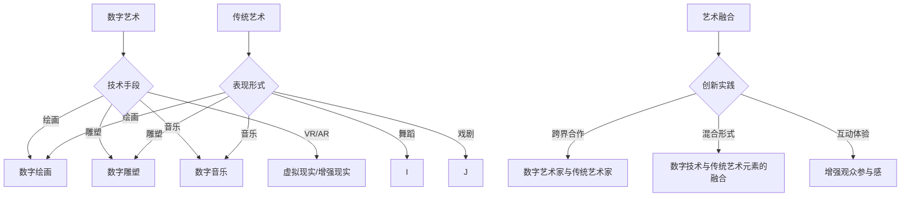

                 

关键词：数字艺术、传统艺术、艺术融合、技术驱动、创意表达、艺术创新

摘要：本文探讨了数字艺术与传统艺术在当代社会中的碰撞与融合。通过分析两者的异同、技术手段的应用、以及艺术家的创新实践，揭示了数字技术在艺术领域的深远影响。文章旨在为读者呈现一个多元化的艺术世界，启发人们对于艺术创新与发展的思考。

## 1. 背景介绍

随着科技的迅猛发展，数字技术逐渐渗透到社会生活的方方面面，改变了我们的生活方式和审美观念。艺术领域也不例外，数字技术的应用为艺术家提供了前所未有的创作工具和表达方式。传统艺术，如绘画、雕塑、音乐等，在与数字技术的碰撞中，找到了新的发展方向和创作灵感。

数字艺术与传统艺术在表现形式、创作方法、受众群体等方面存在显著差异。然而，两者的交融不仅拓宽了艺术的表现范畴，也为艺术创新提供了无限可能。本文将深入探讨数字艺术与传统艺术的碰撞，分析其背后的技术原理和艺术实践，展望未来的发展趋势。

## 2. 核心概念与联系

### 数字艺术的定义与特点

数字艺术是一种以数字技术为基础，运用计算机软件和硬件创作和展示的艺术形式。它包括数字绘画、数字雕塑、数字音乐、虚拟现实（VR）、增强现实（AR）等多种类型。数字艺术具有以下几个特点：

1. **多样性**：数字艺术可以融合多种表现形式，如图像、声音、视频等，为艺术家提供了丰富的创作手段。
2. **交互性**：数字艺术作品可以与观众互动，为观众提供沉浸式的体验。
3. **动态性**：数字艺术作品可以通过编程实现动态变化，带来新的视觉和听觉体验。
4. **易修改性**：数字艺术作品在创作过程中可以随时修改和调整，提高了创作的灵活性和效率。

### 传统艺术的定义与特点

传统艺术是指历史上形成并在一定时期内保持相对稳定形式的艺术。它包括绘画、雕塑、音乐、舞蹈、戏剧等多种类型。传统艺术具有以下几个特点：

1. **手工性**：传统艺术强调手工技艺，体现了艺术家个人的独特风格和创造力。
2. **独特性**：每一件传统艺术作品都是独一无二的，具有强烈的个性化和情感表达。
3. **历史性**：传统艺术承载了丰富的历史文化内涵，反映了特定时期的社会风貌和审美趣味。
4. **静态性**：传统艺术作品通常以静态形式存在，为观众提供了观赏和思考的空间。

### 数字艺术与传统艺术的联系

数字艺术与传统艺术在表现形式、创作方法、受众群体等方面存在差异，但它们之间并非完全割裂，而是相互借鉴、融合。数字艺术利用数字技术为传统艺术注入新的生命力，而传统艺术则为数字艺术提供了深厚的文化底蕴。

1. **创作工具**：传统艺术家开始使用数字工具，如数字画笔、虚拟雕塑软件等，提高了创作效率和质量。
2. **展示形式**：数字艺术作品可以通过互联网和数字设备进行广泛传播和展示，打破了传统艺术的时空限制。
3. **互动体验**：数字艺术作品与观众之间的互动，为传统艺术提供了新的体验方式，丰富了艺术的表现手段。
4. **跨界合作**：数字艺术家与传统艺术家的跨界合作，推动了艺术创新和多元化发展。

### Mermaid 流程图



## 3. 核心算法原理 & 具体操作步骤

### 3.1 算法原理概述

数字艺术的创作离不开算法的支持。算法在数字艺术中扮演着核心角色，从图像处理到音视频合成，再到虚拟现实和增强现实，算法的应用无处不在。以下将介绍几种常见的数字艺术算法原理：

1. **图像处理算法**：如滤波、变换、增强等，用于调整图像的亮度、对比度、色彩等。
2. **音频处理算法**：如采样、合成、混音等，用于创建和调整音乐效果。
3. **计算机图形学算法**：如渲染、建模、动画等，用于生成数字图像和三维模型。
4. **机器学习算法**：如生成对抗网络（GAN）、卷积神经网络（CNN）等，用于图像生成和风格迁移。

### 3.2 算法步骤详解

#### 3.2.1 图像处理算法

以图像滤波为例，其基本步骤如下：

1. **选择滤波器**：根据需要调整图像的视觉效果，选择合适的滤波器，如高斯滤波器、拉普拉斯滤波器等。
2. **卷积操作**：将滤波器与图像进行卷积操作，生成滤波后的图像。
3. **边界处理**：处理图像边界，避免边缘模糊或失真。

#### 3.2.2 音频处理算法

以音频混音为例，其基本步骤如下：

1. **音频采样**：将声音信号转换为数字信号，采样率通常为44.1kHz。
2. **音频合成**：将多个音频信号混合在一起，生成混音效果。
3. **动态处理**：对音频信号进行压缩、扩展等动态处理，增强音乐效果。

#### 3.2.3 计算机图形学算法

以三维渲染为例，其基本步骤如下：

1. **建模**：创建三维模型，通过顶点、面片等构成几何体。
2. **纹理映射**：将纹理图像映射到三维模型上，增加视觉细节。
3. **渲染**：使用渲染引擎渲染三维模型，生成最终图像。

#### 3.2.4 机器学习算法

以生成对抗网络（GAN）为例，其基本步骤如下：

1. **生成器与判别器的训练**：通过大量数据训练生成器和判别器，使生成器能够生成逼真的图像，判别器能够准确判断图像的真实性。
2. **生成图像**：使用训练好的生成器生成图像。
3. **优化与调整**：根据生成图像的质量和风格，不断优化生成器和判别器。

### 3.3 算法优缺点

不同算法在数字艺术中的应用具有各自的优缺点：

1. **图像处理算法**：优点在于操作简单，效果直观，缺点在于对图像质量的要求较高，难以处理复杂场景。
2. **音频处理算法**：优点在于可以灵活调整音乐效果，缺点在于音频信号的处理复杂度高。
3. **计算机图形学算法**：优点在于能够生成高质量的三维图像，缺点在于计算量大，渲染时间长。
4. **机器学习算法**：优点在于能够自动学习图像和音频特征，生成逼真的效果，缺点在于训练过程复杂，对数据需求高。

### 3.4 算法应用领域

算法在数字艺术中的应用广泛，涵盖了绘画、雕塑、音乐、动画、虚拟现实等多个领域。例如：

1. **数字绘画**：利用图像处理算法和计算机图形学算法，实现复杂的绘画效果。
2. **数字音乐**：利用音频处理算法和计算机图形学算法，创作出丰富的音乐作品。
3. **虚拟现实**：利用计算机图形学算法和机器学习算法，实现沉浸式的虚拟体验。
4. **动画制作**：利用计算机图形学算法和动画制作软件，制作出精美的动画作品。

## 4. 数学模型和公式 & 详细讲解 & 举例说明

### 4.1 数学模型构建

在数字艺术中，数学模型的应用至关重要。以下介绍几种常见的数学模型：

1. **变换矩阵**：用于图像和三维模型的变换，如平移、旋转、缩放等。
2. **贝塞尔曲线**：用于数字绘画和雕塑，实现平滑的曲线和曲面。
3. **傅里叶变换**：用于音频处理，分析音频信号的频率成分。
4. **马尔可夫链**：用于虚拟现实和增强现实，模拟随机事件和用户行为。

### 4.2 公式推导过程

以变换矩阵为例，介绍其推导过程：

$$
\begin{bmatrix}
x' \\
y' \\
1
\end{bmatrix}
=
\begin{bmatrix}
a & b \\
c & d \\
0 & 0
\end{bmatrix}
\begin{bmatrix}
x \\
y \\
1
\end{bmatrix}
$$

其中，\(a, b, c, d\) 分别为变换矩阵的元素，表示平移、旋转和缩放。

### 4.3 案例分析与讲解

以贝塞尔曲线为例，介绍其在数字绘画中的应用：

1. **定义**：贝塞尔曲线是由控制点和起始点、终止点确定的曲线。其参数方程为：

$$
\begin{aligned}
x(t) &= (1 - t)^3 x_0 + 3t(1 - t)^2 x_1 + 3t^2(1 - t) x_2 + t^3 x_3 \\
y(t) &= (1 - t)^3 y_0 + 3t(1 - t)^2 y_1 + 3t^2(1 - t) y_2 + t^3 y_3
\end{aligned}
$$

其中，\(x_0, y_0, x_1, y_1, x_2, y_2, x_3, y_3\) 分别为控制点的坐标。

2. **应用**：在数字绘画中，贝塞尔曲线用于绘制平滑的曲线和曲面，如人物轮廓、风景线条等。

### 案例分析

以绘制一条平滑的曲线为例，给定以下控制点：

- \(P_0(10, 10)\)
- \(P_1(30, 20)\)
- \(P_2(50, 10)\)
- \(P_3(70, 10)\)

使用贝塞尔曲线方程计算曲线上的点：

1. **计算参数**：设定参数 \(t\) 的范围 \(0 \leq t \leq 1\)。
2. **计算点坐标**：代入参数 \(t\)，计算曲线上的点。

例如，当 \(t = 0.5\) 时：

$$
\begin{aligned}
x &= (1 - 0.5)^3 \cdot 10 + 3 \cdot 0.5 (1 - 0.5)^2 \cdot 30 + 3 \cdot 0.5^2 (1 - 0.5) \cdot 50 + 0.5^3 \cdot 70 \\
y &= (1 - 0.5)^3 \cdot 10 + 3 \cdot 0.5 (1 - 0.5)^2 \cdot 20 + 3 \cdot 0.5^2 (1 - 0.5) \cdot 10 + 0.5^3 \cdot 10
\end{aligned}
$$

计算得到点 \((x, y)\) 的坐标。

3. **绘制曲线**：将计算得到的点连接起来，绘制出贝塞尔曲线。

通过这种方式，艺术家可以使用贝塞尔曲线创建出精美的绘画作品。

## 5. 项目实践：代码实例和详细解释说明

### 5.1 开发环境搭建

为了实现数字艺术创作，我们需要搭建一个开发环境。以下是一个简单的开发环境搭建步骤：

1. **安装操作系统**：选择一个适合的操作系统，如Windows、macOS或Linux。
2. **安装编程软件**：安装编程软件，如Visual Studio Code、PyCharm等。
3. **安装依赖库**：根据项目需求，安装相应的依赖库，如Pillow、PyOpenGL、TensorFlow等。
4. **配置开发环境**：配置环境变量，确保依赖库能够正常运行。

### 5.2 源代码详细实现

以下是一个简单的数字绘画示例代码，使用Python语言和Pillow库实现：

```python
from PIL import Image, ImageDraw

# 创建一个空的图像，大小为100x100像素
image = Image.new('RGB', (100, 100), 'white')

# 获取画布
draw = ImageDraw.Draw(image)

# 定义控制点
control_points = [
    (10, 10),
    (30, 20),
    (50, 10),
    (70, 10)
]

# 计算贝塞尔曲线上的点
def calculate_points(control_points, t):
    x0, y0 = control_points[0]
    x1, y1 = control_points[1]
    x2, y2 = control_points[2]
    x3, y3 = control_points[3]
    
    x = (1 - t)**3 * x0 + 3 * t * (1 - t)**2 * x1 + 3 * t**2 * (1 - t) * x2 + t**3 * x3
    y = (1 - t)**3 * y0 + 3 * t * (1 - t)**2 * y1 + 3 * t**2 * (1 - t) * y2 + t**3 * y3
    return x, y

# 绘制贝塞尔曲线
for t in range(0, 1, 0.01):
    x, y = calculate_points(control_points, t)
    draw.point((int(x), int(y)), fill='black')

# 显示图像
image.show()
```

### 5.3 代码解读与分析

1. **图像创建**：使用Pillow库创建一个空白的RGB图像，大小为100x100像素，背景色为白色。
2. **画布获取**：获取图像的画布对象，用于绘制图形。
3. **控制点定义**：定义贝塞尔曲线的控制点，包括起始点、控制点1、控制点2和终止点。
4. **计算点坐标**：计算贝塞尔曲线上每个参数 \(t\) 对应的点坐标，使用闭包函数 `calculate_points`。
5. **绘制曲线**：遍历参数 \(t\) 的范围，计算并绘制贝塞尔曲线上的点，使用 `draw.point` 方法。
6. **显示图像**：显示绘制完成的贝塞尔曲线图像。

### 5.4 运行结果展示

运行上述代码，将显示一个绘有贝塞尔曲线的图像，曲线平滑且具有艺术感。通过调整控制点和参数 \(t\)，可以创建出各种形状和风格的数字绘画作品。

## 6. 实际应用场景

数字艺术与传统艺术的融合在多个领域取得了显著的应用成果：

1. **数字绘画**：数字绘画软件如Adobe Photoshop、Corel Painter等，为艺术家提供了丰富的创作工具和表现手段，实现传统绘画难以达到的效果。
2. **数字音乐**：数字音频工作站（DAW）如Ableton Live、Logic Pro等，使音乐创作更加便捷，音乐作品可以融合多种元素和风格。
3. **虚拟现实**：虚拟现实技术为观众提供了沉浸式的艺术体验，艺术家可以通过VR创作出独特的艺术作品，如虚拟画廊和艺术装置。
4. **增强现实**：增强现实技术将数字艺术与现实世界相结合，创造出新颖的艺术表现形式，如街头艺术、互动展览等。

数字艺术在艺术教育、艺术治疗、建筑设计、城市规划等领域也有广泛应用，为传统艺术注入了新的活力。

### 6.4 未来应用展望

随着技术的不断进步，数字艺术与传统艺术的融合将迎来更多的发展机遇：

1. **人工智能**：人工智能技术将在数字艺术创作中发挥重要作用，如生成对抗网络（GAN）可用于图像和音乐创作，深度学习算法可优化艺术作品的生成过程。
2. **虚拟现实与增强现实**：随着VR和AR技术的普及，艺术体验将更加沉浸和互动，为观众带来全新的艺术感受。
3. **区块链**：区块链技术将为数字艺术作品的版权保护和交易提供新的解决方案，促进艺术品的数字化和全球化。
4. **跨领域合作**：数字艺术与传统艺术的跨领域合作将进一步深化，艺术家、设计师、工程师等不同领域的专业人士将共同推动艺术创新。

## 7. 工具和资源推荐

### 7.1 学习资源推荐

1. **在线课程**：Udacity、Coursera、edX等在线教育平台提供了丰富的数字艺术和计算机图形学课程。
2. **专业书籍**：《计算机图形学原理及实践》、《数字艺术：技术与应用》等书籍详细介绍了数字艺术的理论和实践。
3. **开源社区**：GitHub、Stack Overflow等开源社区提供了大量的数字艺术项目和技术讨论。

### 7.2 开发工具推荐

1. **编程软件**：Visual Studio Code、PyCharm、Eclipse等编程软件，支持多种编程语言和开发环境。
2. **数字绘画软件**：Adobe Photoshop、Corel Painter、GIMP等数字绘画软件，具有强大的图像处理和创作功能。
3. **音频处理软件**：Ableton Live、Logic Pro、FL Studio等音频处理软件，提供丰富的音乐创作工具。

### 7.3 相关论文推荐

1. **《数字艺术的演变：从传统到现代》**：探讨了数字艺术的发展历程和未来趋势。
2. **《虚拟现实技术在艺术中的应用》**：分析了虚拟现实技术在艺术创作和展示中的应用。
3. **《数字技术与艺术创新的融合》**：研究了数字技术对艺术创新的影响和作用。

## 8. 总结：未来发展趋势与挑战

### 8.1 研究成果总结

本文分析了数字艺术与传统艺术的碰撞与融合，探讨了数字技术在艺术领域的应用和发展。通过介绍核心算法、数学模型、项目实践，展示了数字艺术在创作、展示和互动方面的优势。数字艺术为艺术家提供了丰富的创作工具和表达方式，推动了艺术创新的进程。

### 8.2 未来发展趋势

1. **人工智能与艺术的融合**：人工智能技术将在数字艺术创作中发挥更大作用，生成对抗网络（GAN）、深度学习算法等将被广泛应用。
2. **虚拟现实与增强现实**：VR和AR技术将为观众带来全新的艺术体验，艺术作品的互动性和沉浸感将显著提升。
3. **区块链与数字艺术**：区块链技术将为数字艺术作品的版权保护和交易提供新的解决方案，促进艺术品的数字化和全球化。

### 8.3 面临的挑战

1. **技术瓶颈**：数字艺术的发展受到现有技术的限制，如计算能力、存储容量等。
2. **版权保护**：数字艺术作品的版权保护问题尚未得到有效解决，需要建立完善的法律法规和技术手段。
3. **艺术生态**：数字艺术的生态系统尚不完善，需要培养更多的数字艺术人才和建立良好的产业环境。

### 8.4 研究展望

未来，数字艺术与传统艺术的融合将带来更多的创新和突破。研究人员和艺术家应积极合作，探索新的艺术形式和表达方式，推动数字艺术的发展。同时，加强数字艺术教育和产业合作，培养更多具备数字艺术素养的专业人才，为数字艺术事业的繁荣做出贡献。

## 9. 附录：常见问题与解答

### 9.1 什么是数字艺术？

数字艺术是一种以数字技术为基础，运用计算机软件和硬件创作和展示的艺术形式，包括数字绘画、数字雕塑、数字音乐、虚拟现实、增强现实等多种类型。

### 9.2 数字艺术与传统艺术有哪些区别？

数字艺术与传统艺术在表现形式、创作方法、受众群体等方面存在差异。数字艺术具有多样性、交互性、动态性等特点，而传统艺术则强调手工性、独特性、历史性等。

### 9.3 数字艺术有哪些应用领域？

数字艺术广泛应用于绘画、雕塑、音乐、动画、虚拟现实、增强现实等多个领域，如数字绘画、数字音乐创作、虚拟现实艺术装置、增强现实互动艺术等。

### 9.4 数字艺术对艺术创新有哪些影响？

数字艺术为艺术家提供了丰富的创作工具和表达方式，拓宽了艺术的表现范畴，推动了艺术创新和多元化发展。同时，数字技术也为艺术创作带来了新的挑战和机遇。

### 9.5 如何学习数字艺术？

学习数字艺术可以从以下几个方面入手：

1. **掌握基础编程技能**：学习Python、C++等编程语言，了解基本的算法和数据结构。
2. **学习数字艺术工具**：掌握数字绘画软件（如Adobe Photoshop、Corel Painter）和音频处理软件（如Ableton Live、Logic Pro）的使用。
3. **研究艺术理论**：了解传统艺术理论和数字艺术理论，为创作提供理论基础。
4. **实践创作**：通过实践项目，不断提高创作技能和艺术素养。

### 9.6 数字艺术的发展前景如何？

随着技术的不断进步，数字艺术的发展前景广阔。人工智能、虚拟现实、增强现实等技术的应用将为数字艺术带来更多的创新和可能性。同时，数字艺术也将与区块链等新兴技术相结合，推动艺术产业的变革和发展。作者：禅与计算机程序设计艺术 / Zen and the Art of Computer Programming
----------------------------------------------------------------

以上便是本文的完整内容，希望能为读者带来对数字艺术与传统艺术碰撞的深入理解和思考。本文结合了技术原理、实践案例和未来发展，旨在为读者呈现一个多元化的数字艺术世界。作者：禅与计算机程序设计艺术 / Zen and the Art of Computer Programming

