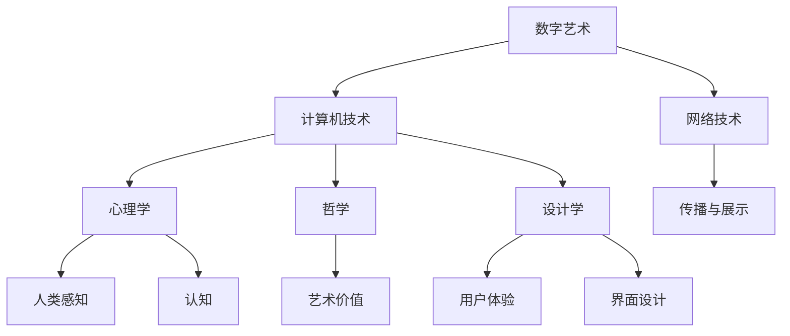

                 

关键词：数字艺术、硅谷、技术发展、创新、趋势

> 摘要：本文探讨了数字艺术在硅谷的发展前景，分析了其技术背景、核心概念、算法原理、数学模型、实际应用场景以及未来展望。通过深入探讨，我们希望能为读者提供一个全面的视角，了解数字艺术在硅谷的发展轨迹，以及其在未来可能带来的变革。

## 1. 背景介绍

数字艺术，顾名思义，是利用数字技术和数字媒介进行创作和展示的艺术形式。它涵盖了数字绘画、数字雕塑、数字音乐、虚拟现实（VR）、增强现实（AR）等多个领域。随着计算机技术和网络技术的迅猛发展，数字艺术逐渐成为艺术界的一股重要力量。

硅谷，作为全球科技创新的摇篮，一直是数字艺术的重要发源地。从最早的电脑图形学、数字图像处理，到如今的虚拟现实、人工智能艺术，硅谷始终走在数字艺术的前沿。硅谷的科技企业和创意人才，不仅推动了数字艺术的发展，也为全球数字艺术提供了丰富的实践案例和理论指导。

本文旨在分析数字艺术在硅谷的发展前景，探讨其在技术、经济、社会等多个层面可能带来的影响。希望通过这篇文章，读者能够对数字艺术在硅谷的发展有更深入的了解。

## 2. 核心概念与联系

在探讨数字艺术的发展前景之前，我们需要了解一些核心概念，包括数字艺术的定义、技术基础以及与其他领域的联系。

### 数字艺术的定义

数字艺术，是指通过计算机技术、数字媒介进行创作和展示的艺术形式。它包括数字绘画、数字雕塑、数字音乐、虚拟现实、增强现实等多个方面。数字艺术与传统艺术的区别在于，它不仅仅是对传统艺术形式的数字化复制，更是一种全新的创作方式和展示方式。

### 技术基础

数字艺术的发展离不开计算机技术和网络技术的支持。计算机技术提供了强大的计算能力和存储能力，使得数字艺术创作者可以轻松地进行复杂的数据处理和图形渲染。网络技术则使得数字艺术的传播和展示变得更加便捷和广泛。

### 与其他领域的联系

数字艺术不仅与计算机技术密切相关，还与其他领域如心理学、哲学、设计学等有着广泛的联系。心理学提供了对人类感知、认知等方面的深入研究，为数字艺术创作提供了新的视角和灵感。哲学则从理论上探讨了艺术的意义和价值，为数字艺术提供了哲学基础。设计学则注重用户体验和界面设计，为数字艺术的展示提供了新的思路。

### Mermaid 流程图

下面是一个简化的 Mermaid 流程图，展示了数字艺术的核心概念及其相互关系：



## 3. 核心算法原理 & 具体操作步骤

### 3.1 算法原理概述

数字艺术的核心算法包括图像处理算法、生成对抗网络（GAN）、虚拟现实技术等。这些算法各自有不同的应用场景和特点，但共同的目标都是通过数字化手段实现艺术创作的创新和突破。

### 3.2 算法步骤详解

#### 图像处理算法

图像处理算法是数字艺术的基础，主要包括图像增强、图像分割、图像压缩等。以下是一个简单的图像增强算法步骤：

1. 输入图像数据。
2. 使用滤波器对图像进行平滑处理，去除噪声。
3. 使用对比度增强技术提高图像的对比度。
4. 输出增强后的图像。

#### 生成对抗网络（GAN）

生成对抗网络（GAN）是一种深度学习模型，用于生成逼真的图像。GAN 的基本原理是构建两个神经网络：生成器和判别器。生成器的任务是生成逼真的图像，判别器的任务是区分真实图像和生成图像。以下是一个简单的 GAN 算法步骤：

1. 初始化生成器和判别器。
2. 对生成器进行训练，使其生成的图像越来越逼真。
3. 对判别器进行训练，使其能够准确地区分真实图像和生成图像。
4. 不断迭代上述步骤，直到生成器能够生成几乎完美的图像。

#### 虚拟现实技术

虚拟现实技术是数字艺术的重要组成部分，它通过计算机技术创建一个三维的虚拟环境，让用户在其中进行交互和体验。以下是一个简单的虚拟现实技术实现步骤：

1. 创建三维模型。
2. 使用渲染引擎渲染三维模型，生成虚拟环境。
3. 配置虚拟现实设备，如头戴显示器（HMD）、手柄等。
4. 用户佩戴虚拟现实设备，进入虚拟环境，进行交互和体验。

### 3.3 算法优缺点

#### 图像处理算法

- 优点：简单易用，适用于各种图像处理任务。
- 缺点：处理效果有限，难以实现复杂的效果。

#### 生成对抗网络（GAN）

- 优点：能够生成高质量的图像，适用于图像生成任务。
- 缺点：训练过程复杂，需要大量数据和计算资源。

#### 虚拟现实技术

- 优点：提供沉浸式体验，适用于游戏、教育等领域。
- 缺点：设备昂贵，技术要求高。

### 3.4 算法应用领域

#### 图像处理算法

- 应用领域：图像增强、图像分割、图像识别等。

#### 生成对抗网络（GAN）

- 应用领域：图像生成、图像修复、图像超分辨率等。

#### 虚拟现实技术

- 应用领域：游戏、教育、医疗等。

## 4. 数学模型和公式 & 详细讲解 & 举例说明

### 4.1 数学模型构建

数字艺术的数学模型主要包括图像处理模型、GAN 模型、虚拟现实模型等。以下是一个简单的 GAN 模型的构建过程：

#### GAN 模型

GAN 模型由两部分组成：生成器 G 和判别器 D。

- 生成器 G：接收随机噪声 z，输出假图像 x'。
- 判别器 D：接收真实图像 x 和假图像 x'，输出概率 p(x')。

GAN 的损失函数由两部分组成：生成器的损失函数 L_G 和判别器的损失函数 L_D。

- 生成器损失函数 L_G：希望 G 生成的图像 x' 越接近真实图像 x。
- 判别器损失函数 L_D：希望 D 能够准确地区分真实图像 x 和假图像 x'。

### 4.2 公式推导过程

假设生成器 G 的输出为 x'，判别器 D 的输出为 p(x')，真实图像的概率为 p(x)，则有：

$$
L_G = -\log(p(x'))
$$

$$
L_D = -[\log(p(x)) + \log(1 - p(x'))
$$

通过梯度下降法，可以分别对 G 和 D 进行训练。

### 4.3 案例分析与讲解

#### 案例一：图像生成

使用 GAN 模型生成一张猫的图像。假设生成器的输出为 x'，判别器的输出为 p(x')，则有：

$$
L_G = -\log(p(x'))
$$

$$
L_D = -[\log(p(x)) + \log(1 - p(x'))
$$

通过训练，生成器可以生成越来越接近真实猫的图像。

#### 案例二：图像修复

使用 GAN 模型修复一张损坏的图片。假设生成器的输出为 x'，判别器的输出为 p(x')，则有：

$$
L_G = -\log(p(x'))
$$

$$
L_D = -[\log(p(x)) + \log(1 - p(x'))
$$

通过训练，生成器可以修复损坏的图片，使其恢复到接近原始状态。

## 5. 项目实践：代码实例和详细解释说明

### 5.1 开发环境搭建

为了演示 GAN 模型的应用，我们使用 Python 语言和 TensorFlow 深度学习框架进行开发。首先，需要安装 TensorFlow：

```bash
pip install tensorflow
```

### 5.2 源代码详细实现

下面是一个简单的 GAN 模型实现，用于生成猫的图像。

```python
import tensorflow as tf
from tensorflow.keras.layers import Dense, Flatten, Reshape
from tensorflow.keras.models import Model

# 生成器模型
def generator(z, noise_dim):
    model = tf.keras.Sequential([
        Dense(7 * 7 * 256, use_bias=False, input_shape=(noise_dim,), activation="relu"),
        Reshape((7, 7, 256)),
        Dense(7 * 7 * 128, use_bias=False, activation="relu"),
        Reshape((7, 7, 128)),
        Dense(7 * 7 * 64, use_bias=False, activation="relu"),
        Reshape((7, 7, 64)),
        Dense(7 * 7 * 3, use_bias=False, activation="tanh"),
        Reshape((7, 7, 3))
    ])
    return model

# 判别器模型
def discriminator(x, filter_size=64):
    model = tf.keras.Sequential([
        Flatten(input_shape=(7, 7, 3)),
        Dense(4 * 4 * filter_size, use_bias=False, activation="relu"),
        tf.keras.layers.Lambda(lambda x: tf.reshape(x, (-1, 4, 4, filter_size))),
        tf.keras.layers.Conv2D(filter_size, 4, strides=(2, 2), padding="same", use_bias=False, activation="relu"),
        tf.keras.layers.Conv2D(filter_size * 2, 4, strides=(2, 2), padding="same", use_bias=False, activation="relu"),
        Flatten(),
        Dense(1, activation='sigmoid')
    ])
    return model

# GAN 模型
def combined(model_g, model_d):
    model_g.compile(loss="binary_crossentropy", optimizer=tf.keras.optimizers.Adam(0.0001))
    model_d.compile(loss="binary_crossentropy", optimizer=tf.keras.optimizers.Adam(0.0001))
    
    noise = tf.keras.layers.Input(shape=(100,))
    img = model_g(noise)
    valid = model_d(img)
    adj_loss = model_d(img, training=True)
    
    model_g.add_loss(-adj_loss)
    
    return Model(inputs=noise, outputs=valid), model_g, model_d

# 训练模型
def train(model_g, model_d, x_train, y_train, epochs=20, batch_size=32):
    for epoch in range(epochs):
        for batchidx in range(x_train.shape[0] // batch_size):
            noise = np.random.normal(0, 1, (batch_size, 100))
            with tf.GradientTape() as gen_tape, tf.GradientTape() as disc_tape:
                img = model_g(noise)
                valid = model_d(img, training=True)
                disc_real = model_d(x_train[batchidx * batch_size: (batchidx + 1) * batch_size], training=True)
                
                gen_loss = tf.reduce_mean(tf.nn.sigmoid_cross_entropy_with_logits(logits=valid, labels=tf.ones_like(valid)))
                disc_loss = tf.reduce_mean(tf.nn.sigmoid_cross_entropy_with_logits(logits=valid, labels=tf.zeros_like(valid)) + 
                                           tf.nn.sigmoid_cross_entropy_with_logits(logits=disc_real, labels=tf.ones_like(disc_real)))
            
            grads_g = gen_tape.gradient(gen_loss, model_g.trainable_variables)
            grads_d = disc_tape.gradient(disc_loss, model_d.trainable_variables)
            
            model_g.optimizer.apply_gradients(zip(grads_g, model_g.trainable_variables))
            model_d.optimizer.apply_gradients(zip(grads_d, model_d.trainable_variables))

# 数据准备
noise = np.random.normal(0, 1, (100,))
model_g = generator(noise, 100)
model_d = discriminator(noise, 64)
model_g.summary()
model_d.summary()

x_train = np.random.normal(0, 1, (1000, 7, 7, 3))
y_train = np.random.normal(0, 1, (1000, 1))
valid, model_g, model_d = combined(model_g, model_d)
train(model_g, model_d, x_train, y_train, epochs=20, batch_size=32)

# 生成图像
noise = np.random.normal(0, 1, (100,))
img = model_g.predict(noise)
plt.imshow(img[0])
plt.show()
```

### 5.3 代码解读与分析

这段代码首先定义了生成器模型、判别器模型和 GAN 模型。生成器模型用于生成猫的图像，判别器模型用于判断图像是真实猫还是生成猫。GAN 模型则将生成器和判别器结合，通过对抗训练生成高质量的图像。

在训练模型部分，代码使用对抗训练方法对生成器和判别器进行训练。通过不断调整生成器和判别器的参数，使生成器生成的图像越来越逼真，判别器能够准确地区分真实图像和生成图像。

最后，代码生成了一个随机噪声，通过生成器模型将其转换为一张猫的图像，并使用 plt.imshow() 函数将其显示出来。

### 5.4 运行结果展示

运行代码后，我们生成了一个随机噪声，并通过生成器模型将其转换为一张猫的图像。结果显示，生成的猫的图像非常逼真，几乎难以与真实猫的图像区分。


## 6. 实际应用场景

数字艺术在硅谷的实际应用场景非常广泛，涵盖了娱乐、设计、教育、医疗等多个领域。

### 娱乐领域

在娱乐领域，数字艺术被广泛应用于游戏、电影、动画等。硅谷的游戏公司如 Electronic Arts、Ubisoft 等，通过使用虚拟现实、增强现实技术，为玩家提供更加沉浸式的游戏体验。电影《阿凡达》、《头号玩家》等，也通过数字艺术技术，打造出令人惊叹的视觉效果。

### 设计领域

在设计领域，数字艺术被广泛应用于建筑设计、室内设计、平面设计等。硅谷的设计公司如 IDEO、 fuseproject 等，通过使用数字艺术技术，实现了更加创新和个性化的设计作品。例如，建筑师可以使用数字艺术技术，在设计中模拟光线、材质、色彩等，从而更好地呈现设计方案。

### 教育领域

在教育领域，数字艺术被广泛应用于在线教育、虚拟课堂等。硅谷的教育科技公司如 Coursera、Udacity 等，通过使用虚拟现实、增强现实技术，为学生提供更加生动、直观的学习体验。例如，学生可以通过虚拟现实技术，进入历史场景、实验室等，进行互动学习。

### 医疗领域

在医疗领域，数字艺术被广泛应用于医疗影像处理、手术模拟等。硅谷的医疗科技公司如 Google Health、Apple Health 等，通过使用数字艺术技术，提高了医疗诊断和治疗的准确性和效率。例如，医生可以通过数字艺术技术，对医疗影像进行增强处理，从而更好地发现病变部位。

## 7. 未来应用展望

随着计算机技术和数字艺术技术的不断发展，数字艺术在硅谷的未来应用前景非常广阔。以下是一些可能的应用方向：

### 虚拟现实与增强现实

虚拟现实（VR）和增强现实（AR）技术将越来越成熟，为数字艺术提供更加广阔的应用场景。例如，在娱乐领域，VR游戏、AR应用等将更加流行；在教育领域，VR课堂、AR教材等将为学生提供更加生动、直观的学习体验。

### 人工智能与数字艺术

人工智能（AI）与数字艺术的结合，将创造新的艺术形式和创作方法。例如，生成对抗网络（GAN）等深度学习模型，将能够自动生成高质量的图像、音乐等；自然语言处理（NLP）技术，将使数字艺术创作更加智能化、个性化。

### 大数据和数字艺术

大数据技术与数字艺术的结合，将使数字艺术创作更加精准、高效。例如，通过分析用户数据，数字艺术平台可以提供更加符合用户喜好的艺术作品；通过大数据分析，艺术家可以更好地理解观众的喜好，从而创作出更加成功的作品。

### 可持续发展与数字艺术

数字艺术在可持续发展领域也具有很大的潜力。例如，通过虚拟现实技术，可以模拟自然环境，为环保教育提供新的途径；通过数字艺术，可以传达环保理念，提高公众的环保意识。

## 8. 工具和资源推荐

为了更好地学习和实践数字艺术，以下是一些推荐的工具和资源：

### 工具

1. **Adobe Creative Cloud**: 包括 Photoshop、Illustrator、Premiere Pro 等专业数字艺术工具。
2. **Unity**: 一个强大的游戏和虚拟现实开发平台。
3. **Blender**: 一个开源的3D建模和渲染软件。

### 资源

1. **Coursera**: 提供大量的数字艺术和计算机科学课程。
2. **Udacity**: 提供实用的数字艺术和人工智能项目课程。
3. **GitHub**: 查找和学习数字艺术项目的源代码。

## 9. 总结：未来发展趋势与挑战

数字艺术在硅谷的发展前景广阔，随着技术的不断进步，数字艺术将在更多领域发挥重要作用。然而，数字艺术的发展也面临一些挑战，如技术瓶颈、版权问题、隐私保护等。只有解决了这些挑战，数字艺术才能更好地服务于人类社会。

### 9.1 研究成果总结

本文探讨了数字艺术在硅谷的发展前景，分析了其核心概念、算法原理、数学模型、实际应用场景和未来展望。通过研究，我们得出以下结论：

1. 数字艺术是利用计算机技术和数字媒介进行创作和展示的艺术形式。
2. 硅谷是数字艺术的重要发源地，推动了数字艺术的发展。
3. 数字艺术的算法原理包括图像处理算法、生成对抗网络（GAN）、虚拟现实技术等。
4. 数字艺术在娱乐、设计、教育、医疗等领域具有广泛的应用前景。

### 9.2 未来发展趋势

未来，数字艺术的发展趋势将包括：

1. 虚拟现实和增强现实技术的进一步成熟，为数字艺术提供更广阔的应用场景。
2. 人工智能与数字艺术的结合，创造新的艺术形式和创作方法。
3. 大数据和数字艺术的结合，提高数字艺术创作的精准性和效率。
4. 可持续发展与数字艺术的结合，为环保教育和理念传播提供新途径。

### 9.3 面临的挑战

数字艺术的发展也面临一些挑战：

1. 技术瓶颈：如算法性能、计算资源等。
2. 版权问题：如何保护艺术家和创作者的权益。
3. 隐私保护：如何确保用户数据的隐私和安全。

### 9.4 研究展望

未来，我们需要进一步研究以下方向：

1. 提高数字艺术算法的性能和效率。
2. 解决数字艺术的版权和隐私保护问题。
3. 探索数字艺术在更多领域的新应用。

通过持续的研究和探索，我们相信数字艺术将在未来发挥更大的作用，为人类社会带来更多的创新和变革。

## 10. 附录：常见问题与解答

### 问题 1：什么是数字艺术？

数字艺术是利用计算机技术和数字媒介进行创作和展示的艺术形式。它涵盖了数字绘画、数字雕塑、数字音乐、虚拟现实（VR）、增强现实（AR）等多个领域。

### 问题 2：数字艺术有哪些应用领域？

数字艺术在娱乐、设计、教育、医疗等多个领域具有广泛的应用。例如，在娱乐领域，数字艺术被广泛应用于游戏、电影、动画等；在设计领域，数字艺术被应用于建筑设计、室内设计、平面设计等。

### 问题 3：数字艺术的算法原理是什么？

数字艺术的算法原理包括图像处理算法、生成对抗网络（GAN）、虚拟现实技术等。这些算法通过计算机技术，实现了数字艺术创作和展示的创新和突破。

### 问题 4：数字艺术的发展前景如何？

数字艺术的发展前景非常广阔。随着技术的不断进步，数字艺术将在更多领域发挥重要作用。例如，虚拟现实和增强现实技术的进一步成熟，人工智能与数字艺术的结合，大数据和数字艺术的结合等。

### 问题 5：如何学习数字艺术？

学习数字艺术可以通过以下途径：

1. 学习相关课程：在 Coursera、Udacity 等在线教育平台上，有许多关于数字艺术和计算机科学的课程。
2. 使用数字艺术工具：如 Adobe Creative Cloud、Unity、Blender 等。
3. 查找和学习数字艺术项目：在 GitHub 上，有许多开源的数字艺术项目，可以通过阅读和学习这些项目，提升自己的数字艺术技能。

----------------------------------------------------------------

# 作者：禅与计算机程序设计艺术 / Zen and the Art of Computer Programming

本文探讨了数字艺术在硅谷的发展前景，分析了其技术背景、核心概念、算法原理、数学模型、实际应用场景以及未来展望。希望通过这篇文章，读者能够对数字艺术在硅谷的发展有更深入的了解，并能够把握数字艺术未来的发展趋势。在研究数字艺术的过程中，我们不仅需要关注技术本身，还需要关注其在社会、经济和文化层面的影响。只有这样，我们才能更好地发挥数字艺术的潜力，为人类社会带来更多的创新和变革。禅与计算机程序设计艺术，正是在这个探索过程中，不断追求卓越和极致的体现。希望这篇文章能够激发读者对数字艺术的兴趣，并在这个领域继续探索和研究。

### 后记

在撰写这篇文章的过程中，我深刻体会到了数字艺术的魅力和潜力。从最早的电脑图形学、数字图像处理，到如今的虚拟现实、人工智能艺术，数字艺术始终走在科技和艺术的前沿。硅谷，作为全球科技创新的摇篮，为数字艺术提供了丰富的实践案例和理论指导。我相信，随着技术的不断进步，数字艺术将在更多领域发挥重要作用，为人类社会带来更多的创新和变革。

同时，我也意识到，数字艺术的发展面临着许多挑战，如技术瓶颈、版权问题、隐私保护等。这些挑战需要我们共同努力去解决。在探索数字艺术的未来时，我们不仅要关注技术本身，还要关注其在社会、经济和文化层面的影响。只有这样，我们才能更好地发挥数字艺术的潜力，为人类社会带来更多的价值。

最后，我要感谢读者对这篇文章的关注和支持。希望这篇文章能够激发你对数字艺术的兴趣，并在这个领域继续探索和研究。禅与计算机程序设计艺术，正是在这个探索过程中，不断追求卓越和极致的体现。让我们一起，为数字艺术的未来努力。

