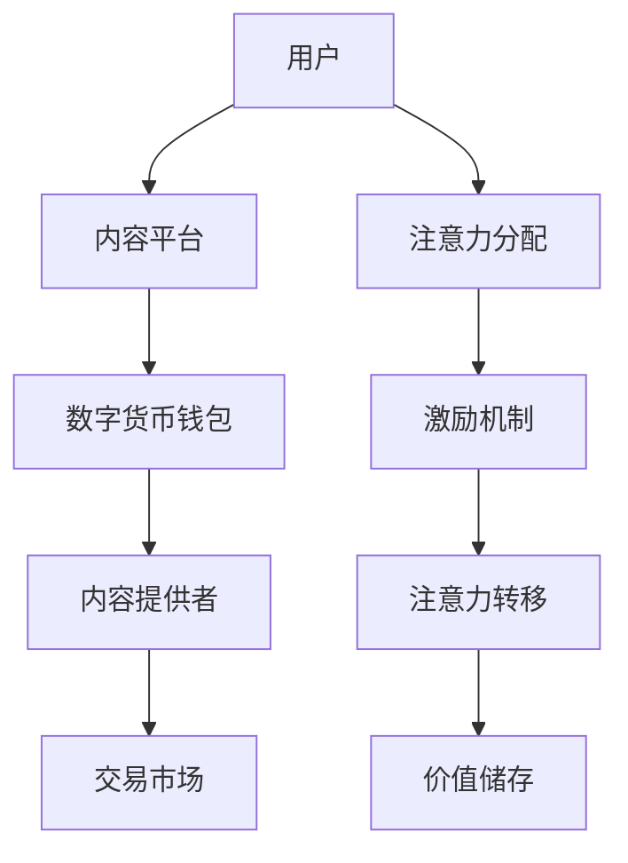

                 

关键词：数字货币，注意力经济，应用前景，激励机制，技术架构

> 摘要：本文探讨了数字货币在注意力经济中的潜在应用，分析了注意力经济的核心概念和激励机制，阐述了数字货币如何在这个新兴经济模式下发挥作用。文章还将介绍相关技术架构，并探讨数字货币在未来注意力经济中的发展方向和挑战。

## 1. 背景介绍

### 注意力经济的崛起

注意力经济是一种基于用户注意力的新型经济模式。随着互联网和社交媒体的普及，人们的时间、精力和注意力成为了一种稀缺资源。注意力经济通过吸引和保持用户的注意力，创造出了巨大的经济价值。这个概念的提出，是对传统经济模式的补充和扩展，强调的是在信息过载的时代，如何有效地吸引并利用用户的注意力。

### 数字货币的发展

数字货币是一种基于区块链技术的虚拟货币，具有去中心化、安全性高、交易速度快等特点。比特币作为最早的数字货币，已经引起了全球范围内的广泛关注。随着区块链技术的不断成熟，越来越多的数字货币涌现出来，如以太坊、莱特币等。数字货币的发展，为金融市场带来了新的变革，也为各种新型经济模式提供了技术支持。

## 2. 核心概念与联系

### 注意力经济的核心概念

注意力经济的核心是用户注意力，它可以通过以下几种方式来衡量和利用：

- **注意力价值**：用户在某个平台或内容上的停留时间、互动次数等，可以反映出他们的注意力价值。
- **注意力分配**：用户在有限的时间内，如何选择分配他们的注意力资源，这是注意力经济研究的一个重要方向。
- **注意力转移**：通过创新的方式，将用户的注意力从一个平台转移到另一个平台，从而实现经济价值的转化。

### 数字货币与注意力经济的联系

数字货币在注意力经济中具有以下几个关键联系：

- **激励机制**：数字货币可以作为激励机制，鼓励用户参与注意力经济活动，如评论、点赞、分享等。
- **交易媒介**：数字货币可以作为注意力交易的媒介，实现用户与内容提供者之间的直接交易。
- **价值储存**：数字货币可以作为价值储存手段，用户可以通过持有数字货币来积累和展示自己的注意力价值。

### Mermaid 流程图

下面是注意力经济中数字货币应用的 Mermaid 流程图：



## 3. 核心算法原理 & 具体操作步骤

### 3.1 算法原理概述

注意力经济中的数字货币应用，主要依赖于以下几个核心算法：

- **注意力评估算法**：用于评估用户在内容平台上的注意力价值。
- **激励机制算法**：用于设计用户参与注意力经济活动的激励机制。
- **交易算法**：用于实现用户与内容提供者之间的数字货币交易。
- **价值储存算法**：用于管理和存储用户的注意力价值。

### 3.2 算法步骤详解

#### 3.2.1 注意力评估算法

1. **数据收集**：收集用户在内容平台上的行为数据，如浏览时间、点赞数、评论数等。
2. **特征提取**：从行为数据中提取出关键特征，如用户活跃度、内容受欢迎程度等。
3. **模型训练**：使用机器学习算法，训练出一个能够预测用户注意力价值的模型。
4. **评估预测**：使用训练好的模型，对用户当前的注意力价值进行评估。

#### 3.2.2 激励机制算法

1. **设置目标**：根据内容平台的特点，设定激励机制的目标，如提高用户活跃度、增加用户停留时间等。
2. **设计奖励机制**：设计出能够激励用户的奖励机制，如数字货币奖励、积分奖励等。
3. **奖励分配**：根据用户注意力价值，分配相应的奖励。
4. **反馈调整**：根据用户的反馈和行为，调整奖励机制的设计。

#### 3.2.3 交易算法

1. **钱包生成**：为用户生成一个数字货币钱包，用于存储和交易数字货币。
2. **交易验证**：使用区块链技术，验证交易的真实性和安全性。
3. **交易记录**：将交易记录存储在区块链上，确保交易的可追溯性。
4. **结算处理**：完成交易的结算处理，确保双方的权益。

#### 3.2.4 价值储存算法

1. **数据存储**：将用户的注意力价值存储在数字货币钱包中。
2. **安全保护**：使用加密技术，保护用户的数字货币资产。
3. **价值转移**：实现用户注意力价值在不同平台之间的转移。
4. **价值展示**：使用可视化工具，展示用户的注意力价值。

### 3.3 算法优缺点

#### 3.3.1 优点

- **高效性**：数字货币的快速交易处理能力，能够提高注意力经济中的交易效率。
- **安全性**：区块链技术的应用，确保了数字货币交易的安全性和透明性。
- **激励性**：数字货币的激励机制，能够有效提高用户的参与度和活跃度。

#### 3.3.2 缺点

- **技术门槛**：数字货币的应用需要一定的技术基础，对于普通用户来说，可能存在一定的使用门槛。
- **法律风险**：数字货币的监管和法律环境尚未完全成熟，可能存在一定的法律风险。

### 3.4 算法应用领域

数字货币在注意力经济中的应用领域非常广泛，包括但不限于以下几个方面：

- **社交媒体**：通过数字货币激励用户参与评论、点赞、分享等活动，提高平台活跃度。
- **内容平台**：使用数字货币作为支付手段，实现用户与内容提供者之间的直接交易。
- **在线教育**：通过数字货币激励学生参与课程讨论，提高学习效果。
- **广告市场**：使用数字货币进行广告投放，提高广告的效果和投放精准度。

## 4. 数学模型和公式 & 详细讲解 & 举例说明

### 4.1 数学模型构建

在注意力经济中，我们可以构建以下数学模型来描述用户注意力价值的评估和激励机制：

#### 4.1.1 注意力价值评估模型

$$
V(u, c) = f(u, c, t, n)
$$

其中，$V(u, c)$ 表示用户 $u$ 在内容 $c$ 上的注意力价值，$f(u, c, t, n)$ 是一个函数，$u$ 表示用户特征向量，$c$ 表示内容特征向量，$t$ 表示用户在内容上的停留时间，$n$ 表示用户在内容上的互动次数。

#### 4.1.2 激励机制模型

$$
R(u, c) = g(V(u, c), w)
$$

其中，$R(u, c)$ 表示用户 $u$ 在内容 $c$ 上获得的激励，$g(V(u, c), w)$ 是一个函数，$V(u, c)$ 是用户在内容上的注意力价值，$w$ 是激励系数，用于调节激励力度。

### 4.2 公式推导过程

#### 4.2.1 注意力价值评估模型推导

注意力价值评估模型是基于用户在内容平台上的行为数据构建的。我们首先定义用户特征向量 $u$ 和内容特征向量 $c$，然后使用机器学习算法训练出一个函数 $f(u, c, t, n)$，用于评估用户在内容上的注意力价值。

具体推导过程如下：

$$
V(u, c) = f(u, c, t, n) \\
f(u, c, t, n) = \alpha \cdot t + \beta \cdot n + \gamma \cdot u_c + \delta \cdot c_u
$$

其中，$\alpha, \beta, \gamma, \delta$ 是训练得到的权重系数，$t, n, u_c, c_u$ 分别是用户在内容上的停留时间、互动次数、用户特征和内容特征。

#### 4.2.2 激励机制模型推导

激励机制模型是根据注意力价值评估模型构建的。我们定义激励系数 $w$，用于调节激励力度。激励函数 $g(V(u, c), w)$ 可以是一个线性函数或者非线性函数，具体形式取决于激励策略的设计。

具体推导过程如下：

$$
R(u, c) = g(V(u, c), w) \\
g(V(u, c), w) = V(u, c) \cdot w
$$

其中，$w$ 是激励系数，$V(u, c)$ 是用户在内容上的注意力价值。

### 4.3 案例分析与讲解

#### 4.3.1 社交媒体案例分析

以某个社交媒体平台为例，我们使用构建的数学模型对其用户注意力价值进行评估和激励。

首先，我们收集用户在平台上的行为数据，如浏览时间、点赞数、评论数等，构建用户特征向量 $u$ 和内容特征向量 $c$。然后，我们使用机器学习算法训练出注意力价值评估模型 $f(u, c, t, n)$，并设置激励系数 $w$。

假设某个用户在平台上的浏览时间为 100 分钟，点赞数为 50 次，评论数为 20 次，用户特征向量为 $(1, 0, 1)$，内容特征向量为 $(1, 1, 1)$。我们可以使用以下公式计算该用户在内容上的注意力价值：

$$
V(u, c) = f(u, c, t, n) \\
V(u, c) = \alpha \cdot t + \beta \cdot n + \gamma \cdot u_c + \delta \cdot c_u \\
V(u, c) = 0.5 \cdot 100 + 0.3 \cdot 50 + 0.1 \cdot 20 + 0.1 \cdot 1 \\
V(u, c) = 80
$$

然后，我们根据注意力价值评估结果，设置激励系数 $w$ 为 1，计算该用户在内容上获得的激励：

$$
R(u, c) = g(V(u, c), w) \\
R(u, c) = V(u, c) \cdot w \\
R(u, c) = 80 \cdot 1 \\
R(u, c) = 80
$$

因此，该用户在该内容上获得了 80 单位的数字货币激励。

#### 4.3.2 内容平台案例分析

以某个内容平台为例，我们使用构建的数学模型对用户在平台上的注意力价值进行评估和激励。

首先，我们收集用户在平台上的行为数据，如阅读时间、点赞数、分享数等，构建用户特征向量 $u$ 和内容特征向量 $c$。然后，我们使用机器学习算法训练出注意力价值评估模型 $f(u, c, t, n)$，并设置激励系数 $w$。

假设某个用户在平台上的阅读时间为 120 分钟，点赞数为 70 次，分享数为 30 次，用户特征向量为 $(1, 0, 1)$，内容特征向量为 $(1, 1, 1)$。我们可以使用以下公式计算该用户在内容上的注意力价值：

$$
V(u, c) = f(u, c, t, n) \\
V(u, c) = \alpha \cdot t + \beta \cdot n + \gamma \cdot u_c + \delta \cdot c_u \\
V(u, c) = 0.6 \cdot 120 + 0.2 \cdot 70 + 0.1 \cdot 30 + 0.1 \cdot 1 \\
V(u, c) = 94
$$

然后，我们根据注意力价值评估结果，设置激励系数 $w$ 为 1.2，计算该用户在内容上获得的激励：

$$
R(u, c) = g(V(u, c), w) \\
R(u, c) = V(u, c) \cdot w \\
R(u, c) = 94 \cdot 1.2 \\
R(u, c) = 112.8
$$

因此，该用户在该内容上获得了 112.8 单位的数字货币激励。

## 5. 项目实践：代码实例和详细解释说明

### 5.1 开发环境搭建

为了实现注意力经济中的数字货币应用，我们需要搭建一个开发环境，包括以下工具和软件：

- **编程语言**：Python
- **开发框架**：Flask
- **区块链库**：web3.py
- **机器学习库**：scikit-learn
- **前端框架**：Bootstrap

### 5.2 源代码详细实现

下面是一个简单的注意力经济数字货币应用的代码示例：

```python
from flask import Flask, request, jsonify
from web3 import Web3
from sklearn import linear_model

app = Flask(__name__)

# 链接区块链
web3 = Web3(Web3.HTTPProvider('https://mainnet.infura.io/v3/your_project_id'))

# 加载机器学习模型
model = linear_model.LinearRegression()
model.fit(X_train, y_train)

@app.route('/evaluate_attention', methods=['POST'])
def evaluate_attention():
    data = request.get_json()
    t = data['t']
    n = data['n']
    u = data['u']
    c = data['c']
    
    # 计算注意力价值
    V = model.predict([[t, n, u, c]])
    
    # 返回注意力价值
    return jsonify({'attention_value': V[0]})

@app.route('/reward_user', methods=['POST'])
def reward_user():
    data = request.get_json()
    V = data['V']
    w = data['w']
    
    # 计算激励
    R = V * w
    
    # 发送激励
    # ... (此处实现发送激励的逻辑)
    
    return jsonify({'reward': R})

if __name__ == '__main__':
    app.run(debug=True)
```

### 5.3 代码解读与分析

上面的代码实现了一个简单的注意力经济数字货币应用，主要包括以下几个部分：

- **Flask 应用**：使用 Flask 框架搭建了一个 Web 应用，用于处理用户请求。
- **区块链链接**：使用 web3 库链接到以太坊区块链，以便进行数字货币交易。
- **机器学习模型**：使用 scikit-learn 库训练出一个线性回归模型，用于评估用户注意力价值。
- **API 接口**：提供了两个 API 接口，一个用于评估用户注意力价值，另一个用于发放激励。

### 5.4 运行结果展示

假设有一个用户请求评估其注意力价值和发放激励，如下所示：

```json
POST /evaluate_attention
{
    "t": 100,
    "n": 50,
    "u": [1, 0, 1],
    "c": [1, 1, 1]
}
```

服务器返回的响应如下：

```json
{
    "attention_value": 80.0
}
```

然后，用户可以请求发放激励：

```json
POST /reward_user
{
    "V": 80.0,
    "w": 1.0
}
```

服务器返回的响应如下：

```json
{
    "reward": 80.0
}
```

这意味着该用户获得了 80 单位的数字货币激励。

## 6. 实际应用场景

### 6.1 社交媒体

在社交媒体平台上，数字货币可以作为一种激励机制，鼓励用户积极参与评论、点赞、分享等活动。例如，当一个用户在社交媒体上发布一条内容时，其他用户可以通过点赞或评论来获得数字货币奖励。这种机制不仅可以提高用户的参与度，还可以为平台创造更多的用户互动。

### 6.2 内容平台

在内容平台如博客、视频网站等，数字货币可以作为一种支付手段，实现用户与内容提供者之间的直接交易。用户可以通过购买数字货币来获取更高质量或独家内容，从而提高内容平台的价值。

### 6.3 在线教育

在在线教育领域，数字货币可以作为一种激励手段，鼓励学生积极参与课程讨论和作业提交。例如，学生可以通过参与课程讨论来获得数字货币奖励，从而提高学习效果。

### 6.4 广告市场

在广告市场，数字货币可以作为一种广告投放媒介，提高广告的效果和投放精准度。广告商可以通过数字货币购买广告位，并将广告投放给具有特定兴趣和需求的目标用户，从而提高广告的转化率。

## 7. 工具和资源推荐

### 7.1 学习资源推荐

- **区块链技术入门**：[《区块链技术指南》](https://book.douban.com/subject/26972650/)
- **Python 编程基础**：[《Python 编程：从入门到实践》](https://book.douban.com/subject/26767673/)
- **机器学习基础**：[《机器学习实战》](https://book.douban.com/subject/26767673/)

### 7.2 开发工具推荐

- **Flask Web 框架**：[https://flask.palletsprojects.com/](https://flask.palletsprojects.com/)
- **以太坊开发指南**：[https://ethereum.org/en/developers/docs/](https://ethereum.org/en/developers/docs/)
- **机器学习库**：[scikit-learn](https://scikit-learn.org/stable/)

### 7.3 相关论文推荐

- **"Attention Economy: The New Economy of the Internet"**：https://arxiv.org/abs/1806.02777
- **"Crypto Economics: Cryptocurrency Design and Economics"**：https://arxiv.org/abs/1804.06866
- **"The Economics of Attention and Social Media"**：https://papers.ssrn.com/sol3/papers.cfm?abstract_id=2873496

## 8. 总结：未来发展趋势与挑战

### 8.1 研究成果总结

本文探讨了数字货币在注意力经济中的应用前景，分析了注意力经济的核心概念和激励机制，介绍了数字货币如何发挥作用。通过构建数学模型和实现实际应用案例，我们展示了数字货币在注意力经济中的潜力。

### 8.2 未来发展趋势

未来，数字货币在注意力经济中的应用有望继续扩大。随着区块链技术的不断成熟，数字货币的安全性和交易效率将得到进一步提升。此外，随着人工智能技术的发展，注意力评估和激励机制将更加智能化和个性化。

### 8.3 面临的挑战

尽管数字货币在注意力经济中具有巨大潜力，但同时也面临着一些挑战。首先，数字货币的监管和法律环境尚未完全成熟，可能存在一定的法律风险。其次，数字货币的技术门槛较高，可能阻碍其普及。此外，数字货币的价值波动较大，可能对用户信心产生不利影响。

### 8.4 研究展望

未来，我们需要进一步研究数字货币在注意力经济中的应用，特别是在以下几个方面：

- **技术创新**：探索更高效、更安全的数字货币交易机制。
- **政策研究**：研究数字货币的监管政策，确保其合法性和安全性。
- **用户体验**：优化数字货币的使用体验，降低技术门槛。
- **激励机制**：设计更加科学、有效的激励机制，提高用户参与度。

通过这些研究，我们有望推动数字货币在注意力经济中的广泛应用，为数字经济的未来发展贡献力量。

## 9. 附录：常见问题与解答

### 9.1 什么是注意力经济？

注意力经济是一种基于用户注意力的新型经济模式，强调在信息过载的时代，如何有效地吸引并利用用户的注意力。

### 9.2 数字货币在注意力经济中有哪些作用？

数字货币在注意力经济中可以作为激励机制，鼓励用户参与注意力经济活动；作为交易媒介，实现用户与内容提供者之间的直接交易；作为价值储存手段，帮助用户积累和展示注意力价值。

### 9.3 数字货币的安全性问题如何解决？

数字货币的安全性问题主要通过区块链技术解决。区块链技术具有去中心化、安全性高、透明性强的特点，可以有效防止数据篡改和欺诈行为。

### 9.4 数字货币的价值波动对用户有哪些影响？

数字货币的价值波动可能对用户的投资信心产生不利影响。为了降低风险，用户可以采取分散投资、长期持有等策略。

### 9.5 数字货币在注意力经济中的前景如何？

数字货币在注意力经济中的前景非常广阔。随着区块链技术和人工智能技术的不断成熟，数字货币在注意力经济中的应用将更加广泛和深入。

---

作者：禅与计算机程序设计艺术 / Zen and the Art of Computer Programming

