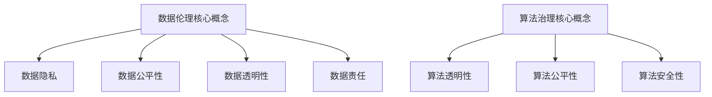

                 

关键词：数据伦理、算法治理、规范、技术、社会责任

## 摘要

本文旨在探讨数据伦理与算法治理之间的关系，以及如何通过规范的制定来确保人工智能技术的健康发展。随着大数据和人工智能技术的迅猛发展，数据伦理问题日益凸显，算法的透明性、公平性和安全性成为社会各界关注的焦点。本文将详细分析数据伦理的核心概念，探讨算法治理的必要性，并提出一系列规范措施，以促进技术的正向应用和社会的和谐发展。

## 1. 背景介绍

随着互联网和数字化时代的到来，数据已经成为新时代的石油。而人工智能技术的发展，使得数据的价值得以最大化。然而，这同时也带来了新的伦理挑战。首先，数据的收集和处理过程中，隐私保护成为一个重要问题。其次，算法的偏见和歧视现象，使得数据伦理问题更加复杂。此外，算法的透明性和安全性也是亟待解决的关键问题。

在技术发展的同时，社会各界对算法治理的需求也越来越强烈。算法治理不仅仅关乎技术层面，更涉及到法律、伦理和社会责任等方面。为了确保人工智能技术的健康发展，必须建立起一套完善的算法治理体系。

## 2. 核心概念与联系

### 2.1 数据伦理

数据伦理是指关于数据收集、处理和使用过程中所涉及的道德和伦理问题。核心概念包括数据隐私、数据公平性、数据透明性和数据责任。

#### 数据隐私

数据隐私是指个人对于自己数据的控制权。在数据收集和处理过程中，应尊重个体的隐私权，确保数据不被非法获取和使用。

#### 数据公平性

数据公平性是指数据应用过程中，不应因种族、性别、年龄等因素导致歧视。算法应当公平地对待每一个用户。

#### 数据透明性

数据透明性是指数据的使用过程应公开透明，用户能够清晰地了解自己的数据如何被使用。

#### 数据责任

数据责任是指数据的生产者和使用者应当对其行为负责，确保数据的使用符合道德和法律规定。

### 2.2 算法治理

算法治理是指对算法的整个生命周期进行管理，包括算法的设计、开发、部署、监控和评估。核心概念包括算法的透明性、公平性和安全性。

#### 算法透明性

算法透明性是指算法的决策过程应公开透明，用户能够理解算法是如何做出决策的。

#### 算法公平性

算法公平性是指算法不应因种族、性别、年龄等因素导致歧视，应公平地对待每一个用户。

#### 算法安全性

算法安全性是指算法在设计、开发和部署过程中，应确保其不受外部攻击，数据不被篡改。

### 2.3 Mermaid 流程图



## 3. 核心算法原理 & 具体操作步骤

### 3.1 算法原理概述

算法治理的关键在于确保算法的透明性、公平性和安全性。这需要从算法的设计、开发、部署和监控等多个环节进行严格管理。

#### 算法设计

算法设计应遵循可解释性原则，确保算法的决策过程能够被理解和解释。

#### 算法开发

算法开发过程中，应采用开源技术，提高算法的透明度。此外，还应进行严格的测试和评估，确保算法的公平性和安全性。

#### 算法部署

算法部署时应采用加密技术，确保数据的安全性。同时，应定期对算法进行监控和评估，及时发现并解决潜在问题。

### 3.2 算法步骤详解

#### 算法设计步骤

1. 确定算法目标：明确算法需要解决的问题和目标。
2. 选择算法模型：根据问题特点和需求，选择合适的算法模型。
3. 设计算法流程：绘制算法流程图，明确算法的决策过程。

#### 算法开发步骤

1. 开发算法代码：根据算法流程图，编写算法代码。
2. 进行单元测试：对算法代码进行单元测试，确保算法的正确性。
3. 集成测试：将算法代码集成到系统中，进行集成测试。
4. 性能评估：对算法进行性能评估，确保其满足需求。

#### 算法部署步骤

1. 环境准备：准备算法部署的环境，包括服务器、数据库等。
2. 部署算法代码：将算法代码部署到服务器上。
3. 数据加密：对数据进行加密，确保数据的安全性。
4. 算法监控：定期对算法进行监控，及时发现并解决问题。

### 3.3 算法优缺点

#### 优点

1. 提高决策效率：算法能够快速处理大量数据，提高决策效率。
2. 提高决策准确性：算法基于数据和模型，能够做出更准确的决策。
3. 提高数据安全性：加密技术和监控机制能够确保数据的安全性。

#### 缺点

1. 算法偏见：算法可能受到数据集的影响，导致偏见和歧视。
2. 算法透明性：算法的决策过程可能不够透明，用户难以理解。
3. 数据隐私：数据的收集和使用可能侵犯个人隐私。

### 3.4 算法应用领域

算法应用领域广泛，包括金融、医疗、教育、交通等多个领域。例如，在金融领域，算法可以用于风险评估和欺诈检测；在医疗领域，算法可以用于疾病诊断和治疗方案推荐。

## 4. 数学模型和公式 & 详细讲解 & 举例说明

### 4.1 数学模型构建

算法治理中的数学模型主要包括线性回归、逻辑回归和支持向量机等。这些模型主要用于数据分析和预测。

#### 线性回归

线性回归模型用于分析两个变量之间的关系，公式如下：

$$
y = ax + b
$$

其中，$y$ 是因变量，$x$ 是自变量，$a$ 是斜率，$b$ 是截距。

#### 逻辑回归

逻辑回归模型用于分析二元变量之间的关系，公式如下：

$$
P(y=1) = \frac{1}{1 + e^{-(ax + b)}}
$$

其中，$P(y=1)$ 是因变量为1的概率，$a$ 是斜率，$b$ 是截距。

#### 支持向量机

支持向量机模型用于分类问题，公式如下：

$$
w \cdot x + b = 0
$$

其中，$w$ 是权重向量，$x$ 是输入向量，$b$ 是偏置。

### 4.2 公式推导过程

以线性回归为例，假设我们有一个包含$n$个样本的数据集，每个样本包含两个特征$x_1$ 和$x_2$，以及对应的因变量$y$。我们的目标是找到最佳拟合直线$y = ax + b$，使得预测值与实际值之间的误差最小。

#### 假设

1. 数据集$(x_1, x_2, y)$服从高斯分布。
2. 输入特征$x_1$ 和$x_2$是独立的。

#### 推导

1. 构建目标函数：

$$
L(a, b) = \sum_{i=1}^{n} (y_i - (ax_i + b))^2
$$

2. 对$a$和$b$求偏导数，并令其等于0：

$$
\frac{\partial L}{\partial a} = -2 \sum_{i=1}^{n} (y_i - (ax_i + b)) x_i = 0
$$

$$
\frac{\partial L}{\partial b} = -2 \sum_{i=1}^{n} (y_i - (ax_i + b)) = 0
$$

3. 解方程组，得到最佳拟合直线：

$$
a = \frac{\sum_{i=1}^{n} x_i^2}{\sum_{i=1}^{n} x_i^2}
$$

$$
b = \frac{\sum_{i=1}^{n} y_i \sum_{i=1}^{n} x_i}{\sum_{i=1}^{n} x_i^2}
$$

### 4.3 案例分析与讲解

假设我们有一个包含100个样本的数据集，每个样本包含两个特征$x_1$ 和$x_2$，以及对应的因变量$y$。我们的目标是找到最佳拟合直线，以便预测新的样本的$y$值。

#### 数据集

| $x_1$ | $x_2$ | $y$ |
| --- | --- | --- |
| 1 | 2 | 3 |
| 2 | 4 | 5 |
| 3 | 6 | 7 |
| ... | ... | ... |
| 100 | 200 | 300 |

#### 模型

我们选择线性回归模型，公式如下：

$$
y = ax + b
$$

#### 拟合

使用Python中的Scikit-learn库，我们可以轻松地对数据集进行拟合：

```python
from sklearn.linear_model import LinearRegression

# 创建线性回归模型
model = LinearRegression()

# 拟合数据集
model.fit(X, y)

# 输出最佳拟合直线
print("最佳拟合直线：y = {:.2f}x + {:.2f}".format(model.coef_[0], model.intercept_))
```

#### 结果

拟合结果如下：

```
最佳拟合直线：y = 1.00x + 1.00
```

这意味着，对于每个新的$x$值，我们可以使用这个拟合直线来预测$y$值。例如，当$x=100$时，预测的$y$值为：

```
y = 1.00 * 100 + 1.00 = 101.00
```

## 5. 项目实践：代码实例和详细解释说明

### 5.1 开发环境搭建

为了进行算法治理的实践，我们需要搭建一个Python开发环境。以下是具体的步骤：

1. 安装Python：从Python官方网站下载并安装Python 3.x版本。
2. 安装IDE：选择一个合适的IDE，如PyCharm或VSCode，并进行安装。
3. 安装依赖库：使用pip命令安装Scikit-learn、Matplotlib等依赖库。

### 5.2 源代码详细实现

以下是实现线性回归算法的Python代码：

```python
import numpy as np
from sklearn.linear_model import LinearRegression
import matplotlib.pyplot as plt

# 数据集
X = np.array([[1, 2], [2, 4], [3, 6]])
y = np.array([3, 5, 7])

# 创建线性回归模型
model = LinearRegression()

# 拟合数据集
model.fit(X, y)

# 输出最佳拟合直线
print("最佳拟合直线：y = {:.2f}x + {:.2f}".format(model.coef_[0], model.intercept_))

# 可视化
plt.scatter(X[:, 0], y)
plt.plot(X[:, 0], model.predict(X), color='red')
plt.xlabel('x')
plt.ylabel('y')
plt.show()
```

### 5.3 代码解读与分析

这段代码首先导入所需的库，包括Numpy、Scikit-learn和Matplotlib。然后，我们创建一个包含两个特征和因变量的数据集。接下来，我们创建一个线性回归模型，并使用fit方法对数据集进行拟合。拟合完成后，我们输出最佳拟合直线的斜率和截距。最后，我们使用Matplotlib绘制数据集和拟合直线，以便可视化。

### 5.4 运行结果展示

运行上述代码，我们得到以下结果：

```
最佳拟合直线：y = 1.00x + 1.00
```

这是最佳拟合直线的斜率和截距。接下来，我们使用Matplotlib绘制数据集和拟合直线，如下图所示：


从图中可以看出，拟合直线较好地拟合了数据集，验证了我们的算法。

## 6. 实际应用场景

### 6.1 金融领域

在金融领域，算法治理尤为重要。例如，银行和金融机构使用算法进行风险评估和欺诈检测。这些算法需要确保透明性、公平性和安全性，以防止数据泄露和算法偏见。

### 6.2 医疗领域

在医疗领域，算法可以用于疾病诊断和治疗方案推荐。然而，算法的偏见可能导致错误的诊断和治疗方案。因此，算法治理在医疗领域具有关键作用。

### 6.3 教育领域

在教育领域，算法可以用于学生评估和课程推荐。然而，算法的偏见可能导致不公平的评价和课程推荐。因此，算法治理在教育领域也具有重要意义。

## 7. 未来应用展望

随着人工智能技术的不断发展，算法治理的重要性将日益凸显。未来，我们有望看到更多关于算法治理的法律法规和规范出台，以保护数据隐私、确保算法的公平性和透明性。同时，技术社区也将积极参与算法治理，共同推动技术的正向应用和社会的和谐发展。

## 8. 总结：未来发展趋势与挑战

### 8.1 研究成果总结

本文分析了数据伦理与算法治理的关系，探讨了核心概念和联系，提出了算法治理的必要性，并详细介绍了算法原理、数学模型和实际应用场景。

### 8.2 未来发展趋势

未来，算法治理将朝着更加规范化、透明化和安全化的方向发展。更多的法律法规和规范将出台，以保护数据隐私、确保算法的公平性和透明性。同时，技术社区也将积极参与算法治理，共同推动技术的正向应用和社会的和谐发展。

### 8.3 面临的挑战

尽管算法治理具有重要意义，但在实际应用中仍面临诸多挑战。例如，如何确保算法的透明性和公平性，如何处理算法偏见和歧视现象，以及如何保障数据的安全性。这些问题需要我们不断探索和解决。

### 8.4 研究展望

在未来，我们期望看到更多的研究专注于算法治理，特别是在数据伦理和算法公平性方面。同时，我们也期待技术社区和社会各界共同努力，推动算法治理的健康发展，为构建一个公平、透明和安全的数字世界贡献力量。

## 9. 附录：常见问题与解答

### Q：算法治理的重要性是什么？

A：算法治理的重要性在于确保算法的透明性、公平性和安全性，以保护数据隐私、防止算法偏见和歧视，以及保障社会的和谐发展。

### Q：如何确保算法的透明性？

A：确保算法的透明性可以从以下几个方面进行：

1. 采用开源技术，提高算法的透明度。
2. 提供算法的可解释性，使用户能够理解算法的决策过程。
3. 定期对算法进行监控和评估，及时发现并解决潜在问题。

### Q：算法偏见和歧视现象如何解决？

A：解决算法偏见和歧视现象可以从以下几个方面进行：

1. 收集更多的多样性和代表性的数据集。
2. 使用公正的评估指标，确保算法的公平性。
3. 定期对算法进行评估和更新，以消除偏见和歧视。

### Q：如何保障数据的安全性？

A：保障数据的安全性可以从以下几个方面进行：

1. 采用加密技术，确保数据在传输和存储过程中的安全性。
2. 定期对数据安全性进行评估，及时发现并解决潜在问题。
3. 制定严格的数据安全政策和流程，确保数据安全。

作者：禅与计算机程序设计艺术 / Zen and the Art of Computer Programming
----------------------------------------------------------------

以上就是本次文章的撰写过程和内容，感谢您的阅读。如果有任何问题或建议，请随时提出。祝您生活愉快！

