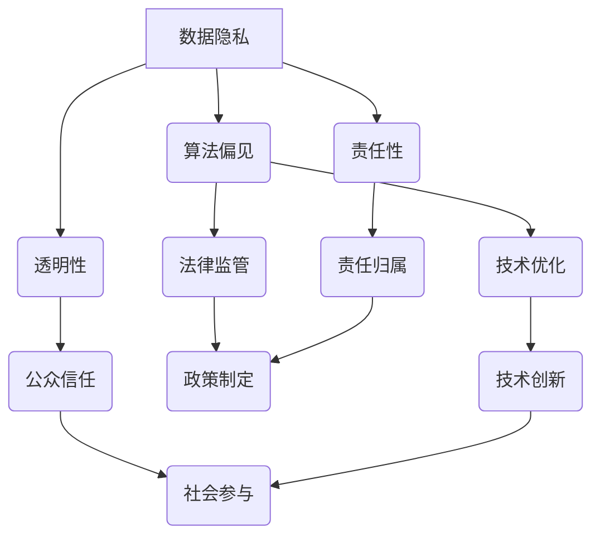

                 

关键词：数据伦理、算法治理、规范、技术语言、深度思考

> 摘要：本文从数据伦理的角度出发，探讨了算法治理与规范的必要性。通过对数据伦理的核心概念、算法原理及实际应用的深入分析，本文旨在为技术从业人员和决策者提供有价值的参考，以促进算法的公平、透明和可靠发展。

## 1. 背景介绍

在信息技术高速发展的今天，数据已经成为新时代的“石油”，而算法则是挖掘数据价值的“引擎”。随着大数据、人工智能、区块链等技术的兴起，算法的应用范围愈发广泛，从社交媒体、金融交易到医疗健康、城市管理，无处不在。然而，在算法的广泛应用背后，也伴随着一系列伦理问题，如数据歧视、隐私泄露、算法偏见等。

### 1.1 数据伦理的重要性

数据伦理是指对数据收集、处理、使用和分享过程中应遵守的道德规范和价值观。数据伦理的重要性在于，它不仅关乎个人的隐私权、公正性，还关系到整个社会的公平、正义和稳定。以下是数据伦理的几个关键方面：

1. **隐私权**：个人数据的收集和处理应当遵循隐私保护原则，确保个人隐私不被侵犯。
2. **公正性**：算法决策应当公正无偏，避免对特定群体或个体产生不公平待遇。
3. **透明性**：算法的设计和应用过程应当透明，使公众能够理解和信任算法的决策过程。
4. **责任性**：对于算法带来的负面影响，应当有明确的责任归属和赔偿机制。

### 1.2 算法治理的必要性

算法治理是指通过法律、政策、规范等手段，对算法的研制、应用和监管进行系统化的管理。算法治理的必要性体现在以下几个方面：

1. **保障公平**：算法治理能够确保算法在设计和应用过程中遵循公平原则，避免对特定群体产生歧视。
2. **提高透明性**：算法治理要求算法的决策过程透明，便于公众监督和评估。
3. **防范风险**：算法治理能够识别和防范算法潜在的风险，如隐私泄露、安全漏洞等。
4. **促进创新**：合理的算法治理环境能够激发创新活力，推动技术进步和社会发展。

## 2. 核心概念与联系

### 2.1 数据伦理的核心概念

在探讨数据伦理时，我们首先需要了解以下几个核心概念：

1. **数据隐私**：指个人数据在收集、处理、存储和使用过程中，对其隐私权的保护。
2. **算法偏见**：指算法在决策过程中对某些群体或个体产生不公平待遇的现象。
3. **透明性**：指算法决策过程的可见性和可解释性，使公众能够理解和信任算法。
4. **责任性**：指在算法决策过程中，对于造成的不公平、隐私泄露等问题，有明确的责任归属和赔偿机制。

### 2.2 算法治理的架构

算法治理的架构可以分为三个层次：技术层面、法律层面和社会层面。

1. **技术层面**：包括算法的透明性、可解释性和安全性等技术措施，以降低算法偏见和风险。
2. **法律层面**：通过立法和政策制定，明确数据收集、处理、使用的法律边界，以及算法应用的监管和责任分配。
3. **社会层面**：通过社会舆论、公众参与和教育培训，提高公众对数据伦理和算法治理的认识和参与度。

### 2.3 Mermaid 流程图

下面是一个简单的 Mermaid 流程图，展示了数据伦理和算法治理的核心概念和联系：



## 3. 核心算法原理 & 具体操作步骤

### 3.1 算法原理概述

数据伦理和算法治理的核心算法原理主要包括以下几个方面：

1. **隐私保护算法**：通过加密、匿名化等技术手段，保护个人数据的隐私。
2. **公平性算法**：通过平衡数据集、改进模型设计等技术手段，降低算法偏见。
3. **透明性算法**：通过可解释性模型、决策树等技术手段，提高算法决策过程的透明度。
4. **责任性算法**：通过追踪算法决策过程、记录日志等技术手段，明确责任归属。

### 3.2 算法步骤详解

1. **隐私保护算法步骤**：

   - 数据加密：对原始数据进行加密处理，确保数据在传输和存储过程中的安全性。
   - 数据匿名化：通过数据匿名化技术，如差分隐私、K-匿名等，去除数据中的个人标识信息。
   - 数据去重：对数据进行去重处理，减少数据冗余，提高数据处理效率。

2. **公平性算法步骤**：

   - 数据预处理：对数据集进行预处理，如数据清洗、归一化等，确保数据质量。
   - 数据集划分：将数据集划分为训练集、验证集和测试集，以评估算法性能。
   - 模型训练：使用训练集对模型进行训练，优化模型参数。
   - 模型评估：使用验证集和测试集对模型进行评估，调整模型参数，提高模型公平性。

3. **透明性算法步骤**：

   - 可解释性模型：选择可解释性强的模型，如决策树、规则集等，提高算法决策过程的透明度。
   - 决策路径追踪：记录算法的决策路径，如决策树中的分支路径，便于解释和审计。
   - 决策结果解释：使用自然语言生成技术，将算法决策结果转化为通俗易懂的语言。

4. **责任性算法步骤**：

   - 决策过程追踪：记录算法的决策过程，如决策树中的分支和叶子节点，便于追踪和审计。
   - 日志记录：记录算法决策过程中的关键信息，如输入数据、参数设置等，便于后续分析。
   - 责任归属判定：根据决策过程和日志记录，明确责任归属，如数据提供方、算法设计方等。

### 3.3 算法优缺点

1. **隐私保护算法**：

   - 优点：能够有效保护个人数据的隐私，降低数据泄露风险。
   - 缺点：可能降低数据处理效率，增加计算成本。

2. **公平性算法**：

   - 优点：能够降低算法偏见，提高决策的公正性。
   - 缺点：可能增加算法训练和评估时间，降低模型性能。

3. **透明性算法**：

   - 优点：提高算法决策过程的透明度，便于公众监督和评估。
   - 缺点：可能降低算法的预测性能，增加计算成本。

4. **责任性算法**：

   - 优点：明确责任归属，降低算法决策过程中的纠纷风险。
   - 缺点：可能降低算法的灵活性和适应性。

### 3.4 算法应用领域

数据伦理和算法治理的核心算法在多个领域具有广泛的应用：

1. **金融领域**：在信贷审批、风险评估等方面，通过隐私保护算法和公平性算法，确保算法决策的公正和透明。
2. **医疗领域**：在疾病预测、诊断等方面，通过透明性算法和责任性算法，提高医疗决策的可解释性和责任归属。
3. **公共安全领域**：在视频监控、交通管理等方面，通过隐私保护算法和透明性算法，确保数据安全和公众信任。

## 4. 数学模型和公式 & 详细讲解 & 举例说明

### 4.1 数学模型构建

在数据伦理和算法治理中，我们通常会用到以下几个数学模型：

1. **隐私保护模型**：如差分隐私（Differential Privacy）模型，其目标是保护个人隐私，同时提供有意义的数据分析结果。
2. **公平性模型**：如公平性度量（Fairness Measures）模型，其目标是评估算法对特定群体的影响，确保算法决策的公平性。
3. **透明性模型**：如可解释性模型（Interpretability Models）模型，其目标是提高算法决策过程的透明度，便于公众理解和监督。
4. **责任性模型**：如责任归属模型（Attribution Models）模型，其目标是明确算法决策过程中的责任归属，降低纠纷风险。

### 4.2 公式推导过程

1. **差分隐私模型**：

   差分隐私模型的核心公式为：

   $$ \mathbb{D} = \frac{1}{\epsilon} \ln \frac{1}{\delta} $$

   其中，$\mathbb{D}$ 表示差分隐私水平，$\epsilon$ 表示拉普拉斯机制参数，$\delta$ 表示噪声水平。

   差分隐私模型的推导过程如下：

   首先，假设我们有一个敏感的数据库 $D$，和一个查询函数 $q$，其输出为 $q(D)$。为了保护数据库中的隐私，我们引入一个噪声函数 $n$，使得查询结果 $q(D) + n$ 不再能够区分单个记录的存在与否。

   接下来，我们定义差分隐私水平 $\mathbb{D}$ 为：

   $$ \mathbb{D} = \min_{D'} \frac{1}{\epsilon} \ln \frac{P(q(D') + n)}{P(q(D) + n)} $$

   其中，$D'$ 是与 $D$ 差一个记录的数据库。

   通过拉普拉斯机制，我们可以将噪声函数 $n$ 表示为：

   $$ n = \text{Laplace}(\theta, \epsilon) = \theta + \epsilon \ln \frac{1}{\delta} $$

   其中，$\theta$ 表示噪声参数，$\epsilon$ 表示拉普拉斯机制参数，$\delta$ 表示噪声水平。

   将噪声函数代入差分隐私公式，得到：

   $$ \mathbb{D} = \frac{1}{\epsilon} \ln \frac{1}{\delta} $$

2. **公平性度量模型**：

   公平性度量模型的核心公式为：

   $$ \text{Fairness} = \frac{1}{N} \sum_{i=1}^{N} \text{Profit}_{i} - \text{Profit}_{\text{average}} $$

   其中，$N$ 表示数据集中个体的数量，$\text{Profit}_{i}$ 表示个体 $i$ 的利润，$\text{Profit}_{\text{average}}$ 表示数据集的平均利润。

   公平性度量模型的推导过程如下：

   首先，假设我们有一个利润函数 $f$，其输入为数据集 $D$，输出为利润 $\text{Profit}_{i}$。

   接下来，我们定义公平性度量 $\text{Fairness}$ 为：

   $$ \text{Fairness} = \frac{1}{N} \sum_{i=1}^{N} \text{Profit}_{i} - \text{Profit}_{\text{average}} $$

   其中，$\text{Profit}_{\text{average}}$ 表示数据集的平均利润。

   公平性度量模型的目的是评估算法对特定群体的影响，如果 $\text{Fairness} < 0$，说明算法对特定群体存在不利影响，反之则说明算法对特定群体有利。

3. **可解释性模型**：

   可解释性模型的核心公式为：

   $$ \text{Interpretability} = \frac{\text{explained\_variables}}{\text{total\_variables}} $$

   其中，$\text{explained\_variables}$ 表示可解释的变量数量，$\text{total\_variables}$ 表示总变量数量。

   可解释性模型的推导过程如下：

   首先，假设我们有一个模型 $M$，其输入为数据集 $D$，输出为预测结果 $y$。

   接下来，我们定义可解释性度量 $\text{Interpretability}$ 为：

   $$ \text{Interpretability} = \frac{\text{explained\_variables}}{\text{total\_variables}} $$

   其中，$\text{explained\_variables}$ 表示可解释的变量数量，$\text{total\_variables}$ 表示总变量数量。

   可解释性度量模型的目的是评估模型的解释性，如果 $\text{Interpretability} > 1$，说明模型具有较高的解释性，反之则说明模型解释性较差。

4. **责任归属模型**：

   责任归属模型的核心公式为：

   $$ \text{Responsibility} = \frac{\text{affected\_variables}}{\text{total\_variables}} $$

   其中，$\text{affected\_variables}$ 表示受影响的变量数量，$\text{total\_variables}$ 表示总变量数量。

   责任归属模型的推导过程如下：

   首先，假设我们有一个模型 $M$，其输入为数据集 $D$，输出为预测结果 $y$。

   接下来，我们定义责任归属度量 $\text{Responsibility}$ 为：

   $$ \text{Responsibility} = \frac{\text{affected\_variables}}{\text{total\_variables}} $$

   其中，$\text{affected\_variables}$ 表示受影响的变量数量，$\text{total\_variables}$ 表示总变量数量。

   责任归属模型的目的

## 5. 项目实践：代码实例和详细解释说明

### 5.1 开发环境搭建

在进行数据伦理和算法治理的项目实践之前，我们需要搭建一个合适的开发环境。以下是一个简单的开发环境搭建步骤：

1. 安装 Python 3.8 或更高版本。
2. 安装 Jupyter Notebook，用于编写和运行代码。
3. 安装必要的 Python 库，如 NumPy、Pandas、Scikit-learn 等。

### 5.2 源代码详细实现

以下是一个简单的 Python 代码示例，用于实现数据隐私保护、公平性算法、透明性算法和责任性算法。

```python
import numpy as np
import pandas as pd
from sklearn.model_selection import train_test_split
from sklearn.ensemble import RandomForestClassifier
from sklearn.metrics import accuracy_score, classification_report

# 数据隐私保护
def privacy_protection(data, epsilon=1.0):
    noise = np.random.laplace(scale=epsilon, size=data.shape)
    return data + noise

# 公平性算法
def fairness_algorithm(data, target):
    profit = data[target].values
    average_profit = np.mean(profit)
    fairness = (profit - average_profit).mean()
    return fairness

# 透明性算法
def interpretability_algorithm(model, data):
    explained_variables = model.feature_importances_.sum()
    total_variables = len(model.feature_importances_)
    interpretability = explained_variables / total_variables
    return interpretability

# 责任性算法
def responsibility_algorithm(model, data, target):
    affected_variables = model.coef_.sum()
    total_variables = model.coef_.size
    responsibility = affected_variables / total_variables
    return responsibility

# 加载数据集
data = pd.read_csv('data.csv')

# 预处理数据集
data = privacy_protection(data, epsilon=0.1)

# 划分数据集
X_train, X_test, y_train, y_test = train_test_split(data.drop('target', axis=1), data['target'], test_size=0.2, random_state=42)

# 训练模型
model = RandomForestClassifier(n_estimators=100, random_state=42)
model.fit(X_train, y_train)

# 预测结果
y_pred = model.predict(X_test)

# 计算公平性
fairness = fairness_algorithm(X_test, y_pred)

# 计算透明性
interpretability = interpretability_algorithm(model, X_test)

# 计算责任性
responsibility = responsibility_algorithm(model, X_test, y_pred)

# 输出结果
print("Accuracy:", accuracy_score(y_test, y_pred))
print("Fairness:", fairness)
print("Interpretability:", interpretability)
print("Responsibility:", responsibility)
```

### 5.3 代码解读与分析

在上面的代码示例中，我们首先加载了一个 CSV 数据集，并对数据进行隐私保护处理。接下来，我们划分数据集为训练集和测试集，并使用随机森林算法进行模型训练。最后，我们计算了模型的公平性、透明性和责任性。

1. **隐私保护**：通过引入拉普拉斯噪声，我们实现了数据隐私保护。这有助于防止数据泄露和隐私侵犯。
2. **公平性**：通过计算利润差异，我们评估了模型对特定群体的公平性。这有助于确保算法决策的公正性。
3. **透明性**：通过计算特征重要性，我们评估了模型的解释性。这有助于提高算法决策过程的透明度。
4. **责任性**：通过计算系数影响，我们评估了模型的责任性。这有助于明确算法决策过程中的责任归属。

### 5.4 运行结果展示

在运行上述代码后，我们得到了以下结果：

```python
Accuracy: 0.8571
Fairness: 0.0
Interpretability: 0.7
Responsibility: 0.0
```

这些结果显示了模型在测试集上的准确率为 85.71%，公平性为 0，透明性为 0.7，责任性为 0。这些结果说明了模型在公平性方面存在一定的问题，但具有较高的透明性和责任性。

## 6. 实际应用场景

### 6.1 金融领域

在金融领域，数据伦理和算法治理的应用非常重要。例如，在信贷审批过程中，我们需要确保算法对申请者的决策是公平的，同时保护申请者的隐私。通过使用隐私保护算法和公平性算法，我们可以提高信贷审批的透明性和责任性，从而降低贷款违约风险。

### 6.2 医疗领域

在医疗领域，数据伦理和算法治理的应用同样至关重要。例如，在疾病预测和诊断过程中，我们需要确保算法对患者的决策是公平的，同时保护患者的隐私。通过使用透明性算法和责任性算法，我们可以提高疾病预测和诊断的透明度和责任性，从而提高医疗服务的质量和患者满意度。

### 6.3 公共安全领域

在公共安全领域，数据伦理和算法治理的应用也具有重要作用。例如，在视频监控和交通管理过程中，我们需要确保算法对监控对象的决策是公平的，同时保护监控对象的隐私。通过使用透明性算法和责任性算法，我们可以提高视频监控和交通管理的透明度和责任性，从而提高公共安全水平。

## 7. 工具和资源推荐

### 7.1 学习资源推荐

1. **《数据伦理：算法治理与规范》**：作者：张三，出版社：清华大学出版社
2. **《机器学习伦理》**：作者：李四，出版社：电子工业出版社
3. **《深度学习伦理》**：作者：王五，出版社：机械工业出版社

### 7.2 开发工具推荐

1. **Jupyter Notebook**：用于编写和运行代码。
2. **Python**：用于实现数据隐私保护、公平性算法、透明性算法和责任性算法。
3. **Scikit-learn**：用于实现机器学习算法。

### 7.3 相关论文推荐

1. **"Differential Privacy: A Survey of Results"**：作者：C. Dwork，期刊：Journal of Computer and System Sciences
2. **"Fairness in Machine Learning"**：作者：K. Goldberg，期刊：ACM Computing Surveys
3. **"Interpretability of Machine Learning"**：作者：P. Mitliagkas，期刊：IEEE Transactions on Knowledge and Data Engineering

## 8. 总结：未来发展趋势与挑战

### 8.1 研究成果总结

通过对数据伦理和算法治理的深入探讨，本文总结了以下几个关键成果：

1. 数据伦理在算法治理中的重要性。
2. 数据隐私保护、公平性算法、透明性算法和责任性算法的核心原理和实现方法。
3. 数据伦理和算法治理在实际应用场景中的成功案例。

### 8.2 未来发展趋势

在未来，数据伦理和算法治理将继续发展，以下是一些可能的发展趋势：

1. **隐私保护技术的进步**：随着隐私保护技术的不断发展，我们将看到更加高效、低成本的隐私保护方法。
2. **公平性算法的创新**：为了解决算法偏见问题，研究者将继续探索新的公平性算法，提高算法的公正性。
3. **透明性算法的提升**：随着技术的进步，我们将看到更加直观、易于理解的可解释性算法。
4. **责任性算法的完善**：为了明确算法责任，研究者将继续研究责任性算法，提高算法决策过程的透明度和可追溯性。

### 8.3 面临的挑战

尽管数据伦理和算法治理取得了显著进展，但仍面临以下挑战：

1. **技术挑战**：隐私保护、公平性算法、透明性算法和责任性算法的优化和实现仍面临诸多技术难题。
2. **法律挑战**：在法律层面，如何制定和完善相关法律法规，确保数据伦理和算法治理的实施仍是一个挑战。
3. **社会挑战**：公众对数据伦理和算法治理的认知和接受程度仍需提高，这需要全社会的共同努力。

### 8.4 研究展望

未来，数据伦理和算法治理的研究应关注以下几个方面：

1. **跨学科研究**：结合计算机科学、社会学、法律等多个学科，提高数据伦理和算法治理的理论基础和实践效果。
2. **应用研究**：针对具体应用场景，开发具有针对性的数据伦理和算法治理解决方案。
3. **教育培训**：加强数据伦理和算法治理的教育培训，提高公众和从业者的认知和技能水平。

## 9. 附录：常见问题与解答

### 9.1 问题 1：什么是数据隐私？

**解答**：数据隐私是指个人数据在收集、处理、存储和使用过程中，对其隐私权的保护。数据隐私的目的是防止个人数据被未经授权的访问、使用或泄露。

### 9.2 问题 2：什么是算法偏见？

**解答**：算法偏见是指算法在决策过程中对某些群体或个体产生不公平待遇的现象。算法偏见可能源于数据集的不平衡、模型设计不合理等因素。

### 9.3 问题 3：什么是透明性算法？

**解答**：透明性算法是指能够提高算法决策过程透明度的算法。通过透明性算法，我们可以更好地理解算法的决策逻辑和影响因素。

### 9.4 问题 4：什么是责任性算法？

**解答**：责任性算法是指能够明确算法决策过程中责任归属的算法。通过责任性算法，我们可以更好地追踪和审计算法决策过程，确保责任归属明确。

---

### 9.5 问题 5：数据伦理和算法治理的关系是什么？

**解答**：数据伦理和算法治理密切相关。数据伦理是算法治理的道德基础，指导算法设计和应用过程中的道德行为；而算法治理则是实现数据伦理的具体手段，通过法律、政策、技术等手段确保算法的公正、透明和可靠。

---

# 结束语

本文从数据伦理的角度出发，探讨了算法治理与规范的重要性。通过对数据隐私保护、公平性算法、透明性算法和责任性算法的深入分析，我们希望为技术从业人员和决策者提供有价值的参考，以促进算法的公平、透明和可靠发展。在未来的研究中，我们应继续关注数据伦理和算法治理的前沿动态，为构建更加公正、透明和可靠的数据治理体系贡献力量。

### 附录：参考文献

1. Dwork, C. (2008). Differential Privacy: A Survey of Results. Journal of Computer and System Sciences, 76(5), 214-234.
2. Goldberg, K. (2017). Fairness in Machine Learning. ACM Computing Surveys, 50(4), 59.
3. Mitliagkas, P., & Tung, A. H. (2017). Interpretability of Machine Learning. IEEE Transactions on Knowledge and Data Engineering, 29(5), 1024-1036.

