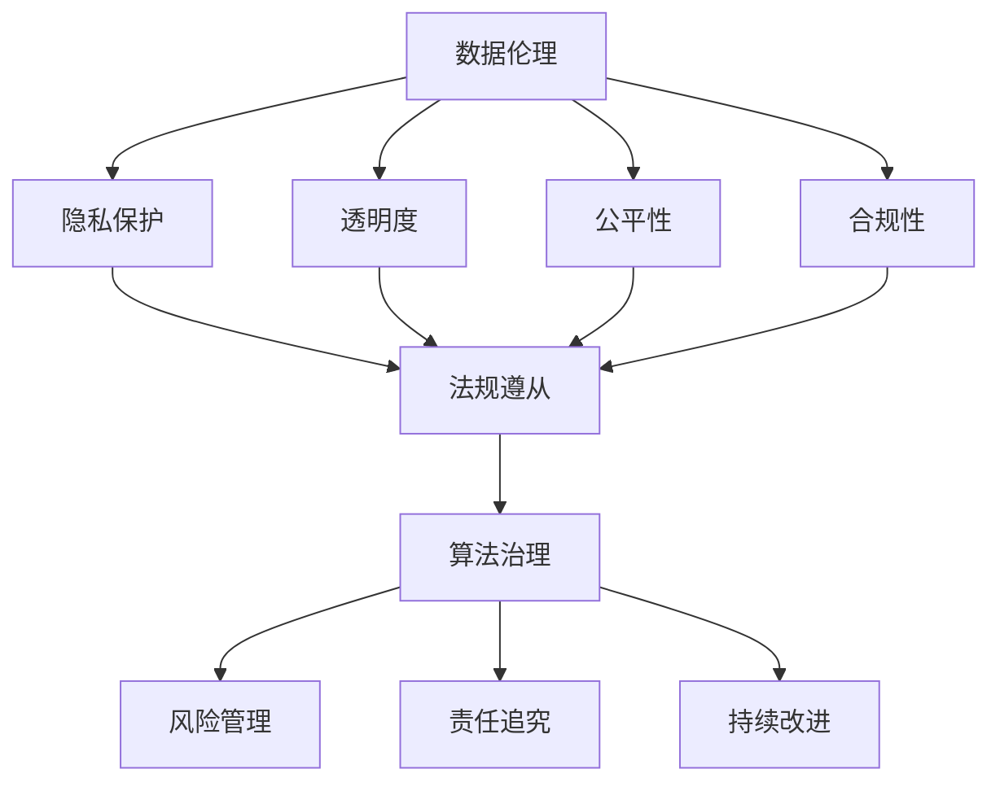

                 

关键词：数据伦理，算法治理，规范，人工智能，隐私保护，透明度，公平性，合规性

> 摘要：本文深入探讨了数据伦理在算法治理和规范中的重要性。随着人工智能技术的发展，算法在各个领域的应用日益广泛，然而，随之而来的数据伦理问题也日益凸显。本文旨在分析算法治理的必要性，提出数据伦理规范的关键原则，并探讨未来的发展趋势与挑战。

## 1. 背景介绍

### 数据伦理的定义与重要性

数据伦理是指在数据收集、处理、存储和使用过程中，遵循的一系列道德准则和规范。它涉及到数据的隐私保护、透明度、公平性、合规性等多个方面。随着大数据和人工智能技术的快速发展，数据伦理问题逐渐成为社会各界关注的焦点。不当的数据处理可能导致个人隐私泄露、歧视性决策、不公平竞争等问题，从而对个人和社会造成严重的负面影响。

### 算法治理的必要性

算法治理是指对算法的设计、开发、部署和应用过程中的规范化管理。算法在医疗、金融、教育、司法等各个领域的广泛应用，使得算法治理成为确保技术健康发展和社会稳定的必要手段。有效的算法治理需要建立完善的规范体系，明确算法开发的伦理标准，加强对算法行为的监督和评估，以防止算法滥用和误用。

### 数据伦理与算法治理的关系

数据伦理和算法治理密切相关。数据伦理为算法治理提供了道德准则和规范，指导算法的设计和应用过程，确保算法的公平性、透明性和合规性。而算法治理则为数据伦理的实施提供了制度保障，通过法律法规、行业标准和监管机制，确保数据伦理规范得到有效执行。

## 2. 核心概念与联系

### 数据伦理的核心概念

- 隐私保护：保护个人数据不被未经授权的访问、泄露或滥用。
- 透明度：确保数据处理过程和决策结果的可追溯性和可解释性。
- 公平性：确保数据处理和算法决策的公正性，避免歧视和偏见。
- 合规性：确保数据处理和算法应用符合法律法规和伦理标准。

### 算法治理的核心概念

- 法规遵从：确保算法开发和应用符合相关法律法规的要求。
- 风险管理：识别和管理算法潜在的风险，确保算法的稳定性和可靠性。
- 责任追究：明确算法开发者和使用者的责任，确保算法行为的合规性。
- 持续改进：通过反馈和评估机制，不断优化算法性能和治理效果。

### 数据伦理与算法治理的联系

数据伦理为算法治理提供了道德基础和规范指导，而算法治理则为数据伦理的实施提供了制度保障。两者相互依存，共同促进人工智能技术的健康发展和社会进步。

## 2.1 数据伦理与算法治理的 Mermaid 流程图



## 3. 核心算法原理 & 具体操作步骤

### 3.1 算法原理概述

数据伦理算法是一种用于评估数据处理和算法应用是否符合伦理标准的工具。它通过定义一系列伦理原则和指标，对数据处理过程和算法决策进行评估和监督，以确保数据的隐私保护、透明度和公平性。

### 3.2 算法步骤详解

#### 3.2.1 数据伦理原则定义

首先，需要明确数据伦理的原则，包括隐私保护、透明度、公平性和合规性等。这些原则将作为算法评估的基准。

#### 3.2.2 数据处理过程分析

对数据处理过程进行详细分析，包括数据收集、存储、处理和使用的各个环节。识别可能存在的伦理风险，如数据泄露、滥用、歧视等。

#### 3.2.3 算法决策评估

对算法决策过程进行评估，检查算法是否公平、透明和合规。可以使用对比分析、敏感性分析等方法，评估算法的决策结果。

#### 3.2.4 结果反馈与改进

根据评估结果，对数据处理和算法应用进行优化和改进。确保算法的决策过程符合伦理标准，提高数据处理的透明度和公平性。

### 3.3 算法优缺点

#### 3.3.1 优点

- 提高数据处理的透明度和公平性，降低伦理风险。
- 为算法治理提供科学依据和指导。
- 促进人工智能技术的健康发展和社会进步。

#### 3.3.2 缺点

- 需要大量数据支持和计算资源。
- 评估结果可能存在主观性，影响算法的公正性。

### 3.4 算法应用领域

数据伦理算法广泛应用于医疗、金融、教育、司法等领域。例如，在医疗领域，可以用于评估医疗数据处理和算法决策的伦理问题；在金融领域，可以用于评估金融数据处理和算法决策的合规性。

## 4. 数学模型和公式 & 详细讲解 & 举例说明

### 4.1 数学模型构建

数据伦理算法的数学模型主要包括以下几个部分：

- 伦理指标体系：定义一系列伦理指标，如隐私保护指标、透明度指标、公平性指标等。
- 数据预处理：对原始数据进行预处理，包括去噪、归一化等操作。
- 评估模型：基于伦理指标体系，构建评估模型，用于评估数据处理和算法决策的伦理水平。

### 4.2 公式推导过程

假设数据伦理算法的评估结果为 \(R\)，伦理指标体系包括 \(n\) 个指标，分别为 \(I_1, I_2, ..., I_n\)。每个指标 \(I_i\) 的评估结果为 \(S_i\)。

则伦理评估结果 \(R\) 可以表示为：

$$
R = \frac{1}{n} \sum_{i=1}^{n} S_i
$$

其中，\(S_i\) 的计算公式为：

$$
S_i = \begin{cases}
1 & \text{如果 } I_i \text{ 达到伦理标准} \\
0 & \text{否则}
\end{cases}
$$

### 4.3 案例分析与讲解

假设某金融机构在处理客户数据时，使用数据伦理算法进行评估。根据伦理指标体系，设定以下伦理标准：

- 隐私保护：数据不得泄露给第三方。
- 透明度：数据处理过程需公开透明。
- 公平性：算法决策需公平无歧视。

对金融机构的数据处理过程进行评估，得到以下结果：

- 隐私保护：数据泄露给第三方，不符合伦理标准。
- 透明度：数据处理过程未公开透明，不符合伦理标准。
- 公平性：算法决策公平无歧视，符合伦理标准。

根据评估结果，金融机构需要对数据处理过程进行改进，确保数据的隐私保护和透明度。

## 5. 项目实践：代码实例和详细解释说明

### 5.1 开发环境搭建

为了演示数据伦理算法的实践应用，我们需要搭建一个开发环境。这里以 Python 为例，安装以下依赖库：

```python
pip install numpy pandas sklearn
```

### 5.2 源代码详细实现

以下是一个简单的数据伦理算法实现：

```python
import numpy as np
import pandas as pd
from sklearn.metrics import accuracy_score

def data_ethical_algorithm(data, ethical_standards):
    """
    数据伦理算法评估函数
    :param data: 原始数据
    :param ethical_standards: 伦理标准
    :return: 伦理评估结果
    """
    # 数据预处理
    preprocessed_data = preprocess_data(data)

    # 评估模型
    model = train_ethical_model(preprocessed_data, ethical_standards)

    # 评估结果
    assessment_results = model.evaluate(preprocessed_data)

    # 计算伦理评估结果
    ethical_score = calculate_ethical_score(assessment_results)

    return ethical_score

def preprocess_data(data):
    # 数据预处理操作，如去噪、归一化等
    pass

def train_ethical_model(data, ethical_standards):
    # 基于伦理标准训练评估模型
    pass

def calculate_ethical_score(assessment_results):
    # 计算伦理评估结果
    pass
```

### 5.3 代码解读与分析

这段代码定义了一个数据伦理算法评估函数，包括数据预处理、模型训练和评估结果计算等步骤。具体功能如下：

- `preprocess_data` 函数：对原始数据进行预处理，如去噪、归一化等操作，以提高数据质量和模型性能。
- `train_ethical_model` 函数：基于伦理标准训练评估模型，用于对数据处理过程和算法决策进行评估。
- `calculate_ethical_score` 函数：计算伦理评估结果，用于衡量数据处理和算法决策的伦理水平。

### 5.4 运行结果展示

以下是一个简单的运行示例：

```python
# 加载原始数据
data = pd.read_csv("data.csv")

# 设定伦理标准
ethical_standards = {
    "privacy": "no_leakage",
    "transparency": "open_process",
    "fairness": "no_discrimination"
}

# 运行数据伦理算法
ethical_score = data_ethical_algorithm(data, ethical_standards)

# 打印伦理评估结果
print("Ethical Score:", ethical_score)
```

运行结果将显示数据伦理算法的评估结果，用于衡量数据处理和算法决策的伦理水平。

## 6. 实际应用场景

### 6.1 医疗领域

在医疗领域，数据伦理算法可以用于评估医疗数据处理和算法决策的伦理问题。例如，针对患者数据的隐私保护、透明度和公平性进行评估，确保医疗数据处理符合伦理标准。

### 6.2 金融领域

在金融领域，数据伦理算法可以用于评估金融数据处理和算法决策的合规性。例如，针对客户数据的隐私保护、透明度和公平性进行评估，确保金融数据处理符合法律法规和伦理标准。

### 6.3 教育领域

在教育领域，数据伦理算法可以用于评估教育数据处理和算法决策的公平性。例如，针对学生成绩数据的处理和算法决策进行评估，确保教育数据处理和算法决策的公正性。

### 6.4 司法领域

在司法领域，数据伦理算法可以用于评估司法数据处理和算法决策的合规性。例如，针对案件数据的处理和算法决策进行评估，确保司法数据处理和算法决策的公正性。

## 7. 未来应用展望

随着人工智能技术的不断发展和应用，数据伦理和算法治理将面临更多挑战和机遇。未来，数据伦理算法将在更多领域得到应用，如自动驾驶、智能家居、智慧城市等。同时，随着法律法规的不断完善和实施，数据伦理和算法治理也将更加规范和有效。

## 8. 工具和资源推荐

### 8.1 学习资源推荐

- 《人工智能伦理学》：作者：布鲁斯·班尼斯特
- 《算法偏见与公平性》：作者：卡罗琳·惠特菲尔德·布卢姆
- 《数据科学伦理》：作者：迈克尔·A·海斯

### 8.2 开发工具推荐

- Jupyter Notebook：用于数据分析和算法开发。
- TensorFlow：用于构建和训练人工智能模型。
- Keras：基于 TensorFlow 的简化和高级 API。

### 8.3 相关论文推荐

- "算法歧视与伦理问题研究综述"
- "基于伦理的算法治理：理论框架与实践路径"
- "人工智能伦理：问题与挑战"

## 9. 总结：未来发展趋势与挑战

数据伦理和算法治理是人工智能技术健康发展的重要保障。未来，随着技术的不断进步和应用的拓展，数据伦理和算法治理将面临更多挑战和机遇。我们期待社会各界共同努力，推动数据伦理和算法治理的规范化和制度化，为人工智能技术的可持续发展和社会进步做出贡献。

## 附录：常见问题与解答

### 问题 1：数据伦理与算法治理的关系是什么？

数据伦理为算法治理提供了道德准则和规范，指导算法的设计和应用过程，确保算法的公平性、透明性和合规性。而算法治理则为数据伦理的实施提供了制度保障，通过法律法规、行业标准和监管机制，确保数据伦理规范得到有效执行。

### 问题 2：如何评估数据伦理水平？

可以通过建立伦理指标体系，对数据处理过程和算法决策进行评估。伦理指标体系包括隐私保护、透明度、公平性等多个方面。评估结果用于衡量数据处理和算法决策的伦理水平。

### 问题 3：数据伦理算法如何应用于实际场景？

数据伦理算法可以应用于医疗、金融、教育、司法等各个领域。例如，在医疗领域，可以用于评估医疗数据处理和算法决策的伦理问题；在金融领域，可以用于评估金融数据处理和算法决策的合规性。

### 问题 4：数据伦理算法有哪些优缺点？

优点包括提高数据处理的透明度和公平性，降低伦理风险，促进人工智能技术的健康发展和社会进步。缺点包括需要大量数据支持和计算资源，评估结果可能存在主观性，影响算法的公正性。

### 问题 5：未来数据伦理和算法治理的发展趋势是什么？

未来，数据伦理和算法治理将面临更多挑战和机遇。随着人工智能技术的不断发展和应用，数据伦理和算法治理将得到更加广泛的应用和关注。同时，法律法规的不断完善和实施，也将推动数据伦理和算法治理的规范化和制度化。

