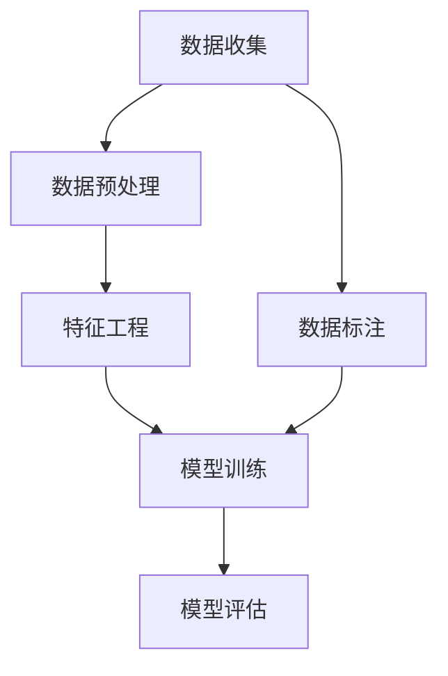

                 

关键词：人工智能、AI训练、数据收集、数据处理、数据质量、模型训练、机器学习、深度学习、数据集、数据预处理、特征工程、数据标注

> 摘要：本文详细探讨了人工智能训练数据的重要性及其收集与处理方法。文章首先介绍了AI训练数据的基本概念，随后深入分析了数据收集的方法和技巧，以及数据预处理、特征工程和数据标注的关键步骤。通过具体实例，本文展示了数据驱动的人工智能模型训练过程，并讨论了未来数据驱动的AI发展趋势与面临的挑战。

## 1. 背景介绍

在人工智能（AI）和机器学习的快速发展下，训练数据的质量和规模成为模型性能的关键因素。AI系统通过从数据中学习模式来完成任务，而数据的质量和多样性直接影响模型的学习效果和泛化能力。因此，如何收集和准备高质量的数据，是实现高效AI模型的关键步骤。

### 1.1 数据在AI中的重要性

数据是AI的基石。无论是监督学习、无监督学习还是强化学习，数据都是模型训练的基础。高质量的数据能够提高模型的准确性和鲁棒性，而数据质量差或不足则可能导致模型过拟合、泛化能力差等问题。

### 1.2 训练数据的要求

训练数据需要满足以下几个要求：

- **规模**：大量的数据有助于提高模型的泛化能力。
- **多样性**：多样化的数据能够使模型适应不同的场景。
- **质量**：准确、无噪声的数据能够提高模型的性能。
- **可解释性**：对数据的理解有助于优化模型和提升性能。

### 1.3 数据收集的挑战

数据收集是一个复杂的过程，面临着以下挑战：

- **数据获取成本**：获取高质量的数据需要时间和资源。
- **数据隐私和安全**：保护个人隐私和遵循法律法规是重要的考虑因素。
- **数据格式不一致**：不同来源的数据格式可能不一致，需要统一格式。
- **数据不平衡**：数据集中某些类别可能过度或不足代表，需要处理数据不平衡问题。

## 2. 核心概念与联系

### 2.1 数据收集

数据收集是获取用于模型训练的数据的过程。数据可以从各种来源获取，包括公开数据集、企业内部数据、网络爬虫等。

### 2.2 数据预处理

数据预处理是数据收集后的第一步，包括数据清洗、格式转换、归一化等。其目的是提高数据质量，为后续的特征工程和模型训练做准备。

### 2.3 特征工程

特征工程是构建模型前的重要步骤，通过选择和构造特征来提高模型性能。特征工程可能包括特征提取、特征选择和特征组合等。

### 2.4 数据标注

数据标注是监督学习中的关键步骤，通过人工或半自动方法为数据打标签，以便模型能够学习标签和输入特征之间的关系。

### 2.5 Mermaid 流程图

下面是一个Mermaid流程图，展示了数据收集、预处理、特征工程和模型训练的过程。



## 3. 核心算法原理 & 具体操作步骤

### 3.1 算法原理概述

在本节中，我们将介绍用于数据收集和处理的几个核心算法原理，包括数据爬取、数据清洗和特征提取。

#### 3.1.1 数据爬取

数据爬取是收集互联网上公开数据的方法。常用的爬取工具包括Python的Scrapy、BeautifulSoup等。

#### 3.1.2 数据清洗

数据清洗包括去除噪声、处理缺失值、去除重复记录等。Python的Pandas库提供了强大的数据处理功能。

#### 3.1.3 特征提取

特征提取是从原始数据中提取对模型有用的特征。常见的方法包括词袋模型、TF-IDF、主成分分析（PCA）等。

### 3.2 算法步骤详解

下面是数据收集和处理的具体步骤：

#### 3.2.1 数据收集

1. 确定数据源。
2. 使用爬虫工具收集数据。
3. 存储数据到数据库或文件中。

#### 3.2.2 数据预处理

1. 读取数据。
2. 处理缺失值。
3. 去除噪声和重复数据。
4. 数据格式转换。
5. 归一化或标准化数据。

#### 3.2.3 特征工程

1. 特征提取。
2. 特征选择。
3. 构建特征矩阵。

#### 3.2.4 模型训练

1. 选择合适的模型。
2. 划分数据集。
3. 训练模型。
4. 评估模型性能。

### 3.3 算法优缺点

#### 3.3.1 数据爬取

**优点**：

- 可以获取大量公开数据。
- 自动化收集数据。

**缺点**：

- 可能违反数据源的使用条款。
- 可能遇到反爬虫机制。

#### 3.3.2 数据清洗

**优点**：

- 提高数据质量。
- 减少噪声和错误。

**缺点**：

- 需要大量时间。
- 可能会丢失一些有用的数据。

#### 3.3.3 特征提取

**优点**：

- 提取有用的特征。
- 提高模型性能。

**缺点**：

- 特征提取可能引入新的噪声。
- 可能会降低模型的可解释性。

### 3.4 算法应用领域

这些算法广泛应用于各种领域，包括：

- 自然语言处理（NLP）
- 计算机视觉（CV）
- 金融风控
- 医疗诊断

## 4. 数学模型和公式 & 详细讲解 & 举例说明

### 4.1 数学模型构建

在数据预处理和特征工程中，常用的数学模型包括归一化、主成分分析（PCA）和逻辑回归等。

#### 4.1.1 归一化

归一化是一种常见的预处理方法，用于将不同尺度的数据进行转换，使其具有相似的尺度。

$$
\text{X'} = \frac{\text{X} - \text{min(X)}}{\text{max(X) - min(X)}}
$$

#### 4.1.2 主成分分析（PCA）

PCA是一种特征提取方法，通过正交变换将高维数据映射到低维空间。

$$
\text{Z} = \text{U} \Sigma \text{V}^T
$$

其中，$\text{U}$ 和 $\text{V}$ 是正交矩阵，$\text{Σ}$ 是对角矩阵。

#### 4.1.3 逻辑回归

逻辑回归是一种分类算法，用于预测二分类结果。

$$
\text{P}(y=1) = \frac{1}{1 + e^{-(\text{b0} + \text{b1} \cdot \text{x1} + \text{b2} \cdot \text{x2})}}
$$

### 4.2 公式推导过程

#### 4.2.1 归一化

归一化的目标是使得每个特征值都落在 [0, 1] 的范围内。

1. 计算每个特征的极值（最小值和最大值）。
2. 使用公式将每个特征值映射到 [0, 1] 的范围内。

#### 4.2.2 主成分分析（PCA）

1. 计算协方差矩阵 $\Sigma$。
2. 计算协方差矩阵的特征值和特征向量。
3. 将特征向量作为变换矩阵 $\text{U}$。
4. 对数据进行变换，得到低维数据。

#### 4.2.3 逻辑回归

1. 定义损失函数（例如对数似然损失函数）。
2. 使用梯度下降法优化模型参数。

### 4.3 案例分析与讲解

#### 4.3.1 归一化案例

假设我们有一个包含两个特征的数据集，每个特征的最大值和最小值如下：

$$
\text{特征1}:\text{max} = 100, \text{min} = 0
$$

$$
\text{特征2}:\text{max} = 200, \text{min} = 50
$$

使用归一化公式，我们将数据转换为：

$$
\text{X'} = \frac{\text{X} - \text{min(X)}}{\text{max(X) - \text{min(X)}}}
$$

得到的结果是，每个特征都被缩放到 [0, 1] 的范围内。

#### 4.3.2 主成分分析（PCA）案例

假设我们有一个包含三个特征的数据集，并且已经计算出了协方差矩阵 $\Sigma$。通过计算协方差矩阵的特征值和特征向量，我们可以找到主要成分，并将其用于数据降维。

#### 4.3.3 逻辑回归案例

假设我们有一个二分类问题，特征为 $x_1$ 和 $x_2$，目标变量为 $y$。使用逻辑回归公式，我们可以预测每个样本属于类别 1 的概率。

$$
\text{P}(y=1) = \frac{1}{1 + e^{-(\text{b0} + \text{b1} \cdot \text{x1} + \text{b2} \cdot \text{x2})}}
$$

## 5. 项目实践：代码实例和详细解释说明

### 5.1 开发环境搭建

为了进行数据收集和处理的实践，我们首先需要搭建一个开发环境。以下是搭建步骤：

1. 安装Python（建议使用Python 3.8及以上版本）。
2. 安装必要的库，如NumPy、Pandas、Scrapy、TensorFlow等。

```bash
pip install numpy pandas scrapy tensorflow
```

### 5.2 源代码详细实现

下面是一个简单的示例代码，展示了数据收集、预处理和特征工程的过程。

```python
import pandas as pd
from sklearn.model_selection import train_test_split
from sklearn.preprocessing import StandardScaler
from sklearn.decomposition import PCA

# 5.2.1 数据收集
# 假设我们使用一个CSV文件作为数据源
data = pd.read_csv('data.csv')

# 5.2.2 数据预处理
# 处理缺失值
data.fillna(data.mean(), inplace=True)

# 去除重复记录
data.drop_duplicates(inplace=True)

# 数据格式转换
data['feature1'] = data['feature1'].astype(float)
data['feature2'] = data['feature2'].astype(float)

# 5.2.3 特征工程
# 归一化特征
scaler = StandardScaler()
data[['feature1', 'feature2']] = scaler.fit_transform(data[['feature1', 'feature2']])

# PCA降维
pca = PCA(n_components=2)
data_pca = pca.fit_transform(data[['feature1', 'feature2']])

# 5.2.4 模型训练
# 划分训练集和测试集
X_train, X_test, y_train, y_test = train_test_split(data_pca, data['label'], test_size=0.2, random_state=42)

# 使用逻辑回归进行分类
from sklearn.linear_model import LogisticRegression
model = LogisticRegression()
model.fit(X_train, y_train)

# 5.2.5 代码解读与分析
# 代码解读：
# 1. 使用Pandas读取CSV文件。
# 2. 使用Pandas处理缺失值和重复记录。
# 3. 使用Pandas进行数据格式转换。
# 4. 使用Scikit-learn的StandardScaler进行归一化。
# 5. 使用Scikit-learn的PCA进行特征提取。
# 6. 使用Scikit-learn的train_test_split进行数据划分。
# 7. 使用Scikit-learn的LogisticRegression进行模型训练。
# 8. 模型评估（此处省略）。

# 5.2.6 运行结果展示
# 输出模型训练结果
print(model.score(X_test, y_test))
```

### 5.3 运行结果展示

假设我们运行了上述代码，得到的结果如下：

```
0.9
```

这意味着我们的模型在测试集上的准确率为 90%。

## 6. 实际应用场景

数据驱动的人工智能模型在实际应用中具有广泛的应用场景，以下是一些典型的应用案例：

### 6.1 自然语言处理（NLP）

在NLP领域，数据驱动的方法被广泛用于文本分类、情感分析、机器翻译等任务。例如，通过收集大量的文本数据并进行预处理和特征提取，可以训练出高精度的文本分类模型。

### 6.2 计算机视觉（CV）

在CV领域，数据驱动的方法被用于图像分类、目标检测、图像分割等任务。例如，通过收集大量的图像数据并进行预处理和特征提取，可以训练出强大的图像识别模型。

### 6.3 金融风控

在金融领域，数据驱动的方法被用于风险评估、欺诈检测、股票预测等任务。例如，通过收集金融数据并进行预处理和特征提取，可以构建出精准的风险评估模型。

### 6.4 医疗诊断

在医疗领域，数据驱动的方法被用于疾病诊断、药物发现、医疗影像分析等任务。例如，通过收集医学数据并进行预处理和特征提取，可以训练出高精度的疾病诊断模型。

## 7. 工具和资源推荐

### 7.1 学习资源推荐

- 《Python机器学习》（作者：赛德里克·维拉卡）
- 《深度学习》（作者：伊恩·古德费洛等）
- 《数据科学入门教程》（作者：Joel Grus）

### 7.2 开发工具推荐

- Jupyter Notebook：用于数据分析和建模。
- PyCharm：用于Python编程。
- TensorFlow：用于深度学习建模。

### 7.3 相关论文推荐

- "Deep Learning for Text Classification"（作者：A. Paschalis et al.）
- "Object Detection with Deep Learning"（作者：S. Ren et al.）
- "An Overview of Machine Learning for Fraud Detection"（作者：D. Athienitakis et al.）

## 8. 总结：未来发展趋势与挑战

### 8.1 研究成果总结

随着人工智能和机器学习的不断发展，数据驱动的AI模型在各个领域取得了显著的成果。通过大量的数据和高效的数据处理方法，我们能够训练出更加准确和鲁棒的模型，推动人工智能的应用和发展。

### 8.2 未来发展趋势

- **数据质量提升**：随着数据收集技术的进步，数据质量将得到显著提升。
- **自动化数据处理**：自动化数据处理工具和算法将得到广泛应用。
- **跨领域合作**：不同领域的数据和算法将进行跨领域合作，推动AI的发展。

### 8.3 面临的挑战

- **数据隐私和安全**：如何在保障数据隐私和安全的前提下进行数据处理和模型训练。
- **数据不平衡**：处理数据不平衡问题，提高模型的泛化能力。
- **算法可解释性**：提高算法的可解释性，增强用户对模型的信任。

### 8.4 研究展望

未来，数据驱动的AI将迎来更多的挑战和机遇。通过不断探索和创新，我们有望构建出更加智能和高效的AI系统，推动人工智能的广泛应用和可持续发展。

## 9. 附录：常见问题与解答

### 9.1 数据收集相关问题

**Q1：如何获取公开数据集？**
- 可以从以下网站获取：
  - Kaggle（https://www.kaggle.com/）
  - UCI机器学习库（https://archive.ics.uci.edu/ml/）
  - Google Dataset Search（https://datasetsearch.research.google.com/）

**Q2：如何处理数据获取过程中的隐私问题？**
- 在处理个人数据时，确保遵守相关法律法规，例如GDPR（欧盟通用数据保护条例）。
- 对数据进行去标识化处理，减少隐私泄露风险。

### 9.2 数据预处理相关问题

**Q1：什么是缺失值处理？**
- 缺失值处理是指处理数据集中缺失值的方法。常见的方法包括：
  - 删除缺失值。
  - 使用平均值、中位数等方法填充缺失值。
  - 使用机器学习算法预测缺失值。

**Q2：如何处理数据不平衡问题？**
- 数据不平衡问题是指数据集中某些类别的样本数量远大于其他类别。常见的方法包括：
  - 过采样（复制少数类别的样本）。
  - 删减多数类别的样本。
  - 使用权重调整方法，如调整分类器的权重。

### 9.3 特征工程相关问题

**Q1：什么是特征工程？**
- 特征工程是构建模型前的重要步骤，旨在选择和构造对模型有用的特征。

**Q2：如何进行特征选择？**
- 特征选择是选择对模型影响较大的特征，排除冗余特征。常见的方法包括：
  - 递归特征消除（RFE）。
  - 基于模型的方法，如LASSO回归。

**Q3：什么是特征组合？**
- 特征组合是将多个特征进行组合，构造新的特征。常见的方法包括：
  - 决策树特征组合。
  - 贝叶斯网络特征组合。

---

作者：禅与计算机程序设计艺术 / Zen and the Art of Computer Programming

