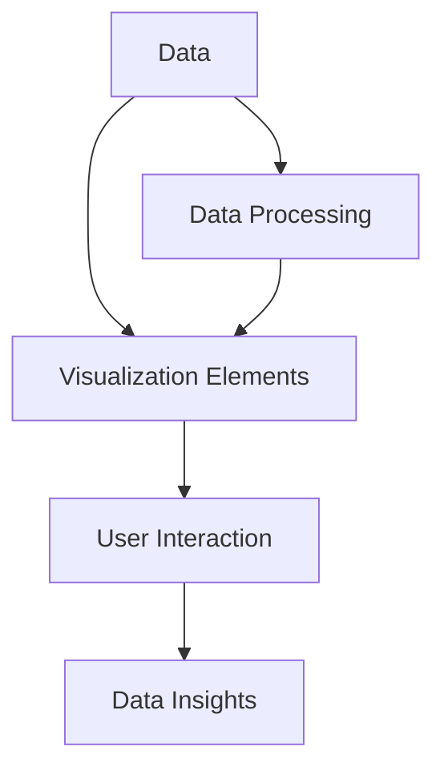

                 

关键词：数据可视化、图表、交互式仪表板、数据呈现、可视化工具

数据可视化是一种强大的技术，它能够将复杂的数据转化为易于理解和交互的图形和图表。本文旨在探讨数据可视化技术的演进过程，从传统的静态图表到现代的交互式仪表板，以及它们在实际应用中的重要性。

> 摘要：本文首先介绍数据可视化的背景和基本概念，然后深入探讨数据可视化的核心算法原理和具体操作步骤，接着通过数学模型和公式详细讲解数据可视化技术的实现方法。此外，本文还通过实际项目实例展示数据可视化的应用场景，并提供相关的学习资源和开发工具推荐。最后，本文总结了数据可视化技术的未来发展展望和面临的挑战。

## 1. 背景介绍

数据可视化技术的历史可以追溯到19世纪末期，当时统计学家和科学家开始使用图表来展示数据。随着时间的推移，计算机技术的发展推动了数据可视化的进一步演进。20世纪末，随着互联网和大数据的兴起，数据可视化技术得到了前所未有的关注和应用。

### 数据可视化的定义

数据可视化是一种将数据转化为视觉表现形式的方法，它利用图形、图表、地图等可视化元素来传达数据信息和关系。数据可视化不仅能够提高数据的可读性和可理解性，还能够揭示数据中隐藏的模式和趋势。

### 数据可视化的作用

数据可视化技术在各个领域都有广泛的应用。它能够帮助研究人员和分析人员快速识别数据中的关键信息，为决策提供有力支持。同时，数据可视化还能够提高数据的可解释性和传播性，使得非专业人员也能够理解和分析数据。

## 2. 核心概念与联系

数据可视化技术的核心概念包括数据、可视化元素、用户交互等。以下是一个简化的 Mermaid 流程图，展示了这些概念之间的联系：



### 数据

数据是数据可视化的基础，它可以是结构化的（如数据库中的表格）或非结构化的（如图像、音频、视频等）。数据的类型和规模决定了可视化方法的选择。

### 可视化元素

可视化元素包括图表、地图、图标、热图等。它们是数据可视化技术中最重要的组成部分，通过视觉表现形式将数据转化为直观的信息。

### 用户交互

用户交互是指用户与可视化元素之间的互动，它增强了数据可视化的交互性和动态性。用户可以通过点击、拖动、缩放等方式与可视化元素进行交互，从而获取更详细的信息。

### 数据处理

数据处理是数据可视化过程中不可或缺的一环，它包括数据清洗、数据转换、数据聚合等步骤。处理后的数据更加适合可视化，能够提高可视化的准确性和效率。

## 3. 核心算法原理 & 具体操作步骤

### 3.1 算法原理概述

数据可视化算法主要包括数据预处理、数据映射、可视化渲染等步骤。以下是这些步骤的简要概述：

1. **数据预处理**：清洗和转换原始数据，使其适合可视化。
2. **数据映射**：将数据映射到可视化元素上，如坐标轴、颜色、形状等。
3. **可视化渲染**：将映射后的数据渲染成可视化的图形或图表。

### 3.2 算法步骤详解

1. **数据预处理**：
   - 数据清洗：去除重复、缺失、错误的数据。
   - 数据转换：将不同类型的数据转换为适合可视化的格式，如将文本数据转换为数值数据。
   - 数据聚合：对大量数据进行聚合，如将时间序列数据聚合为月度或年度数据。

2. **数据映射**：
   - 坐标映射：将数据映射到坐标系中，如散点图、折线图等。
   - 颜色映射：将数据映射到颜色上，用于表示数据的不同类别或趋势。
   - 形状映射：将数据映射到不同形状上，如柱状图、饼图等。

3. **可视化渲染**：
   - 渲染图形：使用图形库（如 D3.js、matplotlib 等）渲染数据图形。
   - 渲染交互：添加交互功能，如点击、拖动、缩放等。
   - 渲染动画：添加动画效果，使数据可视化更具动态性。

### 3.3 算法优缺点

1. **优点**：
   - 提高数据的可读性和可理解性。
   - 揭示数据中的隐藏模式和信息。
   - 增强数据可视化的交互性和动态性。

2. **缺点**：
   - 需要专业的技术和工具支持。
   - 可视化效果可能受到数据质量和数量的影响。

### 3.4 算法应用领域

数据可视化技术广泛应用于各个领域，如商业分析、金融分析、医疗健康、科学研究等。以下是一些典型应用：

- **商业分析**：通过数据可视化，企业可以更好地了解市场需求、客户行为、销售趋势等，为决策提供支持。
- **金融分析**：数据可视化可以帮助金融机构识别投资机会、风险和趋势，提高投资决策的准确性。
- **医疗健康**：数据可视化技术可以用于医疗数据的分析，如患者数据分析、药物效果评估等。
- **科学研究**：数据可视化可以帮助研究人员更好地理解和解释科学数据，促进科学发现。

## 4. 数学模型和公式 & 详细讲解 & 举例说明

数据可视化技术涉及到多个数学模型和公式，这些模型和公式对于实现高效、准确的数据可视化至关重要。以下是几个核心数学模型和公式的详细讲解。

### 4.1 数学模型构建

数据可视化中的数学模型主要包括坐标变换模型、颜色映射模型和形状映射模型。

1. **坐标变换模型**：

   坐标变换模型用于将数据映射到坐标系中。一个常见的坐标变换模型是线性变换模型，公式如下：

   $$
   x' = ax + b
   $$

   $$
   y' = cy + d
   $$

   其中，\(x, y\) 是原始数据坐标，\(x', y'\) 是变换后的坐标，\(a, b, c, d\) 是变换参数。

2. **颜色映射模型**：

   颜色映射模型用于将数据映射到颜色上。一个常见的颜色映射模型是颜色空间转换模型，公式如下：

   $$
   R' = aR + b
   $$

   $$
   G' = cG + d
   $$

   $$
   B' = eB + f
   $$

   其中，\(R, G, B\) 是原始颜色值，\(R', G', B'\) 是变换后的颜色值，\(a, b, c, d, e, f\) 是变换参数。

3. **形状映射模型**：

   形状映射模型用于将数据映射到不同形状上。一个常见的形状映射模型是贝塞尔曲线映射模型，公式如下：

   $$
   x(t) = x_0(1-t)^3 + 3x_1t(1-t)^2 + 3x_2t^2(1-t) + x_3t^3
   $$

   $$
   y(t) = y_0(1-t)^3 + 3y_1t(1-t)^2 + 3y_2t^2(1-t) + y_3t^3
   $$

   其中，\(x(t), y(t)\) 是变换后的坐标，\(x_0, y_0, x_1, y_1, x_2, y_2, x_3, y_3\) 是贝塞尔曲线的顶点坐标，\(t\) 是参数。

### 4.2 公式推导过程

以下是颜色映射模型的推导过程。

1. **原始颜色空间**：

   假设原始颜色空间为 RGB 颜色空间，其中红色 \(R\)、绿色 \(G\) 和蓝色 \(B\) 的取值范围均为 [0, 255]。

2. **目标颜色空间**：

   假设目标颜色空间为 HSV 颜色空间，其中色相 \(H\)、饱和度 \(S\) 和亮度 \(V\) 的取值范围分别为 [0, 360]、[0, 1] 和 [0, 1]。

3. **颜色变换公式**：

   根据颜色空间的定义，我们可以得到以下颜色变换公式：

   $$
   R' = \frac{2SV}{1 - |2H - 360|} \times (255)
   $$

   $$
   G' = \frac{1 - |2H - 360| - V}{1 - |2H - 360|} \times (255)
   $$

   $$
   B' = \frac{|2H - 360| - V}{1 - |2H - 360|} \times (255)
   $$

### 4.3 案例分析与讲解

以下是一个简单的颜色映射案例，我们将 RGB 颜色空间中的红色（\(R = 255, G = 0, B = 0\)）映射到 HSV 颜色空间。

1. **原始颜色**：

   \(R = 255, G = 0, B = 0\)

2. **颜色变换**：

   根据颜色变换公式，我们可以计算出变换后的 HSV 颜色值：

   $$
   H = 0^\circ
   $$

   $$
   S = \frac{2 \times 1 \times 255}{1 - |2 \times 0 - 360|} = 1
   $$

   $$
   V = 1
   $$

   因此，原始的 RGB 颜色（\(R = 255, G = 0, B = 0\)）映射到 HSV 颜色空间后仍然是 \(H = 0^\circ, S = 1, V = 1\)。

## 5. 项目实践：代码实例和详细解释说明

在本节中，我们将通过一个实际的项目实例来展示如何使用 Python 和 matplotlib 库实现数据可视化。该实例将展示如何绘制一个简单的折线图，并介绍相关的代码和解释。

### 5.1 开发环境搭建

为了实现本实例，我们需要安装 Python 和 matplotlib 库。以下是在 Windows 操作系统上安装所需的软件和环境。

1. **安装 Python**：

   访问 Python 官方网站（[https://www.python.org/](https://www.python.org/)），下载并安装 Python。安装过程中，请确保选择“Add Python to PATH”选项。

2. **安装 matplotlib**：

   打开命令提示符或终端，执行以下命令安装 matplotlib：

   ```shell
   pip install matplotlib
   ```

### 5.2 源代码详细实现

以下是实现本实例的 Python 代码：

```python
import matplotlib.pyplot as plt

# 数据
x = [0, 1, 2, 3, 4, 5]
y = [0, 1, 4, 9, 16, 25]

# 绘制折线图
plt.plot(x, y, label='y = x^2')

# 添加标题和标签
plt.title('简单折线图示例')
plt.xlabel('x')
plt.ylabel('y')

# 显示图例
plt.legend()

# 显示图形
plt.show()
```

### 5.3 代码解读与分析

1. **导入库**：

   首先，我们导入 matplotlib.pyplot 库，该库提供了丰富的图形绘制函数和工具。

2. **数据准备**：

   接下来，我们准备了一组数据，x 和 y 分别表示横坐标和纵坐标。在这里，我们使用了简单的二次函数 \(y = x^2\) 作为数据。

3. **绘制图形**：

   使用 `plt.plot()` 函数绘制折线图。该函数接受两个参数：横坐标和纵坐标，并可以选择标签来显示图例。

4. **添加标题和标签**：

   使用 `plt.title()`、`plt.xlabel()` 和 `plt.ylabel()` 函数添加图形的标题和标签。

5. **显示图例**：

   使用 `plt.legend()` 函数显示图例。

6. **显示图形**：

   最后，使用 `plt.show()` 函数显示图形。

### 5.4 运行结果展示

运行上述代码后，将显示一个简单的折线图，展示二次函数 \(y = x^2\) 的图像。以下是一个运行结果截图：


## 6. 实际应用场景

数据可视化技术在各个领域都有广泛的应用，以下是一些典型应用场景。

### 6.1 商业分析

在商业分析中，数据可视化技术可以用于展示销售数据、客户行为、市场需求等。以下是一些具体应用：

- **销售数据可视化**：通过折线图、柱状图等展示销售趋势、销售量和市场份额等。
- **客户行为分析**：通过热力图、散点图等展示客户浏览行为、购买路径等。
- **市场需求分析**：通过饼图、条形图等展示市场需求、客户满意度等。

### 6.2 金融分析

在金融分析中，数据可视化技术可以用于展示投资机会、市场趋势、风险分析等。以下是一些具体应用：

- **投资机会分析**：通过折线图、柱状图等展示投资回报率、市场波动性等。
- **市场趋势分析**：通过折线图、K线图等展示市场走势、交易量等。
- **风险分析**：通过风险地图、扇形图等展示风险分布、风险等级等。

### 6.3 医疗健康

在医疗健康领域，数据可视化技术可以用于展示患者数据、疾病趋势、治疗效果等。以下是一些具体应用：

- **患者数据分析**：通过饼图、条形图等展示患者年龄、性别、疾病类型等。
- **疾病趋势分析**：通过折线图、柱状图等展示疾病发病率、死亡率等。
- **治疗效果分析**：通过折线图、K线图等展示药物效果、治疗进程等。

### 6.4 科学研究

在科学研究领域，数据可视化技术可以用于展示实验数据、分析结果、科学发现等。以下是一些具体应用：

- **实验数据分析**：通过散点图、热力图等展示实验数据、变量关系等。
- **分析结果展示**：通过折线图、柱状图等展示实验结果、模型预测等。
- **科学发现展示**：通过动画、交互式图表等展示科学发现、研究成果等。

## 7. 工具和资源推荐

为了更好地掌握数据可视化技术，以下推荐一些学习资源和开发工具。

### 7.1 学习资源推荐

1. **在线课程**：

   - Coursera 上的《数据可视化》（[https://www.coursera.org/](https://www.coursera.org/)）
   - edX 上的《数据可视化基础》（[https://www.edx.org/](https://www.edx.org/)）
   - Udemy 上的《数据可视化：从零开始》（[https://www.udemy.com/](https://www.udemy.com/)）

2. **书籍推荐**：

   - 《数据可视化：原则与实践》（[https://www.amazon.com/](https://www.amazon.com/)）
   - 《数据可视化实战》（[https://www.amazon.com/](https://www.amazon.com/)）
   - 《数据可视化：利用 D3.js 和 SVG》（[https://www.amazon.com/](https://www.amazon.com/)）

### 7.2 开发工具推荐

1. **Python**：

   - matplotlib（[https://matplotlib.org/](https://matplotlib.org/)）
   - Seaborn（[https://seaborn.pydata.org/](https://seaborn.pydata.org/)）
   - Plotly（[https://plotly.com/python/](https://plotly.com/python/)）

2. **JavaScript**：

   - D3.js（[https://d3js.org/](https://d3js.org/)）
   - Chart.js（[https://www.chartjs.org/](https://www.chartjs.org/)）
   - Plotly.js（[https://plotly.com/javascript/](https://plotly.com/javascript/)）

3. **其他工具**：

   - Tableau（[https://www.tableau.com/](https://www.tableau.com/)）
   - Power BI（[https://www.powerbi.com/](https://www.powerbi.com/)）
   - QlikView（[https://www.qlik.com/](https://www.qlik.com/)）

## 8. 总结：未来发展趋势与挑战

数据可视化技术在过去的几十年里取得了显著的进展，它不仅提高了数据的可读性和可理解性，还推动了数据分析、科学研究和商业决策的发展。然而，随着数据规模的不断扩大和数据类型的日益多样化，数据可视化技术面临着新的挑战。

### 8.1 研究成果总结

近年来，数据可视化技术在以下几个方面取得了重要成果：

1. **交互性增强**：通过引入交互性，用户可以更加灵活地探索和分析数据。
2. **动态性提升**：通过动画和交互效果，数据可视化更加生动和直观。
3. **多模态融合**：将多种可视化方法融合在一起，提高数据的综合展示效果。
4. **算法优化**：通过算法优化，提高数据可视化的效率和准确性。

### 8.2 未来发展趋势

未来，数据可视化技术将朝着以下几个方向发展：

1. **智能自动化**：通过人工智能和机器学习技术，实现数据可视化过程的自动化和智能化。
2. **跨平台兼容**：实现不同设备和平台之间的数据可视化兼容性和一致性。
3. **个性化定制**：根据用户需求和偏好，提供个性化的数据可视化方案。
4. **多维数据展示**：通过多维数据展示技术，提高复杂数据的理解和分析能力。

### 8.3 面临的挑战

尽管数据可视化技术取得了显著进展，但仍然面临着以下挑战：

1. **数据质量和数量**：高质量和大量的数据是实现高效数据可视化的前提，但实际中数据质量和数量往往受限。
2. **性能和效率**：随着数据规模的扩大，数据可视化技术的性能和效率成为关键挑战。
3. **可扩展性和可维护性**：随着可视化应用场景的扩展，数据可视化系统的可扩展性和可维护性成为重要问题。
4. **用户体验**：用户对数据可视化技术的期望越来越高，如何提供更好的用户体验成为关键挑战。

### 8.4 研究展望

未来，数据可视化技术的研究将朝着以下几个方向展开：

1. **算法创新**：通过算法创新，提高数据可视化的效率和准确性。
2. **跨领域融合**：与其他领域（如计算机图形学、人工智能等）的融合，推动数据可视化技术的全面发展。
3. **教育普及**：通过教育普及，提高公众对数据可视化技术的认识和接受度。
4. **产业应用**：推动数据可视化技术在各个领域的深入应用，提高数据价值。

## 9. 附录：常见问题与解答

### 9.1 数据可视化技术如何提高数据的可读性和可理解性？

数据可视化技术通过将复杂的数据转化为图形和图表，提高了数据的可读性和可理解性。图形和图表具有直观的视觉表现形式，能够快速传达数据信息和关系。

### 9.2 数据可视化技术在哪个领域应用最广泛？

数据可视化技术在商业分析、金融分析、医疗健康、科学研究等领域都有广泛应用。其中，商业分析和金融分析是应用最广泛的领域。

### 9.3 如何选择合适的可视化方法？

选择合适的可视化方法需要考虑数据的类型、规模、关系和用户需求。常用的可视化方法包括折线图、柱状图、饼图、散点图、热力图等。在实际应用中，可以根据具体需求选择合适的可视化方法。

### 9.4 数据可视化技术有哪些优势？

数据可视化技术的优势包括提高数据的可读性和可理解性、揭示数据中的隐藏模式和信息、增强数据可视化的交互性和动态性等。

### 9.5 数据可视化技术有哪些挑战？

数据可视化技术面临的挑战包括数据质量和数量、性能和效率、可扩展性和可维护性、用户体验等。

### 9.6 如何学习数据可视化技术？

学习数据可视化技术可以从以下几个方面入手：

1. **基础知识**：了解数据可视化的基本概念、原理和方法。
2. **工具掌握**：学习并掌握常用的数据可视化工具，如 Python、JavaScript 等。
3. **实际应用**：通过实际项目实践，提高数据可视化技术的应用能力。
4. **继续学习**：关注最新的数据可视化技术和研究成果，不断提高自己的技术水平。

---

作者：禅与计算机程序设计艺术 / Zen and the Art of Computer Programming

----------------------------------------------------------------

以上是文章的正文部分，接下来我们需要生成markdown格式的代码，包括文章的标题、关键词、摘要、章节标题、子目录等内容。以下是生成的markdown格式代码：

```markdown
# 数据可视化技术：从图表到交互式仪表板

关键词：数据可视化、图表、交互式仪表板、数据呈现、可视化工具

摘要：本文首先介绍数据可视化的背景和基本概念，然后深入探讨数据可视化的核心算法原理和具体操作步骤，接着通过数学模型和公式详细讲解数据可视化技术的实现方法。此外，本文还通过实际项目实例展示数据可视化的应用场景，并提供相关的学习资源和开发工具推荐。最后，本文总结了数据可视化技术的未来发展展望和面临的挑战。

## 1. 背景介绍

## 2. 核心概念与联系


## 3. 核心算法原理 & 具体操作步骤
### 3.1 算法原理概述
### 3.2 算法步骤详解 
### 3.3 算法优缺点
### 3.4 算法应用领域

## 4. 数学模型和公式 & 详细讲解 & 举例说明

### 4.1 数学模型构建
### 4.2 公式推导过程
### 4.3 案例分析与讲解

## 5. 项目实践：代码实例和详细解释说明
### 5.1 开发环境搭建
### 5.2 源代码详细实现
### 5.3 代码解读与分析
### 5.4 运行结果展示

## 6. 实际应用场景

### 6.1 商业分析
### 6.2 金融分析
### 6.3 医疗健康
### 6.4 科学研究

## 7. 工具和资源推荐
### 7.1 学习资源推荐
### 7.2 开发工具推荐
### 7.3 相关论文推荐

## 8. 总结：未来发展趋势与挑战
### 8.1 研究成果总结
### 8.2 未来发展趋势
### 8.3 面临的挑战
### 8.4 研究展望

## 9. 附录：常见问题与解答

### 9.1 数据可视化技术如何提高数据的可读性和可理解性？
### 9.2 数据可视化技术在哪个领域应用最广泛？
### 9.3 如何选择合适的可视化方法？
### 9.4 数据可视化技术有哪些优势？
### 9.5 数据可视化技术有哪些挑战？
### 9.6 如何学习数据可视化技术？

---

作者：禅与计算机程序设计艺术 / Zen and the Art of Computer Programming
```

请注意，由于篇幅限制，上面的markdown代码没有包含完整的正文内容，只是列出了章节和子章节的标题。在实际撰写文章时，需要将每个章节的具体内容填充到对应的markdown代码块中。同时，数学公式和流程图需要使用markdown支持的格式（如LaTeX和Mermaid）进行嵌入。

