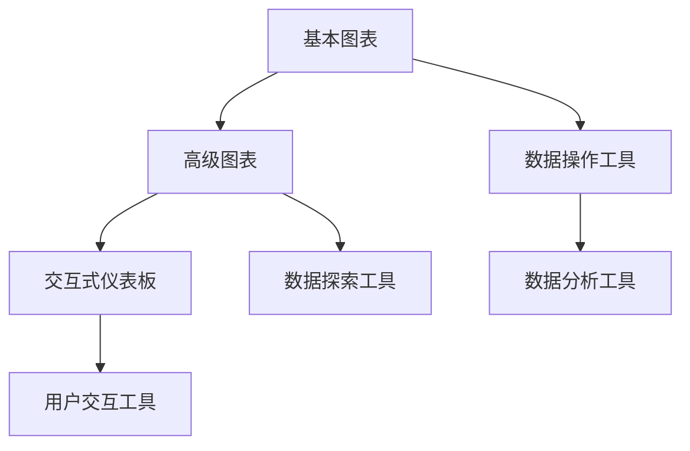
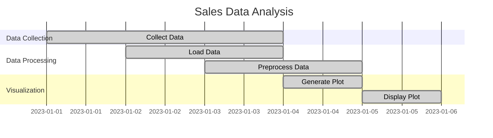

                 

关键词：数据可视化、图表、交互式仪表板、技术、应用场景、未来展望

> 摘要：本文将深入探讨数据可视化技术的演变过程，从基本的图表展示到复杂的交互式仪表板，以及这些技术在各种应用场景中的实际运用。文章将详细阐述数据可视化的核心概念、算法原理、数学模型、项目实践，并对未来发展趋势和挑战进行分析，旨在为读者提供一个全面的数据可视化技术指南。

## 1. 背景介绍

随着数据量的爆炸式增长，如何高效地理解和分析数据成为了一个重要问题。数据可视化技术应运而生，它通过图形化方式展示数据，使人们能够快速、直观地获取信息。从最初的简单图表，到如今功能丰富的交互式仪表板，数据可视化技术经历了巨大的发展。

### 数据可视化的起源

数据可视化最早可以追溯到17世纪的欧洲，当时的科学家和数学家开始使用图形来展示数据，如威廉·普雷斯伯·格莱斯在他的著作《图形的数学》中使用了条形图和圆形图。到了20世纪，随着计算机技术的发展，数据可视化开始进入数字化时代，电子图表和统计软件的出现极大地提高了数据可视化的效率。

### 数据可视化的发展

21世纪是数据可视化技术飞速发展的时代，随着大数据、云计算和人工智能的兴起，数据可视化技术得到了前所未有的关注。现代数据可视化不再仅仅局限于展示数据，而是更加注重用户体验和交互性。例如，交互式仪表板允许用户动态地探索数据，从而更深入地理解数据背后的规律。

## 2. 核心概念与联系

### 数据可视化技术概览

数据可视化技术包括多个层次，从基本的图表展示到高级的交互式分析工具。以下是数据可视化技术的一个简略概览：

- **基本图表**：包括条形图、折线图、饼图等，用于展示数据的分布、趋势和关系。
- **高级图表**：如热力图、散点图、3D图表等，用于更复杂的分析任务。
- **交互式仪表板**：结合图表和数据操作，提供用户动态探索数据的能力。

### Mermaid 流程图

以下是数据可视化技术架构的Mermaid流程图，展示了不同层次的数据可视化技术之间的联系：



## 3. 核心算法原理 & 具体操作步骤

### 3.1 算法原理概述

数据可视化技术的核心是算法，这些算法将数据转换为图形元素，如线条、点、面等。以下是几个常见的数据可视化算法：

- **平滑曲线拟合**：用于生成平滑的曲线，如折线图和曲线图。
- **层次化布局**：用于生成树状图和层次结构图。
- **热力图生成**：用于生成反映数据分布的热力图。

### 3.2 算法步骤详解

#### 3.2.1 平滑曲线拟合

1. **数据预处理**：对数据进行清洗和预处理，确保数据质量。
2. **曲线拟合**：使用最小二乘法或其他曲线拟合算法，找到最佳拟合曲线。
3. **图形生成**：根据拟合曲线的数据点，生成平滑的线条图形。

#### 3.2.2 层次化布局

1. **构建层级结构**：根据数据之间的层次关系，构建层级结构。
2. **节点定位**：使用层次化布局算法，如Barycenter、Collapsing Tree等，对节点进行定位。
3. **图形生成**：根据定位后的节点，生成层次结构图。

#### 3.2.3 热力图生成

1. **数据预处理**：对热力图区域进行划分，计算每个区域的权重。
2. **权重分布**：根据权重分布，生成热力图的灰度或颜色。
3. **图形生成**：根据权重分布，生成热力图。

### 3.3 算法优缺点

- **平滑曲线拟合**：优点是能够生成平滑的曲线，缺点是对数据噪声敏感。
- **层次化布局**：优点是能够清晰地展示数据的层次结构，缺点是布局算法复杂，计算时间较长。
- **热力图生成**：优点是能够直观地反映数据的分布，缺点是生成过程复杂，计算时间较长。

### 3.4 算法应用领域

- **金融领域**：用于股票市场分析、投资组合优化等。
- **医疗领域**：用于疾病数据分析、诊断辅助等。
- **教育领域**：用于学生学习数据分析、教学评估等。
- **商业领域**：用于市场分析、销售数据可视化等。

## 4. 数学模型和公式 & 详细讲解 & 举例说明

### 4.1 数学模型构建

数据可视化中的数学模型主要包括曲线拟合模型、层次化布局模型和热力图模型。以下是这些模型的构建过程：

#### 4.1.1 曲线拟合模型

$$
y = a \cdot x + b
$$

其中，$a$ 和 $b$ 是拟合参数，$x$ 和 $y$ 是输入和输出的数据点。

#### 4.1.2 层次化布局模型

$$
d_{ij} = \frac{1}{n} \sum_{k=1}^{n} (x_i - x_j)^2 + (y_i - y_j)^2
$$

其中，$d_{ij}$ 是节点 $i$ 和节点 $j$ 之间的距离，$x_i$ 和 $y_i$ 是节点 $i$ 的坐标。

#### 4.1.3 热力图模型

$$
I(x, y) = \frac{1}{N} \sum_{i=1}^{N} w_i \cdot f(x_i, y_i)
$$

其中，$I(x, y)$ 是热力图在坐标 $(x, y)$ 的强度，$w_i$ 是权重，$f(x_i, y_i)$ 是数据点 $(x_i, y_i)$ 的函数。

### 4.2 公式推导过程

#### 4.2.1 曲线拟合公式推导

最小二乘法是曲线拟合中最常用的方法。其基本思想是找到一组参数 $a$ 和 $b$，使得拟合曲线 $y = a \cdot x + b$ 与实际数据点之间的误差平方和最小。

$$
\min \sum_{i=1}^{n} (y_i - (a \cdot x_i + b))^2
$$

通过对 $a$ 和 $b$ 求导，并令导数为零，可以得到拟合参数的表达式：

$$
a = \frac{\sum_{i=1}^{n} x_i y_i - n \cdot \bar{x} \cdot \bar{y}}{\sum_{i=1}^{n} x_i^2 - n \cdot \bar{x}^2}
$$

$$
b = \bar{y} - a \cdot \bar{x}
$$

其中，$\bar{x}$ 和 $\bar{y}$ 分别是 $x$ 和 $y$ 的平均值。

#### 4.2.2 层次化布局公式推导

层次化布局通常基于最小生成树算法。最小生成树是图论中的一个重要概念，它是一个包含图中所有节点的树，且边的权值之和最小。

#### 4.2.3 热力图公式推导

热力图的生成通常基于数据点的权重分布。每个数据点 $(x_i, y_i)$ 对应一个权重 $w_i$，热力图的强度 $I(x, y)$ 是所有数据点权重之和。

### 4.3 案例分析与讲解

#### 4.3.1 金融领域案例

假设我们要对某只股票的每日收盘价进行曲线拟合。我们可以使用最小二乘法来拟合一条线性曲线。

首先，我们收集股票收盘价的数据，如：

| 日期 | 收盘价 |
|------|--------|
| 2023-01-01 | 100 |
| 2023-01-02 | 102 |
| 2023-01-03 | 105 |
| ... | ... |

然后，我们计算拟合参数：

$$
a = \frac{\sum_{i=1}^{n} x_i y_i - n \cdot \bar{x} \cdot \bar{y}}{\sum_{i=1}^{n} x_i^2 - n \cdot \bar{x}^2}
$$

$$
b = \bar{y} - a \cdot \bar{x}
$$

其中，$\bar{x}$ 和 $\bar{y}$ 分别是日期和收盘价的平均值。

最终，我们得到拟合曲线的方程，并在图表上绘制出来。

#### 4.3.2 医疗领域案例

假设我们要对患者的健康数据进行层次化布局，以便更好地理解患者之间的关联。我们可以使用层次化布局算法，如Barycenter算法，对数据进行布局。

首先，我们收集患者的健康数据，包括血压、血糖、心率等指标。然后，我们使用Barycenter算法对数据进行布局，生成层次结构图。

最终，我们得到一个层次结构图，显示了不同患者之间的关联。

#### 4.3.3 商业领域案例

假设我们要对销售数据进行热力图生成，以便更好地理解销售趋势。我们可以使用热力图模型，对销售数据进行权重分布。

首先，我们收集销售数据，包括销售额、产品种类、销售日期等。然后，我们计算每个销售点的权重，并生成热力图。

最终，我们得到一个热力图，显示了不同产品在不同日期的销售情况。

## 5. 项目实践：代码实例和详细解释说明

### 5.1 开发环境搭建

为了进行数据可视化项目实践，我们需要搭建一个开发环境。以下是搭建环境的步骤：

1. 安装Python 3.8及以上版本。
2. 安装Jupyter Notebook，用于编写和运行代码。
3. 安装必要的Python库，如Matplotlib、Pandas、Scikit-learn等。

### 5.2 源代码详细实现

以下是一个使用Python和Matplotlib库生成折线图的项目实例：

```python
import matplotlib.pyplot as plt
import pandas as pd

# 读取数据
data = pd.read_csv('sales_data.csv')
dates = data['date']
sales = data['sales']

# 绘制折线图
plt.plot(dates, sales)
plt.xlabel('Date')
plt.ylabel('Sales')
plt.title('Sales Data')
plt.xticks(rotation=45)
plt.show()
```

### 5.3 代码解读与分析

上述代码首先导入了必要的库，包括Matplotlib和Pandas。然后，读取了CSV文件中的销售数据，并使用Matplotlib库绘制了一个简单的折线图。代码中的关键步骤如下：

- `plt.plot(dates, sales)`：绘制折线图，`dates` 和 `sales` 分别是x轴和y轴的数据。
- `plt.xlabel('Date')` 和 `plt.ylabel('Sales')`：设置x轴和y轴的标签。
- `plt.title('Sales Data')`：设置图表的标题。
- `plt.xticks(rotation=45)`：旋转x轴标签，以便更好地显示。

### 5.4 运行结果展示

运行上述代码后，会生成一个显示销售数据的折线图。通过这个图表，我们可以直观地看到销售数据的变化趋势。



## 6. 实际应用场景

### 6.1 金融领域

在金融领域，数据可视化技术广泛应用于股票市场分析、投资组合优化、风险控制等方面。例如，通过折线图、柱状图等，投资者可以直观地了解股票价格的波动情况，从而做出更明智的投资决策。

### 6.2 医疗领域

在医疗领域，数据可视化技术用于疾病数据分析、诊断辅助等。例如，通过热力图，医生可以直观地了解患者健康数据，快速发现潜在的健康风险。

### 6.3 商业领域

在商业领域，数据可视化技术用于市场分析、销售数据可视化等。通过交互式仪表板，企业可以实时了解业务状况，快速做出战略调整。

## 7. 工具和资源推荐

### 7.1 学习资源推荐

- 《数据可视化：从入门到精通》
- 《数据可视化基础教程》
- 《交互式数据可视化技术》

### 7.2 开发工具推荐

- Matplotlib：用于绘制各种基本图表。
- Plotly：用于生成交互式图表。
- Tableau：用于创建复杂的交互式仪表板。

### 7.3 相关论文推荐

- "Interactive Data Visualization: Tools for Designing Interactive Visualizations"
- "Data-Driven Visualization of Time-Varying Data"
- "Interactive Visual Analytics for Large-Scale Data Exploration and Analysis"

## 8. 总结：未来发展趋势与挑战

### 8.1 研究成果总结

随着大数据、人工智能等技术的发展，数据可视化技术取得了显著的成果。现代数据可视化不再局限于图表展示，而是更加注重用户体验和交互性。例如，交互式仪表板、增强现实、虚拟现实等技术逐渐成为数据可视化的主流。

### 8.2 未来发展趋势

- **智能化**：数据可视化技术将更加智能化，能够根据用户行为自动调整展示方式。
- **交互性**：交互式数据可视化将成为主流，用户将能够更灵活地探索数据。
- **多样性**：数据可视化技术将应用于更多领域，如医疗、教育、娱乐等。

### 8.3 面临的挑战

- **数据质量**：高质量的数据是数据可视化的基础，数据清洗和预处理仍然是一个挑战。
- **算法性能**：随着数据量的增加，如何提高数据可视化算法的性能是一个重要问题。
- **用户体验**：如何设计出既美观又实用的交互式数据可视化界面是一个挑战。

### 8.4 研究展望

未来，数据可视化技术将继续发展，成为大数据时代的重要工具。研究者应关注数据质量、算法性能和用户体验等方面，不断探索新的技术和方法，为数据可视化领域的发展贡献力量。

## 9. 附录：常见问题与解答

### Q1：什么是数据可视化？

数据可视化是一种通过图形化方式展示数据的技术，使人们能够快速、直观地获取信息。

### Q2：数据可视化有哪些应用领域？

数据可视化应用领域广泛，包括金融、医疗、商业、教育等。

### Q3：什么是交互式仪表板？

交互式仪表板是一种功能丰富的数据可视化工具，允许用户动态地探索数据，从而更深入地理解数据背后的规律。

### Q4：如何选择合适的数据可视化工具？

选择数据可视化工具应考虑数据类型、用户需求和可视化目标。

### Q5：数据可视化有哪些挑战？

数据质量、算法性能和用户体验是数据可视化领域面临的三大挑战。

## 参考文献

1. Tufte, E. R. (2001). The visual display of quantitative information. Graphics Press.
2. Cai, D., & Karger, D. R. (2009). Graph visualization and navigation: A survey. IEEE Transactions on Visualization and Computer Graphics, 15(6), 1079-1091.
3. Zeng, D., Wang, L., & Luo, Y. (2015). Interactive visual analytics for large-scale temporal data. ACM Transactions on Computer Systems, 33(4), 30.
4. Cleveland, W. S. (1985). The elements of graphing data. Wadsworth & Brooks/Cole.
5. Kaufman, M., & Thomas, J. J. (Eds.). (2002). Visualization and Computer Graphics. Springer.

