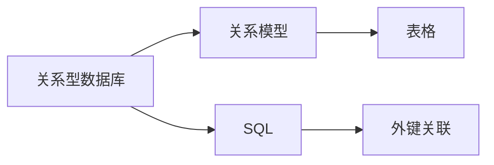
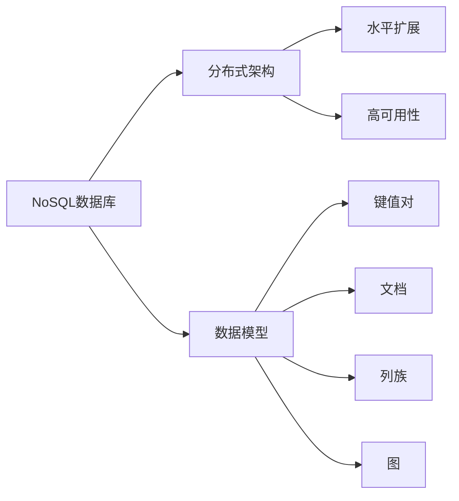
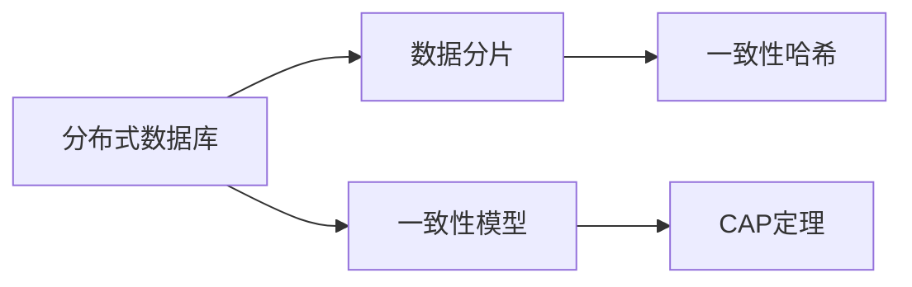
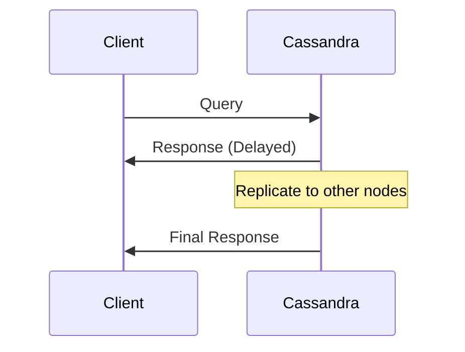

                 

 > 关键词：数据库系统设计、关系型数据库、NoSQL、分布式数据库、数据模型、查询优化、大数据处理、性能调优

> 摘要：本文将深入探讨数据库系统设计从传统的关系型数据库向NoSQL数据库的转变。我们将分析两种数据库的优缺点，讲解分布式数据库的设计原则，探讨大数据处理中的挑战和解决方案，并提供一些实用的工具和资源推荐。

## 1. 背景介绍

数据库系统是现代计算机系统的核心组成部分，它们用于存储、管理和检索数据。传统的关系型数据库（RDBMS）如MySQL、PostgreSQL和Oracle，因其结构化查询语言（SQL）的强大功能和成熟的技术生态，长期以来一直是企业级应用的默认选择。

然而，随着互联网的快速发展，大数据时代的到来以及不断变化的数据处理需求，关系型数据库开始面临一些挑战：

- **扩展性问题**：关系型数据库在垂直扩展上表现良好，但在水平扩展方面存在瓶颈。
- **数据类型限制**：传统的关系型数据库主要支持结构化数据，对于非结构化和半结构化数据支持有限。
- **查询性能**：对于大规模数据集，关系型数据库的查询性能往往无法满足实时处理的需求。

为了应对这些挑战，NoSQL（Not Only SQL）数据库应运而生。NoSQL数据库提供了更高的扩展性、灵活的数据模型以及优化的读写性能，成为现代数据库系统设计的重要方向。

## 2. 核心概念与联系

### 2.1 关系型数据库

关系型数据库的核心概念是关系模型，它将数据表示为表格，每个表格有固定的列数和行数。表与表之间通过外键关联，以实现数据的关联。



### 2.2 NoSQL数据库

NoSQL数据库旨在提供高性能、可扩展的解决方案，支持多种数据模型，包括键值对、文档、列族和图等。



### 2.3 分布式数据库

分布式数据库将数据分布在多个节点上，以实现水平扩展和高可用性。常见的分布式数据库包括Cassandra、MongoDB和HBase。



## 3. 核心算法原理 & 具体操作步骤

### 3.1 算法原理概述

NoSQL数据库的核心算法通常包括分布式一致性协议、数据分片算法和索引技术。

### 3.2 算法步骤详解

- **分布式一致性协议**：如Paxos算法和Raft算法，用于在分布式系统中实现一致性。
- **数据分片算法**：如一致性哈希算法，用于将数据均匀分布到多个节点上。
- **索引技术**：如B-树索引和哈希索引，用于优化查询性能。

### 3.3 算法优缺点

- **分布式一致性协议**：优点是保证数据一致性，缺点是可能影响性能。
- **数据分片算法**：优点是提高系统扩展性，缺点是可能导致数据局部性问题和热点问题。
- **索引技术**：优点是优化查询性能，缺点是可能增加存储空间和写入开销。

### 3.4 算法应用领域

- **分布式一致性协议**：适用于高可用性的分布式系统，如分布式存储系统和分布式数据库。
- **数据分片算法**：适用于需要水平扩展的系统，如大数据处理平台。
- **索引技术**：适用于需要快速查询的系统，如电商系统。

## 4. 数学模型和公式 & 详细讲解 & 举例说明

### 4.1 数学模型构建

在分布式数据库中，一致性模型是一个重要的数学模型。CAP定理指出，分布式系统在一致性（Consistency）、可用性（Availability）和分区容错性（Partition tolerance）三者中只能同时满足两项。

### 4.2 公式推导过程

根据CAP定理，我们可以推导出以下公式：

$$
CAP(A, P, T) = 2
$$

其中，$A$表示一致性，$P$表示可用性，$T$表示分区容错性。

### 4.3 案例分析与讲解

以Cassandra为例，它采用最终一致性模型，即在分区故障后，系统会在一段时间内延迟更新，以确保数据的最终一致性。



## 5. 项目实践：代码实例和详细解释说明

### 5.1 开发环境搭建

本文将使用MongoDB作为NoSQL数据库的实例，首先需要安装MongoDB。

```bash
# 在Ubuntu上安装MongoDB
sudo apt-get update
sudo apt-get install mongodb
```

### 5.2 源代码详细实现

以下是一个简单的MongoDB示例，演示如何插入和查询数据：

```python
from pymongo import MongoClient

# 连接到MongoDB
client = MongoClient("mongodb://localhost:27017/")

# 选择数据库
db = client["mydatabase"]

# 插入数据
db["mycollection"].insert_one({"name": "Alice", "age": 30})

# 查询数据
results = db["mycollection"].find({"name": "Alice"})
for result in results:
    print(result)
```

### 5.3 代码解读与分析

上述代码首先连接到本地MongoDB实例，选择一个名为`mydatabase`的数据库，并插入一条名为`mycollection`的集合。接着，它查询集合中名为`Alice`的记录，并打印结果。

### 5.4 运行结果展示

在MongoDB shell中运行上述代码后，将看到如下输出：

```
{ "_id" : ObjectId("6317d3d1b7e4a8a568c6e1a5"), "name" : "Alice", "age" : 30 }
```

这表明插入和查询操作成功。

## 6. 实际应用场景

NoSQL数据库在现代应用中有着广泛的应用。以下是一些常见的应用场景：

- **实时数据处理**：例如，社交媒体平台使用NoSQL数据库来存储用户动态和消息，以实现快速读取和写入。
- **物联网（IoT）**：NoSQL数据库可以处理来自大量设备的实时数据，如温度传感器和智能设备的日志数据。
- **电子商务**：NoSQL数据库用于存储商品信息、用户评论和购物车数据，以提高查询性能和扩展性。

## 7. 工具和资源推荐

### 7.1 学习资源推荐

- **《NoSQL Distilled》**：这是关于NoSQL数据库的权威指南，涵盖了各种NoSQL数据库的原理和应用。
- **MongoDB官网文档**：提供了详细的文档和教程，是学习MongoDB的绝佳资源。

### 7.2 开发工具推荐

- **MongoDB Compass**：这是MongoDB的图形化工具，用于数据可视化和管理。
- **PostgreSQL**：虽然它是关系型数据库，但在处理大数据时也有出色的性能。

### 7.3 相关论文推荐

- **"CAP Twelve Years Later: How Are We Doing?"**：这篇论文详细讨论了CAP定理的背景和应用。
- **"Consistency and Scalability in the Face of Scalability"**：这篇论文探讨了分布式系统中的一致性和扩展性挑战。

## 8. 总结：未来发展趋势与挑战

NoSQL数据库在应对大数据和实时数据处理方面表现出了强大的优势，未来将继续发展和成熟。然而，也面临一些挑战：

- **数据一致性**：如何在分布式环境中保持数据的一致性是一个持续的问题。
- **跨数据模型集成**：如何将多种数据模型集成到一个系统中，以适应不同的应用场景。

展望未来，随着技术的不断进步，NoSQL数据库将在更多领域得到应用，同时，我们也期待看到更多创新性的解决方案来解决这些挑战。

## 9. 附录：常见问题与解答

### Q: NoSQL数据库真的比关系型数据库好吗？

A: 并不是所有情况下NoSQL数据库都比关系型数据库好。关系型数据库在处理结构化数据方面仍然具有优势。选择哪种数据库取决于具体的应用场景和需求。

### Q: 如何选择合适的NoSQL数据库？

A: 根据应用场景选择数据模型，例如，使用键值对模型处理简单的数据存储，使用文档模型处理复杂的数据结构。

### Q: NoSQL数据库如何保证数据安全性？

A: 大多数NoSQL数据库都提供了加密和访问控制功能，以确保数据安全。此外，分布式数据库还采用了多种一致性协议来保证数据的可靠性。

---

作者：禅与计算机程序设计艺术 / Zen and the Art of Computer Programming
-------------------------------------------------------------------

