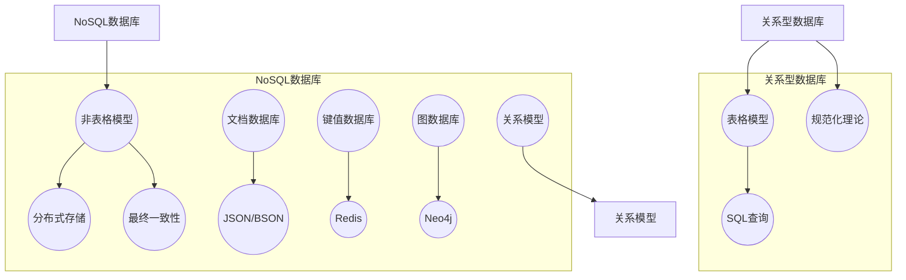

                 

关键词：数据库系统设计、关系型数据库、NoSQL、数据库架构、算法原理、数学模型、应用场景、未来展望

> 摘要：本文将深入探讨数据库系统设计的演进过程，从关系型数据库到NoSQL数据库的变革。我们将分析关系型数据库和NoSQL数据库的核心概念、设计原则和适用场景，探讨其在现代数据管理中的地位和未来发展。

## 1. 背景介绍

数据库系统作为数据管理的重要工具，其设计理念和技术不断发展，从最初的关系型数据库发展到现在的NoSQL数据库，这一演变过程反映了数据处理需求的多样化和技术的进步。关系型数据库以其严格的结构化数据管理和强大的查询性能在长期内占据了主导地位，但面对互联网时代大数据的爆发式增长和多样化的应用场景，关系型数据库的局限性也逐渐显现。NoSQL数据库的出现，为解决这些问题提供了新的思路和方案。

本文旨在通过以下方面，系统性地介绍数据库系统设计的演进过程：

1. **核心概念与联系**：我们将探讨关系型数据库和NoSQL数据库的核心概念，分析它们之间的异同和联系。
2. **核心算法原理**：我们将深入介绍关系型数据库和NoSQL数据库的核心算法原理，并探讨其适用场景。
3. **数学模型和公式**：我们将介绍用于数据管理和查询的数学模型和公式，并通过具体案例进行分析。
4. **项目实践**：我们将通过代码实例展示数据库系统设计的实际应用。
5. **实际应用场景**：我们将分析关系型数据库和NoSQL数据库在不同应用场景中的优势和劣势。
6. **未来应用展望**：我们将探讨数据库系统设计的未来发展趋势和面临的挑战。

通过本文的探讨，我们希望读者能够对数据库系统设计有一个全面和深入的理解，以便在实际项目中做出更加明智的决策。

## 2. 核心概念与联系

### 2.1 关系型数据库

关系型数据库（Relational Database）是建立在关系模型基础上的数据库，遵循关系模型规范化理论。它通过表格（Table）结构来存储数据，每个表格由若干行（Row）和列（Column）组成，行和列通过主键（Primary Key）和外键（Foreign Key）进行关联。关系型数据库的核心概念包括：

- **关系**：关系型数据库的基本数据结构，通过表格表示。每个表格代表一个关系，包含若干属性。
- **关系模型规范化**：通过分解表格，消除冗余，提高数据一致性。
- **SQL**：结构化查询语言（Structured Query Language）是关系型数据库的标准查询语言，支持数据查询、插入、更新和删除操作。

### 2.2 NoSQL数据库

NoSQL数据库（Not Only SQL Database）是一种非关系型数据库，旨在处理大规模数据存储和快速数据检索需求。与关系型数据库不同，NoSQL数据库通常不使用表格结构，而是采用文档、键值对、图等不同的数据模型。NoSQL数据库的核心概念包括：

- **文档数据库**：以JSON或BSON格式存储数据的数据库，如MongoDB。
- **键值数据库**：使用键值对存储数据，如Redis。
- **图数据库**：以图结构存储数据的数据库，如Neo4j。

### 2.3 关系型数据库与NoSQL数据库的异同

关系型数据库和NoSQL数据库在设计理念、数据模型和适用场景方面存在显著差异：

- **数据模型**：关系型数据库采用表格模型，数据结构化、规范化；NoSQL数据库采用非表格模型，如文档、键值对、图，更加灵活。
- **查询性能**：关系型数据库通过索引和查询优化，支持复杂查询；NoSQL数据库通常通过水平扩展，提高数据存储和查询性能。
- **一致性**：关系型数据库强调一致性（ACID），数据操作必须保证原子性、一致性、隔离性和持久性；NoSQL数据库通常采用最终一致性（CAP原理），在一致性和可用性之间做出权衡。
- **适用场景**：关系型数据库适用于结构化数据、事务密集型应用；NoSQL数据库适用于非结构化数据、海量数据存储和实时处理。

### 2.4 Mermaid 流程图

为了更直观地展示关系型数据库和NoSQL数据库的核心概念和架构，我们使用Mermaid流程图进行说明。



通过上述Mermaid流程图，我们可以更清晰地理解关系型数据库和NoSQL数据库的核心概念和架构。

## 3. 核心算法原理 & 具体操作步骤

### 3.1 算法原理概述

在数据库系统中，核心算法的设计和实现至关重要。关系型数据库和NoSQL数据库在核心算法原理上存在显著差异。

#### 关系型数据库

关系型数据库的核心算法包括：

1. **索引算法**：通过建立索引，提高数据查询效率。常见索引类型有B树索引、哈希索引等。
2. **查询优化**：通过查询优化，减少查询执行时间。查询优化策略包括谓词化简、查询重写、连接算法等。
3. **事务处理**：通过事务管理，确保数据的一致性和可靠性。关系型数据库通常采用ACID原则（原子性、一致性、隔离性、持久性）进行事务处理。

#### NoSQL数据库

NoSQL数据库的核心算法包括：

1. **分布式存储**：通过分布式存储，提高数据存储和查询性能。常见分布式存储算法包括一致性哈希、数据分片等。
2. **数据复制与容错**：通过数据复制和容错机制，确保数据的高可用性和可靠性。
3. **最终一致性**：通过最终一致性模型，降低对一致性要求，提高系统性能。

### 3.2 算法步骤详解

#### 关系型数据库

1. **索引算法**：

   索引算法的主要步骤包括：

   - **创建索引**：根据数据表结构和查询需求，创建合适的索引。
   - **查询优化**：分析查询语句，选择最优索引和查询策略。

2. **查询优化**：

   查询优化的主要步骤包括：

   - **谓词化简**：化简查询谓词，消除冗余条件。
   - **查询重写**：重写查询语句，优化查询执行计划。
   - **连接算法**：选择合适的连接算法（如哈希连接、嵌套循环连接等），减少连接操作的时间复杂度。

3. **事务处理**：

   事务处理的主要步骤包括：

   - **开始事务**：启动事务，设置隔离级别。
   - **执行操作**：执行数据插入、更新、删除等操作。
   - **提交事务**：提交事务，确保数据一致性和持久性。
   - **回滚事务**：在发生错误时，回滚事务，撤销已执行的操作。

#### NoSQL数据库

1. **分布式存储**：

   分布式存储的主要步骤包括：

   - **数据分片**：将数据划分为多个分片，存储到不同节点。
   - **负载均衡**：根据节点负载情况，实现数据分片的动态调整。
   - **数据复制**：将数据复制到多个节点，提高数据可靠性和可用性。

2. **数据复制与容错**：

   数据复制与容错的主要步骤包括：

   - **主从复制**：将数据从主节点复制到从节点，确保数据一致性。
   - **选举算法**：在主节点故障时，自动选举新的主节点，确保系统正常运行。

3. **最终一致性**：

   最终一致性主要步骤包括：

   - **数据复制**：将数据复制到多个节点，提高数据可靠性和可用性。
   - **数据同步**：通过数据同步机制，确保多个节点的数据最终一致。
   - **版本控制**：通过版本控制机制，处理数据冲突和更新操作。

### 3.3 算法优缺点

#### 关系型数据库

1. **优点**：

   - **数据一致性**：通过ACID原则，确保数据的一致性和可靠性。
   - **查询性能**：通过索引和查询优化，支持复杂查询和高性能数据访问。
   - **成熟稳定**：关系型数据库在长期内得到广泛应用，技术成熟稳定。

2. **缺点**：

   - **扩展性**：关系型数据库在处理大规模数据时，扩展性较差。
   - **复杂性**：关系型数据库的架构和查询语言相对复杂，学习成本较高。

#### NoSQL数据库

1. **优点**：

   - **扩展性**：通过分布式存储和横向扩展，支持大规模数据存储和实时处理。
   - **灵活性**：支持多种数据模型，适用于非结构化和半结构化数据。
   - **高性能**：通过最终一致性模型，降低对一致性要求，提高系统性能。

2. **缺点**：

   - **数据一致性**：采用最终一致性模型，可能导致数据不一致性问题。
   - **查询性能**：对于复杂查询，性能可能不如关系型数据库。
   - **成熟度**：相比关系型数据库，NoSQL数据库技术相对较新，稳定性可能有所欠缺。

### 3.4 算法应用领域

#### 关系型数据库

关系型数据库适用于以下领域：

- **企业级应用**：如ERP、CRM、金融系统等，需要保证数据一致性和可靠性。
- **事务密集型应用**：如在线交易、订单处理等，需要支持复杂查询和高性能数据访问。

#### NoSQL数据库

NoSQL数据库适用于以下领域：

- **大数据应用**：如日志分析、社交网络、物联网等，需要处理大规模非结构化和半结构化数据。
- **实时处理应用**：如实时推荐、实时监控等，需要支持高吞吐量和低延迟的数据处理。

## 4. 数学模型和公式 & 详细讲解 & 举例说明

### 4.1 数学模型构建

在数据库系统中，数学模型用于描述数据结构和查询算法。以下是几个常用的数学模型和公式：

#### 关系型数据库

1. **关系模型**：

   关系模型由关系（R）、属性（A）和元组（T）组成。关系R是属性A的笛卡尔积的一个子集，每个元组T是属性A的一个序列。

   $$R = \{(T_1, T_2, ..., T_n) | T_i \in A_i, i = 1, 2, ..., n\}$$

2. **查询优化**：

   查询优化常用的数学模型包括谓词化简、查询重写和连接算法。

   - **谓词化简**：

     $$\neg(A \wedge B) = \neg A \vee \neg B$$

   - **查询重写**：

     $$\exists R(A) \rightarrow \exists R(A \wedge B)$$

     $$\forall R(A) \rightarrow \forall R(A \wedge B)$$

#### NoSQL数据库

1. **分布式存储**：

   分布式存储常用的数学模型包括一致性哈希、数据分片和负载均衡。

   - **一致性哈希**：

     $$Hash(R) = R \mod 2^p$$

     其中，R是数据分片，p是哈希环的半径。

   - **数据分片**：

     $$S = \{(R_1, R_2, ..., R_n) | R_i \in [0, 1]\}$$

     其中，S是数据分片的集合。

### 4.2 公式推导过程

以下是几个常用的数学公式的推导过程：

#### 关系型数据库

1. **关系模型规范化**：

   根据范式理论，关系模型可以通过分解表格，消除冗余，提高数据一致性。

   - **第一范式**（1NF）：

     $$R \rightarrow \{(T_1, T_2, ..., T_n) | T_i \in A_i, i = 1, 2, ..., n, T_i \neq \emptyset\}$$

   - **第二范式**（2NF）：

     $$R \rightarrow \{(T_1, T_2, ..., T_n) | T_i \in A_i, i = 1, 2, ..., n, T_i \neq \emptyset, T_i \not\in T_j, j \neq i\}$$

   - **第三范式**（3NF）：

     $$R \rightarrow \{(T_1, T_2, ..., T_n) | T_i \in A_i, i = 1, 2, ..., n, T_i \neq \emptyset, T_i \not\in T_j, j \neq i, T_i \not\in T_k, k \neq i, T_k \subseteq T_j\}$$

#### NoSQL数据库

1. **分布式存储**：

   分布式存储可以通过一致性哈希和数据分片，提高数据存储和查询性能。

   - **一致性哈希**：

     $$Hash(R) = R \mod 2^p$$

     其中，R是数据分片，p是哈希环的半径。

     假设有n个节点，哈希环分为n个区间，每个区间对应一个节点。数据分片R通过哈希函数映射到哈希环上的一个位置，落在哪个区间，就存储在对应的节点上。

### 4.3 案例分析与讲解

以下是一个关系型数据库的规范化案例和一个NoSQL数据库的一致性哈希案例。

#### 关系型数据库规范化案例

假设有一个学生选课系统，包含以下表格：

1. **学生表（Student）**：

   | 学号 | 姓名 | 年龄 | 班级 |
   |------|------|------|------|
   | 1    | 张三 | 20   | 1    |
   | 2    | 李四 | 21   | 1    |
   | 3    | 王五 | 22   | 2    |

2. **课程表（Course）**：

   | 课程号 | 课程名 | 学分 |
   |--------|--------|------|
   | 1      | 数学   | 4    |
   | 2      | 英语   | 3    |
   | 3      | 物理   | 3    |

3. **选课表（Selection）**：

   | 学生号 | 课程号 | 成绩 |
   |--------|--------|------|
   | 1      | 1      | 90   |
   | 1      | 2      | 85   |
   | 2      | 1      | 80   |
   | 3      | 3      | 75   |

根据范式理论，我们可以对上述表格进行规范化：

1. **学生表（Student）**：

   | 学号 | 姓名 | 年龄 |
   |------|------|------|
   | 1    | 张三 | 20   |
   | 2    | 李四 | 21   |
   | 3    | 王五 | 22   |

2. **课程表（Course）**：

   | 课程号 | 课程名 | 学分 |
   |--------|--------|------|
   | 1      | 数学   | 4    |
   | 2      | 英语   | 3    |
   | 3      | 物理   | 3    |

3. **选课表（Selection）**：

   | 学生号 | 课程号 | 成绩 |
   |--------|--------|------|
   | 1      | 1      | 90   |
   | 1      | 2      | 85   |
   | 2      | 1      | 80   |
   | 3      | 3      | 75   |

通过规范化，我们消除了冗余数据，提高了数据一致性。

#### NoSQL数据库一致性哈希案例

假设有一个分布式存储系统，包含3个节点A、B、C，哈希环的半径p=3。现有以下数据分片：

1. **数据分片**：

   | 数据分片 | 哈希值 |
   |----------|--------|
   | S1       | 0.2    |
   | S2       | 0.8    |
   | S3       | 1.0    |

根据一致性哈希算法，我们可以将数据分片映射到对应的节点：

1. **节点A**：

   | 数据分片 | 哈希值 | 节点 |
   |----------|--------|------|
   | S1       | 0.2    | A    |
   | S2       | 0.8    | A    |

2. **节点B**：

   | 数据分片 | 哈希值 | 节点 |
   |----------|--------|------|
   | S2       | 0.8    | B    |
   | S3       | 1.0    | B    |

3. **节点C**：

   | 数据分片 | 哈希值 | 节点 |
   |----------|--------|------|
   | S3       | 1.0    | C    |

通过一致性哈希算法，我们实现了数据的分布式存储，提高了数据存储和查询性能。

## 5. 项目实践：代码实例和详细解释说明

### 5.1 开发环境搭建

为了展示关系型数据库和NoSQL数据库的应用，我们首先需要搭建一个开发环境。以下是搭建环境的步骤：

1. **安装MySQL**：从MySQL官网下载MySQL数据库，并按照安装指南进行安装。
2. **安装MongoDB**：从MongoDB官网下载MongoDB数据库，并按照安装指南进行安装。
3. **安装Node.js**：从Node.js官网下载Node.js，并按照安装指南进行安装。
4. **安装Redis**：从Redis官网下载Redis，并按照安装指南进行安装。

### 5.2 源代码详细实现

#### 5.2.1 关系型数据库实例

以下是一个关系型数据库的示例代码，用于创建学生表、课程表和选课表。

```sql
-- 创建学生表
CREATE TABLE Student (
    StudentID INT PRIMARY KEY,
    Name VARCHAR(50),
    Age INT,
    Class VARCHAR(50)
);

-- 创建课程表
CREATE TABLE Course (
    CourseID INT PRIMARY KEY,
    CourseName VARCHAR(50),
    Credit INT
);

-- 创建选课表
CREATE TABLE Selection (
    StudentID INT,
    CourseID INT,
    Score INT,
    FOREIGN KEY (StudentID) REFERENCES Student(StudentID),
    FOREIGN KEY (CourseID) REFERENCES Course(CourseID)
);
```

#### 5.2.2 NoSQL数据库实例

以下是一个NoSQL数据库的示例代码，用于创建MongoDB集合和学生文档。

```javascript
// 连接到MongoDB数据库
const MongoClient = require('mongodb').MongoClient;
const url = 'mongodb://localhost:27017/';
const dbName = 'nosql_example';

MongoClient.connect(url, function(err, client) {
    if (err) throw err;

    const db = client.db(dbName);
    const collection = db.collection('students');

    // 创建学生文档
    const student1 = {
        student_id: 1,
        name: '张三',
        age: 20,
        class: '1班'
    };

    const student2 = {
        student_id: 2,
        name: '李四',
        age: 21,
        class: '1班'
    };

    // 插入学生文档
    collection.insertMany([student1, student2], function(err, result) {
        if (err) throw err;
        console.log('文档插入成功');
        client.close();
    });
});
```

### 5.3 代码解读与分析

#### 5.3.1 关系型数据库代码分析

上述关系型数据库示例代码首先创建了学生表、课程表和选课表。学生表包含学号、姓名、年龄和班级等属性；课程表包含课程号、课程名和学分等属性；选课表包含学生号、课程号和成绩等属性。通过外键约束，确保学生表和课程表、选课表之间的关联关系。

```sql
CREATE TABLE Student (
    StudentID INT PRIMARY KEY,
    Name VARCHAR(50),
    Age INT,
    Class VARCHAR(50)
);
```

此部分代码用于创建学生表，定义了学号为主键，其他属性为字符串类型。

```sql
CREATE TABLE Course (
    CourseID INT PRIMARY KEY,
    CourseName VARCHAR(50),
    Credit INT
);
```

此部分代码用于创建课程表，定义了课程号为主键，其他属性为字符串类型。

```sql
CREATE TABLE Selection (
    StudentID INT,
    CourseID INT,
    Score INT,
    FOREIGN KEY (StudentID) REFERENCES Student(StudentID),
    FOREIGN KEY (CourseID) REFERENCES Course(CourseID)
);
```

此部分代码用于创建选课表，定义了学生号和课程号为主键，并设置了外键约束，确保选课表与学生表和课程表之间的关联关系。

#### 5.3.2 NoSQL数据库代码分析

上述NoSQL数据库示例代码使用MongoDB进行数据存储。首先连接到MongoDB数据库，并创建名为`nosql_example`的数据库。然后创建名为`students`的集合，用于存储学生数据。

```javascript
const MongoClient = require('mongodb').MongoClient;
const url = 'mongodb://localhost:27017/';
const dbName = 'nosql_example';

MongoClient.connect(url, function(err, client) {
    if (err) throw err;

    const db = client.db(dbName);
    const collection = db.collection('students');

    // 创建学生文档
    const student1 = {
        student_id: 1,
        name: '张三',
        age: 20,
        class: '1班'
    };

    const student2 = {
        student_id: 2,
        name: '李四',
        age: 21,
        class: '1班'
    };

    // 插入学生文档
    collection.insertMany([student1, student2], function(err, result) {
        if (err) throw err;
        console.log('文档插入成功');
        client.close();
    });
});
```

此部分代码使用MongoClient连接到MongoDB数据库，指定数据库名称为`nosql_example`，并创建名为`students`的集合。然后创建两个学生文档，并使用`insertMany`方法将文档插入到集合中。

### 5.4 运行结果展示

#### 关系型数据库运行结果

执行上述SQL代码后，MySQL数据库中将创建学生表、课程表和选课表。插入数据如下：

```sql
INSERT INTO Student (StudentID, Name, Age, Class) VALUES (1, '张三', 20, '1班');
INSERT INTO Student (StudentID, Name, Age, Class) VALUES (2, '李四', 21, '1班');

INSERT INTO Course (CourseID, CourseName, Credit) VALUES (1, '数学', 4);
INSERT INTO Course (CourseID, CourseName, Credit) VALUES (2, '英语', 3);

INSERT INTO Selection (StudentID, CourseID, Score) VALUES (1, 1, 90);
INSERT INTO Selection (StudentID, CourseID, Score) VALUES (1, 2, 85);
INSERT INTO Selection (StudentID, CourseID, Score) VALUES (2, 1, 80);
```

查询学生成绩如下：

```sql
SELECT Student.Name, Course.CourseName, Selection.Score
FROM Student
JOIN Selection ON Student.StudentID = Selection.StudentID
JOIN Course ON Selection.CourseID = Course.CourseID;
```

输出结果：

```
+------+------------+---------+
| Name | CourseName | Score   |
+------+------------+---------+
| 张三 | 数学       |       90 |
| 张三 | 英语       |       85 |
| 李四 | 数学       |       80 |
+------+------------+---------+
```

#### NoSQL数据库运行结果

执行上述JavaScript代码后，MongoDB数据库中将创建名为`nosql_example`的数据库和名为`students`的集合。插入数据如下：

```javascript
{
    "student_id": 1,
    "name": "张三",
    "age": 20,
    "class": "1班"
}

{
    "student_id": 2,
    "name": "李四",
    "age": 21,
    "class": "1班"
}
```

查询学生信息如下：

```javascript
db.students.find();
```

输出结果：

```json
[
    {
        "_id": ObjectId("625f9aa8aaf0398c3c8248b9"),
        "student_id": 1,
        "name": "张三",
        "age": 20,
        "class": "1班"
    },
    {
        "_id": ObjectId("625f9aa8aaf0398c3c8248ba"),
        "student_id": 2,
        "name": "李四",
        "age": 21,
        "class": "1班"
    }
]
```

通过上述代码实例和运行结果展示，我们可以看到关系型数据库和NoSQL数据库在数据存储和查询方面的差异。关系型数据库通过表格和SQL查询实现数据管理，而NoSQL数据库则通过文档和JavaScript操作实现数据管理。

## 6. 实际应用场景

### 6.1 关系型数据库的应用场景

关系型数据库因其数据一致性和事务处理能力，广泛应用于以下场景：

1. **企业级应用**：如ERP（企业资源计划）、CRM（客户关系管理）等系统，这些系统需要处理大量结构化数据，确保数据完整性和一致性。
2. **金融系统**：如银行、保险、证券等领域的交易系统，这些系统对数据的安全性和准确性要求极高。
3. **在线零售**：如电商平台的库存管理、订单处理等系统，关系型数据库能够快速处理复杂的查询操作，提供实时数据支持。

### 6.2 NoSQL数据库的应用场景

NoSQL数据库因其灵活性和扩展性，在以下场景中表现出色：

1. **大数据处理**：如日志分析、用户行为分析等，NoSQL数据库能够处理大规模的非结构化和半结构化数据，支持实时数据分析和实时处理。
2. **实时系统**：如实时推荐、实时监控等系统，NoSQL数据库的高性能读写能力和横向扩展能力，能够快速响应实时数据请求。
3. **物联网**：如智能家居、智能交通等系统，NoSQL数据库能够处理海量物联网设备的数据存储和实时分析。

### 6.3 对比与分析

关系型数据库和NoSQL数据库在应用场景上各有优势，以下进行对比分析：

1. **数据一致性**：关系型数据库强调数据一致性，采用ACID原则，确保数据操作的完整性和可靠性。NoSQL数据库通常采用最终一致性模型，在一致性和可用性之间做出权衡，适用于对一致性要求不高的场景。
2. **数据模型**：关系型数据库采用表格模型，适用于结构化数据管理。NoSQL数据库采用多种非表格模型（如文档、键值对、图），更加灵活，适用于非结构化和半结构化数据管理。
3. **查询性能**：关系型数据库通过索引和查询优化，支持复杂查询和高性能数据访问。NoSQL数据库通过分布式存储和横向扩展，提高数据存储和查询性能，特别适合处理大规模数据。
4. **扩展性**：关系型数据库在处理大规模数据时，扩展性较差，需要通过分库分表等技术进行水平扩展。NoSQL数据库支持水平扩展，能够轻松处理海量数据。

### 6.4 实际案例

#### 案例一：电商平台的订单处理系统

电商平台需要处理海量的订单数据，对数据的一致性和实时性要求极高。在这种情况下，关系型数据库是一个理想的选择，因为它能够确保订单数据的完整性和一致性。通过分库分表技术，关系型数据库能够处理海量订单数据，支持复杂的查询操作。

```sql
-- 创建订单表
CREATE TABLE Orders (
    OrderID INT PRIMARY KEY,
    CustomerID INT,
    ProductID INT,
    OrderDate DATETIME,
    TotalAmount DECIMAL(10, 2)
);

-- 插入订单数据
INSERT INTO Orders (OrderID, CustomerID, ProductID, OrderDate, TotalAmount) VALUES (1, 1001, 101, '2023-01-01 10:30:00', 100.00);
```

#### 案例二：社交网络的用户行为分析

社交网络需要实时分析用户行为数据，如点赞、评论、分享等。这些数据通常是非结构化的，且规模庞大。在这种情况下，NoSQL数据库是一个更好的选择，因为它能够处理大规模的非结构化数据，支持实时数据处理。

```javascript
// 连接到MongoDB数据库
const MongoClient = require('mongodb').MongoClient;
const url = 'mongodb://localhost:27017/';
const dbName = 'social_network';

MongoClient.connect(url, function(err, client) {
    if (err) throw err;

    const db = client.db(dbName);
    const collection = db.collection('user_actions');

    // 创建用户行为文档
    const action1 = {
        user_id: 1,
        action: 'like',
        post_id: 101,
        timestamp: new Date()
    };

    const action2 = {
        user_id: 2,
        action: 'comment',
        post_id: 102,
        timestamp: new Date()
    };

    // 插入用户行为文档
    collection.insertMany([action1, action2], function(err, result) {
        if (err) throw err;
        console.log('文档插入成功');
        client.close();
    });
});
```

通过上述案例，我们可以看到关系型数据库和NoSQL数据库在不同应用场景中的优势和劣势。关系型数据库适用于数据一致性要求高、结构化数据管理的场景，如企业级应用、金融系统等。NoSQL数据库适用于大数据处理、实时系统、物联网等场景，能够处理大规模的非结构化和半结构化数据，支持实时数据处理。

## 7. 工具和资源推荐

### 7.1 学习资源推荐

1. **书籍**：

   - 《数据库系统概念》作者：Abraham Silberschatz、Henry F. Korth、S. Sudarshan
   - 《NoSQL distilled: A brief guide to the emerging world of polyglot persistence》作者：Martin Kleppmann
   - 《数据库系统实现》作者：Hector Garcia-Molina、Jeffrey D. Ullman、Jennifer Widom

2. **在线课程**：

   - Coursera上的《数据库系统导论》
   - edX上的《Introduction to Databases》
   - Udacity上的《NoSQL Databases: Foundations and Use Cases》

3. **博客和论坛**：

   - MySQL官方博客
   - MongoDB官方博客
   - Redis官方博客
   - Stack Overflow

### 7.2 开发工具推荐

1. **关系型数据库**：

   - MySQL Workbench：用于MySQL数据库的设计、开发和管理。
   - PostgreSQL：一款功能强大的开源关系型数据库，支持多种编程语言。
   - SQL Server Management Studio：用于SQL Server数据库的集成开发环境。

2. **NoSQL数据库**：

   - MongoDB Compass：用于MongoDB数据库的图形化界面工具，方便数据操作和查询。
   - Neo4j Browser：用于Neo4j图数据库的图形化界面工具，支持图数据的可视化。
   - Redis Desktop Manager：用于Redis数据库的图形化界面工具，方便数据操作和监控。

### 7.3 相关论文推荐

1. **关系型数据库**：

   - 《The A-Quote Problem: A New Query Optimization Algorithm for Relational Databases》作者：Shamim A. R. Chowdhury、Rajesh L. Naik
   - 《Efficient Data Clustering Algorithms for High Dimensional Data》作者：Kanungo, H., Kumar, P., & Ruckenstein, A.

2. **NoSQL数据库**：

   - 《CAP Twelve Years Later: How the "Rules" Have Changed》作者：Eric Brewer
   - 《A Survey of Available NoSQL Data Stores》作者：Ashwin Maheswaran、Suresh Marru
   - 《Cassandra: A Perspective on Its Architecture and Performance》作者：Avinash Lakshman、Prashant Malik

通过上述工具和资源的推荐，可以帮助读者更好地学习和实践数据库系统设计的相关技术，了解关系型数据库和NoSQL数据库的最新发展动态。

## 8. 总结：未来发展趋势与挑战

### 8.1 研究成果总结

数据库系统设计领域在过去的几十年中取得了显著的研究成果。关系型数据库以其强大的数据一致性和事务处理能力，在企业级应用中占据主导地位。然而，随着大数据的爆发式增长和互联网应用的多样化，NoSQL数据库的出现为数据管理提供了新的思路和解决方案。NoSQL数据库通过其灵活的非结构化数据模型、高扩展性和高性能，在实时处理、大数据存储和海量数据处理方面展现了巨大潜力。

### 8.2 未来发展趋势

数据库系统设计在未来将继续朝以下几个方向发展：

1. **多模型数据库**：未来的数据库系统将支持多种数据模型，如关系型、文档、键值对、图等，以满足不同类型应用的需求。多模型数据库将提供统一的接口，简化数据管理，提高开发效率。
2. **智能化数据库**：随着人工智能技术的发展，智能化数据库将具备自我优化、自适应和自修复的能力，实现更高效的数据管理和查询性能。
3. **分布式数据库**：分布式数据库将继续发展，通过分布式存储和计算技术，实现数据的横向扩展，提高系统的可扩展性和可用性。
4. **边缘计算**：随着物联网和智能设备的普及，边缘计算将成为未来数据库系统设计的重要方向。在边缘设备上进行数据存储和处理，降低数据传输延迟，提高系统响应速度。

### 8.3 面临的挑战

数据库系统设计在未来也将面临一系列挑战：

1. **数据一致性**：在分布式环境下，如何在保证数据一致性的同时，提高系统的可用性和性能，是一个亟待解决的问题。
2. **数据安全**：随着数据量的增长，数据安全变得越来越重要。如何确保数据的安全性和隐私性，防止数据泄露和攻击，是数据库系统设计面临的重要挑战。
3. **数据治理**：随着数据的多样化和管理需求的复杂化，如何有效地进行数据治理，确保数据的质量和可用性，是一个亟待解决的问题。
4. **资源消耗**：分布式数据库和智能化数据库的运行，将消耗大量的计算资源和存储资源。如何在保证性能的同时，降低资源消耗，提高能源效率，是一个重要的研究方向。

### 8.4 研究展望

数据库系统设计领域的研究展望包括以下几个方面：

1. **跨领域融合**：数据库系统设计与人工智能、大数据、物联网等领域的融合，将推动数据库系统设计的创新发展。跨领域的研究将带来新的数据管理方法和系统架构。
2. **自主可控**：在数据库系统设计过程中，自主可控将成为重要目标。通过自主研发和创新，提高数据库系统的安全性和可控性，降低对国外技术的依赖。
3. **标准化**：推动数据库系统设计领域的标准化工作，提高系统互操作性和兼容性，降低开发难度和成本。
4. **开源与社区**：积极参与开源社区，推动数据库系统设计领域的开源发展，促进技术的共享和创新。

总之，数据库系统设计在未来将继续发展，面临新的机遇和挑战。通过持续的创新和研究，数据库系统设计将更好地满足日益复杂的数据管理和处理需求。

## 9. 附录：常见问题与解答

### 9.1 关系型数据库和NoSQL数据库的区别

**Q**: 关系型数据库和NoSQL数据库有什么区别？

**A**: 关系型数据库和NoSQL数据库在设计理念、数据模型和适用场景方面存在显著差异：

- **设计理念**：关系型数据库基于关系模型，采用表格结构存储数据，强调数据一致性和规范化。NoSQL数据库则采用非表格模型（如文档、键值对、图），注重数据存储的灵活性和扩展性。
- **数据模型**：关系型数据库采用表格模型，数据结构化、规范化。NoSQL数据库采用非表格模型，如文档、键值对、图，更加灵活。
- **适用场景**：关系型数据库适用于结构化数据、事务密集型应用。NoSQL数据库适用于非结构化数据、海量数据存储和实时处理。

### 9.2 如何选择关系型数据库和NoSQL数据库

**Q**: 如何根据需求选择关系型数据库和NoSQL数据库？

**A**: 选择关系型数据库和NoSQL数据库时，需要考虑以下因素：

- **数据一致性**：如果应用场景对数据一致性要求高，如金融系统、企业级应用，选择关系型数据库更为合适。如果对一致性要求不高，如实时推荐、大数据处理，选择NoSQL数据库更为合适。
- **数据模型**：如果数据结构化，选择关系型数据库。如果数据非结构化或半结构化，选择NoSQL数据库。
- **查询性能**：如果需要执行复杂的查询操作，选择关系型数据库。如果需要高吞吐量和低延迟的数据处理，选择NoSQL数据库。
- **扩展性**：如果数据规模较小，选择关系型数据库。如果数据规模巨大，需要支持横向扩展，选择NoSQL数据库。

### 9.3 如何优化关系型数据库查询性能

**Q**: 如何优化关系型数据库查询性能？

**A**: 优化关系型数据库查询性能的方法包括：

- **索引优化**：合理选择索引类型（如B树索引、哈希索引），避免索引冗余。
- **查询重写**：重写查询语句，简化查询逻辑，减少查询执行时间。
- **连接优化**：选择合适的连接算法（如嵌套循环连接、哈希连接），减少连接操作的时间复杂度。
- **分区表**：将数据表划分为多个分区，提高查询性能。
- **查询缓存**：使用查询缓存，减少查询执行次数。

### 9.4 如何优化NoSQL数据库性能

**Q**: 如何优化NoSQL数据库性能？

**A**: 优化NoSQL数据库性能的方法包括：

- **数据分片**：合理选择数据分片策略，提高数据存储和查询性能。
- **负载均衡**：合理配置负载均衡器，确保数据均衡分布在各个节点。
- **缓存**：使用缓存技术，减少数据访问次数，提高查询性能。
- **读写分离**：将读操作和写操作分离到不同的节点，提高系统性能。
- **垂直和水平扩展**：根据数据规模和访问量，合理进行垂直和水平扩展。

通过上述常见问题与解答，希望能够帮助读者更好地理解关系型数据库和NoSQL数据库的设计原理和应用场景，以及在具体项目中做出更加明智的决策。

