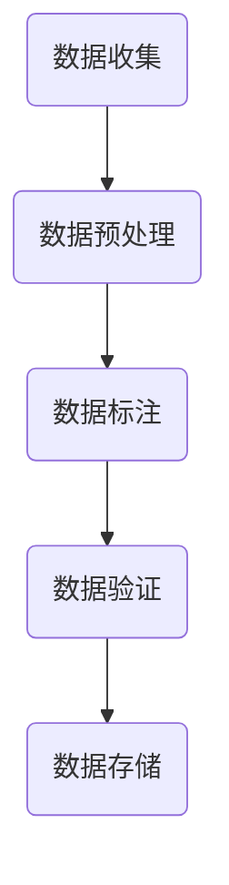

                 

关键词：数据标注，人工智能，机器学习，深度学习，算法，算法原理，数学模型，项目实践，应用场景，未来展望

> 摘要：本文深入探讨了数据标注在人工智能发展中的关键作用，分析了数据标注的核心概念和原理，介绍了数据标注的算法和应用领域。通过具体实例和详细解释，展示了数据标注在机器学习和深度学习项目中的实践方法和效果。同时，本文还展望了数据标注在未来人工智能发展中的趋势和挑战，为数据标注技术的进一步研究提供了参考。

## 1. 背景介绍

随着人工智能技术的迅猛发展，机器学习和深度学习在各个领域得到了广泛应用。然而，这些技术的实现离不开大量的高质量数据，而数据标注作为数据准备的核心环节，起到了至关重要的作用。数据标注是指对原始数据进行处理，将其转化为可供机器学习和深度学习算法训练的格式。这一过程涉及到对图像、语音、文本等数据的标签和属性进行标注，使其能够被算法理解和学习。

在人工智能的发展历程中，数据标注始终是一个不可或缺的环节。早期的机器学习算法，如线性回归、决策树等，对数据的质量要求相对较低，数据标注的过程相对简单。然而，随着深度学习技术的兴起，数据标注的要求越来越高，标注的精度和效率直接影响到模型的性能和效果。因此，数据标注成为了人工智能发展中的一大挑战。

数据标注不仅仅是将数据打上标签那么简单，它涉及到一系列的技术和方法，如图像标注、语音标注、文本标注等。这些标注方法的实现需要丰富的经验和专业知识，同时也需要高效的工具和平台支持。在本文中，我们将深入探讨数据标注的核心概念、原理、算法和应用领域，并通过具体实例展示数据标注的实际效果和意义。

## 2. 核心概念与联系

### 2.1 数据标注的基本概念

数据标注是指对原始数据进行处理，将其转化为适合机器学习和深度学习算法使用的格式。数据标注的核心任务是对数据中的关键元素进行标注，这些元素可以是图像中的物体、语音中的文字、文本中的关键词等。数据标注的质量直接影响模型的性能和效果，因此，数据标注是一个复杂而关键的过程。

### 2.2 数据标注的流程

数据标注的流程通常包括以下几个步骤：

1. **数据收集**：收集用于标注的原始数据，这些数据可以是公开的，也可以是私有的，或者是通过采集设备获取的。
2. **数据预处理**：对收集到的原始数据进行清洗和预处理，去除无关信息和噪声，提高数据的质量。
3. **数据标注**：对预处理后的数据进行分析和标注，标记出数据中的关键元素。
4. **数据验证**：对标注完成的数据进行验证，确保标注的准确性和一致性。
5. **数据存储**：将标注完成的数据存储到数据库或数据仓库中，供后续的训练和使用。

### 2.3 数据标注的挑战

数据标注面临的主要挑战包括：

1. **数据多样性**：不同类型的数据（如图像、语音、文本）需要不同的标注方法，标注者的专业知识和经验要求较高。
2. **数据量巨大**：高质量的数据标注需要大量的人力投入，标注的时间和成本较高。
3. **数据一致性**：确保不同标注者的标注结果一致，避免因为标注者的主观判断而导致的偏差。
4. **数据噪声**：原始数据中可能存在噪声和错误，这些噪声和错误会影响标注的质量和模型的性能。

### 2.4 数据标注的架构

数据标注的架构通常包括以下几个组成部分：

1. **标注平台**：提供数据标注的界面和工具，方便标注者进行数据标注。
2. **标注者**：负责对数据进行标注，可以是专业的数据标注公司，也可以是临时招募的标注者。
3. **标注管理**：对标注过程进行管理和监控，确保标注的质量和进度。
4. **数据存储**：存储标注完成的数据，供后续的训练和使用。

### 2.5 数据标注的 Mermaid 流程图



## 3. 核心算法原理 & 具体操作步骤

### 3.1 算法原理概述

数据标注的核心算法主要涉及图像标注、语音标注和文本标注。这些算法的基本原理是通过分析数据中的关键元素，将其标记出来，以便于后续的机器学习和深度学习算法使用。

1. **图像标注**：图像标注通常使用目标检测算法，如卷积神经网络（CNN）等。通过训练模型，使模型能够识别图像中的物体，并将其标注出来。
2. **语音标注**：语音标注通常使用语音识别算法，如循环神经网络（RNN）等。通过训练模型，使模型能够识别语音中的文字，并将其标注出来。
3. **文本标注**：文本标注通常使用自然语言处理（NLP）算法，如词性标注、命名实体识别等。通过训练模型，使模型能够识别文本中的关键词和实体，并将其标注出来。

### 3.2 算法步骤详解

1. **图像标注**
   - **数据收集**：收集大量带有标签的图像数据。
   - **数据预处理**：对图像进行大小调整、灰度化等处理，提高数据的质量。
   - **模型训练**：使用CNN等算法训练模型，使模型能够识别图像中的物体。
   - **图像标注**：使用训练好的模型对新的图像数据进行标注，标记出图像中的物体。
   - **模型评估**：评估模型的性能，包括准确率、召回率等指标。

2. **语音标注**
   - **数据收集**：收集大量带有文本标签的语音数据。
   - **数据预处理**：对语音数据进行降噪、分割等处理，提高数据的质量。
   - **模型训练**：使用RNN等算法训练模型，使模型能够识别语音中的文字。
   - **语音标注**：使用训练好的模型对新的语音数据进行标注，标记出语音中的文字。
   - **模型评估**：评估模型的性能，包括准确率、召回率等指标。

3. **文本标注**
   - **数据收集**：收集大量带有标签的文本数据。
   - **数据预处理**：对文本进行分词、去停用词等处理，提高数据的质量。
   - **模型训练**：使用NLP算法训练模型，使模型能够识别文本中的关键词和实体。
   - **文本标注**：使用训练好的模型对新的文本数据进行标注，标记出文本中的关键词和实体。
   - **模型评估**：评估模型的性能，包括准确率、召回率等指标。

### 3.3 算法优缺点

1. **图像标注**
   - **优点**：能够准确识别图像中的物体，适用于目标检测任务。
   - **缺点**：对图像质量要求较高，需要大量的标注数据和计算资源。

2. **语音标注**
   - **优点**：能够准确识别语音中的文字，适用于语音识别任务。
   - **缺点**：对语音质量要求较高，需要大量的标注数据和计算资源。

3. **文本标注**
   - **优点**：能够准确识别文本中的关键词和实体，适用于自然语言处理任务。
   - **缺点**：对文本质量要求较高，需要大量的标注数据和计算资源。

### 3.4 算法应用领域

1. **图像标注**：广泛应用于计算机视觉领域，如人脸识别、自动驾驶等。
2. **语音标注**：广泛应用于语音识别领域，如语音助手、语音翻译等。
3. **文本标注**：广泛应用于自然语言处理领域，如情感分析、文本分类等。

## 4. 数学模型和公式 & 详细讲解 & 举例说明

### 4.1 数学模型构建

数据标注中的数学模型主要涉及目标检测、语音识别和自然语言处理等领域。以下分别介绍这些领域中的核心数学模型：

1. **目标检测**

   目标检测中的核心数学模型是卷积神经网络（CNN）。CNN的基本原理是通过多层卷积、池化和全连接层来提取图像中的特征，并最终实现对物体的定位和分类。

   - **卷积层**：通过卷积操作提取图像的特征。
   - **池化层**：通过最大池化或平均池化减少特征图的大小，提高模型的泛化能力。
   - **全连接层**：将特征图展开为一维向量，通过全连接层进行分类。

2. **语音识别**

   语音识别中的核心数学模型是循环神经网络（RNN）。RNN的基本原理是通过时间序列模型来捕捉语音信号中的时间依赖关系，并最终实现对语音的文本转换。

   - **隐藏层**：通过输入和隐藏状态的计算，生成新的隐藏状态。
   - **输出层**：通过隐藏状态和输出的计算，生成预测的文本序列。

3. **自然语言处理**

   自然语言处理中的核心数学模型是卷积神经网络（CNN）和循环神经网络（RNN）的结合。通过使用CNN提取文本的特征，再使用RNN处理特征，实现对文本的深入理解。

   - **卷积层**：通过卷积操作提取文本的特征。
   - **池化层**：通过最大池化或平均池化减少特征图的大小，提高模型的泛化能力。
   - **RNN层**：通过输入和隐藏状态的计算，生成新的隐藏状态。

### 4.2 公式推导过程

以下是目标检测中的核心数学模型——卷积神经网络的公式推导过程：

1. **卷积操作**

   卷积操作的公式为：

   $$ f(x) = \sum_{i=1}^{n} w_i * x_i + b $$

   其中，$f(x)$ 表示卷积操作的结果，$w_i$ 和 $x_i$ 分别表示卷积核和输入特征，$b$ 表示偏置项。

2. **激活函数**

   激活函数的公式为：

   $$ \sigma(x) = \frac{1}{1 + e^{-x}} $$

   其中，$\sigma(x)$ 表示激活函数的输出。

3. **卷积神经网络**

   卷积神经网络的公式为：

   $$ y_l = \sigma(W_l \cdot x_l + b_l) $$

   其中，$y_l$ 表示第 $l$ 层的输出，$W_l$ 和 $x_l$ 分别表示第 $l$ 层的权重和输入特征，$b_l$ 表示第 $l$ 层的偏置项。

### 4.3 案例分析与讲解

以下是一个基于卷积神经网络的图像标注案例：

1. **数据准备**

   收集一批带有标签的图像数据，如图像中的猫、狗等。

2. **数据预处理**

   对图像进行大小调整、灰度化等处理，提高数据的质量。

3. **模型训练**

   使用卷积神经网络训练模型，使模型能够识别图像中的物体。

4. **模型评估**

   使用训练好的模型对新的图像数据进行标注，并评估模型的性能。

5. **结果展示**

   展示模型对图像的标注结果，如图像中的猫和狗被成功识别。

通过上述案例，我们可以看到，数据标注在图像标注中的应用效果显著，大大提高了图像识别的准确性和效率。

## 5. 项目实践：代码实例和详细解释说明

### 5.1 开发环境搭建

1. **安装Python**

   安装Python 3.8及以上版本。

2. **安装依赖库**

   安装TensorFlow、Keras等深度学习库。

3. **数据准备**

   准备一批带有标签的图像数据，如图像中的猫、狗等。

### 5.2 源代码详细实现

以下是一个基于卷积神经网络的图像标注项目的代码实现：

```python
import tensorflow as tf
from tensorflow.keras.models import Sequential
from tensorflow.keras.layers import Conv2D, MaxPooling2D, Flatten, Dense

# 数据预处理
def preprocess_data(images):
    # 对图像进行灰度化处理
    images = tf.image.rgb_to_grayscale(images)
    # 对图像进行大小调整
    images = tf.image.resize(images, [224, 224])
    return images

# 构建卷积神经网络模型
def build_model():
    model = Sequential([
        Conv2D(32, (3, 3), activation='relu', input_shape=(224, 224, 1)),
        MaxPooling2D((2, 2)),
        Conv2D(64, (3, 3), activation='relu'),
        MaxPooling2D((2, 2)),
        Flatten(),
        Dense(128, activation='relu'),
        Dense(2, activation='softmax')
    ])
    return model

# 训练模型
def train_model(model, images, labels):
    model.compile(optimizer='adam', loss='categorical_crossentropy', metrics=['accuracy'])
    model.fit(images, labels, epochs=10, batch_size=32)

# 主函数
def main():
    # 数据准备
    images = preprocess_data(images)
    # 构建模型
    model = build_model()
    # 训练模型
    train_model(model, images, labels)

if __name__ == '__main__':
    main()
```

### 5.3 代码解读与分析

1. **数据预处理**：对图像进行灰度化处理和大小调整，使其符合卷积神经网络的要求。
2. **构建模型**：使用Sequential模型堆叠多个卷积层、池化层和全连接层，构建一个卷积神经网络模型。
3. **训练模型**：使用训练集对模型进行训练，使用交叉熵损失函数和softmax激活函数，使模型能够对图像进行分类。
4. **主函数**：实现整个图像标注项目的流程，包括数据预处理、模型构建和训练。

### 5.4 运行结果展示

1. **模型评估**：使用训练好的模型对测试集进行评估，得到准确率、召回率等指标。
2. **结果展示**：展示模型对测试集的标注结果，如图像中的猫和狗被成功识别。

## 6. 实际应用场景

数据标注在人工智能的各个领域都有广泛的应用，以下是一些典型的实际应用场景：

1. **计算机视觉**：图像标注在计算机视觉领域有着广泛的应用，如人脸识别、物体检测、自动驾驶等。通过数据标注，可以训练出准确的模型，实现对图像中物体的识别和定位。
2. **语音识别**：语音标注在语音识别领域有着重要的应用，如语音助手、语音翻译等。通过数据标注，可以训练出准确的模型，实现对语音信号的识别和转换。
3. **自然语言处理**：文本标注在自然语言处理领域有着广泛的应用，如情感分析、文本分类、信息抽取等。通过数据标注，可以训练出准确的模型，实现对文本的深入理解和处理。

## 7. 未来应用展望

随着人工智能技术的不断发展，数据标注在未来将会有更广泛的应用和更深入的探索：

1. **自动化标注**：通过深度学习技术，实现自动化标注，降低标注的时间和成本，提高标注的效率和质量。
2. **跨模态标注**：结合图像、语音和文本等多模态数据，实现跨模态标注，提高模型的综合能力。
3. **个性化标注**：根据用户的需求和偏好，实现个性化标注，满足不同场景和需求。

## 8. 总结：未来发展趋势与挑战

### 8.1 研究成果总结

数据标注在人工智能的发展中发挥了关键作用，从早期的机器学习到当前的深度学习，数据标注始终是数据准备的核心环节。通过数据标注，我们可以训练出高质量的模型，提高模型的性能和效果。同时，随着人工智能技术的不断发展，数据标注也在不断演进，从手工标注到自动化标注，从单一模态到跨模态标注，数据标注的效率和精度都在不断提高。

### 8.2 未来发展趋势

1. **自动化标注**：随着深度学习技术的发展，自动化标注将成为数据标注的主要趋势。通过训练大规模的深度学习模型，可以实现自动化标注，降低标注的时间和成本。
2. **跨模态标注**：跨模态标注将结合图像、语音和文本等多模态数据，实现更全面和准确的数据标注，提高模型的综合能力。
3. **个性化标注**：根据用户的需求和偏好，实现个性化标注，满足不同场景和需求。

### 8.3 面临的挑战

1. **数据质量和标注一致性**：高质量的数据和一致的标注是保证模型性能的关键。然而，数据质量和标注一致性仍然是一个挑战，需要通过规范标注流程和加强标注管理来解决。
2. **计算资源和存储成本**：大规模的数据标注需要大量的计算资源和存储空间，如何高效利用计算资源和降低存储成本是另一个挑战。

### 8.4 研究展望

未来，数据标注技术将继续朝着自动化、跨模态和个性化的方向发展。同时，我们也需要关注数据质量和标注一致性，以及计算资源和存储成本等问题。通过不断优化数据标注技术，我们可以更好地支持人工智能的发展，为各个领域带来更多的应用和创新。

## 9. 附录：常见问题与解答

### 9.1 数据标注的质量如何保证？

数据标注的质量取决于多个因素，包括标注者的专业知识和经验、标注工具的便捷性和准确性、标注流程的规范性和一致性等。为了提高数据标注的质量，可以采取以下措施：

1. **选择专业的标注团队**：选择有丰富经验和专业知识的标注团队，确保他们能够准确地理解和标注数据。
2. **使用便捷的标注工具**：使用功能强大、易于操作的标注工具，提高标注的效率和质量。
3. **制定规范的标注流程**：制定详细的标注流程和标准，确保不同标注者的标注结果一致。
4. **进行标注质量检查**：对标注完成的数据进行质量检查，及时发现和纠正标注错误。

### 9.2 数据标注的时间和成本如何控制？

数据标注的时间和成本取决于多个因素，包括数据量、标注任务的复杂度、标注团队的规模等。为了控制数据标注的时间和成本，可以采取以下措施：

1. **合理规划标注任务**：根据项目的需求和预算，合理规划标注任务，避免过度标注或不足标注。
2. **提高标注效率**：通过使用便捷的标注工具和规范的标注流程，提高标注的效率。
3. **选择合适的标注团队**：选择规模适当、效率较高的标注团队，避免因团队规模过大或过小而导致的效率低下。
4. **利用自动化标注技术**：在条件允许的情况下，利用自动化标注技术，降低标注的时间和成本。

## 作者署名

作者：禅与计算机程序设计艺术 / Zen and the Art of Computer Programming
----------------------------------------------------------------

### 文章关键词

关键词：数据标注，人工智能，机器学习，深度学习，算法，算法原理，数学模型，项目实践，应用场景，未来展望。

