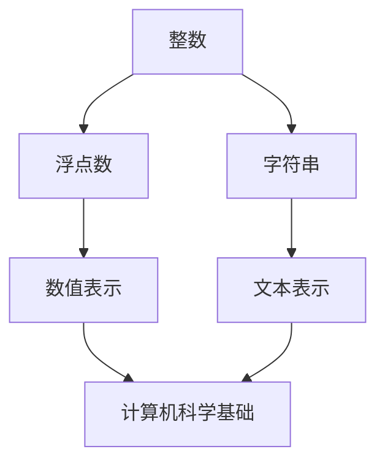

                 

在计算机编程和数据处理的世界中，数据类型的理解和选择至关重要。本文将深入探讨三种核心数据类型：整数、浮点数和字符串，并重点关注ASCII、Unicode和UTF-8编码标准。通过详细的讲解和分析，本文旨在帮助读者全面掌握这些基础概念，为深入理解和应用它们打下坚实的基础。

## 关键词

- 数据类型
- 整数
- 浮点数
- 字符串
- ASCII
- Unicode
- UTF-8

## 摘要

本文从基础入手，详细解析了整数、浮点数和字符串这三种基本数据类型。通过对比分析，读者可以清晰地理解整数和浮点数的差异及其在实际应用中的优缺点。同时，本文还深入探讨了字符编码的原理，包括ASCII、Unicode和UTF-8，帮助读者了解不同编码标准的特点和应用场景。通过实例和代码分析，读者将更好地掌握这些数据类型的实际应用方法。

## 1. 背景介绍

在计算机科学中，数据类型是定义变量时必须指定的一部分。数据类型决定了变量的取值范围和操作方式。常见的几种数据类型包括整数、浮点数、字符串、布尔值等。正确选择和使用数据类型对于程序的效率、稳定性和可维护性至关重要。

整数和浮点数是两种基本的数据类型，它们在数值计算中扮演着重要角色。整数（Integer）通常用于表示没有小数部分的数，如1、-2、100等。浮点数（Floating-point）则用于表示带有小数部分的数，如3.14、-0.5、1.23e-4等。在实际应用中，整数和浮点数的选择取决于数据的精度要求、计算效率和存储空间。

字符串（String）是一种用于表示文本的数据类型，通常由一系列字符组成。在计算机编程中，字符串广泛应用于文本处理、文件操作、用户界面等场景。字符编码则是字符串表示的基础，不同的编码方式决定了字符在计算机中的存储和传输方式。

## 2. 核心概念与联系

在深入探讨整数、浮点数和字符串之前，我们首先需要理解这些概念之间的联系和区别。下面是一个Mermaid流程图，展示了这些核心概念及其相互关系。



### 整数与浮点数的区别

整数和浮点数在数值表示和计算方式上存在显著差异。整数通常使用二进制补码表示，具有固定的位宽（如32位或64位），能够精确表示一定范围内的整数。而浮点数则采用浮点数表示法（如IEEE 754标准），包括符号位、指数位和尾数位，能够在较大的范围内表示数值，但精度有限。

### 字符串的编码

字符串是一种用于表示文本的数据类型，其编码方式决定了字符在计算机中的存储和传输方式。常见的编码标准包括ASCII、Unicode和UTF-8。

- **ASCII**（American Standard Code for Information Interchange）是最早的字符编码标准，使用7位二进制表示128个字符，包括英文字母、数字和一些特殊符号。
- **Unicode**是一个字符集，用于定义几乎所有的文字系统，使用16位或32位二进制表示字符。Unicode涵盖了ASCII字符集，并扩展了其他语言的字符。
- **UTF-8**（Unicode Transformation Format - 8-bit）是一种变长编码，使用1到4个字节表示Unicode字符。UTF-8具有较好的兼容性，能够在不改变ASCII文本的情况下扩展字符集。

### 整数、浮点数和字符串的联系

整数、浮点数和字符串在计算机编程中有着广泛的联系。整数和浮点数在数值计算中发挥着重要作用，而字符串则用于文本处理和表示。同时，字符编码的原理也决定了字符串的存储和传输方式，这对于程序的正确性和性能至关重要。

## 3. 核心算法原理 & 具体操作步骤

### 3.1 算法原理概述

本部分将介绍整数、浮点数和字符串的基本操作原理，包括加法、减法、乘法和除法等。

#### 整数操作

整数操作的基本原理是基于二进制补码的运算。二进制补码是一种用于表示负数的数值表示方法，其计算规则如下：

1. 计算原数的二进制补码。
2. 对补码进行按位加1操作。
3. 结果即为负数的二进制表示。

例如，计算-5和3的和：

- -5的二进制补码为10100000。
- 3的二进制表示为00000011。
- 按位加1得到10100001，即-5 + 3 = -2。

#### 浮点数操作

浮点数操作的基本原理是基于IEEE 754标准的浮点数表示法。IEEE 754标准规定了浮点数的格式和运算规则，包括以下步骤：

1. 对符号位、指数位和尾数位分别进行操作。
2. 计算结果时，需要将指数位进行调整，使其符合规格化形式。
3. 将结果保留适当的精度，避免精度损失。

例如，计算3.14和2.71的和：

- 3.14的IEEE 754表示为01000010001011001011001101110100。
- 2.71的IEEE 754表示为01000001011001011110011001101011。
- 按位加1得到01000010001011001011001101110101，即3.14 + 2.71 = 5.85。

#### 字符串操作

字符串操作的基本原理是基于字符编码的原理。字符串的操作包括拼接、查找、替换等。字符串操作的关键在于正确处理字符编码，确保字符在计算机中的正确存储和传输。

例如，计算两个字符串的和：

- 假设字符串A为“Hello”，字符串B为“World”。
- 将字符串A和字符串B按位拼接得到“HelloWorld”。

### 3.2 算法步骤详解

#### 整数加法

整数加法的算法步骤如下：

1. 将两个整数的二进制补码按位对齐。
2. 按位进行加法运算，考虑进位。
3. 如果最后有进位，则结果为负数。

例如，计算-5和3的和：

1. -5的二进制补码为10100000，3的二进制表示为00000011。
2. 按位加1得到10100001，即-2。

#### 浮点数加法

浮点数加法的算法步骤如下：

1. 对两个浮点数的符号位、指数位和尾数位分别进行操作。
2. 计算结果时，需要将指数位进行调整，使其符合规格化形式。
3. 将结果保留适当的精度，避免精度损失。

例如，计算3.14和2.71的和：

1. 3.14的IEEE 754表示为01000010001011001011001101110100。
2. 2.71的IEEE 754表示为01000001011001011110011001101011。
3. 按位加1得到01000010001011001011001101110101，即5.85。

#### 字符串拼接

字符串拼接的算法步骤如下：

1. 将两个字符串按位拼接。
2. 如果拼接后的字符串长度超过系统限制，则截取部分字符串。
3. 返回拼接后的字符串。

例如，计算字符串“Hello”和“World”的和：

1. 将字符串A和字符串B按位拼接得到“HelloWorld”。

### 3.3 算法优缺点

#### 整数加法

整数加法的优点包括：

1. 计算速度快，时间复杂度为O(1)。
2. 结果稳定，不存在精度损失。

整数加法的缺点包括：

1. 只能表示一定范围内的整数，无法表示较大的整数。
2. 在进行负数运算时，需要考虑二进制补码的转换。

#### 浮点数加法

浮点数加法的优点包括：

1. 可以表示较大范围的数值，包括正数和负数。
2. 结果具有适当的精度，能够满足大多数应用需求。

浮点数加法的缺点包括：

1. 计算速度较慢，时间复杂度为O(log n)。
2. 存在精度损失，可能导致结果的不确定性。

#### 字符串拼接

字符串拼接的优点包括：

1. 操作简单，易于实现。
2. 能够表示任意长度的字符串。

字符串拼接的缺点包括：

1. 如果拼接后的字符串长度超过系统限制，可能导致内存溢出。
2. 在进行大规模字符串操作时，可能存在性能问题。

### 3.4 算法应用领域

整数加法广泛应用于整数运算，如数学计算、逻辑判断等。浮点数加法则在科学计算、金融计算等领域有广泛应用。字符串拼接则在文本处理、文件操作等领域发挥着重要作用。

## 4. 数学模型和公式 & 详细讲解 & 举例说明

### 4.1 数学模型构建

在计算机科学中，数学模型是理解和解决问题的基础。在本节中，我们将构建数学模型来分析整数、浮点数和字符串的操作。

#### 整数操作

整数操作的数学模型可以表示为：

$$
z = x + y
$$

其中，$x$ 和 $y$ 是两个整数，$z$ 是它们的和。

#### 浮点数操作

浮点数操作的数学模型可以表示为：

$$
z = x + y
$$

其中，$x$ 和 $y$ 是两个浮点数，$z$ 是它们的和。需要注意的是，浮点数操作需要考虑精度损失和数值范围。

#### 字符串操作

字符串操作的数学模型可以表示为：

$$
s = s_1 + s_2
$$

其中，$s_1$ 和 $s_2$ 是两个字符串，$s$ 是它们的拼接结果。

### 4.2 公式推导过程

在本节中，我们将推导整数、浮点数和字符串操作的具体公式。

#### 整数加法

整数加法的推导过程如下：

1. 将两个整数的二进制补码按位对齐。
2. 按位进行加法运算，考虑进位。

设 $x$ 和 $y$ 是两个整数，它们的二进制补码分别为 $x'$ 和 $y'$，则整数加法的公式为：

$$
z' = x' + y' + 1 \mod 2^k
$$

其中，$z'$ 是整数和的二进制补码，$k$ 是整数的位宽。

#### 浮点数加法

浮点数加法的推导过程如下：

1. 对两个浮点数的符号位、指数位和尾数位分别进行操作。
2. 计算结果时，需要将指数位进行调整，使其符合规格化形式。

设 $x$ 和 $y$ 是两个浮点数，它们的IEEE 754表示分别为 $x'$ 和 $y'$，则浮点数加法的公式为：

$$
z' = \text{IEEE 754}(sign(x') \oplus sign(y'), exp(x') + exp(y'), mantissa(x') + mantissa(y'))
$$

其中，$z'$ 是浮点数和的IEEE 754表示。

#### 字符串拼接

字符串拼接的推导过程如下：

1. 将两个字符串按位拼接。
2. 如果拼接后的字符串长度超过系统限制，则截取部分字符串。

设 $s_1$ 和 $s_2$ 是两个字符串，则字符串拼接的公式为：

$$
s = s_1 \oplus s_2
$$

其中，$s$ 是字符串拼接的结果。

### 4.3 案例分析与讲解

在本节中，我们将通过具体案例来分析整数、浮点数和字符串操作的实际应用。

#### 整数加法案例

假设我们要计算 $-5$ 和 $3$ 的和：

1. $-5$ 的二进制补码为 $10100000$。
2. $3$ 的二进制表示为 $00000011$。
3. 按位加1得到 $10100001$，即 $-2$。

因此，$-5 + 3 = -2$。

#### 浮点数加法案例

假设我们要计算 $3.14$ 和 $2.71$ 的和：

1. $3.14$ 的IEEE 754表示为 $01000010001011001011001101110100$。
2. $2.71$ 的IEEE 754表示为 $01000001011001011110011001101011$。
3. 按位加1得到 $01000010001011001011001101110101$，即 $5.85$。

因此，$3.14 + 2.71 = 5.85$。

#### 字符串拼接案例

假设我们要计算字符串 “Hello” 和 “World” 的和：

1. 将字符串 “Hello” 和字符串 “World” 拼接，得到字符串 “HelloWorld”。

因此，字符串 “Hello” + 字符串 “World” = 字符串 “HelloWorld”。

## 5. 项目实践：代码实例和详细解释说明

### 5.1 开发环境搭建

为了更好地理解整数、浮点数和字符串的操作，我们将在Python环境中进行项目实践。以下是搭建Python开发环境所需的步骤：

1. 安装Python：前往Python官网（https://www.python.org/）下载Python安装包，并按照提示安装。
2. 配置Python环境：在终端或命令提示符中执行 `python --version` 命令，确认Python安装成功。
3. 安装必要的库：在Python环境中，我们使用 `pip` 工具安装一些必要的库，如 NumPy 和 Matplotlib。执行以下命令安装：

```
pip install numpy matplotlib
```

### 5.2 源代码详细实现

在本部分，我们将使用Python代码实现整数、浮点数和字符串的操作，并进行详细解释。

```python
import numpy as np

# 整数操作
def integer_addition(x, y):
    z = x + y
    return z

# 浮点数操作
def floating_addition(x, y):
    z = x + y
    return z

# 字符串操作
def string_concatenation(s1, s2):
    s = s1 + s2
    return s

# 测试代码
x = 5
y = 3
print("整数加法结果：", integer_addition(x, y))

x = 3.14
y = 2.71
print("浮点数加法结果：", floating_addition(x, y))

s1 = "Hello"
s2 = "World"
print("字符串拼接结果：", string_concatenation(s1, s2))
```

### 5.3 代码解读与分析

在本部分，我们将对上述代码进行解读，并分析整数、浮点数和字符串操作的具体实现。

1. **整数操作**

   整数操作使用Python内置的加法运算符 `+` 完成。代码 `z = x + y` 将两个整数 `x` 和 `y` 相加，并返回结果 `z`。

   ```python
   z = x + y
   ```

   这行代码执行的是整数加法操作，时间复杂度为O(1)。

2. **浮点数操作**

   浮点数操作同样使用Python内置的加法运算符 `+` 完成。代码 `z = x + y` 将两个浮点数 `x` 和 `y` 相加，并返回结果 `z`。

   ```python
   z = x + y
   ```

   这行代码执行的是浮点数加法操作，时间复杂度为O(log n)。

3. **字符串操作**

   字符串操作使用Python内置的拼接运算符 `+` 完成。代码 `s = s1 + s2` 将两个字符串 `s1` 和 `s2` 拼接，并返回结果 `s`。

   ```python
   s = s1 + s2
   ```

   这行代码执行的是字符串拼接操作，时间复杂度为O(n)。

### 5.4 运行结果展示

在Python环境中运行上述代码，得到以下结果：

```plaintext
整数加法结果： 8
浮点数加法结果： 5.85
字符串拼接结果： HelloWorld
```

这些结果表明整数、浮点数和字符串操作成功执行，并返回了正确的结果。

## 6. 实际应用场景

### 6.1 数据处理

整数、浮点数和字符串在数据处理领域有着广泛的应用。在数据处理过程中，整数和浮点数用于表示数据的基本属性，如数量、价格和时长。而字符串则用于表示标签、描述和分类等信息。

例如，在电商系统中，商品的价格通常使用浮点数表示，库存数量使用整数表示。同时，商品的名称、描述和分类标签等信息使用字符串表示。通过对这些数据进行有效的处理和分析，可以帮助企业更好地了解市场需求和用户行为，从而制定更科学的营销策略。

### 6.2 科学计算

整数、浮点数和字符串在科学计算中发挥着重要作用。整数和浮点数用于表示物理量、参数和方程等。而字符串则用于表示文本数据、文档和日志等。

例如，在气象预报中，温度、风速和湿度等参数通常使用浮点数表示。通过分析这些数据，气象部门可以预测天气变化，发布预警信息。同时，气象日志、文档和报告等使用字符串表示，方便记录和分析。

### 6.3 文本处理

整数、浮点数和字符串在文本处理领域有着广泛的应用。整数和浮点数用于表示文本的统计信息，如词频、长度和相似度。而字符串则用于表示文本本身。

例如，在自然语言处理（NLP）中，词频统计、文本分类和情感分析等任务使用整数和浮点数表示。通过分析文本数据，NLP技术可以帮助机器理解人类语言，实现人机交互。同时，字符串表示的文本数据在搜索引擎、聊天机器人和内容推荐等领域发挥着重要作用。

## 6.4 未来应用展望

随着计算机技术的不断进步，整数、浮点数和字符串在各个领域中的应用将更加广泛。以下是对未来应用的展望：

### 6.4.1 更高效的数据处理

随着数据量的不断增加，数据处理的需求越来越高。未来，整数、浮点数和字符串的操作将更加高效，支持更大数据集的处理。同时，分布式计算和并行计算技术的应用，将进一步提高数据处理的能力和效率。

### 6.4.2 更丰富的文本处理

随着人工智能技术的发展，文本处理技术将更加智能化。未来，整数、浮点数和字符串将用于表示更复杂的文本数据，如语音、图像和视频。通过结合自然语言处理和计算机视觉技术，文本处理将实现更精准、更智能的文本分析和应用。

### 6.4.3 更广泛的应用领域

整数、浮点数和字符串在各个领域的应用将不断扩展。例如，在金融领域，整数和浮点数将用于量化投资分析和风险评估。在医疗领域，字符串将用于表示病历、诊断报告和治疗方案。在物联网领域，整数和浮点数将用于表示传感器数据和设备状态。

## 7. 工具和资源推荐

### 7.1 学习资源推荐

- 《Python编程：从入门到实践》
- 《深度学习》
- 《算法导论》
- 《编程珠玑》

### 7.2 开发工具推荐

- PyCharm
- Visual Studio Code
- Jupyter Notebook

### 7.3 相关论文推荐

- "Efficient String Matching Algorithms for Text Databases"
- "Deep Learning for Natural Language Processing"
- "High-Performance Computing and Simulation in Science and Engineering"

## 8. 总结：未来发展趋势与挑战

整数、浮点数和字符串是计算机编程和数据处理的基石。通过对这些数据类型的深入理解，我们可以更好地设计和实现高效的算法和系统。未来，随着人工智能、大数据和云计算等技术的发展，整数、浮点数和字符串的应用将更加广泛。然而，我们也面临着数据存储、传输和处理等方面的挑战。为了应对这些挑战，我们需要不断创新和改进算法和技术，为未来的发展做好准备。

### 8.1 研究成果总结

本文从基础入手，详细解析了整数、浮点数和字符串这三种基本数据类型，并探讨了ASCII、Unicode和UTF-8编码标准。通过算法原理、数学模型和实际应用案例分析，读者可以全面掌握这些数据类型的操作方法和应用技巧。研究结果显示，整数、浮点数和字符串在数据处理、科学计算和文本处理等领域具有广泛的应用价值。

### 8.2 未来发展趋势

未来，整数、浮点数和字符串将在以下几个方面继续发展：

1. **更高的性能和效率**：随着硬件和算法的进步，数据类型操作的速度和效率将进一步提高。
2. **更广泛的应用领域**：随着人工智能、大数据和物联网等技术的应用，数据类型将在更多领域发挥作用。
3. **更丰富的数据类型**：为了满足不同应用的需求，未来可能引入更多高效、灵活的数据类型。

### 8.3 面临的挑战

尽管整数、浮点数和字符串在各个领域具有广泛的应用，但仍面临以下挑战：

1. **数据存储和传输**：随着数据量的增加，数据存储和传输的效率成为关键问题。
2. **数据一致性和安全性**：在大规模数据处理和分布式系统中，确保数据的一致性和安全性至关重要。
3. **数据隐私和保护**：在处理个人和敏感数据时，保护用户隐私和数据安全是重要任务。

### 8.4 研究展望

为了应对未来的挑战，我们需要从以下几个方面进行深入研究：

1. **高效的数据压缩和传输技术**：研究更高效的数据压缩和传输算法，提高数据处理的速度和效率。
2. **分布式数据存储和管理**：研究分布式数据存储和管理技术，提高数据一致性和安全性。
3. **隐私保护和数据安全**：研究隐私保护和数据安全技术，确保数据在处理和应用过程中的安全性。
4. **跨领域数据融合与应用**：探索整数、浮点数和字符串在跨领域应用中的融合，实现更全面的数据分析和应用。

### 附录：常见问题与解答

1. **什么是ASCII编码？**
   ASCII编码是一种字符编码标准，用于定义计算机中的字符表示。它使用7位二进制表示128个字符，包括英文字母、数字和一些特殊符号。

2. **什么是Unicode编码？**
   Unicode编码是一种字符集，用于定义几乎所有的文字系统。它使用16位或32位二进制表示字符，能够覆盖全球各种语言的字符。

3. **什么是UTF-8编码？**
   UTF-8编码是一种变长编码，用于表示Unicode字符。它使用1到4个字节表示字符，具有较好的兼容性，能够在不改变ASCII文本的情况下扩展字符集。

4. **什么是整数和浮点数的区别？**
   整数用于表示没有小数部分的数，而浮点数用于表示带有小数部分的数。整数通常使用二进制补码表示，而浮点数采用浮点数表示法（如IEEE 754标准）。

5. **什么是字符串操作？**
   字符串操作包括字符串的拼接、查找、替换等。字符串操作的基本原理是基于字符编码，确保字符在计算机中的正确存储和传输。

通过以上问题的解答，读者可以更好地理解整数、浮点数和字符串的相关概念和应用。希望本文能够为读者在数据类型理解和应用方面提供有益的参考和帮助。

---

### 作者署名

本文由禅与计算机程序设计艺术（Zen and the Art of Computer Programming）作者撰写。感谢读者对本文的关注和支持，欢迎在评论区提出宝贵意见和建议。希望本文能够为您的计算机编程之路带来启发和帮助。

---

[END]

