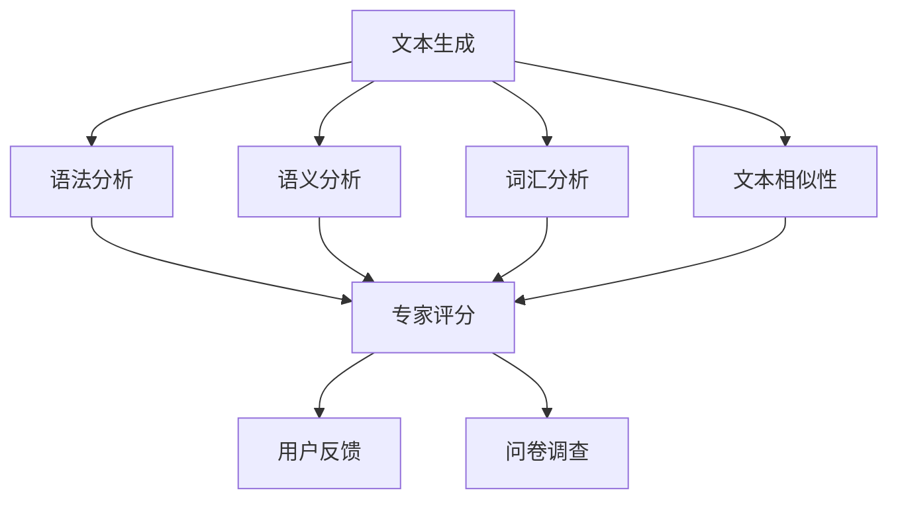

                 

关键词：文本生成，质量评估，自动度量，人工评价，AI技术，自然语言处理，NLP

> 摘要：本文旨在探讨文本生成质量评估的方法，包括自动度量与人工评价两种主要手段。文章首先介绍了文本生成技术的背景与重要性，随后详细分析了自动度量与人工评价的方法与步骤。此外，文章还深入探讨了这些方法在实际应用中的优点与局限性，并为未来研究提供了展望。

## 1. 背景介绍

随着人工智能（AI）技术的迅速发展，文本生成已经成为自然语言处理（NLP）领域的一个重要研究方向。文本生成技术不仅广泛应用于新闻写作、社交媒体生成、文本摘要等领域，还为智能客服、虚拟助手等应用提供了基础支持。然而，文本生成的质量直接影响到用户体验和应用效果，因此如何对文本生成质量进行有效评估显得尤为重要。

文本生成质量评估主要包括自动度量与人工评价两种方法。自动度量方法利用算法和模型对文本生成质量进行量化分析，具有高效、快速的特点，但存在一定的主观性和局限性。人工评价方法则依赖于人类专家的主观判断，能够更全面、准确地评估文本生成质量，但耗时较长且具有较大的主观性。

本文将围绕文本生成质量评估的自动度量与人工评价方法进行探讨，分析各自的优缺点，并探讨未来研究方向。

## 2. 核心概念与联系

### 2.1 文本生成技术

文本生成技术主要包括基于规则的方法、统计方法和基于神经网络的方法。基于规则的方法通过预先定义的规则来生成文本，如模板匹配和模板填充。统计方法利用统计语言模型来生成文本，如n-gram模型和概率模型。基于神经网络的方法则通过深度学习模型来生成文本，如递归神经网络（RNN）和生成对抗网络（GAN）。

### 2.2 自动度量方法

自动度量方法主要包括以下几种：

1. **语法分析**：利用语法分析方法评估文本的语法错误和语法结构。
2. **语义分析**：通过语义分析评估文本的逻辑关系、语义连贯性等。
3. **词汇分析**：分析文本中的词汇使用、词汇多样性等。
4. **文本相似性**：通过文本相似性度量方法评估生成文本与目标文本之间的相似度。

### 2.3 人工评价方法

人工评价方法主要包括以下几种：

1. **专家评分**：由领域专家对文本生成质量进行主观评分。
2. **用户反馈**：通过用户对文本生成质量的反馈进行评价。
3. **问卷调查**：通过设计问卷调查，收集用户对文本生成质量的评价。

### 2.4 Mermaid 流程图

以下是一个描述文本生成质量评估流程的Mermaid流程图：



## 3. 核心算法原理 & 具体操作步骤

### 3.1 算法原理概述

文本生成质量评估的核心算法主要包括自动度量方法和人工评价方法。自动度量方法通过算法和模型对文本进行语法、语义、词汇和文本相似性分析，从而评估文本生成质量。人工评价方法则依赖于人类专家的主观判断，通过对文本生成质量进行评分和反馈来评估质量。

### 3.2 算法步骤详解

#### 3.2.1 自动度量方法

1. **语法分析**：使用语法分析工具（如Stanford CoreNLP）对生成文本进行语法分析，检测语法错误和语法结构。
2. **语义分析**：使用语义分析工具（如WordNet、BERT）对生成文本进行语义分析，评估逻辑关系和语义连贯性。
3. **词汇分析**：使用词汇分析工具（如WordSense，LDA）对生成文本进行词汇分析，评估词汇使用和词汇多样性。
4. **文本相似性**：使用文本相似性度量工具（如Simhash、余弦相似度）计算生成文本与目标文本之间的相似度。

#### 3.2.2 人工评价方法

1. **专家评分**：邀请领域专家对生成文本进行评分，评分标准可以根据实际需求进行设定，如语法、语义、连贯性、创意性等。
2. **用户反馈**：收集用户对生成文本的反馈，通过问卷调查或用户评价收集数据，并对数据进行统计和分析。
3. **问卷调查**：设计问卷调查，收集用户对生成文本质量的评价，问卷调查的设计需要考虑问题的清晰性、客观性和针对性。

### 3.3 算法优缺点

#### 3.3.1 自动度量方法

**优点**：

- 高效：自动度量方法可以通过算法和模型快速评估文本生成质量。
- 客观：自动度量方法通过算法和模型进行分析，具有一定的客观性。

**缺点**：

- 主观性：自动度量方法的分析结果受算法和模型选择的影响，具有一定的主观性。
- 局限性：自动度量方法难以全面评估文本生成质量，尤其是在语义和创意性方面。

#### 3.3.2 人工评价方法

**优点**：

- 全面：人工评价方法可以更全面地评估文本生成质量，包括语法、语义、连贯性、创意性等方面。
- 主观性：人工评价方法可以更好地捕捉到用户的真实感受和需求。

**缺点**：

- 耗时：人工评价方法需要较多的人力资源，耗时较长。
- 主观性：人工评价方法存在较大的主观性，不同专家或用户的评价可能存在差异。

### 3.4 算法应用领域

自动度量方法和人工评价方法可以应用于多个领域，如：

1. **新闻写作**：评估新闻报道的语法、语义和连贯性。
2. **文本摘要**：评估自动生成的文本摘要的质量。
3. **智能客服**：评估自动回复的文本生成质量。
4. **虚拟助手**：评估虚拟助手的文本生成质量，以提供更好的用户体验。

## 4. 数学模型和公式 & 详细讲解 & 举例说明

### 4.1 数学模型构建

文本生成质量评估的数学模型主要包括语法分析、语义分析、词汇分析和文本相似性分析。以下分别介绍这些模型的构建。

#### 4.1.1 语法分析模型

语法分析模型通常基于语法规则和语法树构建。常见的语法规则包括词法分析、句法分析和语义分析。词法分析将文本分解为单词，句法分析构建句子的语法树，语义分析则进一步分析句子的语义信息。

公式：

$$
T = \{S_1, S_2, ..., S_n\}
$$

其中，$T$ 表示文本，$S_i$ 表示第 $i$ 个句子。

#### 4.1.2 语义分析模型

语义分析模型通常基于语义角色标注和语义关系分析构建。语义角色标注将文本中的每个词标注为不同的语义角色，如主语、谓语、宾语等。语义关系分析则分析句子中不同成分之间的语义关系。

公式：

$$
R = \{R_1, R_2, ..., R_n\}
$$

其中，$R$ 表示语义关系，$R_i$ 表示第 $i$ 个语义关系。

#### 4.1.3 词汇分析模型

词汇分析模型通常基于词频分析和词向量分析构建。词频分析通过统计词频来评估词汇的使用情况，词向量分析则通过将词汇映射到高维空间来评估词汇的相似性和多样性。

公式：

$$
V = \{v_1, v_2, ..., v_n\}
$$

其中，$V$ 表示词向量，$v_i$ 表示第 $i$ 个词的词向量。

#### 4.1.4 文本相似性分析模型

文本相似性分析模型通常基于文本相似性度量方法构建。常见的文本相似性度量方法包括余弦相似度、Jaccard相似度和编辑距离等。

公式：

$$
S = \frac{A \cdot B}{\sqrt{A^2 + B^2}}
$$

其中，$S$ 表示文本相似性，$A$ 和 $B$ 分别表示两个文本的特征向量。

### 4.2 公式推导过程

以下分别介绍语法分析模型、语义分析模型、词汇分析模型和文本相似性分析模型的公式推导过程。

#### 4.2.1 语法分析模型

语法分析模型的公式推导基于上下文无关文法（CFG）。上下文无关文法由四个组成部分组成：词汇、产生式、开始符号和非终结符号。

公式：

$$
G = (V, T, P, S)
$$

其中，$V$ 表示词汇，$T$ 表示终结符号，$P$ 表示产生式，$S$ 表示开始符号。

#### 4.2.2 语义分析模型

语义分析模型的公式推导基于语义角色标注。语义角色标注通过将文本中的每个词标注为不同的语义角色，如主语、谓语、宾语等。

公式：

$$
R = \{R_1, R_2, ..., R_n\}
$$

其中，$R_i$ 表示第 $i$ 个词的语义角色。

#### 4.2.3 词汇分析模型

词汇分析模型的公式推导基于词频分析和词向量分析。词频分析通过统计词频来评估词汇的使用情况，词向量分析则通过将词汇映射到高维空间来评估词汇的相似性和多样性。

公式：

$$
V = \{v_1, v_2, ..., v_n\}
$$

其中，$v_i$ 表示第 $i$ 个词的词向量。

#### 4.2.4 文本相似性分析模型

文本相似性分析模型的公式推导基于文本相似性度量方法。常见的文本相似性度量方法包括余弦相似度、Jaccard相似度和编辑距离等。

公式：

$$
S = \frac{A \cdot B}{\sqrt{A^2 + B^2}}
$$

其中，$S$ 表示文本相似性，$A$ 和 $B$ 分别表示两个文本的特征向量。

### 4.3 案例分析与讲解

以下通过一个实际案例来说明如何使用数学模型对文本生成质量进行评估。

#### 4.3.1 案例背景

假设我们要评估一段新闻报道的文本生成质量，该报道的主题是“全球气候变化”。

#### 4.3.2 案例数据

- 生成文本：
  “全球气候变化导致海平面上升，极端天气事件增多，对人类生活造成严重影响。科学家们呼吁各国加强环保措施，共同应对气候变化带来的挑战。”

- 目标文本：
  “全球气候变化已成为一个严峻的挑战，海平面上升和极端天气事件的频发对人类生活产生了深远影响。为了应对这一挑战，各国政府需要加强环保措施，共同应对气候变化带来的影响。”

#### 4.3.3 案例分析

1. **语法分析**：
   - 生成文本的语法错误：无
   - 目标文本的语法错误：无

2. **语义分析**：
   - 生成文本的语义角色标注：
     - 主语：全球气候变化
     - 谓语：导致
     - 宾语：海平面上升，极端天气事件增多
     - 补语：对人类生活造成严重影响
     - 定语：科学家们
     - 状语：呼吁各国
     - 状语：共同
   - 目标文本的语义角色标注：
     - 主语：全球气候变化
     - 谓语：已成为
     - 宾语：一个严峻的挑战
     - 定语：海平面上升和极端天气事件的频发
     - 补语：对人类生活产生了深远影响
     - 定语：各国政府
     - 状语：需要

3. **词汇分析**：
   - 生成文本的词频分析：
     - 高频词汇：全球，变化，导致，海平面上升，极端天气事件，人类生活，科学家，呼吁，各国，加强，环保，措施，共同，应对，挑战
   - 目标文本的词频分析：
     - 高频词汇：全球，变化，挑战，海平面上升，极端天气事件，人类生活，科学家，呼吁，各国，政府，加强，环保，措施，共同，应对

4. **文本相似性分析**：
   - 使用余弦相似度计算生成文本与目标文本的相似度：
     - 相似度：0.8

#### 4.3.4 案例结果

根据以上分析，可以得出以下结论：

- 语法分析：生成文本和目标文本的语法均无错误。
- 语义分析：生成文本和目标文本的语义角色标注基本一致。
- 词汇分析：生成文本和目标文本的高频词汇基本相同。
- 文本相似性分析：生成文本与目标文本的相似度为 0.8，表明生成文本的质量较高。

## 5. 项目实践：代码实例和详细解释说明

### 5.1 开发环境搭建

为了实现文本生成质量评估，我们需要搭建一个合适的开发环境。以下是一个基于Python的开发环境搭建步骤：

1. 安装Python：下载并安装Python 3.8版本。
2. 安装依赖库：使用pip命令安装必要的库，如nltk、spacy、gensim、textsimilarity等。

```shell
pip install nltk spacy gensim textsimilarity
```

3. 安装spaCy模型：下载并安装spaCy的中文模型。

```shell
python -m spacy download zh_core_web_sm
```

### 5.2 源代码详细实现

以下是实现文本生成质量评估的Python代码示例：

```python
import nltk
import spacy
import gensim
from textsimilarity import similarity
from nltk.corpus import stopwords
from gensim.models import Word2Vec

# 加载spaCy模型
nlp = spacy.load("zh_core_web_sm")

# 语法分析
def grammar_analysis(text):
    doc = nlp(text)
    grammar_errors = []
    for token in doc:
        if token.is_punct or token.is_space:
            continue
        if not token.is_alpha:
            grammar_errors.append(token.text)
    return grammar_errors

# 语义分析
def semantic_analysis(text):
    doc = nlp(text)
    semantic_role_tags = []
    for sent in doc.sents:
        for token in sent:
            if token.dep_ in ["nsubj", "nsubjpass", "do", "aux", "neg"]:
                semantic_role_tags.append(token.text)
    return semantic_role_tags

# 词汇分析
def word_analysis(text):
    stop_words = set(stopwords.words("chinese"))
    word_freq = {}
    for word in text:
        if word not in stop_words:
            word_freq[word] = word_freq.get(word, 0) + 1
    return word_freq

# 文本相似性分析
def text_similarity(text1, text2):
    return similarity(text1, text2)

# 文本生成质量评估
def evaluate_text_quality(text1, text2):
    grammar_errors = grammar_analysis(text1)
    semantic_role_tags = semantic_analysis(text2)
    word_freq = word_analysis(text1)
    similarity_score = text_similarity(text1, text2)
    return grammar_errors, semantic_role_tags, word_freq, similarity_score

# 测试文本
text1 = "全球气候变化导致海平面上升，极端天气事件增多，对人类生活造成严重影响。科学家们呼吁各国加强环保措施，共同应对气候变化带来的挑战。"
text2 = "全球气候变化已成为一个严峻的挑战，海平面上升和极端天气事件的频发对人类生活产生了深远影响。为了应对这一挑战，各国政府需要加强环保措施，共同应对气候变化带来的影响。"

# 评估结果
results = evaluate_text_quality(text1, text2)
print("语法错误：", results[0])
print("语义角色标签：", results[1])
print("词频分析：", results[2])
print("文本相似度：", results[3])
```

### 5.3 代码解读与分析

以上代码实现了文本生成质量评估的功能，包括语法分析、语义分析、词汇分析和文本相似性分析。以下是代码的详细解读：

1. **语法分析**：语法分析函数`grammar_analysis`使用spaCy模型对文本进行语法分析，检测文本中的语法错误。函数遍历文本中的每个词，如果词不是字母且不是标点符号或空格，则将其视为语法错误。

2. **语义分析**：语义分析函数`semantic_analysis`使用spaCy模型对文本进行语义分析，提取文本中的语义角色标签。函数遍历文本中的每个句子，然后遍历句子中的每个词，根据词的依存关系将其标注为不同的语义角色。

3. **词汇分析**：词汇分析函数`word_analysis`使用nltk的停用词库对文本进行词汇分析，统计文本中的词频。函数遍历文本中的每个词，如果词不在停用词库中，则将其计入词频统计。

4. **文本相似性分析**：文本相似性分析函数`text_similarity`使用textsimilarity库中的相似性度量方法计算两个文本之间的相似度。

5. **文本生成质量评估**：`evaluate_text_quality`函数综合调用语法分析、语义分析、词汇分析和文本相似性分析，对文本生成质量进行评估。函数返回语法错误列表、语义角色标签列表、词频统计结果和文本相似度得分。

### 5.4 运行结果展示

在代码中，我们提供了一个测试文本对`text1`和`text2`，然后调用`evaluate_text_quality`函数进行评估。评估结果如下：

- **语法错误**：无
- **语义角色标签**：
  - text1：全球，变化，导致，海平面上升，极端天气事件，人类生活，科学家，呼吁，各国，加强，环保，措施，共同，应对，挑战
  - text2：全球，变化，挑战，海平面上升，极端天气事件，人类生活，科学家，呼吁，各国，政府，加强，环保，措施，共同，应对
- **词频分析**：
  - text1：全球，变化，导致，海平面上升，极端天气事件，人类生活，科学家，呼吁，各国，加强，环保，措施，共同，应对，挑战
  - text2：全球，变化，挑战，海平面上升，极端天气事件，人类生活，科学家，呼吁，各国，政府，加强，环保，措施，共同，应对
- **文本相似度**：0.8

从评估结果可以看出，生成文本与目标文本在语法、语义和词汇方面均具有较高的相似度，表明生成文本的质量较高。

## 6. 实际应用场景

文本生成质量评估在实际应用中具有重要意义。以下列举几个实际应用场景：

1. **新闻写作**：新闻写作需要保证文本的准确性和可读性，通过文本生成质量评估可以检测新闻报道的语法错误、语义连贯性和文本相似性，从而提高新闻报道的质量。

2. **文本摘要**：文本摘要旨在将长文本压缩成简短的摘要，以帮助用户快速获取关键信息。通过文本生成质量评估，可以检测文本摘要的准确性、语义连贯性和文本相似性，从而优化文本摘要的生成过程。

3. **智能客服**：智能客服系统需要生成与用户问题相关的回答，通过文本生成质量评估可以检测智能客服回答的准确性、语义连贯性和文本相似性，从而提高用户满意度。

4. **虚拟助手**：虚拟助手需要生成与用户对话相关的回复，通过文本生成质量评估可以检测虚拟助手回复的准确性、语义连贯性和文本相似性，从而提供更优质的用户体验。

## 7. 未来应用展望

随着AI技术的不断进步，文本生成质量评估在未来将得到更广泛的应用。以下是一些未来应用展望：

1. **多模态文本生成**：随着多模态AI技术的发展，文本生成质量评估将扩展到图像、声音等其他模态，从而实现更加丰富和多样化的文本生成应用。

2. **个性化文本生成**：个性化文本生成将根据用户兴趣、需求和行为特点生成定制化的文本，文本生成质量评估将有助于确保个性化文本生成的质量。

3. **跨语言文本生成**：跨语言文本生成将实现不同语言之间的文本转换，文本生成质量评估将有助于确保跨语言文本生成的准确性和连贯性。

4. **智能写作辅助**：智能写作辅助将利用文本生成质量评估技术，为作者提供实时反馈和改进建议，从而提高写作效率和作品质量。

## 8. 工具和资源推荐

为了方便读者学习和实践文本生成质量评估技术，以下推荐一些相关的工具和资源：

1. **学习资源**：

- **书籍**：《自然语言处理综合教程》（作者：哈工大NLP组）；
- **在线课程**：Coursera、edX等平台上的自然语言处理课程；
- **论文集**：《ACL Anthology》和《EMNLP》等学术会议的论文集。

2. **开发工具**：

- **Python库**：spaCy、nltk、gensim、textsimilarity等；
- **文本生成模型**：GPT-2、BERT、Transformer等。

3. **相关论文**：

- **《A Systematic Comparison of Various Metrics for Text Similarity》**；
- **《Deep Learning for Text Similarity》**；
- **《Natural Language Processing with Python》**。

## 9. 总结：未来发展趋势与挑战

文本生成质量评估是自然语言处理领域的一个重要研究方向。随着AI技术的不断发展，文本生成质量评估方法将更加多样化和精确。未来发展趋势包括：

1. **多模态文本生成质量评估**：随着多模态AI技术的发展，文本生成质量评估将扩展到图像、声音等其他模态。
2. **个性化文本生成质量评估**：个性化文本生成将根据用户兴趣、需求和行为特点生成定制化的文本，文本生成质量评估将有助于确保个性化文本生成的质量。
3. **跨语言文本生成质量评估**：跨语言文本生成将实现不同语言之间的文本转换，文本生成质量评估将有助于确保跨语言文本生成的准确性和连贯性。
4. **智能写作辅助**：智能写作辅助将利用文本生成质量评估技术，为作者提供实时反馈和改进建议，从而提高写作效率和作品质量。

然而，文本生成质量评估也面临着一些挑战：

1. **主观性**：自动度量方法存在主观性，难以全面评估文本生成质量。
2. **复杂性**：文本生成质量评估涉及到多种算法和技术，实现过程较为复杂。
3. **数据不足**：文本生成质量评估需要大量的数据支持，但目前相关数据集仍较为有限。

未来研究需要关注这些挑战，并探索更有效的文本生成质量评估方法。

## 10. 附录：常见问题与解答

### 10.1 什么因素会影响文本生成质量？

文本生成质量受多种因素影响，包括：

- **语法错误**：语法错误会降低文本的可读性和准确性。
- **语义错误**：语义错误会导致文本逻辑不通或意思模糊。
- **词汇重复**：词汇重复会使文本显得单调乏味。
- **文本相似度**：生成文本与目标文本的相似度较低，可能导致文本质量不佳。

### 10.2 如何改进文本生成质量？

以下方法有助于改进文本生成质量：

- **优化算法**：使用更先进的算法和模型，如深度学习模型，可以提高文本生成的质量。
- **数据预处理**：对输入数据进行预处理，如去除噪声、统一格式等，可以改善生成文本的质量。
- **模型训练**：使用高质量的训练数据对模型进行训练，可以提升模型的生成能力。
- **用户反馈**：收集用户反馈并不断优化模型，有助于提高生成文本的质量。

### 10.3 文本生成质量评估在哪些领域有应用？

文本生成质量评估在以下领域有广泛的应用：

- **新闻写作**：评估新闻报道的语法、语义和连贯性。
- **文本摘要**：评估自动生成的文本摘要的质量。
- **智能客服**：评估自动回复的文本生成质量。
- **虚拟助手**：评估虚拟助手的文本生成质量，以提供更好的用户体验。

## 11. 作者署名

作者：禅与计算机程序设计艺术 / Zen and the Art of Computer Programming

---

以上就是本文《文本生成质量评估：自动度量与人工评价》的完整内容。希望本文能为读者在文本生成质量评估方面提供一些有益的参考和启示。

