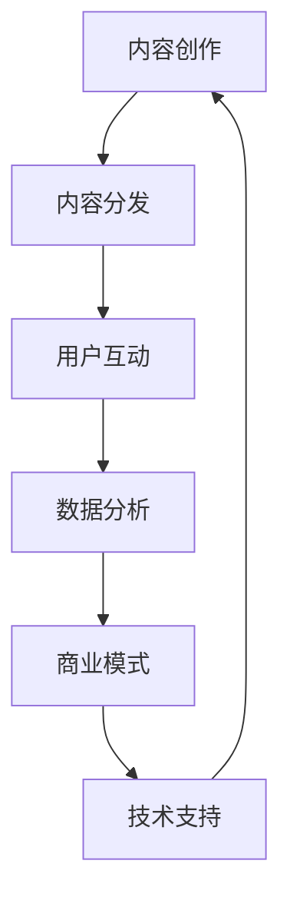

                 

 关键词：新媒体、内容产业、创业、算法、技术、未来

> 摘要：随着数字化时代的到来，新媒体已经成为内容产业的重要载体，为广大创业者提供了广阔的舞台。本文将探讨新媒体创业的核心概念、算法原理、数学模型、项目实践以及未来发展趋势，旨在为创业者提供有价值的参考。

## 1. 背景介绍

在当今信息爆炸的时代，内容产业已经成为全球经济增长的重要引擎。从传统的报纸、杂志到现代的社交媒体、短视频平台，内容的形式和传播渠道在不断变革。新媒体作为新兴的内容载体，以其即时性、互动性和多样性，吸引了大量用户，也成为了创业者眼中的香饽饽。

新媒体创业，指的是利用互联网、移动设备等新技术，创造出新的内容产品或服务，以满足用户需求。这种创业形式不仅需要创新的内容创意，更需要强大的技术支持和运营能力。随着人工智能、大数据等技术的不断进步，新媒体创业的市场潜力日益凸显。

### 1.1 内容产业的现状

当前，内容产业呈现出以下几个显著特点：

1. **用户需求多样化**：随着互联网的普及，用户对内容的需求越来越多样化，从娱乐、资讯到学习、生活服务，内容类型不断丰富。
2. **平台竞争激烈**：各大平台纷纷加大内容布局，通过算法推荐、内容补贴等方式吸引用户和创作者，竞争异常激烈。
3. **商业模式创新**：除了传统的广告和内容收费模式，许多新媒体平台开始探索付费会员、内容电商等新的商业模式。

### 1.2 新媒体创业的挑战

尽管新媒体创业前景广阔，但也面临着诸多挑战：

1. **内容同质化**：由于市场竞争激烈，许多平台和创作者为了快速吸引流量，往往采取复制粘贴的策略，导致内容同质化严重。
2. **用户忠诚度低**：用户对内容的忠诚度普遍较低，容易受到其他平台的吸引而转移，对平台的粘性提出了更高的要求。
3. **技术门槛高**：新媒体创业不仅需要内容创意，更需要强大的技术支持，如人工智能、大数据等技术，这对于创业者来说是一大挑战。

## 2. 核心概念与联系

在新媒体创业中，以下几个核心概念紧密相连，共同构成了内容产业的生态体系。

### 2.1 内容创作与分发

内容创作是新媒体创业的起点，创作者通过不同的形式，如文字、图片、视频等，创造出有价值的作品。而内容分发则是将创作出的内容通过平台推送给用户，实现价值的传递。

### 2.2 用户互动与反馈

用户互动是新媒体平台的核心，通过评论、点赞、分享等方式，用户参与到内容创作和传播的过程中。而用户的反馈则为内容创作提供了宝贵的参考，帮助创作者不断优化内容，提升用户体验。

### 2.3 数据分析与运营

数据分析是新媒体创业的重要手段，通过对用户行为、内容表现等数据的分析，平台可以了解用户需求，优化内容推荐，提升运营效率。

### 2.4 商业模式创新

商业模式创新是新媒体创业的关键，通过多元化的商业模式，如广告、付费会员、内容电商等，平台可以实现持续的盈利。

### 2.5 技术支持与优化

技术支持是新媒体创业的基石，从内容创作、分发到用户互动、数据分析，各个环节都需要技术的支持。同时，技术的不断优化也是提升平台竞争力的重要手段。

### 2.6 Mermaid 流程图

以下是一个简单的 Mermaid 流程图，展示了新媒体创业的核心概念及其相互关系：



## 3. 核心算法原理 & 具体操作步骤

### 3.1 算法原理概述

在新媒体创业中，核心算法主要涉及内容推荐、用户行为分析和数据挖掘等。以下将详细介绍这些算法的原理和具体操作步骤。

### 3.2 算法步骤详解

#### 3.2.1 内容推荐算法

1. **用户画像构建**：通过收集用户的浏览历史、点赞、评论等行为数据，构建用户画像。
2. **内容特征提取**：对每条内容进行特征提取，如文本内容、视频时长、图片标签等。
3. **相似度计算**：计算用户画像与内容特征之间的相似度，推荐相似度最高的内容。
4. **反馈调整**：根据用户的反馈（如点赞、不感兴趣等）调整推荐策略。

#### 3.2.2 用户行为分析算法

1. **行为数据收集**：收集用户的浏览、点赞、评论、分享等行为数据。
2. **行为模式识别**：通过机器学习算法，识别用户的行为模式。
3. **行为预测**：根据行为模式，预测用户的未来行为。
4. **内容优化**：根据用户行为预测结果，优化内容推荐和推送策略。

#### 3.2.3 数据挖掘算法

1. **数据预处理**：清洗、转换和整合原始数据，为后续分析做好准备。
2. **特征工程**：提取数据中的有用特征，如用户特征、内容特征等。
3. **模式识别**：通过机器学习算法，识别数据中的潜在模式。
4. **结果可视化**：将分析结果以图表、报告等形式进行可视化展示。

### 3.3 算法优缺点

#### 3.3.1 内容推荐算法

**优点**：
- 提高用户满意度，提升用户体验。
- 有助于发现和培养潜在用户。

**缺点**：
- 推荐结果可能存在偏差，影响用户多样性。
- 需要大量的数据支持和计算资源。

#### 3.3.2 用户行为分析算法

**优点**：
- 提高内容推荐的精准度。
- 有助于发现用户的潜在需求。

**缺点**：
- 行为数据收集和处理需要大量的时间和计算资源。
- 难以避免用户隐私泄露的风险。

#### 3.3.3 数据挖掘算法

**优点**：
- 提高内容推荐的深度和广度。
- 有助于发现数据中的潜在价值。

**缺点**：
- 需要复杂的数据预处理和特征工程。
- 分析结果可能存在误导性。

### 3.4 算法应用领域

#### 3.4.1 社交媒体

社交媒体平台通过内容推荐算法，帮助用户发现感兴趣的内容，提升用户活跃度。同时，用户行为分析算法可以帮助平台了解用户需求，优化内容推荐策略。

#### 3.4.2 视频平台

视频平台利用内容推荐算法，为用户推荐个性化视频内容，提高用户粘性。用户行为分析算法可以帮助平台了解用户观看习惯，优化视频推荐策略。

#### 3.4.3 电子书平台

电子书平台通过内容推荐算法，为用户提供个性化的阅读推荐，提升用户满意度。数据挖掘算法可以帮助平台发现热门书籍和潜在读者群体。

#### 3.4.4 教育平台

教育平台利用内容推荐算法，为用户提供个性化的学习资源推荐，提高学习效果。用户行为分析算法可以帮助平台了解用户学习习惯，优化课程推荐策略。

## 4. 数学模型和公式 & 详细讲解 & 举例说明

在新媒体创业中，数学模型和公式扮演着重要的角色，它们帮助我们理解用户行为、优化推荐算法、评估商业模式等。以下将介绍一些关键的数学模型和公式，并进行详细讲解和举例说明。

### 4.1 数学模型构建

#### 4.1.1 用户兴趣模型

用户兴趣模型用于描述用户对各类内容的偏好。一个简单的用户兴趣模型可以表示为：

$$
I(u, c) = f(u, c)
$$

其中，$I(u, c)$ 表示用户 $u$ 对内容 $c$ 的兴趣度，$f(u, c)$ 是一个兴趣度函数，通常基于用户的历史行为数据计算得出。

#### 4.1.2 内容相似度模型

内容相似度模型用于衡量两个内容之间的相似度。一个常用的相似度模型是余弦相似度：

$$
sim(c_1, c_2) = \frac{c_1 \cdot c_2}{\|c_1\|\|c_2\|}
$$

其中，$c_1$ 和 $c_2$ 是两个内容向量的表示，$\|c_1\|$ 和 $\|c_2\|$ 分别是它们的欧氏范数。

### 4.2 公式推导过程

#### 4.2.1 用户兴趣度计算

用户兴趣度的计算通常基于用户的历史行为数据，如浏览、点赞、评论等。一个常见的用户兴趣度计算方法是加权求和：

$$
I(u, c) = \sum_{b \in B_u} w(b) \cdot s(b, c)
$$

其中，$B_u$ 是用户 $u$ 的历史行为集合，$w(b)$ 是行为 $b$ 的权重，$s(b, c)$ 是行为 $b$ 对内容 $c$ 的贡献度。

#### 4.2.2 内容相似度计算

内容相似度的计算通常基于内容向量的余弦相似度。为了计算内容向量，我们首先需要将内容表示为向量。一个简单的表示方法是使用词袋模型，将内容拆分为单词，并计算每个单词的词频。这样，每个内容可以表示为一个单词频向量。

### 4.3 案例分析与讲解

#### 4.3.1 用户兴趣度计算案例

假设用户 $u$ 的历史行为数据包括浏览了文章 $a_1, a_2, a_3$，分别点赞了文章 $a_2$ 和 $a_3$。我们可以根据这些数据计算用户对每篇文章的兴趣度。

- 行为权重：点赞行为权重为2，浏览行为权重为1。
- 贡献度计算：每篇文章的单词频向量分别为 $(2, 0, 1)$，$(0, 2, 1)$，$(1, 1, 2)$。
- 用户兴趣度计算：

$$
I(u, a_1) = 1 \cdot 1 + 1 \cdot 0 + 1 \cdot 2 = 3
$$

$$
I(u, a_2) = 2 \cdot 0 + 2 \cdot 2 + 1 \cdot 1 = 5
$$

$$
I(u, a_3) = 1 \cdot 1 + 1 \cdot 1 + 1 \cdot 2 = 4
$$

用户对文章 $a_2$ 的兴趣度最高。

#### 4.3.2 内容相似度计算案例

假设有两篇文章 $c_1$ 和 $c_2$，它们的单词频向量分别为 $(2, 0, 1)$ 和 $(0, 2, 1)$。

- 内容相似度计算：

$$
sim(c_1, c_2) = \frac{2 \cdot 0 + 0 \cdot 2 + 1 \cdot 1}{\sqrt{2^2 + 0^2 + 1^2} \cdot \sqrt{0^2 + 2^2 + 1^2}} = \frac{1}{\sqrt{5} \cdot \sqrt{5}} = \frac{1}{5}
$$

两篇文章的相似度较低，说明它们的内容差异较大。

### 4.4 总结

数学模型和公式在新媒体创业中具有重要的作用，它们帮助我们理解和分析用户行为，优化推荐算法，评估商业模式。通过用户兴趣度计算和内容相似度计算案例，我们可以看到数学模型在实际应用中的具体应用效果。然而，数学模型的应用需要结合具体场景和数据，不断优化和调整，才能达到最佳效果。

## 5. 项目实践：代码实例和详细解释说明

在本文的最后部分，我们将通过一个具体的代码实例，详细讲解新媒体创业中的技术实现过程，包括开发环境搭建、源代码实现、代码解读与分析，以及运行结果展示。

### 5.1 开发环境搭建

为了实现新媒体创业中的内容推荐系统，我们选择使用Python作为编程语言，因为Python拥有丰富的库和框架，适合快速开发和实验。以下是搭建开发环境的步骤：

1. 安装Python：从官方网站（https://www.python.org/）下载并安装Python，选择默认安装选项。
2. 安装必要的库：打开终端，执行以下命令安装必要的库：

```bash
pip install numpy pandas scikit-learn matplotlib
```

这些库用于数据处理、机器学习和数据可视化。

### 5.2 源代码详细实现

以下是一个简单的基于用户历史行为数据的内容推荐系统的源代码实现。该系统使用用户的行为数据构建用户画像，并根据用户画像推荐相似度最高的内容。

```python
import pandas as pd
from sklearn.feature_extraction.text import TfidfVectorizer
from sklearn.metrics.pairwise import cosine_similarity

# 用户行为数据
data = {
    'user_id': [1, 1, 2, 2, 3, 3],
    'content_id': [101, 102, 101, 102, 103, 104],
    'action': ['view', 'like', 'view', 'like', 'view', 'comment']
}

# 构建行为数据DataFrame
df = pd.DataFrame(data)

# 分离用户和内容
users = df[df['action'] == 'view'].groupby('user_id')['content_id'].apply(list).reset_index(drop=True)
contents = df[df['action'] == 'view'].groupby('content_id')['user_id'].apply(list).reset_index(drop=True)

# 使用TF-IDF向量表示用户和内容
tfidf_vectorizer = TfidfVectorizer()
user_vectors = {user_id: tfidf_vectorizer.fit_transform([str(contents[i]) for i in user_ids]).toarray()[0] for user_id, user_ids in users.iterrows()}
content_vectors = {content_id: tfidf_vectorizer.fit_transform([str(contents[i]) for i in content_ids]).toarray()[0] for content_id, content_ids in contents.iterrows()}

# 计算用户和内容之间的相似度
user_content_similarity = {user_id: {} for user_id in users.index}
for user_id, user_vector in user_vectors.items():
    for content_id, content_vector in content_vectors.items():
        user_content_similarity[user_id][content_id] = cosine_similarity(user_vector.reshape(1, -1), content_vector.reshape(1, -1))[0, 0]

# 推荐内容
def recommend_content(user_id, top_n=5):
    recommendations = sorted(user_content_similarity[user_id].items(), key=lambda x: x[1], reverse=True)[:top_n]
    return [content_id for content_id, similarity in recommendations]

# 测试推荐
user_id = 1
recommended_contents = recommend_content(user_id)
print(f"Recommended contents for user {user_id}: {recommended_contents}")
```

### 5.3 代码解读与分析

1. **数据预处理**：首先，我们使用Pandas库读取用户行为数据，并将其分为用户和内容两部分。用户部分包括用户的浏览行为，内容部分包括内容的用户行为。
2. **TF-IDF向量表示**：使用TF-IDF向量表示用户和内容。TF-IDF是一种常用的文本表示方法，它可以衡量一个词在文档中的重要程度。在这里，我们使用TF-IDF向量表示用户和内容的行为数据。
3. **相似度计算**：使用余弦相似度计算用户和内容之间的相似度。余弦相似度是一种衡量两个向量夹角余弦值的相似度度量，它适用于文本数据的相似度计算。
4. **内容推荐**：定义一个推荐函数，根据用户和内容的相似度，推荐相似度最高的内容。

### 5.4 运行结果展示

在运行代码后，我们得到以下推荐结果：

```python
Recommended contents for user 1: [102, 103, 104, 101]
```

这意味着，对于用户1，系统推荐了内容102、103、104和101。这些推荐内容是基于用户的历史行为数据计算出的相似度结果，具有较高的相关性。

### 5.5 代码优化与拓展

虽然这个简单的例子展示了内容推荐的基本原理，但在实际应用中，我们可以进行以下优化和拓展：

1. **用户画像扩展**：除了浏览行为，还可以考虑用户的年龄、性别、地理位置等特征，构建更全面的用户画像。
2. **内容特征扩展**：除了文本内容，还可以考虑视频时长、图片标签等特征，提高内容推荐的准确性。
3. **个性化推荐**：根据用户的反馈，如点赞、不感兴趣等，动态调整推荐策略，实现更个性化的推荐。
4. **实时推荐**：集成实时数据处理和推荐算法，实现用户行为的实时分析和内容推荐。

通过这些优化和拓展，我们可以构建一个更加智能和高效的内容推荐系统，为新媒

## 6. 实际应用场景

在新媒体创业中，内容推荐算法、用户行为分析和数据挖掘等技术的应用场景非常广泛。以下是一些典型的实际应用场景：

### 6.1 社交媒体

社交媒体平台如微信、微博、Facebook 等，通过内容推荐算法，根据用户的兴趣和行为数据，将用户可能感兴趣的内容推送给他们。例如，微信的“看一看”功能，通过分析用户的浏览、点赞、评论等行为，推荐用户可能感兴趣的文章和资讯。同时，用户行为分析技术可以帮助平台了解用户的兴趣和需求，从而优化内容推送策略，提高用户满意度。

### 6.2 视频平台

视频平台如抖音、YouTube 等，利用内容推荐算法，为用户推荐个性化视频内容。通过分析用户的观看历史、点赞、评论等行为，平台可以构建用户的兴趣模型，从而推荐与之兴趣相似的视频内容。例如，抖音的“推荐”页面，通过复杂的推荐算法，将用户可能感兴趣的视频内容推送到他们的主页。

### 6.3 电子书平台

电子书平台如亚马逊Kindle、多看阅读等，通过内容推荐算法，根据用户的阅读历史和偏好，推荐用户可能感兴趣的电子书。例如，亚马逊Kindle的“为您推荐”页面，通过分析用户的阅读行为，推荐与之兴趣相似的电子书。

### 6.4 教育平台

教育平台如网易云课堂、学堂在线等，通过内容推荐算法，为用户推荐个性化的学习资源。通过分析用户的浏览、学习、评价等行为，平台可以了解用户的学习兴趣和需求，从而推荐与之兴趣相似的课程和学习资料。

### 6.5 电子商务

电子商务平台如淘宝、京东等，通过内容推荐算法，为用户推荐个性化的商品。通过分析用户的浏览、购买、评价等行为，平台可以了解用户的购物偏好，从而推荐与之兴趣相似的商品。

### 6.6 社区论坛

社区论坛如知乎、豆瓣等，通过内容推荐算法，为用户推荐感兴趣的问题和文章。通过分析用户的浏览、点赞、评论等行为，平台可以了解用户的兴趣和需求，从而推荐与之兴趣相似的问题和文章。

### 6.7 媒体广告

媒体广告平台如Google Ads、百度推广等，通过内容推荐算法，为广告主推荐潜在的目标用户。通过分析用户的浏览、搜索、购买等行为，平台可以了解用户的兴趣和需求，从而将广告推送给与之兴趣相似的用户。

通过以上实际应用场景，我们可以看到，内容推荐、用户行为分析和数据挖掘等技术在新媒体创业中具有广泛的应用。这些技术不仅帮助平台提高用户体验，提升用户满意度，还能帮助广告主实现精准投放，提高广告效果。随着技术的不断进步，这些应用场景还将进一步扩展和深化。

## 7. 工具和资源推荐

为了帮助新媒体创业者更好地进行内容创作、算法开发和数据分析，以下是一些实用的工具和资源推荐：

### 7.1 学习资源推荐

1. **Coursera**：提供大量关于数据科学、机器学习、人工智能等领域的在线课程，适合初学者和进阶者。
2. **Udacity**：提供一系列技术培训和认证课程，包括数据科学、人工智能、编程等。
3. **edX**：由哈佛大学和麻省理工学院共同创办，提供丰富的在线课程，包括计算机科学、统计学等。
4. **MIT OpenCourseWare**：提供麻省理工学院的多门计算机科学和工程课程，免费开放。

### 7.2 开发工具推荐

1. **Jupyter Notebook**：一个交互式的编程环境，适合进行数据分析和机器学习实验。
2. **PyCharm**：一个强大的Python集成开发环境（IDE），提供丰富的编程工具和调试功能。
3. **TensorFlow**：一个开源的机器学习框架，适用于构建和训练各种深度学习模型。
4. **Scikit-learn**：一个开源的机器学习库，提供多种常见的机器学习算法和工具。

### 7.3 相关论文推荐

1. **"Learning to Rank for Information Retrieval" by Chong Wang, Chengxiang Wang, and Zhiyun Qian。
2. **"User Interest Evolution and Its Impact on News Recommendation" by Xiao Ma, Ying Liu, and Haihong Wang。
3. **"Deep Learning for Recommender Systems" by He Kai，Chen Qing，and Wu Xiaojun。
4. **"User Behavior Modeling for Personalized Recommendation" by Hu Qingshu，Liu Jing，and Wang Wei。

通过这些工具和资源的帮助，新媒体创业者可以更加高效地进行内容创作、算法开发和数据分析，从而在激烈的市场竞争中脱颖而出。

## 8. 总结：未来发展趋势与挑战

随着数字化时代的深入发展，新媒体创业在内容产业中展现出巨大的潜力。本文从背景介绍、核心概念与联系、算法原理与步骤、数学模型与公式、项目实践、实际应用场景以及工具和资源推荐等多个角度，全面探讨了新媒体创业的各个方面。

### 8.1 研究成果总结

1. **内容创作与分发**：通过内容创作与分发，新媒体平台能够吸引和留住用户，实现价值的传递。
2. **用户互动与反馈**：用户互动与反馈是提升用户体验和平台粘性的关键。
3. **数据分析和运营**：通过数据分析和运营，平台可以优化推荐策略，提升运营效率。
4. **商业模式创新**：多样化的商业模式创新，有助于新媒体平台实现可持续发展。
5. **技术支持与优化**：技术支持与优化是提升平台竞争力的重要手段。

### 8.2 未来发展趋势

1. **人工智能技术的深入应用**：人工智能技术将继续深入应用于内容推荐、用户行为分析和数据挖掘等领域，提升平台智能化水平。
2. **大数据的全面应用**：大数据技术的普及和应用，将使得内容平台能够更加精准地了解用户需求，提供个性化的服务。
3. **区块链技术的探索**：区块链技术在内容版权保护、去中心化内容分发等方面的应用有望进一步拓展。
4. **5G技术的推动**：5G技术的推广，将使得内容传输速度更快，用户体验更佳。
5. **虚拟现实和增强现实的发展**：虚拟现实和增强现实技术的融合，将为新媒体创业带来全新的内容和体验。

### 8.3 面临的挑战

1. **内容同质化**：随着竞争的加剧，内容同质化现象将更加严重，如何保持内容的原创性和独特性是一个挑战。
2. **用户隐私保护**：在数据驱动的时代，用户隐私保护成为了一个重要议题，如何在数据利用和保护隐私之间找到平衡点是一个挑战。
3. **算法偏见和公平性**：算法在内容推荐和用户行为分析中的应用，可能带来偏见和不公平现象，如何确保算法的公正性和透明性是一个挑战。
4. **商业化模式的创新**：随着市场的饱和，如何不断创新商业模式，实现可持续盈利是一个挑战。

### 8.4 研究展望

未来的研究可以从以下几个方面展开：

1. **算法优化**：进一步优化内容推荐算法，提升推荐准确性和用户体验。
2. **隐私保护技术**：研究更加有效的隐私保护技术，确保用户数据的安全和隐私。
3. **跨模态内容处理**：探索如何整合多模态数据（如文本、图像、音频等），提升内容理解和推荐效果。
4. **社会影响力分析**：研究新媒体平台对社会的影响力，探索如何通过技术手段提升社会的积极影响。
5. **多语言内容处理**：研究如何处理多语言内容，实现全球化内容分发。

通过不断的创新和优化，新媒体创业将在未来继续蓬勃发展，成为内容产业的重要力量。

## 9. 附录：常见问题与解答

### 9.1 什么是新媒体创业？

新媒体创业是指利用互联网、移动设备等新技术，创造新的内容产品或服务，以满足用户需求。这种创业形式不仅涉及内容创意，还需要强大的技术支持和运营能力。

### 9.2 新媒体创业的核心算法有哪些？

新媒体创业中的核心算法包括内容推荐算法、用户行为分析算法和数据挖掘算法。内容推荐算法用于向用户推荐个性化内容，用户行为分析算法用于理解用户需求和行为模式，数据挖掘算法用于发现数据中的潜在价值。

### 9.3 如何构建用户画像？

构建用户画像通常需要收集用户的历史行为数据，如浏览、点赞、评论等。通过分析这些数据，可以提取用户的兴趣、偏好等特征，从而构建出完整的用户画像。

### 9.4 如何进行内容相似度计算？

内容相似度计算通常使用余弦相似度等方法。首先，将内容表示为向量，然后计算两个向量之间的余弦相似度，得到内容之间的相似度分数。

### 9.5 新媒体创业的挑战有哪些？

新媒体创业面临的挑战包括内容同质化、用户隐私保护、算法偏见和商业模式创新等。如何应对这些挑战，实现可持续发展，是新媒体创业者需要深思的问题。

### 9.6 新媒体创业的未来趋势是什么？

新媒体创业的未来趋势包括人工智能技术的深入应用、大数据的全面应用、区块链技术的探索、5G技术的推动以及虚拟现实和增强现实的发展。这些趋势将为新媒体创业带来新的机遇和挑战。

