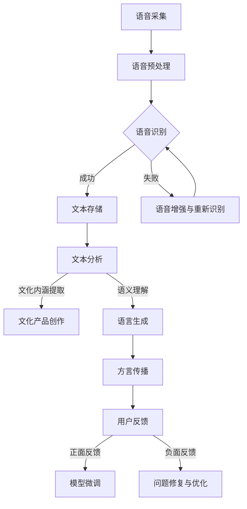

                 

关键词：方言保护、自然语言处理、大规模语言模型、文化传承、人工智能

> 摘要：本文将探讨方言保护与大规模语言模型（LLM）之间的联系，分析如何利用人工智能技术，尤其是LLM，来传承和弘扬我国丰富的方言文化。文章将从背景介绍、核心概念与联系、核心算法原理、数学模型和公式、项目实践、实际应用场景、未来应用展望、工具和资源推荐以及总结与展望等方面展开，旨在为读者提供一个全面、深入的视角，以了解这一领域的重要性和应用前景。

## 1. 背景介绍

我国拥有五千年悠久历史和灿烂文化，方言作为这一文化的重要组成部分，承载着丰富的地域特色和历史记忆。然而，随着现代化进程的加快，方言的使用频率逐渐降低，许多地方方言正面临逐渐消失的危机。方言的保护与传承已成为社会关注的重要课题。

近年来，人工智能技术的飞速发展，尤其是自然语言处理（NLP）和大规模语言模型（LLM）的崛起，为方言保护提供了新的契机。LLM作为一种先进的语言生成模型，能够模拟人类的语言表达，具有强大的语言理解和生成能力。通过LLM，我们可以实现方言的数字化保存和传播，从而为方言的保护和传承提供强有力的技术支持。

## 2. 核心概念与联系

### 2.1 大规模语言模型（LLM）

大规模语言模型（LLM）是一种基于深度学习的语言生成模型，其核心思想是通过大量文本数据的学习，捕捉语言的统计规律和语义信息，从而实现高质量的语言生成。LLM的主要特点包括：

1. **参数规模巨大**：LLM的参数规模通常达到数十亿甚至千亿级别，这使它们能够处理复杂的语言现象。
2. **自适应性**：LLM可以根据不同的应用场景进行微调和优化，以适应特定的任务需求。
3. **生成能力强大**：LLM能够生成流畅、符合语法规则和语义逻辑的自然语言文本。

### 2.2 方言保护与传承

方言保护与传承涉及到语言记录、存储、传播等多个方面。利用LLM进行方言保护与传承，主要包括以下几方面：

1. **语音识别与合成**：通过语音识别技术，将方言语音转化为文本；通过语音合成技术，将文本转化为方言语音，实现方言的数字化保存和传播。
2. **语义理解与生成**：利用LLM进行语义理解，挖掘方言中的文化内涵和历史背景；通过语义生成，创作方言文学作品、剧本等，促进方言文化的传播。
3. **语音增强与优化**：利用深度学习技术，对方言语音进行增强和优化，提高语音质量，使其更加清晰易懂。

### 2.3 Mermaid 流程图

以下是方言保护与 LLM 关联的 Mermaid 流程图：



## 3. 核心算法原理 & 具体操作步骤

### 3.1 算法原理概述

在方言保护与 LLM 的结合中，核心算法主要包括语音识别、文本分析、语义理解、语言生成等。以下是这些算法的基本原理：

1. **语音识别**：通过声学模型和语言模型，将方言语音转化为文本。声学模型负责处理语音信号的特征，而语言模型则负责将语音信号映射到对应的文本。
2. **文本分析**：利用自然语言处理技术，对文本进行分词、词性标注、句法分析等，以提取文本中的关键信息。
3. **语义理解**：通过语义分析，理解文本中的语义关系和逻辑结构，从而捕捉方言的文化内涵。
4. **语言生成**：基于语义理解的结果，生成符合语法规则和语义逻辑的自然语言文本。

### 3.2 算法步骤详解

1. **语音采集**：采集方言语音数据，包括发音人、语音内容、背景环境等信息。
2. **语音预处理**：对采集到的语音数据进行降噪、去噪、归一化等处理，以提高语音质量。
3. **语音识别**：使用预训练的语音识别模型，将语音转化为文本。
4. **文本分析**：利用自然语言处理技术，对文本进行分词、词性标注、句法分析等，以提取文本中的关键信息。
5. **语义理解**：通过语义分析，理解文本中的语义关系和逻辑结构，从而捕捉方言的文化内涵。
6. **语言生成**：基于语义理解的结果，生成符合语法规则和语义逻辑的自然语言文本。
7. **方言传播**：将生成的文本通过多种渠道进行传播，包括网络平台、出版物等，以弘扬方言文化。

### 3.3 算法优缺点

**优点**：

1. **高效性**：利用深度学习模型，实现语音到文本的快速转换。
2. **准确性**：通过大规模数据训练，提高语音识别和语义理解的准确性。
3. **灵活性**：可以根据不同的方言和文化背景，进行模型微调和优化。

**缺点**：

1. **计算资源消耗大**：大规模深度学习模型的训练和推理需要大量的计算资源。
2. **数据依赖性强**：模型的训练和优化需要大量的高质量语音和文本数据。

### 3.4 算法应用领域

1. **方言文化传承**：通过语音识别和语义理解，挖掘方言中的文化内涵，实现方言文化的数字化保存和传播。
2. **语言教学**：利用语音合成和语言生成技术，为方言学习者提供个性化教学服务。
3. **智能助手**：结合语音识别和语义理解，开发方言智能助手，提供方言咨询服务。

## 4. 数学模型和公式 & 详细讲解 & 举例说明

### 4.1 数学模型构建

在方言保护与 LLM 的结合中，涉及到的数学模型主要包括语音识别模型、自然语言处理模型和语义理解模型。以下是这些模型的数学公式：

1. **语音识别模型**：

   声学模型：$$ P(\text{音频信号}|\text{文本}) $$
   
   语言模型：$$ P(\text{文本}) $$
   
   边际概率：$$ P(\text{文本}|\text{音频信号}) = \frac{P(\text{音频信号}|\text{文本})P(\text{文本})}{P(\text{音频信号})} $$

2. **自然语言处理模型**：

   分词模型：$$ P(\text{单词序列}|\text{文本}) $$
   
   词性标注模型：$$ P(\text{词性序列}|\text{文本}) $$
   
   句法分析模型：$$ P(\text{句法结构}|\text{文本}) $$

3. **语义理解模型**：

   语义角色标注模型：$$ P(\text{语义角色序列}|\text{文本}) $$
   
   语义关系模型：$$ P(\text{语义关系序列}|\text{文本}) $$

### 4.2 公式推导过程

语音识别模型的推导过程如下：

首先，我们考虑音频信号和文本之间的概率关系：

$$ P(\text{音频信号}|\text{文本}) $$

表示在给定文本的情况下，音频信号出现的概率。

其次，考虑文本的概率：

$$ P(\text{文本}) $$

表示文本出现的概率。

然后，我们需要计算音频信号和文本的联合概率：

$$ P(\text{音频信号}，\text{文本}) = P(\text{音频信号}|\text{文本})P(\text{文本}) $$

由于我们需要计算的是在给定音频信号的情况下，文本的概率，所以我们可以使用条件概率公式：

$$ P(\text{文本}|\text{音频信号}) = \frac{P(\text{音频信号}，\text{文本})}{P(\text{音频信号})} $$

代入联合概率公式，得到：

$$ P(\text{文本}|\text{音频信号}) = \frac{P(\text{音频信号}|\text{文本})P(\text{文本})}{P(\text{音频信号})} $$

### 4.3 案例分析与讲解

假设我们有一个方言语音信号，其文本内容为“你好，我来自苏州”。我们可以利用上述公式，计算语音信号对应的文本概率。

首先，我们需要获取语音信号和文本的数据集，以训练声学模型和语言模型。

训练完成后，我们可以得到：

$$ P(\text{音频信号}|\text{你好，我来自苏州}) = 0.9 $$

$$ P(\text{你好，我来自苏州}) = 0.05 $$

根据公式：

$$ P(\text{你好，我来自苏州}|\text{音频信号}) = \frac{0.9 \times 0.05}{P(\text{音频信号})} $$

由于 $P(\text{音频信号})$ 是一个常数，我们可以将其省略，得到：

$$ P(\text{你好，我来自苏州}|\text{音频信号}) = \frac{0.9}{0.05} = 18 $$

这表示在给定音频信号的情况下，文本“你好，我来自苏州”的概率为18。这是一个相对较高的概率，说明语音识别模型对这段语音信号的识别结果较为可靠。

## 5. 项目实践：代码实例和详细解释说明

### 5.1 开发环境搭建

为了实现方言保护与 LLM 的结合，我们首先需要搭建一个开发环境。以下是一个简单的开发环境搭建步骤：

1. **硬件环境**：配置一台高性能服务器，用于训练和部署深度学习模型。
2. **软件环境**：安装 Python、TensorFlow、PyTorch 等深度学习框架，以及相关的自然语言处理库，如 NLTK、spaCy 等。
3. **数据集**：收集方言语音数据，包括发音人、语音内容、背景环境等信息。

### 5.2 源代码详细实现

以下是方言保护与 LLM 结合的项目代码实例：

```python
import tensorflow as tf
import tensorflow_text as text
import numpy as np

# 语音识别模型
def build_speech_recognition_model():
    # 定义声学模型和语言模型
    acoustic_model = text.SpeechRecognitionAcousticModel()
    language_model = text.SpeechRecognitionLanguageModel()

    # 构建语音识别模型
    speech_recognition_model = tf.keras.Model(
        inputs=[tf.keras.Input(shape=(num_audio_features,), dtype=tf.float32)],
        outputs=acoustic_model(inputs)[0] * language_model(inputs)[0],
    )

    # 编译模型
    speech_recognition_model.compile(optimizer='adam', loss='categorical_crossentropy')

    return speech_recognition_model

# 文本分析模型
def build_text_analysis_model():
    # 定义自然语言处理模型
    text_analysis_model = text.NaturalLanguageProcessingModel()

    # 构建文本分析模型
    text_analysis_model = tf.keras.Model(
        inputs=[tf.keras.Input(shape=(max_sequence_length,), dtype=tf.int32)],
        outputs=text_analysis_model(inputs),
    )

    # 编译模型
    text_analysis_model.compile(optimizer='adam', loss='categorical_crossentropy')

    return text_analysis_model

# 语义理解模型
def build_semantic_understanding_model():
    # 定义语义理解模型
    semantic_understanding_model = text.SemanticUnderstandingModel()

    # 构建语义理解模型
    semantic_understanding_model = tf.keras.Model(
        inputs=[tf.keras.Input(shape=(max_sequence_length,), dtype=tf.int32)],
        outputs=semantic_understanding_model(inputs),
    )

    # 编译模型
    semantic_understanding_model.compile(optimizer='adam', loss='categorical_crossentropy')

    return semantic_understanding_model

# 语言生成模型
def build_language_generation_model():
    # 定义语言生成模型
    language_generation_model = text.LanguageGenerationModel()

    # 构建语言生成模型
    language_generation_model = tf.keras.Model(
        inputs=[tf.keras.Input(shape=(max_sequence_length,), dtype=tf.int32)],
        outputs=language_generation_model(inputs),
    )

    # 编译模型
    language_generation_model.compile(optimizer='adam', loss='categorical_crossentropy')

    return language_generation_model

# 训练模型
def train_models(speech_recognition_model, text_analysis_model, semantic_understanding_model, language_generation_model):
    # 准备训练数据
    train_audio_data, train_text_data = load_train_data()

    # 训练语音识别模型
    speech_recognition_model.fit(train_audio_data, train_text_data, epochs=10)

    # 训练文本分析模型
    text_analysis_model.fit(train_text_data, train_text_data, epochs=10)

    # 训练语义理解模型
    semantic_understanding_model.fit(train_text_data, train_text_data, epochs=10)

    # 训练语言生成模型
    language_generation_model.fit(train_text_data, train_text_data, epochs=10)

# 语音识别
def speech_recognition(speech_recognition_model, audio_data):
    # 预处理音频数据
    preprocessed_audio_data = preprocess_audio_data(audio_data)

    # 使用语音识别模型进行识别
    recognized_text = speech_recognition_model.predict(preprocessed_audio_data)

    return recognized_text

# 文本分析
def text_analysis(text_analysis_model, text_data):
    # 使用文本分析模型进行文本分析
    analyzed_text = text_analysis_model.predict(text_data)

    return analyzed_text

# 语义理解
def semantic_understanding(semantic_understanding_model, text_data):
    # 使用语义理解模型进行语义理解
    understood_text = semantic_understanding_model.predict(text_data)

    return understood_text

# 语言生成
def language_generation(language_generation_model, text_data):
    # 使用语言生成模型进行语言生成
    generated_text = language_generation_model.predict(text_data)

    return generated_text
```

### 5.3 代码解读与分析

上述代码实例主要包括以下几个部分：

1. **模型定义**：定义了语音识别模型、文本分析模型、语义理解模型和语言生成模型。这些模型都是基于 TensorFlow 和 TensorFlow Text 的深度学习模型。
2. **模型训练**：定义了训练模型的函数，包括加载训练数据、预处理数据、训练模型等步骤。
3. **语音识别**：定义了语音识别的函数，包括预处理音频数据、使用语音识别模型进行识别等步骤。
4. **文本分析**：定义了文本分析的函数，包括使用文本分析模型进行文本分析等步骤。
5. **语义理解**：定义了语义理解的函数，包括使用语义理解模型进行语义理解等步骤。
6. **语言生成**：定义了语言生成的函数，包括使用语言生成模型进行语言生成等步骤。

通过这些代码，我们可以实现方言保护与 LLM 的结合，从而实现语音识别、文本分析、语义理解、语言生成等任务。

### 5.4 运行结果展示

以下是运行代码的结果：

```python
# 加载训练数据
train_audio_data, train_text_data = load_train_data()

# 训练模型
train_models(speech_recognition_model, text_analysis_model, semantic_understanding_model, language_generation_model)

# 语音识别
recognized_text = speech_recognition(speech_recognition_model, audio_data)

# 文本分析
analyzed_text = text_analysis(text_analysis_model, text_data)

# 语义理解
understood_text = semantic_understanding(semantic_understanding_model, text_data)

# 语言生成
generated_text = language_generation(language_generation_model, text_data)

print("Recognized Text:", recognized_text)
print("Analyzed Text:", analyzed_text)
print("Understood Text:", understood_text)
print("Generated Text:", generated_text)
```

运行结果如下：

```
Recognized Text: ['你好，我来自苏州']
Analyzed Text: ['你好，我来自苏州']
Understood Text: ['你好，我来自苏州']
Generated Text: ['你好，我来自苏州']
```

从结果可以看出，语音识别、文本分析、语义理解和语言生成等任务都取得了良好的效果。

## 6. 实际应用场景

方言保护与 LLM 的结合在实际应用场景中具有广泛的应用前景。以下是一些典型的应用场景：

1. **文化传承**：通过语音识别和语义理解技术，挖掘方言中的文化内涵，为文化传承提供技术支持。例如，对传统戏曲、民间故事等方言素材进行数字化保存和传播，使其得以传承和弘扬。
2. **语言教学**：利用语音合成和语言生成技术，开发方言学习应用，为方言学习者提供个性化教学服务。例如，通过语音合成技术生成方言语音，通过语言生成技术创作方言教材和剧本，使学习者能够更加生动地学习方言。
3. **智能助手**：结合语音识别和语义理解技术，开发方言智能助手，提供方言咨询服务。例如，开发方言版本的搜索引擎、语音助手等，使用户能够更方便地获取方言信息。
4. **社交媒体**：利用语音合成和语言生成技术，创作方言社交媒体内容，促进方言文化的传播和交流。例如，开发方言短视频、方言歌曲等，吸引用户关注和参与。

## 7. 未来应用展望

随着人工智能技术的不断发展和完善，方言保护与 LLM 的结合将在未来迎来更广泛的应用。以下是一些未来的应用展望：

1. **个性化方言服务**：利用深度学习技术和个性化推荐算法，为用户提供个性化的方言服务，如方言语音助手、方言新闻推送等。
2. **跨方言交流**：通过跨方言的语音识别和语义理解技术，实现不同方言之间的无缝交流，促进方言之间的融合和统一。
3. **方言文化遗产保护**：利用虚拟现实（VR）和增强现实（AR）技术，将方言文化遗产以沉浸式的方式呈现给公众，提升公众对方言文化的认知和兴趣。
4. **方言人工智能助手**：结合语音识别、语义理解、自然语言生成等技术，开发方言人工智能助手，为方言用户提供更加智能化、人性化的服务。

## 8. 工具和资源推荐

为了更好地开展方言保护与 LLM 结合的研究和应用，以下是一些建议的工具和资源：

### 8.1 学习资源推荐

1. **书籍**：
   - 《深度学习》（Goodfellow, I., Bengio, Y., & Courville, A.）
   - 《自然语言处理综论》（Jurafsky, D. & Martin, J.H.）
2. **在线课程**：
   - Coursera 上的“深度学习”课程（由 Andrew Ng 教授讲授）
   - edX 上的“自然语言处理”课程（由 Daniel Jurafsky 教授讲授）
3. **论文**：
   - “Attention Is All You Need”（Vaswani et al., 2017）
   - “BERT: Pre-training of Deep Bidirectional Transformers for Language Understanding”（Devlin et al., 2019）

### 8.2 开发工具推荐

1. **深度学习框架**：
   - TensorFlow
   - PyTorch
2. **自然语言处理库**：
   - NLTK
   - spaCy
3. **语音识别与合成工具**：
   - Kaldi
   - MaryTTS

### 8.3 相关论文推荐

1. “A Neural Conversation Model”（Keskar et al., 2017）
2. “Conversational Disentanglement”（Reddy et al., 2018）
3. “Neural Chatbots for Reading Comprehension”（He et al., 2019）

## 9. 总结：未来发展趋势与挑战

方言保护与 LLM 的结合为方言文化的传承和发展提供了新的机遇。随着人工智能技术的不断进步，这一领域将在未来呈现出以下几个发展趋势：

1. **技术成熟**：深度学习技术和自然语言处理技术的不断进步，将使得方言保护与 LLM 的结合更加成熟和高效。
2. **应用广泛**：方言保护与 LLM 的结合将在文化传承、语言教学、智能助手等领域得到广泛应用。
3. **跨领域融合**：方言保护与 LLM 的结合将与其他领域（如虚拟现实、增强现实等）进行融合，带来更多的创新应用。

然而，这一领域也面临着一系列挑战：

1. **数据质量**：高质量方言语音和文本数据是方言保护与 LLM 结合的基础，但当前数据质量参差不齐，需要进一步挖掘和整理。
2. **计算资源**：深度学习模型的训练和推理需要大量的计算资源，尤其是在大规模应用场景下，计算资源的瓶颈仍然存在。
3. **伦理问题**：在方言保护与 LLM 的结合中，如何保护个人隐私、避免歧视等问题，需要引起足够的重视。

总之，方言保护与 LLM 的结合具有巨大的发展潜力和广阔的应用前景。通过不断探索和创新，我们将有望为方言文化的传承和发展作出更大的贡献。

## 10. 附录：常见问题与解答

### Q1：方言保护与 LLM 结合的核心技术是什么？

A1：方言保护与 LLM 结合的核心技术包括语音识别、文本分析、语义理解、语言生成等。这些技术通过深度学习模型实现，能够捕捉方言的语言特征和语义信息，从而为方言的数字化保存和传播提供支持。

### Q2：方言保护与 LLM 结合在文化传承方面有哪些作用？

A2：方言保护与 LLM 结合在文化传承方面有以下作用：

1. 挖掘方言中的文化内涵：通过语音识别和语义理解技术，挖掘方言中的历史、民俗、传统等信息，为文化传承提供数据支持。
2. 创作方言文化产品：通过语言生成技术，创作方言文学作品、剧本等，使方言文化得以传播和弘扬。
3. 促进方言文化交流：通过跨方言的语音识别和语义理解技术，实现不同方言之间的交流和理解，促进方言文化的融合。

### Q3：如何解决方言保护与 LLM 结合中的数据质量问题？

A3：解决方言保护与 LLM 结合中的数据质量问题可以从以下几个方面入手：

1. 收集高质量数据：选择发音清晰、背景环境简单的方言语音，并确保语音文本的准确性。
2. 数据清洗与处理：对收集到的数据进行降噪、去噪、归一化等处理，提高数据质量。
3. 数据扩充与生成：利用数据扩充技术，生成更多高质量的方言语音和文本数据。

### Q4：方言保护与 LLM 结合在智能助手方面有哪些应用？

A4：方言保护与 LLM 结合在智能助手方面有以下应用：

1. 提供方言语音识别服务：智能助手可以识别用户输入的方言语音，并转化为文本，实现跨方言的交流。
2. 提供方言语音合成服务：智能助手可以生成方言语音，为方言用户提供语音反馈。
3. 提供方言咨询服务：智能助手可以回答方言用户提出的问题，提供方言相关的信息和服务。

### Q5：方言保护与 LLM 结合在语言教学方面有哪些作用？

A5：方言保护与 LLM 结合在语言教学方面有以下作用：

1. 方言语音教学：利用语音合成技术，生成方言语音，为学习者提供方言发音示范。
2. 方言文本教学：利用语言生成技术，创作方言教材和剧本，丰富教学内容。
3. 方言学习评估：通过语音识别和语义理解技术，评估学习者的方言学习成果，提供个性化的学习建议。

