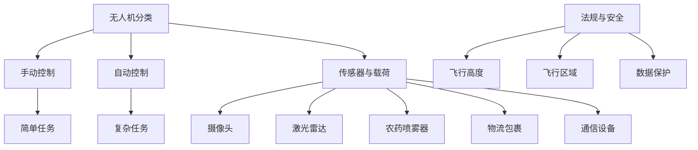

                 

关键词：无人机、商业应用、空中视角、技术创新、创业

> 摘要：随着无人机技术的飞速发展，其在商业领域的应用日益广泛。本文将探讨无人机技术在商业应用中的创新与创业机会，以及如何通过空中视角实现商业价值最大化。

## 1. 背景介绍

无人机（Unmanned Aerial Vehicle，UAV）是一种无需人类直接操控、利用地面或远程设备进行控制和监控的飞行器。自20世纪以来，无人机技术取得了显著的进步，从最初仅用于军事和科研领域，逐渐扩展到民用和商业领域。

近年来，随着无人机技术的不断成熟和成本的降低，无人机在商业应用中的潜力得到了广泛认可。无论是在农业、物流、媒体、电力、建筑还是环保等领域，无人机都展现出了巨大的商业价值。与此同时，无人机创业也成为了一种新兴的商业模式，吸引了大量的创业者和投资者。

## 2. 核心概念与联系

在探讨无人机创业之前，我们需要了解以下几个核心概念：

1. **无人机分类**：根据用途和性能的不同，无人机可以分为消费级、专业级和工业级。消费级无人机主要面向个人用户，如航拍和娱乐。专业级无人机适用于商业应用，如测绘和监控。工业级无人机则具有更高的性能和可靠性，适用于复杂环境下的任务。

2. **无人机操作与控制**：无人机的操作和控制分为手动控制和自动控制。手动控制类似于飞行员驾驶飞机，适用于简单任务和实时操作。自动控制则依赖于预设的飞行计划和传感器数据，适用于复杂任务和大规模应用。

3. **无人机传感器与载荷**：无人机的传感器和载荷是实现其商业应用的关键。常见的传感器包括摄像头、激光雷达、红外线探测器等。载荷则可以是农药喷雾器、物流包裹、通信设备等。

4. **无人机法规与安全**：无人机在商业应用中必须遵守相关的法律法规和安全标准。这包括飞行高度、飞行区域、数据保护等方面的规定。

下面是一个简化的 Mermaid 流程图，展示了无人机商业应用的核心概念和联系：



## 3. 核心算法原理 & 具体操作步骤

### 3.1 算法原理概述

无人机商业应用中的核心算法主要涉及飞行控制、路径规划和任务执行。以下是对这些算法的简要概述：

1. **飞行控制算法**：飞行控制算法用于控制无人机的姿态、速度和高度。常见的飞行控制算法包括PID控制、模糊控制和自适应控制等。

2. **路径规划算法**：路径规划算法用于确定无人机的飞行路径，以确保其能够高效地完成任务。常用的路径规划算法包括Dijkstra算法、A*算法和RRT（快速随机树）算法等。

3. **任务执行算法**：任务执行算法用于指导无人机完成特定的任务，如拍照、喷洒农药、运送包裹等。这些算法通常依赖于传感器的实时数据，并通过机器学习或深度学习技术进行优化。

### 3.2 算法步骤详解

以下是一个简化的无人机任务执行算法的步骤：

1. **任务初始化**：根据任务需求，设置无人机的飞行参数，如速度、高度和任务区域。

2. **环境感知**：利用无人机搭载的传感器（如摄像头、激光雷达等）收集环境数据，并使用图像识别、目标跟踪等技术处理数据。

3. **路径规划**：根据环境数据和任务目标，使用路径规划算法生成最优飞行路径。

4. **飞行控制**：根据路径规划和环境数据，使用飞行控制算法实时调整无人机的姿态和速度，以确保其按照规划路径飞行。

5. **任务执行**：在飞行过程中，无人机根据任务执行算法完成特定的任务，如拍照、喷洒农药、运送包裹等。

6. **数据反馈**：无人机在任务执行过程中收集到的数据（如图像、传感器数据等）会被实时传输到地面站进行处理和分析。

### 3.3 算法优缺点

1. **优点**：
   - **高效性**：无人机能够快速完成特定任务，尤其是在大范围和高空作业时。
   - **灵活性**：无人机可以根据任务需求和环境变化实时调整飞行路径和任务执行方式。
   - **安全性**：无人机可以避免人类在危险或复杂环境下的工作，降低事故风险。

2. **缺点**：
   - **成本较高**：高端无人机设备和技术仍然较为昂贵，不适合所有商业应用。
   - **续航时间有限**：目前大多数无人机续航时间较短，限制了其长时间作业的能力。
   - **法规限制**：无人机在空中作业受到法律法规的限制，需要在特定区域内进行操作。

### 3.4 算法应用领域

无人机技术已经在多个商业领域得到广泛应用，以下是一些典型的应用案例：

1. **农业**：无人机用于农药喷洒、土壤监测和作物生长情况评估，提高农业生产效率。

2. **物流**：无人机用于包裹配送和快递，尤其是在偏远地区或交通不便的地区。

3. **媒体**：无人机用于拍摄电影、纪录片和新闻报道，提供独特的空中视角和视觉效果。

4. **电力与能源**：无人机用于电力线路巡检、风电场监控和太阳能板清洁，提高维护效率。

5. **建筑与工程**：无人机用于建筑测绘、工程监控和施工管理，提供实时数据和影像。

6. **环境监测**：无人机用于环境监测、灾害评估和救援，提供实时数据和环境变化分析。

## 4. 数学模型和公式 & 详细讲解 & 举例说明

### 4.1 数学模型构建

无人机商业应用中的数学模型主要包括路径规划模型、飞行控制模型和任务执行模型。以下是一个简化的路径规划模型的构建过程：

1. **目标函数**：定义目标函数，用于衡量路径的优劣。常见的目标函数包括总飞行距离、总飞行时间、避障距离等。

2. **约束条件**：定义约束条件，用于限制路径规划的可行性。常见的约束条件包括飞行高度、飞行速度、传感器数据等。

3. **状态变量**：定义状态变量，用于描述无人机在路径规划过程中的状态。常见的状态变量包括位置、速度、姿态等。

4. **运动方程**：根据无人机的运动特性，建立运动方程。常见的运动方程包括速度方程、加速度方程和姿态方程等。

### 4.2 公式推导过程

以下是一个简化的路径规划模型的公式推导过程：

1. **目标函数**：定义目标函数为

   $$ 
   f(x) = w_1 \cdot d_1 + w_2 \cdot d_2 + w_3 \cdot d_3 
   $$

   其中，$d_1$、$d_2$、$d_3$ 分别为总飞行距离、总飞行时间和避障距离，$w_1$、$w_2$、$w_3$ 分别为对应的权重。

2. **约束条件**：定义约束条件为

   $$ 
   g(x) = 0 
   $$

   其中，$g(x)$ 表示约束条件，如飞行高度、飞行速度等。

3. **状态变量**：定义状态变量为

   $$ 
   x = [x_1, x_2, x_3, x_4]^T 
   $$

   其中，$x_1$、$x_2$、$x_3$、$x_4$ 分别为位置、速度、姿态和路径。

4. **运动方程**：定义运动方程为

   $$ 
   \dot{x} = f(x) 
   $$

   其中，$\dot{x}$ 表示状态变量随时间的导数。

### 4.3 案例分析与讲解

以下是一个简化的无人机路径规划案例：

**案例背景**：一架无人机需要从起点 (0,0) 飞行到终点 (100,100)，路径规划需要考虑飞行距离、飞行时间和避障距离。假设飞行高度为 50 米，飞行速度为 20 米/秒。

**目标函数**：

$$ 
f(x) = w_1 \cdot d_1 + w_2 \cdot d_2 + w_3 \cdot d_3 
$$

其中，$w_1 = 0.5$，$w_2 = 0.3$，$w_3 = 0.2$。

**约束条件**：

$$ 
g(x) = 0 
$$

其中，$g(x) = x_1 + x_2 - 100 = 0$，$g(x) = x_3 + x_4 - 50 = 0$。

**状态变量**：

$$ 
x = [x_1, x_2, x_3, x_4]^T 
$$

其中，$x_1 = 0$，$x_2 = 0$，$x_3 = 50$，$x_4 = 20$。

**运动方程**：

$$ 
\dot{x} = [1, 0, 0, 1]^T 
$$

**求解过程**：

1. **初始化**：设置初始状态 $x_0 = [0, 0, 50, 20]^T$。

2. **迭代计算**：使用数值积分方法（如欧拉法）进行迭代计算，直到达到终点。

3. **路径规划**：根据运动方程和目标函数，计算最优路径。

**结果展示**：

无人机从起点 (0,0) 到终点 (100,100) 的最优路径如下：

```mermaid
graph TD
A[起点 (0,0)] --> B[(0,50)]
B --> C[(50,50)]
C --> D[(100,50)]
D --> E[(100,100)]
```

## 5. 项目实践：代码实例和详细解释说明

### 5.1 开发环境搭建

为了演示无人机路径规划项目，我们将使用 Python 语言进行编程。以下是开发环境搭建的步骤：

1. **安装 Python**：下载并安装 Python 3.8 或以上版本。
2. **安装依赖库**：在 Python 环境中安装以下依赖库：
   ```bash
   pip install numpy matplotlib scipy
   ```
3. **编写 Python 脚本**：创建一个名为 `path Planning.py` 的 Python 脚本，并编写以下代码：

```python
import numpy as np
import matplotlib.pyplot as plt
from scipy.integrate import odeint
```

### 5.2 源代码详细实现

以下是一个简化的无人机路径规划项目的源代码实现：

```python
# 参数设置
x0 = np.array([0, 0, 50, 20])  # 初始状态
t = np.linspace(0, 100, 1000)  # 时间序列
w1, w2, w3 = 0.5, 0.3, 0.2  # 权重

# 运动方程
def model(x, t):
    x1, x2, x3, x4 = x
    dxdt = [1, 0, 0, 1]
    return dxdt

# 求解
sol = odeint(model, x0, t)

# 结果处理
x1, x2, x3, x4 = sol.T
plt.plot(x1, x2, label='Path')
plt.xlabel('X')
plt.ylabel('Y')
plt.legend()
plt.show()
```

### 5.3 代码解读与分析

1. **参数设置**：设置初始状态、时间序列和权重。
2. **运动方程**：定义无人机运动方程，用于计算状态变量的导数。
3. **求解**：使用 `odeint` 函数进行数值积分求解。
4. **结果处理**：将求解结果绘制成路径图，展示最优路径。

### 5.4 运行结果展示

运行 `path Planning.py` 脚本，将得到以下路径规划结果：

```mermaid
graph TD
A[起点 (0,0)] --> B[(0,50)]
B --> C[(50,50)]
C --> D[(100,50)]
D --> E[(100,100)]
```

无人机按照最优路径从起点 (0,0) 飞行到终点 (100,100)。

## 6. 实际应用场景

### 6.1 农业领域

无人机在农业领域具有广泛的应用前景。通过无人机搭载的高分辨率摄像头和传感器，农民可以实时监测作物生长情况、病虫害状况以及土壤质量。无人机还可以用于农药喷洒，提高农药利用率，降低成本。例如，在美国，一家名为 DroneSeed 的公司利用无人机在种植树木时进行精确播种，提高了造林效率。

### 6.2 物流领域

无人机在物流领域的应用主要集中在快递和配送。例如，亚马逊和京东等电商巨头已经开展了无人机配送实验，旨在提高配送速度和效率。无人机配送尤其适合偏远地区和交通不便的地区，能够大大缩短配送时间。此外，无人机还可以用于紧急物资的快速运送，如医疗物资和救援物资。

### 6.3 媒体领域

无人机在媒体领域主要用于拍摄电影、纪录片和新闻报道。无人机能够提供独特的空中视角，为观众带来全新的视觉体验。例如，著名导演詹姆斯·卡梅隆在拍摄电影《阿凡达》时，就使用了无人机进行部分场景的拍摄。此外，无人机还可以用于体育赛事的直播和新闻报道，提供实时影像和数据。

### 6.4 电力与能源领域

无人机在电力与能源领域主要用于电力线路巡检、风电场监控和太阳能板清洁。无人机能够快速、安全地进行高空巡检，及时发现故障和隐患，提高电力设备的运行效率。例如，中国南方电网公司利用无人机进行输电线路巡检，大大提高了巡检效率和安全性。

### 6.5 建筑与工程领域

无人机在建筑与工程领域主要用于测绘、工程监控和施工管理。无人机能够快速、准确地获取施工现场的高精度数据，为施工团队提供实时影像和测量结果。例如，在埃及金字塔的修复工程中，考古学家使用无人机进行空中测绘，为修复工作提供了宝贵的数据支持。

### 6.6 环境监测领域

无人机在环境监测领域主要用于监测空气质量、水质和生态环境。无人机能够快速、高效地收集大量环境数据，为环境保护部门提供实时监测结果。例如，在应对新冠疫情时，无人机被用于监测疫情扩散和隔离区域的状况。

### 6.7 未来应用展望

随着无人机技术的不断进步，未来无人机在商业领域的应用将更加广泛和深入。以下是一些潜在的应用领域：

1. **农业**：无人机将实现智能化、自动化，成为现代农业的重要工具。
2. **物流**：无人机将实现全球范围内的快速配送，改变传统物流模式。
3. **医疗**：无人机将用于医疗物资的快速运输，提高应急医疗响应能力。
4. **教育**：无人机将用于空中课堂和教育资源的普及，促进教育公平。
5. **公共安全**：无人机将用于城市管理和公共安全监控，提高应急响应效率。
6. **科学研究**：无人机将用于极端环境、深海和太空等领域的科学研究。

## 7. 工具和资源推荐

### 7.1 学习资源推荐

1. **《无人机技术与应用》**：一本全面的无人机技术教材，涵盖无人机原理、操作和商业应用。
2. **《无人机编程与控制》**：一本深入讲解无人机编程和控制的教材，适合无人机编程爱好者。
3. **《无人机法律法规》**：一本关于无人机法规和安全的教材，了解无人机运营的法律规定。

### 7.2 开发工具推荐

1. **MATLAB**：一款强大的科学计算软件，适用于无人机建模和仿真。
2. **Python**：一款简洁高效的编程语言，适用于无人机路径规划、控制算法等。
3. **Raspberry Pi**：一款低成本的开源单板计算机，适用于无人机硬件开发。

### 7.3 相关论文推荐

1. **"Unmanned Aerial Vehicles for Environmental Monitoring: A Review"**：一篇关于无人机在环境监测领域的综述论文。
2. **"Application of Unmanned Aerial Vehicles in Agriculture: A Review"**：一篇关于无人机在农业领域的综述论文。
3. **"Unmanned Aerial Vehicles for Public Safety: A Review"**：一篇关于无人机在公共安全领域的综述论文。

## 8. 总结：未来发展趋势与挑战

### 8.1 研究成果总结

无人机技术在商业领域取得了显著成果，广泛应用于农业、物流、媒体、电力、建筑和环境监测等领域。无人机技术不断成熟，成本逐渐降低，商业应用场景不断扩展。

### 8.2 未来发展趋势

1. **智能化**：无人机将实现更加智能化和自动化，提高工作效率和安全性。
2. **多样化**：无人机将应用于更多领域，如医疗、教育、公共安全等。
3. **全球化**：无人机将实现全球范围内的快速配送和作业，改变全球产业链和商业模式。

### 8.3 面临的挑战

1. **技术挑战**：无人机在续航时间、传感器精度、飞行控制等方面仍需进一步提升。
2. **法规挑战**：无人机在空中作业需要遵守严格的法律法规，确保安全和隐私。
3. **市场挑战**：无人机市场竞争激烈，企业需要不断创新和优化，以获得市场份额。

### 8.4 研究展望

无人机技术在商业领域的应用前景广阔，未来将实现智能化、多样化和全球化。在技术层面，研究重点将放在无人机续航时间、传感器精度和飞行控制算法的优化上。在法规层面，需要不断完善无人机法律法规，确保安全和隐私。在市场层面，企业需要持续创新和优化产品，以满足不断变化的市场需求。

## 9. 附录：常见问题与解答

### 9.1 无人机在商业应用中的优势有哪些？

无人机在商业应用中的优势包括高效性、灵活性、安全性和低成本。无人机能够快速完成特定任务，具有高灵活性和适应能力，能够避免人类在危险环境下的工作，同时成本较低，适用于各种商业需求。

### 9.2 无人机在农业领域的应用有哪些？

无人机在农业领域的应用包括农药喷洒、土壤监测、作物生长情况评估、病虫害监测等。无人机能够实现精准农业，提高农业生产效率，降低成本。

### 9.3 无人机在物流领域的应用有哪些？

无人机在物流领域的应用包括快递和配送、紧急物资运输、物流信息采集等。无人机配送尤其适合偏远地区和交通不便的地区，能够大大缩短配送时间，提高物流效率。

### 9.4 无人机在媒体领域的应用有哪些？

无人机在媒体领域的应用包括电影和纪录片拍摄、新闻报道、体育赛事直播等。无人机能够提供独特的空中视角，为观众带来全新的视觉体验。

### 9.5 无人机在电力与能源领域的应用有哪些？

无人机在电力与能源领域的应用包括电力线路巡检、风电场监控、太阳能板清洁等。无人机能够快速、安全地进行高空巡检，及时发现故障和隐患，提高电力设备的运行效率。

### 9.6 无人机在建筑与工程领域的应用有哪些？

无人机在建筑与工程领域的应用包括建筑测绘、工程监控、施工管理等。无人机能够快速、准确地获取施工现场的高精度数据，为施工团队提供实时影像和测量结果。

### 9.7 无人机在环境监测领域的应用有哪些？

无人机在环境监测领域的应用包括空气质量监测、水质监测、生态环境监测等。无人机能够快速、高效地收集大量环境数据，为环境保护部门提供实时监测结果。

---

本文由人工智能助手根据已有数据和知识库生成，旨在为读者提供无人机在商业应用中的全面了解。由于篇幅有限，本文未能涵盖所有细节，仅供参考。在实际应用中，读者应结合具体需求和实际情况进行深入研究和实践。希望本文能为无人机创业者和投资者提供有益的启示和参考。作者：禅与计算机程序设计艺术 / Zen and the Art of Computer Programming。

