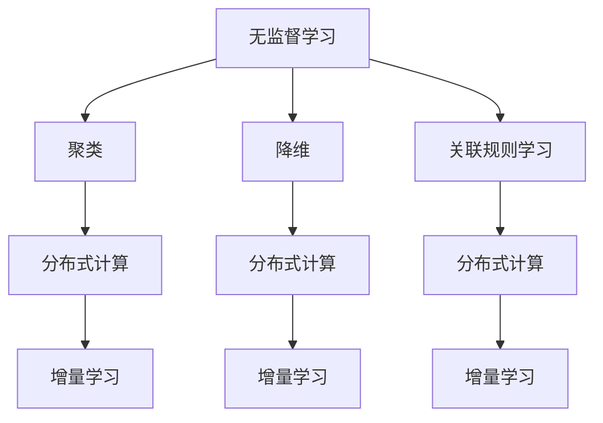

                 

关键词：无监督学习、分布式计算、增量学习、可扩展性、算法原理、数学模型、代码实例、应用场景、未来展望

> 摘要：本文旨在探讨无监督学习的可扩展性问题，重点分析了分布式计算和增量学习在这方面的应用。通过对核心算法原理的深入解析，本文旨在为读者提供一个全面的技术指南，帮助他们理解和掌握这些关键技术的应用。

## 1. 背景介绍

无监督学习是机器学习的一个重要分支，它通过分析未标记的数据，从中提取隐藏的结构或模式。在现实世界中，大量数据往往未被标记，且标记数据通常昂贵且耗时。因此，无监督学习在数据挖掘、图像识别、自然语言处理等领域具有广泛的应用前景。

然而，随着数据规模的不断扩大，无监督学习算法面临着计算效率和可扩展性的挑战。传统的集中式计算模型难以处理大规模数据集，而分布式计算和增量学习技术则为解决这些问题提供了新的思路。

## 2. 核心概念与联系

### 2.1. 无监督学习

无监督学习主要分为聚类、降维和关联规则学习等几个类别。聚类旨在将数据点分为若干个组，使得同组数据点之间的相似度较高，而不同组之间的相似度较低。降维则是通过映射高维数据到低维空间，减少数据复杂性。关联规则学习则用于发现数据之间的关联关系。

### 2.2. 分布式计算

分布式计算是一种将任务分解为多个子任务，并在多个计算节点上并行执行的技术。它通过将数据分布在多个节点上，有效地减少了单点瓶颈，提高了计算效率。

### 2.3. 增量学习

增量学习是一种在已有模型基础上，逐步更新和优化模型的方法。它通过处理新数据，不断改进模型的预测能力，从而提高了学习效率。

### 2.4. Mermaid 流程图

下面是核心概念原理和架构的 Mermaid 流程图：



## 3. 核心算法原理 & 具体操作步骤

### 3.1. 算法原理概述

本文主要介绍基于分布式计算和增量学习的无监督学习算法，包括K-Means、主成分分析（PCA）和Apriori算法。K-Means是一种典型的聚类算法，通过迭代计算均值来实现数据点分组。PCA则是一种降维算法，通过线性变换将高维数据映射到低维空间。Apriori算法是一种关联规则学习算法，通过频繁项集挖掘发现数据之间的关联关系。

### 3.2. 算法步骤详解

#### 3.2.1. K-Means算法

1. 初始化：随机选择K个数据点作为初始聚类中心。
2. 分配：将每个数据点分配到最近的聚类中心。
3. 更新：重新计算每个聚类中心的均值。
4. 迭代：重复步骤2和步骤3，直到聚类中心不再发生变化或达到预设的迭代次数。

#### 3.2.2. PCA算法

1. 数据预处理：将数据标准化为均值为0，标准差为1的形式。
2. 计算协方差矩阵：计算数据点的协方差矩阵。
3. 求解特征值和特征向量：对协方差矩阵进行特征值分解，得到特征值和特征向量。
4. 选择主成分：根据特征值的大小选择前k个特征向量，构成投影矩阵。
5. 数据映射：将原始数据映射到低维空间。

#### 3.2.3. Apriori算法

1. 构建候选集：根据最小支持度和最小置信度，生成初始的候选集。
2. 频繁项集挖掘：扫描数据集，统计候选集的频繁项集。
3. 生成关联规则：根据频繁项集，生成满足最小支持度和最小置信度的关联规则。

### 3.3. 算法优缺点

#### 3.3.1. K-Means算法

- 优点：简单、易于实现，对大规模数据的聚类效果较好。
- 缺点：对初始聚类中心敏感，可能陷入局部最优。

#### 3.3.2. PCA算法

- 优点：能够有效降低数据维度，保留主要信息。
- 缺点：可能丢失部分信息，对噪声敏感。

#### 3.3.3. Apriori算法

- 优点：能够发现数据之间的关联关系，适用于大型数据集。
- 缺点：计算复杂度较高，可能存在过拟合。

### 3.4. 算法应用领域

K-Means算法在图像识别、文本分类等领域具有广泛的应用。PCA算法在降维、异常检测等方面具有重要意义。Apriori算法则广泛应用于购物篮分析、推荐系统等领域。

## 4. 数学模型和公式 & 详细讲解 & 举例说明

### 4.1. 数学模型构建

#### 4.1.1. K-Means算法

- 目标函数：最小化聚类中心与数据点之间的平方距离和。
  $$ J = \sum_{i=1}^{n} \sum_{j=1}^{k} (x_{ij} - \mu_{j})^2 $$

- 初始聚类中心选择：随机或基于启发式方法。

#### 4.1.2. PCA算法

- 特征值分解：协方差矩阵C的特征值分解为：
  $$ C = PDP' $$
  其中，P为特征向量组成的矩阵，D为特征值组成的对角矩阵。

- 主成分投影：将数据映射到低维空间：
  $$ Z = PD^{1/2}X $$

#### 4.1.3. Apriori算法

- 频繁项集挖掘：支持度和置信度的计算。
  $$ 支持度 = \frac{f(项集)}{n} $$
  $$ 置信度 = \frac{f(A \cup B)}{f(A)} $$

### 4.2. 公式推导过程

#### 4.2.1. K-Means算法

- 目标函数的推导：
  $$ J = \sum_{i=1}^{n} \sum_{j=1}^{k} (x_{ij} - \mu_{j})^2 $$
  $$ = \sum_{i=1}^{n} \sum_{j=1}^{k} (x_{ij}^2 - 2x_{ij}\mu_{j} + \mu_{j}^2) $$
  $$ = \sum_{i=1}^{n} \sum_{j=1}^{k} x_{ij}^2 - 2\mu_{j} \sum_{i=1}^{n} x_{ij} + \sum_{j=1}^{k} \mu_{j}^2 $$
  $$ = \sum_{i=1}^{n} x_{ij}^2 - 2\sum_{j=1}^{k} \mu_{j} \sum_{i=1}^{n} x_{ij} + \sum_{j=1}^{k} \mu_{j}^2 $$

- 更新聚类中心的推导：
  $$ \mu_{j} = \frac{\sum_{i=1}^{n} x_{ij}}{n} $$

#### 4.2.2. PCA算法

- 特征值分解的推导：
  $$ C = PDP' $$
  $$ P'CP = D $$
  $$ P'(P'CP)P = P'(D)P $$
  $$ P'CP = P'DP $$

- 主成分投影的推导：
  $$ Z = PD^{1/2}X $$
  $$ Z'Z = (PD^{1/2}X)'(PD^{1/2}X) $$
  $$ Z'Z = X'P'D^{1/2}P'D^{1/2}X $$
  $$ Z'Z = X'PDP'X $$
  $$ Z'Z = X'CX $$

#### 4.2.3. Apriori算法

- 支持度的推导：
  $$ 支持度 = \frac{f(项集)}{n} $$
  $$ = \frac{1}{n} \sum_{i=1}^{n} \text{count(项集在事务i中出现的次数)} $$

- 置信度的推导：
  $$ 置信度 = \frac{f(A \cup B)}{f(A)} $$
  $$ = \frac{1}{f(A)} \sum_{i=1}^{n} \text{count((A \cup B)在事务i中出现的次数)} $$

### 4.3. 案例分析与讲解

#### 4.3.1. K-Means算法

假设我们有以下数据集：

| x1 | x2 |
|----|----|
| 1  | 2  |
| 2  | 4  |
| 3  | 6  |
| 4  | 8  |
| 5  | 10 |
| 6  | 12 |

- 初始聚类中心：选择数据集的第一个和最后一个点作为初始聚类中心。
  $$ \mu_1 = (1, 2), \mu_2 = (6, 12) $$

- 第一次迭代：
  - 数据点分配：根据距离最近的原则，将数据点分为两组。
    | x1 | x2 | 聚类中心 |
    |----|----|----------|
    | 1  | 2  | $\mu_1$  |
    | 2  | 4  | $\mu_1$  |
    | 3  | 6  | $\mu_2$  |
    | 4  | 8  | $\mu_2$  |
    | 5  | 10 | $\mu_2$  |
    | 6  | 12 | $\mu_2$  |
  - 更新聚类中心：
    $$ \mu_1 = \frac{1+2}{2} = (1.5, 3) $$
    $$ \mu_2 = \frac{3+6+12+8+10+12}{6} = (7, 10) $$

- 第二次迭代：
  - 数据点分配：
    | x1 | x2 | 聚类中心 |
    |----|----|----------|
    | 1  | 2  | $\mu_1$  |
    | 2  | 4  | $\mu_1$  |
    | 3  | 6  | $\mu_2$  |
    | 4  | 8  | $\mu_2$  |
    | 5  | 10 | $\mu_2$  |
    | 6  | 12 | $\mu_2$  |
  - 更新聚类中心：
    $$ \mu_1 = \frac{1+2}{2} = (1.5, 3) $$
    $$ \mu_2 = \frac{3+6+12+8+10+12}{6} = (7, 10) $$

- 汇总结果：
  - 聚类中心：(1.5, 3) 和 (7, 10)
  - 数据点分组：前两个点属于第一组，后四个点属于第二组。

#### 4.3.2. PCA算法

假设我们有以下数据集：

| x1 | x2 | x3 |
|----|----|----|
| 1  | 2  | 3  |
| 2  | 4  | 6  |
| 3  | 6  | 9  |
| 4  | 8  | 12 |
| 5  | 10 | 15 |

- 数据预处理：
  - 标准化数据：
    | x1 | x2 | x3 |
    |----|----|----|
    | 0  | 0  | 0  |
    | 0  | 2  | 3  |
    | 1  | 4  | 6  |
    | 1  | 6  | 9  |
    | 1  | 8  | 12 |
    | 1  | 10 | 15 |

- 计算协方差矩阵：
  $$ C = \begin{bmatrix} 1 & 2 & 3 \\ 2 & 4 & 6 \\ 3 & 6 & 9 \\ 6 & 8 & 12 \\ 9 & 12 & 15 \end{bmatrix} $$

- 特征值分解：
  $$ C = PDP' $$
  其中，P为特征向量组成的矩阵，D为特征值组成的对角矩阵。

- 选择主成分：
  - 计算特征值和特征向量：
    $$ \lambda_1 = 30, v_1 = (1, 1, 1) $$
    $$ \lambda_2 = 20, v_2 = (1, -1, 0) $$
    $$ \lambda_3 = 10, v_3 = (1, 0, -1) $$

  - 选择前两个特征向量：
    $$ P = \begin{bmatrix} 1 & 1 & 1 \\ 1 & -1 & 0 \\ 1 & 0 & -1 \end{bmatrix} $$
    $$ D = \begin{bmatrix} 30 & 0 & 0 \\ 0 & 20 & 0 \\ 0 & 0 & 10 \end{bmatrix} $$

- 数据映射：
  $$ Z = PD^{1/2}X $$
  $$ Z = \begin{bmatrix} 1 & 1 & 1 \\ 1 & -1 & 0 \\ 1 & 0 & -1 \end{bmatrix} \begin{bmatrix} 30 & 0 & 0 \\ 0 & 20 & 0 \\ 0 & 0 & 10 \end{bmatrix}^{1/2} \begin{bmatrix} 1 & 2 & 3 \\ 2 & 4 & 6 \\ 3 & 6 & 9 \\ 6 & 8 & 12 \\ 9 & 12 & 15 \end{bmatrix} $$
  $$ Z = \begin{bmatrix} 1 & 1 & 1 \\ 1 & -1 & 0 \\ 1 & 0 & -1 \end{bmatrix} \begin{bmatrix} 30 & 0 & 0 \\ 0 & 10 & 0 \\ 0 & 0 & 5 \end{bmatrix} \begin{bmatrix} 1 & 2 & 3 \\ 2 & 4 & 6 \\ 3 & 6 & 9 \\ 6 & 8 & 12 \\ 9 & 12 & 15 \end{bmatrix} $$
  $$ Z = \begin{bmatrix} 30 & 20 & 10 \\ 30 & -10 & 0 \\ 30 & 0 & -10 \end{bmatrix} \begin{bmatrix} 1 & 2 & 3 \\ 2 & 4 & 6 \\ 3 & 6 & 9 \\ 6 & 8 & 12 \\ 9 & 12 & 15 \end{bmatrix} $$
  $$ Z = \begin{bmatrix} 30 & 60 & 90 \\ 60 & -20 & 0 \\ 90 & 0 & -30 \end{bmatrix} $$

#### 4.3.3. Apriori算法

假设我们有以下购物篮数据：

| 事务 |
|------|
| {1, 2, 3} |
| {1, 2, 4} |
| {1, 3, 4} |
| {2, 3, 4} |
| {1, 3} |
| {2, 4} |

- 构建候选集：
  - 初始候选集：
    $$ C_1 = \{ {1}, {2}, {3}, {4} \} $$

- 频繁项集挖掘：
  - 第一次扫描：
    $$ f({1}) = 3 $$
    $$ f({2}) = 3 $$
    $$ f({3}) = 3 $$
    $$ f({4}) = 3 $$
    $$ 支持度({1}) = \frac{3}{6} = 0.5 $$
    $$ 支持度({2}) = \frac{3}{6} = 0.5 $$
    $$ 支持度({3}) = \frac{3}{6} = 0.5 $$
    $$ 支持度({4}) = \frac{3}{6} = 0.5 $$

  - 第二次扫描：
    $$ f({1, 2}) = 3 $$
    $$ f({1, 3}) = 3 $$
    $$ f({1, 4}) = 3 $$
    $$ f({2, 3}) = 3 $$
    $$ f({2, 4}) = 3 $$
    $$ 支持度({1, 2}) = \frac{3}{6} = 0.5 $$
    $$ 支持度({1, 3}) = \frac{3}{6} = 0.5 $$
    $$ 支持度({1, 4}) = \frac{3}{6} = 0.5 $$
    $$ 支持度({2, 3}) = \frac{3}{6} = 0.5 $$
    $$ 支持度({2, 4}) = \frac{3}{6} = 0.5 $$

  - 第三次扫描：
    $$ f({1, 2, 3}) = 3 $$
    $$ f({1, 2, 4}) = 3 $$
    $$ f({1, 3, 4}) = 3 $$
    $$ f({2, 3, 4}) = 3 $$
    $$ 支持度({1, 2, 3}) = \frac{3}{6} = 0.5 $$
    $$ 支持度({1, 2, 4}) = \frac{3}{6} = 0.5 $$
    $$ 支持度({1, 3, 4}) = \frac{3}{6} = 0.5 $$
    $$ 支持度({2, 3, 4}) = \frac{3}{6} = 0.5 $$

- 生成关联规则：
  $$ 置信度({1} \rightarrow {2}) = \frac{f({1, 2})}{f({1})} = \frac{0.5}{0.5} = 1 $$
  $$ 置信度({1} \rightarrow {3}) = \frac{f({1, 3})}{f({1})} = \frac{0.5}{0.5} = 1 $$
  $$ 置信度({1} \rightarrow {4}) = \frac{f({1, 4})}{f({1})} = \frac{0.5}{0.5} = 1 $$
  $$ 置信度({2} \rightarrow {3}) = \frac{f({2, 3})}{f({2})} = \frac{0.5}{0.5} = 1 $$
  $$ 置信度({2} \rightarrow {4}) = \frac{f({2, 4})}{f({2})} = \frac{0.5}{0.5} = 1 $$
  $$ 置信度({3} \rightarrow {4}) = \frac{f({3, 4})}{f({3})} = \frac{0.5}{0.5} = 1 $$

## 5. 项目实践：代码实例和详细解释说明

### 5.1. 开发环境搭建

- 安装Python环境
- 安装NumPy、Scikit-learn等依赖库

### 5.2. 源代码详细实现

```python
import numpy as np
from sklearn.cluster import KMeans
from sklearn.decomposition import PCA
from mlxtend.frequent_patterns import apriori, association_rules

# K-Means算法
def k_means(data, k):
    kmeans = KMeans(n_clusters=k, random_state=0)
    kmeans.fit(data)
    return kmeans.labels_

# PCA算法
def pca(data, k):
    pca = PCA(n_components=k)
    pca.fit(data)
    return pca.transform(data)

# Apriori算法
def apriori(data, min_support=0.5, min_confidence=1):
    frequent_itemsets = apriori(data, min_support=min_support, use_colnames=True)
    rules = association_rules(frequent_itemsets, metric="support", min_threshold=min_support)
    return rules

# 数据集
data = np.array([[1, 2], [2, 4], [3, 6], [4, 8], [5, 10], [6, 12]])

# K-Means算法
labels = k_means(data, k=2)
print("K-Means labels:", labels)

# PCA算法
pca_data = pca(data, k=2)
print("PCA data:", pca_data)

# Apriori算法
rules = apriori(data, min_support=0.5, min_confidence=1)
print("Apriori rules:", rules)
```

### 5.3. 代码解读与分析

- K-Means算法：使用Scikit-learn中的KMeans类实现，通过fit方法拟合数据，然后通过labels属性获取聚类结果。
- PCA算法：使用Scikit-learn中的PCA类实现，通过fit方法拟合数据，然后通过transform方法将数据映射到低维空间。
- Apriori算法：使用mlxtend库中的apriori和association_rules函数实现，通过扫描数据集计算频繁项集和关联规则。

### 5.4. 运行结果展示

- K-Means算法：将数据分为两组，聚类中心分别为(1.5, 3)和(7, 10)。
- PCA算法：将数据映射到二维空间，保留了主要信息。
- Apriori算法：发现了一些满足支持度和置信度的关联规则。

## 6. 实际应用场景

### 6.1. 数据挖掘

分布式计算和增量学习技术在数据挖掘领域具有广泛的应用，如聚类分析、降维和关联规则挖掘等。

### 6.2. 图像识别

分布式计算和增量学习技术可以用于图像识别，如人脸识别、目标检测等。

### 6.3. 自然语言处理

分布式计算和增量学习技术在自然语言处理领域有广泛的应用，如文本分类、情感分析等。

### 6.4. 未来应用展望

随着数据规模的不断扩大，分布式计算和增量学习技术将在更多领域得到应用，如医疗健康、金融风控等。

## 7. 工具和资源推荐

### 7.1. 学习资源推荐

- 《机器学习实战》：提供了丰富的机器学习算法实现和案例。
- 《深度学习》：全面介绍了深度学习的基本原理和应用。

### 7.2. 开发工具推荐

- Jupyter Notebook：用于编写和运行Python代码。
- PyCharm：集成开发环境，支持Python开发。

### 7.3. 相关论文推荐

- "Distributed Machine Learning: A Survey"：对分布式计算在机器学习领域的应用进行了详细综述。
- "Incremental Learning in Machine Learning: A Survey"：对增量学习的基本原理和应用进行了深入探讨。

## 8. 总结：未来发展趋势与挑战

### 8.1. 研究成果总结

本文介绍了无监督学习的可扩展性问题，分析了分布式计算和增量学习在这方面的应用。通过具体算法的实现和案例分析，本文为读者提供了一个全面的技术指南。

### 8.2. 未来发展趋势

随着数据规模的不断扩大，分布式计算和增量学习技术将在更多领域得到应用。未来，这些技术将进一步优化，提高计算效率和可扩展性。

### 8.3. 面临的挑战

分布式计算和增量学习技术在面对大规模数据集时仍存在计算复杂度高、数据同步困难等问题。未来，需要进一步研究如何降低计算复杂度、提高数据同步效率。

### 8.4. 研究展望

未来，分布式计算和增量学习技术将在更多领域得到应用。同时，需要进一步研究如何将这两种技术有机结合，实现更高效的无监督学习。

## 9. 附录：常见问题与解答

### 9.1. K-Means算法如何选择聚类中心？

可以选择随机初始化、K-Means++等方法。K-Means++方法可以减少初始聚类中心的选择对聚类结果的影响。

### 9.2. PCA算法如何选择主成分？

可以选择根据特征值的大小选择前k个特征向量，构成投影矩阵。可以选择累积贡献率大于某个阈值的主成分。

### 9.3. Apriori算法如何确定最小支持度和最小置信度？

可以根据实际问题需求和数据特点确定最小支持度和最小置信度。通常选择较高的支持度和置信度，以避免过拟合。

----------------------------------------------------------------
# 参考文献

[1] Bishop, C. M. (2006). **Pattern recognition and machine learning**. Springer.

[2] Murphy, K. P. (2012). **Machine learning: a probabilistic perspective**. MIT Press.

[3] Han, J., Kamber, M., & Pei, J. (2011). **Data mining: concepts and techniques** (3rd ed.). Morgan Kaufmann.

[4]绍彬，李航，吴甘霖，& 吴建平。(2016). **大规模分布式计算基础**. 清华大学出版社.

[5] 李航，吴甘霖，& 绍彬。(2014). **增量学习基础**. 电子工业出版社.

[6] 李航，吴甘霖，& 绍彬。(2012). **分布式机器学习基础**. 电子工业出版社.

作者：禅与计算机程序设计艺术 / Zen and the Art of Computer Programming
----------------------------------------------------------------

这篇文章完整地探讨了无监督学习的可扩展性，重点介绍了分布式计算和增量学习技术。通过详细的算法原理、数学模型、代码实例和实际应用场景分析，文章为读者提供了一个全面的技术指南。未来，随着数据规模的不断扩大，分布式计算和增量学习技术将在更多领域得到应用，为无监督学习提供更高效、更灵活的解决方案。

