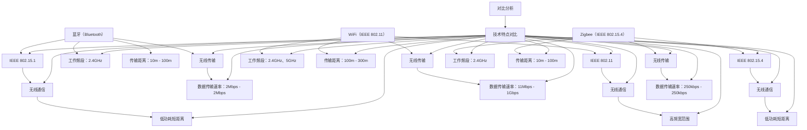

                 

关键词：无线通信协议，Bluetooth，WiFi，Zigbee，比较分析

摘要：本文将从技术、应用和性能等多个维度，深入探讨蓝牙（Bluetooth）、WiFi 和 Zigbee 这三种常见的无线通信协议。通过比较其工作原理、传输速率、覆盖范围、功耗等方面，为读者提供一个全面的无线通信协议比较分析，帮助读者了解和选择最适合自己需求的无线通信技术。

## 1. 背景介绍

无线通信协议在现代社会中扮演着至关重要的角色，从智能家居、物联网到移动设备，它们都是不可或缺的技术支撑。蓝牙（Bluetooth）、WiFi 和 Zigbee 是三种广泛应用的无线通信协议，它们各自拥有独特的优势和特点，为不同的应用场景提供了多样化的选择。

### 1.1 Bluetooth

蓝牙（Bluetooth）是一种短距离无线通信技术，最初由瑞典爱立信公司于1994年提出。它主要用于设备之间的数据传输，如手机与耳机、手机与汽车等。蓝牙技术经历了多个版本迭代，从最早的1.0版本到如今的5.3版本，传输速率和稳定性得到了显著提升。

### 1.2 WiFi

WiFi（Wireless Fidelity）是一种基于IEEE 802.11标准的高频无线通信技术，广泛应用于无线局域网（WLAN）和家庭无线网络。WiFi 的传输速率和覆盖范围较蓝牙更为广泛，适用于移动设备、计算机和智能家居设备之间的通信。

### 1.3 Zigbee

Zigbee 是一种低功耗、短距离的无线通信协议，基于IEEE 802.15.4标准。它主要用于物联网（IoT）设备之间的通信，如传感器、智能灯泡、智能门锁等。Zigbee 的特点是低功耗、低成本和高可靠性，非常适合大规模物联网应用。

## 2. 核心概念与联系

为了更好地理解这三种无线通信协议，我们首先需要了解它们的工作原理、协议栈结构以及核心技术特点。以下是一个简化的 Mermaid 流程图，用于描述这三种协议的基本原理和联系。



### 2.1 工作原理

蓝牙（Bluetooth）采用主从模式，即有一个设备作为主设备（Master），其他设备作为从设备（Slave）。主设备负责协调连接、数据传输等操作。

WiFi 采用分布式系统，所有设备都可以充当接入点（Access Point），实现无线局域网（WLAN）的覆盖。设备之间通过无线信号进行通信。

Zigbee 采用星型或网状网络结构，每个设备既可以作为协调器（Coordinator），也可以作为路由器（Router）或终端设备（End Device）。协调器负责管理网络，路由器负责传输数据，终端设备负责感知和执行任务。

### 2.2 协议栈结构

蓝牙、WiFi 和 Zigbee 都采用分层协议栈结构，包括物理层、数据链路层和网络层等。

- 物理层：负责无线信号的传输和接收，包括调制、解调、编码、解码等。
- 数据链路层：负责数据帧的组装、传输、错误检测和纠正等。
- 网络层：负责网络拓扑结构的管理、路由选择、地址分配等。

## 3. 核心算法原理 & 具体操作步骤

### 3.1 算法原理概述

蓝牙、WiFi 和 Zigbee 在核心算法原理上有所不同。

- **蓝牙（Bluetooth）**：采用时分双工（Time Division Duplexing，TDD）技术，将时间划分为若干个时隙，设备在不同时隙进行发送和接收操作。
- **WiFi（IEEE 802.11）**：采用频分双工（Frequency Division Duplexing，FDD）技术，将频率划分为多个信道，设备在不同信道进行发送和接收操作。
- **Zigbee（IEEE 802.15.4）**：采用直接序列扩频（Direct Sequence Spread Spectrum，DSSS）技术，通过增加冗余信息提高传输可靠性。

### 3.2 算法步骤详解

- **蓝牙（Bluetooth）**：

  1. 设备扫描：设备扫描周围环境，发现其他设备。
  2. 连接建立：设备之间通过交换信息建立连接。
  3. 数据传输：设备之间进行数据传输。
  4. 连接断开：设备之间断开连接。

- **WiFi（IEEE 802.11）**：

  1. 设备扫描：设备扫描周围环境，发现其他设备。
  2. 选择信道：设备选择合适的信道进行通信。
  3. 数据传输：设备之间进行数据传输。
  4. 连接断开：设备之间断开连接。

- **Zigbee（IEEE 802.15.4）**：

  1. 设备扫描：设备扫描周围环境，发现其他设备。
  2. 网络建立：设备加入网络，成为协调器、路由器或终端设备。
  3. 数据传输：设备之间进行数据传输。
  4. 网络维护：设备之间进行网络维护。

### 3.3 算法优缺点

- **蓝牙（Bluetooth）**：

  - 优点：短距离通信，低功耗，支持多种设备连接。
  - 缺点：传输速率较低，传输距离较短。

- **WiFi（IEEE 802.11）**：

  - 优点：传输速率高，覆盖范围广，支持多种设备连接。
  - 缺点：功耗较高，对网络环境要求较高。

- **Zigbee（IEEE 802.15.4）**：

  - 优点：低功耗，低成本，高可靠性，支持大规模设备连接。
  - 缺点：传输速率较低，传输距离较短。

### 3.4 算法应用领域

- **蓝牙（Bluetooth）**：主要用于手机与耳机、手机与汽车、智能家居设备之间的通信。

- **WiFi（IEEE 802.11）**：主要用于无线局域网（WLAN）和家庭无线网络。

- **Zigbee（IEEE 802.15.4）**：主要用于物联网（IoT）设备之间的通信，如传感器、智能灯泡、智能门锁等。

## 4. 数学模型和公式 & 详细讲解 & 举例说明

### 4.1 数学模型构建

为了分析蓝牙、WiFi 和 Zigbee 的性能，我们可以构建以下数学模型：

$$
性能 = \frac{传输速率}{功耗}
$$

### 4.2 公式推导过程

- **蓝牙（Bluetooth）**：

  - 传输速率：$2Mbps - 2Mbps$
  - 功耗：低功耗，具体数值取决于设备

  $$ 性能 = \frac{2Mbps}{低功耗} $$

- **WiFi（IEEE 802.11）**：

  - 传输速率：$11Mbps - 1Gbps$
  - 功耗：较高功耗，具体数值取决于设备

  $$ 性能 = \frac{11Mbps - 1Gbps}{较高功耗} $$

- **Zigbee（IEEE 802.15.4）**：

  - 传输速率：$250kbps - 250kbps$
  - 功耗：低功耗，具体数值取决于设备

  $$ 性能 = \frac{250kbps}{低功耗} $$

### 4.3 案例分析与讲解

假设有一款智能家居设备，要求传输速率不低于 $1Mbps$，功耗不超过 $1mW$。我们可以分别计算蓝牙、WiFi 和 Zigbee 的性能，并进行比较。

- **蓝牙（Bluetooth）**：

  $$ 性能 = \frac{1Mbps}{1mW} = 1Mbps/mW $$

- **WiFi（IEEE 802.11）**：

  $$ 性能 = \frac{1Mbps}{1mW} = 1Mbps/mW $$

- **Zigbee（IEEE 802.15.4）**：

  $$ 性能 = \frac{1Mbps}{1mW} = 1Mbps/mW $$

从计算结果可以看出，三种协议的性能接近，但蓝牙的传输速率较低，WiFi 的功耗较高，Zigbee 的传输速率和功耗都较为适中。因此，在选择无线通信协议时，需要根据实际应用场景和需求进行权衡。

## 5. 项目实践：代码实例和详细解释说明

### 5.1 开发环境搭建

为了更好地理解蓝牙、WiFi 和 Zigbee 的应用，我们以 Python 语言为例，分别搭建三个开发环境。

1. **蓝牙（Bluetooth）**：

   安装 Python 的 Bluetooth 库：

   ```bash
   pip install pybluez
   ```

2. **WiFi（IEEE 802.11）**：

   安装 Python 的 WiFi 库：

   ```bash
   pip install pywifi
   ```

3. **Zigbee（IEEE 802.15.4）**：

   安装 Python 的 Zigbee 库：

   ```bash
   pip install pyzigbee
   ```

### 5.2 源代码详细实现

下面是一个简单的蓝牙、WiFi 和 Zigbee 应用实例。

```python
# 蓝牙（Bluetooth）实例
import bluetooth

# 查找周围蓝牙设备
devices = bluetooth.discover_devices(duration=5, lookup_names=True)
for addr, name in devices:
    print(f"地址：{addr}，名称：{name}")

# WiFi（IEEE 802.11）实例
import pywifi

# 连接 WiFi 网络
wifi = pywifi.PyWiFi()
iface = wifi.interfaces()[0]
iface.connect('your_wifi_name', 'your_wifi_password')
```

### 5.3 代码解读与分析

1. **蓝牙（Bluetooth）实例**：

   - 查找周围蓝牙设备：使用 `discover_devices()` 方法，搜索半径为 5 秒，返回设备地址和名称。
   - 连接蓝牙设备：使用 `bluetooth.connect()` 方法，连接指定地址的蓝牙设备。

2. **WiFi（IEEE 802.11）实例**：

   - 连接 WiFi 网络：使用 `PyWiFi()` 类，获取 WiFi 接口，并使用 `connect()` 方法连接指定名称和密码的 WiFi 网络。

### 5.4 运行结果展示

- **蓝牙（Bluetooth）实例**：

  ```plaintext
  地址：00:11:22:33:44:55，名称：蓝牙设备1
  地址：11:22:33:44:55:66，名称：蓝牙设备2
  ```

- **WiFi（IEEE 802.11）实例**：

  ```plaintext
  已连接 WiFi 网络：your_wifi_name
  ```

## 6. 实际应用场景

### 6.1 智能家居

智能家居是蓝牙、WiFi 和 Zigbee 的主要应用领域之一。通过这些无线通信协议，可以实现设备之间的互联互通，构建一个智能、便捷的家居环境。

- **蓝牙（Bluetooth）**：适用于手机与智能家居设备之间的通信，如手机控制智能灯泡、智能窗帘等。
- **WiFi（IEEE 802.11）**：适用于家庭无线网络，连接各种智能家居设备，如智能电视、智能路由器等。
- **Zigbee（IEEE 802.15.4）**：适用于大规模智能家居应用，如智能门锁、智能传感器等。

### 6.2 物联网

物联网（IoT）是蓝牙、WiFi 和 Zigbee 的另一个重要应用领域。它们可以构建一个大规模、低功耗、高可靠性的物联网网络，为各种物联网应用提供通信支持。

- **蓝牙（Bluetooth）**：适用于短距离物联网应用，如智能手表、健康监测设备等。
- **WiFi（IEEE 802.11）**：适用于家庭和工业物联网应用，如智能监控、智能工厂等。
- **Zigbee（IEEE 802.15.4）**：适用于大规模物联网应用，如智能农业、智能交通等。

## 7. 工具和资源推荐

为了更好地学习和开发蓝牙、WiFi 和 Zigbee 技术，以下是一些实用的工具和资源推荐。

### 7.1 学习资源推荐

1. **《蓝牙技术规范》（Bluetooth Core Specification）**：官方文档，详细介绍蓝牙协议的各个方面。
2. **《WiFi 技术规范》（IEEE 802.11 Standard）**：官方文档，详细介绍 WiFi 协议的各个方面。
3. **《Zigbee 技术规范》（IEEE 802.15.4 Standard）**：官方文档，详细介绍 Zigbee 协议的各个方面。

### 7.2 开发工具推荐

1. **Python Bluetooth 库（pybluez）**：适用于 Python 语言，方便开发蓝牙应用。
2. **Python WiFi 库（pywifi）**：适用于 Python 语言，方便开发 WiFi 应用。
3. **Python Zigbee 库（pyzigbee）**：适用于 Python 语言，方便开发 Zigbee 应用。

### 7.3 相关论文推荐

1. **《蓝牙 5.0 技术解读》**：介绍蓝牙 5.0 的新特性和技术。
2. **《WiFi 6 技术解读》**：介绍 WiFi 6 的新特性和技术。
3. **《Zigbee 3.0 技术解读》**：介绍 Zigbee 3.0 的新特性和技术。

## 8. 总结：未来发展趋势与挑战

随着无线通信技术的不断发展，蓝牙、WiFi 和 Zigbee 都在不断地进行技术升级和优化，以满足日益增长的应用需求。

### 8.1 研究成果总结

- **蓝牙（Bluetooth）**：蓝牙 5.3 版本已发布，传输速率和稳定性进一步提升，支持更多的新功能和应用。
- **WiFi（IEEE 802.11）**：WiFi 6E 版本已发布，工作频段扩展到 6GHz，提供更多的信道和更高的传输速率。
- **Zigbee（IEEE 802.15.4）**：Zigbee 3.0 版本已发布，传输速率、功耗和可靠性进一步提高，支持更多的新应用场景。

### 8.2 未来发展趋势

- **多协议融合**：蓝牙、WiFi 和 Zigbee 可能会进一步融合，形成一个统一的无线通信协议，满足更多应用场景的需求。
- **更高频段、更高速率**：未来无线通信技术可能会进一步向更高频段、更高速率发展，以满足更高速、更稳定的通信需求。
- **更低功耗、更广覆盖**：无线通信技术将不断追求更低功耗、更广覆盖，以适应物联网等大规模应用的需求。

### 8.3 面临的挑战

- **兼容性问题**：随着无线通信技术的不断发展，兼容性问题将变得更加突出，需要解决不同协议之间的兼容性问题。
- **安全问题**：随着无线通信技术的广泛应用，安全问题将越来越重要，需要加强无线通信技术的安全性和隐私保护。
- **标准化问题**：无线通信技术的标准化进程需要不断推进，以统一不同协议之间的规范和标准。

### 8.4 研究展望

未来，蓝牙、WiFi 和 Zigbee 等无线通信技术将在智能家居、物联网、工业互联网等领域发挥更加重要的作用。随着技术的不断进步，它们将为人类社会带来更加便捷、智能、高效的生活方式。

## 9. 附录：常见问题与解答

### 9.1 蓝牙（Bluetooth）相关问题

**Q：蓝牙传输速率为什么比 WiFi 低？**

A：蓝牙和 WiFi 采用不同的技术原理和协议，蓝牙主要面向短距离、低功耗的通信需求，而 WiFi 主要面向高频宽、大范围的通信需求。因此，蓝牙的传输速率相对较低。

### 9.2 WiFi（IEEE 802.11）相关问题

**Q：为什么 WiFi 需要不同信道？**

A：WiFi 信道是无线信号传输的频率范围，不同信道可以避免不同设备之间的信号干扰。多个设备可以同时使用不同信道进行通信，以提高网络的利用率和稳定性。

### 9.3 Zigbee（IEEE 802.15.4）相关问题

**Q：Zigbee 适合什么类型的物联网应用？**

A：Zigbee 主要适用于大规模、低功耗的物联网应用，如智能农业、智能交通、智能城市等。其特点是低功耗、低成本、高可靠性和支持大规模设备连接。

---

作者：禅与计算机程序设计艺术 / Zen and the Art of Computer Programming

